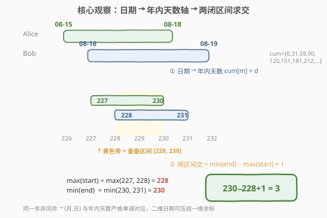
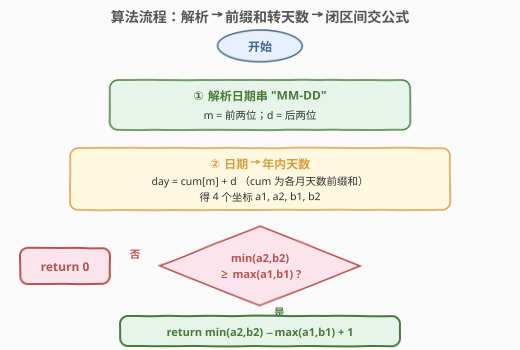
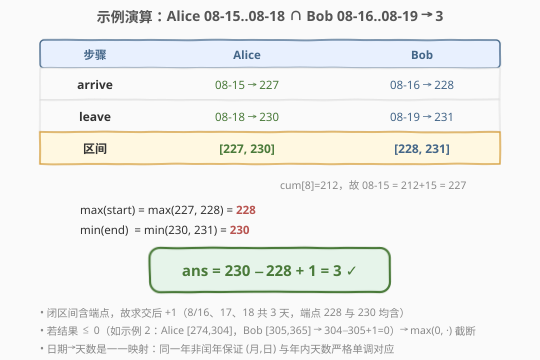

# 统计共同度过的日子数

- **题目名称**：统计共同度过的日子数
- **链接**：[2409. 统计共同度过的日子数](https://leetcode.cn/problems/count-days-spent-together/)
- **难度**：简单
- **标签**：数学、前缀和、区间

## 1. 题目概述

Alice 和 Bob 计划分别去罗马开会。给定四个字符串 `arriveAlice`、`leaveAlice`、`arriveBob`、`leaveBob`，格式均为 `"MM-DD"`。Alice 在 `[arriveAlice, leaveAlice]`（**闭区间**）期间在罗马，Bob 在 `[arriveBob, leaveBob]` 期间在罗马。求两人**同时在罗马的天数**。

**示例 1**：

```text
输入：arriveAlice = "08-15", leaveAlice = "08-18", arriveBob = "08-16", leaveBob = "08-19"
输出：3
解释：Alice 在 8/15–8/18，Bob 在 8/16–8/19，同时在罗马的日期为 8/16、8/17、8/18，共 3 天。
```

**示例 2**：

```text
输入：arriveAlice = "10-01", leaveAlice = "10-31", arriveBob = "11-01", leaveBob = "12-31"
输出：0
解释：Alice 在 10 月，Bob 在 11–12 月，没有同时在罗马的日子。
```

**约束条件**：

- 所有日期格式均为 `"MM-DD"`；
- 到达日期 **早于或等于** 离开日期；
- 所有日期在**同一个**自然年，且**非闰年**；每月天数依次为 $[31,28,31,30,31,30,31,31,30,31,30,31]$。

> 💡 **关键不变式**：题目看似在比较「日期」，但日期由 (月, 日) 两个维度构成、比较起来要先看月再看日。若能把日期压缩到**单一一维坐标**上，两人各自的在岗期就是数轴上的两个闭区间，所求即「两区间交集的长度」——一个 $O(1)$ 闭式即可表达。

---

## 2. 解题思路

### 2.1 暴力思路：逐日枚举判定

最直白的做法是**遍历这一年里的每一天**（1/1 至 12/31，共 365 天），对每个候选日判定它是否**同时落在两人的区间内**，计数即可：

```text
ans = 0
for day in 一年中每一天 (1/1 .. 12/31):       # 365 个候选日
    if arriveAlice ≤ day ≤ leaveAlice  and     # (月,日) 按字典序比较：先月后日
       arriveBob   ≤ day ≤ leaveBob:
        ans += 1
return ans
```

正确性没问题——闭区间含端点，逐日判定不会漏不会重。问题在于它把「求交集」退化成「枚举全集再逐点过滤」，循环 365 次，并且**没有揭示**「区间交集长度」这一更紧的结构。对 365 天能 AC，但思维上停在「枚举」一层。

> ⚠️ 暴力把「日期」当作必须逐个枚举的对象，但日期之间是**有序**的：同一年内，(月, 日) 与「年内第几天」存在严格单调的一一对应。一旦换到这条数轴，求共同天数立刻坍缩成一行公式。

### 2.2 核心观察：日期 → 年内天数轴 + 闭区间求交



关键在于两步**坐标变换 + 闭式求交**：

1. **日期 → 年内天数**：用各月天数的前缀和 $\text{cum}[m]$（即第 $1$ 到 $m-1$ 月的总天数），把 `"MM-DD"` 转成一个 $1 \sim 365$ 的整数坐标：

   $$
   \text{day}(m, d) = \text{cum}[m] + d,\qquad \text{cum}[m] = \sum_{i=1}^{m-1} \text{days}(i)
   $$

   例如非闰年 $\text{cum}[8] = 31+28+31+30+31+30+31 = 212$，故 `"08-15"` $\to 212+15 = 227$。

2. **闭区间求交**：设两人区间为 $[a_1, a_2]$、$[b_1, b_2]$（均已是一维坐标，且 $a_1 \le a_2,\; b_1 \le b_2$）。两闭区间交集的长度为：

   $$
   \text{overlap} = \max\!\bigl(0,\; \min(a_2, b_2) - \max(a_1, b_1) + 1\bigr)
   $$

   - $\max(a_1, b_1)$ 是交集**左端**（两人都到的最晚一天）；
   - $\min(a_2, b_2)$ 是交集**右端**（两人都走的最早一天）；
   - **$+1$** 因为是**闭区间**——端点当天也算在内（如 $[228,230]$ 含 228、229、230 共 3 天 $=230-228+1$）；
   - $\max(0, \cdot)$ 兜底两区间**不相交**的情形（左端 > 右端时结果 $\le 0$，截断为 $0$）。

> 💡 **为什么这一变换是合法的？** 合法性的根基是「同一年、非闰年」这一前提：它保证每月天数固定、各月拼接后 (月, 日) 与年内天数之间是**严格单调递增的一一映射**。于是「$d$ 同时在 $[a_1,a_2]$ 与 $[b_1,b_2]$ 内」这一二维命题，与「坐标 $d'$ 同时在两一维区间内」**完全等价**，二维日期问题无损地化为一维区间问题。

### 2.3 算法流程图



整个算法是**线性无循环**的：解析四个日期串 → 各自经前缀和转成年内天数坐标 → 套一次区间交公式 → 返回。决策菱形中的分支其实被 $\max(0,\cdot)$ 内化了——无论相交与否，公式统一给出正确答案（不相交时算出 $\le 0$，截断为 $0$），所以实现里甚至不需要 `if`。

### 2.4 示例演算



以示例 1 `arriveAlice="08-15", leaveAlice="08-18", arriveBob="08-16", leaveBob="08-19"` 演算：

**第一步——日期转年内天数**（$\text{cum}[8]=212$）：

| | Alice | Bob |
|------|-------|-----|
| arrive | `08-15` → $212+15=227$ | `08-16` → $212+16=228$ |
| leave  | `08-18` → $212+18=230$ | `08-19` → $212+19=231$ |
| 区间   | $[227, 230]$ | $[228, 231]$ |

**第二步——闭区间求交**：

| 量 | 计算 | 值 |
|----|------|----|
| 交集左端 | $\max(227, 228)$ | $228$ |
| 交集右端 | $\min(230, 231)$ | $230$ |
| 天数 | $230 - 228 + 1$ | $3$ ✓ |

对应日期 8/16、8/17、8/18 三天，与题意一致。

**示例 2 验证**：Alice `10-01..10-31` $\to [274,304]$，Bob `11-01..12-31` $\to [305,365]$。交集左端 $\max(274,305)=305$、右端 $\min(304,365)=304$，$304-305+1=0$，$\max(0,0)=0$ ✓。

> 💡 **边界提醒**：两区间**邻接**（如 $[1,5]$ 与 $[6,10]$）时，公式得 $5-6+1=0$——即「前一天结束、次日到达」不算同时在场，符合「同一天」语义；只有**端点重合**（如 $[1,5]$ 与 $[5,10]$）才得 $5-5+1=1$，恰算共同的那一天。

---

## 3. 参考代码

### C++

```cpp
class Solution {
    int toDay(const string& s) {
        static const int cum[13] = {0, 0, 31, 59, 90, 120, 151, 181, 212, 243, 273, 304, 334};
        int m = (s[0] - '0') * 10 + (s[1] - '0');
        int d = (s[3] - '0') * 10 + (s[4] - '0');
        return cum[m] + d;
    }
public:
    int countDaysTogether(string arriveAlice, string leaveAlice,
                          string arriveBob, string leaveBob) {
        int a1 = toDay(arriveAlice), a2 = toDay(leaveAlice);
        int b1 = toDay(arriveBob), b2 = toDay(leaveBob);
        return max(0, min(a2, b2) - max(a1, b1) + 1);
    }
};
```

> 💡 `cum[m]` 取「第 $m$ 月之前累计的天数」（1-indexed，`cum[1]=0`），故 `"MM-DD"` 的年内天数 $=\text{cum}[m]+d$。直接按下标解析字符（`s[0..1]` 为月、`s[3..4]` 为日）免去 `stoi` 与分隔符处理，常数更小。`cum` 设为 `static const` 让前缀表只在首次调用构造一次、随后常驻。

### Python

```python
class Solution:
    def countDaysTogether(self, arriveAlice: str, leaveAlice: str,
                          arriveBob: str, leaveBob: str) -> int:
        cum = [0, 0, 31, 59, 90, 120, 151, 181, 212, 243, 273, 304, 334]
        def to_day(s: str) -> int:
            m = int(s[:2]); d = int(s[3:])
            return cum[m] + d
        a1, a2 = to_day(arriveAlice), to_day(leaveAlice)
        b1, b2 = to_day(arriveBob), to_day(leaveBob)
        return max(0, min(a2, b2) - max(a1, b1) + 1)
```

> 💡 也可用 `datetime`：把 `"YYYY-MM-DD"` 喂给 `datetime.date` 后相减取 `days+1`，但需补一个固定年份且要处理「闰日不存在」的细节。手写 `cum` 表既绕开库依赖、也更显式地体现「前缀和坐标变换」这一核心思想，面试更易讲清。

---

## 4. 复杂度分析

| 维度 | 复杂度 | 说明 |
|------|--------|------|
| **时间复杂度** | $O(1)$ | 解析 4 个日期串 + 4 次前缀和转换 + 一次区间交公式，全部常数次运算 |
| **空间复杂度** | $O(1)$ | 仅 `cum` 表（13 个常量）与 4 个坐标变量 |
| 对照：逐日枚举 | $O(365)$ / $O(1)$ | 遍历 365 天逐个判定是否同时在两区间内，仍为常数但循环 365 次 |
| 对照：扫描线（推广到 $n$ 人） | $O(n\log n)$ / $O(n)$ | 求 $n$ 人最大同时在岗需事件排序 + 扫描，见第 5 节 |

> 💡 本题规模极小（4 个日期），任何常数做法都能 AC。真正的考点是**把二维日期问题降成一维区间问题**这一坐标变换，以及**闭区间求交 $+1$** 的细节——这是后续区间类题目的通用骨架。

---

## 5. 扩展：从 2 人到 N 人——扫描线 / 差分数组

本题是「2 个区间求交集长度」。若把规模推广到 $n$ 个人、每人一个在岗区间，问题就分化为两类：

| 问题 | 输出 | 方法 |
|------|------|------|
| **任两人同时在岗的天数** | 仍可用本题公式两两组合 | $O(n^2)$ 对区间交 |
| **同时在岗人数最多的时刻 / 天数** | 一个最值 | 扫描线 / 差分数组 |

后者正是 [1854. 人口最多的年份] 的骨架：把每个区间 $[l, r]$ 拆成「$l$ 处 $+1$、$r+1$ 处 $-1$」两个事件，按坐标排序后前缀和扫描，最大前缀和即为最大重叠数：

$$
\text{diff}[l]\mathrel{+}=1,\quad \text{diff}[r+1]\mathrel{-}=1;\qquad \text{cur} = \sum_{i}\text{diff}[i],\quad \text{ans} = \max(\text{cur})
$$

- 本题（2 人求交长）是**求两区间交的长度**——闭式 $\min(\text{end})-\max(\text{start})+1$；
- 1854（$n$ 人求最大重叠）是**求坐标轴上重叠计数的最值**——差分数组 + 前缀扫描。

> 💡 抽象经验：见到「若干区间、问在某点同时覆盖的数量」类问题，第一反应是**差分数组 / 扫描线**；见到「求两个区间的公共部分」类问题，第一反应是**闭区间交公式**。二者都是「区间投到一维轴」后衍生的工具，差别只在「求最值」还是「求交长」。

---

## 6. 面试要点

1. **为什么 $+1$？少加会怎样？**

   > 两人区间均为**闭区间**，端点当天算在内。交集 $[\max(a_1,b_1),\; \min(a_2,b_2)]$ 含两个端点，天数 $=$ 右 $-$ 左 $+ 1$。若少加 $1$，则示例 1 会得 $2$ 而非 $3$（漏掉一个端点对应的当天）。这和「数组区间 $[l,r]$ 的元素数 $=r-l+1$」是同一回事。

2. **$\max(0,\cdot)$ 何时真正生效？**

   > 当两区间**有间隙**时（$\min(a_2,b_2) < \max(a_1,b_1)$），公式原值得 $\le 0$。例 $[1,5]$ 与 $[7,10]$：$5-7+1=-1 \to 0$。注意**邻接**（$[1,5]$ 与 $[6,10]$）也得 $0$，符合「不在同一天」语义；只有端点重合（$[1,5]$ 与 $[5,10]$）才得 $1$。所以 $\max(0,\cdot)$ 把「相交 / 邻接 / 间隙」三种情形统一成一行公式，免去显式分支。

3. **日期转坐标为什么必须依赖「同一年、非闰年」？**

   > 这前提保证每月天数固定且 (月, 日) 与年内天数是**严格单调的一一映射**。若跨年或闰年，2 月天数可变、年份回绕，单凭 (月, 日) 不再唯一确定「第几天」——需引入完整 `date` 类型做差。本题把前提写在题面里，正是为了让坐标变换合法。

4. **能否不转坐标、直接比 (月, 日) 字典序？**

   > 能。`(month, day)` 的字典序与年内顺序一致，所以直接对四个日期做字典序比较即可：交集左端 $=\max(\text{arriveAlice}, \text{arriveBob})$、右端 $=\min(\text{leaveAlice}, \text{leaveBob})$，再做「右 $\ge$ 左则 $+1$」的差。但「天数」需要差，仍得把端点转回天数，故**转坐标一次**反而更干净——把比较与求差统一到同一数轴上。

5. **本题与 [986. 区间列表的交集] 的关系？**

   > 986 给两列**有序区间**，求它们两两交集列表，是「多对多区间交」的并集枚举；本题是 986 在「每人恰好一个区间」时的**单对特例**。986 的核心动作就是「取 $\max(\text{左})$、$\min(\text{右})$、若 $\le$ 则记交、结束早的区间进位」——把本题的公式嵌进双指针循环即得 986。

> 💡 **一句话总结**：日期经前缀和压成年内天数 $\to$ 两人区间投到一维数轴 $\to$ 共同天数 $=\max(0,\min(\text{end})-\max(\text{start})+1)$。$O(1)$ 闭式，$+1$ 源自闭区间、$\max(0,\cdot)$ 兜底不相交。

---

## 7. 同类练习题

- [1854. 人口最多的年份](https://leetcode.cn/problems/maximum-population-year/)：同样把人生区间 $[\text{birth}, \text{death}-1]$ 投到一维年份轴——本题求「两区间交长」，1854 求「最大重叠计数」，是扫描线/差分数组的自然进阶
- [986. 区间列表的交集](https://leetcode.cn/problems/interval-list-intersections/)：求两列有序区间两两交集，本题是其「每人单区间」的单对特例，核心同为 $\min(\text{end})-\max(\text{start})$ 公式嵌进双指针
- [56. 合并区间](https://leetcode.cn/problems/merge-intervals/)：区间**并集**，与本题的区间**交集**互为镜像（并 vs 交），同属区间投轴后的基础运算
- [435. 无重叠区间](https://leetcode.cn/problems/non-overlapping-intervals/)：按右端点贪心调度，区间家族另一方向——求「最少删除使无重叠」，对照本题「求已有重叠的长度」
- [1109. 航班预订统计](https://leetcode.cn/problems/corporate-flight-bookings/)：差分数组在区间轴上批量累加，是第 5 节推广到 $n$ 个区间「同时覆盖数」的标准工具
