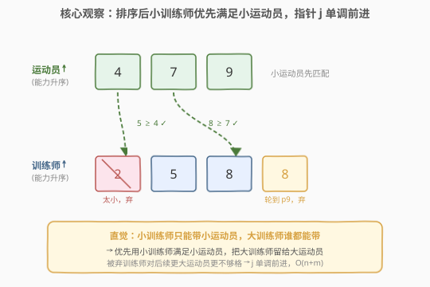
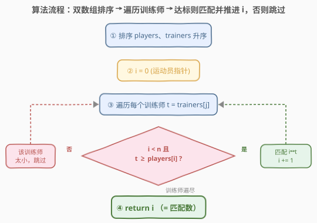

# LeetCode 运动员和训练师的最大匹配数 题解

## 1. 题目概述

- **标题 / 题号**：运动员和训练师的最大匹配数（#2410，medium）
- **链接**：https://leetcode.cn/problems/maximum-matching-of-players-with-trainers/
- **难度**：中等
- **标签**：贪心、数组、排序、双指针

**题意**：给你两个下标从 `0` 开始的整数数组 `players` 与 `trainers`，其中 `players[i]` 是第 `i` 名运动员的**能力值**，`trainers[j]` 是第 `j` 名训练师的**训练能力值**。若 `players[i] <= trainers[j]`，则运动员 `i` 可以**匹配**训练师 `j`。每名运动员至多匹配一位训练师，每位训练师至多匹配一名运动员。返回满足条件的**最大**匹配数。

**示例 1**：

```text
输入：players = [4,7,9], trainers = [8,2,5,8]
输出：2
解释：得到两个匹配的一种方案：
- players[0] 与 trainers[0] 匹配，因为 4 <= 8。
- players[1] 与 trainers[3] 匹配，因为 7 <= 8。
可以证明 2 是可以形成的最大匹配数。
```

**示例 2**：

```text
输入：players = [1,1,1], trainers = [10]
输出：1
解释：训练师可匹配任意一名运动员，但每名训练师至多匹配一名，故最大匹配数为 1。
```

**约束**：

- $1 \le \text{players.length},\ \text{trainers.length} \le 10^5$
- $1 \le \text{players}[i],\ \text{trainers}[j] \le 10^9$

> 💡 本题与 [455. 分发饼干](../0401-0500/455_分发饼干.md) **完全同构**：运动员 = 孩子（能力值 = 贪心因子），训练师 = 饼干（训练能力 = 饼干尺寸），`player <= trainer` 即「饼干够大能喂饱孩子」。因此同为「排序 + 双指针贪心」的招牌题。

## 2. 解题思路

### 2.1 暴力思路：二分图最大匹配 / 排序后逐个重扫

最自然的建模是**二分图最大匹配**：左侧运动员、右侧训练师，当 `player <= trainer` 时连边，求最大匹配。通用解法（匈牙利 / 增广路）复杂度 $O(|V| \cdot |E|)$，而本题 $n, m$ 均可达 $10^5$，完全二分图边数最坏 $10^{10}$，必然 TLE。

退一步，即便**先排序再贪心**，若对每个运动员都从训练师起点线性扫描、找「首个未用且达标」的训练师，每轮 $O(m)$、总计 $O(n \cdot m) = 10^{10}$，仍超时。瓶颈在于**重复扫描**那些已经判过「太小 / 已用」的训练师。

> ⚠️ 不排序的贪心甚至**不正确**：`players=[1,2], trainers=[2,1]`，按原序给 $p=1$ 配首个达标的 $t=2$，则 $p=2$ 无可用训练师（仅剩 $t=1 < 2$），得 `1`；但最优是 `2`（$p_1 \leftrightarrow 1,\ p_2 \leftrightarrow 2$）。可见**排序既是效率前提，更是正确性前提**。

### 2.2 核心观察：排序后训练师指针单调，双指针 $O(n+m)$



**关键直觉**：训练师的「带人能力」由其值决定——**小训练师只能带小运动员，大训练师谁都能带**。因此应**优先用小训练师去满足小运动员**，把大训练师留给更难满足的大运动员。这与「大饼干谁都能吃，留给胃口大的孩子」同理。

两个数组都升序排序后，维护训练师指针 $j$ 与「当前最小未匹配运动员」指针 $i$：

$$
\text{遍历训练师 } j = 0, 1, \dots, m-1 \;\Rightarrow\;
\begin{cases}
\text{trainers}[j] \ge \text{players}[i] & \text{匹配 } i \leftrightarrow j,\ i \mathrel{+}= 1 \\
\text{trainers}[j] < \text{players}[i] & \text{该训练师连最小未配运动员都带不动，永久跳过}
\end{cases}
$$

**单调性**：$j$ 只前进不回退——被跳过的训练师对当前及后续所有运动员都太小，永不再用。这把 $O(n \cdot m)$ 的重复扫描压成 $O(n + m)$。

**正确性（交换论证）**：设贪心首个匹配为 $p_1 \leftrightarrow t_k$（$t_k$ 是最小的 $\ge p_1$ 的训练师，故 $t_k \ge p_1$）。对任意最优解 $\text{OPT}$：

- $p_1$ 在 $\text{OPT}$ 中要么未匹配、要么配到某 $t_a$。若配了，因 $t_k$ 是最小达标者，必有 $a \ge k$，故 $t_a \ge t_k$；
- $t_k$ 在 $\text{OPT}$ 中要么未用、要么配给某 $p_b$。若配了，因 $p_1$ 是最小运动员，必有 $p_b \ge p_1$，又因合法匹配 $p_b \le t_k$。

把 $t_a$ 与 $t_k$ 的归属对换：$p_1 \leftrightarrow t_k$（$p_1 \le t_k$ ✓），$p_b \leftrightarrow t_a$（$p_b \le t_k \le t_a$ ✓）；若 $t_a$ 原本未用，则直接让 $p_1 \leftrightarrow t_k$。两种情形都得到一个「首匹配与贪心一致」且规模不减的最优解。删去 $p_1, t_k$ 归约为子问题，归纳即得**贪心最优**。

> 💡 这正是 455 分发饼干交换论证的复刻：把「最小达标资源」配给「最小需求者」从不亏，因为大资源能覆盖的集合 ⊇ 小资源覆盖的集合。

### 2.3 算法流程图



算法骨架：

1. **排序**：`players`、`trainers` 均升序排序；
2. **双指针**：`i = 0`（运动员），遍历 `trainers[j]`；
3. 若 `i < n` 且 `trainers[j] >= players[i]`：匹配，`i += 1`；
4. 否则跳过该训练师（`j` 自然推进）；
5. 训练师遍尽后返回 `i`，即匹配数。

无单独分支：`i` 走到 `n` 后 `if` 条件失效，剩余训练师自动略过；若某训练师太小则跳过，天然不浪费。

### 2.4 示例演算

![示例演算：players=[4,7,9]、trainers=[2,5,8,8] 排序后逐步匹配](../images/mmpt_example_walkthrough.svg)

以示例 1 `players = [4,7,9], trainers = [8,2,5,8]` 为例。先排序：

- $\text{players} = [4, 7, 9]$
- $\text{trainers} = [2, 5, 8, 8]$

设 `i = 0`，遍历训练师：

| 步 | `j` | `trainers[j]` | 当前 `players[i]` | 判定 | 动作 | `i`（已匹配） |
|----|-----|---------------|-------------------|------|------|----------------|
| 1 | 0 | 2 | 4 | $2 < 4$ ✗ | 跳过（带不动最小运动员） | 0 |
| 2 | 1 | 5 | 4 | $5 \ge 4$ ✓ | 匹配 $p_4 \leftrightarrow t_5$ | 1 |
| 3 | 2 | 8 | 7 | $8 \ge 7$ ✓ | 匹配 $p_7 \leftrightarrow t_8$ | 2 |
| 4 | 3 | 8 | 9 | $8 < 9$ ✗ | 跳过 | 2 |

最终 `i = 2`，返回 `2` ✓。注意第 1 步 `trainers[0]=2` 连最小的 `4` 都带不动，永久废弃；第 4 步虽 `trainers[3]=8` 与第 3 步同值，但已轮到能力 `9` 的运动员，$8 < 9$ 故也废弃——体现「同一训练能力值在不同运动员面前命运不同，排序后指针单调决定去留」。

> 💡 若不排序直接贪心，可能把 `trainers[0]=8` 配给 $p_4$、`trainers[3]=8` 配给 $p_7$，恰好也得 2——但这只是巧合。换 `trainers=[8,2,5,8]` 不排序、按原序给 $p_9$ 先配 `8` 仍得 2；真正出错的是前述 `players=[1,2], trainers=[2,1]` 一类。**排序保证贪心策略对任意输入都正确**。

## 3. 参考代码

### C++

```cpp
class Solution {
public:
    int matchPlayersAndTrainers(vector<int>& players, vector<int>& trainers) {
        sort(players.begin(), players.end());
        sort(trainers.begin(), trainers.end());
        int i = 0, n = (int)players.size();
        for (int t : trainers) {
            if (i < n && t >= players[i]) ++i;
        }
        return i;
    }
};
```

> 💡 `i` 既是「当前最小未匹配运动员下标」，又恰好等于「已匹配数」——遍历结束时无需额外变量。`if` 内 `i < n` 守门，运动员全配完后剩余训练师自动略过，零分支特判。`t >= players[i]` 用 `>=` 而非 `>`，因题意「小于等于」即达标。

### Python

```python
class Solution:
    def matchPlayersAndTrainers(self, players: List[int], trainers: List[int]) -> int:
        players.sort()
        trainers.sort()
        i = 0
        n = len(players)
        for t in trainers:
            if i < n and t >= players[i]:
                i += 1
        return i
```

> 💡 也可换「遍历运动员、内层 `while` 推进训练师指针」的对称写法：对每个 `players[i]`，`while j < m and trainers[j] < players[i]: j += 1`，再 `if j < m: i += 1; j += 1`。两种写法等价，遍历训练师的版本更紧凑（无内层 `while`）。

## 4. 复杂度分析

| 维度 | 复杂度 | 说明 |
|------|--------|------|
| **时间复杂度** | $O(n \log n + m \log m)$ | 排序主导；双指针扫描仅 $O(n + m)$，每个元素至多访问一次 |
| **空间复杂度** | $O(\log n + \log m)$ | 原地排序的递归栈；若不计排序栈可视为 $O(1)$ 额外空间 |
| 对照：二分图最大匹配 | $O(\|V\| \cdot \|E\|)$ | 通用解法，最坏边数 $10^{10}$，$n,m=10^5$ 不可行 |
| 对照：排序后逐个重扫 | $O(n \cdot m)$ | 正确但每个运动员从头重扫，重复访问已跳过项 |

> 💡 当 $n, m$ 量级相近时，排序 $O(n \log n + m \log m) \approx 10^5 \times 17 \approx 1.7 \times 10^6$，远低于 $10^8$ 阈值，轻松 AC。瓶颈在排序而非扫描——这是「排序 + 双指针」类题的典型特征：用一次 $O(\log)$ 排序换取线性扫描。

## 5. 扩展：贪心成立的结构条件与变体边界

贪心在本题成立，依赖两个**结构条件**：

1. **阈值型邻接**：边是否存在仅由 `player <= trainer` 这一处比较决定，且「达标」关系关于训练师值**单调**——训练师越大，能匹配的运动员集合越大（$\ge$ 关系对训练师值单调增）。
2. **一对一 + 无权目标**：每方至多匹配一个，目标是**最大化匹配数**（计数），而非带权最优。

这两个条件共同保证「最小达标资源配给最小需求者」的交换总不损失匹配数。一旦放宽：

| 变体 | 贪心是否仍成立 | 替代解法 |
|------|----------------|----------|
| 每位训练师可带 $k$ 名运动员 | ✅ 成立 | 同贪心，`i` 每次最多推进 $k$ |
| 运动员有权重、求**最大权和匹配** | ❌ 不成立 | 排序 + DP / 费用流 |
| 一名运动员可匹配多名训练师 | ✅ 成立 | 退化为「每个训练师能带就带」，$i$ 改为已匹配数仍单调 |
| 边带收益、容量约束一般 | ❌ | 二分图带权匹配 / KM / 费用流 |

> 💡 经验：见到「一对一配对 + 计数最值 + 阈值邻接」三件套，先想排序双指针贪心；一旦出现「权值」或「容量非 1」，立刻升级到 DP 或流。

## 6. 面试要点

1. **为什么不排序的贪心会出错？**

   > 排序前训练师顺序任意，可能让大运动员先抢走某个小运动员唯一可用的「恰好达标」训练师，而该大运动员本可用更大的训练师。反例 `players=[1,2], trainers=[2,1]`：原序给 $p_1$ 配 $t_2$ 后 $p_2$ 无解，得 1；最优是 2。排序后小运动员优先用小训练师，大训练师自动留给大运动员，杜绝「抢错」。

2. **贪心为何最优？（交换论证）**

   > 设贪心首配 $p_1 \leftrightarrow t_k$（$t_k$ 为最小 $\ge p_1$ 的训练师）。在任意最优解 $\text{OPT}$ 中，$p_1$ 配的 $t_a$ 必满足 $t_a \ge t_k$，$t_k$ 配的 $p_b$ 必满足 $p_b \ge p_1$ 且 $p_b \le t_k$。对换 $t_a, t_k$ 归属：$p_1 \leftrightarrow t_k$（$p_1 \le t_k$ ✓）、$p_b \leftrightarrow t_a$（$p_b \le t_k \le t_a$ ✓），匹配数不变。故存在首配与贪心一致的最优解，归纳即得贪心最优。

3. **指针 `j` 为什么单调不回退？**

   > 被跳过的训练师 `trainers[j]` 满足 `< players[i]`。因 `players` 升序，后续运动员能力更大，该训练师对它们同样太小，永不再用。故 `j` 只前进。这让双指针总位移 $O(n + m)$，而非每轮重扫。

4. **`i` 既是下标又是答案，是否需要特判？**

   > 不需要。`if i < n` 守门：运动员全配完后条件失效，剩余训练师自动略过；若最小运动员都大于所有训练师，则全程 `t >= players[i]` 不成立，`i` 留 `0`，天然返回 `0`。零分支特判，靠指针语义兜底。

5. **本题与 455 分发饼干、881 救生艇的区别？**

   > 三者同为「排序 + 双指针贪心配对」，但配对结构不同：455 与 2410 **完全同构**（一对一、阈值邻接、最大化计数），代码几乎逐行对应；881 救生艇是「船限 2 人 + 限重」，双指针从两端收缩——重的先上、轻的尽量凑同一艘，方向相反且每船容量为 2，是「配对计数」的另一变体。

> 💡 **一句话总结**：排序两个数组 + 遍历训练师、达标即配最小未匹配运动员 ⟹ $O(n \log n + m \log m)$。「最小达标资源配最小需求者」的交换论证保证最优，指针单调压出线性扫描——与 455 分发饼干同构。

## 同类练习题

| # | 题目 | 与本题的关联 |
|---|------|-------------|
| 455 | [分发饼干](https://leetcode.cn/problems/assign-cookies/)（[题解](../0401-0500/455_分发饼干.md)） | **本质同构母题**，孩子=运动员、饼干=训练师，代码逐行对应，先做此题再回看 2410 即可融会贯通 |
| 881 | [救生艇](https://leetcode.cn/problems/boats-to-save-people/)（[题解](../0801-0900/881_救生艇.md)） | 同为排序 + 双指针贪心配对，但「船限 2 人 + 限重」使两端收缩方向相反，体会配对贪心的不同变体 |
| 435 | [无重叠区间](https://leetcode.cn/problems/non-overlapping-intervals/)（[题解](../0401-0500/435_无重叠区间.md)） | 区间贪心（按右端点排序），同「排序后贪心选择、指针单调」范式，对照「配对型」与「区间调度型」贪心 |
| 611 | [有效三角形的个数](https://leetcode.cn/problems/valid-triangle-number/)（[题解](../0601-0700/611_有效三角形的个数.md)） | 排序 + 双指针，但是**计数型**（数满足 `a+b>c` 的三元组），对照本题的「匹配型」用法 |
| 252 | [会议室](https://leetcode.cn/problems/meeting-rooms/)（[题解](../0201-0300/252_会议室.md)） | 区间贪心判定（按结束时间排序看能否全安排），同「排序 + 贪心选择」骨架，对照「配对计数型」与「区间调度型」贪心 |
