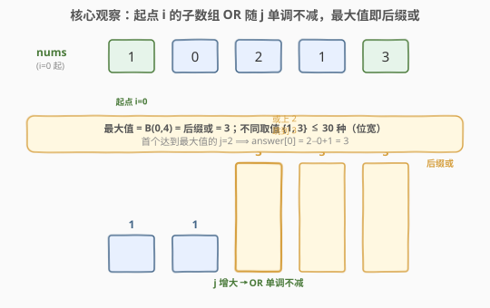

# LeetCode 按位或最大的最小子数组长度 题解

## 1. 题目概述

- **标题 / 题号**：按位或最大的最小子数组长度（#2411，medium）
- **链接**：https://leetcode.cn/problems/smallest-subarrays-with-maximum-bitwise-or/
- **难度**：中等
- **标签**：位运算、数组、二分查找、滑动窗口

**题意**：给定长度为 $n$、下标从 $0$ 开始的非负整数数组 `nums`。对每个下标 $i \in [0, n-1]$，求**以 $i$ 为起点**的**最短非空子数组**，使其按位或值在所有「起点为 $i$ 的子数组」中**最大**。返回数组 `answer`，其中 `answer[i]` 为该最短子数组的长度。

记 $B_{ij}$ 为子数组 `nums[i..j]` 的按位或。对每个 $i$，最大或值为 $\max_{i \le k \le n-1} B_{ik}$，`answer[i]` 即取到该最大值的最短子数组（起点固定为 $i$）的长度。

**示例 1**：

```text
输入：nums = [1,0,2,1,3]
输出：[3,3,2,2,1]
解释：任一起点的最大或值都是 3。
- i=0：取到 3 的最短子数组是 [1,0,2]，长度 3。
- i=1：取到 3 的最短子数组是 [0,2,1]，长度 3。
- i=2：取到 3 的最短子数组是 [2,1]，长度 2。
- i=3：取到 3 的最短子数组是 [1,3]，长度 2。
- i=4：取到 3 的最短子数组是 [3]，长度 1。
```

**示例 2**：

```text
输入：nums = [1,2]
输出：[2,1]
解释：i=0 时整个后缀 [1,2] 或值 3 最大，最短取到 3 的子数组长度为 2；
     i=1 时 [2] 自身即最大，长度 1。
```

**约束**：

- $n = \text{nums.length}$
- $1 \le n \le 10^5$
- $0 \le \text{nums}[i] \le 10^9$

> 💡 本题与 [898. 子数组按位或操作](../0801-0900/898_子数组按位或操作.md) 共享同一颗「按位或单调性」母套路：子数组 OR 随端点扩展单调不减，故每个端点处不同 OR 值至多 30 种。898 数「不同值的个数」，本题「定位取到最大值的最短端点」——同一性质的两面。

## 2. 解题思路

### 2.1 暴力思路：对每个起点向右扩展到最大值

对每个 $i$，先求后缀或 $\text{sufOR}[i] = \text{nums}[i] \mid \text{sufOR}[i+1]$（即最大或值，下节证明），再用游标 $j$ 从 $i$ 向右扩展、维护累积或 $\text{cur}$，直到 $\text{cur} = \text{sufOR}[i]$，记录 $j - i + 1$。

单看每个 $i$ 的内层扫描就是 $O(n)$，总计 $O(n^2) = 10^{10}$，必然超时。瓶颈：每个起点都「从零开始」重新累积或，重复扫描了大量本可被右邻居复用的信息。

> ⚠️ 后缀或本身 $O(n)$ 可预处理，问题出在「对每个 $i$ 重新找最短右端点 $j$」这第二层循环。要压成线性，必须利用或运算的结构。

### 2.2 核心观察：后缀或即最大值，且起点左移时不同或值至多 30 种



**观察一（最大值 = 后缀或）**：按位或只把比特位从 $0 \to 1$，永不可逆。故对固定起点 $i$，$B_{ij} = \text{OR}(\text{nums}[i..j])$ 随 $j$ **单调不减**，上界在 $j = n-1$ 处取到，即**后缀或**

$$\text{sufOR}[i] = \text{OR}(\text{nums}[i..n-1]) = \max_{i \le k \le n-1} B_{ik}.$$

问题归约为：对每个 $i$，求最小的 $j \ge i$ 使 $\text{OR}(\text{nums}[i..j]) = \text{sufOR}[i]$，则 $\text{answer}[i] = j - i + 1$。

**观察二（不同或值至多 30 种）**：$B_{ij}$ 随 $j$ 单调不减，取**不同值**时每一次跳变值都严格变大，意味着至少新增一个原本为 $0$ 的比特位变 $1$。而 $\text{nums}[i] \le 10^9 < 2^{30}$，可用比特位 $\le 30$，故以 $i$ 为起点的所有子数组 OR 的不同取值 $\le 30$ 种。

> 💡 这一「不同值 $\le$ 位宽」正是 898 的招牌结论。它直接排除了「起点左移后列表爆炸」的可能，是后续滚动更新 $O(n)$ 的根基。

**观察三（滚动更新 $O(30)$）**：设 $\text{dp}_{i+1}$ 是以 $i+1$ 为起点的「（或值, 最早右端点）」对，按值严格递增、端点严格递增排列。从 $i+1$ 推到 $i$ 分三步：

1. **整体或上 nums[i]**：$\text{dp}_{i+1}$ 中每个值 $v_t$ 变成 $v_t \mid \text{nums}[i]$（端点不变）；
2. **表头前置自身**：把 $(\text{nums}[i],\ i)$ 放到表头（长度为 1 的子数组 `nums[i..i]`）；
3. **合并相邻等值**：或上 $\text{nums}[i]$ 后可能出现相邻相同值，去掉重复，**保留更早的端点**（更短子数组优先）。

合并后仍是「值严格递增、端点严格递增」的列表，长度 $\le 30$。**表尾**即最大值 $\text{sufOR}[i]$，其端点即所求最短右端点 $j$。因此

$$\text{answer}[i] = (\text{表尾端点}) - i + 1.$$

每步 $O(30)$，整体 $O(30n)$。

### 2.3 算法流程图

![算法流程：从右向左遍历，每步把 dp 表整体或上 nums[i]、表头插入自身、合并相邻等值，表尾端点减 i 加 1 即答案](../images/smor_dp_update_flow.svg)

算法骨架：

1. **逆序遍历** $i = n-1, n-2, \dots, 0$，维护滚动列表 `cur`（值严格递增、端点严格递增）；
2. 新表 `nxt` 先放 $(\text{nums}[i],\ i)$；
3. 遍历 `cur` 的每个 $(v_t, j_t)$：令 $\text{val} = v_t \mid \text{nums}[i]$；若 $\text{val} \ne$ `nxt` 末元素的值，则追加 $(\text{val},\ j_t)$（否则跳过——等值保留更早端点）；
4. `cur = nxt`，记 $\text{answer}[i] = \text{cur}$ 末元素端点 $-\ i + 1$；
5. 返回 `answer`。

无需特判：`cur` 末元素恒为后缀或——若 `nums[i]` 自身已含全部后缀比特（即 `nums[i] == sufOR[i]`），则合并后表头即表尾、端点 $= i$、答案 $1$；`nums[i] = 0` 时不贡献比特，仅作占位表头，若与后继等值会被合并跳过。

### 2.4 示例演算

![示例演算：nums=[1,0,2,1,3] 从右向左滚动更新 dp 表，合并等值保留更早端点](../images/smor_example_walkthrough.svg)

以示例 1 `nums = [1,0,2,1,3]` 为例（仅用到 2 个比特位，$2^{30}$ 内同理）。

| $i$ | $\text{nums}[i]$ | 入表前 `cur`（值,端点） | 合并后 `cur`（值,端点） | 末端点 | $\text{answer}[i]$ |
|-----|------------------|--------------------------|--------------------------|--------|---------------------|
| 4 | 3 | （空） | $(3,4)$ | 4 | $4-4+1=1$ |
| 3 | 1 | $(3,4)$ | $(1,3),\ (3,4)$ | 4 | $4-3+1=2$ |
| 2 | 2 | $(1,3),\ (3,4)$ | $(2,2),\ (3,3)$ | 3 | $3-2+1=2$ |
| 1 | 0 | $(2,2),\ (3,3)$ | $(0,1),\ (2,2),\ (3,3)$ | 3 | $3-1+1=3$ |
| 0 | 1 | $(0,1),\ (2,2),\ (3,3)$ | $(1,0),\ (3,2)$ | 2 | $2-0+1=3$ |

逐行说明（重点看 $i=2$ 与 $i=0$ 的合并）：

- **$i=2$**：入表前 `cur` = $(1,3),(3,4)$。表头放 $(2,2)$。旧值 $1 \mid 2 = 3$ 与表头值 $2$ 不同 → 追加 $(3,3)$；旧值 $3 \mid 2 = 3$ 与前一新值 $3$ 相同 → 跳过（保留更早端点 $3$）。结果 $(2,2),(3,3)$，末端点 $3$，答案 $2$。旧的 $(3,4)$ 被「吸收」进 $(3,3)$，因 $[2,1]$ 已达或值 $3$，不必延伸到 $4$。
- **$i=0$**：入表前 `cur` = $(0,1),(2,2),(3,3)$。表头放 $(1,0)$。旧值 $0 \mid 1 = 1$ 与表头值 $1$ 相同 → 跳过（保留端点 $0$）；旧值 $2 \mid 1 = 3$ 与前值 $1$ 不同 → 追加 $(3,2)$；旧值 $3 \mid 1 = 3$ 与前值 $3$ 相同 → 跳过。结果 $(1,0),(3,2)$，末端点 $2$，答案 $3$。注意 $[1]$ 单独或值 $1$ 并非最大（最大 $3$ 需延伸到 $j=2$），表头 $1$ 只是中间态，但**没有更早端点能取代它**，故保留。

最终 $\text{answer} = [3,3,2,2,1]$ ✓。

> 💡 合并时被跳过的项，其「值」已被某个**更早端点**的项覆盖（更短子数组取到相同或值），故对「求最短」毫无损失。这正是「不同值 $\le 30$」能压成线性的微观体现。

## 3. 参考代码

### C++

```cpp
class Solution {
public:
    vector<int> smallestSubarrays(vector<int>& nums) {
        int n = nums.size();
        vector<int> ans(n);
        vector<pair<int,int>> cur;   // (or_val, idx)，值严格递增、端点严格递增
        for (int i = n - 1; i >= 0; --i) {
            vector<pair<int,int>> nxt;
            nxt.emplace_back(nums[i], i);
            for (auto& [v, j] : cur) {
                int val = v | nums[i];
                if (nxt.back().first != val) nxt.emplace_back(val, j);
            }
            cur = move(nxt);
            ans[i] = cur.back().second - i + 1;
        }
        return ans;
    }
};
```

> 💡 `cur` 规模恒 $\le 30$，故 `nxt` 重建为 $O(30)$。`nxt.back().first != val` 一行既保证**值严格递增**又实现**等值保留更早端点**（跳过后继）。无需单独维护后缀或数组：表尾天然就是后缀或，其端点即答案右端点。

### Python

```python
class Solution:
    def smallestSubarrays(self, nums: List[int]) -> List[int]:
        n = len(nums)
        ans = [1] * n
        cur = []   # [(or_val, idx)] 值严格递增、端点严格递增
        for i in range(n - 1, -1, -1):
            nxt = [(nums[i], i)]
            for v, j in cur:
                val = v | nums[i]
                if nxt[-1][0] != val:
                    nxt.append((val, j))
            cur = nxt
            ans[i] = cur[-1][1] - i + 1
        return ans
```

> 💡 也可对 `cur` 原地「或上 `nums[i]`」后表头插入再合并；但 Python 列表头部插入是 $O(\text{len})$，而 $\text{len} \le 30$ 可忽略。重建成新表更简洁，且天然保证端点递增顺序（旧表已递增、表头最前）。

## 4. 复杂度分析

| 维度 | 复杂度 | 说明 |
|------|--------|------|
| **时间复杂度** | $O(30n)$ | 每个起点滚动更新 $\le 30$ 个不同或值；$30$ 来自 $\text{nums}[i] < 2^{30}$ 的位宽 |
| **空间复杂度** | $O(30) \approx O(1)$ | 滚动表 `cur` 至多 30 对（不计输出数组） |
| 对照：逐起点向右扩展 | $O(n^2)$ | 每个 $i$ 从零累积或，最坏扫描到数组末尾 |
| 对照：ST 表 + 二分端点 | $O(n \log n)$ | 预处理区间或，对每个 $i$ 二分最小 $j$，可行但常数与编码量更大 |

> 💡 当 $n = 10^5$ 时 $30n \approx 3 \times 10^6$，远低于 $10^8$ 阈值。位宽 $30$ 是 $\text{nums}[i] \le 10^9$ 的副产物——值域越小（如 $\le 10^3$）位宽越小，越快。

## 5. 扩展：等价视角与变体边界

**等价视角：按位「最近置位位置」**。另一种等价实现：从右向左维护每个比特位 $b$ **最近一次被置 1 的下标** $\text{nxt}[b]$。处理 $i$ 时，先用 $\text{nums}[i]$ 更新其置位比特的 $\text{nxt}$，再令

$$j = \max_{b \in \text{bits}(\text{sufOR}[i])} \text{nxt}[b], \qquad \text{answer}[i] = j - i + 1,$$

其中 $\text{bits}(x)$ 表示 $x$ 中为 $1$ 的位集合。直觉：要使 $\text{OR}(\text{nums}[i..j]) = \text{sufOR}[i]$，必须把后缀里**每个**被置 1 的位都在 $[i, j]$ 内「凑齐」至少一次出现，故 $j$ 取各位置位下标的**最大**。两个实现同构，都是「位级单调性」的产物——前者按**或值**分组，后者按**比特位**分组，复杂度同为 $O(30n)$。

**变体边界**：

| 变体 | 滚动表是否仍 $O(30n)$ | 备注 |
|------|------------------------|------|
| 求最大或的**最长**子数组 | ✅ | 合并时改为保留**更晚端点**，表尾端点改为「最晚达到」即可 |
| 求或值 $\ge K$ 的最短子数组（[3097](https://leetcode.cn/problems/shortest-subarray-with-or-at-least-k-ii/)） | ❌ 需改造 | 或值非精确匹配而是阈值，需滑窗 + 比特计数维护 |
| 元素可为负数 | ❌ | 按位或对负数（补码）不再单调不减，单调性失效 |
| 值域 $\le 10^{18}$（位宽 60） | ✅ 但常数翻倍 | 不同或值上限变 60，仍线性 |

> 💡 见到「按位或 + 子数组 + 最值」三件套，先抓「或单调不减 $\Rightarrow$ 不同值 $\le$ 位宽」这把钥匙；再判断任务是**计数**（898）、**定位最短端点**（2411）、还是**阈值最短**（3097），以决定合并策略。

## 6. 面试要点

1. **为什么每个起点的最大或值就是后缀或？**

   > 按位或只会把比特 $0 \to 1$、永不可逆。对固定起点 $i$，$B_{ij}$ 随 $j$ 单调不减，故 $j$ 越大值越大，上界在 $j = n-1$，即 $\text{OR}(\text{nums}[i..n-1])$。最大值即后缀或，无需对每个 $k$ 真正比较。

2. **为什么不同或值至多 30 种？**

   > 单调不减序列取不同值时，每次跳变值都严格变大，意味着至少新增一个原本为 $0$ 的比特位变 $1$。可用比特位 $\le 30$（因 $\text{nums}[i] < 2^{30}$），故至多跳变 30 次、即至多 30 个不同值。这是 $O(30n)$ 的复杂度根基。

3. **滚动更新时为什么要「合并相邻等值并保留更早端点」？**

   > 起点左移一位、或上 $\text{nums}[i]$ 后，可能出现「相邻两个值相等」——说明后继端点对应的子数组或值与更早端点相同，更晚的端点只产生**更长**的等值子数组，对「求最短」无用，故丢弃以保表严格递增。保留更早端点即保留最短。

4. **表尾一定是后缀或吗？需要单独维护后缀或数组吗？**

   > 是。表尾值 $= \text{nums}[i] \mid (\text{dp}_{i+1}\text{ 的表尾值}) = \text{nums}[i] \mid \text{sufOR}[i+1] = \text{sufOR}[i]$，归纳即得表尾恒为后缀或。故无需单独数组，`cur.back()` 既是最大值、其端点又是答案右端点，一举两得。

5. **本题与 898 的关系？**

   > 同源。898 数「子数组或的不同值总数」，用「右端点滚动集合」；本题「定位取到最大值的最短右端点」，用「左端点（起点）滚动（值, 端点）对」。两者都靠「或单调 $\Rightarrow$ 不同值 $\le$ 位宽」把 $O(n^2)$ 压成 $O(30n)$，只是滚动的端点方向与表项语义不同。898 的表项是「值」，本题多了「最早端点」这一维度。

> 💡 **一句话总结**：后缀或即每个起点的最大值；或单调不减使不同值 $\le 30$，从右向左滚动「或 + 前置自身 + 合并等值保留早端点」$O(30n)$，表尾端点减起点加 1 即答案——898 同套母套路的左端点版。

## 同类练习题

| # | 题目 | 与本题的关联 |
|---|------|-------------|
| 898 | [子数组按位或操作](https://leetcode.cn/problems/bitwise-ors-of-subarrays/)（[题解](../0801-0900/898_子数组按位或操作.md)） | **同源母题**，数子数组或的不同值总数，用右端点滚动集合；本题多了「最早端点」维度，对照右端点 vs 左端点滚动方向 |
| 1521 | [找到最接近目标值的函数值](https://leetcode.cn/problems/find-a-value-of-a-mysterious-function-closest-to-target/)（[题解](../1501-1600/1521_找到最接近目标值的函数值.md)） | 同样利用「子数组或单调 $\Rightarrow$ 不同值 $\le$ 位宽」滚动枚举，从「计数」转为「最接近目标值」，同一单调性的另一问法 |
| 3097 | [或值至少为 K 的最短子数组 II](https://leetcode.cn/problems/shortest-subarray-with-or-at-least-k-ii/) | 或值由「精确最大」变为「阈值 $\ge K$」，对照「定位最短端点」与「滑窗 + 比特计数」两种合并策略 |
| 201 | [数字范围按位与](https://leetcode.cn/problems/bitwise-and-of-numbers-range/)（[题解](../0201-0300/201_数字范围按位与.md)） | 按位**与**随右端点扩展单调**不减的反面——递减，同样有「不同值 $\le$ 位宽」，是 OR/AND 单调性的对偶题 |
| 53 | [最大子数组和](https://leetcode.cn/problems/maximum-subarray/)（[题解](../0001-0100/53_最大子数组和.md)） | 同为「子数组最值」母题，但用和而非或、无位运算单调性，对照「和可正可负非单调」与「或单调不减」的本质差异 |
