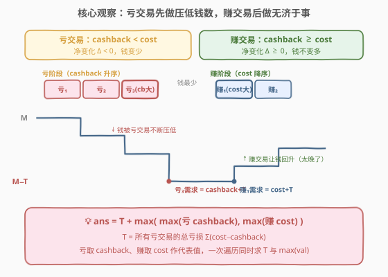
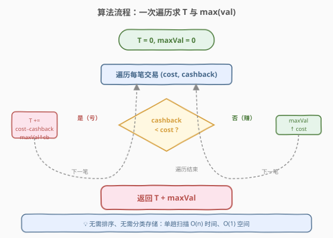
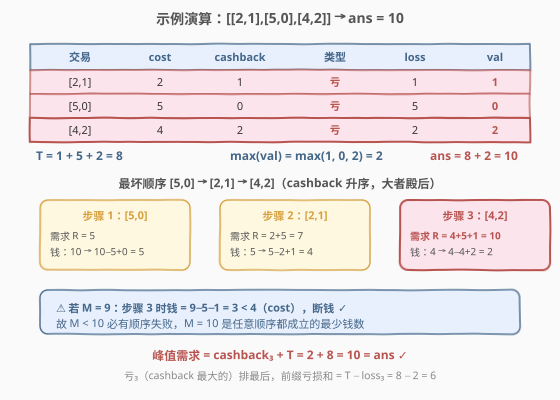

# LeetCode 完成所有交易的初始最少钱数 题解

## 1. 题目概述

- **标题 / 题号**：完成所有交易的初始最少钱数（#2412，hard）
- **链接**：https://leetcode.cn/problems/minimum-money-required-before-transactions/
- **难度**：困难
- **标签**：贪心、数组、排序、交换论证

**题意**：给定若干笔交易 `transactions[i] = [costi, cashbacki]`，每笔交易必须以**某种顺序恰好完成一次**。任意时刻你持有钱数 `money`，执行交易 `i` 需满足 `money >= costi`，执行后钱数变为 `money - costi + cashbacki`。求**任意一种**交易顺序下都能完成所有交易的最少初始钱数。

**示例 1**：

```text
输入：transactions = [[2,1],[5,0],[4,2]]
输出：10
解释：money = 10 时交易可以以任意顺序进行；money < 10 时某些顺序下交易无法完成。
```

**示例 2**：

```text
输入：transactions = [[3,0],[0,3]]
输出：3
解释：顺序 [[3,0],[0,3]] 需 3；顺序 [[0,3],[3,0]] 需 0。故初始 3 即可让任意顺序都成立。
```

**约束**：

- $1 \le \text{transactions.length} \le 10^5$
- $\text{transactions}[i].\text{length} == 2$
- $0 \le \text{cost}_i, \text{cashback}_i \le 10^9$

> 💡 本题关键是「**任意顺序**」——钱数必须扛得住**最坏顺序**（对手选最不利于你的排列）。于是问题转化为：在所有排列中，找到使「所需初始钱数」最大的那个排列，其所需钱数即为答案。

## 2. 解题思路

### 2.1 暴力思路：枚举全排列

最直白的做法：枚举所有 $n!$ 种交易顺序，对每种顺序模拟执行过程，求该顺序下不中途断钱所需的最小初始钱数，再取所有顺序中的最大值。

但 $n \le 10^5$，$n!$ 是天文数字，完全不可行。

> ⚠️ 暴力的盲点在于把「顺序」当黑盒逐个试。其实每笔交易只有两类——**做完钱变多**（赚）或**做完钱变少**（亏）——对手的最坏策略只取决于这笔交易是赚是亏，与具体身份无关。按「赚/亏」分类后，最坏顺序的结构立刻浮现。

### 2.2 核心观察：分类 + 最坏顺序分析



记每笔交易的**净变化** $\Delta_i = \text{cashback}_i - \text{cost}_i$，据此分两类：

| 类别 | 条件 | 净变化 | 形象 |
|------|------|--------|------|
| **亏交易**（losing） | $\text{cashback}_i < \text{cost}_i$ | $\Delta_i < 0$ | 花出去的钱比收回的多，钱变少 |
| **赚交易**（winning） | $\text{cashback}_i \ge \text{Cost}_i$ | $\Delta_i \ge 0$ | 收回的钱不少于花出去的，钱不变多则变少 |

**第一步——对手为何把所有亏交易排在前面？**

用**交换论证**：若某排列中有一笔赚交易 $W$ 紧跟在一笔亏交易 $L$ 之后……不，反过来——若一笔赚交易 $W$ 排在一笔亏交易 $L$ **之前**，考虑交换成 $L$ 在 $W$ 前。设交换前 $W$ 处钱数为 $m$（含前缀净变化），则：

- 交换前（$W$ 先 $L$ 后）：这两步的需求贡献为 $\max(\text{cost}_W,\ \text{cost}_L - \Delta_W)$（相对 $m$）
- 交换后（$L$ 先 $W$ 后）：变为 $\max(\text{cost}_L,\ \text{cost}_W + \text{loss}_L)$

由于 $\Delta_W \ge 0$（赚）而 $\text{loss}_L > 0$（亏），有 $\text{cost}_L - \Delta_W \le \text{cost}_L$ 且 $\text{cost}_W + \text{loss}_L > \text{cost}_W$，故交换后两项需求均**不小于**交换前，最大值**不降**。即对手偏好「亏在前、赚在后」。反复交换可得最坏顺序 = **所有亏交易在前，所有赚交易在后**。

> 💡 直觉：亏交易让钱越来越少，对手趁你钱还多时先把亏的做完，把你的钱压到最低谷；赚交易只会让钱回升，对手把它留到最后，无法帮你扛过亏交易阶段的高 cost。

**第二步——亏交易内部的最坏顺序。**

记亏交易集合为 $\mathcal{L}$，亏交易总亏损 $T = \sum_{i \in \mathcal{L}} (\text{cost}_i - \text{cashback}_i)$。在某顺序中，亏交易 $j$ 排第 $k$ 位时，其需求为：

$$R_j = \text{cost}_j + \sum_{\text{排在 } j \text{ 前的亏交易}} (\text{cost} - \text{cashback})$$

$j$ 前面的亏损之和 $\le T - \text{loss}_j$（等号当 $j$ 排最后），故 $R_j \le \text{cost}_j + T - \text{loss}_j = \text{cashback}_j + T$。对手要让某个 $R_j$ 尽量大，就把 $\text{cashback}_j$ 最大的那个亏交易**排最后**，此时 $R_j = \max_{i \in \mathcal{L}} \text{cashback}_i + T$，且任何排列都无法超过此上界。故：

$$\text{亏阶段最坏需求} = T + \max_{i \in \mathcal{L}} \text{cashback}_i$$

**第三步——赚交易内部的最坏顺序。**

亏阶段结束后钱数为 $M - T$。赚交易净变化 $\ge 0$，越往后做钱越多，对手要让某个赚交易需求最大，就把 $\text{cost}$ 最大的赚交易**排最前**（此时前缀增益为 $0$）：

$$\text{赚阶段最坏需求} = T + \max_{i \in \mathcal{W}} \text{cost}_i$$

> ⚠️ 注意赚交易的需求是 $\text{cost}_i + T$（要加上亏阶段已经亏掉的 $T$），因为赚阶段开始时钱已被亏掉 $T$。

**第四步——合并。**

整体最坏需求 = 两阶段取大：

$$\boxed{\;\text{ans} = T + \max\Big(\max_{i \in \mathcal{L}} \text{cashback}_i,\ \ \max_{i \in \mathcal{W}} \text{cost}_i\Big)\;}$$

进一步统一：对每笔交易取一个「代表值」$\text{val}_i = \begin{cases}\text{cashback}_i & \text{亏} \\ \text{cost}_i & \text{赚}\end{cases}$，则 $\text{ans} = T + \max_i \text{val}_i$。

### 2.3 算法流程图



**完整步骤**：

1. 遍历所有交易，累加亏交易的亏损：$T \mathrel{+}= \max(0,\ \text{cost}_i - \text{cashback}_i)$。
2. 对每笔交易取代表值 $\text{val}_i$（亏取 cashback，赚取 cost），维护 $\max \text{val}$。
3. 返回 $T + \max \text{val}$。

> 💡 只需**一次遍历**同时累积 $T$ 与 $\max \text{val}$，无需排序、无需分类存储，$O(n)$ 时间 $O(1)$ 空间。

### 2.4 示例演算



以示例 1 `transactions = [[2,1],[5,0],[4,2]]` 演算（三笔均为亏交易）：

| 交易 | cost | cashback | 类型 | loss | val（cashback） |
|------|------|----------|------|------|-----------------|
| $[2,1]$ | 2 | 1 | 亏 | 1 | 1 |
| $[5,0]$ | 5 | 0 | 亏 | 5 | 0 |
| $[4,2]$ | 4 | 2 | 亏 | 2 | 2 |

- $T = 1 + 5 + 2 = 8$
- $\max \text{val} = \max(1, 0, 2) = 2$
- $\text{ans} = 8 + 2 = 10$ ✓

**验证最坏顺序** $[5,0] \to [2,1] \to [4,2]$（cashback 升序，最大的 $2$ 排最后）：

| 步 | 交易 | 需求 $R$ | 钱（$M=10$） |
|----|------|----------|-------------|
| 1 | $[5,0]$ | $5$ | $10 \to 5$ |
| 2 | $[2,1]$ | $2+5=7$ | $5 \to 4$ |
| 3 | $[4,2]$ | $4+5+1=10$ | $4 \to 2$ |

峰值需求 $= 10$，与公式吻合。若 $M=9$：第 3 步钱 $= 9-5-1=3 < 4$，断钱 ✓。

> 💡 示例 2 `[[3,0],[0,3]]`：$[3,0]$ 亏（loss 3），$[0,3]$ 赚。$T=3$，val 取 $\max(\text{cb}=0,\ \text{cost}=0)=0$，$\text{ans}=3+0=3$ ✓。最坏顺序是亏在前：$[3,0] \to [0,3]$ 需 $3$；而 $[0,3] \to [3,0]$ 仅需 $0$——这正是「任意顺序」要扛住最坏的那个。

## 3. 参考代码

### C++

```cpp
class Solution {
public:
    long long minimumMoney(vector<vector<int>>& transactions) {
        long long totalLoss = 0;
        long long maxVal = 0;
        for (auto& t : transactions) {
            long long cost = t[0], cashback = t[1];
            if (cashback < cost) {
                totalLoss += cost - cashback;
                maxVal = max(maxVal, cashback);
            } else {
                maxVal = max(maxVal, cost);
            }
        }
        return totalLoss + maxVal;
    }
};
```

### Python

```python
class Solution:
    def minimumMoney(self, transactions: List[List[int]]) -> int:
        total_loss = 0
        max_val = 0
        for cost, cashback in transactions:
            if cashback < cost:
                total_loss += cost - cashback
                max_val = max(max_val, cashback)
            else:
                max_val = max(max_val, cost)
        return total_loss + max_val
```

> 💡 **溢出注意**：$n \le 10^5$、$\text{cost} \le 10^9$，$T$ 可达 $10^{14}$，故 C++ 必须用 `long long`；Python 无溢出之忧。返回类型题目给 `long long`（C++）/ `int`（Python，自动大整数）。

## 4. 复杂度分析

| 维度 | 复杂度 | 说明 |
|------|--------|------|
| **时间复杂度** | $O(n)$ | 一次遍历，每笔 $O(1)$ 处理 |
| **空间复杂度** | $O(1)$ | 仅维护 `totalLoss` 与 `maxVal` 两个变量 |

> 💡 对比暴力 $O(n!)$ 与「排序 + 贪心」$O(n \log n)$：本题连排序都不需要——分类后代表值与 $T$ 可在单趟扫描中同时求出，是理论最优。

## 5. 扩展：最坏顺序为何如此——交换论证补全

### 5.1 亏在赚前的交换论证

设排列中赚交易 $W$ 紧跟在亏交易 $L$ 之前，记 $W$ 起点处（含前缀净变化）的相对钱数为 $m$。

- **交换前**（$W$ 先）：$W$ 需 $m \ge \text{cost}_W$；做完 $W$ 钱变 $m + \Delta_W$（$\Delta_W \ge 0$），$L$ 需 $m + \Delta_W \ge \text{cost}_L$。两步需求 $\max(\text{cost}_W,\ \text{cost}_L - \Delta_W)$。
- **交换后**（$L$ 先）：$L$ 需 $m \ge \text{cost}_L$；做完 $L$ 钱变 $m - \text{loss}_L$，$W$ 需 $m - \text{loss}_L \ge \text{cost}_W$ 即 $m \ge \text{cost}_W + \text{loss}_L$。两步需求 $\max(\text{cost}_L,\ \text{cost}_W + \text{loss}_L)$。

因 $\Delta_W \ge 0 \Rightarrow \text{cost}_L - \Delta_W \le \text{cost}_L$；又 $\text{loss}_L > 0 \Rightarrow \text{cost}_W + \text{loss}_L > \text{cost}_W$。故交换后两项均不小于交换前，最大值不降。对手偏好亏在前。∎

### 5.2 亏交易内部：cashback 大者殿后

对亏交易 $j$，$R_j = \text{cost}_j + \text{前缀亏损和} \le \text{cost}_j + (T - \text{loss}_j) = \text{cashback}_j + T$，等号当 $j$ 排最后。对手让 $\text{cashback}$ 最大者殿后即达上界，且任何排列不超此界。∎

### 5.3 赚交易内部：cost 大者当先

赚阶段起点钱 $= M - T$，此后只增不减。$\text{cost}$ 最大的赚交易排最前时前缀增益为 $0$，需求 $= \text{cost} + T$ 最大。∎

> 💡 三段交换论证拼出最坏顺序：**亏交易在前（cashback 升序）→ 赚交易在后（cost 降序）**，但最终公式只需 $T + \max(\text{val})$，不必真去排序。

## 6. 面试要点

1. **为什么是「最坏顺序」而不是「最佳顺序」？**

   > 题目要求「任意一种顺序下都能完成」，即钱数须扛住**所有**排列，等价于扛住最坏那一个。所以求的是 $\max_{\text{排列}} (\text{该排列所需初始钱数})$，而非 $\min$。

2. **交换论证的核心一步是什么？**

   > 把「赚在亏前」换成「亏在赚前」后，两步需求 $\max(\text{cost}_W,\ \text{cost}_L - \Delta_W) \to \max(\text{cost}_L,\ \text{cost}_W + \text{loss}_L)$，因 $\Delta_W \ge 0$、$\text{loss}_L > 0$，后者两项都不小于前者，最大值不降。说明对手总偏好亏在前。

3. **公式里为什么亏交易取 cashback、赚交易取 cost？**

   > 亏交易最坏时排亏阶段最后，前缀亏损 $= T - \text{loss}$，需求 $= \text{cost} + T - \text{loss} = \text{cashback} + T$，故代表值取 cashback。赚交易最坏时排赚阶段最前，前缀增益 $= 0$，需求 $= \text{cost} + T$，故代表值取 cost。

4. **不排序为什么也对？**

   > 公式只用到 $T$（亏交易总亏损，与顺序无关）和 $\max(\text{val})$（各交易代表值的最大值，与顺序无关）。最坏顺序虽存在（cashback 升序 + cost 降序），但求最坏需求**值**时不需要真排——交换论证已把值算清。

5. **数据范围与溢出怎么处理？**

   > $T$ 可达 $n \times \text{cost} \approx 10^5 \times 10^9 = 10^{14}$，超出 32 位。C++ 用 `long long`，Python 自动大整数无需操心。返回值同为 64 位。

> 💡 **一句话总结**：把交易按「亏/赚」分类，亏的总亏损 $T$ 加上「亏取 cashback、赚取 cost」中的最大值，即为扛住任意顺序的最少初始钱数。一次遍历 $O(n)$/$O(1)$，连排序都省了。

## 同类练习题

| # | 题目 | 与本题的关联 |
|---|------|-------------|
| 1665 | [完成所有任务的最少初始能量](https://leetcode.cn/problems/minimum-initial-energy-to-finish-tasks/) | 每任务有「实际消耗」与「启动门槛」，求最少初始能量；同为本题的「最坏顺序 + 交换论证」套路，门槛 vs 实际消耗的差即净变化 |
| 1354 | [多次求和构造目标数组](https://leetcode.cn/problems/construct-target-array-with-multiple-sums/) | 贪心反向构造，与本题同为「找不变量定最值」的贪心思维 |
| 621 | [任务调度器](https://leetcode.cn/problems/task-scheduler/) | 安排任务顺序使总时长最短，贪心按最高频任务插槽，与本题「最坏顺序分析」对照（一个求最短、一个求最少钱） |
| 881 | [救生艇](https://leetcode.cn/problems/boats-to-save-people/) | 排序 + 贪心双指针配对，与本题同为贪心家族，但本题连排序都省 |
