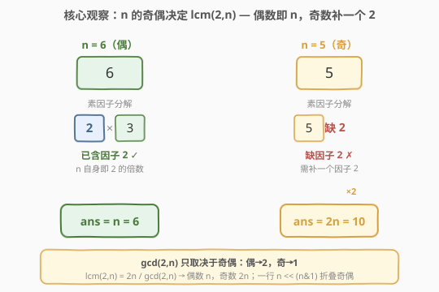
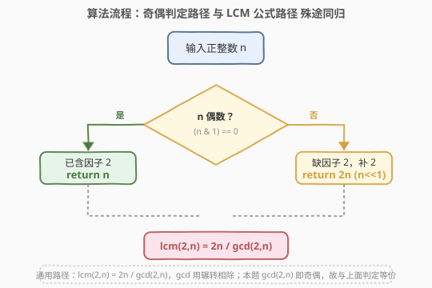
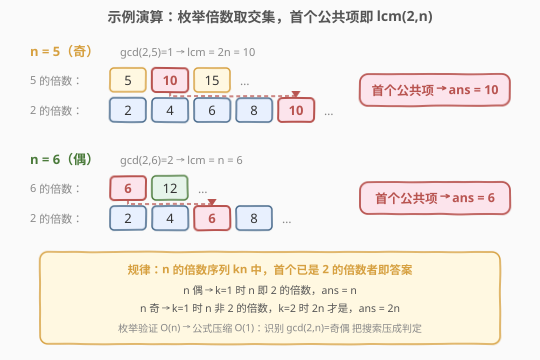

# LeetCode 最小偶倍数 题解

## 1. 题目概述

- **标题 / 题号**：最小偶倍数（#2413，easy）
- **链接**：https://leetcode.cn/problems/smallest-even-multiple/
- **难度**：简单
- **标签**：数学、位运算、数论

**题意**：给你一个正整数 $n$，返回 $2$ 和 $n$ 的**最小公倍数**（正整数）。

**示例 1**：

```text
输入：n = 5
输出：10
解释：5 和 2 的最小公倍数是 10。
```

**示例 2**：

```text
输入：n = 6
输出：6
解释：6 和 2 的最小公倍数是 6。注意数字会是它自身的倍数。
```

**约束**：

- $1 \le n \le 150$

> 💡 表面是「最小公倍数」，但因其中一个操作数被**固定为 2**，问题退化为「奇偶判定」，是 LCM 的极简退化情形。下文从枚举出发，逐步压缩到 $O(1)$ 公式与一行位运算。

## 2. 解题思路

### 2.1 暴力思路：枚举倍数求交集

最小公倍数的定义是「同时是 $2$ 的倍数和 $n$ 的倍数的最小正整数」。最朴素的实现是**枚举**：

- 枚举 $n$ 的倍数序列 $n, 2n, 3n, \dots$，逐个检查能否被 $2$ 整除，**首个**能被 $2$ 整除的就是答案；或
- 枚举 $2$ 的倍数序列 $2, 4, 6, 8, \dots$，逐个检查能否被 $n$ 整除，**首个**能被 $n$ 整除的就是答案。

由于 $n \le 150$，最坏情形 $n = 149$（奇数），枚举 $2$ 的倍数要到 $2 \times 149 = 298$ 才命中，即遍历约 $149$ 步；枚举 $n$ 的倍数则最多到第 $2$ 个（$2n$）即命中。两者都能 AC，但本质都是**线性搜索**，未利用问题结构。

> ⚠️ 枚举法暴露一个事实：答案一定是 **$n$ 的某个倍数**（因为它必须是 $n$ 的倍数）。问题只是「最小的那个倍数到底是 $n$ 还是 $2n$」。这引出下文的奇偶观察。

### 2.2 核心观察：奇偶性决定答案，$O(1)$ 公式



**关键直觉**：答案是 $\text{lcm}(2, n)$。利用 LCM 与 GCD 的对偶关系：

$$
\text{lcm}(a, b) = \frac{a \cdot b}{\gcd(a, b)}
$$

代入 $a = 2$：

$$
\text{lcm}(2, n) = \frac{2n}{\gcd(2, n)}
$$

而 $\gcd(2, n)$ **只取决于 $n$ 的奇偶**：

| $n$ 的奇偶 | $\gcd(2, n)$ | $\text{lcm}(2, n) = \dfrac{2n}{\gcd(2, n)}$ | 直觉 |
|-----------|--------------|---------------------------------------------|------|
| 偶数 | $2$ | $\dfrac{2n}{2} = n$ | $n$ 已含因子 $2$，自身即 $2$ 的倍数 |
| 奇数 | $1$ | $\dfrac{2n}{1} = 2n$ | $n$ 不含因子 $2$，补一个 $2$ 才行 |

于是答案化为一条**奇偶判定**：

$$
\text{ans} = \begin{cases} n, & n \text{ 为偶数} \\ 2n, & n \text{ 为奇数} \end{cases}
$$

**更直观的视角**（不借助 GCD）：要找「$2$ 的倍数 $\cap$ $n$ 的倍数」的最小元。$n$ 的倍数序列是 $n, 2n, 3n, \dots$。第一个 $kn$ 是否已经是 $2$ 的倍数？

- 若 $n$ 偶数，$k = 1$ 时 $n$ 本身就是 $2$ 的倍数 $\to$ 答案 $n$；
- 若 $n$ 奇数，$k = 1$ 的 $n$ 不是 $2$ 的倍数，但 $k = 2$ 的 $2n$ 必是 $2$ 的倍数（含因子 $2$）$\to$ 答案 $2n$。

> 💡 等价的位运算一行解：偶数 $n$ 的最低位为 $0$，奇数 $n$ 最低位为 $1$。`n & 1` 即「奇偶标志」——奇数为 $1$、偶数为 $0$。于是 $\text{ans} = n \ll (n\,\&\,1)$：奇数则左移 $1$ 位（乘 $2$），偶数则左移 $0$ 位（不变）。把「补因子 $2$」直接编码成移位量，无分支。

### 2.3 算法流程图



两条等价路径殊途同归：

1. **奇偶判定路径**：直接看 $n$ 是否偶数 $\to$ 偶返回 $n$、奇返回 $2n$，$O(1)$；
2. **LCM 公式路径**：$\text{lcm}(2, n) = 2n / \gcd(2, n)$，其中 $\gcd$ 用辗转相除或直接奇偶判定，同样 $O(1)$。

对本题（固定 $a = 2$）二者等价；若推广为「$a$ 和 $b$ 的 LCM」，奇偶判定失效，需走 LCM 公式 + 通用 GCD。

### 2.4 示例演算



- **示例 1** $n = 5$（奇）：$\gcd(2, 5) = 1$（$2$ 与 $5$ 互质），$\text{lcm} = \dfrac{2 \times 5}{1} = 10$。枚举验证：$5$ 的倍数 $5, 10, \dots$，$2$ 的倍数 $2, 4, 6, 8, 10, \dots$，首个公共的是 $10$ ✓。
- **示例 2** $n = 6$（偶）：$\gcd(2, 6) = 2$（$2$ 整除 $6$），$\text{lcm} = \dfrac{2 \times 6}{2} = 6$。枚举验证：$6$ 的倍数 $6, 12, \dots$，$2$ 的倍数 $2, 4, 6, \dots$，首个公共的是 $6$ ✓（$6$ 本身已是 $2$ 的倍数）。

## 3. 参考代码

### C++

```cpp
class Solution {
public:
    int smallestEvenMultiple(int n) {
        return n & 1 ? n << 1 : n;
    }
};
```

> 💡 `n & 1` 取最低位判奇偶；奇数则 `n << 1`（乘 $2$），偶数原样返回。也可写更直白的 `n % 2 == 0 ? n : 2 * n`，或走 LCM 公式 `2 * n / gcd(2, n)`——三者等价，移位版最紧凑且无分支预测友好。

### Python

```python
class Solution:
    def smallestEvenMultiple(self, n: int) -> int:
        return n if n % 2 == 0 else n * 2
```

> 💡 Python 整型无溢出，同样可用 `n << (n & 1)`。也可写 `2 * n // math.gcd(2, n)` 走通用 LCM 公式，便于向「任意两数 LCM」推广。

## 4. 复杂度分析

| 维度 | 复杂度 | 说明 |
|------|--------|------|
| **时间复杂度** | $O(1)$ | 一次奇偶判定 + 至多一次乘 $2$，常数步 |
| **空间复杂度** | $O(1)$ | 无额外存储 |
| 对照：枚举倍数 | 最坏 $O(n)$ | 枚举 $2$ 的倍数到首个 $n$ 的倍数，奇数 $n$ 要走约 $n$ 步 |
| 对照：通用 LCM 公式 | $O(\log \min(a, b))$ | 辗转相除求 $\gcd$；本题 $a = 2$ 退化为 $O(1)$ |

> 💡 本题是 LCM 的「退化到极简」情形：因其中一个操作数固定为 $2$，$\gcd$ 退化为奇偶判定，整个 LCM 退化为「补不补一个因子 $2$」。一旦两操作数都任意，就回到 $O(\log \min(a, b))$ 的通用 GCD/LCM。

## 5. 扩展：通用 LCM 与多值归约

本题固定 $a = 2$ 使 LCM 退化为奇偶判定。一般情形下：

**两数 LCM**：

$$
\text{lcm}(a, b) = \frac{a \cdot b}{\gcd(a, b)}, \qquad \gcd(a, b) = \text{辗转相除}(a, b)
$$

实现注意：为防 $a \cdot b$ 溢出，常写 `a / gcd(a, b) * b`（先除后乘）。本题 $n \le 150$，$2n$ 最大 $300$，无溢出风险。

**多个数 LCM**：可逐个归约，$\text{lcm}(a, b, c) = \text{lcm}(\text{lcm}(a, b), c)$，因为 LCM 满足结合律。

**LCM 与 GCD 的对偶**：$\gcd$ 是「取共有的素因子（最小幂）」，$\text{lcm}$ 是「取出现的素因子（最大幂）」。对本题：

- $n$ 偶数：素因子分解含 $2^1$，$\text{lcm}(2, n)$ 取 $2$ 的幂 $\max(1, 1) = 1$ $\to$ 不增因子 $\to$ 答案 $n$；
- $n$ 奇数：$n$ 不含 $2$，$\text{lcm}(2, n)$ 取 $2$ 的幂 $\max(1, 0) = 1$ $\to$ 补一个 $2$ $\to$ 答案 $2n$。

> 💡 由此可秒判：若推广为「$k$ 和 $n$ 的最小公倍数」（$k$ 固定），答案 $= n \times \dfrac{k}{\gcd(k, n)}$，即「把 $n$ 补齐到包含 $k$ 的全部素因子」。本题 $k = 2$，奇数 $n$ 缺因子 $2$，补一个 $2$ 即 $2n$。

## 6. 面试要点

1. **为什么奇数答案恰好是 $2n$ 而非更大？**

   > 奇数 $n$ 不含因子 $2$，而 $2$ 含 $2^1$。$\text{lcm}$ 要求取 $2$ 的幂 $\max(1, 0) = 1$，故答案至少含一个因子 $2$。$n$ 的倍数序列 $n, 2n, 3n, \dots$ 中，$2n$ 是第一个含因子 $2$ 的（因为 $n$ 奇数时 $kn$ 含因子 $2$ 当且仅当 $k$ 偶数，最小偶 $k$ 为 $2$）。故 $2n$ 既是 $n$ 的倍数又含因子 $2$，且是最小者。

2. **偶数时为什么 $n$ 自身就是答案？**

   > 偶数 $n$ 含因子 $2$，故 $n$ 本身已是 $2$ 的倍数，同时当然是 $n$ 的倍数。$n$ 是「$n$ 的倍数」中第一个正数，必为最小，故答案就是 $n$。

3. **能否不分类讨论直接给公式？**

   > 可以：$\text{ans} = \dfrac{2n}{\gcd(2, n)}$。在 C++ 中可用 `2 * n / gcd(2, n)` 或自写 $\gcd$。但 $\gcd(2, n)$ 实质就是奇偶判定，展开后等价于分类讨论。位运算版 `n << (n & 1)` 把分类折叠进移位量，最简洁。

4. **枚举法为何不是最优？**

   > 枚举要在倍数序列里线性搜索首个公共项，最坏 $O(n)$。而利用「$\gcd(2, n)$ 只取决于奇偶」的结构，直接 $O(1)$ 出答案。这是「用数论结构把搜索压成公式」的典型范例：识别问题里的特殊常数（此处 $a = 2$）能让通用 $O(\log)$ 算法退化为 $O(1)$。

5. **推广：求 $\text{lcm}(k, n)$ 怎么做？**

   > 通用公式 $\text{lcm}(k, n) = kn / \gcd(k, n)$，用辗转相除求 $\gcd$，复杂度 $O(\log \min(k, n))$。若 $k$ 是素数（如本题 $k = 2$），则 $\gcd(k, n) \in \{1, k\}$：$k \mid n$ 时答案 $n$，否则答案 $kn$——即「$n$ 是否已含 $k$ 的全部素因子」决定是否补 $k$。

> 💡 **一句话总结**：答案是 $\text{lcm}(2, n) = 2n / \gcd(2, n)$，因 $a = 2$ 固定而 $\gcd$ 退化为奇偶判定 $\to$ 偶数返 $n$、奇数返 $2n$，一行位运算 `n << (n & 1)` 即可。

## 同类练习题

| # | 题目 | 与本题的关联 |
|---|------|-------------|
| 1071 | [字符串的最大公因子](https://leetcode.cn/problems/greatest-common-divisor-of-strings/)（[题解](../1001-1100/1071_字符串的最大公因子.md)） | 把 GCD 从整数推广到字符串（公共前后缀），同为辗转相除思想，对照「数论 GCD」与「字符串 GCD」 |
| 1979 | [找出数组的最大公约数](https://leetcode.cn/problems/find-greatest-common-divisor-of-array/)（[题解](../1901-2000/1979_找出数组的最大公约数.md)） | 数组最大最小元素的 GCD，$\gcd$ 的直接练习，承接本题辗转相除基础 |
| 914 | [卡牌分组](https://leetcode.cn/problems/x-of-a-kind-in-a-deck-of-cards/)（[题解](../0901-1000/914_卡牌分组.md)） | 各计数频率的 GCD 是否 $\ge 2$，GCD 聚合应用，对照「两数 GCD」与「多频 GCD」 |
| 365 | [水壶问题](https://leetcode.cn/problems/water-and-jug-problem/)（[题解](../0301-0400/365_水壶问题.md)） | 用 Bézout 定理 $\gcd(a, b)$ 判定可量出的水量，GCD 的数论应用，体会 GCD 的更深含义 |
| 149 | [直线上最多的点数](https://leetcode.cn/problems/max-points-on-a-line/)（[题解](../0101-0200/149_直线上最多的点数.md)） | 用 GCD 化简分数表示斜率，GCD 作为「规范化工具」，对照本题的「判定工具」 |
