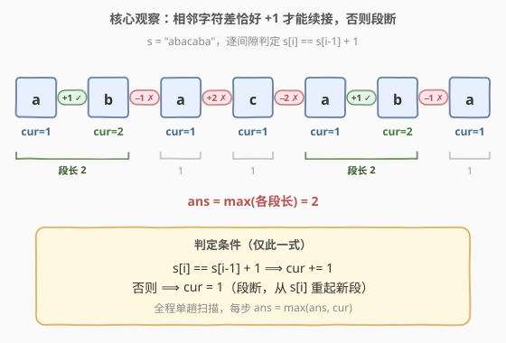
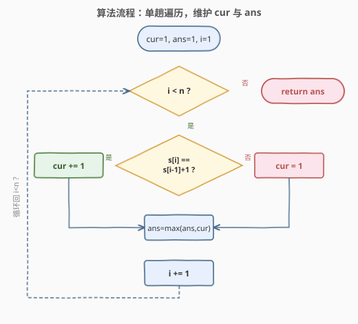
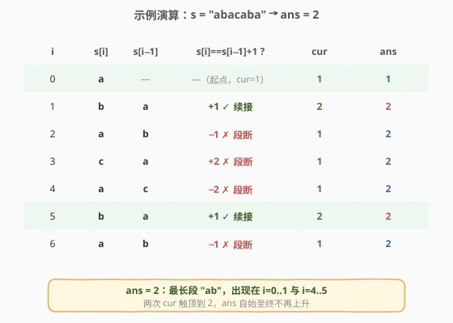

# 最长的字母序连续子字符串的长度

- **题目名称**：最长的字母序连续子字符串的长度
- **链接**：[2414. 最长的字母序连续子字符串的长度](https://leetcode.cn/problems/length-of-the-longest-alphabetical-continuous-substring/)
- **难度**：中等
- **标签**：字符串、一次遍历

## 1. 题目概述

**字母序连续字符串**是由字母表中连续字母组成的字符串——等价地，它是 `"abcdefghijklmnopqrstuvwxyz"` 的某个子串（连续切片）。换句话说，子串中每相邻两个字符满足后一个恰是前一个的「下一个字母」：$s[i] = s[i-1] + 1$。例如 `"abc"`、`"ab"`、`"xyz"` 都是，而 `"acb"`（不连续）、`"za"`（方向相反）不是。

给你一个仅由小写英文字母组成的字符串 `s`，返回其**最长**的字母序连续子字符串的长度。

**示例 1**：

```text
输入：s = "abacaba"
输出：2
解释：最长的字母序连续子字符串是 "ab"（出现在首尾两处），长度为 2。
```

**示例 2**：

```text
输入：s = "abcde"
输出：5
解释："abcde" 本身就是字母序连续字符串，长度为 5。
```

**约束条件**：

- $1 \le \text{s.length} \le 10^5$
- `s` 仅由小写英文字母组成

> 💡 **关键不变式**：题目对子串的约束**只涉及相邻字符**——「后一个是否恰为前一个 $+1$」。这种「相邻位置谓词」型的约束天然适配一次扫描：沿串滑动一个游标，逐个间隙判谓词，谓词成立则当前段长 $+1$，否则段断、从当前字符重起一段长为 $1$ 的新段。全程只需维护两个标量 `cur` 与 `ans`，无需哈希、无需窗口、无需回看。

---

## 2. 解题思路

### 2.1 暴力思路：枚举所有子串

最直白的做法是**枚举所有子串起点 $i$ 与终点 $j$**，对每个 $s[i..j]$ 验证其内部每对相邻字符都满足 $s[k] = s[k-1] + 1$，取合法者中长度的最大值。

```text
ans = 1                                   # 单字符恒合法
枚举起点 i = 0 .. n-1:
    枚举终点 j = i+1 .. n-1:
        检查 s[i..j] 是否每对相邻都 +1 递增
        若合法: ans = max(ans, j - i + 1)
return ans
```

正确性没问题，但枚举 $(i,j)$ 共 $O(n^2)$ 对、每对验证最坏 $O(n)$，总 $O(n^3)$。即便利用「一旦某间隙破坏 $+1$ 即可从该处断开、终点不必再往后扫」把验证摊还进枚举得到 $O(n^2)$，对 $n \le 10^5$ 仍是 $10^{10}$ 量级，不可行。它把「相邻谓词可在线增量维护」这一结构完全忽略，对每个起点都从头独立判段。

> ⚠️ 暴力把每个子串当成独立对象去验证，但实际上相邻间隙的判定**可累加**——前一个间隙 $+1$ 成立，则当前段长自然 $+1$；不成立，段在当前间隙处**唯一地**断开。这把 $O(n^2)$ 的子串枚举压成 $O(n)$ 的单趟扫描。

### 2.2 核心观察：相邻字符差 $+1$ 维护当前段长



**贪心策略**：从左到右扫描，维护**当前连续段长度** `cur` 与**全局最长** `ans`。从 $i=1$ 起逐个间隙判断：

- 若 $s[i] = s[i-1] + 1$：当前段向后延展一位，`cur += 1`；
- 否则：段在 $s[i-1]$ 与 $s[i]$ 之间断开，从 $s[i]$ 起另起一段长为 $1$ 的新段，`cur = 1`。

每步执行 `ans = max(ans, cur)`，遍历结束返回 `ans`。

**正确性**：设某合法字母序连续子串起点为 $i$、终点为 $j$。由定义，其内部每个间隙 $k \in [i+1, j]$ 都满足 $s[k] = s[k-1]+1$。反之，从 $i$ 起只要这些间隙逐一成立，段长恰好 $j-i+1$——这正是 `cur` 在 $i$ 处被重置为 $1$ 后一路累加到 $j$ 处所得的值。因此 `cur` 在每一格的值，**恰等于以当前位置为右端点的最长合法子串长度**；`ans` 取其全程最大即得答案。无需「选择起点」——任何起点对应的子串，其长度都已被 `cur` 在到达其终点时所捕获。

> 💡 **一句话直觉**：`cur` 不是「某条段的长度」，而是「以 $s[i]$ 收尾的最长合法段长」。每多走一格，要么段能续 $+1$ 则 `cur` 自增、要么段被间隙判据否决则 `cur` 归 $1$——二者必居其一，状态在字符流上增量推进，$O(n)$ 一趟扫完。

### 2.3 算法流程图



一次遍历即可完成：`cur = 1`、`ans = 1`、`i = 1` 起步（$n \ge 1$ 时单字符即一段长 $1$）。循环条件 `i < n`，循环体先判 `s[i] == s[i-1] + 1` 决定 `cur += 1` 还是 `cur = 1`，再 `ans = max(ans, cur)`，最后 `i += 1`。循环退出返回 `ans`。

> 💡 判定用 `s[i] == s[i-1] + 1`：C++ 中 `s[i-1]` 为 `char`，`+1` 提升为 `int`，与 `s[i]` 比较时后者亦提升为 `int`，等价于 `ord` 比较，可直接写无需调用函数。Python 中字符不能与整数直接比较，需 `ord(s[i]) == ord(s[i-1]) + 1`。

### 2.4 示例演算



以示例 1 `s = "abacaba"` 演算（设初值 `cur = 1`、`ans = 1`）：

| $i$ | $s[i]$ | $s[i-1]$ | $s[i] = s[i-1]+1\,?$ | 动作 | `cur` | `ans` |
|-----|--------|----------|----------------------|------|-------|-------|
| 0 | a | — | —（起点） | cur=1 | 1 | 1 |
| 1 | b | a | $+1\ ✓$ | 续接 | 2 | 2 |
| 2 | a | b | $-1\ ✗$ | 段断，另起 | 1 | 2 |
| 3 | c | a | $+2\ ✗$ | 段断，另起 | 1 | 2 |
| 4 | a | c | $-2\ ✗$ | 段断，另起 | 1 | 2 |
| 5 | b | a | $+1\ ✓$ | 续接 | 2 | 2 |
| 6 | a | b | $-1\ ✗$ | 段断，另起 | 1 | 2 |

最终 `ans = 2` ✓。最长段 `"ab"` 出现在 $i=0..1$ 与 $i=4..5$ 两处；`cur` 两次触顶到 $2$，`ans` 自 $i=1$ 处升到 $2$ 后再无更高值。

> 💡 注意 `cur` 在断点处**先归 $1$ 再参与 `max`**（代码中先判后赋值再取 max），故断点格的 `cur` 始终为 $1$，不会把上一段的长度误带入新段。也正因如此，`cur=1` 与「续接到 `cur+1`」两种情形共用一次 `max(ans, cur)`，逻辑统一、无需特判。

---

## 3. 参考代码

### C++

```cpp
class Solution {
public:
    int longestContinuousSubstring(string s) {
        int ans = 1, cur = 1;
        for (int i = 1; i < (int)s.size(); ++i) {
            if (s[i] == s[i - 1] + 1) ++cur;
            else cur = 1;
            ans = max(ans, cur);
        }
        return ans;
    }
};
```

> 💡 `ans` 与 `cur` 初值取 $1$：约束 $n \ge 1$，单字符恒为合法段（长度 $1$），起步即已覆盖。循环从 $i=1$ 起，避免越界访问 $s[-1]$。判定 `s[i] == s[i-1] + 1` 用 `char` 与 `int` 的隐式提升，等价于 `ord` 比较，无需强转。

### Python

```python
class Solution:
    def longestContinuousSubstring(self, s: str) -> int:
        ans = cur = 1
        for i in range(1, len(s)):
            if ord(s[i]) == ord(s[i - 1]) + 1:
                cur += 1
            else:
                cur = 1
            ans = max(ans, cur)
        return ans
```

> 💡 Python 字符不能直接与整数比较，须 `ord()` 取码点。亦可写成差值判别 `if ord(s[i]) - ord(s[i - 1]) == 1:`，等价但多一次减法。无 `ord` 的等价写法是用相邻两个字符构造 `"abcdefghijklmnopqrstuvwxyz"` 的下标差，但那样反而绕远且引入查表开销。

---

## 4. 复杂度分析

| 维度 | 复杂度 | 说明 |
|------|--------|------|
| **时间复杂度** | $O(n)$ | 单趟遍历，每字符 $O(1)$ 的整数比较与赋值 |
| **空间复杂度** | $O(1)$ | 仅两个标量 `cur`、`ans`，无额外结构 |
| 对照：枚举子串 | $O(n^3)$ / $O(n^2)$ | 枚举 $(i,j)$ × 段内验证；摊还版 $O(n^2)$ 仍不可行 |
| 对照：DP | $O(n)$ / $O(1)$ | `dp[i]` = 以 $i$ 收尾的最长合法段长，转移 `dp[i] = dp[i-1]+1 或 1`，与本题解完全同构——`cur` 即滚动后的 `dp[i]` |

> 💡 本题的「一次遍历 + 标量滚动」其实就是一维 DP 的空间压缩形态：`dp[i]` 仅依赖 `dp[i-1]`，故可直接用一个变量 `cur` 滚动，连一维数组都省去。但凡状态转移只看前一项的「最长连续 run」类问题，几乎都可如此压到 $O(1)$ 空间。

---

## 5. 扩展：「最长连续 run」问题族

本题是一族「在线判定相邻谓词、维护最长连续段」问题的字符串版。它们的解法骨架完全一致——**一个游标、一个 `cur`、一个 `ans`，每步据相邻谓词决定 `cur += 1` 还是 `cur = 1`**，只是谓词不同：

| 问题 | 谓词 | run 含义 |
|------|------|----------|
| 本题 2414 | $s[i] = s[i-1]+1$ | 字母序连续递增段 |
| 1446 连续字符 | $s[i] = s[i-1]$ | 等值连续段 |
| 485 最大连续 1 的个数 | $s[i] = 1$ | 全 1 段（断点为 $s[i]=0$，谓词变「自身取值」） |
| 674 最长连续递增序列 | $\text{nums}[i] > \text{nums}[i-1]$ | 严格递增段（整数版） |
| 228 汇总区间 | $\text{nums}[i] = \text{nums}[i-1]+1$ | 同本题谓词，但要汇总每段起止 |

> 💡 共通范式：**「相邻谓词成立则续、否则断」** —— 把它刻进肌肉记忆，遇到任何「最长连续 run」「连续段切分」的题都能秒出 $O(n)$ / $O(1)$ 解。谓词换一下、`cur` 初值与断点处理微调即可。

---

## 6. 面试要点

1. **为什么「一次遍历 + `cur` 滚动」就能覆盖所有起点？**

   > 因为 `cur` 在位置 $i$ 的值恰是「以 $s[i]$ 为右端点的最长合法段长」。任何起点 $i_0$ 对应的合法子串 $s[i_0..j]$，其长度都会在游标到达 $j$ 时被 `cur`（从 $i_0$ 处重置为 $1$ 后一路累加）所取到——无需显式枚举起点，右端点扫一遍即覆盖全部子串。

2. **`cur` 和 `ans` 的初值为何取 $1$ 而非 $0$？**

   > 约束 $n \ge 1$，任意单字符都是合法的字母序连续子串（长度 $1$），答案至少为 $1$。取 $1$ 后循环从 $i=1$ 起步即可，免去空串特判与 $s[-1]$ 越界；若取 $0$，首字符要单独抬一手 `cur = 1`，反而绕。

3. **断点处 `cur` 的更新顺序为何是「先判、后赋值、再取 max」？**

   > 先据谓词把 `cur` 更新到位（续接则 $+1$、断则归 $1$），再 `ans = max(ans, cur)`。这样断点格的 `cur` 恒为 $1$，既正确反映「单字符成段」，又不会把上一段的长度误带入新段。若先取 max 再更新 `cur`，逻辑等价但需保证续接分支的 `+1` 在 max 之前生效——顺序写对即可，二者孰先孰后不影响结果，但「先更新 cur」更直观。

4. **为什么不能用滑动窗口 / 二分答案？**

   > 滑动窗口适用于「窗口内满足某约束、左端单调收缩」的场景（如 3 题无重复子串、76 题最小覆盖）。本题约束是「相邻字符差恰 $+1$」——一旦某间隙不成立，窗口无法通过收缩左端来「修复」（收缩只会让窗口更短但间隙依旧不成立），窗口退化为「单格 + 向右延展」，等价于 `cur` 滚动。二分答案需要「长度 $\ge k$ 的合法子串是否存在」这一单调谓词，而本题任意长度都可能有合法子串，谓词不单调，二分无意义。

5. **能否递归 / 分治求解？**

   > 形式上可：把串从中点切开，最长合法段要么全在左、要么全在右、要么跨越中点——跨中点者需从中点向两侧各延伸到首个破坏谓词处。这是典型「区间合并」式分治，$O(n \log n)$。但本题的「相邻谓词」结构使得单趟 $O(n)$ 已足够，分治舍近求远，仅作思路对照。

> 💡 **一句话总结**：相邻谓词 $s[i] = s[i-1]+1$ 在线可累加 ⟹ `cur` 滚动即「以 $i$ 收尾的最长段长」⟹ 单趟 $O(n)$ / $O(1)$ 取 `max`。是「最长连续 run」范式的字母序版，与 1446 / 485 / 674 同骨架。

---

## 7. 同类练习题

- [674. 最长连续递增序列](https://leetcode.cn/problems/longest-continuous-increasing-subsequence/)：同为「最长连续上升 run」一次遍历，谓词 `nums[i] > nums[i-1]` 续接，本题的整数版
- [1446. 连续字符](https://leetcode.cn/problems/consecutive-characters/)：同为字符串上最长 run 一次遍历，谓词换 `s[i] == s[i-1]`（等值续接），最贴近的姊妹题
- [485. 最大连续 1 的个数](https://leetcode.cn/problems/max-consecutive-ones/)：最长连续 run 入门题，谓词变「自身取值为 1」，断点为遇 0，同 $O(n)$ / $O(1)$ 骨架
- [228. 汇总区间](https://leetcode.cn/problems/summary-ranges/)：与本题同用 $s[i] = s[i-1]+1$ 谓词识别连续递增段，但要汇总每段起止而非只取最长——同判定、不同聚合
- [3. 无重复字符的最长子串](https://leetcode.cn/problems/longest-substring-without-repeating-characters/)：同为字符串上线性扫描 + 状态增量维护，但约束是「段内唯一」需窗口收缩，对照理解「相邻谓词」与「窗口内约束」两类范式的差异
