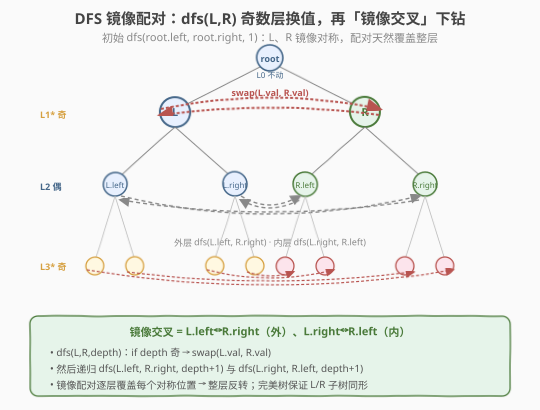
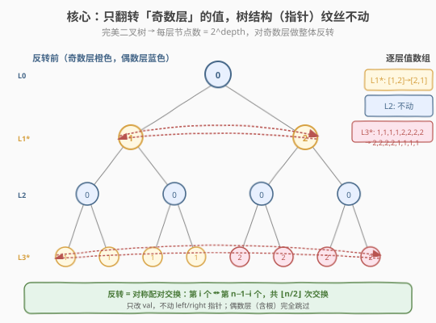
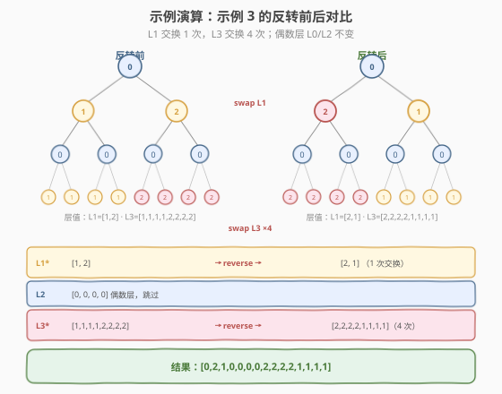

# 反转二叉树的奇数层

- **题目名称**：反转二叉树的奇数层
- **链接**：[2415. 反转二叉树的奇数层](https://leetcode.cn/problems/reverse-odd-levels-of-binary-tree/)
- **难度**：中等
- **标签**：树、二叉树、深度优先搜索（DFS）、广度优先搜索（BFS）、二叉树性质

## 1. 题目概述

给你一棵 **完美** 二叉树的根节点 `root`，请你反转这棵树中每个 **奇数** 层的节点值。

- 例如，假设第 3 层的节点值是 `[2,1,3,4,7,11,29,18]`，那么反转后它应该变成 `[18,29,11,7,4,3,1,2]`。

反转后，返回树的根节点。**完美** 二叉树需满足：二叉树的所有父节点都有两个子节点，且所有叶子节点都在同一层。节点的 **层数** 等于该节点到根节点之间的边数（根节点层数为 0）。

**示例 1**：

```text
输入：root = [2,3,5,8,13,21,34]
          2
         / \
        3   5
       / \ / \
      8 13 21 34
输出：[2,5,3,8,13,21,34]
解释：这棵树只有一个奇数层（第 1 层）。
     第 1 层的节点分别是 3、5，反转后为 5、3。
```

**示例 2**：

```text
输入：root = [7,13,11]
        7
       / \
      13  11
输出：[7,11,13]
解释：第 1 层的节点分别是 13、11，反转后为 11、13。
```

**示例 3**：

```text
输入：root = [0,1,2,0,0,0,0,1,1,1,1,2,2,2,2]
输出：[0,2,1,0,0,0,0,2,2,2,2,1,1,1,1]
解释：奇数层由非零值组成。
     第 1 层的节点分别是 1、2，反转后为 2、1。
     第 3 层的节点分别是 1,1,1,1,2,2,2,2，反转后为 2,2,2,2,1,1,1,1。
```

**约束条件**：

- 树中的节点数目在范围 $[1, 2^{14}]$ 内
- $0 \le \text{Node.val} \le 10^5$
- `root` 是一棵**完美**二叉树

> 💡 两个关键限定决定了本题的最优解法：① **完美二叉树**——每层节点数恰为 $2^{\text{depth}}$，左右子树同形；② **只反转值、不换结构**——`left/right` 指针一动不动，只改 `val`。这两个条件合起来，让一种「镜像配对」的 DFS 递归可以原地 $O(\log n)$ 空间完成，比朴素的 BFS 队列更省。

---

## 2. 解题思路

### 2.1 暴力思路：BFS 逐层收集 + 反转写回

最直白的想法：用 [102. 二叉树的层序遍历](../0101-0200/102_二叉树的层序遍历.md) 的 `while + for(size)` 模板逐层走一遍，把每层节点**存进列表**；遍历完一层后，若层数为奇，则对该列表做**首尾双指针交换**把值写回节点。

```text
queue = [root], depth = 0
while queue 非空:
    size = len(queue)
    level = []                       # 收集本层节点
    for i in 0..size:
        node = queue.pop_front()
        level.append(node)
        if node.left:  queue.push_back(node.left)
        if node.right: queue.push_back(node.right)
    if depth 奇:                      # 反转本层值
        l, r = 0, size-1
        while l < r:
            swap(level[l].val, level[r].val)
            l++; r--
    depth++
```

这能拿到正确结果，但有两个开销：① BFS 队列最多存一整层，完美树末层有 $n/2$ 个节点，**队列空间 $O(n)$**；② 还要再开一个 `level` 列表缓存整层节点（虽可优化为下标访问，仍占空间）。本题的「完美树 + 只换值」结构其实容许更省空间的递归写法。

> ⚠️ BFS 的 $O(n)$ 队列空间是「逐层整体处理」的固有代价。能否**不存整层、只靠递归栈**就完成对称交换？关键在于利用完美树的**对称同形**性质——这正是下面的最优解。

### 2.2 核心观察：镜像配对递归（DFS，$O(\log n)$ 空间）

完美二叉树有一个天然结构：根节点的**左右子树互为镜像**，且同形。于是我们可以让递归**成对地**处理两个镜像位置的节点 `L` 和 `R`：

- 初始调用 `dfs(root.left, root.right, 1)`：`L`、`R` 是第 1 层（奇数层）的镜像对称点，交换 `L.val` 与 `R.val` 即完成第 1 层的反转。
- 之后如何覆盖更深的奇数层？关键是**镜像交叉下钻**——下一层的配对不是 `L.left ↔ R.left`，而是：
  - **外层**：`dfs(L.left, R.right, depth+1)`
  - **内层**：`dfs(L.right, R.left, depth+1)`

这种「交叉」配对保证每一对递归参数都位于同一层、且彼此在整层中处于**左右镜像**位置。奇数层时交换，偶数层时只下钻不交换。递归到叶子层（`L == null`）即止。



**为什么「镜像交叉」恰好反转整层？** 以 4 层完美树（第 3 层 8 个节点，位置 $p_0 \dots p_7$）为例，第 3 层反转需交换 $(p_0,p_7),(p_1,p_6),(p_2,p_5),(p_3,p_4)$。递归展开后：

| 配对递归 | 第 3 层的成对位置 | 是否交换 |
|----------|-------------------|----------|
| `dfs(L.left,  R.right)` → 第 3 层 | $p_0 \leftrightarrow p_7$ | ✅（奇数层） |
| `dfs(L.left,  R.right)` 内层 | $p_1 \leftrightarrow p_6$ | ✅ |
| `dfs(L.right, R.left)`  → 第 3 层 | $p_2 \leftrightarrow p_5$ | ✅ |
| `dfs(L.right, R.left)` 内层 | $p_3 \leftrightarrow p_4$ | ✅ |

4 对对称交换恰好覆盖第 3 层全部 8 个节点，自然得到整层反转——**无需显式收集整层**。第 1、5、9… 层同理。

> 💡 **本质洞察**：「反转一层」等价于「把该层第 $i$ 个节点与第 $n-1-i$ 个节点逐对交换」。完美树的镜像递归**天然让每对 `(L,R)` 参数落在第 $i$ 与第 $n-1-i$ 位置**——这是对称结构赠予的「免费下标配对」，省去了 BFS 的整层缓存。

### 2.3 算法流程图



**完整步骤**：

1. **特判**：`root == null` 直接返回（题面保证非空，保留习惯性特判）。
2. **初始配对**：若 `root.left` 存在，调用 `dfs(root.left, root.right, 1)`（第 1 层，奇数层）。
3. **`dfs(L, R, depth)`**：
   - 若 `L == null` 返回（完美树中 `L`、`R` 同生死，判一个即可）。
   - 若 `depth` 为奇：`swap(L.val, R.val)`。
   - 镜像交叉下钻：`dfs(L.left, R.right, depth+1)`；`dfs(L.right, R.left, depth+1)`。
4. 返回 `root`（根节点本身永不被换，结构未动）。

### 2.4 示例演算

以示例 3 的 4 层完美树 `[0,1,2,0,0,0,0,1,1,1,1,2,2,2,2]` 为例，反转前后对比如下：



| 层 | 反转前层值 | 是否反转 | 反转后层值 | 交换次数 |
|----|-----------|----------|-----------|----------|
| L0 | `[0]` | ✗（偶数层，根不动） | `[0]` | 0 |
| L1 | `[1, 2]` | ✓（奇数层） | `[2, 1]` | 1 |
| L2 | `[0, 0, 0, 0]` | ✗（偶数层） | `[0, 0, 0, 0]` | 0 |
| L3 | `[1,1,1,1,2,2,2,2]` | ✓（奇数层） | `[2,2,2,2,1,1,1,1]` | 4 |

> 💡 **交换次数规律**：一层 $n$ 个节点，反转需 $\lfloor n/2 \rfloor$ 次交换。完美树第 $d$ 层有 $2^d$ 个节点，故奇数层 $d$ 需 $2^{d-1}$ 次交换。本题的递归**隐式**完成这些交换——每次 `dfs` 在奇数层调一次 `swap`，全部 `dfs` 调用数恰等于所有奇数层的 $\sum 2^{d-1}$ 次。偶数层不调用 `swap`，只负责下钻配对。

---

## 3. 参考代码

### C++（DFS 镜像配对，推荐）

```cpp
// 反转二叉树的奇数层.cpp —— DFS 镜像配对：dfs(L,R) 奇数层换值，镜像交叉下钻
// 编译: g++ -O2 -std=c++17 反转二叉树的奇数层.cpp -o reverseoddlevels
#include <utility>      // swap
using namespace std;

struct TreeNode {
    int val;
    TreeNode* left;
    TreeNode* right;
    TreeNode() : val(0), left(nullptr), right(nullptr) {}
    TreeNode(int x) : val(x), left(nullptr), right(nullptr) {}
    TreeNode(int x, TreeNode* l, TreeNode* r) : val(x), left(l), right(r) {}
};

class Solution {
  public:
    TreeNode* reverseOddLevels(TreeNode* root) {
        if (root == nullptr) return root;
        dfs(root->left, root->right, 1);   // 从第 1 层（奇数层）开始配对
        return root;
    }

  private:
    // L、R 是同一层、互为镜像对称的两个节点
    void dfs(TreeNode* L, TreeNode* R, int depth) {
        if (L == nullptr) return;          // 完美树：L、R 同生死，判一个即可
        if (depth & 1)                     // 奇数层：只换值，不动指针
            swap(L->val, R->val);
        dfs(L->left,  R->right, depth + 1); // 外层镜像交叉
        dfs(L->right, R->left,  depth + 1); // 内层镜像交叉
    }
};
```

### Python

```python
from __future__ import annotations
from typing import Optional


class TreeNode:
    def __init__(self, val=0, left=None, right=None):
        self.val = val
        self.left = left
        self.right = right


class Solution:
    def reverseOddLevels(self, root: Optional[TreeNode]) -> Optional[TreeNode]:
        def dfs(L: Optional[TreeNode], R: Optional[TreeNode], depth: int) -> None:
            if L is None:                  # 完美树：L、R 同生死
                return
            if depth & 1:                  # 奇数层：交换值
                L.val, R.val = R.val, L.val
            dfs(L.left,  R.right, depth + 1)  # 外层镜像交叉
            dfs(L.right, R.left,  depth + 1)  # 内层镜像交叉

        if root:
            dfs(root.left, root.right, 1)
        return root
```

> 💡 **语言细节**：C++ 用 `std::swap` 交换两个 `int`（值交换，不涉及指针）；Python 用 `a, b = b, a` 元组解包，同样只换值。两版均**不触碰 `left/right` 指针**，树结构纹丝不动。`depth & 1` 是奇偶判定最简写法（位与比 `depth % 2` 快，也更贴「层奇偶」语义）。

---

## 4. 复杂度分析

| 维度 | 复杂度 | 说明 |
|------|--------|------|
| **时间复杂度** | $O(n)$ | 每个非根节点恰好作为某个 `dfs` 的 `L` 或 `R` 被访问一次；奇数层节点额外做一次 $O(1)$ 的 `swap`，总量仍线性 |
| **空间复杂度** | $O(\log n)$ | 递归调用栈深度 = 树高 $h$；完美树 $n = 2^h - 1$，故 $h = \log_2(n+1)$，栈空间 $O(\log n)$ |

> ⚠️ **与 BFS 的空间对比**：BFS 逐层收集需 $O(n)$ 队列空间（完美树末层占 $n/2$）；DFS 镜像配对只用 $O(\log n)$ 调用栈，**常数级优于 BFS**。本题约束 $n \le 2^{14}$，两者都能过，但 DFS 写法更简洁、空间更优，是面试首选。完美树的「同形」是 DFS 能省空间的前提——若树不完美，镜像配对会错位，只能退回 BFS。

---

## 5. 扩展：BFS 解法与「只换值 vs 换结构」

### 5.1 BFS 逐层反转（备选解法）

若不依赖完美树的镜像对称性（或想用统一的层序模板），BFS 也能在 $O(n)$ 时间完成，代价是 $O(n)$ 队列空间：

```cpp
TreeNode* reverseOddLevels(TreeNode* root) {
    if (!root) return root;
    queue<TreeNode*> q;
    q.push(root);
    int depth = 0;
    while (!q.empty()) {
        int size = q.size();                 // 本层节点数快照
        vector<TreeNode*> level(size);
        for (int i = 0; i < size; ++i) {
            TreeNode* node = q.front(); q.pop();
            level[i] = node;
            if (node->left)  q.push(node->left);   // 完美树：有左必有右
            if (node->right) q.push(node->right);
        }
        if (depth & 1)                       // 奇数层：首尾双指针交换值
            for (int l = 0, r = size - 1; l < r; ++l, --r)
                swap(level[l]->val, level[r]->val);
        ++depth;
    }
    return root;
}
```

> 💡 BFS 版与 [103. 二叉树的锯齿形层序遍历](../0101-0200/103_二叉树的锯齿形层序遍历.md) 同源——都是「按层处理 + 奇偶层不同行为」。103 是奇偶层**输出方向**反转（只读不改），2415 是奇偶层**原地反转值**（只改不读输出）。模板骨架相同，差别在 for 循环体里「收集」还是「交换」。

### 5.2 「只换值」与「换结构」的对比

| 维度 | 2415 反转奇数层 | 226 翻转二叉树 |
|------|----------------|----------------|
| 操作对象 | `node.val`（值） | `node.left/right`（指针/结构） |
| 树形态 | 不变（结构纹丝不动） | 改变（每个节点的左右子树互换） |
| 递归配对 | 镜像交叉 `L.left↔R.right` 等 | 单节点 `swap(node.left, node.right)` |
| 是否需完美树 | 是（镜像配对依赖同形） | 否（任意二叉树可翻转） |

> ⚠️ **别把「反转一层值」写成「翻转子树」**：`swap(node->left, node->right)` 改的是指针，会把树形态整个镜像——这与「只换值、结构不动」的题意相悖。判别口诀：**题说反转/重排层内值 → 换 val；题说翻转/镜像整棵树 → 换指针**。226 属后者，2415 属前者。

---

## 6. 面试要点

1. **为什么 DFS 镜像配对能恰好反转整层，而不是只交换两个节点？**

   - 每对递归参数 `(L, R)` 天然落在同一层的镜像对称位置（第 $i$ 与第 $n-1-i$）。奇数层时交换它们，恰好完成「反转」所需的对称配对交换。
   - 镜像交叉下钻（`L.left↔R.right`、`L.right↔R.left`）保证下一层每对参数**仍**保持镜像对称——这是「反转」语义能逐层继承的关键。若改成同向下钻（`L.left↔R.left`），配对会错位，得到的不是反转。

2. **为什么空间是 $O(\log n)$ 而不是 $O(n)$？**

   - DFS 的开销只有调用栈，深度 = 树高 $h$。完美树 $n = 2^h - 1$，故 $h = O(\log n)$。
   - BFS 队列要存「当前层全部节点」，完美树末层有 $n/2$ 个，故 $O(n)$。本题 $n \le 2^{14}$ 两者都过，但 DFS 更优，是「用对称结构换空间」的范例。

3. **「完美二叉树」这个前提在哪些地方被用到了？**

   - ① 初始 `dfs(root.left, root.right, 1)` 要求左右子树同高同形，才能保证镜像配对覆盖整层；② 终止条件只判 `L == null`（完美树中 `L`、`R` 同生死），省一次判空；③ 每层节点数恰为 $2^{\text{depth}}$，反转交换次数可预测。若树不完美，左右子树不同形，镜像配对会漏节点，只能退回 BFS。

4. **`swap` 交换的是值还是指针？会不会破坏树结构？**

   - 交换 `L.val` 与 `R.val`，是 `int` 值交换，**完全不触碰 `left/right` 指针**。树的结构（父子连接）原封不动，只是部分节点的值被对调——这正是题面「反转节点值」的本意。若误写成 `swap(L, R)` 交换指针变量，那是局部无效操作（形参互换不影响实参），不会改变树。

5. **DFS 与 BFS 该推荐哪个？**

   - 推荐 DFS。空间 $O(\log n) \ll O(n)$，代码更短（无队列、无 `level` 列表、无 `size` 快照），且递归天然表达「镜像配对」语义。BFS 适合「不依赖完美树」或「需统一层序模板」的场景。面试时先说 DFS，被追问「能否层序」时给出 BFS 备选，体现权衡意识。

> 💡 **一句话总结**：2415 的精髓是利用**完美树的镜像同形**，让 DFS 递归的每对参数 `(L,R)` 天然落在同一层的对称位置，奇数层换值、偶数层只下钻，$O(\log n)$ 空间原地完成逐层反转。口诀：**题说反转层内值 → 换 val 不换指针；完美树 → 镜像交叉配对下钻**。

---

## 7. 同类练习题

- [103. 二叉树的锯齿形层序遍历](https://leetcode.cn/problems/binary-tree-zigzag-level-order-traversal/)（[题解](../0101-0200/103_二叉树的锯齿形层序遍历.md)）：每层输出方向交替反转，BFS 视角下「按层反转」的姊妹题（只读不改 vs 本题只改不读）
- [101. 对称二叉树](https://leetcode.cn/problems/symmetric-tree/)（[题解](../0101-0200/101_对称二叉树.md)）：本题 DFS 的「镜像交叉配对」递归与对称判定的镜像遍历同源，可复用同款骨架
- [226. 翻转二叉树](https://leetcode.cn/problems/invert-binary-tree/)（[题解](../0201-0300/226_翻转二叉树.md)）：递归交换左右子树**指针**，对照本题只换**值**不动结构，区分「换值 vs 换结构」
- [102. 二叉树的层序遍历](https://leetcode.cn/problems/binary-tree-level-order-traversal/)（[题解](../0101-0200/102_二叉树的层序遍历.md)）：BFS 备选解法的母题，`size` 快照锁定层边界
- [2471. 逐层排序二叉树的最少操作数](https://leetcode.cn/problems/minimum-number-of-operations-to-sort-a-binary-tree-by-level/)：完美二叉树 + 逐层独立处理的姊妹题，同款「按层操作」框架
