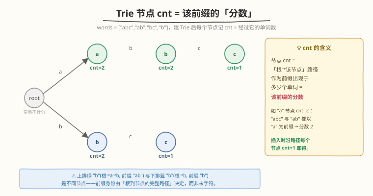
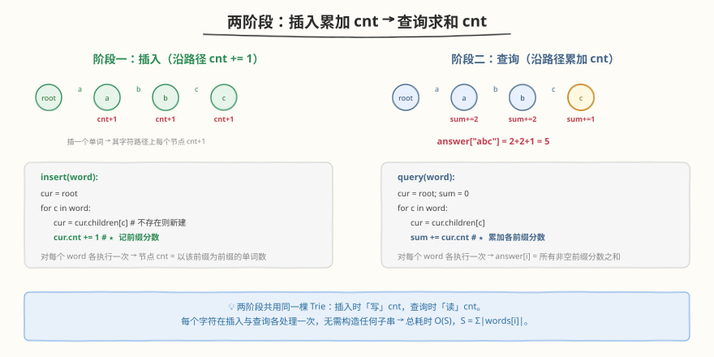
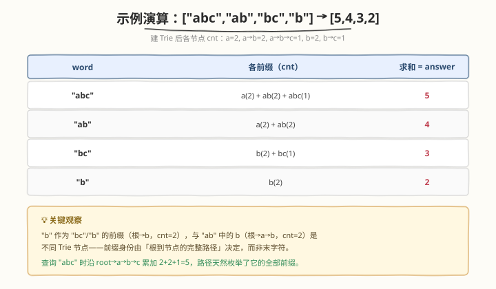

# LeetCode 字符串的前缀分数和 题解

## 1. 题目概述

- **标题 / 题号**：字符串的前缀分数和（#2416，hard）
- **链接**：https://leetcode.cn/problems/sum-of-prefix-scores-of-strings/
- **难度**：困难
- **标签**：字典树、数组、字符串、前缀

**题意**：给定一个长度为 `n` 的非空字符串数组 `words`。定义字符串 `term` 的**分数**等于 `words` 中以 `term` 作为**前缀**的字符串的数目（字符串视作它自身的一个前缀）。

要求返回长度为 `n` 的数组 `answer`，其中 `answer[i]` 等于 `words[i]` 的**每个非空前缀的分数之和**。

**示例 1**：

```text
输入：words = ["abc","ab","bc","b"]
输出：[5,4,3,2]
解释：
- "abc" 的前缀 "a"/"ab"/"abc" 分数为 2/2/1 → 2+2+1 = 5
- "ab"  的前缀 "a"/"ab"       分数为 2/2   → 2+2 = 4
- "bc"  的前缀 "b"/"bc"       分数为 2/1   → 2+1 = 3
- "b"   的前缀 "b"            分数为 2     → 2
```

**示例 2**：

```text
输入：words = ["abcd"]
输出：[4]
解释："abcd" 的 4 个前缀 "a"/"ab"/"abc"/"abcd" 分数均为 1，总计 1+1+1+1 = 4。
```

**约束**：

- $1 \le \text{words.length} \le 1000$
- $1 \le \text{words}[i].\text{length} \le 1000$
- `words[i]` 仅由小写英文字母组成

> 💡 **关键直觉**：所谓「前缀 `term` 的分数」=「有多少个单词以 `term` 为前缀」。如果把所有单词共同塞进一棵 **Trie（字典树）**，那么从根走到某个节点的路径恰对应一个前缀，而「经过该节点的单词数」恰等于此前缀的分数。于是在每个 Trie 节点上挂一个计数器 `cnt`，**插入时沿路径 `cnt += 1`，查询时沿路径把 `cnt` 累加**——两趟各 $O(S)$ 即得答案。

## 2. 解题思路

### 2.1 暴力思路：前缀频率哈希表

最直白的做法是把题意「翻译」成两遍扫描：

```text
cnt = 计数器（哈希表）
for w in words:
    for k = 1..|w|:                 # 枚举 w 的所有非空前缀
        cnt[ w[:k] ] += 1            # 物化出子串并计数
for w in words:
    ans[i] = Σ_{k=1..|w|} cnt[ w[:k] ]
return ans
```

逻辑完全正确，但有一个致命的**物化开销**：`w[:k]` 会真正拷贝出长度为 $k$ 的子串，花费 $O(k)$。对单个长度 $L$ 的单词，枚举其全部前缀的拷贝总长 $\sum_{k=1}^{L} k = O(L^2)$；$N$ 个单词合计 $O(N \cdot L^2)$。

更糟的是**存储**：哈希表要把每个单词的每个前缀都单独存一份字符串，总字符数同样是 $\sum_i O(L_i^2) = O(N \cdot L^2)$。本题 $N, L \le 1000$，$O(N \cdot L^2) = 10^9$ 字符 $\approx 1\,\text{GB}$，时间与空间双双爆表。

> ⚠️ 瓶颈的本质：**相同的前缀被反复物化、重复存储**。`"abc"` 和 `"ab"` 共享前缀 `"a"`、`"ab"`，但哈希表把它们各自存了一份。这恰恰是 Trie 的主场——把公共前缀折叠进同一条树路径，让每个字符只存一次、只处理一次。

### 2.2 核心观察：Trie 节点 cnt = 该前缀的分数



把所有 `words` 插入 Trie。给每个节点挂一个计数器 `cnt`，含义为「**经过该节点（即以根到该节点的路径为前缀）的单词数**」。插入单词 `w` 时，从根出发沿 `w` 的字符逐层下行，**每到达一个节点就给它的 `cnt` 加 1**。全部插完后，节点 `v` 的 `cnt[v]` 即等于「以 `根→v` 这条路径为前缀的单词数」——这正是此前缀的**分数**。

> 💡 **为什么 `cnt` 恰好等于分数？** 前缀 `term` 的分数定义为「以 `term` 为前缀的单词数」。而「以 `term` 为前缀」$\iff$「该单词在 Trie 中的插入路径经过 `term` 对应的节点」。插入时每经过一次就 `+1`，故 `cnt[v]` 精确统计了经过它的插入次数 = 以该前缀为前缀的单词数。一加一查，定义即对齐。

查询 `answer[i]` 时，对 `words[i]` 再次沿 Trie 下行，**把路径上每个节点的 `cnt` 累加**。因为 `words[i]` 的长度为 $k$ 的前缀恰对应下行 $k$ 步到达的节点，累加这些 `cnt` 就是它所有非空前缀的分数之和。根节点对应空前缀（不计分），所以累加从根的子节点起算。

> ⚠️ **前缀身份由完整路径决定**：注意 `"ab"` 中的 `b`（路径 `根→a→b`）与 `"b"`（路径 `根→b`）是 **Trie 中两个不同的节点**，尽管末字符相同。`cnt` 挂在节点上而非字符上，自然区分了二者——`根→b` 的 `cnt=2`（`"bc"`、`"b"`），`根→a→b` 的 `cnt=2`（`"abc"`、`"ab"`），互不串扰。

### 2.3 算法流程图



两阶段骨架，共用同一棵 Trie：

```text
1. 建 Trie：遍历 words，对每个 w 执行 insert(w)
   insert(w): cur=root; for c in w: cur=cur.children[c](无则新建); cur.cnt += 1
2. 查询：遍历 words，对每个 w 执行 query(w) 得 answer[i]
   query(w): cur=root; sum=0; for c in w: cur=cur.children[c]; sum += cur.cnt
3. 返回 answer
```

> 💡 **没有 `is_end` 标记**：本题只关心「前缀」，不关心「完整单词的边界」，所以无需像 208/1858 那样在末字符节点打 `is_end` 标记。`cnt` 已承载了全部信息——它对每个前缀节点都生效，无论该前缀是否恰为某个完整单词。

### 2.4 示例演算



以示例 1 `words = ["abc","ab","bc","b"]` 演算。

**阶段一·建 Trie**（逐词插入，每经过一节点 `cnt += 1`）：

| 插入 | 触达节点与 cnt 变化 |
|------|---------------------|
| "abc" | 根→a(1)→b(1)→c(1) |
| "ab"  | 根→a(2)→b(2) |
| "bc"  | 根→b(1)→c(1)（另起一支，与 `根→a→b` 无关）|
| "b"   | 根→b(2) |

最终节点 `cnt`：`根→a=2`、`根→a→b=2`、`根→a→b→c=1`、`根→b=2`、`根→b→c=1`。

**阶段二·查询**（逐词沿路径累加 `cnt`）：

| word | 下行路径与累加 | answer |
|------|----------------|--------|
| "abc" | a(2)+b(2)+c(1) | 5 |
| "ab"  | a(2)+b(2)      | 4 |
| "bc"  | b(2)+c(1)      | 3 |
| "b"   | b(2)           | 2 |

最终 `answer = [5,4,3,2]` ✓。

> 💡 注意 `"abc"` 查询走的是 `根→a→b→c` 这一支（绿色），其 `b` 节点 `cnt=2`；而 `"bc"` 查询走 `根→b→c` 另一支，其 `b` 节点 `cnt=2`。两条路径互不相交，各自累加，绝不会把 `"ab"` 的 `cnt` 错加到 `"b"` 的分数里。

## 3. 参考代码

### 方法一：Trie（推荐）

### C++

```cpp
struct TrieNode {
    TrieNode* children[26] = {};
    int cnt = 0;                      // 以「根→本节点」路径为前缀的单词数
};

class Solution {
public:
    vector<int> sumPrefixScores(vector<string>& words) {
        TrieNode* root = new TrieNode();
        for (const string& w : words) {           // 阶段一：插入，沿路径 cnt += 1
            TrieNode* cur = root;
            for (char c : w) {
                int idx = c - 'a';
                if (!cur->children[idx]) cur->children[idx] = new TrieNode();
                cur = cur->children[idx];
                ++cur->cnt;
            }
        }
        vector<int> ans;
        ans.reserve(words.size());
        for (const string& w : words) {           // 阶段二：查询，沿路径累加 cnt
            TrieNode* cur = root;
            int sum = 0;
            for (char c : w) {
                cur = cur->children[c - 'a'];
                sum += cur->cnt;
            }
            ans.push_back(sum);
        }
        return ans;
    }
};
```

> 💡 `++cur->cnt` 写在 `cur = cur->children[idx]` **之后**：先下移到目标节点，再给「该节点」计数。这样根节点永不被计数（对应空前缀，不计分），与题意「非空前缀」一致。查询时同样先下移再累加，根不参与求和。

### Python

```python
class TrieNode:
    __slots__ = ('children', 'cnt')
    def __init__(self):
        self.children = {}
        self.cnt = 0

class Solution:
    def sumPrefixScores(self, words: List[str]) -> List[int]:
        root = TrieNode()
        for w in words:                         # 阶段一：插入
            cur = root
            for c in w:
                if c not in cur.children:
                    cur.children[c] = TrieNode()
                cur = cur.children[c]
                cur.cnt += 1                   # 经过本节点 +1
        ans = []
        for w in words:                         # 阶段二：查询
            cur = root
            s = 0
            for c in w:
                cur = cur.children[c]
                s += cur.cnt                    # 累加各前缀分数
            ans.append(s)
        return ans
```

> 💡 Python 也可用嵌套 `dict` + 计数键的极简写法：`cur = cur.setdefault(c, {})` 后 `cur['#'] = cur.get('#', 0) + 1`，查询时 `cur = cur[c]; s += cur['#']`。逻辑等价，但 `__slots__` 的类版本更省内存、更贴近 C++ 实现。

### 方法二：前缀频率哈希表（对照）

```python
class Solution:
    def sumPrefixScores(self, words: List[str]) -> List[int]:
        from collections import Counter
        cnt = Counter()
        for w in words:
            for i in range(1, len(w) + 1):
                cnt[w[:i]] += 1                 # 物化每个前缀并计数
        ans = []
        for w in words:
            ans.append(sum(cnt[w[:i]] for i in range(1, len(w) + 1)))
        return ans
```

> ⚠️ 此法逻辑最贴近题意、代码最短，但 `w[:i]` 每次物化 $O(i)$ 子串，建表与查询各 $O(N \cdot L^2)$，且哈希表需为每个前缀单独存字符串，空间 $O(N \cdot L^2) \approx 1\,\text{GB}$。$L$ 较大时必 TLE / MLE。它正是 Trie 要优化的对象——Trie 把公共前缀折叠进同一路径，每个字符只存一次、处理一次，降到 $O(S)$。

## 4. 复杂度分析

记 $S = \sum_i \text{words}[i].\text{length}$，$N = \text{words.length}$，$L = \max_i \text{words}[i].\text{length}$。本题 $S \le N \cdot L \le 10^6$。

| 维度 | 复杂度 | 说明 |
|------|--------|------|
| **时间** | $O(S)$ | 阶段一插入遍历全部字符 $O(S)$；阶段二查询再遍历全部字符 $O(S)$。每个字符各处理两次，无子串物化 |
| **空间** | $O(S)$ | Trie 节点总数 $\le S + 1$（每字符至多新建一节点）；输出数组 $O(N)$ |
| 对照：哈希表法 | $O(N \cdot L^2)$ / $O(N \cdot L^2)$ | 每个前缀物化 $O(L)$ 子串、单独存储；$L=1000$ 时 $10^9$ 字符，时间空间双爆 |

> 💡 Trie 把「公共前缀」折叠进共享路径，使时间从 $O(N \cdot L^2)$ 降到 $O(S) = O(N \cdot L)$，空间同阶——这正是从「重复物化」到「一次成型」的结构跃迁。当 $N, L$ 均取上界 $1000$ 时，加速比约为 $L = 1000$ 倍。

> ⚠️ **C++ 内存**：`TrieNode` 含 `26` 个指针 + `int`，约 $216$ 字节/节点。最坏 $S = 10^6$ 节点时约占 $216\,\text{MB}$，接近常见内存上限。若实际偏紧，可改用 `unordered_map<int,TrieNode*>` 或数组化紧凑表示（详见第 5 节）。本题 $S \le 10^6$ 通常可过。

## 5. 扩展：「两两 LCP」视角与紧凑 Trie

### 5.1 用最长公共前缀重写答案

设 $\text{LCP}(x, y)$ 为字符串 $x, y$ 的最长公共前缀长度。注意：`words[j]` 对 `words[i]` 每个前缀分数的贡献，恰为「`words[j]` 与 `words[i]` 的公共前缀数」$= \text{LCP}(\text{words}[i], \text{words}[j])$（含自身，$j=i$ 时贡献 $|\text{words}[i]|$）。于是

$$
\text{answer}[i] = \sum_{j=0}^{N-1} \text{LCP}\bigl(\text{words}[i],\,\text{words}[j]\bigr).
$$

两两计算 LCP 得 $O(N^2 \cdot L)$ 暴力解（$N=L=1000$ 时 $10^9$，偏慢但可作对照）。将 `words` **排序**后，相邻串的 LCP 仅依赖其字典序邻域，配合单调栈可在 $O(N \cdot L)$ 内完成——思路与「子数组最小值之和」同构，但实现较 Trie 复杂。Trie 的两阶段 $O(S)$ 写法仍是性价比最高的选择。

### 5.2 紧凑 Trie 应对内存压力

当字符集与规模使裸 `TrieNode` 数组过占内存时，常见两种压缩：

| 压缩法 | 思路 | 适用 |
|--------|------|------|
| **哈希子节点** | `children` 用 `unordered_map<char,TrieNode*>` 替代定长数组 | 字符集大、节点稀疏时省内存，但查询常数变大 |
| **数组化** | 用一个大数组顺序分配节点，`children` 存下标而非指针 | 消除堆分配开销、缓存友好，适合竞赛卡常 |

> 💡 本题字符集仅 $26$、$S \le 10^6$，定长数组版通常已足够；上述压缩仅在内存实测吃紧时启用，避免过早优化。

## 6. 面试要点

1. **为什么 Trie 节点上的 `cnt` 恰好等于该前缀的分数？**

   > 前缀 `term` 的分数 = 以 `term` 为前缀的单词数。「以 `term` 为前缀」$\iff$「该单词的插入路径经过 `term` 对应的节点」。插入时每经过一次 `+1`，故 `cnt[v]` = 经过 `v` 的插入次数 = 以 `根→v` 为前缀的单词数 = 该前缀的分数。定义与计数一一对齐。

2. **插入和查询时，根节点要不要参与计数 / 求和？**

   > 不要。根节点对应空前缀，题目只对非空前缀计分。代码中 `++cur->cnt` 与 `sum += cur->cnt` 都写在 `cur = cur->children[idx]` **之后**，即只对「下移后到达的节点」操作，根天然被跳过。

3. **`"ab"` 里的 `b` 和 `"b"` 里的 `b` 是同一个节点吗？会被串扰吗？**

   > 不是，不会。前者路径为 `根→a→b`，后者为 `根→b`，是 Trie 中两个不同节点，`cnt` 各自独立。因为 `cnt` 挂在**节点**上而非字符上，前缀身份由「根到节点的完整路径」唯一确定，末字符相同不等于同一前缀。

4. **为什么不用 `is_end` 标记？它和 `cnt` 有何区别？**

   > `is_end` 标记「根到此节点的路径恰为一个完整单词」（关心边界），`cnt` 统计「以根到此节点的路径为前缀的单词数」（关心计数）。本题只需前缀计数，无需判别单词边界，故只用 `cnt`。若题目再加「只统计作为完整单词的前缀」之类的约束，才需 `is_end` 配合。

5. **哈希表法为何会爆，Trie 为何能省？**

   > 哈希表为每个单词的每个前缀都**单独物化并存储**一个字符串，公共前缀被重复拷贝，总字符数 $O(N \cdot L^2)$。Trie 把公共前缀折叠进共享树路径，每个字符只存一次、只处理一次，总耗时与总空间均 $O(S) = O(N \cdot L)$。把「重复物化」变「一次成型」是 Trie 的核心价值。

> 💡 **一句话总结**：建 Trie，插入时沿路径 `cnt += 1`、查询时沿路径累加 `cnt`，两趟 $O(S)$ 即得每个单词所有非空前缀的分数和。

## 同类练习题

| # | 题目 | 与本题的关联 |
|---|------|-------------|
| 1804 | [实现 Trie II（前缀树）](https://leetcode.cn/problems/implement-trie-ii-prefix-tree/)（[站内题解](../1801-1900/1804_实现TrieII.md)） | 本题 `cnt` 机制的母题——支持 `countWordsEqualTo` 与 `countWordsStartingWith`，正是「节点 `cnt_end` / `cnt_pass`」的封装，先练它再回看本题如履平地 |
| 208 | [实现 Trie（前缀树）](https://leetcode.cn/problems/implement-trie-prefix-tree/)（[站内题解](../0201-0300/208_实现Trie.md)） | Trie 基础模板（insert / search / startsWith），掌握 `children` + 末节点标记的标准结构 |
| 677 | [键值映射](https://leetcode.cn/problems/map-sum-pairs/)（[站内题解](../0601-0700/677_键值映射.md)） | Trie 节点挂「前缀和」的同类应用——插入时沿路径累加 val，查询按前缀求和，与本题「沿路径累加 cnt」同构 |
| 648 | [单词替换](https://leetcode.cn/problems/replace-words/)（[站内题解](../0601-0700/648_单词替换.md)） | 沿 Trie 下行找最短前缀根词，对照「沿路径读节点信息」的查询范式 |
| 14 | [最长公共前缀](https://leetcode.cn/problems/longest-common-prefix/)（[站内题解](../0001-0100/14_最长公共前缀.md)） | 前缀问题的入门题，与第 5 节「两两 LCP」视角同源，可作 LCP 思路的引子 |
