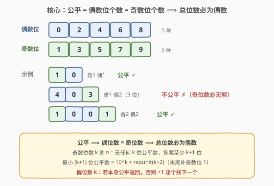
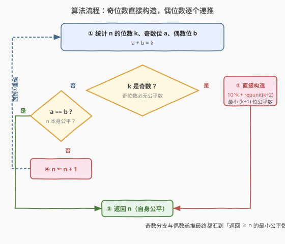
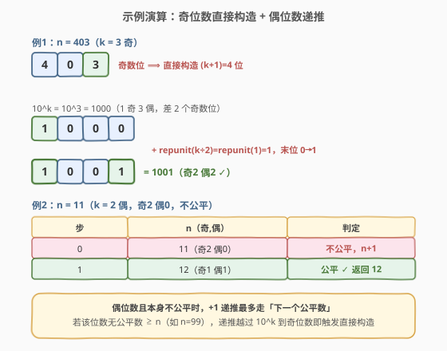

# LeetCode 最近的公平整数 题解

## 1. 题目概述

- **标题 / 题号**：最近的公平整数（#2417，medium）
- **链接**：https://leetcode.cn/problems/closest-fair-integer/
- **难度**：中等
- **标签**：数学、枚举、构造

**题意**：给定一个**正整数** `n`。如果一个整数 `k` 中的**偶数位数**与**奇数位数**相等，则称 `k` 为**公平整数**（fair integer）。返回**大于或等于** `n` 的**最小**公平整数。

> 偶数位指数字为偶数的位（`{0,2,4,6,8}`），奇数位指数字为奇数的位（`{1,3,5,7,9}`）。

**示例 1**：

```text
输入：n = 2
输出：10
解释：大于等于 2 的最小公平整数是 10。
10 是公平整数，因为它的偶数和奇数个数相等（一个奇数 1 和一个偶数 0）。
```

**示例 2**：

```text
输入：n = 403
输出：1001
解释：大于或等于 403 的最小公平整数是 1001。
1001 是公平整数，因为它有相等数量的偶数和奇数（两个奇数 1、1 和两个偶数 0、0）。
```

**约束**：

- $1 \le n \le 10^9$

> 💡 **题眼**：题目要的不是「判定某数是否公平」，而是「找 $\ge n$ 的最小公平数」。一旦意识到「公平 ⟹ 偶数位个数 = 奇数位个数 ⟹ 总位数必为偶数」，就能把**奇数位数**情形直接降维成 $O(1)$ 构造，而**偶数位数**情形只剩一个逐位递推的小循环。

## 2. 解题思路

### 2.1 暴力思路：从 n 起逐个判定

最朴素的念头是从 `n` 开始不断 `+1`，对每个候选数统计奇偶位个数，命中即返回。问题在于「下一个公平数」与 `n` 的距离可能很大：

- `n = 403`（3 位，奇数位）：3 位数**根本不存在公平数**（公平数总位数必为偶），暴力会一路扫到 `1001`，扫描约 $600$ 次；
- `n = 999889`（6 位，偶数位但本身不公平，且 6 位中已无 $\ge n$ 的公平数）：要扫到下一个 7 位（奇数位）才被构造逻辑救回，但实际上暴力会盲目扫过整个 6 位尾段。

> ⚠️ 暴力法「正确但低效」。真正卡住它的是**奇数位数**情形：此类 `n` 在本位数位内**无解**，盲目递推会跨数量级地空扫。抓住这一结构就能跳过整段。

### 2.2 核心观察：公平 ⟹ 总位数为偶



设某数位数为 $k$，偶数位个数 $b$、奇数位个数 $a$。公平要求 $a = b$，又 $a + b = k$，故 $k = 2a$ **必为偶数**。由此推出两条强结论：

1. **奇数位数 $k$ 的 `n`：本位段无解。** 所有位数 $< k$ 的数都 $< n$（因 $n \ge 10^{k-1}$），不可取；本位数位又全不公平。故答案必为**最小的 $(k+1)$ 位公平数**（$k+1$ 为偶）。
2. **偶数位数 $k$ 的 `n`：若本身公平直接返回；否则在本位数段内逐个递推找下一个公平数**——若本位段已无公平数 $\ge n$（即 `n` 越过最大 $k$ 位公平数），递推越过 $10^{k}$ 进入奇数位 $k+1$，立刻被结论 1 的直接构造接住。

**最小 $(k+1)$ 位公平数的构造**（$k$ 为奇数，$k+1$ 为偶）：最小 $(k+1)$ 位数是 $10^{k}$（即 `1` 后接 $k$ 个 `0`，已有 $1$ 个奇数位、$k$ 个偶数位）。还需补 $\dfrac{k+1}{2} - 1 = \dfrac{k-1}{2} = \left\lfloor k/2 \right\rfloor$ 个奇数位。为使数值最小，**用最小的奇数字 `1` 填在最低位**，即把末尾 $\lfloor k/2 \rfloor$ 个 `0` 改成 `1`：

$$
\text{ans} = 10^{k} + \underbrace{11\cdots1}_{\lfloor k/2\rfloor \text{ 个 1}} = 10^{k} + \frac{10^{\lfloor k/2\rfloor} - 1}{9}
$$

记 $\text{repunit}(m) = \dfrac{10^{m}-1}{9} = \underbrace{11\cdots1}_{m}$（$\text{repunit}(0)=0$）。验证：结果的奇数位 = $1 + \lfloor k/2 \rfloor = \lceil k/2 \rceil = \frac{k+1}{2}$，偶数位 = $k - \lfloor k/2 \rfloor = \frac{k+1}{2}$，相等 ✓。

| $k$（奇） | $10^{k}$ | $\lfloor k/2 \rfloor$ | $+\text{repunit}$ | 结果 | 校验 |
|----------|----------|----------------------|-------------------|------|------|
| 1 | 10 | 0 | +0 | **10** | 奇1 偶1 ✓ |
| 3 | 1000 | 1 | +1 | **1001** | 奇2 偶2 ✓ |
| 5 | 100000 | 2 | +11 | **100011** | 奇3 偶3 ✓ |

> 💡 这正是示例 2 的来由：$n=403$，$k=3$ 奇 ⟹ 直接得 $10^{3}+\text{repunit}(1)=1000+1=\mathbf{1001}$。

### 2.3 算法流程图



算法骨架（**迭代**，规避递归深度问题）：

1. **统计**：求 $n$ 的位数 $k$、奇数位 $a$、偶数位 $b = k - a$；
2. **奇数位捷径**：若 $k$ 为奇数，直接返回 $10^{k} + \text{repunit}(\lfloor k/2 \rfloor)$；
3. **偶数位判定**：若 $a = b$，返回 $n$ 本身；
4. **偶数位递推**：否则 $n \leftarrow n + 1$，回到第 1 步重新统计。

> ⚠️ **为什么用迭代而非递归**：偶数位且本身不公平时，递推到「下一个公平数」或「跨进奇数位」可能要走数千步（见 2.4）。若写成 `closestFair(n+1)` 递归，$n=10^{9}$ 这类边界会触发上千层调用栈，Python 默认递归深度上限 $1000$ 会直接 `RecursionError`。改写成 `while` 循环既无栈风险，也省去函数调用开销。

### 2.4 示例演算



**例 1**（$n=403$，奇数位直接构造）：$k=3$ 奇 ⟹ $10^{3}+\text{repunit}(1)=1000+1=1001$。把 `1000` 末位 `0` 改成 `1`，奇偶位由「1 奇 3 偶」补成「2 奇 2 偶」✓。

**例 2**（$n=11$，偶数位递推）：$k=2$ 偶，$a=2, b=0$，$a\ne b$。递推一步：$n=12$，$a=1, b=1$，公平 ✓，返回 `12`。

**跨位段情形**：$n=99$（$k=2$ 偶，$a=2,b=0$ 不公平；2 位最大公平数是 `98`，已 $< 99$）。递推 $99\to100$（$k=3$ 奇），触发捷径：$10^{3}+\text{repunit}(1)=1001$。本位段无解时，递推越过 $10^{k}$ 即被奇数位构造接住，无需扫遍整个数位尾段。

> 💡 **递推步数有界**：偶数位情形下，「下一个公平数」与本位段「最大公平数」之间的最大间隔出现在 $19\cdots988\cdots8 \to 20\cdots011\cdots1$ 这类跨越首位 `2` 的位置，量级约 $2.2\times10^{k/2-1}$。对 $n\le 10^{9}$（$k\le 8$ 的主体范围，外加 $n=10^{9}$ 的 $k=10$ 边界），最坏约 $2222$ 步，乘以每步 $O(\log n)$ 的位数统计，运算量在 $10^{4}$ 量级，瞬即 AC。

## 3. 参考代码

### C++

```cpp
class Solution {
public:
    int closestFair(int n) {
        while (true) {
            int k = 0, a = 0;
            for (int t = n; t; t /= 10) {
                if ((t % 10) & 1) ++a;
                ++k;
            }
            if (k & 1) {
                // 奇数位：构造最小 (k+1) 位公平数 = 10^k + repunit(k/2)
                int x = 1;
                for (int i = 0; i < k; ++i) x *= 10;      // x = 10^k
                int y = 0;
                for (int i = 0; i < (k >> 1); ++i) y = y * 10 + 1;  // repunit(k/2)
                return x + y;
            }
            if (a == k - a) return n;                      // 偶数位且本身公平
            ++n;                                           // 否则递推
        }
    }
};
```

> 💡 `a` 只统计奇数位个数，偶数位个数 $b=k-a$ 即得，无需单独累加。`for (int t=n; t; t/=10)` 同时完成「数位」与「奇偶统计」——一行双用。`n=0` 不会出现（题目保证 $n\ge1$），故循环必进入至少一次。

### Python

```python
class Solution:
    def closestFair(self, n: int) -> int:
        while True:
            s = str(n)
            k = len(s)
            if k & 1:                       # 奇数位：直接构造最小 (k+1) 位公平数
                return 10 ** k + int('1' * (k // 2) or '0')
            a = sum(1 for c in s if int(c) & 1)
            if a == k - a:                  # 偶数位且本身公平
                return n
            n += 1                          # 否则递推
```

> 💡 `int('1' * (k // 2) or '0')` 处理 $k=1$ 时 `'1'*0 = ''` 的空串：`'' or '0'` 取 `'0'` 得 $0$，即 $\text{repunit}(0)=0$，结果 $10^{1}+0=10$ ✓。亦可写 `repunit = (10 ** (k // 2) - 1) // 9` 规避字符串，但 `or` 技巧更贴近构造直觉。

## 4. 复杂度分析

| 维度 | 复杂度 | 说明 |
|------|--------|------|
| **时间复杂度** | $O\!\left(\sqrt{n}\,\log n\right)$ 最坏 | 偶数位递推的最大间隔约 $O\!\left(10^{k/2}\right)=O(\sqrt{n})$，每步统计 $O(\log n)$；奇数位分支为 $O(\log n)$ 一次构造 |
| 对照：奇数位分支 | $O(\log n)$ | 直接算 $10^{k}+\text{repunit}$，与递推步数无关 |
| 对照：纯暴力逐个判定 | $O(\Delta\cdot\log n)$ | $\Delta$ 可达 $\Theta(\sqrt{n})$，但缺奇数位捷径时会盲目跨数量级空扫 |
| **空间复杂度** | $O(\log n)$ | Python 串化 `str(n)` 占 $O(k)$；C++ 仅几个整型变量，$O(1)$ 额外 |

> 💡 $n\le10^{9}$ 下 $k\le10$，最坏递推约 $2222$ 步，每步 $\le10$ 位统计，总运算 $\sim 2\times10^{4}$，远低于 $10^{8}$ 阈值。瓶颈不在排序而在递推步数——这是「数位结构 + 逐位逼近」类题的典型画像。

## 5. 扩展：从构造到计数的统一视角

**公平数的计数**：长度为偶数 $2m$ 的公平数总数 = 选出 $m$ 个偶数位的位置 $\binom{2m}{m}$，每位偶数位 $5$ 选、奇数位 $5$ 选，再扣除首位为 $0$ 的情形。这把「公平」与「带首位约束的组合计数」做映射——一旦建立，便能像 [2217. 找到指定长度的回文数](../2201-2300/2217_找到指定长度的回文数.md) 那样按排名直接定位第 $q$ 个公平数。

**奇偶位的对称性**：偶数字与奇数字各恰有 $5$ 个（`{0,2,4,6,8}` 与 `{1,3,5,7,9}`），这是「偶数位 = 奇数位 ⟹ 总位偶」能配平的根。若题面换成「3 的倍数位 = 非倍数位」之类不对称约束，构造公式会因两侧候选数不等而失效，需另寻结构。

**与最近回文数的对照**：[564. 寻找最近的回文数](https://leetcode.cn/problems/find-the-closest-palindrome/) 同为「给定 $n$ 找最近满足某数位性质的数」，都用「枚举若干候选（前缀 $\pm1$、全 9、全 $10\cdots0$）+ 取最近」的构造套路。本题因约束更松（只要求奇偶位配平，而非严格对称），构造更简：奇数位情形退化为单一公式，偶数位情形退化为线性递推，无需回溯。

> 💡 **方法论**：遇到「找 $\ge n$ 的最小满足数位性质者」，先问**该性质对总位数有无奇偶约束**——若有（如本题「必偶数位」），就把无解数位段直接跳过，只对「可能解」数位段做逼近；性质越弱，构造越简，递推越短。

## 6. 面试要点

1. **为什么奇数位数的 `n` 可以一步出解？**

   > 公平 ⟹ 总位数为偶。$n$ 为奇数位 $k$ 时，本位数位全不公平；位数 $<k$ 者又 $<n$ 不可取。故答案必是最小 $(k+1)$ 位公平数 $10^{k}+\text{repunit}(\lfloor k/2\rfloor)$，无需递推。

2. **最小 $(k+1)$ 位公平数为什么是这个公式？**

   > $10^{k}$ 是最小 $(k+1)$ 位数（`1` 后接 $k$ 个 `0`），已有 $1$ 奇 $k$ 偶。需把其中 $\lfloor k/2\rfloor$ 个偶数位翻成奇数位且数值增量最小 ⟹ 用最小奇数字 `1` 改最低的 $\lfloor k/2\rfloor$ 位，增量恰为 $\text{repunit}(\lfloor k/2\rfloor)$。

3. **为什么偶数位情形用迭代而不用递归？**

   > 递推步数最坏约 $2222$（$n\le10^{9}$）。若写成 `closestFair(n+1)` 递归，$n=10^{9}$ 等边界会触发上千层调用栈，超出 Python 默认递归深度 $1000$ 报 `RecursionError`。`while` 循环无栈风险、零调用开销，且奇数位分支在循环内仍 $O(\log n)$ 出解。

4. **偶数位递推会无限循环吗？**

   > 不会。若本位段（偶数 $k$ 位）存在 $\ge n$ 的公平数，递推必在有限步命中（公平数在本位段稠密，最大间隔有界）；若本位段已无解，递推越过 $10^{k}$ 进入奇数位 $k+1$，立刻被奇数位捷径 $O(1)$ 接住。两条出路都保证终止。

5. **`a == k - a` 这个判定有什么易错点？**

   > $a$ 统计的是**奇数位**个数，偶数位个数为 $k-a$，公平条件是 $a = k-a$ 即 $2a=k$。若误把 $a$ 当成偶数位个数，或把条件写成 $a=k$（全奇）之类就会错。关键是「奇 = 偶 ⟺ $2a=k$」，与「总位偶」互为充要。

> 💡 **一句话总结**：奇数位 $k$ 直接构造 $10^{k}+\text{repunit}(\lfloor k/2\rfloor)$，偶数位则 `n` 本身公平即返回、否则 `+1` 递推——抓住「公平 ⟹ 偶数位」这一结构，把无解数位段整段跳过。

## 同类练习题

| # | 题目 | 与本题的关联 |
|---|------|-------------|
| 564 | [寻找最近的回文数](https://leetcode.cn/problems/find-the-closest-palindrome/) | 给定整数找最近回文，同样「枚举若干候选构造 + 取最近」，对照本题更弱的奇偶配平约束如何让构造更简 |
| 2217 | [找到指定长度的回文数](../2201-2300/2217_找到指定长度的回文数.md) | 按排名 $O(1)$ 构造第 $q$ 个回文，共享「数位性质 ⟹ 结构化编号 + 直接定位」范式，承接本题的构造思想 |
| 400 | [第 N 位数字](../0301-0400/400_第N位数字.md) | 按位数分层定位第 $n$ 位数字，与本题「按数位结构跳过无解段」同属分层逼近思路 |
| 2396 | [严格回文的数字](../2301-2400/2396_严格回文的数字.md) | 数位性质的判定题，体会「数位结构 ⟹ 必然结论」的推理风格 |
| 172 | [阶乘后的零](../0101-0200/172_阶乘后的零.md) | 用勒让德公式直接计数而非枚举，与本题「抓住结构跳过暴力」同精神，对照「计数型」与「构造型」数位题 |
