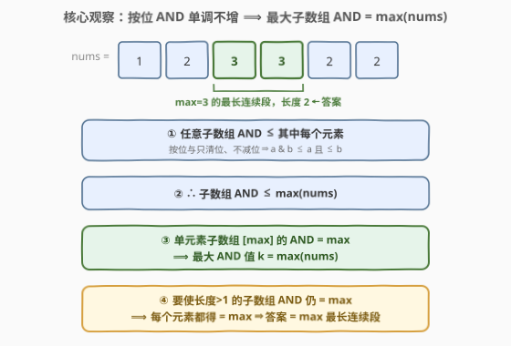
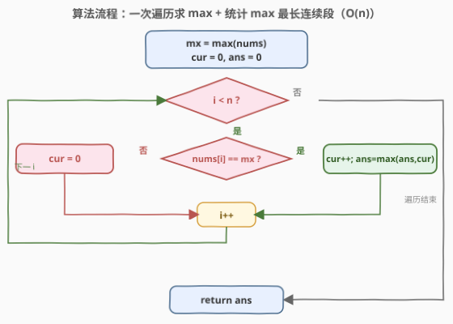

# 按位与最大的最长子数组

- **题目名称**：按位与最大的最长子数组
- **链接**：[2419. 按位与最大的最长子数组](https://leetcode.cn/problems/longest-subarray-with-maximum-bitwise-and/)
- **难度**：中等
- **标签**：位运算、数组、脑筋急转弯

## 1. 题目概述

给你一个长度为 `n` 的整数数组 `nums`。考虑 `nums` 中所有**非空**子数组执行**按位与（bitwise AND）**所能得到的**最大值** `k`。返回按位与结果**等于 `k`** 的**最长**子数组的长度。

子数组是数组中一个**连续**元素序列。

**示例 1**：

```text
输入：nums = [1,2,3,3,2,2]
输出：2
解释：子数组按位与运算的最大值是 3。
      能得到此结果的最长子数组是 [3,3]，故返回 2。
```

**示例 2**：

```text
输入：nums = [1,2,3,4]
输出：1
解释：子数组按位与运算的最大值是 4。
      能得到此结果的最长子数组是 [4]，故返回 1。
```

**约束条件**：

- $1 \le \text{nums.length} \le 10^5$
- $1 \le \text{nums}[i] \le 10^6$

> ⚠️ 朴素地枚举 $O(n^2)$ 个子数组、逐个求 AND 显然会超时（$n=10^5$）。突破口在于认清「按位与」的一条关键代数性质——**它对元素个数单调不增**。这条性质把「子数组 AND 的极值」直接锁定为「数组中的最大元素」，从而把求最长子数组降为一个一维扫描问题。

---

## 2. 解题思路

### 2.1 暴力思路：枚举子数组 + 增量 AND

最朴素的思路是枚举所有子数组，对每个子数组求按位与，记录最大值 `k` 以及达到 `k` 的最长长度。利用「向右扩展一位只需把新元素 AND 进累计值」的增量计算，单个子数组的 AND 可均摊 $O(1)$：

```text
best = 0          # 出现过的最大 AND 值
ans  = 0
for left in 0..n-1:
    cur_and = all_ones       # 全 1 掩码，作 AND 的单位元
    for right in left..n-1:
        cur_and &= nums[right]
        if cur_and > best:
            best = cur_and
            ans  = right - left + 1
        elif cur_and == best:
            ans  = max(ans, right - left + 1)
```

时间 $O(n^2)$（最坏如全相同数组，每个 `left` 都扫到末尾），$n = 10^5$ 时 $n^2 \approx 10^{10}$ 超时。瓶颈在于「按位与」被当成黑盒逐个求值，没有利用它的结构性质。

### 2.2 核心观察：AND 单调不增 ⟹ 最大 AND = max(nums)



**观察一：按位与只清位、不减位，故子数组 AND ≤ 其中每个元素。** 对任意两个整数 `a`、`b`，`a & b` 的每个比特位要么等于该位在 `a` 中的值、要么是 `0`，因此 $a \,\&\, b \le a$ 且 $a \,\&\, b \le b$。归纳地，一个子数组的 AND 不超过其中**任意**一个元素，进而

$$
\text{AND}(\text{子数组}) \;\le\; \min_{i \in \text{子数组}} \text{nums}[i] \;\le\; \max(\text{nums})
$$

**观察二：上界被单元素子数组达到，故最大 AND 值 $k = \max(\text{nums})$。** 长度为 `1` 的子数组 $[\text{nums}[i]]$ 的 AND 就是 $\text{nums}[i]$ 本身。取 $\text{nums}[i] = \max(\text{nums})$ 即得到 $k$。结合观察一，没有子数组的 AND 能超过 $\max(\text{nums})$，所以

$$
k \;=\; \max(\text{nums})
$$

**观察三（解题关键）：要使长度 $>1$ 的子数组 AND 仍 $= k$，必须其中每个元素都 $= k$。** 因为 AND $\le$ 每个元素。若子数组里存在某个元素 $\text{nums}[j] < k$，则该子数组的 AND $\le \text{nums}[j] < k$，不可能等于 $k$。反过来，若子数组**所有**元素都 $= k$，则它们两两 AND 仍 $= k$（相同值按位与为自身），整段 AND 就是 $k$。

> 💡 **一句话总结**：子数组 AND $= k \;\iff\;$ 子数组中所有元素都 $= k$（$k=\max(\text{nums})$）。于是「按位与最大的最长子数组」等价转化为「**数组中等于最大值的元素组成的最长连续段长度**」——一个标准的一维扫描题，和按位与本身已无关系。

### 2.3 算法流程图



算法分两步，均为线性扫描：

1. **求最大值**：`mx = max(nums)`，这同时确定了最大按位与值 `k`。
2. **统计最长连续段**：线性扫描，维护 `cur` = 当前连续等于 `mx` 的元素个数；遇到 `nums[i] == mx` 则 `cur += 1` 并更新 `ans = max(ans, cur)`，否则 `cur = 0`。

`i` 全程单调前进，总移动 $n$ 步，每步 $O(1)$，总 $O(n)$。

### 2.4 示例演算

以 `nums = [1, 2, 3, 3, 2, 2]` 为例，先求得 `mx = max(nums) = 3`，再扫描统计 `3` 的最长连续段：

![示例演算：nums=[1,2,3,3,2,2]，mx=max(nums)=3](../images/maxbitand_example_walkthrough.svg)

| 步 | `i` | `nums[i]` | `== mx?` | 动作 | `cur` | `ans` |
|----|-----|-----------|----------|------|--------|-------|
| 0 | 0 | 1 | 否 | `cur = 0` | 0 | 0 |
| 1 | 1 | 2 | 否 | `cur = 0` | 0 | 0 |
| 2 | 2 | 3 | 是 | `cur = 1`，`ans = 1` | 1 | 1 |
| 3 | 3 | 3 | 是 | `cur = 2`，`ans = 2` | 2 | **2** |
| 4 | 4 | 2 | 否 | `cur = 0` | 0 | 2 |
| 5 | 5 | 2 | 否 | `cur = 0` | 0 | 2 |

连续段在 `i = 4` 处被 `2` 打断，`ans` 不再增长。最长连续段为 `[3, 3]`（`i = 2, 3`），长度为 `2`，即答案。

---

## 3. 参考代码

### C++

```cpp
class Solution {
  public:
    int longestSubarray(vector<int>& nums) {
        int mx = *max_element(nums.begin(), nums.end());
        int ans = 0, cur = 0;
        for (int x : nums) {
            if (x == mx) {
                ++cur;
                ans = max(ans, cur);
            } else {
                cur = 0;
            }
        }
        return ans;
    }
};
```

### Python

```python
class Solution:
    def longestSubarray(self, nums: List[int]) -> int:
        mx = max(nums)
        ans = cur = 0
        for x in nums:
            if x == mx:
                cur += 1
                ans = max(ans, cur)
            else:
                cur = 0
        return ans
```

> 💡 **为何 `cur` 遇到非 `mx` 元素直接置 `0`？** 因为「等于 `mx` 的连续段」一旦被任意非 `mx` 元素打断，该元素无法出现在任何 AND $= k$ 的子数组里（见 2.2 观察三），新段只能从下一个 `mx` 重新起算。这是「连续段计数」的标准套路，与 [485. 最大连续 1 的个数](https://leetcode.cn/problems/max-consecutive-ones/) 同构——把「`1`」换成「`== mx`」即可。

---

## 4. 复杂度分析

| 维度 | 求最大值 + 扫描最长段 | 暴力枚举子数组 |
|------|----------------------|---------------|
| **时间复杂度** | $O(n)$（两趟线性扫描，常数 2） | $O(n^2)$（最坏每个 `left` 扫到末尾） |
| **空间复杂度** | $O(1)$ | $O(1)$（增量 AND，无需存子数组） |
| **是否真算 AND** | 否，等价转化为「最长连续段」 | 是，逐子数组增量 AND |

> 💡 **为何两趟仍是 $O(n)$？** 两趟扫描的代价是 $2n$ 次比较，渐近同为 $O(n)$，常数因子在 $n=10^5$ 下可忽略。若追求极致常数，可合并成单趟见第 5 节，但工程上两趟写法更清晰、更不易写错，面试首选。

---

## 5. 扩展：单趟扫描——边求 max 边统计

两趟写法先求 `mx` 再统计，逻辑最直观。其实可以**一趟**搞定：维护「目前见过的最大值 `mx`」与「当前 `mx` 的连续段长度 `cur`」。当遇到比 `mx` 更大的元素时，之前的最大值作废，`mx` 更新、`cur` 重置为 `1`：

```cpp
class Solution {
  public:
    int longestSubarray(vector<int>& nums) {
        int mx = 0, cur = 0, ans = 0;
        for (int x : nums) {
            if (x > mx) {           // 发现更大的最大值，之前的记录全部作废
                mx = x;
                cur = 1;
                ans = 1;
            } else if (x == mx) {   // 等于当前最大值，延续段
                ++cur;
                ans = max(ans, cur);
            } else {                // 小于当前最大值，段中断
                cur = 0;
            }
        }
        return ans;
    }
};
```

- 时间 $O(n)$（单趟），空间 $O(1)$。
- 关键不变式：**处理完 `nums[i]` 后，`mx` 恰为 `nums[0..i]` 的最大值，`cur` 恰为以 `i` 结尾、值全等于 `mx` 的最长连续段长度**。当 `x > mx` 时旧 `mx` 已不可能出现在更优解中（更小的值组不成更大的 AND），故重置合法。
- 由于约束 $1 \le \text{nums}[i]$，初值 `mx = 0` 会在首个元素处被立即覆盖，无需特判。

> ⚠️ **单趟写法的陷阱**：`x > mx` 分支必须**同时**重置 `cur = 1` 与 `ans = 1`（新最大值自身就是长度为 `1` 的合法段）。若只重置 `cur` 忘了重置 `ans`，在全递增数组（如 `[1,2,3,4]`）上会错误地返回旧 `ans`。两趟写法无此风险，这也是它更适合作为面试主答的原因。

---

## 6. 面试要点

1. **为什么最大按位 AND 就是 `max(nums)`？**

   - 按位与只清位、不减位，故子数组 AND $\le$ 其中每个元素 $\le \max(\text{nums})$。
   - 单元素子数组 $[\max(\text{nums})]$ 的 AND 恰为 $\max(\text{nums})$，达到上界。上确界即下确界，故 $k = \max(\text{nums})$。

2. **为什么长度 $>1$ 的子数组要 AND $= k$，必须每个元素都 $= k$？**

   - AND $\le$ 每个元素。若存在某元素 $< k$，则该子数组 AND $\le$ 该元素 $< k$，矛盾。反之，全等于 $k$ 时两两 AND 为自身（$k \,\&\, k = k$），整段 AND $= k$。所以「AND $= k$」$\iff$「全段等于 $k$」。

3. **为什么可以不真的计算任何子数组的 AND，只统计最长连续段？**

   - 由上两问，问题等价转化为「等于 $\max(\text{nums})$ 的元素的最长连续段长度」。等价转化后，按位与从问题中完全消失，退化为一维连续段计数，因此无需任何 AND 运算。这是「脑筋急转弯」类题的典型套路：用代数性质消去表面运算。

4. **单趟写法在遇到更大的元素时为何能安全重置 `cur`？**

   - 旧 `mx` 比新 `mx` 小，任何含旧值的子数组 AND $\le$ 旧值 $<$ 新 `mx`，不可能成为最优解，故丢弃旧记录无损失。重置后 `cur = 1` 表示「新最大值自身构成一段」，符合 2.2 的等价刻画。

5. **把题目里的「按位与」换成「按位或」会怎样？**

   - 按位或**单调不减**（只置位、不清位），子数组 OR 随长度扩张而增大，最大 OR $=$ 整个数组的 OR（需取尽所有置位）。这与本题「最大 AND $=$ 单个最大元素」截然不同——OR 的最大值要靠「凑齐所有位」而非「单点峰值」。这正是 [2411. 按位或为最大的最小子数组长度](https://leetcode.cn/problems/smallest-subarrays-with-maximum-bitwise-or/) 的处理思路：OR 单调不减 ⇒ 目标 OR = 全数组 OR，再用「最近置位位置」求最短子数组。AND/OR 的单调方向相反，故极值落点完全不同。

> 💡 **一句话总结**：按位与单调不增 ⇒ 子数组 AND 的最大值就是数组最大元素 `mx`；而要整段 AND $= \text{mx}$，须全段都等于 `mx`。于是题目等价于「`mx` 的最长连续段长度」，一趟或两趟 $O(n)$ 扫描即可。

---

## 7. 同类练习题

- [485. 最大连续 1 的个数](https://leetcode.cn/problems/max-consecutive-ones/)：同构的「连续段计数」模板，把「值为 1」换成「值等于 `mx`」即本题的第二趟扫描
- [2411. 按位或为最大的最小子数组长度](https://leetcode.cn/problems/smallest-subarrays-with-maximum-bitwise-or/)：姊妹题，位运算子数组极值；OR 单调不减 ⇒ 最大 OR = 全数组 OR，求最短，对照体会 AND/OR 单调方向相反带来的极值落点差异
- [898. 子数组按位或操作](https://leetcode.cn/problems/bitwise-ors-of-subarrays/)（[题解](../0801-0900/898_子数组按位或操作.md)）：位运算子数组值的计数，利用「位有限 ⇒ 每端点至多 30 种 OR 值」把状态压成滚动集合，思路同源
- [3171. 找到按位与最接近 K 的子数组](https://leetcode.cn/problems/find-subarray-with-bitwise-and-closest-to-k/)：按位**与**的子数组问题，用「AND 单调不增 ⇒ 滚动集合有界」求最接近 K 的值，对照本题对 AND 单调性的两种用法（极值落点 vs 状态压缩）
- [53. 最大子数组和](https://leetcode.cn/problems/maximum-subarray/)（[题解](../0001-0100/53_最大子数组和.md)）：子数组求极值的经典母题（Kadane），对照本题「用代数性质把子数组极值降为一维扫描」的化归思想
