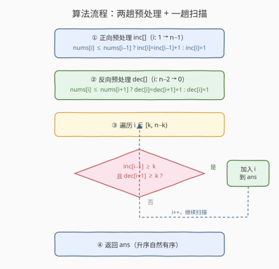
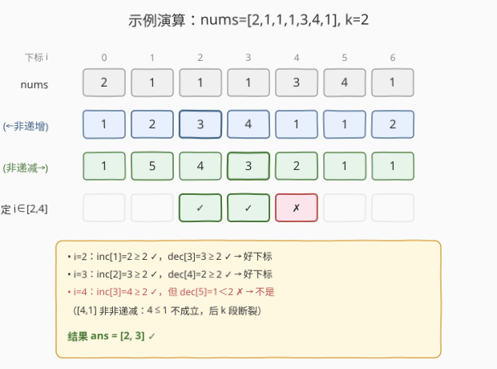

# LeetCode 找到所有好下标 题解

## 1. 题目概述

- **标题 / 题号**：找到所有好下标（#2420，medium）
- **链接**：https://leetcode.cn/problems/find-all-good-indices/
- **难度**：中等
- **标签**：数组、动态规划、前缀和（预处理）

**题意**：给你一个大小为 `n`、下标从 `0` 开始的整数数组 `nums` 和一个正整数 `k`。对于满足 $k \le i < n - k$ 的下标 $i$，若它同时满足：

- 下标 $i$ **之前** 的 $k$ 个元素是 **非递增的**（即 $\text{nums}[i-k] \ge \text{nums}[i-k+1] \ge \cdots \ge \text{nums}[i-1]$）；
- 下标 $i$ **之后** 的 $k$ 个元素是 **非递减的**（即 $\text{nums}[i+1] \le \text{nums}[i+2] \le \cdots \le \text{nums}[i+k]$）；

就称 $i$ 是一个**好下标**。按**升序**返回所有好下标。

> ⚠️ 注意「非递增」允许相邻相等（$\ge$），「非递减」也允许相邻相等（$\le$）；二者都含等号。这与 845 山脉的「严格」递增/递减（不含等号）不同，写转移时必须用 $\le$ 而非 $<$。

**示例 1**：

```text
输入：nums = [2,1,1,1,3,4,1], k = 2
输出：[2,3]
解释：
- 下标 2：子数组 [2,1] 非递增，[1,3] 非递减 → 好。
- 下标 3：子数组 [1,1] 非递增，[3,4] 非递减 → 好。
- 下标 4 不是好下标，因为 [4,1] 不是非递减。
```

**示例 2**：

```text
输入：nums = [2,1,1,2], k = 2
输出：[]
解释：候选区间 i ∈ [2, n-k) = [2,2) 为空，无好下标。
```

**约束**：

- $n = \text{nums.length}$
- $3 \le n \le 10^5$
- $1 \le \text{nums}[i] \le 10^6$
- $1 \le k \le n / 2$

> 💡 关键观察：判定 $i$ 是否为好下标，只需知道「以 $i-1$ 结尾的非递增段长度」和「以 $i+1$ 开头的非递减段长度」是否都 $\ge k$。这两个量可由两趟线性 DP 预先算好，扫描时 $O(1)$ 查表——把「逐段重复扫描」压成「一次预处理 + 一次线性遍历」。

## 2. 解题思路

### 2.1 暴力思路：逐个下标向两侧各扫 k 格

最直接的做法是：对每个候选 $i \in [k,\, n-k)$，分别向左扫 $k$ 格判非递增、向右扫 $k$ 格判非递减：

```text
ans = []
for i in range(k, n - k):
    left_ok  = all(nums[j-1] >= nums[j] for j in range(i-k+1, i+1))   # 前 k 格非递增
    right_ok = all(nums[j] <= nums[j+1] for j in range(i+1, i+k))     # 后 k 格非递减
    if left_ok and right_ok:
        ans.append(i)
```

每个 $i$ 要 $O(k)$，共 $O(n)$ 个候选，总计 $O(n \cdot k)$。由 $k \le n/2$，最坏 $k = n/2$ 时约为 $n^2/2$；$n = 10^5$ 即 $5 \times 10^9$，必然 TLE。

> ⚠️ 瓶颈在于**重复扫描**：相邻候选 $i$ 与 $i+1$ 的「前 $k$ 格」重叠了 $k-1$ 个元素，却在判定 $i+1$ 时从零重扫这 $k-1$ 个已判过的关系。同理「后 $k$ 格」也大量重叠。这正是**前缀/后缀预处理 DP**的典型信号——把每对相邻关系只算一次、缓存成段长，查询时 $O(1)$。

### 2.2 核心观察：两趟 DP 预处理 inc/dec，扫描时查表

![核心观察：前 k 格非递增 ⟺ inc[i−1]≥k，后 k 格非递减 ⟺ dec[i+1]≥k](../images/gindices_concept.svg)

定义两个一维数组：

- $\text{inc}[i]$：**以 $i$ 结尾**的连续非递增段的长度（元素个数）。转移：

  $$
  \text{inc}[i] =
  \begin{cases}
  \text{inc}[i-1] + 1, & \text{nums}[i] \le \text{nums}[i-1] \\
  1, & \text{否则（含 } i=0 \text{ 基准）}
  \end{cases}
  $$

  正向扫一趟即可（$i$ 从 $1$ 到 $n-1$）。

- $\text{dec}[i]$：**以 $i$ 开头**的连续非递减段的长度。转移：

  $$
  \text{dec}[i] =
  \begin{cases}
  \text{dec}[i+1] + 1, & \text{nums}[i] \le \text{nums}[i+1] \\
  1, & \text{否则（含 } i=n-1 \text{ 基准）}
  \end{cases}
  $$

  反向扫一趟即可（$i$ 从 $n-2$ 到 $0$）。

**为什么这两个量就够用？** 「前 $k$ 格非递增」等价于「以 $i-1$ 结尾的非递增段至少有 $k$ 个元素」，即 $\text{inc}[i-1] \ge k$；「后 $k$ 格非递减」等价于 $\text{dec}[i+1] \ge k$。于是候选 $i$ 是好下标当且仅当

$$
\text{inc}[i-1] \ge k \;\;\text{且}\;\; \text{dec}[i+1] \ge k.
$$

> 💡 **结构对称性**：$\text{inc}$ 是「向左看」的递推（依赖 $i-1$），$\text{dec}$ 是「向右看」的递推（依赖 $i+1$），方向相反但形态完全镜像。这种「正扫一次 + 反扫一次、最后在每点合并」的双趟 DP，正是 [845. 数组中的最长山脉](../0801-0900/845_数组中的最长山脉.md) 第 5 节「前缀上升 + 后缀下降」的同款骨架，也与 [238. 除自身以外数组的乘积](../0201-0300/238_除自身以外数组的乘积.md) 的「前缀积 + 后缀积」同源。

### 2.3 算法流程图



骨架三步：

1. **正向**：计算 $\text{inc}[]$，$i$ 从 $1$ 到 $n-1$，比较 $\text{nums}[i]$ 与 $\text{nums}[i-1]$；
2. **反向**：计算 $\text{dec}[]$，$i$ 从 $n-2$ 到 $0$，比较 $\text{nums}[i]$ 与 $\text{nums}[i+1]$；
3. **扫描**：$i$ 从 $k$ 到 $n-k-1$（即半开区间 $[k,\, n-k)$），若 $\text{inc}[i-1] \ge k$ 且 $\text{dec}[i+1] \ge k$ 则把 $i$ 加入答案。

> ⚠️ **边界**：候选区间是 $i \in [k,\, n-k)$（左闭右开），等价于 $k \le i \le n-k-1$。当 $n < 2k+1$（如示例 2，$n=4,k=2$）时区间为空，自然返回 `[]`，无需特判。访问 $\text{inc}[i-1]$ 在 $i \ge k \ge 1$ 时下标合法；访问 $\text{dec}[i+1]$ 在 $i \le n-k-1 \le n-2$ 时下标合法，故两处查表不会越界。

### 2.4 示例演算



以示例 1 `nums = [2,1,1,1,3,4,1]`，$k = 2$，$n = 7$。

**第一趟（正向算 inc，比较 nums[i] ≤ nums[i-1]）**：

| $i$ | nums[i] | 与前比较 | $\text{inc}[i]$ |
|-----|---------|----------|------------------|
| 0 | 2 | —（基准） | 1 |
| 1 | 1 | $1 \le 2$ ✓ | $\text{inc}[0]+1 = 2$ |
| 2 | 1 | $1 \le 1$ ✓ | $\text{inc}[1]+1 = 3$ |
| 3 | 1 | $1 \le 1$ ✓ | $\text{inc}[2]+1 = 4$ |
| 4 | 3 | $3 \le 1$ ✗ | 1 |
| 5 | 4 | $4 \le 3$ ✗ | 1 |
| 6 | 1 | $1 \le 4$ ✓ | $\text{inc}[5]+1 = 2$ |

$\text{inc} = [1,2,3,4,1,1,2]$。

**第二趟（反向算 dec，比较 nums[i] ≤ nums[i+1]）**：

| $i$ | nums[i] | 与后比较 | $\text{dec}[i]$ |
|-----|---------|----------|------------------|
| 6 | 1 | —（基准） | 1 |
| 5 | 4 | $4 \le 1$ ✗ | 1 |
| 4 | 3 | $3 \le 4$ ✓ | $\text{dec}[5]+1 = 2$ |
| 3 | 1 | $1 \le 3$ ✓ | $\text{dec}[4]+1 = 3$ |
| 2 | 1 | $1 \le 1$ ✓ | $\text{dec}[3]+1 = 4$ |
| 1 | 1 | $1 \le 1$ ✓ | $\text{dec}[2]+1 = 5$ |
| 0 | 2 | $2 \le 1$ ✗ | 1 |

$\text{dec} = [1,5,4,3,2,1,1]$。

**第三趟（扫描 $i \in [2, 5)$）**：

| $i$ | $\text{inc}[i-1]$ | $\text{dec}[i+1]$ | 判定 | 结果 |
|-----|--------------------|--------------------|------|------|
| 2 | $\text{inc}[1]=2 \ge 2$ ✓ | $\text{dec}[3]=3 \ge 2$ ✓ | 好 | 加入 2 |
| 3 | $\text{inc}[2]=3 \ge 2$ ✓ | $\text{dec}[4]=2 \ge 2$ ✓ | 好 | 加入 3 |
| 4 | $\text{inc}[3]=4 \ge 2$ ✓ | $\text{dec}[5]=1 < 2$ ✗ | 否 | 跳过 |

最终 `ans = [2, 3]` ✓。下标 4 处前 $k$ 格 `[1,1]` 非递增（$\text{inc}[3]=4 \ge 2$）成立，但后 $k$ 格 `[4,1]` 因 $4 \le 1$ 不成立而非非递减（对应 $\text{dec}[5]=1$），故被否决——这正是题面强调的点。

> 💡 顺序遍历 $i$ 从小到大，加入答案的 $i$ 自然升序，无需额外排序。

## 3. 参考代码

### C++

```cpp
class Solution {
public:
    vector<int> goodIndices(vector<int>& nums, int k) {
        int n = nums.size();
        vector<int> inc(n, 1);                       // 以 i 结尾的非递增段长
        for (int i = 1; i < n; ++i)
            if (nums[i] <= nums[i - 1]) inc[i] = inc[i - 1] + 1;

        vector<int> dec(n, 1);                       // 以 i 开头的非递减段长
        for (int i = n - 2; i >= 0; --i)
            if (nums[i] <= nums[i + 1]) dec[i] = dec[i + 1] + 1;

        vector<int> ans;
        for (int i = k; i < n - k; ++i)              // 候选区间 [k, n-k)
            if (inc[i - 1] >= k && dec[i + 1] >= k) ans.push_back(i);
        return ans;
    }
};
```

> 💡 两个 DP 数组初始化全 `1`（单个元素自成一段），转移时只在该方向比较一次相邻元素。比较用 `<=`：`nums[i] <= nums[i-1]` 表「非递增」，`nums[i] <= nums[i+1]` 表「非递减」，二者都含等号，对应题意「非递增/非递减允许相邻相等」。

### Python

```python
class Solution:
    def goodIndices(self, nums: List[int], k: int) -> List[int]:
        n = len(nums)
        inc = [1] * n
        for i in range(1, n):
            if nums[i] <= nums[i - 1]:
                inc[i] = inc[i - 1] + 1

        dec = [1] * n
        for i in range(n - 2, -1, -1):
            if nums[i] <= nums[i + 1]:
                dec[i] = dec[i + 1] + 1

        return [i for i in range(k, n - k)
                if inc[i - 1] >= k and dec[i + 1] >= k]
```

> 💡 用列表推导式直接产出答案，`range(k, n - k)` 在区间为空时（如 $n < 2k+1$）自然返回 `[]`。若想省空间，`dec` 可改为正向一次性算「以 $i$ 结尾的非递减段长」（比较 `nums[i] >= nums[i-1]`），则好下标条件改用「$i+1$ 处的结尾段长 $\ge k$」；但「以 $i$ 开头」的版本与题意「向后看 $k$ 格」语义更直接对应，可读性更好。

## 4. 复杂度分析

| 维度 | 复杂度 | 说明 |
|------|--------|------|
| **时间复杂度** | $O(n)$ | 正向算 `inc` 一趟 $O(n)$、反向算 `dec` 一趟 $O(n)$、扫描候选 $O(n)$，总计线性 |
| **空间复杂度** | $O(n)$ | 两个长度 $n$ 的 DP 数组 `inc`、`dec`；答案数组最坏 $O(n)$ |
| 对照：逐个重扫 | $O(n \cdot k)$ | 每个候选向两侧各扫 $k$ 格，最坏 $k=n/2$ 时约 $n^2/2 = 5\times10^9$，TLE |

> 💡 预处理把每对相邻关系只算一次并缓存，把「逐候选 $O(k)$ 判定」降为「逐候选 $O(1)$ 查表」。这是「重叠子区间 + 可复用判定」从 $O(nk)$ 降到 $O(n)$ 的通用范式——空间换时间，典型的前缀/后缀 DP。

## 5. 扩展：空间优化与变体

**空间优化**：若需 $O(1)$ 额外空间（不计答案），可去掉 `inc` 数组、只保留 `dec`：因为扫描 $i$ 从小到大时，所需 `inc[i-1]` 可用一个滚动变量 `cur_inc` 在正向预处理时同步推进——一边算 `cur_inc` 一边对已就绪的 `dec[i+1]` 判定。但实现需小心：`cur_inc` 表示「以 $i-1$ 结尾的非递增段长」，递推到 $i$ 时先用旧值判定再更新，否则会用错位段长。一般情况下 $n=10^5$ 时两个 `int` 数组仅约 $0.8\,\text{MB}$，远低于内存限制，故**可读性优先**，保留双数组版本更稳妥。

**变体边界**：

| 变体 | 思路调整 |
|------|----------|
| 改为「严格」非递增/非递减（不含等号） | 转移比较号由 `<=` 改为 `<`（前段）与 `<`（后段），即 845 山脉口径 |
| 求好下标**个数**而非列表 | 同算法，扫描时计数而非收集，仍 $O(n)$ |
| $k$ 在线多次询问（不同 $k$ 查同一数组） | 预处理 `inc`/`dec` 一次，每次询问 $O(n)$ 扫描；若 $k$ 集中可离线按 $k$ 分桶 |
| 统计满足条件的**最长**好段长度 | 滑动窗口/并查集维护连续合法段，是本题的「最长子段」延伸 |

> 💡 经验：凡是「对每个位置判一段相邻关系是否满足单调性」且候选区间相邻重叠，先想两趟 DP 预处理段长，再 $O(1)$ 查表。

## 6. 面试要点

1. **为什么 $O(nk)$ 暴力会超时？**

   > 每个候选 $i$ 要向左右各扫 $k$ 格做 $k-1$ 次比较，共约 $n$ 个候选，总比较 $\Theta(nk)$。$k \le n/2$ 时最坏 $\Theta(n^2/2)$；$n=10^5$ 即 $\sim 5\times10^9$ 次比较，远超 $10^8$ 阈值。根因是相邻候选的重叠子区间被重复扫描。

2. **`inc`/`dec` 的定义与转移方向为何这样设计？**

   > `inc[i]` 取「以 $i$ 结尾」便于正向递推（依赖 $i-1$，左→右扫）；`dec[i]` 取「以 $i$ 开头」便于反向递推（依赖 $i+1$，右→左扫）。两者方向相反、形态镜像，正好分别刻画「前 $k$ 格」与「后 $k$ 格」。若把 `dec` 也设计成「以 $i$ 结尾的非递减段长」则需正向扫，但好下标判据要相应改为查 `dec[i+k]`，语义略绕——开头条件式更直观。

3. **为什么比较必须用 `<=` 而非 `<`？**

   > 题目「非递增/非递减」**含等号**（允许相邻相等，如示例的 `[1,1]`）。若误用严格 `<`，则 `[1,1]` 这类相等段会被判为不满足，漏掉合法下标 3（其前 $k$ 格 `[1,1]` 正是相等非递增段）。这与 845 山脉的「严格」口径恰好相反，需看清题意。

4. **候选区间为何是 $[k, n-k)$？越界如何兜底？**

   > 前 $k$ 格需 $i-k \ge 0$ 即 $i \ge k$；后 $k$ 格需 $i+k \le n-1$ 即 $i \le n-k-1$，合并得 $i \in [k, n-k)$。当 $n < 2k+1$（如示例 2）区间为空，`range(k, n-k)` 直接产出 `[]`，无需特判。查表 `inc[i-1]`、`dec[i+1]` 在此区间内下标必然落在 $[0,n-1]$，不越界。

5. **本题与 845 最长山脉、238 乘积除自身的联系？**

   > 三者同属「两趟预处理 + 逐点合并」家族：845 第 5 节的 `up[i]`（以 $i$ 结尾的严格递增段长）+ `down[i]`（以 $i$ 开头的严格递减段长）与本题 `inc`/`dec` 几乎逐行对应（仅严格/非严格之别），合并处 845 取 `up+1+down` 求最长、本题取「两侧均 $\ge k$」筛下标；238 的「前缀积 × 后缀积」则是把「左右各算一次」的思想用在乘积上，结构同源。

> 💡 **一句话总结**：正向算「以 $i$ 结尾的非递增段长」`inc`、反向算「以 $i$ 开头的非递减段长」`dec`，扫描 $i \in [k, n-k)$ 时查 `inc[i-1]≥k 且 dec[i+1]≥k` 即得全部好下标。$O(n)$ / $O(n)$，与 845、238 同源的双趟预处理范式。

## 同类练习题

| # | 题目 | 与本题的关联 |
|---|------|-------------|
| 845 | [数组中的最长山脉](https://leetcode.cn/problems/longest-mountain-in-array/)（[题解](../0801-0900/845_数组中的最长山脉.md)） | **同骨架母题**，第 5 节「前缀上升 + 后缀下降」两趟 DP 与本题 `inc`/`dec` 逐行对应，仅严格/非严格之别，先做此题可一眼看穿 2420 |
| 238 | [除自身以外数组的乘积](https://leetcode.cn/problems/product-of-array-except-self/)（[题解](../0201-0300/238_除自身以外数组的乘积.md)） | 同源「前缀积 + 后缀积」两趟预处理范式，对照「乘积型」与「段长型」预处理的差异 |
| 674 | [最长连续递增序列](https://leetcode.cn/problems/longest-continuous-increasing-subsequence/)（[题解](../0601-0700/674_最长连续递增序列.md)） | 单向段长 DP，正是 `inc`/`dec` 的单方向积木，理解它即可推广到双向 |
| 665 | [非递减数组](https://leetcode.cn/problems/non-decreasing-array/)（[题解](../0601-0700/665_非递减数组.md)） | 围绕「非递减」性质的判定与修改，对照「判全局非递减」与「判局部非递减段长」的不同处理口径 |
