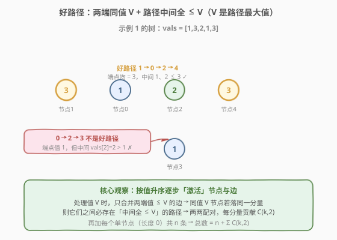
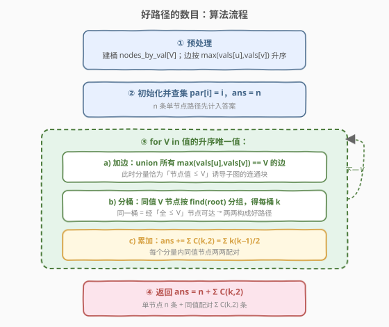

# 好路径的数目

- **题目名称**：好路径的数目
- **链接**：[2421. 好路径的数目](https://leetcode.cn/problems/number-of-good-paths/)
- **难度**：困难
- **标签**：并查集、树、图、排序

## 1. 题目概述

给你一棵 $n$ 个节点的树（连通无向无环图），节点编号 $0 \sim n-1$，恰好 $n-1$ 条边。`vals[i]` 为节点 $i$ 的值，`edges[i] = [a_i, b_i]` 为一条无向边。

一条**好路径**需满足：

1. 开始节点与结束节点的值**相同**；
2. 开始与结束之间所有节点值都**小于等于**开始节点的值（即开始节点的值是路径上所有节点的**最大值**）。

单个节点也视为一条合法路径（长度为 $0$）。路径与其反向视为同一条。返回不同好路径的数目。

**示例 1**：

```text
输入：vals = [1,3,2,1,3], edges = [[0,1],[0,2],[2,3],[2,4]]
输出：6
解释：5 条单节点路径 + 1 条好路径 1 -> 0 -> 2 -> 4
     （端点值 3，中间 1、2 均 ≤ 3 ✓；反向 4 -> 2 -> 0 -> 1 视为同一条）
     注意 0 -> 2 -> 3 不是好路径：端点值 1，但中间 vals[2]=2 > 1 ✗
```

**示例 2**：

```text
输入：vals = [1,1,2,2,3], edges = [[0,1],[1,2],[2,3],[2,4]]
输出：7
解释：5 条单节点路径 + 0->1、2->3 两条好路径
```

**示例 3**：

```text
输入：vals = [1], edges = []
输出：1
```

**约束条件**：

- $n = \text{vals.length}$
- $1 \le n \le 3 \times 10^4$
- $0 \le \text{vals}[i] \le 10^5$
- $\text{edges.length} = n - 1$
- $\text{edges}$ 表示一棵合法的树

> 💡 关键观察：树中任两节点间**简单路径唯一**。好路径 ⟺ 两端同值 $V$ 且它们之间的唯一树路径上节点值全 $\le V$。把「值 $\le V$ 的节点」看成子图 $G_{\le V}$，则「两端值 $V$ 的好路径」⟺「两端在 $G_{\le V}$ 中连通」。按值升序增量并查集维护 $G_{\le V}$，每个同值同分量组 $k$ 个节点贡献 $\binom{k}{2}$ 条配对路径，再加单节点 $n$ 条即得答案。

---

## 2. 解题思路

### 2.1 暴力思路：枚举同值点对 + 逐条验证路径最大值

枚举所有值相同的点对 $(i, j)$（$i < j$，$\text{vals}[i]=\text{vals}[j]=V$），对每对求树上 $i \to j$ 唯一路径并检查路径最大值是否 $\le V$。单次求路径并取最大值 $O(n)$；同值点对最坏 $O(n^2)$ 个（全部节点同值），总计 $O(n^3)$。$n=3\times10^4$ 时 $\sim 2.7\times10^{13}$，完全不可行。

即便用 LCA + 倍增把每次路径最大值查询降到 $O(\log n)$ 或 $O(1)$，点对数 $O(n^2)$ 本身（最坏 $\sim 4.5\times10^8$）仍是硬伤。

> ⚠️ 瓶颈在于「逐点对验证」：大量同值点对其实聚在同一个「值 $\le V$ 的连通块」里，是否好路径只取决于它们是否同属一个连通块——这天然适合**按连通分量批量统计**，而非两两判别。

### 2.2 核心观察：按值升序「激活」+ 并查集分量内配对



把好路径条件换种说法：两端同值 $V$，路径上**所有节点值 $\le V$**（端点值 $V$ 恰是路径最大值）。由于原图是树，任两节点间的简单路径**唯一**，所以「$i,j$（同值 $V$）存在好路径」⟺「树上 $i \to j$ 唯一路径中间节点值全 $\le V$」。

**关键转化**：令 $G_{\le V}$ 为「节点值 $\le V$」的诱导子图，则

$$
i,j \text{ 在 } G_{\le V} \text{ 中连通} \iff \text{树上 } i\to j \text{ 路径节点值全 } \le V \iff (i,j) \text{ 是好路径}.
$$

> 💡 因为树是森林，$G_{\le V}$ 是其子森林；$i,j$ 在子森林连通 ⟺ 它们之间唯一树路径上的节点全部出现在子森林中（即值全 $\le V$）。端点值 $V$ 是路径上的最大值，恰好满足好路径定义。

于是只需：对每个值 $V$，统计 $G_{\le V}$ 中「值为 $V$ 的节点」在各连通分量里的分布——每个有 $k$ 个这种节点的分量贡献 $\binom{k}{2}$ 条好路径（任取两点的唯一树路径全 $\le V$，端点值 $V$ 为最大）。单节点路径另算共 $n$ 条。

> ⚠️ 注意「值为 $V$ 但孤立于 $G_{\le V}$」的节点：它的邻接边都连向 $> V$ 的节点，所以在 $G_{\le V}$ 中自成一分量，$k=1$，$\binom{1}{2}=0$，不产生配对——它只作为单节点计入 $n$。这正是「中间节点必须 $\le$ 端点」的体现：连不出去就无法配对。

**如何高效维护 $G_{\le V}$？** 按值升序逐步「激活」：一条边 $(u,v)$ 属于 $G_{\le V}$ 当且仅当 $\max(\text{vals}[u],\text{vals}[v]) \le V$。把边按 $w_e = \max(\text{vals}[u],\text{vals}[v])$ 升序排序，处理值 $V$ 时先把所有 $w_e = V$ 的边用并查集 `union` 进来——此时并查集分量恰等于 $G_{\le V}$ 的连通分量；再对值为 $V$ 的节点按 `find` 根分桶计数即可。

> 💡 这正是 **Kruskal 式「按权值排序 + 增量并查集」** 在计数题上的应用：把「阈值 $V$ 下的连通性」离线成一串递增阈值，每次只增量加边。与 [1631. 最小体力消耗路径](../1601-1700/1631_最小体力消耗路径.md)、[1697. 检查边长度限制的路径是否存在](../1601-1700/1697_检查边长度限制的路径是否存在.md) 同源。

**不变量**：处理完值 $V$（加完其 $w_e=V$ 的边）后，并查集中任意两节点同分量 ⟺ 它们在 $G_{\le V}$ 中连通。由此对值为 $V$ 的节点分桶才正确反映「好路径可达性」。

### 2.3 算法流程图



骨架四步：

1. **预处理**：建桶 `by_val[V]` = 值为 $V$ 的节点列表；边按 $w_e=\max(\text{vals}[u],\text{vals}[v])$ 升序排序。
2. **初始化**：并查集 `par[i]=i`（按大小合并），`ans = n`（单节点路径）。
3. **主循环** `for V in 值的升序唯一值`：
   - **加边**：`union` 所有 $w_e == V$ 的边；
   - **分桶**：值为 $V$ 的节点按 `find(v)` 分组，得每桶大小 $k$；
   - **累加**：`ans += Σ k(k-1)/2`。
4. **返回** `ans`。

> ⚠️ 必须先加边再分桶：$G_{\le V}$ 包含 $w_e = V$ 的边（两端值都 $\le V$），它们可能把若干值为 $V$ 的节点并入同分量。若先计数后加边，会漏算「需经另一同值 $V$ 节点中转」的配对。

### 2.4 示例演算

![示例 1 演算：vals=[1,3,2,1,3] 按 V=1,2,3 逐步激活与配对](../images/goodpath_example_walkthrough.svg)

以示例 1 `vals = [1,3,2,1,3]`，`edges = [[0,1],[0,2],[2,3],[2,4]]` 为例。节点值：$0{=}1,1{=}3,2{=}2,3{=}1,4{=}3$。

边按 $w_e$ 排序：

| 边 | $\max$ 两端值 | $w_e$ |
|----|---------------|-------|
| $0$-$2$ | $\max(1,2)$ | 2 |
| $2$-$3$ | $\max(2,1)$ | 2 |
| $0$-$1$ | $\max(1,3)$ | 3 |
| $2$-$4$ | $\max(2,3)$ | 3 |

升序后：$[0\text{-}2\,(2),\, 2\text{-}3\,(2),\, 0\text{-}1\,(3),\, 2\text{-}4\,(3)]$。`ans = n = 5`。

| $V$ | 加边（$w_e=V$） | 加完后分量 | 值为 $V$ 的节点分桶 | $\binom{k}{2}$ | `ans` |
|-----|----------------|-----------|---------------------|----------------|-------|
| 1 | 无 | $\{0\},\{1\},\{2\},\{3\},\{4\}$ | $0\to\{0\}(1),\;3\to\{3\}(1)$ | $0+0=0$ | 5 |
| 2 | $0\text{-}2,\;2\text{-}3$ | $\{0,2,3\},\{1\},\{4\}$ | $2\to\{0,2,3\}(1)$ | $0$ | 5 |
| 3 | $0\text{-}1,\;2\text{-}4$ | $\{0,1,2,3,4\}$ | $1,4\to$ 同分量 $(k=2)$ | $\binom{2}{2}=1$ | 6 |

> 💡 **$V=3$ 是关键步**：加边 $0\text{-}1$、$2\text{-}4$ 后，节点 $1$（值 $3$）与 $4$（值 $3$）并入同一分量 $\{0,1,2,3,4\}$，$k=2$ 产生 $1$ 条配对路径——对应好路径 $1\to0\to2\to4$（中间 $0,2$ 值 $1,2\le3$ ✓）。而 $V=1$ 时节点 $0,3$ 虽同值，却被值 $2$ 的节点 $2$ 隔断（$2$ 不在 $G_{\le1}$ 中），分属不同分量，无法配对——这正是「$0\to2\to3$ 非好路径」的算法体现。

最终 `ans = 6` ✓。

---

## 3. 参考代码

### C++

```cpp
class Solution {
public:
    int numberOfGoodPaths(vector<int>& vals, vector<vector<int>>& edges) {
        int n = vals.size();
        vector<int> par(n), sz(n, 1);
        iota(par.begin(), par.end(), 0);
        function<int(int)> find = [&](int x) {
            return par[x] == x ? x : par[x] = find(par[x]);
        };
        auto unite = [&](int u, int v) {
            int pu = find(u), pv = find(v);
            if (pu == pv) return;
            if (sz[pu] > sz[pv]) swap(pu, pv);
            par[pu] = pv;
            sz[pv] += sz[pu];
        };

        // 边按两端值的较大者升序（值小的先激活）
        sort(edges.begin(), edges.end(), [&](const auto& a, const auto& b) {
            return max(vals[a[0]], vals[a[1]]) < max(vals[b[0]], vals[b[1]]);
        });

        // 值 -> 节点列表
        unordered_map<int, vector<int>> byVal;
        for (int v = 0; v < n; ++v) byVal[vals[v]].push_back(v);
        vector<int> uniq;
        for (auto& [val, _] : byVal) uniq.push_back(val);
        sort(uniq.begin(), uniq.end());            // 值升序遍历

        long long ans = n;                          // 每个单节点都是好路径
        int i = 0, m = edges.size();
        for (int V : uniq) {
            // 加边：所有 w_e == V 的边
            while (i < m && max(vals[edges[i][0]], vals[edges[i][1]]) == V) {
                unite(edges[i][0], edges[i][1]);
                ++i;
            }
            // 分桶：值为 V 的节点按根分组
            unordered_map<int, int> cnt;
            for (int v : byVal[V]) cnt[find(v)]++;
            for (auto& [r, k] : cnt)
                ans += (long long)k * (k - 1) / 2;
        }
        return ans;
    }
};
```

> 💡 **边指针单调推进**：边已按 $w_e$ 升序排好，`while` 用 `==V` 取当前值的所有边；$w_e < V$ 的边已在更小 $V$ 的轮次加过，$w_e > V$ 的留到对应轮次。因每条边的 $w_e$ 必是某节点值（必在 `uniq` 中），指针最终恰好走完，无遗漏。

### Python

```python
class Solution:
    def numberOfGoodPaths(self, vals: List[int], edges: List[List[int]]) -> int:
        n = len(vals)
        par = list(range(n))
        sz = [1] * n

        def find(x):
            while par[x] != x:
                par[x] = par[par[x]]      # 路径压缩
                x = par[x]
            return x

        def unite(u, v):
            pu, pv = find(u), find(v)
            if pu == pv:
                return
            if sz[pu] > sz[pv]:
                pu, pv = pv, pu
            par[pu] = pv
            sz[pv] += sz[pu]

        edges.sort(key=lambda e: max(vals[e[0]], vals[e[1]]))

        from collections import defaultdict
        by_val = defaultdict(list)
        for v in range(n):
            by_val[vals[v]].append(v)

        ans = n                              # 单节点路径
        i, m = 0, len(edges)
        for V in sorted(by_val):
            while i < m and max(vals[edges[i][0]], vals[edges[i][1]]) == V:
                unite(edges[i][0], edges[i][1])
                i += 1
            cnt = defaultdict(int)
            for v in by_val[V]:
                cnt[find(v)] += 1
            for k in cnt.values():
                ans += k * (k - 1) // 2
        return ans
```

> 💡 **答案上界**：最坏所有节点同值且全连通，$\text{ans} = n + \binom{n}{2} = \frac{n(n+1)}{2}$，$n=3\times10^4$ 时约 $4.5\times10^8$，在 32 位 `int` 内（$< 2.1\times10^9$），但 C++ 中途累加用 `long long` 更稳妥。

---

## 4. 复杂度分析

| 维度 | 复杂度 | 说明 |
|------|--------|------|
| **时间复杂度** | $O(n \log n)$ | 排序边 $O(n\log n)$；每个节点入桶一次、每条边 union 一次，并查集（按大小合并 + 路径压缩）近似 $O(n\,\alpha(n))$；总计以排序为瓶颈 |
| **空间复杂度** | $O(n)$ | 并查集 `par`/`sz` 各 $O(n)$；值桶 `byVal` 共存 $n$ 个节点；分桶 `cnt` 临时 |
| 对照：暴力点对 | $O(n^3)$ | 枚举同值点对最坏 $O(n^2)$，每次线性求路径最大值 $O(n)$ |

> 💡 $n \le 3\times10^4$，$n\log n \approx 4.5\times10^5$，远低于时限。排序是因「按阈值增量加边」需要边有序；若值域小或已部分有序，可用计数排序降到 $O(n + V_{\max})$，但常数未必更优。

---

## 5. 扩展：从「阈值连通性」看 Kruskal 式并查集家族

本题是**离线阈值并查集**家族的计数代表：维护「在权值阈值 $V$ 下，哪些节点连通」，随 $V$ 递增增量加边。家族成员对照：

| 题目 | 阈值语义 | 增量加边判据 | 在阈值处做的事 |
|------|----------|--------------|----------------|
| **2421 好路径** | 节点值上限 $V$ | $\max(\text{两端值}) \le V$ | 同值节点分桶计数 $\binom{k}{2}$ |
| 1631 最小体力消耗 | 边权上限 | 边权 $\le$ 阈值 | 查两端是否同分量 |
| 1697 边长限制可达 | 边权上限 | 边权 $<$ 询问限制 | 回答离线询问 |
| 1102 得分最高的路径 | 边权下限 | 边权 $\ge$ 阈值 | 并查集合并后查连通 |
| 1135 最低成本联通 | Kruskal 选边 | 边权升序选最小 | 凑成生成树 |

| 维度 | 本题（计数） | 1631/1697（判定） |
|------|-------------|-------------------|
| 目标 | 数同值同分量配对数 | 回答 yes/no（是否连通） |
| 阈值处动作 | 分桶 + 组合计数 | 单次 `find` 比较 |
| 排序对象 | 边（按两端 max） | 边（按边权） + 可能询问 |

> 💡 **统一视角**：只要问题能表述为「在阈值 $V$ 下查询/统计连通性」，且阈值递增时只需增量加边（并查集只合并不拆分），就适用此范式。需「删边」的动态问题（如 803 砖块掉落）则要反向并查集把删除转成倒序添加——见 [1562. 查找大小为 M 的最新组](../1501-1600/1562_查找大小为M的最新分组.md) 第 5 节。

---

## 6. 面试要点

1. **为什么好路径 ⟺ $G_{\le V}$ 中同分量？**

   > 树中两节点间简单路径唯一。「$i,j$ 同值 $V$ 是好路径」⟺ 该唯一路径中间节点值全 $\le V$ ⟺ 这些节点全在「值 $\le V$」的诱导子图 $G_{\le V}$ 中 ⟺ $i,j$ 在 $G_{\le V}$ 中连通。三步等价，关键用了「树是森林、子图也是森林、连通即唯一路径节点全在」。

2. **为什么按 $\max(\text{vals}[u],\text{vals}[v])$ 而非单端点值排序边？**

   > 边属于 $G_{\le V}$ 当且仅当**两端**值都 $\le V$，即 $\max \le V$。按两端值的较大者排序，恰能在到达阈值 $V$ 时一次性激活「两端都 $\le V$」的所有新边。若按某一端值排序，会在另一端仍 $>V$ 时过早加边，破坏 $G_{\le V}$ 的连通性语义。

3. **必须先加边再分桶，顺序能反吗？**

   > 不能。$G_{\le V}$ 包含 $w_e=V$ 的边（两端值都 $\le V$，其中至少一端 $=V$）。这些边可能把多个值为 $V$ 的节点并入同分量。若先计数后加边，会漏算「经另一同值 $V$ 节点中转」的配对——例如三个值 $V$ 的节点链状相连（中间也值 $V$），两端点的好路径需经中间 $V$ 节点，而该中间节点对应的边 $w_e=V$ 必须先加。

4. **孤立同值节点（$k=1$）会被重复计数吗？**

   > 不会。单节点路径共 $n$ 条，是「长度 $0$」路径；$\binom{k}{2}$ 只计**不同节点对**（长度 $\ge1$），二者不重叠。$k=1$ 时 $\binom{1}{2}=0$，该节点的好路径仅其自身一条，已含在 $n$ 中。

5. **本题与 Kruskal/MST 的联系？**

   > 同为「按权值排序边 + 增量并查集合并」。Kruskal 每次取最小边凑生成树（贪心选边），本题每次取当前阈值边维护连通性（用于计数）。差别只在「阈值处的动作」：MST 累计权值/边数，本题分桶组合计数。底层都是**单调阈值的离线连通性维护**。

> 💡 **一句话总结**：边按两端值 max 升序、增量并查集维护 $G_{\le V}$，对每个值 $V$ 把同值节点按根分桶，每桶 $k$ 个贡献 $\binom{k}{2}$，再加单节点 $n$ 条即得答案。$O(n\log n)$ / $O(n)$，Kruskal 式阈值并查集的计数变体。

---

## 7. 同类练习题

- [1631. 最小体力消耗路径](https://leetcode.cn/problems/path-with-minimum-effort/)（[题解](../1601-1700/1631_最小体力消耗路径.md)）：**同家族母题**，按边权升序增量并查集，阈值处查连通——理解它即可一眼看穿 2421 的「按值升序激活」骨架
- [1697. 检查边长度限制的路径是否存在](https://leetcode.cn/problems/checking-existence-of-edge-length-limited-paths/)（[题解](../1601-1700/1697_检查边长度限制的路径是否存在.md)）：离线询问 + 阈值并查集，对照「判定型」与本题「计数型」在阈值处的不同动作
- [1102. 得分最高的路径](https://leetcode.cn/problems/path-with-maximum-minimum-value/)（[题解](../1101-1200/1102_得分最高的路径.md)）：阈值并查集求「最小边权最大化」，同骨架的优化型变体
- [947. 移除最多的同行或同列石头](https://leetcode.cn/problems/most-stones-removed-with-same-row-or-column/)（[题解](../0901-1000/947_移除最多的同行或同列石头.md)）：并查集分量内计数（每分量留一），对照「分量计数」的另一种组合玩法
- [684. 冗余连接](https://leetcode.cn/problems/redundant-connection/)（[题解](../0601-0700/684_冗余连接.md)）：并查集判环入门，`union` 失败即同分量，理解底层合并语义
