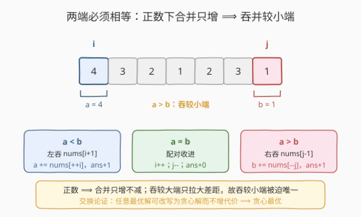
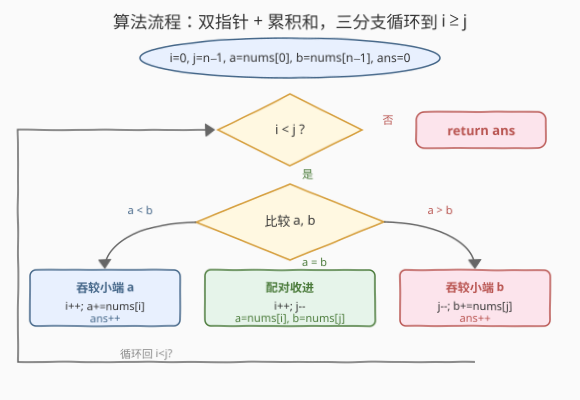

# LeetCode 合并操作将数组变成回文数组 题解

## 1. 题目概述

- **标题 / 题号**：合并操作将数组变成回文数组（#2422，medium）
- **链接**：https://leetcode.cn/problems/merge-operations-to-turn-array-into-palindrome/
- **难度**：中等
- **标签**：数组、贪心、双指针

**题意**：给你一个由**正整数**组成的数组 `nums`。你可以对数组执行任意次下面的操作：

- 选择两个**相邻**元素，把它们替换成它们的**和**。
  - 例如 `nums = [1,2,3,1]`，做一次操作后变为 `[1,5,1]`。

返回使数组变成**回文数组**（正读反读都一样）所需的最少操作次数。

**示例 1**：

```text
输入：nums = [4,3,2,1,2,3,1]
输出：2
解释：
- 对第 4、5 个元素操作，数组变为 [4,3,2,3,3,1]
- 对第 5、6 个元素操作，数组变为 [4,3,2,3,4]
[4,3,2,3,4] 是回文数组。
可以证明 2 是最少操作次数。
```

**示例 2**：

```text
输入：nums = [1,2,3,4]
输出：3
解释：在任意位置操作 3 次，最终得到 [10]，是回文数组。
```

**约束**：

- $1 \le n = \text{nums.length} \le 10^5$
- $1 \le \text{nums}[i] \le 10^6$

> 💡 关键观察：回文要求两端相等。所有元素都是正数，合并只会让一个端段变大、永不变小；因此要消除两端的不等，只能把较小的一端往里吞并相邻元素——这步是被「逼」出来的，没有更优选择，故贪心成立。

## 2. 解题思路

### 2.1 暴力思路：区间 DP 枚举合并方式

最直接的想法是把「怎么合并」当成自由决策，用区间 DP：定义 $f(i,j)$ 为把子数组 $\text{nums}[i..j]$ 变成回文的最少操作数。最终回文的最外层由左侧合并出的一段 $[i..k_1]$ 与右侧合并出的一段 $[k_2..j]$ 构成，二者之和必须相等，于是枚举切点转移：

$$
f(i,j) = \min_{\substack{\text{sum}(i,k_1)=\text{sum}(k_2,j)}} \Big((k_1-i)+(j-k_2)+f(k_1+1,\,k_2-1)\Big)
$$

但区间 DP 有 $\Theta(n^2)$ 个状态，每个状态还要枚举切点，$n=10^5$ 必然 TLE/MLE。

> ⚠️ 瓶颈在于把问题当成了「自由合并」，忽视了「正数 + 两端必须相等」这一强约束——它使得每一步该往哪边合并其实是**被唯一确定的**，根本没有分叉可枚举。一旦看清这点，$O(n)$ 贪心就浮出水面。

### 2.2 核心观察：贪心双指针 + 累积和



用两个指针 $i$（左）、$j$（右）分别从两端向中间走，并维护**左侧外段之和** $a$ 与**右侧外段之和** $b$：

- 若 $a = b$：当前两端段已经相等，这一对「回文外层」就位，无需操作。$i \leftarrow i+1$、$j \leftarrow j-1$，把 $a$、$b$ 重置为新指向的单个元素。
- 若 $a < b$：左段偏小，必须让它变大去追平 $b$。唯一办法是把 $\text{nums}[i+1]$ 并入左段：$i \leftarrow i+1$，$a \leftarrow a + \text{nums}[i]$，操作数 $+1$。
- 若 $a > b$：右段偏小，对称地把 $\text{nums}[j-1]$ 并入右段：$j \leftarrow j-1$，$b \leftarrow b + \text{nums}[j]$，操作数 $+1$。

直到 $i \ge j$ 停止，返回操作数。

**为什么这是对的（贪心正确性）？** 三点：

1. **两端终须相等**：回文要求最外层左段与右段之和相等，这是硬约束，绕不过去。
2. **合并只增不减**：元素全为正，把相邻元素并入当前段只会让段和变大，永远不可能让段和变小。
3. **较小端吞并被唯一确定**：若 $a<b$，要让 $a$ 追上 $b$，唯一途径是给 $a$ 加正数（往里吞并）；若反而去扩大 $b$（吞并 $\text{nums}[j-1]$），只会让 $b$ 更大、差距更悬殊，纯属倒退。故「吞并较小端」是**被迫的唯一选择**，不存在另一条更优路径——这正是**交换论证**的核心：任何最优解的第一步必与贪心一致，否则可改写成贪心解而不增代价。

> 💡 **本质**：这题看似「可任意合并」，实则每步**没有分叉**——不等就往小的一边吞，相等就收口。把「自由度」看清是零，$O(n)$ 就自然了。这和 [881. 救生艇](../0801-0900/881_救生艇.md) 的「最轻配最重、能塞就塞」同属「约束把贪心逼出来」的家族。

### 2.3 算法流程图



骨架：

1. **初始化**：$i=0$，$j=n-1$，$a=\text{nums}[0]$，$b=\text{nums}[n-1]$，$\text{ans}=0$；
2. **循环**（$i<j$）：
   - $a<b$：$i\mathrel{+}=1$，$a\mathrel{+}=\text{nums}[i]$，$\text{ans}\mathrel{+}=1$；
   - $a>b$：$j\mathrel{-}=1$，$b\mathrel{+}=\text{nums}[j]$，$\text{ans}\mathrel{+}=1$；
   - $a=b$：$i\mathrel{+}=1$，$j\mathrel{-}=1$，$a=\text{nums}[i]$，$b=\text{nums}[j]$；
3. **返回** $\text{ans}$。

> ⚠️ **溢出**：$a$、$b$ 最坏累加全部 $n$ 个元素，$10^5 \times 10^6 = 10^{11}$，超出 32 位整型范围。C++ 用 `long`；Python 整数无限宽无需担心。

### 2.4 示例演算

![示例演算：nums=[4,3,2,1,2,3,1] 的双指针累积和逐步推进](../images/moap_example_walkthrough.svg)

以示例 1 `nums = [4,3,2,1,2,3,1]`，$n=7$。

| 步 | $i,j$ | $a$（左段和） | $b$（右段和） | 比较 | 动作 | $\text{ans}$ |
|----|-------|----------------|----------------|------|------|---------------|
| 0 | 0,6 | 4 | 1 | $a>b$ | 右吞 $\text{nums}[5]=3$：$j=5$，$b=4$ | 1 |
| 1 | 0,5 | 4 | 4 | $a=b$ | 配对：$i=1$，$j=4$，$a=\text{nums}[1]=3$，$b=\text{nums}[4]=2$ | 1 |
| 2 | 1,4 | 3 | 2 | $a>b$ | 右吞 $\text{nums}[3]=1$：$j=3$，$b=3$ | 2 |
| 3 | 1,3 | 3 | 3 | $a=b$ | 配对：$i=2$，$j=2$，$a=\text{nums}[2]=2$，$b=2$ | 2 |
| 4 | 2,2 | — | — | $i\ge j$ | 停 | 2 |

对应到数组上的合并轨迹（按题面 1-based）：

- 步 0：合并第 5、6 个元素 $3+1=4$ → `[4,3,2,1,2,4]`；
- 步 2：合并第 4、5 个元素 $1+2=3$ → `[4,3,2,3,4]`，已是回文。

最终 $\text{ans}=2$ ✓。

> 💡 步 1、步 3 的「配对」不消耗操作，只是确认两端段和相等、各自封口，指针收进。每次配对相当于在最终回文里确定了一对镜像外层；中间剩单元素（$i=j$）天然回文，无需处理。

## 3. 参考代码

### C++

```cpp
class Solution {
public:
    int minimumOperations(vector<int>& nums) {
        int i = 0, j = (int)nums.size() - 1;
        long a = nums[i], b = nums[j];
        int ans = 0;
        while (i < j) {
            if (a < b) {
                a += nums[++i];
                ++ans;
            } else if (b < a) {
                b += nums[--j];
                ++ans;
            } else {
                a = nums[++i];
                b = nums[--j];
            }
        }
        return ans;
    }
};
```

> 💡 `a`、`b` 用 `long` 防溢出（$a$、$b$ 可达 $10^{11}$）；前缀 `++i` / `--j` 先移动指针再取元素。相等分支只挪指针、重置段和，不增操作数。

### Python

```python
class Solution:
    def minimumOperations(self, nums: List[int]) -> int:
        i, j = 0, len(nums) - 1
        a, b = nums[i], nums[j]
        ans = 0
        while i < j:
            if a < b:
                i += 1
                a += nums[i]
                ans += 1
            elif b < a:
                j -= 1
                b += nums[j]
                ans += 1
            else:
                i, j = i + 1, j - 1
                a, b = nums[i], nums[j]
        return ans
```

> 💡 Python 大整数自动扩展，无溢出之忧。三分支顺序 `a<b` / `b<a` / `=` 把相等情形单列，保证配对时零操作。

## 4. 复杂度分析

| 维度 | 复杂度 | 说明 |
|------|--------|------|
| **时间复杂度** | $O(n)$ | 每步 $i$ 或 $j$ 至少其一向中间移 1 格，总移动量 $\le 2n$，线性 |
| **空间复杂度** | $O(1)$ | 仅常数个指针与累积和变量，原地处理 |
| 对照：区间 DP | $O(n^2)$ | 状态数 $\Theta(n^2)$，$n=10^5$ 必爆 |

> 💡 把「看似可任意合并」看清成「每步无分叉」，是 $O(n^2)\to O(n)$ 的关键一跳——很多「最少操作使数组满足某性质」题都有这种「约束逼出唯一贪心」的隐藏结构。

## 5. 扩展：正确性证明与变体

**贪心正确性的另一种叙述（交换论证）**：把任意最优解里第一次「吞并较大端」的步骤拿出来——它让较大端变得更大，之后迟早要再吞并若干较小端元素才能追平，这若干次吞并本可提前到现在做，操作数不增反可能减。故存在一个与贪心逐步一致的最优解，贪心即最优。这就是把任意最优解「改写」成贪心解而不增代价的交换论证。

**全正性的不可少性**：若允许零或负数，合并可能让段和不增甚至减小，则「较小端吞并」未必追得上、「较大端吞并」也可能反而缩小差距，三分支判据失效。题目限定正整数正是为了让「合并只增不减」成立，从而贪心有解。

**变体**：

| 变体 | 思路调整 |
|------|----------|
| 目标改为「使数组递增」而非回文 | 单方向贪心，无需双端配对，结构更简单 |
| 求最终数组的**最大末项** | 同款合并操作但目标变为最大化——见 [2789. 合并后数组中的最大元素](https://leetcode.cn/problems/largest-element-in-an-array-after-merge-operations/)，贪心方向相反（让后项尽量吞前项造单调递增求最大末项） |
| 允许负数 | 贪心失效，退回区间 DP 或需更强分析 |
| 问「能否」而非「最少」 | 全并成单元素恒回文，平凡为真 |

> 💡 经验：凡是「相邻合并 + 让整体满足某性质 + 求最少次数」且元素同号，先想双指针贪心，用「合并只往一个方向改变段和」证明每步唯一。

## 6. 面试要点

1. **为什么不能用区间 DP？**

   > 区间 DP 状态 $\Theta(n^2)$、每个状态枚举切点，$n=10^5$ 时空间时间双爆。根因是误把问题当自由决策——其实「正数 + 两端必等」让每步该并哪边被唯一确定，无分叉可枚举，根本用不上 DP。

2. **贪心为什么正确？怎么证明？**

   > 三点：①两端终须相等（回文硬约束）；②合并只增不减（全正）；③较小端吞并被唯一确定（吞较大端只拉大差距）。故每步被迫，用交换论证可把任意最优解改写为贪心解而不增代价，贪心即最优。

3. **相等分支为什么不算操作？**

   > $a=b$ 表示当前两端段已经相等，这一对回文外层天然就位，无需合并——只需把指针各收进一步、重置段和为下一个待配对的单元素。操作只在「追平不等」时发生。

4. **累积和会溢出吗？怎么处理？**

   > 最坏把全部 $n$ 个元素并进一段，$a$ 或 $b$ 达 $n\times\max=10^{11}$，超 32 位。C++ 用 `long`/`int64`；Python 整数无上限。漏掉这一点在 C++ 会 WA。

5. **单元素或已回文的数组怎么走？**

   > 单元素 `[x]`：初始 $i=j$，不进循环，返回 0。已回文如 `[1,2,2,1]`：每步 $a=b$ 配对收进，全程 0 操作。算法自然处理，无需特判。

> 💡 **一句话总结**：双指针从两端向中间，维护左右外段和 $a$、$b$；不等就吞较小端的相邻元素并 $+1$ 操作，相等就配对收进。$O(n)$ / $O(1)$，全正性保证「吞并唯一」使贪心成立。

## 同类练习题

| # | 题目 | 与本题的关联 |
|---|------|-------------|
| 2789 | [合并后数组中的最大元素](https://leetcode.cn/problems/largest-element-in-an-array-after-merge-operations/) | **直接同源姊妹题**，同一「相邻元素替换为和」的合并操作，但目标变为最大化末项——贪心方向相反（让后项尽量吞前项造单调递增），先做此题可一眼看穿合并类贪心 |
| 881 | [救生艇](https://leetcode.cn/problems/boats-to-save-people/)（[题解](../0801-0900/881_救生艇.md)） | 同属「约束把贪心逼出来」家族——最轻配最重能塞就塞，排序 + 双指针，对照「配对收进」的另一种形态 |
| 11 | [盛最多水的容器](https://leetcode.cn/problems/container-with-most-water/)（[题解](../0001-0100/11_盛最多水的容器.md)） | 经典双指针对撞母题，对照「两端向中间收」的通用骨架 |
| 2216 | [美化数组的最少删除数](https://leetcode.cn/problems/minimum-deletions-to-make-array-beautiful/)（[题解](../2201-2300/2216_美化数组的最少删除数.md)） | 同主题「最少操作使数组满足某性质」，但操作是删除而非合并，对照不同操作下的贪心判据 |
