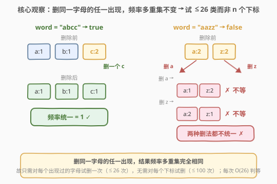
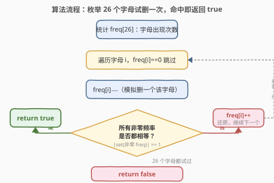
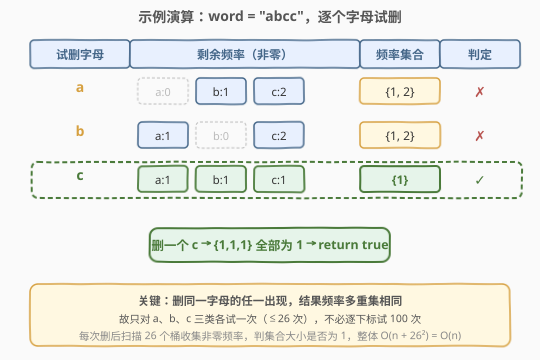

# 删除字符使频率相同

- **题目名称**：删除字符使频率相同
- **链接**：[2423. 删除字符使频率相同](https://leetcode.cn/problems/remove-letter-to-equalize-frequency/)
- **难度**：简单
- **标签**：哈希表、字符串、计数

## 1. 题目概述

给你一个下标从 **0** 开始、只含小写英文字母的字符串 `word`。你需要选择**恰好一个**下标并**删除**该位置的字符，使得 `word` 中**剩余每个字母的出现频率都相同**。能办到返回 `true`，否则返回 `false`。

> ⚠️ 必须恰好删一个字母，不能一个都不删。字母 `x` 的**频率**是它在串中出现的次数。

**示例 1**：

```text
输入：word = "abcc"
输出：true
解释：选择下标 3 删除该字母，word 变成 "abc"，每个字母出现频率都为 1。
```

**示例 2**：

```text
输入：word = "aazz"
输出：false
解释：必须删一个字母：删 "a" → a 频率 1、z 频率 2；删 "z" → a 频率 2、z 频率 1。两种删法频率都不统一。
```

**约束条件**：

- $2 \le \text{word.length} \le 100$
- `word` 只包含小写英文字母。

> 💡 数据规模极小（长度 $\le 100$，字母表只有 26 个），暴力完全可过。但暴力也有「枚举下标」与「枚举字母」之分——后者利用「删同一字母的任一出现等价」把 $O(n^2)$ 压到 $O(n)$。下文从最朴素的枚举下标出发，逐步收紧到只枚举字母。

---

## 2. 解题思路

### 2.1 暴力思路：枚举每个下标删一个

最直白的实现：**枚举要删的下标** $i \in [0, n)$，把 `word` 去掉第 $i$ 位后重新统计频率，再检查剩余所有非零频率是否相等。命中即返回 `true`；全部枚举完都不行则 `false`。

- 每次删后重新计数 $O(n)$，再判等 $O(26)$，共 $n$ 次 $\Rightarrow$ 总 $O(n^2)$。
- $n \le 100$ 时约 $10^4$ 次操作，轻松 AC。但**做了大量重复计算**：删 `word` 中两个相同的 `c`，结果完全一样，却被当成两个独立下标各算一遍。

> ⚠️ 枚举下标法的冗余根源：**删除同一个字母的不同出现，得到的频率多重集完全相同**。例如 `"abcc"` 删下标 2 的 `c` 与删下标 3 的 `c`，剩余都是 `"abc"`，频率都是 $\{a{:}1, b{:}1, c{:}1\}$。下标维度是「假自由度」。

### 2.2 核心观察：枚举字母而非下标，$O(n)$



**关键洞察**：既然删同一字母的任意一个出现结果相同，那么**候选集不是 $n$ 个下标，而是 $\le 26$ 个出现过的字母**。对每个出现过的字母 $c$：

1. 把 $\text{freq}[c]$ 减 $1$（模拟删一个该字母）；
2. 收集所有非零频率，判其**是否都相等**（即非零频率集合大小是否为 $1$）；
3. 命中返回 `true`，否则 $\text{freq}[c]$ 加 $1$ 还原，试下一个字母。

**为什么「非零频率集合大小为 1」即频率统一**？删一个字母后，该字母频率可能变为 $0$（该字母从串中消失，不再参与「剩余字母」），也可能 $>0$（仍在）。无论哪种，只要**留下的**字母频率两两相等，集合里就只有一个值 $\Rightarrow$ 大小为 $1$。若删后所有字母都消失（仅可能在 $n=1$ 时，但约束 $n\ge2$ 不会发生），集合为空，不会误判。

> 💡 这一步把复杂度从 $O(n^2)$ 压到 $O(n + 26 \times 26) = O(n)$：一次 $O(n)$ 计数 + 26 轮、每轮 $O(26)$ 判等。常数级，已是理论最优（至少要读完串）。

### 2.3 算法流程图



流程要点：

1. **计数**：一次扫描 `word`，得到长度为 26 的 `freq` 数组。
2. **试删**：遍历 26 个桶，跳过频率为 $0$ 的字母；对频率 $>0$ 的字母，模拟「删一个」：`freq[i] -= 1`。
3. **判等**：扫描 26 个桶收集非零频率，看是否只有一个唯一值（`set` 大小为 $1$）。
4. **决策**：相等即返回 `true`；否则 `freq[i] += 1` 还原，进入下一字母。
5. **兜底**：26 个字母都试过仍未命中，返回 `false`。

> ⚠️ 第 2 步「还原」不可省——`freq` 是共享数组，不还原会污染后续试删的结果。也可每轮复制一份 `freq`（$O(26)$ 拷贝），但原地增减更省。

### 2.4 示例演算



以 `word = "abcc"` 为例，初始 $\text{freq} = \{a{:}1, b{:}1, c{:}2\}$：

- **试删 `a`**：$a{:}0$(消失)、$b{:}1$、$c{:}2$ $\to$ 非零频率 $\{1, 2\}$，两值不等 $\to$ ✗，还原 $a{:}1$。
- **试删 `b`**：$a{:}1$、$b{:}0$(消失)、$c{:}2$ $\to$ 非零频率 $\{1, 2\}$ $\to$ ✗，还原 $b{:}1$。
- **试删 `c`**：$a{:}1$、$b{:}1$、$c{:}1$ $\to$ 非零频率 $\{1\}$，唯一值 $\to$ ✓ 命中，返回 `true`。

只试了 3 类字母（而非 4 个下标），即在第 3 类命中。对照 `word = "aazz"`：$\text{freq} = \{a{:}2, z{:}2\}$，删 `a` 得 $\{1, 2\}$、删 `z` 得 $\{2, 1\}$，两类都不行 $\to$ `false`。

---

## 3. 参考代码

### C++

```cpp
class Solution {
public:
    bool equalFrequency(string word) {
        int freq[26] = {0};
        for (char c : word) freq[c - 'a']++;
        for (int i = 0; i < 26; i++) {
            if (freq[i] == 0) continue;
            freq[i]--;                              // 模拟删一个字母 i
            int target = -1;
            bool ok = true;
            for (int j = 0; j < 26; j++) {
                if (freq[j] == 0) continue;         // 已消失的字母不参与
                if (target == -1) target = freq[j];
                else if (freq[j] != target) { ok = false; break; }
            }
            if (ok) return true;                    // 非零频率全等
            freq[i]++;                              // 还原，试下一个字母
        }
        return false;
    }
};
```

> 💡 内层用 `target` 记第一个非零频率，后续非零值与之比较即可判「全等」，比每次建 `set` 更省常数。`freq[i]--/--` 原地模拟，避免每轮拷贝 26 桶。

### Python

```python
from collections import Counter

class Solution:
    def equalFrequency(self, word: str) -> bool:
        freq = Counter(word)
        for c in list(freq):                        # 只遍历出现过的字母（≤26）
            freq[c] -= 1                            # 模拟删一个 c
            if len({v for v in freq.values() if v > 0}) == 1:
                return True
            freq[c] += 1                            # 还原
        return False
```

> 💡 `list(freq)` 防止改值时遍历出问题；`Counter` 的键不会因值变 0 而消失（除非显式 `del`），故还原前键集稳定。集合推导式 `{v for v in ... if v > 0}` 一行完成「收集非零频率 + 去重 + 判大小」。

---

## 4. 复杂度分析

| 维度 | 复杂度 | 说明 |
|------|--------|------|
| **时间复杂度** | $O(n)$ | 一次 $O(n)$ 计数 + 26 轮、每轮 $O(26)$ 判等 $\Rightarrow O(n + 26^2) = O(n)$ |
| **空间复杂度** | $O(1)$ | 固定 26 桶的 `freq` 数组 / `Counter`，与 $n$ 无关 |
| 对照：枚举下标暴力 | $O(n^2)$ | 每个下标删后重新计数 $O(n)$，共 $n$ 次；$n=100$ 仍可过但含冗余 |
| 对照：下标暴力+增量计数 | $O(n)$ | 删下标 $i$ 时维护 `freq` 增减 $O(1)$，但逻辑更绕；枚举字母更直观 |

> 💡 本题的复杂度天花板是 $O(n)$（至少要读完串才知道各字母频率）。枚举字母法已触达天花板，无须进一步优化；第 5 节的「频次的频次」法只是把判等步骤常数化，渐近复杂度不变。

---

## 5. 扩展：频次的频次——一次扫描判等

枚举字母法每轮要扫 26 桶判等。若想避免 26 轮循环，可对频率多重集做**分类讨论**，直接 $O(1)$ 判定（计数仍 $O(n)$）。

设 $\text{freq}$ 为各字母频率，$\text{meta}$ 为「频率的频率」：$\text{meta}[f]$ 表示有多少个字母恰出现 $f$ 次。记 $k$ 为出现过的不同字母数。能删成统一频率，当且仅当命中以下三种情形之一：

| 情形 | $\text{meta}$ 形态 | 删谁 | 结果 | 直觉 |
|------|---------------------|------|------|------|
| **A. 一孤一余** | $\{1{:}1,\ f{:}k{-}1\}$ | 删那个频率为 $1$ 的字母 | 它变 $0$ 消失，余 $k{-}1$ 个全为 $f$ | 孤儿出局，剩众整齐 |
| **B. 一超一余** | $\{f{:}k{-}1,\ f{+}1{:}1\}$ | 删那个频率为 $f{+}1$ 的字母 | 它降到 $f$，全员 $f$ | 高个削平 |
| **C. 全孤儿**（A 的 $f=1$ 特例） | $\{1{:}k\}$ | 删任意一个 | 它消失，余 $k{-}1$ 个全为 $1$ | 全是孤儿，删谁都可 |

> ⚠️ 反例验证 `aazz`：$\text{freq}=\{a{:}2,z{:}2\}$，$\text{meta}=\{2{:}2\}$（单一频率值，$f=2\ge2$ 且 $k=2$），不属上述任一情形 $\to$ `false` ✓。而 `aabbcc`：$\text{meta}=\{2{:}3\}$ 同理 $\to$ `false` ✓。

还需处理边界：$k=1$（整串同一字母，如 `"aaa"`）时 $\text{meta}=\{f{:}1\}$，删一个剩同字母 $f-1$ 个，天然统一 $\to$ `true`。这恰好被情形 **B** 的退化（$k{-}1=0$，$\text{meta}=\{f{+}1{:}1\}=\{f{:}1\}$）覆盖，故无需特判。

```python
from collections import Counter

class Solution:
    def equalFrequency(self, word: str) -> bool:
        meta = Counter(Counter(word).values())      # 频率的频率
        vals = list(meta)
        if len(vals) == 1:
            f = vals[0]
            return f == 1 or meta[f] == 1           # C：全孤儿；或 k=1 单字母
        if len(vals) == 2:
            a, b = min(vals), max(vals)
            if a == 1 and meta[1] == 1:              # A：一孤一余
                return True
            if b == a + 1 and meta[b] == 1:          # B：一超一余（含 k=1 退化）
                return True
        return False
```

> 💡 该法把「试删 + 判等」压成「看 $\text{meta}$ 形态」，常数更小，但**正确性靠分类讨论覆盖所有情形**，易漏边界（如 $k=1$）。面试中枚举字母法更不易写错，建议作主解；此法作进阶展示。

---

## 6. 面试要点

1. **为什么枚举字母而非枚举下标？**

   > 删除同一字母的不同出现，剩余串的字母构成完全相同（只是位置不同），频率多重集必然相同。故「删哪个下标」是假自由度，真正有效的选择是「删哪一类字母」，至多 26 类。枚举字母把 $O(n^2)$ 压到 $O(n)$，且代码更清晰。

2. **删一个字母后，频率为 0 的字母如何处理？**

   > 不参与判等。题目要求「剩余字母」频率统一，频率降为 0 意味着该字母被删光、已不在串中。故判等时只看非零频率。代码里用 `if (freq[j] == 0) continue;` 或 `if v > 0` 跳过，正是此意。

3. **`target == -1` 与 `set` 两种判等写法等价吗？**

   > 等价。`target` 记首个非零频率，后续非零值都与之比；`set` 把所有非零频率去重看大小。前者 $O(26)$ 无额外空间、常数更小；后者用哈希集合、写法更声明式。本题规模下无差别，但 `target` 法在 C++ 里更顺手。

4. **「必须恰好删一个」的约束如何体现？**

   > 每轮 `freq[i] -= 1` 恰好减一次，且每个候选字母至多试一次。不会出现「不删」或「删多个」。注意「不删」本身不可能满足约束，故即使原串频率本就统一（如 `"aabb"`），也必须删一个再判——删后 $\{1,2\}$ 不等 $\to$ `false`，与题意一致。

5. **能否不枚举、直接分类讨论？正确性如何保证？**

   > 可用「频次的频次」$\text{meta}$ 分类（见第 5 节），命中三种情形即 `true`。但需证明分类**完备**（覆盖所有可成情形）且**互斥**（不误判）。关键反例：$\text{meta}$ 只有一个频率值且 $\ge2$ 且 $k\ge2$（如 `"aabb"`）必为 `false`——删任一个都产生一个 $f{-}1$ 与其余 $f$ 不等。枚举法天然完备（穷举所有候选），故更稳妥。

> 💡 **一句话总结**：删同一字母的任一出现等价 $\to$ 只枚举 $\le26$ 个字母试删，每次判非零频率是否全等（集合大小为 1），$O(n)/O(1)$ 搞定。

---

## 7. 同类练习题

- [242. 有效的字母异位词](https://leetcode.cn/problems/valid-anagram/)（[题解](../0201-0300/242_有效的字母异位词.md)）：字母频率计数 + 比较两串频率表，同为「26 桶计数」基础题，对照「判两组频率相等」与「判一组频率可调成相等」
- [451. 根据字符出现频率排序](https://leetcode.cn/problems/sort-characters-by-frequency/)（[题解](../0401-0500/451_根据字符出现频率排序.md)）：按频率降序重排串，频率计数 + 桶排序，承接本题的频率统计基础
- [1647. 字符频次唯一的最小删除次数](https://leetcode.cn/problems/minimum-deletions-to-make-character-frequencies-unique/)（[题解](../1601-1700/1647_字符频次唯一的最小删除次数.md)）：删字符使频率**两两不同**，与本题「频率**两两相同**」互为镜像，贪心 vs 枚举的对照
- [387. 字符串中的第一个唯一字符](https://leetcode.cn/problems/first-unique-character-in-a-string/)（[题解](../0301-0400/387_字符串中的第一个唯一字符.md)）：频率计数找首个频率为 1 的字母，频率为 1 的判定在本题情形 A/C 中同样关键
- [1897. 重新分配字符使所有字符串都相等](https://leetcode.cn/problems/redistribute-characters-to-make-all-strings-equal/)（[题解](../1801-1900/1897_重新分配字符使所有字符串都相等.md)）：跨串搬运字符使各串同构，频率能否整除的判定，对照「频率统一」的不同变体
