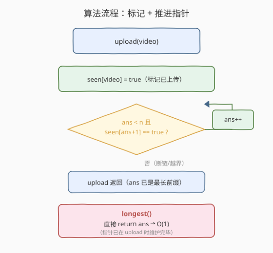
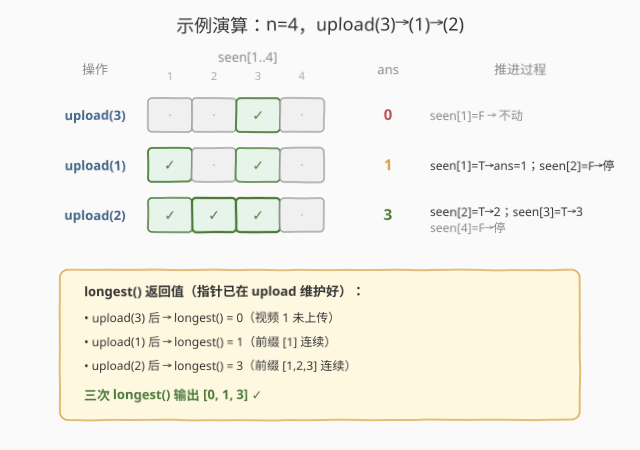

# 最长上传前缀

- **题目名称**：最长上传前缀
- **链接**：[2424. 最长上传前缀](https://leetcode.cn/problems/longest-uploaded-prefix/)
- **难度**：中等
- **标签**：设计、数组、贪心（指针）/ 并查集

## 1. 题目概述

有 `n` 个视频，编号为 `1` 到 `n` 之间的**不同**整数，按某个顺序依次上传。实现 `LUPrefix` 类，在上传过程中维护**最长上传前缀**：

- 若闭区间 `[1, i]` 内所有视频都已被上传，则称 `i` 是一个上传前缀；最长上传前缀是所有满足条件的 `i` 中的**最大值**。
- `LUPrefix(int n)`：初始化 `n` 个视频的流对象。
- `void upload(int video)`：上传编号为 `video` 的视频。
- `int longest()`：返回当前最长上传前缀的长度。

> 💡 「上传前缀」的本质是「从 `1` 起的连续已上传段能延伸到哪」——一旦中间某个编号没上传，后面再上传多少都不影响当前前缀长度。这把问题归结为维护「从 `1` 起向右的连续命中边界」。

**示例 1**：

```text
输入：["LUPrefix","upload","longest","upload","longest","upload","longest"]
      [[4],[3],[],[1],[],[2],[]]
输出：[null,null,0,null,1,null,3]
解释：
upload(3); longest() -> 0   // 视频 1 未上传
upload(1); longest() -> 1   // 前缀 [1] 连续
upload(2); longest() -> 3   // 前缀 [1,2,3] 连续（2 把 1、3 之间的空缺补上）
```

**约束条件**：

- $1 \le n \le 10^5$
- $1 \le \text{video} \le 10^5$，且所有 `video` 值互不相同
- `upload` 与 `longest` **总调用**次数不超过 $2 \times 10^5$
- 至少调用一次 `longest`

> ⚠️ 注意：调用是**交错**的——`longest()` 可能在任意时刻被问，因此不能等所有 `upload` 完成再一次性统计，必须**增量维护**答案。

---

## 2. 解题思路

### 2.1 暴力思路：布尔数组 + 每次 longest 线性扫描

最直接的做法：维护布尔数组 `seen[1..n]`，`upload(video)` 时 `seen[video]=true`；`longest()` 时从 `1` 开始往后找连续的 `true`：

```text
def longest():
    i = 1
    while i <= n and seen[i]:
        i += 1
    return i - 1
```

每次 `longest()` 最坏 $O(n)$，若 `longest` 被高频调用（如 $10^5$ 次），总计可达 $O(n \cdot q) \sim 10^{10}$，必然 TLE。

> ⚠️ 瓶颈在于**重复扫描已确认连续的前缀**：`longest()` 每次都从 `1` 重扫一遍已知连续的段，这些段只会增长、不会回退。这正是「单调指针」的典型信号——用一个只增不减的游标把重复劳动摊还掉。

### 2.2 核心观察：单调指针 ans + 布尔标记，摊还 O(1)

![核心观察：指针 ans 只向右推进，while seen[ans+1] 推进](../images/luprefix_concept.svg)

维护两个状态：

- `seen[1..n]`：布尔数组，`seen[v]` 表示视频 `v` 是否已上传。
- `ans`：**当前最长上传前缀**的长度，初值 `0`，单调**不减**。

关键不变式：调用任何操作后，`ans` 始终等于「`1..ans` 全部已上传、且 `ans+1` 未上传（或 `ans==n`）」。维护方式极简：

$$
\texttt{upload}(v):\quad \texttt{seen}[v] \leftarrow \texttt{true};\quad \textbf{while}\;\texttt{ans} < n\;\textbf{and}\;\texttt{seen}[\texttt{ans}+1]\;\textbf{do}\;\texttt{ans} \leftarrow \texttt{ans}+1
$$

$$
\texttt{longest}():\quad \textbf{return}\;\texttt{ans}
$$

> 💡 **为什么对？** `ans` 只增不减：每次 `upload(v)` 后，`v` 可能恰好是 `ans+1`，于是 `while` 把新打通的连续段一次性吃掉；若 `v` 在 `ans+1` 之后，`seen[ans+1]` 仍为 `false`，`while` 立即退出，只做一次判定。因为 `ans` 从 `0` 单调爬到至多 `n`，**整个生命周期里 `ans++` 最多执行 `n` 次**，均摊到所有 `upload` 上每次 $O(1)$；`longest()` 更是 $O(1)$ 直接返回。

### 2.3 算法流程图



骨架两步：

1. **`upload(video)`**：先 `seen[video] = true`，再 `while (ans < n && seen[ans+1]) ans++`；
2. **`longest()`**：`return ans`。

> ⚠️ `while` 放在 `upload` 里（而非 `longest` 里）更自然：被上传的正是 `video`，补完连续段后立即更新边界，`longest()` 便无需任何后处理，恒为 $O(1)$。若改放 `longest()` 里也可，但 `longest()` 退化为摊还 $O(1)$ 而非严格 $O(1)$，且语义不如「上传即推进」直观。

### 2.4 示例演算



以示例 1，`n = 4`，依次 `upload(3)`、`upload(1)`、`upload(2)`：

| 操作 | `seen[1]` | `seen[2]` | `seen[3]` | `seen[4]` | `ans` | 推进过程 |
|------|-----------|-----------|-----------|-----------|-------|----------|
| 初始 | · | · | · | · | 0 | — |
| `upload(3)` | · | · | ✓ | · | 0 | `seen[1]=F` → 不动 |
| `longest()` | | | | | **0** | 返回 0 |
| `upload(1)` | ✓ | · | ✓ | · | 1 | `seen[1]=T→1`；`seen[2]=F` 停 |
| `longest()` | | | | | **1** | 返回 1 |
| `upload(2)` | ✓ | ✓ | ✓ | · | 3 | `seen[2]=T→2`；`seen[3]=T→3`；`seen[4]=F` 停 |
| `longest()` | | | | | **3** | 返回 3 |

`upload(2)` 是关键一步：它补上了 `1` 与 `3` 之间的空缺 `2`，`while` 顺势把 `ans` 从 `1` 连推到 `3`（吃掉 `[2,3]` 两格），一举打通前缀 `[1,2,3]`。

> 💡 三次 `longest()` 输出 `[0, 1, 3]` ✓。注意 `upload(2)` 之前 `seen[3]` 早已为 `true`，但因 `seen[2]` 缺口，`ans` 一直卡在 `1`——缺口补上后，**积攒的连续段被一次性兑现**，这正是摊还分析里「`ans++` 总次数 ≤ n」的直观体现。

---

## 3. 参考代码

### C++

```cpp
class LUPrefix {
    vector<bool> seen;
    int ans = 0, n;
public:
    LUPrefix(int n) : seen(n + 1, false), n(n) {}

    void upload(int video) {
        seen[video] = true;
        while (ans < n && seen[ans + 1]) ++ans;
    }

    int longest() {
        return ans;
    }
};
```

> 💡 `seen` 开 `n+1` 长用 1-indexed 对齐题面编号；`ans` 用成员默认初始化 `0`，构造时无需再赋。`while` 条件先判 `ans < n` 再取 `seen[ans+1]`，短路求值保证 `ans+1` 不越界（`ans==n` 时已到尽头，不再访问）。

### Python

```python
class LUPrefix:

    def __init__(self, n: int):
        self.seen = [False] * (n + 1)
        self.ans = 0
        self.n = n

    def upload(self, video: int) -> None:
        self.seen[video] = True
        while self.ans < self.n and self.seen[self.ans + 1]:
            self.ans += 1

    def longest(self) -> int:
        return self.ans
```

> 💡 Python 版用 `list[bool]` 即可；若追求极致内存可用 `bytearray(n+1)`，但 $n \le 10^5$ 时 `list[bool]` 已足够。`longest()` 是纯读，无需任何计算。

---

## 4. 复杂度分析

| 维度 | 复杂度 | 说明 |
|------|--------|------|
| **时间复杂度** | 摊还 $O(1)$ 每次 | `upload` 中 `seen[video]=true` 为 $O(1)$；`while` 的 `ans++` 全程至多 $n$ 次，摊到所有调用上每次 $O(1)$；`longest()` 严格 $O(1)$ |
| **空间复杂度** | $O(n)$ | 长度 $n+1$ 的布尔数组 `seen`；`ans` 为 $O(1)$ 额外变量 |
| 对照：每次线性扫描 | $O(n \cdot q)$ | `longest()` 每次从 1 重扫，$q$ 次调用可达 $10^{10}$，TLE |

> 💡 摊还分析的关键：把 `ans` 视作「单调递增的游标」，它的总位移不超过 $n$，因此无论 `upload` 调用多少次，`while` 的总工作量被 $n$ 封顶。这是「单调指针 / 势能法」的典型应用——与归并排序的「双指针合并」、[26. 删除有序数组中的重复项](../0001-0100/26_删除有序数组中的重复项.md) 的「慢指针只前进」同源。

---

## 5. 扩展：并查集解法与变体

**并查集（后继指针）解法**：把「从 `1` 起的连续已上传段」看作一个不断向右合并的连通块。维护 `nxt[i]` 表示「`i` 及其右侧最近的**未上传**位置」，初值 `nxt[i] = i`。`upload(v)` 时把 `v` 并入 `v+1` 的代表元（`find(v) = find(v+1)`），则 `longest() = find(1) - 1`：

```cpp
class LUPrefix {
    vector<int> nxt;
public:
    LUPrefix(int n) : nxt(n + 2) { iota(nxt.begin(), nxt.end(), 0); }
    int find(int x) { return nxt[x] == x ? x : nxt[x] = find(nxt[x]); }
    void upload(int v) { nxt[v] = find(v + 1); }
    int longest() { return find(1) - 1; }
};
```

`find(v)` 返回「`v` 起向右第一个空位」，故 `find(1)-1` 即最长前缀。单次 $O(\alpha(n))$，与指针版同样是「已上传元素只贡献一次合并」的摊还思想，但常数略大、代码稍绕——**指针版更简单直观，是本题首选**。

**变体对照**：

| 变体 | 思路调整 |
|------|----------|
| 视频编号非连续（如任意大值域） | 指针版失效（值域 $10^9$ 开不了数组），改用 `TreeSet` 维护「空缺集合」，`longest = (最小空缺) - 1`，$O(\log n)$ 每次 |
| `longest` 改为「最长上传区间」(不必从 1 起) | 并查集合并相邻段同时维护段长，查最大段；或线段树维护区间 |
| 允许重复上传同一 video | 加 `if (seen[video]) return;` 幂等保护即可，指针逻辑不变 |
| 在线撤销上传 | 指针/并查集都难做（只增结构），需改 `TreeSet` 维护空缺 |

> 💡 经验：凡是「从某起点向右连续命中、只增不减」的增量维护题，先想单调指针 $O(1)$ 摊还；值域过大或需撤销时再退到 `TreeSet` / 并查集。

---

## 6. 面试要点

1. **为什么 `while` 放在 `upload` 而不是 `longest`？**

   > `upload(v)` 正是改变 `seen` 的唯一入口，补完连续段后立即推进 `ans`，保证任意时刻 `ans` 都正确，`longest()` 退化为纯读 $O(1)$。若放 `longest()` 里则 `longest()` 变成摊还 $O(1)$，且语义上「查询才维护」不如「写入即维护」自洽。

2. **如何证明摊还 $O(1)$？**

   > 势能法：取势函数 $\Phi = \text{ans}$（当前指针值）。`upload` 中 `seen[v]=true` 是 $O(1)$；`while` 每执行一次 `ans++` 势能 $+1$，但 $\text{ans} \in [0, n]$ 有上界，故整个生命周期 `ans++` 至多 $n$ 次。把 $n$ 次推进均摊到 $\Theta(n)$ 次 `upload` 上，每次摊还 $O(1)$。`longest` 不改 `ans`，严格 $O(1)$。

3. **`ans+1` 会越界吗？边界如何兜底？**

   > `while` 条件短路先判 `ans < n`：当 `ans == n` 时已到上限，不再访问 `seen[n+1]`。即使开 `n+1` 长数组（1-indexed），`seen[n+1]` 在 `ans==n` 时也永不被读，故无越界风险。

4. **视频乱序上传为何不影响正确性？**

   > `ans` 刻画的是「从 1 起的连续命中边界」，与上传顺序无关。无论 `video` 落在 `ans+1`（立即推进）还是远处（暂存 `seen`，等中间空缺补齐时由 `while` 一次性兑现），不变式始终成立。`upload(2)` 补缺后 `ans` 从 1 跳到 3 正是「积攒段被兑现」的体现。

5. **本题与 2336 无限集最小数字的关系？**

   > 两者都把「连续段」压缩成一个单调指针：2336 用 `cur` 表示「未弹出的连续尾起点」，本题用 `ans` 表示「已上传的连续前终点」，方向相反但同构——一个向右吃掉、一个向右弹出，都是「单调游标 + 摊还」。2336 额外用回收堆处理「加回」的逆操作，本题因只有增量（无撤销）所以连堆都不需要，更简单。

> 💡 **一句话总结**：维护 `seen[]` 标记与单调指针 `ans`，`upload` 时标记后 `while seen[ans+1]` 推进 `ans`，`longest` 直接返回 `ans`——摊还 $O(1)$/$O(n)$ 空间，单调指针把重复扫描压成均摊常数。

---

## 7. 同类练习题

- [2336. 无限集中的最小数字](https://leetcode.cn/problems/smallest-number-in-infinite-set/)（[题解](../2301-2400/2336_无限集中的最小数字.md)）：**同单调指针家族**，用 `cur` 压缩无限集的连续尾 + 回收堆处理 `addBack`，与本题 `ans` 指针同构（一弹一吃、方向相反），对照「单向指针」与「指针+回收堆」的取舍
- [128. 最长连续序列](https://leetcode.cn/problems/longest-consecutive-sequence/)（[题解](../0101-0200/128_最长连续序列.md)）：同考「连续段长度」，但输入无序、需哈希集合枚举起点；对照「离线求最长连续」与「在线增量维护前缀」
- [684. 冗余连接](https://leetcode.cn/problems/redundant-connection/)（[题解](../0601-0700/684_冗余连接.md)）：并查集判环模板，是第 5 节并查集解法的母题，理解 `find` 路径压缩即可看懂后继指针版
- [26. 删除有序数组中的重复项](https://leetcode.cn/problems/remove-duplicates-from-sorted-array/)（[题解](../0001-0100/26_删除有序数组中的重复项.md)）：慢指针只前进不回退，与本题 `ans` 单调递增同源，是最朴素的「摊还 O(1) 指针」范式
