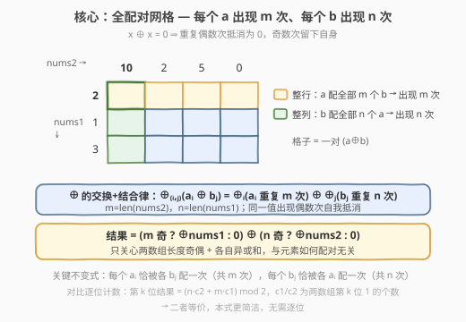
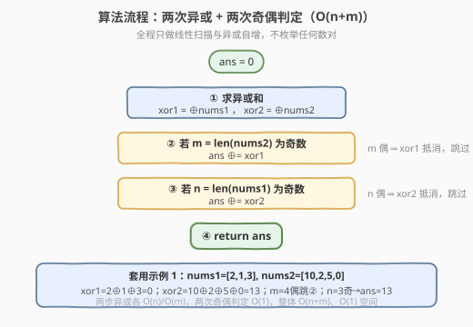

# 所有数对的异或和

- **题目名称**：所有数对的异或和
- **链接**：[2425. 所有数对的异或和](https://leetcode.cn/problems/bitwise-xor-of-all-pairings/)
- **难度**：中等
- **标签**：位运算、数组、脑筋急转弯

## 1. 题目概述

给你两个下标从 0 开始的数组 `nums1` 和 `nums2`，都只含非负整数。将 `nums1` 中每个整数与 `nums2` 中每个整数**恰好配一次**，得到所有数对的异或和，构成数组 `nums3`（共 $n \cdot m$ 个元素，$n=\text{len}(\text{nums1})$，$m=\text{len}(\text{nums2})$）。返回 `nums3` 中所有整数的**异或和**。

**示例 1**：

```text
输入：nums1 = [2,1,3], nums2 = [10,2,5,0]
输出：13
解释：一个可能的 nums3 = [8,0,7,2,11,3,4,1,9,1,6,3]，其异或和为 13。
```

**示例 2**：

```text
输入：nums1 = [1,2], nums2 = [3,4]
输出：0
解释：数对异或分别为 1^3, 1^4, 2^3, 2^4 = 2,5,1,6；2^5^1^6 = 0。
```

**约束条件**：

- $1 \le \text{nums1.length}, \text{nums2.length} \le 10^5$
- $0 \le \text{nums1}[i], \text{nums2}[j] \le 10^9$

> ⚠️ 朴素地枚举 $n \cdot m$ 个数对、逐个异或必然超时（$n,m \le 10^5$ 时数对数高达 $10^{10}$）。突破口在于认清「异或」的两条代数性质——**交换结合律**与**自反性** $a \oplus a = 0$：把「全部数对的异或」按元素重新分组，每个元素的出现次数一目了然，偶数次直接抵消。

---

## 2. 解题思路

### 2.1 暴力思路：枚举全部数对

双重循环枚举每一对 $(a_i, b_j)$，把 $a_i \oplus b_j$ 累加进答案：

```text
ans = 0
for a in nums1:
    for b in nums2:
        ans ^= a ^ b
```

时间 $O(nm)$，$n,m \le 10^5$ 时 $nm \approx 10^{10}$，必然超时。瓶颈在于把「按位异或」当成黑盒逐对计算，没有利用它的结构性质。

### 2.2 核心观察：偶次抵消 + 异或交换结合律



把目标式展开并按元素重新分组：

$$
\text{ans} \;=\; \bigoplus_{i,j}(a_i \oplus b_j) \;=\; \underbrace{\bigoplus_{i,j} a_i}_{\text{每个 }a\text{ 出现 }m\text{ 次}} \;\oplus\; \underbrace{\bigoplus_{i,j} b_j}_{\text{每个 }b\text{ 出现 }n\text{ 次}}
$$

这里第二步用了异或的**交换律 + 结合律**：把每一对 $a_i \oplus b_j$ 拆成两半，所有 $a_i$ 凑在一起、所有 $b_j$ 凑在一起，异或的顺序无关紧要。重新分组后：

- 每个 $a_i$（来自 `nums1`）与 `nums2` 的 $m$ 个元素各配一次，故总共出现 $m = \text{len}(\text{nums2})$ 次；
- 每个 $b_j$（来自 `nums2`）与 `nums1` 的 $n$ 个元素各配一次，故总共出现 $n = \text{len}(\text{nums1})$ 次。

> ⚠️ **易错点**：$a_i$ 来自 `nums1`，但它出现的次数是**另一个数组** `nums2` 的长度 $m$；$b_j$ 同理出现 $n$ 次。别把 $n/m$ 与所在数组搞反。

再代入异或的**自反性** $a \oplus a = 0$：同一值异或偶数次相互抵消为 $0$，奇数次留下自身。因此

$$
\bigoplus_{i,j} a_i = \begin{cases} \bigoplus_i a_i = \text{xor1}, & m \text{ 为奇} \\ 0, & m \text{ 为偶} \end{cases}, \qquad \bigoplus_{i,j} b_j = \begin{cases} \bigoplus_j b_j = \text{xor2}, & n \text{ 为奇} \\ 0, & n \text{ 为偶} \end{cases}
$$

其中 $\text{xor1} = \bigoplus \text{nums1}$，$\text{xor2} = \bigoplus \text{nums2}$。最终：

$$
\boxed{\,\text{ans} = (m \text{ 奇} ?\; \text{xor1} : 0) \;\oplus\; (n \text{ 奇} ?\; \text{xor2} : 0)\,}
$$

> 💡 **一句话总结**：全部数对的异或和，只取决于两数组**长度的奇偶**与**各自的异或和**，与元素如何配对无关。$m$ 奇则 `xor1` 入结果，$n$ 奇则 `xor2` 入结果，否则那一项为 $0$。

### 2.3 算法流程图



算法分四步，均为 $O(1)$ 或线性扫描：

1. 线性扫描求 $\text{xor1} = \bigoplus \text{nums1}$、$\text{xor2} = \bigoplus \text{nums2}$；
2. 若 $m = \text{len}(\text{nums2})$ 为奇，`ans ⊕= xor1`；
3. 若 $n = \text{len}(\text{nums1})$ 为奇，`ans ⊕= xor2`；
4. 返回 `ans`（初值 $0$）。

### 2.4 示例演算

以示例 1 `nums1 = [2,1,3]`，`nums2 = [10,2,5,0]` 为例（$n=3, m=4$）：

![示例演算：nums1=[2,1,3], nums2=[10,2,5,0]](../images/xorpair_example_walkthrough.svg)

- $\text{xor1} = 2 \oplus 1 \oplus 3 = 0$（$2\oplus1=3$，$3\oplus3=0$）；
- $\text{xor2} = 10 \oplus 2 \oplus 5 \oplus 0 = 13$（$10\oplus2=8$，$8\oplus5=13$，$13\oplus0=13$）；
- $m=4$ 为偶 $\Rightarrow$ 项₁（$\text{xor1}$）抵消为 $0$，不入结果；
- $n=3$ 为奇 $\Rightarrow$ 项₂（$\text{xor2}=13$）保留，入结果；
- $\text{ans} = 0 \oplus 13 = 13$，与示例输出一致。

对照示例 2 `nums1=[1,2], nums2=[3,4]`：$m=2$ 偶、$n=2$ 偶，两项均抵消，$\text{ans}=0$，亦一致。

---

## 3. 参考代码

### C++

```cpp
class Solution {
  public:
    int xorAllNums(vector<int>& nums1, vector<int>& nums2) {
        int xor1 = 0, xor2 = 0;
        for (int x : nums1) xor1 ^= x;
        for (int x : nums2) xor2 ^= x;

        int ans = 0;
        if (nums2.size() & 1) ans ^= xor1;  // m 奇 → xor1 入结果
        if (nums1.size() & 1) ans ^= xor2;  // n 奇 → xor2 入结果
        return ans;
    }
};
```

### Python

```python
class Solution:
    def xorAllNums(self, nums1: List[int], nums2: List[int]) -> int:
        xor1 = xor2 = 0
        for x in nums1:
            xor1 ^= x
        for x in nums2:
            xor2 ^= x

        ans = 0
        if len(nums2) & 1:  # m 奇 → xor1 入结果
            ans ^= xor1
        if len(nums1) & 1:  # n 奇 → xor2 入结果
            ans ^= xor2
        return ans
```

> 💡 **为何不用枚举任何数对？** 由 2.2，目标式可重写为「每个 $a$ 重复 $m$ 次 $\oplus$ 每个 $b$ 重复 $n$ 次」，配对方式被交换结合律彻底消去，剩下只有「整组异或和」与「长度奇偶」四量，故无需展开 $n \cdot m$ 项。$\text{nums}[i] \le 10^9 < 2^{30}$，结果不超过 30 位，`int` 足够，无需 `long long`。

---

## 4. 复杂度分析

| 维度 | 偶次抵消法 | 暴力枚举数对 |
|------|-----------|-------------|
| **时间复杂度** | $O(n+m)$（两趟线性异或 + 两次奇偶判定） | $O(nm)$（双重循环逐对异或） |
| **空间复杂度** | $O(1)$（仅几个累加变量） | $O(1)$（边算边累加，不存数对） |
| **是否展开数对** | 否，靠交换结合律 + 自反性消去 | 是，逐对计算 $a\oplus b$ |

> 💡 **为何 $O(n+m)$ 而非 $O(nm)$？** 关键在 2.2 把「$nm$ 个数对的异或」按元素重组为「$n$ 个值各重复 $m$ 次 $\oplus$ $m$ 个值各重复 $n$ 次」，再用自反性把重复折叠成 $0$ 或自身。重组 + 折叠把 $nm$ 项压成「两数组各自的异或和」两个量，于是扫描两遍数组即可，数对个数不再进入复杂度。

---

## 5. 扩展：逐位计数法（另一条等价路径）

2.2 的「偶次抵消」依赖异或**独有**的自反性 $a \oplus a = 0$。若把题目换成「所有数对的按位或/与之和」，这条路就走不通了。更通用的思路是**逐位分析**：异或在第 $k$ 位上是「奇数个 1 → 1」，所以只需统计「第 $k$ 位为 1 的数对个数」的奇偶。

设 $c_1$ = `nums1` 中第 $k$ 位为 1 的元素个数，$c_2$ = `nums2` 中第 $k$ 位为 1 的个数，$n=\text{len}(\text{nums1})$，$m=\text{len}(\text{nums2})$。一对 $a_i \oplus b_j$ 在第 $k$ 位为 1，当且仅当两者该位相反，故该位为 1 的数对数为

$$
(n-c_1)\,c_2 + c_1\,(m-c_2) \;=\; n\,c_2 + m\,c_1 - 2\,c_1 c_2 \;\equiv\; n\,c_2 + m\,c_1 \pmod 2.
$$

第 $k$ 位结果 $= (n\,c_2 + m\,c_1) \bmod 2$，即 $[(n\text{ 奇} \land c_2\text{ 奇}) \oplus (m\text{ 奇} \land c_1\text{ 奇})]$。而 $c_1 \bmod 2$ 正是 $\text{xor1}$ 的第 $k$ 位、$c_2 \bmod 2$ 正是 $\text{xor2}$ 的第 $k$ 位，所以

$$
\text{第 }k\text{ 位} = (m\text{ 奇} ?\; \text{xor1}\text{ 第 }k\text{ 位} : 0) \oplus (n\text{ 奇} ?\; \text{xor2}\text{ 第 }k\text{ 位} : 0),
$$

与 2.2 的公式**逐位吻合**。两条路径殊途同归，但 2.2 用整体异或和一步到位、无需遍历 30 个比特位，更简洁；逐位法则更普适，在问题不能被自反性折叠时（如统计某位为 1 的数对总数、最值等）仍是首选武器。

---

## 6. 面试要点

1. **为什么每个 $a_i$ 恰好出现 $m$ 次、每个 $b_j$ 出现 $n$ 次？**

   - $a_i$ 与 `nums2` 的每个元素恰好配对一次，共 $m = \text{len}(\text{nums2})$ 次；$b_j$ 与 `nums1` 的每个元素恰好配对一次，共 $n = \text{len}(\text{nums1})$ 次。这是「全配对」的直接结论。

2. **为什么 $m$ 偶时 `xor1` 全抵消？**

   - 异或自反性 $a \oplus a = 0$：同一值异或偶数次两两抵消为 $0$，奇数次留下自身。故每个 $a_i$ 重复 $m$ 次，结果为 $a_i$（$m$ 奇）或 $0$（$m$ 偶），整组 $\bigoplus_{i,j} a_i$ 随之退化为 $\text{xor1}$ 或 $0$。

3. **为什么不用真的枚举 $nm$ 个数对？**

   - 由交换结合律，$\bigoplus_{i,j}(a_i\oplus b_j) = \bigoplus_{i,j} a_i \oplus \bigoplus_{i,j} b_j$，配对方式被彻底消去，只余「两数组各自异或和」与「两长度奇偶」四量。展开数对纯属多余，复杂度从 $O(nm)$ 降到 $O(n+m)$。

4. **把 $\oplus$ 换成 $+$（求和）还能这么化简吗？**

   - 不能用抵消（加法无 $a+a=0$），但可由分配律得 $\sum_{i,j}(a_i+b_j) = m\sum_i a_i + n\sum_j b_j$。这是「求和的等价变形」，靠分配律而非自反性折叠；且因不抵消，$m$、$n$ 无论奇偶都得保留为系数。这正说明 XOR 的简洁源自其**自反性**这一独有性质。

5. **`int` 会溢出吗？需要 `long long` 吗？**

   - 不需要。$\text{nums}[i] \le 10^9 < 2^{30}$，异或结果每位不超过两操作数对应位之或，仍 $< 2^{30}$，32 位有符号 `int`（上限 $\approx 2.1\times10^9$）绰绰有余。

> 💡 **一句话总结**：全部数对异或和 $= (m\text{ 奇}?\,\text{xor1}:0) \oplus (n\text{ 奇}?\,\text{xor2}:0)$，其中 $\text{xor1}=\bigoplus\text{nums1}$、$\text{xor2}=\bigoplus\text{nums2}$、$m=\text{len}(\text{nums2})$、$n=\text{len}(\text{nums1})$。两趟线性扫描 + 两次奇偶判定即可，$O(n+m)$ 时间、$O(1)$ 空间。

---

## 7. 同类练习题

- [1720. 解码异或后的数组](https://leetcode.cn/problems/decode-xored-array/)（[题解](../1701-1800/1720_解码异或后的数组.md)）：异或的逆运算，由 $\text{encoded}[i]=\text{arr}[i]\oplus\text{arr}[i+1]$ 反推 $\text{arr}$，异或基本性质入门
- [1310. 子数组异或查询](https://leetcode.cn/problems/xor-queries-of-a-subarray/)（[题解](../1301-1400/1310_子数组异或查询.md)）：前缀异或，$\text{prefix}[r]\oplus\text{prefix}[l-1]=\text{子数组异或}$，与「重复抵消」同源于自反性
- [1442. 形成两个异或相等数组的三元组数目](https://leetcode.cn/problems/count-triplets-that-can-form-two-arrays-of-equal-xor/)（[题解](../1401-1500/1442_形成两个异或相等数组的三元组数目.md)）：$a=b \iff a\oplus b=0$，即「偶次异或抵消为 0」的判等应用
- [1734. 解码异或后的排列](https://leetcode.cn/problems/decode-xored-permutation/)（[题解](../1701-1800/1734_解码异或后的排列.md)）：异或性质 + 全排列约束，1720 的进阶版
- [2419. 按位与最大的最长子数组](https://leetcode.cn/problems/longest-subarray-with-maximum-bitwise-and/)（[题解](../2401-2500/2419_按位与最大的最长子数组.md)）：同为「用代数性质消去表面运算」的脑筋急转弯，对照体会 AND 单调不增 vs XOR 自反抵消
