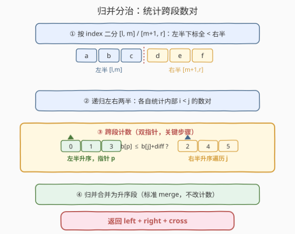

# 满足不等式的数对数目

- **题目名称**：满足不等式的数对数目
- **链接**：[2426. 满足不等式的数对数目](https://leetcode.cn/problems/number-of-pairs-satisfying-inequality/)
- **难度**：困难
- **标签**：分治、归并排序、树状数组

## 1. 题目概述

给你两个下标从 $0$ 开始、长度均为 $n$ 的整数数组 `nums1` 和 `nums2`，以及一个整数 `diff`。统计满足下列条件的**数对** $(i, j)$ 的数目：

- $0 \le i < j \le n - 1$，且
- $\text{nums1}[i] - \text{nums1}[j] \le \text{nums2}[i] - \text{nums2}[j] + \text{diff}$。

**示例 1**：

```text
输入：nums1 = [3,2,5], nums2 = [2,2,1], diff = 1
输出：3
解释：
- i=0, j=1：3-2 <= 2-2+1，即 1 <= 1 ✓
- i=0, j=2：3-5 <= 2-1+1，即 -2 <= 2 ✓
- i=1, j=2：2-5 <= 2-1+1，即 -3 <= 2 ✓
共 3 个。
```

**示例 2**：

```text
输入：nums1 = [3,-1], nums2 = [-2,2], diff = -1
输出：0
解释：仅数对 (0,1)：5 <= -3+(-1)=-4 不成立，返回 0。
```

**约束条件**：

- $n = \text{nums1.length} = \text{nums2.length}$
- $2 \le n \le 10^5$
- $-10^4 \le \text{nums1}[i], \text{nums2}[i] \le 10^4$
- $-10^4 \le \text{diff} \le 10^4$

> 💡 关键观察：把含 $\text{nums2}$ 的项移到左边、含 $\text{nums1}$ 的项合并，原不等式可重写为 $b[i] \le b[j] + \text{diff}$，其中 $b[k] = \text{nums1}[k] - \text{nums2}[k]$。于是「双数组不等式」被压成「单数组上数 $i < j$ 的数对」，与 [493. 翻转对](../0401-0500/493_翻转对.md)、[315. 计算右侧小于当前元素的个数](../0301-0400/315_计算右侧小于当前元素的个数.md) 同属「跨段计数」家族——可用归并排序在一次分治中统计。

---

## 2. 解题思路

### 2.1 暴力思路：枚举所有数对

最直接的做法是双重循环枚举 $i < j$，逐对代入判定：

```text
ans = 0
for i in range(n):
    for j in range(i + 1, n):
        if nums1[i] - nums1[j] <= nums2[i] - nums2[j] + diff:
            ans += 1
```

数对总数 $\binom{n}{2} \approx n^2/2$，$n = 10^5$ 时约 $5 \times 10^9$ 次判定，远超 $10^8$ 阈值，必然 TLE。

> ⚠️ 瓶颈在于**逐对重算**：判定每对都重新计算四个数组访问与一次比较，没有任何复用。这与 845/238 的「重叠子区间」不同——这里的重叠不在数据上而在「条件结构」上：$b[i] \le b[j] + \text{diff}$ 的判定可借助**有序性**批量完成。归并排序的「左半有序 + 右半有序」恰好暴露了这种有序性，把逐对 $O(1)$ 判定压成「对每个右半元素用双指针一次性查清左半合法数」。

### 2.2 核心观察：差值变换 + 归并跨段计数

![核心观察：双数组不等式 ⟹ b[i] ≤ b[j]+diff 的单数组数对计数](../images/npairs_inequality_concept.svg)

**第一步：差值变换。** 把不等式移项归并：

$$
\text{nums1}[i] - \text{nums1}[j] \le \text{nums2}[i] - \text{nums2}[j] + \text{diff}
\;\Longleftrightarrow\;
\bigl(\text{nums1}[i] - \text{nums2}[i]\bigr) \le \bigl(\text{nums1}[j] - \text{nums2}[j]\bigr) + \text{diff}.
$$

令 $b[k] = \text{nums1}[k] - \text{nums2}[k]$，则条件化为

$$
b[i] \le b[j] + \text{diff}, \quad 0 \le i < j < n.
$$

> 💡 一次 $O(n)$ 预处理把两个数组合成一个差值数组 $b$，题目归结为「数 $i<j$ 且 $b[i]-b[j] \le \text{diff}$ 的数对」。这正是 493 翻转对（数 $a[i] > 2a[j]$）的同构形态，只是阈值关系不同。

**第二步：归并跨段计数。** 对 $b$ 按下标区间做归并排序，在合并两段前先统计「跨段合法数对」。设当前段 $[l, r]$，中点 $m$：

- 递归统计左半 $[l, m]$ 内部、右半 $[m+1, r]$ 内部的数对（同过程）；
- **跨段计数**：此时左半、右半各自**已升序**。对左半任一 $i$、右半任一 $j$，天然满足 $i < j$（左半下标全 $<$ 右半下标），只需判 $b[i] \le b[j] + \text{diff}$。
- 用双指针：右半按升序遍历 $j$（$\Rightarrow$ 阈值 $b[j]+\text{diff}$ 升序），左半指针 $p$ 从 $l$ 起单调推进，停在最后一个满足 $b[p] \le b[j]+\text{diff}$ 的位置；该 $j$ 贡献 $p - l$。
- 三部分相加得 $[l,r]$ 的总数；最后做标准归并，把两段合并为升序供上层使用。

> ⚠️ **正确性关键**：归并排序按下标区间分治，任意「跨段」数对 $(i \in \text{左半}, j \in \text{右半})$ 必有 $i < j$，正好匹配题意；而「同段」数对由递归覆盖。因此递归 + 跨段计数无重无漏地覆盖全部 $i<j$ 数对。这与 493/315 的归并计数完全同构。

### 2.3 算法流程图



骨架四步：

1. **二分**：取 $m = \lfloor(l+r)/2\rfloor$，左 $[l,m]$、右 $[m+1,r]$；
2. **递归**：分别统计两半内部数对；
3. **跨段计数（双指针）**：右半升序遍历 $j$，左半指针 $p$ 单调推进至 $b[p] > b[j]+\text{diff}$，累加 $p - l$；
4. **归并**：合并两段为升序（标准 merge，不改变计数），返回 $\text{left} + \text{right} + \text{cross}$。

> 💡 双指针 $p$ 的**单调性**来自右半升序：$j$ 增大 $\Rightarrow$ $b[j]$ 增大 $\Rightarrow$ $b[j]+\text{diff}$ 增大 $\Rightarrow$ 左半中 $\le$ 阈值的元素只增不减，故 $p$ 只前移不回退。每层合并 $p$ 至多扫一遍左半，单层 $O(\text{len})$，总 $O(n \log n)$。

### 2.4 示例演算

![示例演算：b=[1,0,4] 的归并分治树与跨段计数](../images/npairs_example_walkthrough.svg)

以示例 1，$\text{nums1}=[3,2,5],\ \text{nums2}=[2,2,1],\ \text{diff}=1$，得 $b = [1, 0, 4]$。

**分治树**（按 index 切分）：

```
            [1, 0, 4]            ← 根：下标 0,1,2
           /          \
        [1, 0]         [4]       ← 左下标 0,1 / 右下标 2
        /    \           \
      [1]    [0]        (叶,+0)
```

**左半 $[1,0]$ 的跨段计数**：切分为 $L=[1]$（下标 0）、$R=[0]$（下标 1）。$j$ 取 $0$，阈值 $b[j]+\text{diff}=0+1=1$；左半 $b[0]=1 \le 1$ ✓，$p$ 推进 1 格，$\text{cross}=1$（对应数对 $(0,1)$）。归并得 $[0,1]$。左半总数 $= 0 + 0 + 1 = 1$。

**右半 $[4]$**：单元素，$0$。

**根的跨段计数**：$L=[0,1]$（升序）、$R=[4]$。$j$ 取 $4$，阈值 $4+1=5$；左半 $0 \le 5$ ✓、$1 \le 5$ ✓，$p$ 推尽 2 格，$\text{cross}=2$（对应数对 $(0,2)$、$(1,2)$）。归并得 $[0,1,4]$。

**总计** $= 1\,(\text{左}) + 0\,(\text{右}) + 2\,(\text{跨段}) = 3$ ✓。

> 💡 示例 2：$b=[5,-3],\ \text{diff}=-1$。$L=[5],R=[-3]$，$j=-3$，阈值 $-3-1=-4$；$b[0]=5 \le -4$ 不成立，$\text{cross}=0$，总数 $0$ ✓。

---

## 3. 参考代码

### C++

```cpp
class Solution {
public:
    long long numberOfPairs(vector<int>& nums1, vector<int>& nums2, int diff) {
        int n = nums1.size();
        vector<int> b(n);
        for (int i = 0; i < n; ++i)
            b[i] = nums1[i] - nums2[i];          // 差值变换
        vector<int> tmp(n);
        return mergeCount(b, 0, n - 1, diff, tmp);
    }
private:
    long long mergeCount(vector<int>& b, int l, int r, int diff, vector<int>& tmp) {
        if (l >= r) return 0;
        int m = (l + r) / 2;
        long long res = mergeCount(b, l, m, diff, tmp)
                      + mergeCount(b, m + 1, r, diff, tmp);
        // 跨段计数：右半升序遍历 j，左半双指针 p 推进至 b[p] > b[j] + diff
        int p = l;
        for (int j = m + 1; j <= r; ++j) {
            while (p <= m && b[p] <= b[j] + diff) ++p;
            res += p - l;
        }
        // 归并合并 [l,m] 与 [m+1,r] 为升序（标准 merge，不改计数）
        int i = l, j = m + 1, k = l;
        while (i <= m && j <= r)
            tmp[k++] = (b[i] <= b[j]) ? b[i++] : b[j++];
        while (i <= m) tmp[k++] = b[i++];
        while (j <= r) tmp[k++] = b[j++];
        for (int t = l; t <= r; ++t) b[t] = tmp[t];
        return res;
    }
};
```

> ⚠️ **溢出陷阱**：数对总数可达 $\binom{10^5}{2} \approx 5\times10^9$，超过 32 位有符号整数上界（$\approx 2.1\times10^9$）。返回值与累加变量必须用 `long long`（C++）。值本身 $b[j]+\text{diff} \in [-3\times10^4, 3\times10^4]$ 仍在 `int` 内，无需扩容元素类型。

> 💡 跨段计数与归并合并是两段独立的扫描：前者用双指针 $p$ 统计，后者用标准双下标 $i/j$ 合并；两者都依赖「两半已升序」这一递归不变量。调换两段顺序会破坏 $p$ 的单调性前提（合并后虽仍升序，但跨段计数要在合并前做），故**先计数后归并**不可颠倒。

### Python

```python
class Solution:
    def numberOfPairs(self, nums1: List[int], nums2: List[int], diff: int) -> int:
        b = [nums1[i] - nums2[i] for i in range(len(nums1))]
        n = len(b)
        tmp = [0] * n

        def merge_count(l: int, r: int) -> int:
            if l >= r:
                return 0
            m = (l + r) // 2
            res = merge_count(l, m) + merge_count(m + 1, r)
            # 跨段计数：右半升序遍历 j，左半双指针 p 单调推进
            p = l
            for j in range(m + 1, r + 1):
                while p <= m and b[p] <= b[j] + diff:
                    p += 1
                res += p - l
            # 归并合并为升序
            i, j, k = l, m + 1, l
            while i <= m and j <= r:
                if b[i] <= b[j]:
                    tmp[k] = b[i]; i += 1
                else:
                    tmp[k] = b[j]; j += 1
                k += 1
            while i <= m:
                tmp[k] = b[i]; i += 1; k += 1
            while j <= r:
                tmp[k] = b[j]; j += 1; k += 1
            for t in range(l, r + 1):
                b[t] = tmp[t]
            return res

        return merge_count(0, n - 1)
```

> 💡 递归深度约 $\lceil\log_2 10^5\rceil = 17$，远低于默认上限 1000，无需 `sys.setrecursionlimit`。闭包直接捕获外层 `b / tmp / diff`，写法更贴近 493/315 的归并计数模板。

---

## 4. 复杂度分析

| 维度 | 复杂度 | 说明 |
|------|--------|------|
| **时间复杂度** | $O(n \log n)$ | 归并 $\log n$ 层，每层跨段计数双指针与合并各扫一遍共 $O(n)$，总计 $O(n \log n)$ |
| **空间复杂度** | $O(n)$ | 辅助数组 `tmp` 长 $n$；递归栈 $O(\log n)$；不计输入 |
| 对照：暴力枚举 | $O(n^2)$ | 数对数 $\binom{n}{2}$，$n=10^5$ 时约 $5\times10^9$，TLE |

> 💡 归并计数把「逐对 $O(1)$ 判定」升格为「逐右半元素 $O(\text{左半长})$ 双指针」，靠两半有序性把判定批量摊销。这是「计数型数对问题」从 $O(n^2)$ 降到 $O(n \log n)$ 的通用范式——与 493/315 同源，区别只在阈值关系与「总数 vs 逐位置」。

---

## 5. 扩展：树状数组解法与变体

### 5.1 树状数组 + 离散化（通用）

把判定改写成「在线计数」：从左到右扫 $j$，维护已见 $b[0..j-1]$ 的频率，对每个 $j$ 查「已见值中 $\le b[j]+\text{diff}$ 的个数」，再把 $b[j]$ 插入。用按值离散化的树状数组（Fenwick）做前缀和查询：

- 候选集 $S = \{b[i]\} \cup \{b[i]+\text{diff}\}$，排序去重得坐标映射；
- 对 $j = 0 \dots n{-1}$：`ans += BIT.query(rank_le(b[j]+diff))`，再 `BIT.add(rank(b[j]), +1)`。

其中 `rank_le(th)` = `bisect_right(S, th) - 1`（1-indexed）。复杂度 $O(n \log n)$、空间 $O(n)$。这是 315「树状数组」分支的同款写法，**不依赖值域大小**。

### 5.2 直接值域 BIT（利用小值域）

题面值域 $b \in [-2\times10^4, 2\times10^4]$、$b[j]+\text{diff} \in [-3\times10^4, 3\times10^4]$，范围仅约 $6\times10^4$。给所有值加偏移 $30000$ 即可直接做 Fenwick 下标，**省去离散化**：

```cpp
// 偏移后下标范围 [0, 60000]，Fenwick 大小 60005
int OFFSET = 30000;
// 对每个 j：ans += bit.query(OFFSET + b[j] + diff);  // 前缀和
//          bit.add (OFFSET + b[j], 1);
```

单次操作 $O(\log V) \approx O(16)$，总 $O(n \log V)$。仅当值域紧凑时可用；值域泛化后仍需回到 5.1 的离散化。

### 5.3 哪些写法会 TLE

| 写法 | 复杂度 | 结论 |
|------|--------|------|
| 双重循环枚举 | $O(n^2)$ | TLE |
| `bisect` + `list.insert` 维护有序表 | $O(n^2)$（插入移位 $O(n)$） | TLE |
| `SortedList`（sortedcontainers，LeetCode 未内置） | $O(n \log n)$ | 不可用 |
| 归并计数 / 离散化 BIT / 直接值域 BIT | $O(n \log n)$ | 通过 |

> 💡 经验：凡是「数 $i<j$ 满足某二元关系」且关系可借有序性批量判定，优先想归并计数或离散化 BIT；两者都把 $O(n^2)$ 降到 $O(n \log n)$，区别在「原地分治 vs 值域映射」的实现口味。

---

## 6. 面试要点

1. **怎样把原不等式化简？**

   > 移项：把 $\text{nums2}[i]$、$\text{nums2}[j]$ 移到左边与 $\text{nums1}[i]$、$\text{nums1}[j]$ 合并，得 $(\text{nums1}[i]-\text{nums2}[i]) \le (\text{nums1}[j]-\text{nums2}[j]) + \text{diff}$。令 $b[k]=\text{nums1}[k]-\text{nums2}[k]$，即 $b[i] \le b[j]+\text{diff}$（$i<j$）。这一步把双数组压成单数组，是后续所有 $O(n\log n)$ 解法的前提。

2. **归并计数为何不重不漏？**

   > 归并排序按下标区间分治，任意跨段数对 $(i\in\text{左半}, j\in\text{右半})$ 必有 $i<j$（左半下标全小于右半），与题意 $i<j$ 一致；同段数对由递归覆盖。递归 + 跨段计数分别覆盖「$i,j$ 同段」「$i,j$ 跨段」两类，无交集且并集为全部 $i<j$，故无重无漏。

3. **双指针 $p$ 为何单调、单层 $O(\text{len})$？**

   > 右半已升序 $\Rightarrow$ 按 $j$ 升序遍历时 $b[j]+\text{diff}$ 单调递增 $\Rightarrow$ 左半中 $\le$ 阈值的元素集合只增不减 $\Rightarrow$ $p$ 只前移不回退。整层 $p$ 至多扫一遍左半，故跨段计数单层 $O(\text{len})$，归并合并同样 $O(\text{len})$，总 $O(n\log n)$。

4. **为什么答案必须用 64 位整数？**

   > $n\le10^5$ 时数对总数上界 $\binom{n}{2}\approx5\times10^9$，超过 `int` 上界 $2.1\times10^9$，溢出为负或错值。C++ 用 `long long`，Python 整数无界天然安全。值元素 $b[j]+\text{diff}\in[-3\times10^4,3\times10^4]$ 仍属 `int`，溢出只发生在**计数累加**。

5. **归并计数与树状数组各自优劣？**

   > 归并计数：原地分治、$O(n)$ 额外空间、不依赖值域/哈希、代码与 493/315 同构，**通用首选**。树状数组：在线增量插入、天然支持「逐位置查询」、易推广到带权或动态场景（如 315 求每位置右侧计数），但需离散化（值域大时）或受限于值域（小值域直标）。315 的「逐位置返回数组」用 BIT 更顺手，2426 的「只求总数」用归并更简洁。

> 💡 **一句话总结**：先做差值变换 $b[k]=\text{nums1}[k]-\text{nums2}[k]$ 把不等式化为 $b[i]\le b[j]+\text{diff}$（$i<j$），再归并排序分治：右半升序遍历 $j$、左半双指针 $p$ 单调推进统计跨段数对，先计数后归并。$O(n\log n)$ / $O(n)$，与 493、315 同源。

---

## 7. 同类练习题

- [493. 翻转对](https://leetcode.cn/problems/reverse-pairs/)（[题解](../0401-0500/493_翻转对.md)）：**同骨架母题**，条件 $a[i] > 2a[j]$ 数 $i<j$ 数对，归并计数/树状数组，先做此题可一眼看穿 2426 的跨段计数
- [315. 计算右侧小于当前元素的个数](https://leetcode.cn/problems/count-of-smaller-numbers-after-self/)（[题解](../0301-0400/315_计算右侧小于当前元素的个数.md)）：同归并/树状数组计数家族，但要求**逐位置**返回右侧计数数组，对照「求总数」与「逐位置查询」的写法差异
- [719. 找出第 K 小的数对距离](https://leetcode.cn/problems/find-k-th-smallest-pair-distance/)（[题解](../0701-0800/719_找出第K小的数对距离.md)）：同为「数对」问题，但走「二分答案 + 双指针计数」路线（数 $\le$ mid 的数对数判定），对照两种数对计数范式
- [327. 区间和的个数](https://leetcode.cn/problems/count-of-range-sum/)：前缀和 + 数 $i<j$ 落在 $[\text{lower},\text{upper}]$ 的数对，归并/BIT 计数的区间版延伸（本题的单阈值 $+\text{diff}$ 即其上界特例）
