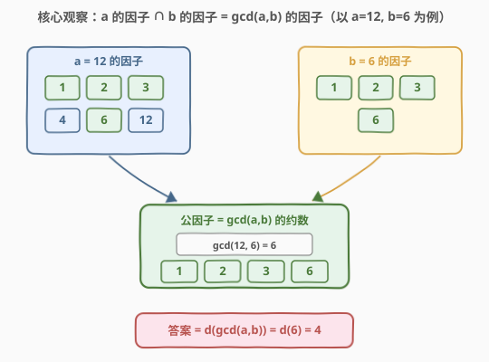
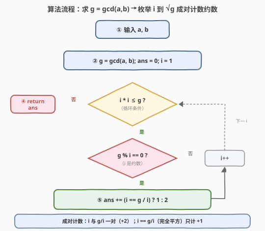
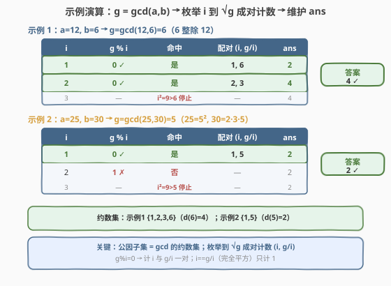

# LeetCode 公因子的数目 题解

## 1. 题目概述

- **标题 / 题号**：公因子的数目（#2427，easy）
- **链接**：https://leetcode.cn/problems/number-of-common-factors/
- **难度**：简单
- **标签**：数学、数论、枚举

**题意**：给你两个正整数 $a$ 和 $b$，返回 $a$ 和 $b$ 的**公因子**的数目。

若 $x$ 可以同时整除 $a$ 和 $b$，则 $x$ 是 $a$ 和 $b$ 的一个**公因子**。

**示例 1**：

```text
输入：a = 12, b = 6
输出：4
解释：12 和 6 的公因子是 1、2、3、6。
```

**示例 2**：

```text
输入：a = 25, b = 30
输出：2
解释：25 和 30 的公因子是 1、5。
```

**约束**：

- $1 \le a, b \le 1000$

> 💡 表面是「枚举因子并判整除」，但 $x$ 同时整除 $a$ 与 $b$ 等价于 $x$ 整除 $\gcd(a, b)$——于是「两数公因子计数」可折叠为「一个数（最大公约数）的约数个数」$d(\gcd(a, b))$，把两数问题压成一数问题。

## 2. 解题思路

### 2.1 暴力思路：枚举到 min(a, b)

公因子 $x$ 既是 $a$ 的因子又是 $b$ 的因子，故 $x \le \min(a, b)$。最直接的做法是枚举 $i \in [1, \min(a, b)]$，逐个检查 $a \bmod i = 0$ 且 $b \bmod i = 0$ 是否同时成立，成立则计数。

由于 $a, b \le 1000$，枚举上界至多 $1000$，最坏 $1000$ 次取模即能 AC。但这是**线性扫描**，完全没利用「公因子集合 = $\gcd$ 的约数集合」这一数论结构。

> ⚠️ 枚举法暴露一个事实：公因子一定不超过 $\min(a, b)$，但更紧的上界是 $\gcd(a, b)$ 本身——因为公因子必整除 $\gcd$，而 $\gcd \le \min(a, b)$。这引出下文的「折叠」观察。

### 2.2 核心观察：公因子 = gcd(a, b) 的约数



**关键洞察**：$x$ 是 $a, b$ 的公因子 $\iff$ $x$ 整除 $\gcd(a, b)$。证明分两向：

- **正向**：若 $x \mid a$ 且 $x \mid b$，由 $\gcd$ 是 $a, b$ 的**线性组合**（Bézout 定理：$\gcd(a, b) = s \cdot a + t \cdot b$），$x$ 整除右端两项，故 $x \mid \gcd(a, b)$。
- **反向**：若 $x \mid \gcd(a, b)$，而 $\gcd(a, b) \mid a$ 且 $\gcd(a, b) \mid b$（$\gcd$ 是公因子），由整除的传递性 $x \mid a$ 且 $x \mid b$。

于是「$a, b$ 的公因子集合」精确等于「$\gcd(a, b)$ 的约数集合」，问题化为求 $\gcd(a, b)$ 的约数个数 $d(\gcd(a, b))$。

> 💡 **为什么这是「折叠」？** 两数各有一堆因子，求交集要枚举两次。但公因子集合天然被 $\gcd$ 这个**最大的公因子**「吸收」：$\gcd$ 的全部约数就是公因子全集。于是不必分别求 $a$、$b$ 的因子再求交，只需对 $g = \gcd(a, b)$ 这一个数求约数个数。求 $\gcd$ 用辗转相除 $O(\log \min(a, b))$，是折叠的关键一步。

### 2.3 算法流程图



两阶段：

1. **求 $\gcd$**：$g = \gcd(a, b)$，用辗转相除（C++ `<numeric>` 的 `gcd` / Python `math.gcd`），$O(\log \min(a, b))$；
2. **数约数**：枚举 $i$ 从 $1$ 到 $\lfloor\sqrt{g}\rfloor$，若 $g \bmod i = 0$，则 $i$ 与 $g/i$ 是一对约数，计数 $+2$；当 $i = g/i$（$g$ 为完全平方数）时两者重合，只计 $+1$。

**成对计数原理**：$g$ 的约数总是成对出现（$i$ 与 $g/i$），枚举到 $\sqrt{g}$ 即可覆盖全部，无需扫到 $g$。

### 2.4 示例演算



**示例 1** $a = 12, b = 6$：

- $g = \gcd(12, 6) = 6$（$6$ 整除 $12$，$\gcd$ 即较小者）；
- 枚举 $i$ 到 $\lfloor\sqrt{6}\rfloor = 2$：

| $i$ | $6 \bmod i$ | 命中 | 配对约数 | ans |
|-----|-------------|------|----------|-----|
| 1 | $0$ ✓ | 是 | $1,\ 6/1=6$ | 2 |
| 2 | $0$ ✓ | 是 | $2,\ 6/2=3$ | 4 |

$i = 3$ 时 $3^2 = 9 > 6$ 停止 → **返回 4** ✓（约数集合 $\{1, 2, 3, 6\}$）。

**示例 2** $a = 25, b = 30$：

- $g = \gcd(25, 30) = 5$（$25 = 5^2$、$30 = 2 \times 3 \times 5$，唯一公共素因子 $5$）；
- 枚举 $i$ 到 $\lfloor\sqrt{5}\rfloor = 2$：

| $i$ | $5 \bmod i$ | 命中 | 配对约数 | ans |
|-----|-------------|------|----------|-----|
| 1 | $0$ ✓ | 是 | $1,\ 5/1=5$ | 2 |
| 2 | $1$ ✗ | 否 | — | 2 |

$i = 3$ 时 $3^2 = 9 > 5$ 停止 → **返回 2** ✓（约数集合 $\{1, 5\}$）。

> 💡 两个示例分别展示「多对约数（6 → $\{1,6\},\{2,3\}$）」与「几乎素数（5 只有 $\{1,5\}$）」的两种形态：$g$ 越接近素数，约数个数越接近 $2$；$g$ 越高度合成（如 $12$ 的约数 $6$ 个），答案越大。本题答案上界发生在 $\gcd(a, b)$ 取最大高度合成数时。

## 3. 参考代码

### C++

```cpp
class Solution {
public:
    int commonFactors(int a, int b) {
        int g = gcd(a, b);
        int ans = 0;
        for (int i = 1; i * i <= g; ++i) {
            if (g % i == 0) {
                ans += (i == g / i) ? 1 : 2;
            }
        }
        return ans;
    }
};
```

> 💡 `gcd` 来自 `<numeric>`（C++17）。循环条件 `i * i <= g` 即「枚举到 $\sqrt{g}$」，用乘法 `i * i` 避免浮点 `sqrt`。命中时用三目判定 $i$ 与 $g/i$ 是否重合（完全平方数情形），重合只计一次。$g \le 1000$，`i * i` 至多 $\approx 10^6$，无 `int` 溢出风险。

### Python

```python
import math

class Solution:
    def commonFactors(self, a: int, b: int) -> int:
        g = math.gcd(a, b)
        ans = 0
        i = 1
        while i * i <= g:
            if g % i == 0:
                ans += 1 if i == g // i else 2
            i += 1
        return ans
```

> 💡 Python 的 `math.gcd` 对正整数返回正 $\gcd$。也可一行写：`return sum(1 if i == g // i else 2 for i in range(1, int(g**0.5) + 1) if g % i == 0)`，但显式循环可读性更好，且避免 `g**0.5` 的浮点误差（小规模无碍，但乘法 `i*i` 更稳）。

## 4. 复杂度分析

| 维度 | 复杂度 | 说明 |
|------|--------|------|
| **时间复杂度** | $O(\sqrt{\min(a, b)})$ | 求 $\gcd$ 为 $O(\log \min(a, b))$；数约数枚举到 $\sqrt{g} \le \sqrt{1000} \approx 32$，主导项为枚举 |
| **空间复杂度** | $O(1)$ | 仅常数个变量 |
| 对照：枚举到 $\min(a, b)$ | $O(\min(a, b))$ | 线性扫描至多 $1000$ 次；未利用 $\gcd$ 结构 |
| 对照：素因子分解法 | $O(\sqrt{g})$ | 分解 $g$ 后用 $d(n) = \prod (e_i + 1)$；同阶但实现更繁 |

> 💡 本题 $g \le 1000$，$\sqrt{g} \le 32$，三种做法都能瞬 AC。优化价值在于「方法论」：识别「公因子 = $\gcd$ 的约数」能把两数问题折叠成一数问题，把 $O(\min(a, b))$ 压到 $O(\sqrt{\min(a, b)})$——当 $a, b$ 放大到 $10^{12}$ 时，枚举到 $\min$ 不可行，而 $\sqrt{g} \le 10^6$ 仍可接受。

## 5. 扩展：约数个数函数 $d(n)$ 与成对计数

求一个数 $n$ 的约数个数 $d(n)$ 有两条等价路径：

**路径一：成对枚举（本题所用）**——枚举 $i$ 到 $\sqrt{n}$，命中则计 $i$ 与 $n/i$ 一对，完全平方数特判。$O(\sqrt{n})$，无需分解。

**路径二：素因子分解 + 乘积公式**——若 $n = p_1^{e_1} p_2^{e_2} \cdots p_k^{e_k}$，则

$$
d(n) = (e_1 + 1)(e_2 + 1) \cdots (e_k + 1)
$$

> 直觉：每个素因子 $p_i$ 可取 $0, 1, \dots, e_i$ 共 $e_i + 1$ 种幂次，各素因子选取独立，约数总数即各幂次选择的笛卡尔积大小。如 $6 = 2^1 \times 3^1 \Rightarrow d(6) = 2 \times 2 = 4$（即 $\{1,2,3,6\}$），$5 = 5^1 \Rightarrow d(5) = 2$（即 $\{1,5\}$）。

故本题答案可写为 $d(\gcd(a, b))$。对 $n \le 1000$，成对枚举更简单；当 $n$ 极大且已知素分解时，乘积公式 $O(1)$ 出答案。两路径对 $n \le 10^{12}$ 同为 $O(\sqrt{n})$（试除分解到 $\sqrt{n}$ 即止），但乘积公式便于在筛法预处理素因子后批量 $O(1)$ 查询。

> 💡 **进一步：$d(n)$ 的渐近阶**。平均意义下 $d(n) \approx \log n$，但最坏情形（高度合成数）$d(n)$ 可达 $O(n^{o(1)})$（亚幂级增长）。本题 $g \le 1000$，$d(g)$ 最大为 $d(840) = 32$，故答案不超过 $32$，枚举上界即 $\sqrt{1000}$ 量级。

## 6. 面试要点

1. **为什么公因子集合恰好等于 $\gcd(a, b)$ 的约数集合？**

   > 双向证明：正向，$x \mid a$ 且 $x \mid b$，由 Bézout 定理 $\gcd(a, b) = s \cdot a + t \cdot b$ 是 $a, b$ 的线性组合，$x$ 整除右端两项故 $x \mid \gcd(a, b)$；反向，$x \mid \gcd(a, b)$ 且 $\gcd(a, b) \mid a, b$，整除传递性给出 $x \mid a, b$。故两集合相等。关键是把「公因子」这个**交集概念**折叠到「$\gcd$ 的约数」这个**单数概念**上。

2. **为什么枚举到 $\sqrt{g}$ 就够，不必扫到 $g$？**

   > 约数成对：若 $i \mid g$，则 $g/i$ 也是约数，且二者分布在 $\sqrt{g}$ 的两侧（$i \le \sqrt{g} \le g/i$）。枚举较小的那个 $i \in [1, \sqrt{g}]$ 即可覆盖全部约数，每命中一个就同时计入一对。这把 $O(g)$ 扫描压到 $O(\sqrt{g})$。

3. **完全平方数为什么要特判减一？**

   > 当 $g$ 是完全平方数时，$i = \sqrt{g}$ 处 $i = g/i$，两约数重合为一个。若不加 `i == g/i ? 1 : 2` 的判定而恒加 $2$，会把同一个约数 $\sqrt{g}$ 重复计入两次，多算 $1$。例如 $g = 9$，$i = 3$ 时约数 $3$ 只应计一次。

4. **求 $\gcd$ 用什么方法？复杂度多少？**

   > 辗转相除（欧几里得算法）：$\gcd(a, b) = \gcd(b, a \bmod b)$，递归至某项为 $0$。复杂度 $O(\log \min(a, b))$，最坏发生在相邻斐波那契数（Lamé 定理）。C++ `<numeric>` 的 `gcd` / Python `math.gcd` 已内置实现。

5. **本题数据规模小，暴力也行，为何还要折叠到 $\gcd$？**

   > 签到题的价值在「方法论」而非通过与否。识别「公因子 = $\gcd$ 的约数」是把两数问题降为一数问题的范式：当 $a, b$ 放大到 $10^{12}$，枚举到 $\min(a, b)$ 完全不可行（$10^{12}$ 步），而 $\gcd$ 求法仍 $O(\log)$、数约数 $O(\sqrt{g}) \le 10^6$，依然高效。学会「先折叠再求解」的思维，比记住本题一行解更有迁移价值。

> 💡 **一句话总结**：答案是 $d(\gcd(a, b))$——先辗转相除求 $\gcd$，再枚举到 $\sqrt{g}$ 成对计数约数（完全平方特判），$O(\sqrt{\min(a, b)})$ / $O(1)$。

## 同类练习题

| # | 题目 | 与本题的关联 |
|---|------|-------------|
| 2413 | [最小偶倍数](https://leetcode.cn/problems/smallest-even-multiple/)（[题解](../2401-2500/2413_最小偶倍数.md)） | $\text{lcm}(2, n)$ 退化为奇偶判定，同属 GCD/LCM 家族，对照「LCM 折叠」与「公因子折叠」 |
| 1979 | [找出数组的最大公约数](https://leetcode.cn/problems/find-greatest-common-divisor-of-array/)（[题解](../1901-2000/1979_找出数组的最大公约数.md)） | 数组最大最小元素的 $\gcd$，$\gcd$ 的直接练习，承接本题求 $\gcd$ 基础 |
| 1071 | [字符串的最大公因子](https://leetcode.cn/problems/greatest-common-divisor-of-strings/)（[题解](../1001-1100/1071_字符串的最大公因子.md)） | 把 GCD 从整数推广到字符串（公共前后缀），同为辗转相除思想，对照「数论 GCD」与「字符串 GCD」 |
| 914 | [卡牌分组](https://leetcode.cn/problems/x-of-a-kind-in-a-deck-of-cards/)（[题解](../0901-1000/914_卡牌分组.md)） | 各计数频率的 $\gcd$ 是否 $\ge 2$，GCD 聚合应用，对照「两数 GCD」与「多频 GCD」 |
| 149 | [直线上最多的点数](https://leetcode.cn/problems/max-points-on-a-line/)（[题解](../0101-0200/149_直线上最多的点数.md)） | 用 GCD 化简分数表示斜率，GCD 作为「规范化工具」，对照本题的「折叠工具」 |
