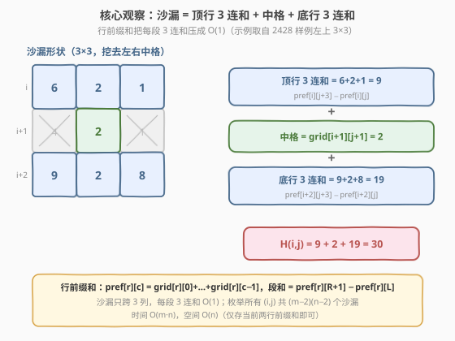
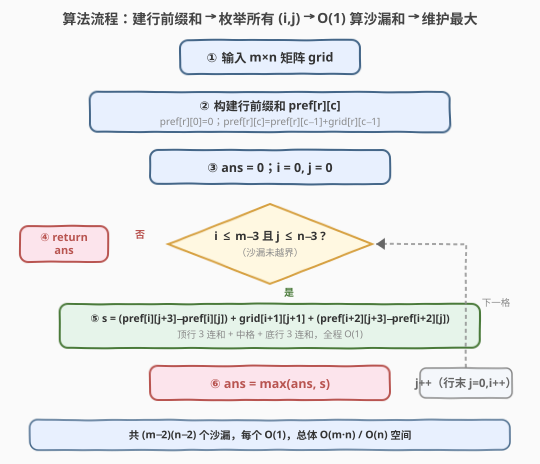
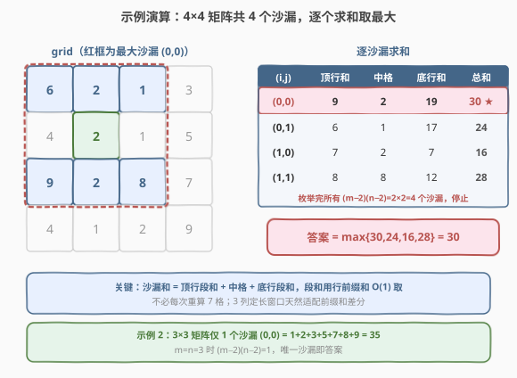

# 沙漏的最大总和

- **题目名称**：沙漏的最大总和
- **链接**：[2428. 沙漏的最大总和](https://leetcode.cn/problems/maximum-sum-of-an-hourglass/)
- **难度**：中等
- **标签**：数组、矩阵、前缀和、枚举

## 1. 题目概述

给你一个大小为 $m \times n$ 的整数矩阵 `grid`。将矩阵中的一个 **沙漏** 定义为如下形状（$3 \times 3$ 区域，挖去中间行的左右两格）：

```text
✓ ✓ ✓
  ✓
✓ ✓ ✓
```

即对左上角 $(i, j)$ 的沙漏，其 7 个格子为：

$$
(i,j),\ (i,j{+}1),\ (i,j{+}2),\quad (i{+}1,\,j{+}1),\quad (i{+}2,\,j),\ (i{+}2,\,j{+}1),\ (i{+}2,\,j{+}2)
$$

返回所有沙漏中元素的 **最大** 总和。**注意**：沙漏无法旋转且必须整个包含在矩阵中。

**示例 1**：

```text
输入：grid = [[6,2,1,3],[4,2,1,5],[9,2,8,7],[4,1,2,9]]
输出：30
解释：元素总和最大的沙漏为左上角 (0,0)：
      6 + 2 + 1 + 2 + 9 + 2 + 8 = 30
```

**示例 2**：

```text
输入：grid = [[1,2,3],[4,5,6],[7,8,9]]
输出：35
解释：唯一的沙漏 (0,0)：1 + 2 + 3 + 5 + 7 + 8 + 9 = 35
```

**约束条件**：

- $m = \text{grid.length}$，$n = \text{grid}[i].\text{length}$
- $3 \le m, n \le 150$
- $0 \le \text{grid}[i][j] \le 10^6$

> 💡 沙漏本质是一个「跨 3 行、跨 3 列、挖掉中间行左右两格」的固定形状。位置数 $(m{-}2)(n{-}2)$ 最多约 $148 \times 148 \approx 2.2 \times 10^4$，每个沙漏 7 格——直接累加也只 $\sim 1.5 \times 10^5$ 次加法，必定 AC。优化价值不在「能否通过」，而在把「每次重算 7 格」升级为「段和 $O(1)$ 复用」，展示前缀和思想。

---

## 2. 解题思路

### 2.1 暴力思路：逐沙漏七格累加

最直接的做法：枚举每个沙漏的左上角 $(i, j)$，范围 $i \in [0, m{-}3]$、$j \in [0, n{-}3]$，对 7 个格子逐一相加，维护最大值。

```text
for i in [0, m-3]:
  for j in [0, n-3]:
    s = grid[i][j] + grid[i][j+1] + grid[i][j+2]
        + grid[i+1][j+1]
        + grid[i+2][j] + grid[i+2][j+1] + grid[i+2][j+2]
    ans = max(ans, s)
```

复杂度 $O(m \cdot n \cdot 7) = O(m \cdot n)$，常数 7。在本题规模下瞬 AC，但暴露一个问题：**相邻沙漏大量重叠却各自重算**——左右相邻的沙漏共享同一顶行/底行中的 2 格，却各自重新累加 3 格。这种「定长窗口重复求和」正是前缀和的用武之地。

> ⚠️ 暴力法没毛病，但它把「3 格连加」这种 $O(1)$ 但带常数 3 的操作重复了 $(m{-}2)(n{-}2)$ 次。若 $m, n$ 放大到 $10^5$ 级（长矩阵），常数 7 仍会咬人。识别「定长段和」结构，可把每段 3 连和压成一次差分。

### 2.2 核心观察：沙漏 = 顶行 3 连和 + 中格 + 底行 3 连和



**关键洞察**：沙漏的 7 格天然按行分成三组——

$$
H(i, j) = \underbrace{\bigl(\text{grid}[i][j] + \text{grid}[i][j{+}1] + \text{grid}[i][j{+}2]\bigr)}_{\text{顶行 3 连和}} + \underbrace{\text{grid}[i{+}1][j{+}1]}_{\text{中格}} + \underbrace{\bigl(\text{grid}[i{+}2][j] + \text{grid}[i{+}2][j{+}1] + \text{grid}[i{+}2][j{+}2]\bigr)}_{\text{底行 3 连和}}
$$

两段「3 连和」都是**某一行上长度恰为 3 的区间和**。对每行预处理一维前缀和：

$$
\text{pref}[r][c] = \sum_{k=0}^{c-1} \text{grid}[r][k], \qquad \text{pref}[r][0] = 0
$$

则行 $r$ 上区间 $[j, j{+}2]$ 的和为一次差分：

$$
\text{rowSum}(r,\, j,\, j{+}2) = \text{pref}[r][j{+}3] - \text{pref}[r][j]
$$

于是每个沙漏和变为：

$$
H(i, j) = \bigl(\text{pref}[i][j{+}3] - \text{pref}[i][j]\bigr) + \text{grid}[i{+}1][j{+}1] + \bigl(\text{pref}[i{+}2][j{+}3] - \text{pref}[i{+}2][j]\bigr)
$$

——全程 $O(1)$，常数从 7 次加法降到 2 次加法 + 2 次减法 + 1 次取中格。

> 💡 **为什么是「行前缀和」而非「二维前缀和」？** 沙漏挖掉了中间行的左右两格，形状不连通成矩形，无法用一个二维前缀和的四角容斥直接表达。但若按行拆开，每行都是规整的连续区间，用一维前缀和正好。这说明：**前缀和的维度要与「求和区域的规则性」匹配**——区域是矩形用二维，区域是行内区间用一维更省更直接。空间也从 $O(mn)$ 降到 $O(n)$（只需保留当前用到的两行前缀和）。

### 2.3 算法流程图



四阶段：

1. **预处理**：对每行 $r$ 构建长度 $n+1$ 的前缀和数组 $\text{pref}[r]$，$\text{pref}[r][0]=0$，$\text{pref}[r][c]=\text{pref}[r][c{-}1]+\text{grid}[r][c{-}1]$。总 $O(mn)$。
2. **初始化**：`ans = 0`（所有 $\text{grid}[i][j] \ge 0$，最小和为 $0$）。
3. **枚举**：双重循环 $i \in [0, m{-}3]$、$j \in [0, n{-}3]$，共 $(m{-}2)(n{-}2)$ 个沙漏。每个用差分公式 $O(1)$ 算出 $H(i, j)$。
4. **维护**：`ans = max(ans, H(i,j))`，循环结束返回 `ans`。

> ⚠️ `ans` 初值取 $0$ 依赖「$\text{grid}[i][j] \ge 0$」这一约束。若允许负数，应初始化为 $-\infty$（如 `INT_MIN` / `float('-inf')`）。

### 2.4 示例演算



**示例 1** $4 \times 4$ 矩阵 $\begin{bmatrix}6&2&1&3\\4&2&1&5\\9&2&8&7\\4&1&2&9\end{bmatrix}$，沙漏位置 $(m{-}2)(n{-}2)=2 \times 2=4$ 个：

| $(i,j)$ | 顶行和 $= \text{grid}[i][j..j{+}2]$ | 中格 $\text{grid}[i{+}1][j{+}1]$ | 底行和 $= \text{grid}[i{+}2][j..j{+}2]$ | $H(i,j)$ |
|---------|--------------------------------------|----------------------------------|------------------------------------------|----------|
| $(0,0)$ | $6+2+1=9$ | $2$ | $9+2+8=19$ | $\mathbf{30}$ ★ |
| $(0,1)$ | $2+1+3=6$ | $1$ | $2+8+7=17$ | $24$ |
| $(1,0)$ | $4+2+1=7$ | $2$ | $4+1+2=7$ | $16$ |
| $(1,1)$ | $2+1+5=8$ | $8$ | $1+2+9=12$ | $28$ |

枚举完毕，$\text{ans} = \max\{30, 24, 16, 28\} = \mathbf{30}$ ✓

> 💡 注意 $(0,0)$ 与 $(0,1)$ 共享顶行的 $2,1$ 两格、底行的 $2,8$ 两格；$(0,0)$ 与 $(1,0)$ 共享中列。前缀和差分让这些重叠格子的求和「算一次、用多次」，这正是前缀和相对暴力的增量价值。

**示例 2** $3 \times 3$ 矩阵 $\begin{bmatrix}1&2&3\\4&5&6\\7&8&9\end{bmatrix}$，$(m{-}2)(n{-}2)=1 \times 1=1$ 个沙漏：

- $(0,0)$：顶行和 $= 1+2+3=6$，中格 $=5$，底行和 $= 7+8+9=24$，$H = 6+5+24 = \mathbf{35}$ ✓

矩阵恰好 $3 \times 3$ 时只有唯一沙漏，其和即答案。

---

## 3. 参考代码

### C++

```cpp
class Solution {
public:
    int maxSum(vector<vector<int>>& grid) {
        int m = grid.size(), n = grid[0].size();
        // 行前缀和：pref[r][c] = grid[r][0..c-1] 之和，pref[r][0]=0
        vector<vector<int>> pref(m, vector<int>(n + 1, 0));
        for (int r = 0; r < m; ++r)
            for (int c = 0; c < n; ++c)
                pref[r][c + 1] = pref[r][c] + grid[r][c];

        int ans = 0;                       // grid[i][j] >= 0，最小和为 0
        for (int i = 0; i + 2 < m; ++i)
            for (int j = 0; j + 2 < n; ++j) {
                int top = pref[i][j + 3] - pref[i][j];          // 顶行 3 连和
                int mid = grid[i + 1][j + 1];                    // 中格
                int bot = pref[i + 2][j + 3] - pref[i + 2][j];  // 底行 3 连和
                ans = max(ans, top + mid + bot);
            }
        return ans;
    }
};
```

> 💡 循环条件 `i + 2 < m`、`j + 2 < n` 等价于 `i <= m-3`、`j <= n-3`，保证 $i{+}2 \le m{-}1$、$j{+}2 \le n{-}1$ 不越界，且 `pref[.][j+3]` 下标合法（$\le n$）。`grid[i][j] <= 10^6`，7 格和至多 $7 \times 10^6 \approx 1.4 \times 10^7$，`int`（上限 $\approx 2.1 \times 10^9$）足够。若去掉非负约束，`ans` 初值改 `INT_MIN / 4` 防减法下溢。

### Python

```python
class Solution:
    def maxSum(self, grid: List[List[int]]) -> int:
        m, n = len(grid), len(grid[0])
        # 行前缀和：pref[r][c] = grid[r][0..c-1] 之和
        pref = [[0] * (n + 1) for _ in range(m)]
        for r in range(m):
            pr = pref[r]
            row = grid[r]
            for c in range(n):
                pr[c + 1] = pr[c] + row[c]

        ans = 0  # grid[i][j] >= 0
        for i in range(m - 2):
            for j in range(n - 2):
                top = pref[i][j + 3] - pref[i][j]
                mid = grid[i + 1][j + 1]
                bot = pref[i + 2][j + 3] - pref[i + 2][j]
                s = top + mid + bot
                if s > ans:
                    ans = s
        return ans
```

> 💡 Python 大整数天然不溢出，但 `range(m - 2)` / `range(n - 2)` 隐含了 `i+2 <= m-1`、`j+2 <= n-1`，沙漏必在界内。若想省去前缀和数组，可改用 `itertools.accumulate` 逐行扫描，或直接暴力 7 格相加（本题规模下也 AC）；前缀和版本的优势在「方法论清晰」与「可迁移到更大规模」。

---

## 4. 复杂度分析

| 维度 | 复杂度 | 说明 |
|------|--------|------|
| **时间复杂度** | $O(m \cdot n)$ | 预处理行前缀和 $O(mn)$；枚举 $(m{-}2)(n{-}2)$ 个沙漏，每个 $O(1)$，总计 $O(mn)$ |
| **空间复杂度** | $O(m \cdot n)$ | 存 $m$ 行、每行 $n{+}1$ 的前缀和数组；可优化为 $O(n)$（见扩展） |
| 对照：暴力 7 格累加 | $O(m \cdot n)$ | 同阶但常数大 7；未复用相邻沙漏的重叠段和 |
| 对照：二维前缀和 | $O(m \cdot n)$ | 通用但需 4 角容斥，且沙漏挖洞形状不适用，反而更繁 |

> 💡 本题 $m, n \le 150$，$mn \le 22500$，无论暴力还是前缀和都瞬 AC。优化意义在于方法论迁移：当 $m, n \approx 10^3$ 甚至更大时，前缀和的常数优势（$O(1)$ 段和）相对暴力（常数 7）仍是 $\sim 3$ 倍加速；更重要的是，它演示了「定长窗口求和 → 前缀和差分」这一普适范式。

---

## 5. 扩展：空间优化与变体形状

### 5.1 空间优化到 $O(n)$

沙漏只跨 3 行（$i, i{+}1, i{+}2$），计算 $H(i, j)$ 只用到第 $i$ 行与第 $i{+}2$ 行的前缀和。故无需存全部 $m$ 行前缀和，只需在主循环里**按行滚动维护「上一行前缀和」**：

```cpp
int maxSum(vector<vector<int>>& grid) {
    int m = grid.size(), n = grid[0].size(), ans = 0;
    vector<int> prev(n + 1, 0);          // 第 i 行的前缀和
    for (int i = 0; i + 2 < m; ++i) {
        // 算第 i 行前缀和进 prev
        for (int c = 0; c < n; ++c) prev[c + 1] = prev[c] + grid[i][c];
        // 第 i+2 行前缀和现算现用
        vector<int> bot(n + 1, 0);
        for (int c = 0; c < n; ++c) bot[c + 1] = bot[c] + grid[i + 2][c];
        for (int j = 0; j + 2 < n; ++j) {
            int top = prev[j + 3] - prev[j];
            int mid = grid[i + 1][j + 1];
            int b    = bot[j + 3] - bot[j];
            ans = max(ans, top + mid + b);
        }
    }
    return ans;
}
```

空间降到 $O(n)$，适合 $m$ 极大、$n$ 中等的「长条矩阵」场景。时间仍 $O(mn)$，但底行前缀和在每次外层循环重算——若想避免，可维护两个滚动数组 `prefA` / `prefB` 交替复用。

### 5.2 变体：滑动窗口的 3 连和

由于窗口宽度恒为 3，也可用**滑动窗口**代替前缀和：进入新列 $j$ 时，行 $r$ 的 3 连和 $= \text{prev}_r \cdot 3\text{连和} - \text{grid}[r][j{-}1] + \text{grid}[r][j{+}2]$，$O(1)$ 滚动更新。与前缀和差分等价（滑动窗口是前缀和的「增量维护」视角），适合流式数据（矩阵逐行到达）场景。本题前缀和更直观。

### 5.3 变体形状

若沙漏改为其他固定形状（如十字、菱形、L 形），只要形状可分解为「若干行内连续区间 + 散点」，前缀和差分仍适用——每行内连续段用一维前缀和，散点直接取。形状越碎片化（如散点占比高），前缀和的收益越低，暴力累加反而更简单。**判断标准**：连续区间数 $\ge 2$ 时前缀和划算，仅 1 段时暴力即可。

---

## 6. 面试要点

1. **沙漏和如何用一次差分 $O(1)$ 算出？**

   > 把 7 格按行拆成「顶行 3 连和 + 中格 + 底行 3 连和」。对每行预处理一维前缀和 $\text{pref}[r][c] = \sum_{k<c}\text{grid}[r][k]$，则顶行段和 $= \text{pref}[i][j{+}3] - \text{pref}[i][j]$，底行段和同理，加中格即得。核心是识别沙漏的两段都是「行内长度 3 的区间和」，匹配一维前缀和。

2. **为什么用一维行前缀和，不用二维前缀和？**

   > 沙漏挖掉了中间行的左右两格，求和区域不是矩形，二维前缀和的四角容斥无法直接表达这种「带洞」形状。但按行拆开后，每行都是规整的连续区间，一维前缀和恰好。这说明前缀和的维度要匹配求和区域的规则性——矩形用二维，行内区间用一维更省更直接，空间也降到 $O(n)$。

3. **`ans` 初值为什么取 0？什么时候要改？**

   > 依赖约束 $0 \le \text{grid}[i][j]$：所有元素非负，故任意沙漏和 $\ge 0$，最小值即 $0$，用 `0` 初始化安全。若去掉非负约束允许负数，最大和可能为负，必须初始化为 $-\infty$（C++ `INT_MIN` 留余量防溢出、Python `float('-inf')`）。这是「利用题目约束简化初值」的典型例子，迁移时务必复核。

4. **暴力 7 格累加也 AC，前缀和的价值在哪？**

   > 本题规模小（$mn \le 22500$），暴力常数 7 仍瞬 AC。前缀和的价值在方法论：相邻沙漏共享 2 格却各自重算 3 格，前缀和差分把「定长段和」压成一次减法，常数从 7 降到 $\sim 5$ 且可复用。当 $m, n$ 放大 $10^3$ 倍，这 $\sim 3$ 倍加速有实义；更重要的是它演示了「定长窗口 → 前缀和差分」范式，可迁移到滑动窗口、二维区域和等大量题型。

5. **枚举范围为什么是 $i \in [0, m{-}3]$、$j \in [0, n{-}3]$？**

   > 沙漏跨 3 行 3 列，左上角 $(i, j)$ 必须保证右下角 $(i{+}2, j{+}2)$ 不越界，即 $i{+}2 \le m{-}1 \Rightarrow i \le m{-}3$、$j{+}2 \le n{-}1 \Rightarrow j \le n{-}3$。故位置数 $(m{-}2)(n{-}2)$。当 $m < 3$ 或 $n < 3$ 时无合法沙漏，但本题约束 $m, n \ge 3$，至少 1 个沙漏。循环条件 `i+2 < m`、`j+2 < n` 与 `i <= m-3`、`j <= n-3` 等价且更防越界。

> 💡 **一句话总结**：沙漏 = 顶行 3 连和 + 中格 + 底行 3 连和，行前缀和把每段 3 连和压成一次差分，枚举所有 $(m{-}2)(n{-}2)$ 个位置取最大，$O(mn)$ / $O(n)$。

---

## 7. 同类练习题

- [304. 二维区域和检索 - 数组不可变](https://leetcode.cn/problems/range-sum-query-2d-immutable/)（[题解](../0301-0400/304_二维区域和检索 - 数组不可变.md)）：二维前缀和四角容斥的招牌题，对照「矩形区域用二维、行内区间用一维」的维度选择
- [303. 区域和检索 - 数组不可变](https://leetcode.cn/problems/range-sum-query-immutable/)（[题解](../0301-0400/303_区域和检索 - 数组不可变.md)）：一维前缀和的母题，本题「行前缀和差分」的直接来源
- [643. 子数组最大平均数 I](https://leetcode.cn/problems/maximum-average-subarray-i/)（[题解](../0601-0700/643_子数组最大平均数I.md)）：定长滑动窗口求最大和，同为「定长窗口 + 求和取最大」范式，对照前缀和差分与滑动窗口两种视角
- [724. 寻找数组的中心下标](https://leetcode.cn/problems/find-pivot-index/)（[题解](../0701-0800/724_寻找数组的中心下标.md)）：前缀和应用——左右段和相等判定，对照「段和复用」的不同用法
- [238. 除自身以外数组的乘积](https://leetcode.cn/problems/product-of-array-except-self/)（[题解](../0201-0300/238_除自身以外数组的乘积.md)）：前缀和的乘法镜像（前缀积 × 后缀积），对照「前缀技术」从求和推广到求积
