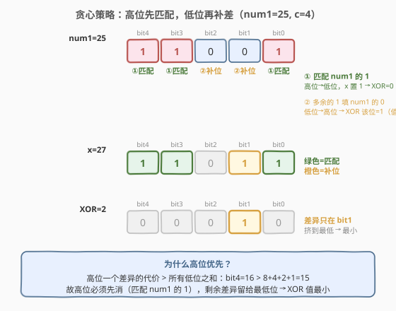
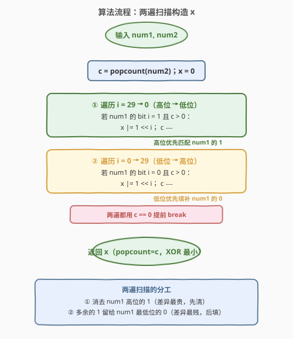
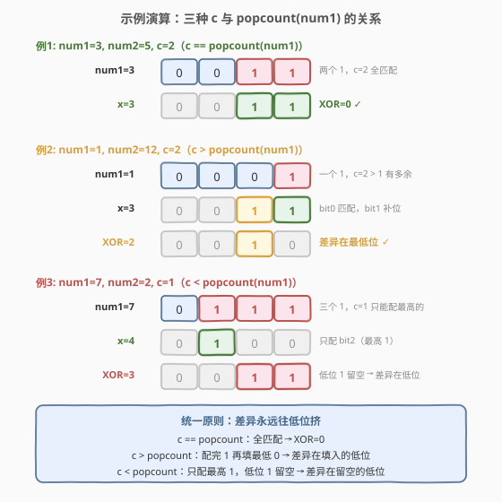

# 最小异或

- **题目名称**：最小异或
- **链接**：[2429. 最小异或](https://leetcode.cn/problems/minimize-xor/)
- **难度**：中等
- **标签**：贪心、位运算

## 1. 题目概述

给定两个正整数 `num1` 和 `num2`，找出满足下述条件的正整数 $x$：

- $x$ 的**置位数**（二进制中 `1` 的个数）与 `num2` 相同，即 $\text{popcount}(x) = \text{popcount}(\text{num2})$；
- $x \oplus \text{num1}$ 的值**最小**（$\oplus$ 为按位异或）。

返回 $x$。题目保证 $x$ 唯一确定。

**示例 1**：

```text
输入：num1 = 3, num2 = 5
输出：3
解释：num1=0011，num2=0101（置位数 2）。
      x=3=0011 置位数也为 2，且 3 XOR 3 = 0 最小。
```

**示例 2**：

```text
输入：num1 = 1, num2 = 12
输出：3
解释：num1=0001，num2=1100（置位数 2）。
      x=3=0011 置位数也为 2，且 3 XOR 1 = 2 最小。
```

**约束条件**：

- $1 \le \text{num1}, \text{num2} \le 10^9$

> 💡 **题眼**：约束只限定 $x$ 的置位**个数**，不限定位**在哪些位**。故问题转化为：在「恰有 $c$ 个 1」的所有 $x$ 中，挑出与 `num1` 异或最小的那个——是**构造**题，不是搜索题。

---

## 2. 解题思路

### 2.1 暴力思路：枚举所有「恰 $c$ 个 1」的 $x$

记 $c = \text{popcount}(\text{num2})$。最直白的做法是枚举所有「置位数恰为 $c$」的 $x$，逐一计算 $x \oplus \text{num1}$ 取最小。但候选数为 $\binom{30}{c}$，当 $c = 15$ 时约 $1.55 \times 10^8$，**指数级，不可行**。

> 💡 转机：能否不枚举，而**直接构造**出最优的 $x$？关键在于认清「让 XOR 最小」的位级含义——**让差异位尽量少、尽量靠低位**。

### 2.2 核心观察：贪心位放置——高位先匹配，低位再补差



$x \oplus \text{num1}$ 的每一位：$x$ 与 `num1` **相同为 0，不同为 1**。要让 XOR 值最小，就得让「差异位」尽可能少、且尽可能落在**低位**，因为高位的权重大。

> ⚠️ **决定性事实**：**高位一个差异的代价 $>$ 所有低位之和**。具体地，第 $k$ 位的差异贡献 $2^k$，而所有更低位的和不过 $2^k - 1$。即 $2^k > 2^{k-1} + 2^{k-2} + \cdots + 2^0 = 2^k - 1$。
>
> 推论：**最高位的差异**主导整个 XOR 值。要最小化，必须**优先消去最高位的差异**，把不可避免的差异挤到最低位。

据此得到贪心构造：

1. **先匹配 `num1` 的 1（高位 → 低位）**：对 `num1` 的每个 1-bit，若还有「1 的预算」（$c > 0$），就在 $x$ 的同位也置 1。这样 $x$ 与 `num1` 在该位相同 → XOR 该位为 0，且**先消的是最高位**。
2. **多余的 1 填 `num1` 的 0（低位 → 高位）**：若预算有剩余（$c > \text{popcount}(\text{num1})$ 的情形），把它们填到 `num1` 最低的 0-bit。这些位 $x=1$、`num1`=0 → XOR 该位为 1，但**落在最低位**，代价最小。

按 $c$ 与 $\text{popcount}(\text{num1})$ 的大小，自然分两种情形，却由同一套「两遍扫描」统一处理：

| 情形 | 第 1 遍（匹配 num1 的 1） | 第 2 遍（填 num1 的 0） | XOR 的差异落点 |
|------|--------------------------|------------------------|----------------|
| $c < \text{popcount}(\text{num1})$ | 预算用尽，只匹配**最高**的 $c$ 个 1 | 不执行 | `num1` 的**低位** 1 留空 → 差异在低位 |
| $c = \text{popcount}(\text{num1})$ | 全部匹配 | 不执行 | XOR = 0 |
| $c > \text{popcount}(\text{num1})$ | 全部匹配后预算有剩 | 填 `num1` **最低**的 0-bit | 差异在填入的低位 |

> 💡 **统一直觉**：无论哪种情形，「差异」都被推向**最低位**——要么是留空的低位 1，要么是补入的低位 0。这正是最小化的充要条件，证明见第 6 节 Q3。

### 2.3 算法流程图



算法是**两遍串联的扫描**，每遍都用 $c = 0$ 提前 `break`：

1. **初始化**：$c = \text{popcount}(\text{num2})$，$x = 0$。
2. **第 1 遍（高位 → 低位）**：遍历 $i = 29 \to 0$，遇 `num1` 的 1 且 $c>0$ 则 $x \mathrel{|}= 1 \ll i$，$c\mathrel{-}= 1$。
3. **第 2 遍（低位 → 高位）**：遍历 $i = 0 \to 29$，遇 `num1` 的 0 且 $c>0$ 则 $x \mathrel{|}= 1 \ll i$，$c\mathrel{-}= 1$。

> 💡 两遍扫描的位域互不相交（第 1 遍只动 `num1` 的 1-bit，第 2 遍只动 0-bit），合起来覆盖 $0 \sim 29$ 共 30 个位置。由于 $c \le 29$（见第 4 节），30 个位置足够装下所有 1。

### 2.4 示例演算



覆盖 $c$ 与 $\text{popcount}(\text{num1})$ 的三种关系：

- **例 1（题）** `num1=3, num2=5, c=2`（$c = \text{popcount}$）：`num1=0011`，两遍各匹配 bit1、bit0 → $x=0011=3$，XOR $=0$。
- **例 2（题）** `num1=1, num2=12, c=2`（$c > \text{popcount}$）：`num1=0001`，第 1 遍匹配 bit0，第 2 遍补 bit1 → $x=0011=3$，XOR $=2$（差异在 bit1）。
- **例 3（补）** `num1=7, num2=2, c=1`（$c < \text{popcount}$）：`num1=0111`，第 1 遍预算 1 只够匹配最高 bit2 → $x=0100=4$，XOR $=3$（bit1、bit0 的 `num1` 低位 1 留空）。

> ⚠️ 注意例 3：预算不够时**不是**随便配一个 1，而是**专挑最高的**配——配 bit2 得 XOR=3，若配 bit1 得 XOR=5，配 bit0 得 XOR=6。高位匹配的收益压倒一切。

---

## 3. 参考代码

### C++

```cpp
class Solution {
  public:
    int minimizeXor(int num1, int num2) {
        int c = __builtin_popcount(num2);
        int x = 0;
        // ① 高位 → 低位：匹配 num1 的 1
        for (int i = 29; i >= 0 && c > 0; --i) {
            if (num1 >> i & 1) {
                x |= 1 << i;
                --c;
            }
        }
        // ② 低位 → 高位：多余的 1 填 num1 的 0
        for (int i = 0; i <= 29 && c > 0; ++i) {
            if (!(num1 >> i & 1)) {
                x |= 1 << i;
                --c;
            }
        }
        return x;
    }
};
```

### Python

```python
class Solution:
    def minimizeXor(self, num1: int, num2: int) -> int:
        c = bin(num2).count("1")
        x = 0
        # ① 高位 → 低位：匹配 num1 的 1
        for i in range(29, -1, -1):
            if c == 0:
                break
            if num1 >> i & 1:
                x |= 1 << i
                c -= 1
        # ② 低位 → 高位：多余的 1 填 num1 的 0
        for i in range(30):
            if c == 0:
                break
            if not (num1 >> i & 1):
                x |= 1 << i
                c -= 1
        return x
```

> 💡 `bin(num2).count("1")` 即 popcount；Python 3.10+ 也可写 `num2.bit_count()`。循环上界取 30 是因为 $10^9 < 2^{30}$，`num1`、`num2` 的有效位都不超过 30。

---

## 4. 复杂度分析

| 维度 | 复杂度 | 说明 |
|------|--------|------|
| **时间复杂度** | $O(\log U) = O(30) = O(1)$ | 两遍各扫 30 个位，$U = 10^9 < 2^{30}$；与具体数值无关 |
| **空间复杂度** | $O(1)$ | 只用常数个整型变量 |

> ⚠️ 关于 $c \le 29$：`num2` 至多 $10^9 < 2^{30}$，而「30 个 1」的最小整数是 $2^{30}-1 = 1\,073\,741\,823 > 10^9$，故 $c$ 不可能达到 30。30 个位位置（$0 \sim 29$）足以容纳至多 29 个 1，循环不会越界。

---

## 5. 扩展：从 num1 增删低位（lowbit 版）

换个视角：与其从 0 起拼 $x$，不如**把 `num1` 复制为 $x$，再从最低位开始增/删 1，直到 popcount 凑够 $c$**。因为只动最低位，差异天然被挤到低位——与第 2.2 节的贪心殊途同归。

这里复用 [191](../0001-0100/191_位1的个数.md)/[231](../0201-0300/231_2的幂.md) 的 Brian Kernighan 技巧：

- **1 太多**：`x &= x - 1` 抹掉 $x$ 的**最低设置位**（详见 [191](../0001-0100/191_位1的个数.md)）；重复至 $\text{popcount}(x) = c$。这清掉的是 `num1` 最低的若干个 1，留下最高的 $c$ 个——正是 $c < \text{popcount}$ 情形。
- **1 太少**：`x |= (~x) & (x + 1)` 把 $x$ 的**最低 0 位**置 1；重复至 $\text{popcount}(x) = c$。这补的是 `num1` 最低的若干个 0——正是 $c > \text{popcount}$ 情形。

> 💡 **`(~x) & (x + 1)` 何以是最低 0 位？** $x+1$ 会把 $x$ 的最低 0 翻成 1、更低的连续 1 全翻 0；而 $\sim x$ 恰在 $x$ 的 0 位上为 1。两者取交，独留「$x$ 的最低 0 位」一个 1，即为所求掩码。

### C++（lowbit 版）

```cpp
class Solution {
  public:
    int minimizeXor(int num1, int num2) {
        int x = num1;
        int c = __builtin_popcount(num2);
        while (__builtin_popcount(x) > c) x &= x - 1;   // 修剪最低 1
        while (__builtin_popcount(x) < c) x |= (~x) & (x + 1);  // 补最低 0
        return x;
    }
};
```

### Python（lowbit 版）

```python
class Solution:
    def minimizeXor(self, num1: int, num2: int) -> int:
        x = num1
        c = bin(num2).count("1")
        while bin(x).count("1") > c:
            x &= x - 1            # 修剪最低 1
        while bin(x).count("1") < c:
            x |= (~x) & (x + 1)    # 补最低 0
        return x
```

> ⚠️ lowbit 版每次循环都重算 $\text{popcount}$，最坏 $O(\log U \cdot \log U)$；本题 $U \le 10^9$ 实测无碍。若追求严格 $O(\log U)$，仍以第 3 节的两遍扫描为主。

---

## 6. 面试要点

1. **为什么「高位优先匹配」能最小化 XOR？**

   - XOR 值 $= \sum_{\text{差异位 } k} 2^k$。第 $k$ 位差异贡献 $2^k$，而所有更低位的和仅 $2^k - 1 < 2^k$。
   - 故「消去更高位的差异」收益严格大于「消去任意多个更低位的差异」——**高位具有字典序式的优先权**。
   - 贪心：预算优先花在最高位的匹配上，剩余差异必然落在最低位，全局最优。

2. **预算不够时（$c < \text{popcount}$），为什么只配最高的 $c$ 个 1？**

   - 此时必有 $(\text{popcount}(\text{num1}) - c)$ 个 `num1` 的 1 无法匹配，会在 XOR 中变成 1。
   - 要最小化这部分代价，就让这些「留空」的 1 落在 `num1` 的**最低** 1 位上 → 等价于**匹配最高的 $c$ 个**。
   - 反例：`num1=7(0111), c=1`，配 bit2 得 XOR=3；配 bit0 得 XOR=6。

3. **如何严格证明「两遍扫描」给出全局最优？**

   - 设最优解 $x^*$ 与本解 $x$ 的 XOR 值 $v^* \le v$。考察最高位 $k$ 使两者在某处不同——由贪心构造，$x$ 已在该位前消去一切可消的差异。
   - 等价地用**交换论证**：若某解把一个 1 放在较高位的 `num1` 0 上（而非较低位），把它下移到更低的 0 位必不增 XOR（$2^{\text{高}} > 2^{\text{低}}$）。
   - 故最优解必形如「尽可能多的高位 1 匹配 + 剩余 1 占最低 0 位」，即本解。

4. **`(~x) & (x + 1)` 为什么能取最低 0 位？与 `x & -x` 的关系？**

   - `x & -x`（即 `x & (~x+1)`）取 $x$ 的**最低设置位**（lowbit，[231](../0201-0300/231_2的幂.md) 5.1 节）。
   - 把 $x$ 换成 $\sim x$：`~x & (~~x + 1) = ~x & (x+1)`，取 $\sim x$ 的最低设置位，即 $x$ 的**最低 0 位**。
   - 故「修剪最低 1」用 `x & -x` 的变体 `x &= x-1`，「补最低 0」用 `(~x) & (x+1)`——两者是同一 lowbit 技巧的正反两面。

5. **本题与 [2220](../2201-2300/2220_转换数字的最少位翻转次数.md) 有何异同？**

   - 2220 求两数差异位的**个数**：$\text{popcount}(x \oplus y)$，是「计数」；本题求差异位**安排在哪些位**使 XOR **值**最小，是「安排」。
   - 共用 `popcount` 与异或位差异的模型；2220 不关心差异在高位还是低位（只数个数），本题则必须把差异推向低位——本题是 2220 的「带权」升级。

> 💡 **一句话总结**：要最小化 $x \oplus \text{num1}$ 且 $\text{popcount}(x)=c$，就把 $x$ 的 1 **先按高位匹配 `num1` 的 1，多余的再填 `num1` 最低的 0**——差异全挤到低位，XOR 自然最小。两遍扫描即 $O(1)$ 终。

---

## 7. 同类练习题

- [191. 位 1 的个数](https://leetcode.cn/problems/number-of-1-bits/)（[题解](../0001-0100/191_位1的个数.md)）：popcount 的母题，Brian Kernighan 技巧 `n & (n-1)`；本题 $c = \text{popcount}(\text{num2})$ 即由它定义
- [2220. 转换数字的最少位翻转次数](https://leetcode.cn/problems/minimum-bit-flips-to-convert-number/)（[题解](../2201-2300/2220_转换数字的最少位翻转次数.md)）：`popcount(x ^ y)` 数差异位个数；与本题同属「XOR 位差异」家族，只数个数 vs 安排位置
- [231. 2 的幂](https://leetcode.cn/problems/power-of-two/)（[题解](../0201-0300/231_2的幂.md)）：`n & (n-1)` / `x & -x` lowbit 技巧；第 5 节的 lowbit 版直接复用
- [1356. 根据数字二进制下 1 的数目排序](https://leetcode.cn/problems/sort-integers-by-the-number-of-1-bits/)（[题解](../1301-1400/1356_根据数字二进制下1的数目排序.md)）：popcount 作排序键，popcount 的批量应用
- [338. 比特位计数](https://leetcode.cn/problems/counting-bits/)（[题解](../0301-0400/338_比特位计数.md)）：对 $0 \sim n$ 批量求 popcount，DP 复用 `ans[i & (i-1)]`，191 的「批量版」
