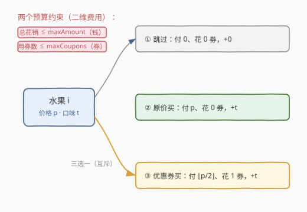

# 购买水果的最大总口味

- **题目名称**：购买水果的最大总口味
- **链接**：[2431. 购买水果的最大总口味](https://leetcode.cn/problems/maximize-total-tastiness-of-purchased-fruits/)
- **难度**：中等
- **标签**：数组、动态规划

> ⚠️ **题面说明**：本题为 **LeetCode Plus（会员）题**，官方题面与样例输出未公开（API 返回 `isPaidOnly=true`、`content=null`，亦无官方题解）。下文题意与样例输出系据 **官方函数签名 + 官方提示（"每个水果三种选择：跳过 / 用券买 / 不用券买"）** 还原，并采用「**优惠券使该水果半价，即支付 $\lfloor p/2 \rfloor$**」这一题意。若实际题意不同（如"用券即免费"），见第 5 节，仅需改一处转移。

## 1. 题目概述

给定 $n$ 个水果，第 $i$ 个水果的价格为 `price[i]`、口味为 `tastiness[i]`。再给定预算上限 `maxAmount`（钱）与优惠券上限 `maxCoupons`（券）。对每个水果三选一：

- **跳过**：不买，花 $0$ 元、$0$ 券，口味 $+0$；
- **原价买**：支付 `price[i]`，不花券，口味 $+\textit{tastiness}[i]$；
- **优惠券买**：支付 $\lfloor \textit{price}[i] / 2 \rfloor$，花 $1$ 张券，口味 $+\textit{tastiness}[i]$。

要求总花销 $\le \textit{maxAmount}$、用券数 $\le \textit{maxCoupons}$，求**口味总和的最大值**。

**示例 1**（按半价券题意还原）：

```text
输入：price = [10,20,20], tastiness = [5,8,8], maxAmount = 20, maxCoupons = 1
输出：13
解释：水果 0 原价买（付 10、+5），水果 1 用券买（付 ⌊20/2⌋=10、+8），
      共付 20 ≤ 20、用 1 ≤ 1 券，口味 5+8=13。
```

**约束条件**（由题目结构还原，官方原文未公开）：

- $n = \textit{price.length} = \textit{tastiness.length}$
- $\textit{price}[i], \textit{tastiness}[i]$ 为正整数；$\textit{maxAmount}, \textit{maxCoupons} \ge 0$
- 规模使 $O(n \cdot \textit{maxAmount} \cdot \textit{maxCoupons})$ 可行（中等题典型量级）

> 💡 关键观察：两道预算（钱、券）+ 每件物品三种互斥选择 = **二维费用 0-1 背包**。状态只需"已用钱数 $a$、已用券数 $c$"，对每件物品取三选一的 max，与 [474. 一和零](../0401-0500/474_一和零.md) 同骨架。

---

## 2. 解题思路

### 2.1 暴力思路：枚举每个水果的选择

每个水果独立地有 3 种选择（跳过 / 原价 / 优惠券），$n$ 个水果共 $3^n$ 种组合。对每种组合检查花销 $\le \textit{maxAmount}$、用券 $\le \textit{maxCoupons}$，取满足者中口味最大值。

$3^n$ 指数级，$n$ 稍大即 TLE（官方提示 1："枚举全部组合是指数时间，如何改进？"）。

> ⚠️ 瓶颈：子问题高度重叠——"剩余预算 $(a,c)$ 下能获得的最大口味"被反复计算。引入记忆化 / DP 即可去重。

### 2.2 核心观察：二维费用 0-1 背包



**状态定义**：$dp[a][c]$ = 在"已用钱数 $\le a$、已用券数 $\le c$"的前提下，已处理水果所能获得的最大口味。

**转移**（对水果 $i$，记 $p=\textit{price}[i],\,t=\textit{tastiness}[i],\,pc=\lfloor p/2\rfloor$）：

$$
dp[a][c] \;\leftarrow\; \max\Bigl\{
\;\underbrace{dp[a][c]}_{①\,\text{跳过}},\;
\underbrace{dp[a-p][c]+t}_{②\,\text{原价}(a\ge p)},\;
\underbrace{dp[a-pc][c-1]+t}_{③\,\text{优惠券}(a\ge pc,\,c\ge 1)}
\;\Bigr\}
$$

**关键：0-1 不重复选取**。三选一全部读取**本物品处理前**的旧值。一维费用 0-1 背包的"容量倒序"技巧在此推广为**外层 $a$ 从大到小**——因为 ②③ 读取的下标 $a-p$、$a-pc$ 都严格小于 $a$，$a$ 倒序保证这些行**尚未被本物品改写**，从而该物品至多被选一次。

> 💡 **为什么读到的都是旧值？** $a$ 从 $A$ 递减到 $0$，处理 $a$ 时所有 $a'<a$ 的行还没轮到，故 $dp[a-p][c]$、$dp[a-pc][c-1]$ 都是上一物品结束后的状态。这正是一维 0-1 背包 `for j = W→0` 的二维推广。

**答案**：由于"跳过"使 $dp$ 关于 $a$、$c$ 单调不减（预算更多只会增加可选方案），全局最大即 $dp[\textit{maxAmount}][\textit{maxCoupons}]$。

### 2.3 算法流程图

![算法流程：初始化 dp → 遍历每水果（a 倒序、c 倒序三选一 max）→ 返回 dp[A][C]](../images/mtast_dp_flow.svg)

骨架三步：

1. **初始化**：`dp[a][c] = 0`（$0\le a\le A,\;0\le c\le C$），表示不买任何水果时口味为 0；
2. **逐物品滚动**：对每个水果 $(p,t)$，令 $pc=\lfloor p/2\rfloor$，**外层 $a$ 从 $A$ 到 $0$、内层 $c$ 从 $C$ 到 $0$**，按三选一取 max 写回 `dp[a][c]`；
3. **返回** `dp[A][C]`。

> ⚠️ **内层 $c$ 的方向**：本题 ②③ 转移读取的下标 $a$ 都严格小于当前 $a$，因此 $c$ 的方向不影响正确性（读到的是别的、未改写的行）。但写 $c$ 倒序是 0-1 背包的稳健习惯，保留即可——若日后把转移改成"读取同一 $a$、更小 $c$"的形态，则 $c$ 必须倒序。

### 2.4 示例演算

![示例演算：水果0 后 dp，再叠水果1 得 dp[20][1]=13](../images/mtast_example_walkthrough.svg)

以示例 1 `price=[10,20,20], tastiness=[5,8,8], A=20, C=1`：

**处理水果 0**（$p=10, t=5, pc=5$）：

| $a$ | $dp[a][0]$ | $dp[a][1]$ | 说明 |
|-----|------------|------------|------|
| 0   | 0 | 0 | 预算不够买 |
| 5   | 0 | **5** | $a\ge pc,\,c\ge1$：优惠券买水果 0，付 5、+5 |
| 10  | **5** | 5 | $a\ge p$：原价买，付 10、+5 |
| 20  | 5 | 5 | 原价或券买都 +5（预算富余不再涨） |

**处理水果 1**（$p=20, t=8, pc=10$），关心 $dp[20][1]$：

$$
dp[20][1] \leftarrow \max\bigl(\,5,\; dp[0][1]+8=8,\; dp[10][0]+8=5+8=13\,\bigr)=13
$$

即"水果 0 原价（付 10、+5）⊕ 水果 1 优惠券（付 10、+8）= 付 20、用 1 券、口味 13"。水果 2 与水果 1 同价同口味，替换即得另一等价方案。

> 💡 注意 $dp[20][1]$ 不能由"水果 1 原价（付 20、+8）"再叠加水果 0——那需付 $20+10=30>20$。三选一取 max 自动规避这种不可行组合。

---

## 3. 参考代码

### C++

```cpp
class Solution {
public:
    int maxTastiness(vector<int>& price, vector<int>& tastiness,
                     int maxAmount, int maxCoupons) {
        int A = maxAmount, C = maxCoupons;
        vector<vector<int>> dp(A + 1, vector<int>(C + 1, 0));
        for (int k = 0; k < (int)price.size(); ++k) {
            int p = price[k], t = tastiness[k], pc = p / 2;   // 半价券
            for (int a = A; a >= 0; --a) {                    // a 倒序：0-1 不重复选
                for (int c = C; c >= 0; --c) {
                    int best = dp[a][c];                       // ① 跳过
                    if (a >= p)                                 // ② 原价买
                        best = max(best, dp[a - p][c] + t);
                    if (c >= 1 && a >= pc)                      // ③ 优惠券买
                        best = max(best, dp[a - pc][c - 1] + t);
                    dp[a][c] = best;
                }
            }
        }
        return dp[A][C];
    }
};
```

> 💡 `a` 倒序保证 ②③ 读到的 `dp[a-p][c]`、`dp[a-pc][c-1]` 均为本物品处理前的旧值，故每件水果至多被选一次。整体 $\sum_k (A{+}1)(C{+}1) = O(nAC)$ 次整数比较。

### Python

```python
class Solution:
    def maxTastiness(self, price, tastiness, maxAmount, maxCoupons):
        A, C = maxAmount, maxCoupons
        dp = [[0] * (C + 1) for _ in range(A + 1)]
        for p, t in zip(price, tastiness):
            pc = p // 2                              # 半价券
            for a in range(A, -1, -1):              # a 倒序：0-1 不重复选
                for c in range(C, -1, -1):
                    best = dp[a][c]                  # ① 跳过
                    if a >= p:                       # ② 原价买
                        best = max(best, dp[a - p][c] + t)
                    if c >= 1 and a >= pc:           # ③ 优惠券买
                        best = max(best, dp[a - pc][c - 1] + t)
                    dp[a][c] = best
        return dp[A][C]
```

> 💡 Python 下若 $A\cdot C$ 较大，可把内层用一维数组 + `enumerate` 微优化；但 $O(nAC)$ 本身已是该题的预期复杂度，通常无需进一步优化。

---

## 4. 复杂度分析

| 维度 | 复杂度 | 说明 |
|------|--------|------|
| **时间复杂度** | $O(n \cdot A \cdot C)$ | $n$ 个物品，每个扫一遍 $(A{+}1)\times(C{+}1)$ 的表 |
| **空间复杂度** | $O(A \cdot C)$ | 单张二维 dp 表，原地滚动，无需 prev/next 两表 |
| 对照：暴力枚举 | $O(3^n)$ | 每物品三选一穷举，$n$ 稍大即超时 |

> 💡 本质是把"二维资源（钱 + 券）下的 0-1 背包三选一"压成 $O(nAC)$——与 [474. 一和零](../0401-0500/474_一和零.md) 的"双容量 0-1 背包"、[1049. 最后一块石头的重量 II](../1001-1100/1049_最后一块石头的重量II.md) 的"0-1 背包求最值"同源。

---

## 5. 扩展：题意变体与状态结构

### 5.1 若"用券即免费"（cost = 0）

若实际题意为"使用一张券使该水果**免费**"（而非半价），只需把 ③ 转移的代价 $pc$ 由 $\lfloor p/2\rfloor$ 改为 $0$：

```cpp
if (c >= 1) best = max(best, dp[a][c - 1] + t);   // 付 0、花 1 券
```

此时用券购买的"钱代价"为 0，钱、券两道预算**解耦**——可贪心地把券用在最口味的水果上，剩余水果再做一维 0-1 背包。本解采用"半价"是因为它让两道预算**耦合**，更符合官方提示"用动态规划"的非平凡二维形态。

### 5.2 为何不必用 prev/next 双表

含"多选一"的分组背包常用"读 prev、写 cur"的双表来回避顺序敏感。本题三选一的转移**读取的下标 $a$ 均严格小于当前 $a$**，故 $a$ 倒序即可保证读到旧值，无需双表，省一半空间。若日后把转移改成读取"同一 $a$、更小 $c$"，则需双表或令 $c$ 倒序。

> 💡 **一句话总结**：两道预算（钱 + 券）+ 每件物品三选一 = 二维费用 0-1 背包；$a$ 倒序保证 0-1 不重复选，$dp[A][C]$ 即答案，$O(nAC)$ 时间、$O(AC)$ 空间。

---

## 6. 面试要点

1. **为什么是"二维费用 0-1 背包"？**

   > 两道独立预算（钱 $\le A$、券 $\le C$）即两个容量维度；每件物品三种互斥选择（跳过 / 原价 / 优惠券），每种选择给出一个"(钱代价, 券代价, 口味收益)"三元组。这正是 [474. 一和零](https://leetcode.cn/problems/ones-and-zeroes/) 的双容量 0-1 背包骨架，区别仅在此处每物品多一个"用券"分支。

2. **$a$ 为什么必须倒序？正序会怎样？**

   > ②③ 转移读取 $dp[a-p][c]$、$dp[a-pc][c-1]$，下标 $a-p,a-pc < a$。$a$ 从大到小时，处理 $a$ 时这些更小的行尚未被本物品改写，读到的是旧值 → 物品至多选一次。若 $a$ 正序，则 $dp[a-p][c]$ 可能已含本物品，叠加 $+t$ 后**同一物品被重复选取**，退化成"可重复取"的完全背包语义，答案偏大。

3. **能否贪心（如按口味/价比排序）？为什么不行？**

   > 一般不行。0-1 背包的最优子结构需要枚举"取/不取"取 max，存在"放弃高价高口味、换两个低价中口味"的折中，任何单一排序贪心都无法覆盖所有折中（参照经典 0-1 背包的反例）。只有 5.1 中"用券免费"那种使两预算解耦的特殊题意，才允许贪心 + 一维背包。

4. **答案为什么是 $dp[A][C]$ 而非遍历取 max？**

   > "跳过"分支令 $dp$ 关于 $a$、$c$ 单调不减：预算更大时，原最优方案仍可行，口味不会变差。故二维表的最大值在 $a=A,\,c=C$ 处取得，直接返回即可，不必再扫一遍。

5. **若 $A$、$C$ 很大（如 $A\le 10^9$）怎么办？**

   > $O(nAC)$ 不可行。需改状态设计：若 $n$ 小而 $A$ 大，可把"口味"做状态、求"达到该口味的最小花销/最少用券"（min-cost 形态），再二分或扫口味上界；若 $C$ 很小（如 $C\le 5$），可对每个 $c$ 维护单调队列优化转移。本题中等难度、$O(nAC)$ 足够。

---

## 7. 同类练习题

- [474. 一和零](https://leetcode.cn/problems/ones-and-zeroes/)（[题解](../0401-0500/474_一和零.md)）：**二维费用 0-1 背包母题**，两容量（0/1 计数）+ 每物品一组代价，与本题三选一同骨架，先练它再回头看本题
- [416. 分割等和子集](https://leetcode.cn/problems/partition-equal-subset-sum/)（[题解](../0401-0500/416_分割等和子集.md)）：一维费用 0-1 背包求"能否恰好装满"，对照"单容量"与本题"双容量"
- [1049. 最后一块石头的重量 II](https://leetcode.cn/problems/last-stone-weight-ii/)（[题解](../1001-1100/1049_最后一块石头的重量II.md)）：0-1 背包求最值（非计数），对照"取 max"的转移写法
- [322. 零钱兑换](https://leetcode.cn/problems/coin-change/)（[题解](../0301-0400/322_零钱兑换.md)）：完全背包求最小枚数，对照"可重复取"与本题"至多取一次"的方向差异
- [494. 目标和](https://leetcode.cn/problems/target-sum/)（[题解](../0401-0500/494_目标和.md)）：0-1 背包求方案数，对照"求和计数"与本题"求和取 max"的目标差异
