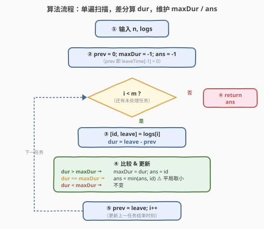

# 处理用时最长的那个任务的员工

- **题目名称**：处理用时最长的那个任务的员工
- **链接**：[2432. 处理用时最长的那个任务的员工](https://leetcode.cn/problems/the-employee-that-worked-on-the-longest-task/)
- **难度**：简单
- **标签**：数组、模拟、差分

## 1. 题目概述

共有 $n$ 位员工，id 从 $0$ 到 $n-1$。给定二维数组 `logs`，其中 `logs[i] = [idi, leaveTimei]`：

- `idi` 是处理第 $i$ 个任务的员工 id；
- `leaveTimei` 是员工**完成**第 $i$ 个任务的时刻，所有 `leaveTimei` **互不相同**。

第 $i$ 个任务在第 $i-1$ 个任务结束后**立即开始**，第 $0$ 个任务从时刻 $0$ 开始。返回**处理用时最长的那个任务**所属员工的 id；若并列，返回其中**最小**的 id。

**示例 1**：

```text
输入：n = 10, logs = [[0,3],[2,5],[0,9],[1,15]]
输出：1
解释：任务0 于 [0,3] 用时 3（员工0）；任务1 于 [3,5] 用时 2（员工2）；
      任务2 于 [5,9] 用时 4（员工0）；任务3 于 [9,15] 用时 6（员工1）。
      用时最长的为任务3 → 返回其员工 id=1。
```

**示例 2**：

```text
输入：n = 26, logs = [[1,1],[3,7],[2,12],[7,17]]
输出：3
解释：各任务用时 1、6、5、5；最长为任务1（用时6，员工3）→ 返回 3。
```

**示例 3**：

```text
输入：n = 2, logs = [[0,10],[1,20]]
输出：0
解释：两任务用时均为 10；员工 0 与 1 并列 → 返回最小 id 0。
```

**约束条件**：

- $2 \le n \le 500$
- $1 \le \text{logs.length} \le 500$
- `logs[i] == [idi, leaveTimei]`，$0 \le \text{idi} \le n-1$，$1 \le \text{leaveTimei} \le 500$
- $\text{idi} \ne \text{id}_{i+1}$（相邻任务员工不同）
- `leaveTimei` **严格递增**

> 💡 题目给出的是每个任务的**结束时刻** `leaveTime`，而非用时本身。用时需由「相邻结束时刻之差」还原——这正是**差分**思想。同时「最长任务」修饰的是**单个任务**，不是员工的累计工时，审题时务必区分。

---

## 2. 解题思路

### 2.1 易错思路：按员工聚合「总用时」

一种自然的误读是把题意理解成「**总**用时最长的员工」：先按 id 分组累加各员工的任务用时，再取累计最大者。这其实解的是另一道题，在本题会得到错误答案。

以示例 1 为反例：`logs = [[0,3],[2,5],[0,9],[1,15]]`

| 员工 id | 任务用时 | **总用时** |
|---------|----------|------------|
| 0 | 3 + 4 | **7** ← 聚合口径下最大 |
| 2 | 2 | 2 |
| 1 | 6 | 6 |

- 「单任务用时最长」口径：任务3（员工1，用时6）→ 答案 **1**（正确）；
- 「员工总用时最长」口径：员工0（总用时7）→ 答案 **0**（错误）。

两个口径给出不同答案，说明题意的修饰关系至关重要：**「用时最长」修饰单个任务，而非员工**。识别这一点后，就无需聚合，只看每个任务的峰值即可。

> ⚠️ 读题陷阱：`logs` 的元素是 `(员工, 结束时刻)` 而非 `(员工, 用时)`。先想清楚「我要找的是哪一个任务的用时最大、它是谁的」，再写代码。

### 2.2 核心观察：差分 + 单遍扫描 + 平局取最小 id

![核心观察：任务用时 = 相邻 leaveTime 的差分（leaveTime[-1]=0），只看单任务峰值](../images/2432_concept.svg)

三条观察合成 $O(m)$ 单遍解法（$m = \text{logs.length}$）：

**① 差分还原用时**。第 $i$ 个任务在第 $i-1$ 个任务结束后立即开始，故

$$
\text{dur}_i = \text{leaveTime}_i - \text{leaveTime}_{i-1},\qquad \text{leaveTime}_{-1} = 0.
$$

维护上一任务的结束时刻 $\textit{prev}$（初值 $0$），逐任务 $\textit{dur} = \textit{leave} - \textit{prev}$，再把 $\textit{prev}$ 更新为 $\textit{leave}$。由于 `leaveTime` 严格递增且 $\ge 1$，每个 $\textit{dur} > 0$。

**② 只看单任务峰值，不聚合**。维护当前最大用时 $\textit{maxDur}$ 与对应员工 $\textit{ans}$，逐任务比较更新，无需按员工累加。

**③ 平局取最小 id，必须显式取 min**。当 $\textit{dur} = \textit{maxDur}$ 时，要在并列员工中取最小 id。关键陷阱：**不能只用严格 `>` 刷新**——否则会保留「先出现的大 id」。反例 `logs = [[2,5],[0,10]]`：两任务用时均为 $5$，正确答案为 $\min(2,0)=0$；若只写 `if (dur > maxDur) { maxDur=dur; ans=id; }`，第一任务把 $\textit{ans}=2$ 锁定后，第二任务 $5>5$ 不成立，$\textit{ans}$ 不变，错误返回 $2$。

> 💡 正确更新逻辑：`dur > maxDur` 刷新；`dur == maxDur` 取 $\min(\textit{ans}, \textit{id})$；`dur < maxDur` 跳过。三态分明，缺一不可。这也呼应了「argmax + 平局取最小」模板：比较不仅看大小，还要在相等时按第二关键字（这里是最小 id）裁剪。

### 2.3 算法流程图



骨架四步：

1. **初始化**：$\textit{prev} = 0$（即 $\text{leaveTime}_{-1}$）、$\textit{maxDur} = -1$、$\textit{ans} = -1$；
2. **遍历** `logs[i] = [id, leave]`：
   - $\textit{dur} = \textit{leave} - \textit{prev}$（差分）；
   - 比较 & 更新：$>$ 刷新 $\textit{maxDur}$ 与 $\textit{ans}$，$=$ 取 $\min(\textit{ans}, \textit{id})$，$<$ 不变；
   - $\textit{prev} = \textit{leave}$（供下一任务差分）；
3. **返回** $\textit{ans}$。

> ⚠️ 由于 $m \ge 1$ 且每个 $\textit{dur} > 0 > -1$，第一任务必触发 `>` 分支，$\textit{ans}$ 必被赋值，故初值 $-1$ 不会泄漏到返回值。

### 2.4 示例演算


**示例 1** $n=10,\ \text{logs}=[[0,3],[2,5],[0,9],[1,15]]$：

| $i$ | id | leave | prev | dur | 比较结果 | ans(maxDur) |
|-----|----|-------|------|-----|----------|-------------|
| 0 | 0 | 3 | 0 | 3 | $3>-1$ → 更新 | 0 (3) |
| 1 | 2 | 5 | 3 | 2 | $2>3$ ✗ | 0 (3) |
| 2 | 0 | 9 | 5 | 4 | $4>3$ → 更新 | 0 (4) |
| 3 | 1 | 15 | 9 | 6 | $6>4$ → 更新（最长） | **1 (6)** |

返回 **1** ✓。

**示例 3（平局）** $n=2,\ \text{logs}=[[0,10],[1,20]]$：

| $i$ | id | leave | prev | dur | 比较结果 | ans(maxDur) |
|-----|----|-------|------|-----|----------|-------------|
| 0 | 0 | 10 | 0 | 10 | $10>-1$ → 更新 | 0 (10) |
| 1 | 1 | 20 | 10 | 10 | $10>10$ ✗；$10==10$ → $\min(0,1)=0$ | 0 (10) |

返回 **0** ✓。注意第二任务走的是 `==` 分支（取 min）而非 `>` 分支。

> 💡 对比示例 1 与示例 3：前者最大用时被最后任务刷新（`>` 分支定胜负），后者最大用时在第二任务处并列（`==` 分支定胜负）——两个示例恰好各覆盖一个分支，验证更新逻辑的完整性。

---

## 3. 参考代码

### C++

```cpp
class Solution {
public:
    int hardestWorker(int n, vector<vector<int>>& logs) {
        int prev = 0, maxDur = -1, ans = -1;
        for (auto& lg : logs) {
            int id = lg[0], leave = lg[1];
            int dur = leave - prev;
            if (dur > maxDur) {
                maxDur = dur;
                ans = id;
            } else if (dur == maxDur) {
                ans = min(ans, id);
            }
            prev = leave;
        }
        return ans;
    }
};
```

> 💡 形参 `n` 仅用于界定员工 id 范围，本题解法不依赖它（答案由 `logs` 唯一确定）。`min` 来自 `<algorithm>`。三态比较 `>` / `==` / `<` 用 `if-else if` 表达，`<` 情形隐式跳过。

### Python

```python
class Solution:
    def hardestWorker(self, n: int, logs: List[List[int]]) -> int:
        prev = 0
        max_dur = -1
        ans = -1
        for i, leave in logs:
            dur = leave - prev
            if dur > max_dur:
                max_dur = dur
                ans = i
            elif dur == max_dur:
                ans = min(ans, i)
            prev = leave
        return ans
```

> 💡 直接对 `logs` 做解包 `for i, leave in logs`，`i` 即员工 id。三态分支与 C++ 一一对应；若想更紧凑可写 `ans = i if dur > max_dur else min(ans, i) if dur == max_dur else ans`，但显式 `if/elif` 可读性更好。

---

## 4. 复杂度分析

| 维度 | 复杂度 | 说明 |
|------|--------|------|
| **时间复杂度** | $O(m)$ | 单遍扫描 `logs`，每条记录常数次比较与赋值，$m = \text{logs.length}$ |
| **空间复杂度** | $O(1)$ | 仅 `prev` / `maxDur` / `ans` 三个标量 |
| 对照：按员工聚合总用时 | $O(m)$ / $O(n)$ | 哈希表累加再求 max；同阶但解错题意，且多 $O(n)$ 空间 |
| 对照：每任务重扫开始时刻 | $O(m^2)$ | 若不维护 `prev`，对每个 $i$ 从头累加 `leaveTime` 算开始时刻，$m=500$ 仍可过但无谓 |

> 💡 本题规模 $m \le 500$，$O(m^2)$ 也能过，优化价值在「方法论」：识别 `leaveTime` 是累计量、用时是其差分，从而 $O(1)$ 还原每任务用时，避免重扫。当 $m$ 放大到 $10^6$ 时，$O(m^2)$ 不可行，而差分单遍仍轻松。

---

## 5. 扩展：差分与前缀和的互逆

`leaveTime` 本质是一串**累计结束时刻**——它像一个「前缀和」序列：把每个任务的用时 $\text{dur}_i$ 累加，就得到结束时刻 $\text{leaveTime}_i = \sum_{k \le i} \text{dur}_k$。反过来，从累计量还原每步增量就是**差分**（一阶差分）：

$$
\text{dur}_i = \text{leaveTime}_i - \text{leaveTime}_{i-1} \quad\Longleftrightarrow\quad \text{leaveTime}_i = \sum_{k=0}^{i} \text{dur}_k.
$$

前缀和与差分是一对互逆运算，常成对出现：

| 方向 | 已知 | 求 | 运算 | 典型场景 |
|------|------|----|------|----------|
| 前缀和 | 每步增量 $\text{dur}_i$ | 累计量 $\text{leaveTime}_i$ | $S_i = S_{i-1} + \text{dur}_i$ | 区间和 $O(1)$ 查询 |
| 差分 | 累计量 $\text{leaveTime}_i$ | 每步增量 $\text{dur}_i$ | $\text{dur}_i = \text{leaveTime}_i - \text{leaveTime}_{i-1}$ | 本题：还原任务用时 |

**差分数组（差分更常见的形态）**：当题目给出若干「区间加」操作 `[l, r]` 各加 $v$，而要还原最终每元素值时，常用差分数组 $d$：$d[l] += v,\ d[r+1] -= v$，最后对 $d$ 取前缀和即得结果。本题是它的退化版——区间就是「单个任务」`[i, i]`，长度恒为 1，故无需数组，一个标量 `prev` 滚动即可。

> 💡 更进一步：当区间加操作还伴随**时间维度**或需要查询「峰值」时，差分 + 一次扫描求 max 即为本题骨架的推广（见 [1854. 人口最多的年份](https://leetcode.cn/problems/maximum-population-year/)：按出生/死亡年份做差分，再前缀和找人口峰值年）。

---

## 6. 面试要点

1. **「用时最长」修饰的是任务还是员工？**

   > 修饰单个任务。题面是「处理用时最长的**那个任务**的员工」，即先找用时最大的任务，再返回它的员工 id。若误读为「总用时最长的员工」按 id 聚合，会在示例 1 得 0（应为 1）。审题时盯紧修饰关系，是本题最大的坑。

2. **为什么用时是 `leave - prev` 而非 `leave` 本身？**

   > `leaveTime` 是任务的**结束时刻**（累计量），不是用时。第 $i$ 任务在第 $i-1$ 任务结束后立即开始，故其用时 = 本任务结束时刻 − 上一任务结束时刻。第 0 任务开始于时刻 0，故 $\textit{prev}$ 初值为 0（即 $\text{leaveTime}_{-1}=0$）。这是把累计量做一阶差分还原每步增量。

3. **平局时为什么不能只用 `>` 刷新？**

   > 平局要求返回最小 id，而 `logs` 不保证按 id 升序出现。若只写 `if (dur > maxDur) { maxDur=dur; ans=id; }`，当较小 id 的并列任务**后出现**时不会刷新，会把先出现的大 id 错误保留。反例 `[[2,5],[0,10]]`：两任务用时均 5，应返回 0，只写 `>` 会返回 2。须补 `else if (dur == maxDur) ans = min(ans, id)`。

4. **初值 `maxDur = -1` 安全吗？会不会返回 -1？**

   > 安全。约束 $\text{logs.length} \ge 1$ 且每个 $\textit{dur} = \textit{leave}-\textit{prev} \ge 1 > -1$，故第一任务必触发 `>` 分支，$\textit{ans}$ 必被赋为某员工 id。`-1` 仅为占位，不会泄漏到返回值。等价地也可初值 `maxDur = 0`（因 $\textit{dur}\ge 1$）。

5. **参数 `n` 在解法中用到了吗？**

   > 没用。`n` 只界定员工 id 取值范围 $[0, n-1]$，用于校验输入合法性；答案完全由 `logs` 决定，与 `n` 无关。这也是为什么函数签名带 `n` 但实现可忽略——面试时可主动说明，体现对输入语义的理解。

> 💡 **一句话总结**：维护 `prev`，逐任务差分 `dur = leave - prev`；`>` 刷新最大、`==` 取 `min(ans, id)`、`<` 跳过，单遍 $O(m)$ / $O(1)$。

---

## 7. 同类练习题

- [1854. 人口最多的年份](https://leetcode.cn/problems/maximum-population-year/)（[题解](../1801-1900/1854_人口最多的年份.md)）：**差分 + argmax + 平局取最小** 的同骨架母题，按出生/死亡年做差分再前缀和找人口峰值年，对照「区间差分数组」与本题「单点差分标量」
- [2404. 出现最频繁的偶数元素](https://leetcode.cn/problems/most-frequent-even-element/)（[题解](../2401-2500/2404_出现最频繁的偶数元素.md)）：同为「argmax + 平局取最小 id」模板，频次统计取代差分，对照「计数型 argmax」与「差分型 argmax」
- [1094. 拼车](https://leetcode.cn/problems/car-pooling/)（[题解](../1001-1100/1094_拼车.md)）：差分数组从上下车站点还原每时刻车上人数，对照「区间差分」与本题「单点差分」，同为累计量↔增量互逆
- [1893. 检查是否区域内所有整数都被覆盖](https://leetcode.cn/problems/check-if-all-the-integers-in-a-range-are-covered/)（[题解](../1801-1900/1893_检查是否区域内所有整数都被覆盖.md)）：差分数组标记区间覆盖再前缀和判满，差分思想的直接练习，承接前缀和/差分互逆
