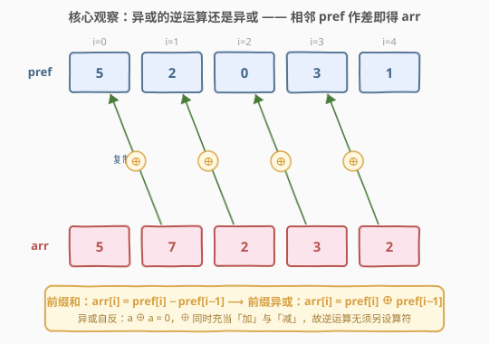
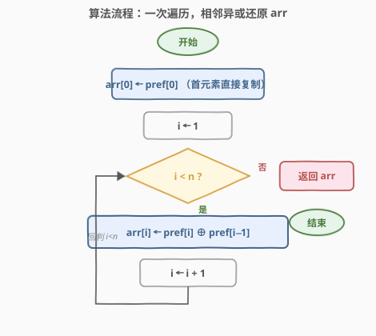

# LeetCode 找出前缀异或的原始数组 题解

## 1. 题目概述

- **标题 / 题号**：找出前缀异或的原始数组（#2433，medium）
- **链接**：https://leetcode.cn/problems/find-the-original-array-of-prefix-xor/
- **难度**：中等
- **标签**：位运算、异或性质、数组、前缀异或

**题意**：给定长度为 `n` 的**整数**数组 `pref`，找出长度为 `n` 的数组 `arr`，使得对每个下标 $i$：

$$
\text{pref}[i] = \text{arr}[0] \oplus \text{arr}[1] \oplus \cdots \oplus \text{arr}[i]
$$

即 `pref` 是 `arr` 的**前缀异或**数组（`^` 表示按位异或）。可以证明答案唯一。

**示例 1**：

```text
输入：pref = [5,2,0,3,1]
输出：[5,7,2,3,2]
解释：从 arr = [5,7,2,3,2] 可得
  pref[0] = 5
  pref[1] = 5 ^ 7 = 2
  pref[2] = 5 ^ 7 ^ 2 = 0
  pref[3] = 5 ^ 7 ^ 2 ^ 3 = 3
  pref[4] = 5 ^ 7 ^ 2 ^ 3 ^ 2 = 1
```

**示例 2**：

```text
输入：pref = [13]
输出：[13]
解释：pref[0] = arr[0] = 13
```

**约束**：

- $1 \le \text{pref.length} \le 10^5$
- $0 \le \text{pref}[i] \le 10^6$

> 💡 **题眼**：`pref` 是「前缀异或」而非「相邻异或」。区别在于 [1720](../1701-1800/1720_解码异或后的数组.md) 的 `encoded[i] = arr[i] ⊕ arr[i+1]` 给的是**相邻差分**，而本题给的是**累积前缀**。认清「前缀」二字，解法即由「差分还原」一锤定音。

## 2. 解题思路

### 2.1 暴力思路：逐位还原 + 维护累加器

最直观的还原方式是**边走边维护前缀累加器** `cur`：令 `cur` 始终等于 $\text{arr}[0] \oplus \cdots \oplus \text{arr}[i-1]$（即 $\text{pref}[i-1]$）。

- 首元素：$\text{arr}[0] = \text{pref}[0]$（前缀只有一项）。
- 对 $i \ge 1$：已知 $\text{cur} \oplus \text{arr}[i] = \text{pref}[i]$，两边同时异或 `cur` 得 $\text{arr}[i] = \text{cur} \oplus \text{pref}[i]$；随后更新 $\text{cur} \mathrel{\oplus}= \text{arr}[i]$（此时 `cur` 变为 $\text{pref}[i]$）。

```text
cur = 0
arr[0] = pref[0]; cur = pref[0]
i=1: arr[1] = cur ^ pref[1]; cur ^= arr[1]
i=2: arr[2] = cur ^ pref[2]; cur ^= arr[2]
...
```

这是 $O(n)$ 时间、$O(1)$ 额外空间的做法，已经正确。**但它把一个本可省掉的状态量显式扛在肩上**——能否不维护 `cur`，直接从 `pref` 读出 `arr`？

> 💡 转机：注意到每次更新后 `cur` 恒等于 $\text{pref}[i-1]$。既然 `cur` 完全由 `pref` 决定，那它根本不是一个独立状态，而是一个**可被相邻 `pref` 项直接替换**的冗余量。

### 2.2 核心观察：异或自反性 → 相邻 pref 作差即得 arr



由前缀定义，对 $i \ge 1$：

$$
\text{pref}[i] = \text{pref}[i-1] \oplus \text{arr}[i]
$$

两边同时异或 $\text{pref}[i-1]$。关键性质是**异或自反**（$a \oplus a = 0$，$a \oplus 0 = a$），即异或的逆运算就是它自己：

$$
\text{pref}[i] \oplus \text{pref}[i-1] = \text{pref}[i-1] \oplus \text{arr}[i] \oplus \text{pref}[i-1] = \text{arr}[i]
$$

> ⚠️ **决定性事实**：异或运算的「减法」与「加法」是同一个算符 $\oplus$。于是 2.1 节里那个被显式维护的 `cur`，正是 $\text{pref}[i-1]$ 本身——**直接取相邻两项异或即可，无须任何状态**。

这与**前缀和的差分还原**完全同构，只是把 $+/-$ 换成了 $\oplus$：

| 模型 | 前缀定义（正向） | 还原公式（逆向） |
|------|------------------|------------------|
| 前缀**和** | $\text{pref}[i] = \sum_{k=0}^{i} \text{arr}[k]$ | $\text{arr}[i] = \text{pref}[i] - \text{pref}[i-1]$ |
| 前缀**异或** | $\text{pref}[i] = \bigoplus_{k=0}^{i} \text{arr}[k]$ | $\text{arr}[i] = \text{pref}[i] \oplus \text{pref}[i-1]$ |

> 💡 **一句话**：`pref` 是前缀异或，做一次「相邻异或差分」就还原出 `arr`——与「前缀和做差分还原原数组」一比一对照，异或兼任了 $+$ 与 $-$。

### 2.3 算法流程图



一次遍历即可：

1. **首元素**：$\text{arr}[0] = \text{pref}[0]$（前缀只有一项，直接复制）。
2. **循环** $i = 1 \to n-1$：$\text{arr}[i] = \text{pref}[i] \oplus \text{pref}[i-1]$。
3. **返回** `arr`。

> 💡 不需要前缀异或的「单位元 0」作为哨兵（对比 [1310](../1301-1400/1310_子数组异或查询.md) 的 `prefix[0]=0`）。因为 `arr[0]` 直接由 `pref[0]` 给出，循环从 $i=1$ 起，`pref[i-1]` 始终在界内。

### 2.4 示例演算

![示例演算：pref = [5,2,0,3,1] → arr = [5,7,2,3,2]](../images/prefixxor_example_walkthrough.svg)

以 `pref = [5,2,0,3,1]` 为例：

- $i=0$：$\text{arr}[0] = \text{pref}[0] = 5$。
- $i=1$：$\text{arr}[1] = \text{pref}[1] \oplus \text{pref}[0] = 2 \oplus 5 = 7$。
- $i=2$：$\text{arr}[2] = \text{pref}[2] \oplus \text{pref}[1] = 0 \oplus 2 = 2$。
- $i=3$：$\text{arr}[3] = \text{pref}[3] \oplus \text{pref}[2] = 3 \oplus 0 = 3$。
- $i=4$：$\text{arr}[4] = \text{pref}[4] \oplus \text{pref}[3] = 1 \oplus 3 = 2$。

得 `arr = [5,7,2,3,2]`。**回代验证**：$5 \to 5\oplus7{=}2 \to 5\oplus7\oplus2{=}0 \to \cdots\oplus3{=}3 \to \cdots\oplus2{=}1 = \text{pref}[4]$ ✓，每个前缀异或都吻合。

## 3. 参考代码

### C++

```cpp
class Solution {
  public:
    vector<int> findArray(vector<int>& pref) {
        int n = pref.size();
        vector<int> arr(n);
        arr[0] = pref[0];
        for (int i = 1; i < n; ++i) {
            arr[i] = pref[i] ^ pref[i - 1];
        }
        return arr;
    }
};
```

### Python

```python
class Solution:
    def findArray(self, pref: List[int]) -> List[int]:
        arr = [pref[0]]
        for i in range(1, len(pref)):
            arr.append(pref[i] ^ pref[i - 1])
        return arr
```

### Python（原地原地差分，O(1) 额外空间）

```python
class Solution:
    def findArray(self, pref: List[int]) -> List[int]:
        for i in range(len(pref) - 1, 0, -1):
            pref[i] ^= pref[i - 1]
        return pref
```

> 💡 **倒序原地写法**：从右往左扫，`pref[i] ^= pref[i-1]` 即把 `pref[i]` 改写成 $\text{pref}[i] \oplus \text{pref}[i-1] = \text{arr}[i]$。倒序是为了**先消费 `pref[i]`、再使用 `pref[i-1]`**，避免正序覆写后丢失原 `pref[i-1]`。注意 `pref[0]` 不动（它本就等于 `arr[0]`）。若要求不修改输入，仍以前两版为准。

## 4. 复杂度分析

| 维度 | 复杂度 | 说明 |
|------|--------|------|
| **时间复杂度** | $O(n)$ | 单次遍历，每个位置一次异或 $O(1)$ |
| **空间复杂度** | $O(n)$ / $O(1)$ | 另开 `arr` 为 $O(n)$；倒序原地写法为 $O(1)$ 额外空间（不计返回值占用的输入复用） |

> ⚠️ 异或运算本身与数值大小无关——$\text{pref}[i] \le 10^6 < 2^{20}$，异或按整字操作，单次代价可视为 $O(1)$，不必按位拆分。

## 5. 扩展：前缀异或 vs 相邻异或——一个家族的两种编码

把「异或前缀」与「异或差分」并排，能看清整族题目的骨架：

- **前缀异或**（本题 2433）：$\text{pref}[i] = \bigoplus_{k=0}^{i} \text{arr}[k]$。还原：$\text{arr}[i] = \text{pref}[i] \oplus \text{pref}[i-1]$，**相邻差分**。首项 $\text{arr}[0] = \text{pref}[0]$ 直接给出。
- **相邻异或**（[1720](../1701-1800/1720_解码异或后的数组.md)）：$\text{encoded}[i] = \text{arr}[i] \oplus \text{arr}[i+1]$。还原需另给 $\text{arr}[0]$（首元素），再 $\text{arr}[i+1] = \text{arr}[i] \oplus \text{encoded}[i]$ **逐项前推**。
- **前缀异或求区间异或**（[1310](../1301-1400/1310_子数组异或查询.md)）：建 `prefix[i] = arr[0..i-1]` 之异或，则 $\text{XOR}(L,R) = \text{prefix}[R+1] \oplus \text{prefix}[L]$——异或版的「前缀和作差求区间和」。

> 💡 **统一视角**：三者都是「前缀 ↔ 差分」这对可逆变换在异或域的应用。$\oplus$ 兼任 $+$ 与 $-$，使得「前缀异或的差分」「相邻异或的前推」「区间异或的端点作差」共用同一条逆运算逻辑。**前缀和会有的，前缀异或都有**（差分还原、区间查询、单位元 0），只是把减号换成异或号。

## 6. 面试要点

1. **为什么 `arr[i] = pref[i] ^ pref[i-1]`？推导的关键一步？**

   - 由前缀定义 $\text{pref}[i] = \text{pref}[i-1] \oplus \text{arr}[i]$。
   - 两边同异或 $\text{pref}[i-1]$，利用 $a \oplus a = 0$、$a \oplus 0 = a$ 消去左侧 → $\text{arr}[i] = \text{pref}[i] \oplus \text{pref}[i-1]$。
   - 关键是认识到**异或的逆运算就是它本身**，故「前缀异或的差分」与「前缀和的差分」公式同构。

2. **首元素 `arr[0]` 怎么处理？为什么循环从 i=1 开始？**

   - $\text{pref}[0] = \text{arr}[0]$（前缀只有一项），故 $\text{arr}[0]$ 直接复制。
   - 公式 $\text{pref}[i] \oplus \text{pref}[i-1]$ 对 $i=0$ 无意义（无 `pref[-1]`），故循环从 $i=1$ 起，`pref[i-1]` 始终在界内，**不需要哨兵 0**。
   - 对比 [1310](../1301-1400/1310_子数组异或查询.md) 引入 `prefix[0]=0` 作为单位元以统一区间查询——不同场景的取舍。

3. **倒序原地写法为什么要从右往左？正序会怎样？**

   - 倒序 `pref[i] ^= pref[i-1]`：先读 `pref[i]` 原值、再读 `pref[i-1]` 原值，两者都未被改写，正确。
   - 正序 `pref[i] ^= pref[i-1]`：当算到 $i+1$ 时，`pref[i]` 已被覆写成 $\text{arr}[i]$ 而非原前缀，导致 $\text{pref}[i+1] \oplus \text{arr}[i]$ 出错。
   - 这是「差分还原」原地化的通用坑：**先消费下游、再使用上游**，方向取决于哪一侧还未被改写。

4. **本题（2433）与 [1720](../1701-1800/1720_解码异或后的数组.md) 有何区别？**

   - 编码对象不同：2433 编码**前缀** $\text{pref}[i]=\bigoplus_{k\le i}\text{arr}[k]$；1720 编码**相邻** $\text{encoded}[i]=\text{arr}[i]\oplus\text{arr}[i+1]$。
   - 还原方式不同：2433 做「相邻差分」（$\text{pref}[i]\oplus\text{pref}[i-1]$），首项自给；1720 做「逐项前推」（$\text{arr}[i+1]=\text{arr}[i]\oplus\text{encoded}[i]$），需题面另给首项 `first`。
   - 共同点：都依赖异或自反性，都是「异或差分/前缀」家族的可逆变换。

5. **为什么答案唯一？**

   - 每个 $\text{arr}[i]$ 由递推式 $\text{pref}[i] \oplus \text{pref}[i-1]$（或 $\text{pref}[0]$）**唯一**确定，无任何自由度。
   - 直觉上：前缀异或是从 `arr` 到 `pref` 的一一映射（已知 `arr` 必能算出唯一 `pref`；反之由差分公式必能算回唯一 `arr`），故给定 `pref` 的原像唯一。

> 💡 **一句话总结**：前缀异或的逆运算就是相邻异或差分——`arr[i] = pref[i] ^ pref[i-1]`，`arr[0] = pref[0]`，一次遍历 $O(n)$ 终。异或兼任加法与减法，是这条公式能成立的总根源。

## 同类练习题

| # | 题目 | 与本题的关联 |
|---|------|-------------|
| 1720 | [解码异或后的数组](https://leetcode.cn/problems/decode-xored-array/)（[题解](../1701-1800/1720_解码异或后的数组.md)） | 给的是**相邻**异或 `encoded[i]=arr[i]^arr[i+1]` 加首项 `first`，逐项前推还原；对照本题的「前缀异或」与「相邻差分」之别 |
| 1310 | [子数组异或查询](https://leetcode.cn/problems/xor-queries-of-a-subarray/)（[题解](../1301-1400/1310_子数组异或查询.md)） | 前缀异或的正向应用——用 `prefix[R+1]^prefix[L]` $O(1)$ 求区间异或，是「前缀和作差」的异或版 |
| 1734 | [解码异或后的排列](https://leetcode.cn/problems/decode-xored-permutation/)（[题解](../1701-1800/1734_解码异或后的排列.md)） | 1720 的排列升级版，奇数长相邻异或先消出全异或再还原，承接本题前缀/相邻异或家族 |
| 1442 | [形成两个异或相等数组的三元组数目](https://leetcode.cn/problems/count-triplets-that-can-form-two-arrays-of-equal-xor/)（[题解](../1401-1500/1442_形成两个异或相等数组的三元组数目.md)） | 前缀异或的等值计数——`prefix[L-1]==prefix[R]` 时区间可等分，前缀异或作哈希键 |
| 1486 | [数组异或操作](https://leetcode.cn/problems/xor-operation-in-an-array/)（[题解](../1401-1500/1486_数组异或操作.md)） | 异或序列的基础生成题，承接异或基本性质与奇偶规律，与本题同属异或系列入门 |
