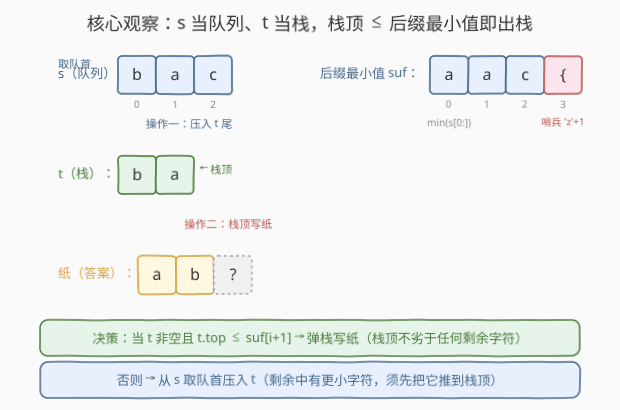
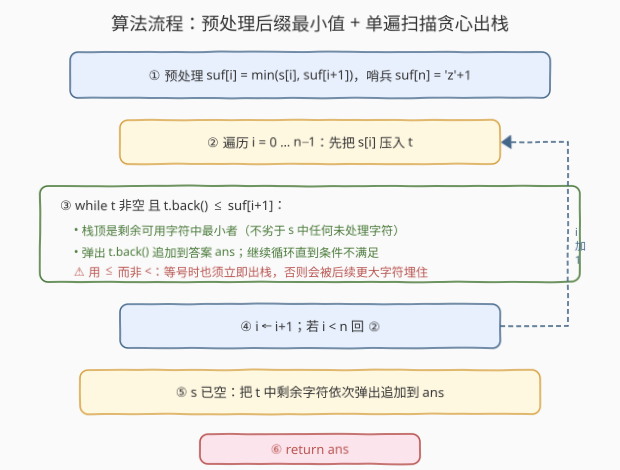
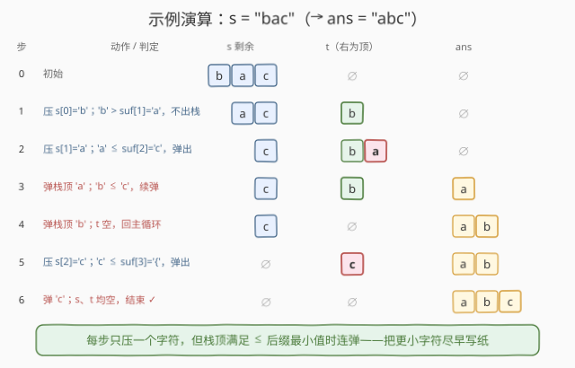

# 使用机器人打印字典序最小的字符串

- **题目名称**：使用机器人打印字典序最小的字符串
- **链接**：[2434. 使用机器人打印字典序最小的字符串](https://leetcode.cn/problems/using-a-robot-to-print-the-lexicographically-smallest-string/)
- **难度**：中等
- **标签**：栈、贪心、后缀最小值、字符串

## 1. 题目概述

给定字符串 `s` 和一个机器人，机器人维护一个初始为空的字符串 `t`。反复执行以下两种操作之一，直到 `s` 与 `t` **都为空**：

- **操作一**：删去 `s` 的**第一个**字符，机器人把它**追加到 `t` 的尾部**；
- **操作二**：删去 `t` 的**最后一个**字符，机器人把它**写到纸上**（记为答案串 `ans`）。

返回纸上能写出的**字典序最小**的字符串。

**示例 1**：

```text
输入：s = "zza"
输出："azz"
解释：操作一三次 → s="", t="zza"；操作二三次 → 纸上写 "azz"。
```

**示例 2**：

```text
输入：s = "bac"
输出："abc"
解释：操作一两次 → s="c", t="ba"；操作二两次写 "ab"；操作一 → t="c"；操作二写 "c"。纸 = "abc"。
```

**示例 3**：

```text
输入：s = "bdda"
输出："addb"
解释：操作一四次 → t="bdda"；操作二四次，从尾取 → 纸 = "addb"。
```

**约束条件**：

- $1 \le \text{s.length} \le 10^5$
- `s` 只包含小写英文字母

> 💡 关键观察：`s` 只能从**头部取**（队列），`t` 只能从**尾部取/放**（栈）。因此 `t` 就是一个**栈**，"操作一"= 入栈，"操作二"= 出栈。问题变成：用入栈/出栈把 `s` 重排成 `ans`，求字典序最小的 `ans`——经典的「栈 + 贪心 + 后缀最小值」模型。

---

## 2. 解题思路

### 2.1 暴力思路：搜索所有操作序列

每一步在「操作一（若 `s` 非空）/ 操作二（若 `t` 非空）」间二选一，DFS 所有长度为 $2n$ 的操作序列，取产生的 `ans` 中字典序最小者。

状态由（`s` 的剩余前缀指针 `i`，`t` 的内容）共同决定。问题在于 `t` 的内容可以是 `s` 已处理部分的任意**子序列保序入栈未出**形态，状态空间呈指数级，$n=10^5$ 下完全不可行。

> ⚠️ 瓶颈在于「不知道下一个该写哪个字符」。写早了可能挡住更小字符、写晚了又会被栈序约束。需要一个**贪心判据**：在每一步判断「现在出栈是否最优」，把搜索退化成单遍扫描。

### 2.2 核心观察：贪心出栈 + 后缀最小值



**第一步——认清结构**：`s` 是队列（取首），`t` 是栈（取尾/顶）。任一时刻能写到的下一个字符只有两种来源：

- **栈顶** `t.\text{back}()`（立即可写）；或
- **剩余 `s` 中的某个字符**，但必须先把它之前的字符全部入栈后，它才能到达栈顶被写。

**第二步——贪心判据**：设 $\text{suf}[i+1]$ 为 `s` 从位置 $i+1$ 起的**后缀最小字符**（即剩余 `s` 中能写出的最小字符下界）。比较栈顶与它：

- 若 `t.back() <= suf[i+1]`：栈顶**不劣于**剩余 `s` 中任何可写字符，现在出栈最优——任何「先入栈再写剩余」的方案，写出的首字符都 $\ge \text{suf}[i+1] \ge$ 栈顶，不会更优。
- 若 `t.back() > suf[i+1]`：剩余 `s` 中有更小字符，必须先把它（及它之前的字符）入栈推到栈顶，故此刻**只能入栈** `s[i]`。

> 💡 **为什么用 `<=` 而非 `<`**：等号时也必须**立即出栈**。反例 $s=$`aba`：
> - 用 `<`（等号时入栈）：先压 `a`，再压 `b`，再压 `a`，栈 `aba`（顶 `a`），最后连弹得 `aba`；
> - 用 `<=`（等号时出栈）：压 `a` 后 `a==suf[1]` 立即弹出写纸，再处理 `b`、`a`，得 `aab`。
>
> `"aab" < "aba"`，`<=` 更优。原因是等号时若贪入栈，栈顶那个等值字符会被后续更大的字符（如 `b`）**压在底下**，迫使其后写出更大的字符，反而变差。

**第三步——后缀最小值预处理**：$\text{suf}[i]$ 一遍反向递推即可，$\text{suf}[i] = \min(s[i],\, \text{suf}[i+1])$，哨兵 $\text{suf}[n] = $ `'z'+1`（保证 `s` 空时栈顶必出栈）。

### 2.3 算法流程图



骨架三步：

1. **预处理** $\text{suf}$：$\text{suf}[n] = $ `'z'+1`，$\text{suf}[i] = \min(s[i],\, \text{suf}[i+1])$；
2. **单遍扫描** $i = 0 \dots n{-}1$：
   - 把 $s[i]$ **入栈** `t`；
   - **当** `t` 非空且 `t.back() <= suf[i+1]`，**弹栈**追加到 `ans`；
3. **收尾**：`s` 已空，把 `t` 中剩余字符依次弹出追加到 `ans`，返回。

> ⚠️ **判据下标**：处理 $s[i]$ 时比较的是 $\text{suf}[i+1]$（剩余 `s` 从 $i+1$ 起），不是 $\text{suf}[i]$——因为 $s[i]$ 本身刚被入栈，已不在"剩余 `s`"中。

### 2.4 示例演算



以示例 2 `s = "bac"`，$n=3$。先算 $\text{suf} = [\text{a}, \text{a}, \text{c}, \text{'}\{\text{'}]$（`'{'`=`'z'+1`）。

| 步 | 动作 / 判定 | `s` 剩余 | `t`（右为顶） | `ans` |
|----|-------------|----------|----------------|-------|
| 0 | 初始 | `bac` | ∅ | ∅ |
| 1 | 压 `b`；`b` > `suf[1]`=`a`，不出栈 | `ac` | `b` | ∅ |
| 2 | 压 `a`；`a` ≤ `suf[2]`=`c`，弹出 | `c` | `ba`→弹 `a` | ∅ |
| 3 | 弹栈顶 `a`；`b` ≤ `c`，续弹 | `c` | `b` | `a` |
| 4 | 弹栈顶 `b`；`t` 空，回主循环 | `c` | ∅ | `ab` |
| 5 | 压 `c`；`c` ≤ `suf[3]`=`'{'`，弹出 | ∅ | `c` | `ab` |
| 6 | 弹 `c`；`s`、`t` 均空，结束 ✓ | ∅ | ∅ | `abc` |

> 💡 注意步 2 压入 `a` 后**连弹两次**（`a` 然后 `b`），因为弹出 `a` 后栈顶 `b` 仍 ≤ `suf[2]`=`c`。这正是「每步只压一个、但栈顶满足条件时连弹」的体现，确保更小字符尽早写纸。

---

## 3. 参考代码

### C++

```cpp
class Solution {
public:
    string robotWithString(string s) {
        int n = s.size();
        vector<char> suf(n + 1);
        suf[n] = 'z' + 1;                       // 哨兵：s 空时栈顶必出栈
        for (int i = n - 1; i >= 0; --i)
            suf[i] = min(s[i], suf[i + 1]);

        string t, ans;
        for (int i = 0; i < n; ++i) {
            t.push_back(s[i]);                  // 操作一：入栈
            while (!t.empty() && t.back() <= suf[i + 1]) {
                ans.push_back(t.back());        // 操作二：贪心出栈
                t.pop_back();
            }
        }
        while (!t.empty()) {                    // 收尾：剩余全弹出
            ans.push_back(t.back());
            t.pop_back();
        }
        return ans;
    }
};
```

> 💡 用 `string` 当栈（`push_back`/`pop_back`/`back`），避免引入额外容器；`suf` 用 `vector<char>` 即可。整体两次线性扫描。

### Python

```python
class Solution:
    def robotWithString(self, s: str) -> str:
        n = len(s)
        suf = [''] * (n + 1)
        suf[n] = chr(ord('z') + 1)             # 哨兵
        for i in range(n - 1, -1, -1):
            suf[i] = s[i] if s[i] < suf[i + 1] else suf[i + 1]

        t = []
        ans = []
        for i, ch in enumerate(s):
            t.append(ch)                        # 操作一：入栈
            while t and t[-1] <= suf[i + 1]:
                ans.append(t.pop())            # 操作二：贪心出栈
        while t:
            ans.append(t.pop())                 # 收尾：剩余全弹出
        return ''.join(ans)
```

> 💡 Python 下 `list` 当栈，`pop()` 取尾即栈顶。$n=10^5$ 时单遍 $O(n)$，毫秒级。哨兵 `chr(ord('z')+1)`=`'{'`，比任何小写字母都大，保证 `s` 扫完后 `t` 中字符全部出栈。

---

## 4. 复杂度分析

| 维度 | 复杂度 | 说明 |
|------|--------|------|
| **时间复杂度** | $O(n)$ | 预处理 `suf` 一遍 $O(n)$；主循环每个字符入栈一次、至多出栈一次，均摊 $O(n)$ |
| **空间复杂度** | $O(n)$ | `suf` 数组 $n+1$、栈 `t` 与答案 `ans` 各至多 $n$ |
| 对照：暴力搜索 | $O(2^n)$ 级 | `t` 内容是已处理子集的保序子序列形态，状态指数级，不可行 |

> 💡 「每个元素至多入栈、出栈各一次」是栈类贪心的均摊分析范式——与 [739. 每日温度](../0701-0800/739_每日温度.md)、[402. 移掉 K 位数字](../0401-0500/402_移掉K位数字.md) 的单调栈摊还 $O(n)$ 同源。

---

## 5. 扩展：贪心正确性与同类「栈 + 后缀最小值」模型

**贪心正确性（交换论证）**：设在某时刻栈顶为 $c = t.\text{back}()$，剩余 `s` 后缀最小值为 $m = \text{suf}[i+1]$。

- 若 $c \le m$：任何方案在下一步写出的字符要么是 $c$（若选操作二），要么是某个 $\ge m \ge c$ 的字符（若继续入栈再写）。选后者不会让串更小，反而可能把 $c$ 埋在更大字符之下。故**出栈 $c$ 是支配策略**（dominant）。
- 若 $c > m$：剩余中存在 $< c$ 的字符，写出它更优；但要写它必须先入栈其前缀，此刻**只能入栈**。

两类决策在每步都被唯一确定，无回溯余地，故贪心即最优。等号情形（$c=m$）由 2.2 的 `aba` 反例佐证必须出栈。

**与单调栈题的异同**：本题 `t` **并非单调栈**——我们不维护 `t` 单调，而是在「栈顶 ≤ 后缀最小值」时弹栈。但思想内核一致：**用「剩余序列的最值」作为弹栈判据，把字典序最优化问题降成单遍贪心**。对照：

| 题目 | 弹栈判据 | 目标 |
|------|----------|------|
| 2434（本题） | 栈顶 ≤ 后缀最小值 | 整串字典序最小 |
| 316/1081 去重字母 | 栈顶 > 当前 且 栈顶后续还有 | 去重后字典序最小 |
| 402 移掉 K 位 | 栈顶 > 当前 且 还能删 | 删 k 位后最小 |
| 321 拼接最大数 | 跨两数组贪心 + 归并 | 最大数 |

> 💡 它们共享「**栈 + 前瞻（后缀计数/最小值）+ 贪心弹栈**」三件套，区别只在弹栈判据与目标方向（最大/最小、去重/删位）。

---

## 6. 面试要点

1. **为什么 `t` 是栈、`s` 是队列？**

   > `s` 只能取首字符（操作一删 `s[0]`），故为队列；`t` 只能取尾字符（操作二删 `t` 末尾），追加也在尾部，故 `t` 是后进先出的栈。认清这点后问题归约为「栈重排求字典序最小」。

2. **贪心判据为什么是「栈顶 ≤ 后缀最小值」？**

   > 后缀最小值 `suf[i+1]` 是剩余 `s` 能写出的最小字符下界。栈顶 ≤ 它时，栈顶不劣于任何未来可写字符，立即出栈最优；栈顶 > 它时，剩余中有更小字符，须入栈把它推到栈顶，故只能入栈。

3. **为什么比较 `suf[i+1]` 而非 `suf[i]`？等号为何必须出栈？**

   > 处理 `s[i]` 时它刚被入栈、已不在剩余 `s` 中，剩余最小值是 `suf[i+1]`。等号时若入栈，栈顶等值字符会被后续更大字符压住，迫使其后写出更大字符（反例 `aba`→`aba` 劣于 `aab`），故等号也须出栈，用 `<=`。

4. **时间复杂度为何是 $O(n)$ 而非 $O(n^2)$？**

   > 主循环看似「for 套 while」，但每个字符至多入栈一次、出栈一次，内层 while 总弹出次数 ≤ $n$，均摊到每步 $O(1)$。预处理 `suf` 也是 $O(n)$，合计线性。

5. **`s` 空了之后为什么直接把 `t` 全弹出？**

   > `s` 空后无法再入栈，只剩操作二可用，必须把 `t` 全部弹出。哨兵 `suf[n]='z'+1` 使判据恒成立，循环自然弹空——故代码中收尾 while 也可并入主循环的判据（但显式写出更清晰）。

> 💡 **一句话总结**：`s` 当队列、`t` 当栈，预处理后缀最小值，主循环「压一个、栈顶 ≤ 后缀最小值就连弹」，剩余全弹出，即得字典序最小串，$O(n)$ 时间、$O(n)$ 空间。

---

## 7. 同类练习题

- [402. 移掉 K 位数字](https://leetcode.cn/problems/remove-k-digits/)（[题解](../0401-0500/402_移掉K位数字.md)）：**单调栈贪心母题**，弹栈判据「栈顶 > 当前且还能删」，对照「后缀最小值」与「可删次数」两种前瞻量
- [316. 去除重复字母](https://leetcode.cn/problems/remove-duplicate-letters/)：栈 + 后缀计数判据，去重并保字典序最小，与本题同属「栈 + 前瞻 + 贪心弹栈」家族
- [321. 拼接最大数](https://leetcode.cn/problems/create-maximum-number/)：跨两数组的栈贪心 + 归并，进阶版「在约束下取字典序最值」
- [739. 每日温度](https://leetcode.cn/problems/daily-temperatures/)（[题解](../0701-0800/739_每日温度.md)）：单调栈均摊 $O(n)$ 范式，对照「每个元素至多入栈出栈各一次」的摊还分析
- [1673. 找出最具竞争力的子序列](https://leetcode.cn/problems/find-the-most-competitive-subsequence/)：402 的等价变体（保长 k），同套栈贪心模板，巩固弹栈判据设计
