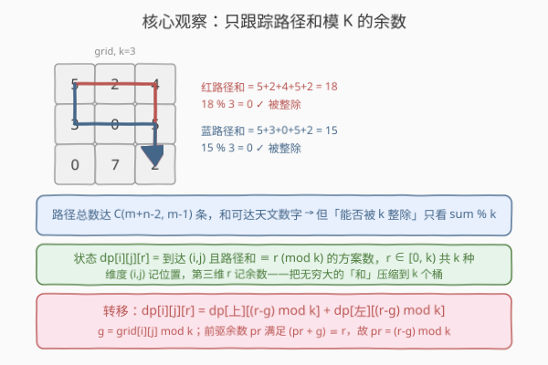
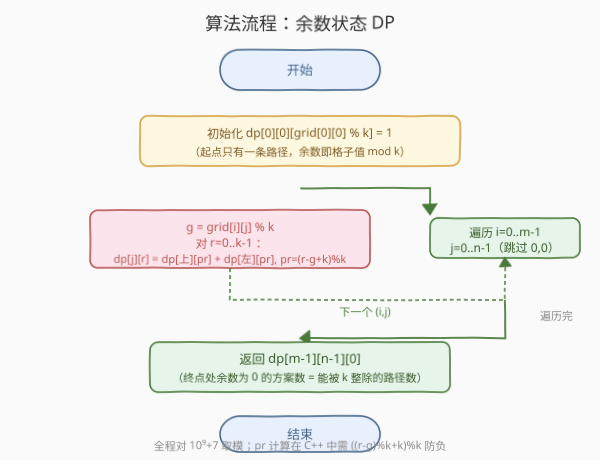

# 矩阵中和能被 K 整除的路径

- **题目名称**：矩阵中和能被 K 整除的路径
- **链接**：[2435. 矩阵中和能被 K 整除的路径](https://leetcode.cn/problems/paths-in-matrix-whose-sum-is-divisible-by-k/)
- **难度**：困难
- **标签**：数组、动态规划、矩阵

## 1. 题目概述

给定一个 `m × n` 的 0 下标整数矩阵 `grid` 和一个整数 `k`。你从 `(0, 0)` 出发，每步只能**向右**或**向下**移动，最终到达 `(m-1, n-1)`。

返回**路径上元素之和能被 `k` 整除**的路径数目。由于答案可能很大，返回其对 $10^9 + 7$ 取模的结果。

**示例 1**：

```text
输入：grid = [[5,2,4],[3,0,5],[0,7,2]], k = 3
输出：2
解释：两条满足条件的路径：
  红路径 (0,0)→(0,1)→(0,2)→(1,2)→(2,2)，和 = 5+2+4+5+2 = 18，18%3=0
  蓝路径 (0,0)→(1,0)→(1,1)→(1,2)→(2,2)，和 = 5+3+0+5+2 = 15，15%3=0
```

**示例 2**：

```text
输入：grid = [[0,0]], k = 5
输出：1
解释：唯一路径和 = 0+0 = 0，0%5=0。
```

**示例 3**：

```text
输入：grid = [[7,3,4,9],[2,3,6,2],[2,3,7,0]], k = 1
输出：10
解释：任何数都能被 1 整除，故所有路径都满足。路径总数 = C(3+4-2, 3-1) = C(5,2) = 10。
```

**约束条件**：

- `m == grid.length`
- `n == grid[i].length`
- $1 \le m, n \le 5 \times 10^4$
- $1 \le m \times n \le 5 \times 10^4$
- $0 \le \text{grid}[i][j] \le 100$
- $1 \le k \le 50$

> 💡 关键观察：路径总数达 $\binom{m+n-2}{m-1}$ 条（指数级乃至天文数字），逐条枚举不可行。但「能否被 $k$ 整除」**只取决于路径和模 $k$ 的余数**——余数只有 $k$ 种，把它作为 DP 的第三维状态，即可把无穷大的「和」压缩到 $k$ 个桶里。

---

## 2. 解题思路

### 2.1 暴力思路：枚举所有路径

从 $(0,0)$ 到 $(m-1,n-1)$ 共需 $(m-1)+(n-1)$ 步，其中 $m-1$ 步向下，路径总数为 $\binom{m+n-2}{m-1}$。当 $m=n=224$（满足 $m \cdot n \approx 5\times 10^4$）时，$\binom{446}{223}$ 是一个约 $10^{133}$ 的天文数字，逐条求和判整除完全不可行。

> ⚠️ 瓶颈在于「路径和」是一个随路径增长、且**无法压缩**的量。但题目只问「能否被 $k$ 整除」这一布尔结果，等价于「余数是否为 $0$」——余数是可压缩的：$(a + b) \bmod k = ((a \bmod k) + b) \bmod k$。于是我们不必记录完整和，只需记录其余数。

### 2.2 核心观察：余数状态 DP



**状态定义**：

$$
\textit{dp}[i][j][r] = \text{从 }(0,0)\text{ 到 }(i,j)\text{ 且路径和} \equiv r \pmod{k}\text{ 的路径数},\quad r \in [0, k)
$$

前两维 $(i,j)$ 记录位置，第三维 $r$ 记录余数——这是把「路径和」这一连续无穷的量，离散化为 $k$ 个余数桶。

**转移方程**：

设 $g = \text{grid}[i][j] \bmod k$。到达 $(i,j)$ 的路径倒数第二步要么从**上方** $(i-1,j)$、要么从**左方** $(i,j-1)$ 走来。若当前格子让余数变为 $r$，则前驱格子的余数 $pr$ 必须满足 $(pr + g) \equiv r \pmod{k}$，即：

$$
pr = (r - g) \bmod k
$$

于是：

$$
\textit{dp}[i][j][r] = \textit{dp}[i-1][j][pr] + \textit{dp}[i][j-1][pr]
$$

（只取存在的方向：$i=0$ 时无上方，$j=0$ 时无左方。）

**边界**：$\textit{dp}[0][0][\,\text{grid}[0][0] \bmod k\,] = 1$（起点唯一路径，余数即格子值对 $k$ 取模）。

**答案**：$\textit{dp}[m-1][n-1][0]$（终点处余数为 $0$ 的路径数，即能被 $k$ 整除者）。

> 💡 **为什么无后效性？** 当前格子的余数状态 $r$ 一旦确定，后续只关心「从本格出发、累积到 $r' = (r + \ldots) \bmod k$」，不再关心具体路径和。因为加法对模 $k$ 同余保持封闭——$(r + s) \bmod k$ 只依赖 $r$ 与后续格子值，与「怎样走到 $r$」无关。这正是同余 DP 可行的根本：**把无穷和压缩为有限余数桶，桶间转移封闭**。这与 [974. 和可被 K 整除的子数组](../0901-1000/974_和可被K整除的子数组.md)「前缀和同余定理」一脉相承——974 用「两前缀和同余 ⇒ 区间和被整除」，本题用「逐格累积余数 ⇒ 终点余数为 0」。

### 2.3 算法流程图



骨架三步：

1. **初始化**：$\textit{dp}[0][0][\text{grid}[0][0] \bmod k] = 1$；
2. **双层遍历** $i=0 \ldots m-1,\; j=0 \ldots n-1$（跳过 $(0,0)$）：
   - $g \leftarrow \text{grid}[i][j] \bmod k$；
   - 对每个 $r \in [0, k)$：$pr = (r - g) \bmod k$，累加上方 $\textit{dp}[i-1][j][pr]$ 与左方 $\textit{dp}[i][j-1][pr]$，对 $10^9+7$ 取模；
3. **返回** $\textit{dp}[m-1][n-1][0]$。

> ⚠️ **负数取模陷阱**：C++/Java 中 `(r - g) % k` 在 $r < g$ 时为负（如 `(0 - 2) % 3 = -2`）。需统一修正为 `((r - g) % k + k) % k`，保证余数落在 $[0, k)$。Python 的 `%` 本身返回非负值，直接 `(r - g) % k` 即可。

### 2.4 示例演算

![示例演算：每格的 dp 向量 [r0, r1, r2]](../images/pmdk_example_walkthrough.svg)

以示例 1 `grid = [[5,2,4],[3,0,5],[0,7,2]]`，$k=3$。逐行从左到右填表，每格记录 $\textit{dp}$ 向量 $[r_0, r_1, r_2]$：

| $(i,j)$ | 格值 | $g$ | $\textit{dp}=[r_0,r_1,r_2]$ | 说明 |
|---------|------|-----|-----------------------------|------|
| $(0,0)$ | 5 | 2 | $[0,0,1]$ | 起点，余数 $5\bmod3=2$ |
| $(0,1)$ | 2 | 2 | $[0,1,0]$ | 仅从左：$pr=(r-2)$，$r=1\leftarrow pr=2$ 取 $[0,0,1]$ 的 $1$ |
| $(0,2)$ | 4 | 1 | $[0,0,1]$ | 仅从左：$r=2\leftarrow pr=1$ 取 $[0,1,0]$ 的 $1$ |
| $(1,0)$ | 3 | 0 | $[0,0,1]$ | 仅从上：$g=0\Rightarrow pr=r$，照搬上方 $[0,0,1]$ |
| $(1,1)$ | 0 | 0 | $[0,1,1]$ | $g=0$：上 $[0,0,1]$ + 左 $[0,0,1]$ 逐位相加 |
| $(1,2)$ | 5 | 2 | $[1,2,0]$ | $g=2$：上 $[0,0,1]$ + 左 $[0,1,1]$，按 $pr=(r-2)$ 错位累加 |
| $(2,0)$ | 0 | 0 | $[0,0,1]$ | 仅从上，$g=0$ 照搬 |
| $(2,1)$ | 7 | 1 | $[2,0,1]$ | $g=1$：上 $[0,1,1]$ + 左 $[0,0,1]$，按 $pr=(r-1)$ 错位累加 |
| $(2,2)$ | 2 | 2 | $[2,1,3]$ | $g=2$：上 $[1,2,0]$ + 左 $[2,0,1]$，按 $pr=(r-2)$ 错位累加 |

终点 $(2,2)$ 处 $\textit{dp}[0]=2$，即答案 $2$ ✓。验证：三余数之和 $2+1+3=6=\binom{4}{2}$，恰为路径总数，无误。

> 💡 **错位累加的本质**：因 $g\ne 0$，当前格的余数 $r$ 对应前驱的余数 $pr=(r-g)\bmod k$，故累加时「当前第 $r$ 位」要取前驱的「第 $(r-g)$ 位」——这是向量循环错位求和，可视为对 $\textit{dp}$ 向量做一次以 $g$ 为步长的**循环移位后再相加**。

---

## 3. 参考代码

### C++

```cpp
class Solution {
public:
    int numberOfPaths(vector<vector<int>>& grid, int k) {
        const int MOD = 1e9 + 7;
        int m = grid.size(), n = grid[0].size();
        // dp[j][r]：当前行到达 (i,j)、路径和 mod k == r 的方案数
        // dp[j] 在处理本行时仍存"上一行第 j 列"（上方源），处理完即覆写为本行
        vector<vector<long long>> dp(n, vector<long long>(k, 0));
        for (int i = 0; i < m; ++i) {
            for (int j = 0; j < n; ++j) {
                int g = grid[i][j] % k;
                vector<long long> cur(k, 0);
                if (i == 0 && j == 0) {
                    cur[g] = 1;                                  // 起点
                } else {
                    for (int r = 0; r < k; ++r) {
                        int pr = ((r - g) % k + k) % k;          // 前驱余数，防负
                        long long s = 0;
                        if (i > 0) s = (s + dp[j][pr]) % MOD;    // 从上：dp[j] 仍是上一行
                        if (j > 0) s = (s + dp[j - 1][pr]) % MOD; // 从左：dp[j-1] 已是本行
                        cur[r] = s;
                    }
                }
                dp[j] = move(cur);                              // 覆写为本行
            }
        }
        return dp[n - 1][0];
    }
};
```

> 💡 **空间压缩原理**：$\textit{dp}[i][j]$ 只依赖 $\textit{dp}[i-1][j]$（上方）与 $\textit{dp}[i][j-1]$（左方）。逐行从左到右处理时，`dp[j]` 在被覆写前仍是上一行第 $j$ 列（上方源），而 `dp[j-1]` 在上一轮 $j-1$ 已被覆写为本行（左方源）——故一维数组 `dp[n][k]` 即可承载两源，无需 $O(m \cdot n \cdot k)$ 的三维表。$m \cdot n \le 5\times10^4$、$k \le 50$ 时三维表约 $2.5\times10^6$ `long long` 也能过，但一维更省、缓存更友好。

### Python

```python
class Solution:
    def numberOfPaths(self, grid: List[List[int]], k: int) -> int:
        MOD = 10**9 + 7
        m, n = len(grid), len(grid[0])
        # dp[j][r]：当前行到达 (i,j)、路径和 mod k == r 的方案数
        dp = [[0] * k for _ in range(n)]
        for i in range(m):
            for j in range(n):
                g = grid[i][j] % k
                cur = [0] * k
                if i == 0 and j == 0:
                    cur[g] = 1                               # 起点
                else:
                    for r in range(k):
                        pr = (r - g) % k                     # 前驱余数（Python % 恒非负）
                        s = 0
                        if i > 0:
                            s += dp[j][pr]                   # 从上
                        if j > 0:
                            s += dp[j - 1][pr]               # 从左
                        cur[r] = s % MOD
                dp[j] = cur
        return dp[n - 1][0]
```

> 💡 Python 的 `%` 对负数也返回非负结果（如 `(0 - 2) % 3 == 1`），故无需 `((r-g)%k+k)%k` 的 C++ 式修正。但累加后仍须 `% MOD` 防溢出（Python 大整数虽不溢出，但取模保证值域、加速后续运算）。

---

## 4. 复杂度分析

| 维度 | 复杂度 | 说明 |
|------|--------|------|
| **时间复杂度** | $O(m \cdot n \cdot k)$ | 每格枚举 $k$ 个余数；$m\cdot n \le 5\times10^4$、$k\le 50$，约 $2.5\times10^6$ 次运算，毫秒级 |
| **空间复杂度** | $O(n \cdot k)$ | 一维滚动 `dp[n][k]`；$n\le 5\times10^4$、$k\le 50$ 约 $2.5\times10^6$，可进一步压成单层 $k$ |
| 对照：暴力枚举路径 | $O(\binom{m+n-2}{m-1} \cdot (m{+}n))$ | 路径数天文数字，$m{=}n{=}224$ 时 $\binom{446}{223}\approx 10^{133}$，不可行 |
| 对照：三维 DP（不滚动） | $O(m \cdot n \cdot k)$ 时间 / $O(m \cdot n \cdot k)$ 空间 | 时间相同，空间多一个 $m$ 因子 |

> 💡 $k \le 50$ 是本题能开余数维的关键——若 $k$ 达 $10^9$，余数桶不可枚举，须改用哈希只存「出现过的余数」（但网格路径的余数会快速铺满 $[0,k)$，哈希难有渐近增益）。$m\cdot n \le 5\times10^4$ 的另一层含义是约束了「三维表总规模」不超过 $2.5\times10^6$，是刻意为 DP 留的甜区。

---

## 5. 扩展：滚动数组的进阶压缩与变体

**单层 $O(k)$ 滚动**：本题用 `dp[n][k]`（每列一组 $k$ 元向量）已足够。若 $n$ 也极大而 $m$ 较小，可进一步只保留「当前列的 $k$ 元向量」+「上一列」，把空间压到 $O(k)$：因为 $\textit{dp}[i][j]$ 只依赖 $\textit{dp}[i-1][j]$（上一行同列）与 $\textit{dp}[i][j-1]$（同行上一列），逐列推进时上一列的 $k$ 元向量即可充当左源。但本题 $n \cdot k$ 已很小，无此必要。

**$g = 0$ 的加速**：当某格 $\text{grid}[i][j] \bmod k = 0$（即格子值是 $k$ 的倍数），转移退化为 $pr = r$，$\textit{dp}[i][j]$ 就是上方与左方向量的**逐位相加**——无需错位。可在循环里特判跳过 $pr$ 的重算，常数优化。示例 1 的 $(1,1)$（值 $0$）、$(1,0),(2,0)$（值 $3,0$，$k=3$）即属此类。

**$k=1$ 的退化**：所有数模 $1$ 均为 $0$，$\textit{dp}$ 退化为单标量「路径数」，答案即 $\binom{m+n-2}{m-1} \bmod (10^9{+}7)$，对应示例 3。此时退化为 [62. 不同路径](../0001-0100/62_不同路径.md) 的经典计数 DP。

**与「乘积版」对比**：[1594. 矩阵的最大非负积](../1501-1600/1594_矩阵的最大非负积.md) 同为「网格路径 + 模运算」家族，但因乘积可能为负，须同时维护 (max, min) 二元组以应对负数翻号；本题是加法，同余对加法封闭，只须单维余数桶，更简洁。

---

## 6. 面试要点

1. **为什么用「余数」做第三维状态，而不是路径和本身？**

   > 路径和随路径长度增长，可达天文数字，无法作为状态索引。但「能否被 $k$ 整除」等价于「和 $\bmod k$ 是否为 $0$」，而 $(a+b)\bmod k = ((a\bmod k)+b)\bmod k$——加法对模 $k$ 同余封闭，故只须记录余数 $r \in [0,k)$，状态数从无穷压缩到 $k$。

2. **转移里 $pr = (r-g)\bmod k$ 怎么来的？为什么不是 $(r+g)$？**

   > 当前格贡献 $g$ 后余数变为 $r$，故**前驱**余数 $pr$ 满足 $(pr + g) \equiv r \pmod{k}$，解得 $pr \equiv (r - g) \pmod{k}$。方向是「从 $pr$ 加上 $g$ 得到 $r$」，故 $g$ 是**减**项。若误写成 $(r+g)$ 则把加号方向弄反，会得到错误的前驱。

3. **一维滚动数组为什么从左到右处理不会破坏「上方源」？**

   > 处理 $(i,j)$ 时，`dp[j]` 尚未被本行覆写，仍是上一行第 $j$ 列（上方源）；而 `dp[j-1]` 在上一轮 $j-1$ 已被覆写为本行（左方源）。先算好整组 $k$ 元 `cur` 再 `dp[j] = cur` 覆写，保证读 `dp[j][pr]`（上方）时取的是旧值、读 `dp[j-1][pr]`（左方）时取的是新值，各取所需。

4. **C++ 里 `(r - g) % k` 为何要修正？**

   > C++/Java 的 `%` 结果符号跟随被除数：$r < g$ 时 `(r-g) % k` 为负（如 `(0-2)%3 = -2`），会越界访问负下标。用 `((r-g)%k + k) % k` 把 $[-(k{-}1), k{-}1]$ 统一映回 $[0, k)$。Python 的 `%` 已非负，无需修正。

5. **若 $k$ 很大（如 $10^9$）还能这么做吗？**

   > 不能枚举 $k$ 个余数桶。但网格路径每走一步余数集合至多翻倍，实际「可达余数」远少于 $k$ 时，可改用哈希表只存出现过的余数。最坏情况下余数会铺满 $[0,k)$（因路径数指数增长），哈希无渐近增益——此时需借助数论结构（如 $k$ 为质数时的群结构）或转而用**生成函数/矩阵快速幂**在 $\mathbb{Z}_k$ 上做路径计数，属竞赛级进阶。

> 💡 **一句话总结**：网格路径计数 + 「和被 $k$ 整除」= 余数状态 DP。状态 $\textit{dp}[i][j][r]$ 记到 $(i,j)$ 且和 $\equiv r \pmod{k}$ 的路径数，转移按 $pr=(r-g)\bmod k$ 从上、左两源错位累加，终点取 $\textit{dp}[m{-}1][n{-}1][0]$。$O(mnk)$ 时间、$O(nk)$ 空间，一维滚动即足。

---

## 7. 同类练习题

- [974. 和可被 K 整除的子数组](https://leetcode.cn/problems/subarray-sums-divisible-by-k/)（[题解](../0901-1000/974_和可被K整除的子数组.md)）：**同余定理母题**，前缀和同余 ⇒ 区间和被整除；本题是它在「网格路径」上的推广——从一维前缀和的「两点同余」变为二维路径的「逐格累积余数」
- [62. 不同路径](https://leetcode.cn/problems/unique-paths/)（[题解](../0001-0100/62_不同路径.md)）：网格路径计数 DP 的最简形式（$k$ 不约束、只数路径），$k=1$ 时本题退化为它
- [64. 最小路径和](https://leetcode.cn/problems/minimum-path-sum/)（[题解](../0001-0100/64_最小路径和.md)）：网格路径「求和」DP 的最值版，对照「记标量最优」与本题「记余数分布」的状态设计差异
- [1594. 矩阵的最大非负积](https://leetcode.cn/problems/max-non-negative-product-in-a-matrix/)（[题解](../1501-1600/1594_矩阵的最大非负积.md)）：同为「网格路径 + 模运算」，但因乘积有负数须维护 (max, min) 二元组，对照加法只需单余数维的简洁
- [1301. 最大得分的路径数目](https://leetcode.cn/problems/number-of-paths-with-max-score/)（[题解](../1301-1400/1301_最大得分的路径数目.md)）：网格路径「同时求最值与计数」的典型，对照「先求最值再在同值上计数」与本题「直接对余数分布计数」的两种状态结构
