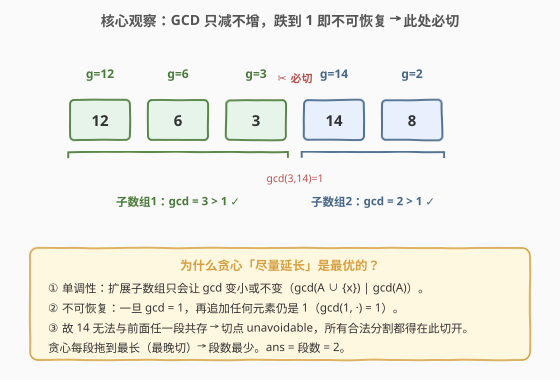
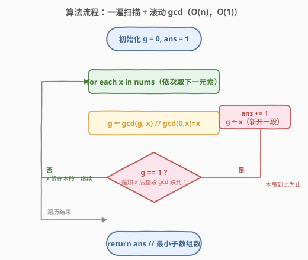

# LeetCode 使子数组最大公约数大于一的最小分割数 题解

## 1. 题目概述

- **标题 / 题号**：使子数组最大公约数大于一的最小分割数（#2436，medium）
- **链接**：https://leetcode.cn/problems/minimum-split-into-subarrays-with-gcd-greater-than-one/
- **难度**：中等
- **标签**：贪心、数论、欧几里得算法（GCD）、数组

**题意**：给定一个由正整数组成的数组 `nums`。将其拆分为**一个或多个**互不覆盖的连续子数组，使得：

- 数组中每个元素都**只属于一个**子数组；
- 每个子数组元素的**最大公约数**严格大于 `1`。

返回拆分后可获得的**子数组的最小数目**。

> 💡 子数组的最大公约数 = 能整除该子数组所有元素的最大正整数；子数组是数组的连续部分。

**示例 1**：

```text
输入：nums = [12,6,3,14,8]
输出：2
解释：拆成 [12,6,3] 与 [14,8]。
      [12,6,3] 的 gcd = 3 > 1；[14,8] 的 gcd = 2 > 1。
      若整段不拆，gcd(12,6,3,14,8) = 1，不合法。
```

**示例 2**：

```text
输入：nums = [4,12,6,14]
输出：1
解释：整个数组就是一段，gcd(4,12,6,14) = 2 > 1，合法。
```

**约束**：

- $1 \le \text{nums.length} \le 2000$
- $2 \le \text{nums}[i] \le 10^9$

> 💡 **题眼**：注意约束保证 $\text{nums}[i] \ge 2$，故**任何单元素子数组都合法**（gcd = 自身 $> 1$）。因此问题**恒有解**（最差拆成 $n$ 个单元素段），不存在 $-1$ 的情况；要最小化的是**段数**。

## 2. 解题思路

### 2.1 暴力思路：区间 DP（$O(n^2)$）

最直白的「最小分段」DP：令 $dp[i]$ 表示覆盖前缀 $\text{nums}[0..i-1]$ 所需的最少段数，$dp[0]=0$。则

$$
dp[i] = \min_{\substack{1 \le j \le i \\ \gcd(\text{nums}[j{-}1..i{-}1]) > 1}} \bigl(dp[j-1] + 1\bigr)
$$

（末段为 $\text{nums}[j{-}1..i{-}1]$，要求其 gcd $>1$。）由于单元素恒合法，$j=i$ 一定可行，故 $dp[i] \le dp[i{-}1]+1$，转移不落空。

实现时固定右端 $i$、$j$ 从 $i$ 向左扫并滚动维护 $\gcd(\text{nums}[j..i])$。因 gcd 随段变长**只减不增**，一旦跌到 $1$ 即可 `break`（再向左 gcd 只会更小，恒为 $1$）。最坏 $O(n^2)$，$n=2000$ 约 $4\times10^6$，可过但偏重。

> ⚠️ 瓶颈在于「枚举每个切点 $j$」。若能证明**只有少数切点是被迫的**，便可跳过枚举，一遍扫完。

### 2.2 核心观察：GCD 单调递减 + 切点 unavoidable → 一遍贪心



两条事实撑起贪心：

1. **单调性**：扩展子数组时 gcd **不增**——$\gcd(A \cup \{x\}) = \gcd(\gcd(A), x)$ 整除 $\gcd(A)$，故只会变小或不变。
2. **不可恢复**：一旦某段 gcd 跌到 $1$，再追加任何元素仍为 $1$（$\gcd(1,\cdot)=1$）。即「gcd $>1$」是**前缀单调**的合法性——一旦非法，靠继续延长**永远救不回来**。

**关键推论（切点不可避免）**：设贪心从上一切点 $L$ 起累计了 $g=\gcd(\text{nums}[L..x{-}1]>1$，而下一个 $x$ 使得 $\gcd(g,x)=1$。那么段 $[L..x]$ 的 gcd $=1$，**非法**；且据单调性，无论再往右扩多少，包含 $[L..x]$ 的任何段 gcd 仍为 $1$。因此 $x$ **绝不能与 $[L..x{-}1]$ 共段**——必须在 $x$ 之前切开。这个切点对**任何合法分割都不可避免**：凡覆盖到 $x$ 的段，若其左端 $\le L$，则必含 $[L..x]$ 这段 gcd $=1$ 的子段，非法。

> 💡 一句话：贪心「每段拖到最长、最晚切」恰好切在所有被迫的切点上。既然这些切点在**任意**合法解里都必须切，贪心切的次数就是**下界**；而贪心本身合法，故即最优。

于是算法极简：维护当前段滚动 gcd $g$，逐个吸收 $x$；一旦 $\gcd(g,x)=1$ 就在 $x$ 前切开、$x$ 开新段（$g \gets x$）、段数 $+1$；否则 $g \gets \gcd(g,x)$ 继续吸收。初始 $g=0$，利用 $\gcd(0,x)=x$ 让首元素自然入段。

### 2.3 算法流程图



骨架三步：

1. **初始化**：$g=0$（当前段滚动 gcd），$\textit{ans}=1$（至少一段）。
2. **扫描**：对每个 $x \in \text{nums}$：
   - $g \gets \gcd(g, x)$；
   - 若 $g = 1$：**切点**——$\textit{ans} \mathrel{+}= 1$，$g \gets x$（$x$ 开新段）；
   - 否则：$x$ 留在当前段，继续。
3. **返回** $\textit{ans}$。

> ⚠️ 判 $g=1$ 必须在「更新 $g$ 之后」：先算 $\gcd(g,x)$ 再判，等价于「吸收 $x$ 会不会让本段 gcd 崩到 1」。崩了就把 $x$ 踢给新段（$g$ 重置为 $x$ 本身，而 $x \ge 2$ 故新段合法）。

### 2.4 示例演算

![示例演算：nums=[12,6,3,14,8] 逐元素滚动 gcd；及示例 2 全程不切](../images/msgcd_example_walkthrough.svg)

**示例 1** `nums = [12,6,3,14,8]`，$g=0,\textit{ans}=1$：

| 步 | $x$ | $g$（前） | $\gcd(g,x)$ | 动作 | $\textit{ans}$ |
|----|-----|-----------|-------------|------|----------------|
| 1 | 12 | 0  | 12 | $g \ne 1$，留本段 | 1 |
| 2 | 6  | 12 | 6  | $g \ne 1$，留本段 | 1 |
| 3 | 3  | 6  | 3  | $g \ne 1$，留本段 | 1 |
| 4 | 14 | 3  | **1** | 切！$x$ 开新段，$g \gets 14$ | **2** |
| 5 | 8  | 14 | 2  | $g \ne 1$，留本段 | 2 |

结果：$[12,6,3]$ gcd $=3>1$、$[14,8]$ gcd $=2>1$，$\textit{ans}=2$ ✓。

**示例 2** `nums = [4,12,6,14]`：$g$ 演化 $4 \to 4 \to 2 \to 2$，全程 $>1$ 不触发切点，整段即一段，$\textit{ans}=1$ ✓。

> 💡 注意示例 1 的切点在 $14$：$\gcd(\underbrace{\gcd(12,6,3)}_{=3},\,14)=\gcd(3,14)=1$。这不是「相邻两数 gcd」是否为 1，而是「**累计 gcd** 与新元素」是否互素——$3$ 与 $5$ 也会触发切点，即便 $14$ 本身是偶数。判据是滚动 $g$，不是相邻对。

## 3. 参考代码

### C++

```cpp
class Solution {
public:
    int minimumSplits(vector<int>& nums) {
        int ans = 1, g = 0;
        for (int x : nums) {
            g = gcd(g, x);          // gcd(0, x) = x，首元素自然入段
            if (g == 1) {           // 吸收 x 会让本段 gcd 崩到 1 → 切点
                ++ans;
                g = x;             // x 开新段，x >= 2 故新段合法
            }
        }
        return ans;
    }
};
```

### Python

```python
class Solution:
    def minimumSplits(self, nums: List[int]) -> int:
        from math import gcd
        ans, g = 1, 0
        for x in nums:
            g = gcd(g, x)           # gcd(0, x) = x
            if g == 1:              # 切点：x 与前面累计 gcd 互素
                ans += 1
                g = x               # 新段从 x 重新累计
        return ans
```

> 💡 `math.gcd(0, x)` 在 Python 中返回 `abs(x)`，与 C++ `std::gcd(0, x)=x` 一致，故首元素不会误判为切点（首元素 $x\ge2$，$\gcd(0,x)=x\ne1$）。

## 4. 复杂度分析

| 维度 | 复杂度 | 说明 |
|------|--------|------|
| **时间复杂度** | $O(n \log m)$ | 一遍扫描，每次调用 $\gcd$ 为 $O(\log m)$，$m=\max\,\text{nums}[i]\le 10^9$；总 $n \cdot \log m$ |
| **空间复杂度** | $O(1)$ | 仅维护 $g$、$\textit{ans}$ 两个整型 |
| 对照：区间 DP | $O(n^2)$ | 枚举每个切点 $j$，$n=2000$ 约 $4\times 10^6$，可过但远重于贪心 |

> 💡 实测中 gcd 调用次数 $\le n$ 次；而 $\gcd$ 的位运算辗转相除在 $m\le 10^9$ 下至多约 $45$ 次迭代，整体在 $10^5$ 量级整数运算内，毫秒级。

## 5. 扩展：区间 DP 的 $O(n^2)$ 写法与「相邻约束」对照

若把贪心推广到**不满足单调合法性**的分段问题，就回退到区间 DP。本题的 DP 形式：

### C++（区间 DP 版）

```cpp
class Solution {
public:
    int minimumSplits(vector<int>& nums) {
        int n = nums.size();
        vector<int> dp(n + 1, INT_MAX);
        dp[0] = 0;
        for (int i = 1; i <= n; ++i) {
            int g = 0;
            for (int j = i; j >= 1; --j) {       // 末段 nums[j-1..i-1]
                g = gcd(g, nums[j - 1]);         // 滚动：段越长 gcd 越小
                if (g == 1) break;               // 单调：一旦为 1，再扩也 1
                dp[i] = min(dp[i], dp[j - 1] + 1);
            }
            dp[i] = min(dp[i], dp[i - 1] + 1);   // 单元素段恒合法
        }
        return dp[n];
    }
};
```

> ⚠️ 内层 `break` 正是利用单调性剪枝：$\gcd$ 一旦到 $1$ 就不可能再 $>1$，故枚举 $j$ 实际只扫到「上一个切点」附近，均摊远快于 $O(n^2)$——但**最坏**仍 $O(n^2)$（如全数组 gcd $>1$ 时内层扫满）。贪心则把这种「单调 + 不可恢复」结构压到 $O(n)$。

**贪心 vs DP 的分水岭**：分段问题的合法性是否「前缀单调」——

- 本题「段 gcd $>1$」单调且不可恢复 → 贪心最优；
- [435. 无重叠区间](../0401-0500/435_无重叠区间.md)/[132. 分割回文串 II](../0101-0200/132_分割回文串II.md) 等合法性**非前缀单调**（早切未必省、回文依赖两端），只能 DP / 排序贪心。

## 6. 面试要点

1. **为什么「整段不拆」在示例 1 不合法？**

   > $\gcd(12,6,3,14,8)$：$3$ 与 $14$ 互素（$3$ 的素因子只有 $3$，$14=2\times7$），故全段 gcd $=1$。gcd 是「所有元素共有的素因子」之积，任一元素不共享某因子即可把它清零。

2. **贪心「每段拖到最长」为何最优？给严格证明。**

   > 设贪心段终点为 $e_1<e_2<\cdots<e_m$，任一合法解段终点为 $p_1<p_2<\cdots<p_k$。归纳证 $e_i \ge p_i$：基例 $e_1 \ge p_1$（贪心第一段最长，任何合法首段不能超过首个「强制切点」$e_1$，否则含 gcd $=1$ 子段非法）；归纳 $e_i\ge p_i$ 时，$p_{i+1}$ 若 $>e_{i+1}$，则该段必含贪心第 $i{+}1$ 段的「崩到 1」子段 $[e_i{+}1..e_{i+1}{+}1]$，非法。故 $e_i\ge p_i$ 全程成立 $\Rightarrow m\le k$。贪心合法 $\Rightarrow m$ 即最优。

3. **判据是「相邻两数 gcd $=1$」还是「累计 gcd 与新元素 $=1$」？**

   > 后者。例：$[6,10,15]$ 中相邻 $\gcd(10,15)=5\ne1$，但累计 $\gcd(6,10,15)=\gcd(\gcd(6,10){=}2,\,15)=1$，仍要在 $15$ 前切。判据是滚动 $g=\gcd(\text{当前段})$ 与新 $x$ 是否互素。

4. **为何 $g$ 初值取 $0$？$\gcd(0,x)$ 是多少？**

   > 取 $0$ 是「哨兵」技巧：$\gcd(0,x)=x$（任何数整除 $0$，故 gcd 为另一数本身）。于是首元素 $x\ge2$ 经 $\gcd(0,x)=x\ne1$ 自然入段、不误判切点，免去特判首元素。C++ `std::gcd(0,x)=x`、Python `math.gcd(0,x)=abs(x)` 行为一致。

5. **若约束改为 $\text{nums}[i]\ge1$（允许 $1$），会怎样？**

   > $1$ 的存在使问题可能**无解**：含 $1$ 的段 gcd 必为 $1$，而单元素段 $[1]$ gcd $=1\not>1$ 也不合法，故 $1$ 无处安放 $\Rightarrow$ 返回 $-1$。本题约束 $\text{nums}[i]\ge2$ 恰好规避此情形，恒有解。若放宽，只需在贪心前先扫一遍：$\exists\,\text{nums}[i]=1$ 则返回 $-1$。

> 💡 **一句话总结**：gcd 随段变长只减不增且跌到 $1$ 不可恢复，故切点 unavoidable；用滚动 $g$ 一边吸收一边判 $\gcd(g,x)=1$，命中即切、$x$ 开新段，$O(n)$ 即得最少段数。

## 同类练习题

| # | 题目 | 与本题的关联 |
|---|------|-------------|
| 1979 | [找出数组的最大公约数](https://leetcode.cn/problems/find-greatest-common-divisor-of-array/)（[题解](../1901-2000/1979_找出数组的最大公约数.md)） | 求数组首尾两元素的 gcd，GCD 母题，承接本题对 $\gcd$ 性质与 $\gcd(0,x)=x$ 哨兵的理解 |
| 914 | [卡牌分组](https://leetcode.cn/problems/x-of-a-kind-in-a-deck-of-cards/)（[题解](../0901-1000/914_卡牌分组.md)） | 对各组频次求整体 gcd，判能否均分成 $k$ 张一组——把「gcd $>1$」用作「可均分」判据，与本题同源 |
| 2344 | [使数组可以被整除的最少删除次数](https://leetcode.cn/problems/minimum-deletions-to-make-array-divisible/)（[题解](../2301-2400/2344_使数组可以被整除的最少删除次数.md)） | 求一数组 gcd 再与另一数组比对删除，gcd 作为「整除性」枢纽，承接本题 gcd 累计 |
| 1071 | [字符串的最大公因子](https://leetcode.cn/problems/greatest-common-divisor-of-strings/)（[题解](../1001-1100/1071_字符串的最大公因子.md)） | 把整数 $\gcd$ 推广到字符串，理解「公因子」结构；对照本题「数组元素」与该题「字符串重复」的 gcd 应用差异 |
| 1250 | [检查好数组](https://leetcode.cn/problems/check-if-it-is-a-good-array/)（[题解](../1201-1300/1250_检查好数组.md)） | 判整个数组 gcd 是否为 $1$——本题切点判据 $\gcd(g,x)=1$ 的「全数组版」，理解 gcd $=1$（互素）的数论含义 |
