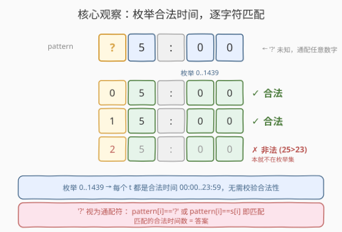
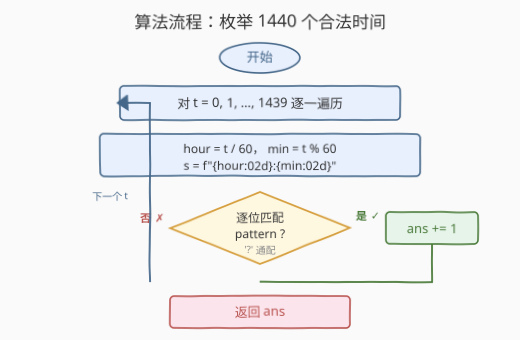
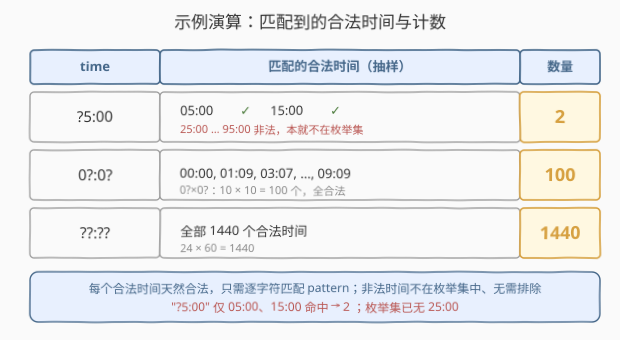

# LeetCode 有效时间的数目 题解

## 1. 题目概述

- **标题 / 题号**：有效时间的数目（#2437，easy）
- **链接**：https://leetcode.cn/problems/number-of-valid-clock-times/
- **难度**：简单
- **标签**：字符串、枚举、模拟

**题意**：给定长度为 5 的字符串 `time`，表示电子时钟当前时间，格式为 `"hh:mm"`，最早 `"00:00"`、最晚 `"23:59"`。其中被 `'?'` 替换的数位未知，可能取 $0 \sim 9$ 中任意一个。问把每个 `'?'` 都用 $0 \sim 9$ 的数字替换后，能得到多少个**合法时间**（即 $00 \le \text{hh} \le 23$ 且 $00 \le \text{mm} \le 59$）。

**示例 1**：

```text
输入：time = "?5:00"
输出：2
解释：? 可取 0 或 1，得到 "05:00" / "15:00"。取 2 得 "25:00" 非法（小时超 23），故只有 2 种。
```

**示例 2**：

```text
输入：time = "0?:0?"
输出：100
解释：两个 ? 各 0~9 任取，组合 10×10=100 种，且 "00:00"~"09:09" 全合法。
```

**示例 3**：

```text
输入：time = "??:??"
输出：1440
解释：小时 24 种 × 分钟 60 种 = 1440，即一天全部合法时间。
```

**约束**：

- `time` 是长度为 5 的合法格式串 `"hh:mm"`（第 3 个字符为 `':'`）。
- $00 \le \text{hh} \le 23$，$00 \le \text{mm} \le 59$。
- 数位字符中可能有 `'?'`，需用 $0 \sim 9$ 替换。

> 💡 关键观察：一天合法时间只有 $24 \times 60 = 1440$ 个。与其枚举 `'?'` 的填法（至多 $10^4$ 种，且多数填出来非法），不如**直接枚举这 1440 个天然合法的时间**，逐字符比对是否匹配 `pattern`——匹配上的合法时间数即为答案。

## 2. 解题思路

### 2.1 暴力思路：枚举 '?' 的填法

把 `time` 中每个 `'?'` 各填 $0 \sim 9$，至多 $10^4 = 10000$ 种填法。对每种填法得到的 5 字符串，先校验是否构成合法时间（$\text{hh} \le 23$ 且 $\text{mm} \le 59$），合法则计数。

时间 $O(10^4)$，虽是常数级，但做了大量"**填出非法时间再丢弃**"的废功——例如 `"?5:00"` 中 `?` 取 $2 \sim 9$ 这 8 种填法全部非法（小时 $25 \sim 95$ 均超 23），填完才发现要扔掉。

> ⚠️ 瓶颈在于：填法空间里**合法时间占比很低**（$1440 / 10^4 \approx 14\%$），绝大部分枚举是"先构造非法再过滤"。把枚举对象换成**答案空间本身**即可省去构造与校验。

### 2.2 核心观察：枚举合法时间，逐字符匹配



一天合法时间共 $00{:}00 \sim 23{:}59$ 这 $24 \times 60 = 1440$ 个，每个都天然合法、无需校验。用整数 $t \in [0, 1439]$ 编码：$t = \text{hour} \times 60 + \text{minute}$，则 $\text{hour} = t / 60$、$\text{minute} = t \bmod 60$，一一对应、无遗漏无重复。

对每个 $t$，格式化成 5 字符串 $s = $ `"{hour:02d}:{minute:02d}"`，逐位判断是否匹配 `pattern`：

$$
\text{match}(s) \iff \forall\, i \in [0,4]:\;\; \text{pattern}[i] = \text{'?'} \;\;\lor\;\; \text{pattern}[i] = s[i].
$$

匹配的 $s$ 数量即答案。复杂度 $O(1440 \times 5) = O(1)$。

> 💡 **模式匹配 ≠ 合法性**：`"?5:00"` 在模式上匹配 $05{:}00, 15{:}00, 25{:}00, \dots, 95{:}00$ 共 10 个字符串，但只有前两个小时 $\le 23$ 合法。枚举合法时间时，$25{:}00$ 等**本就不在枚举集里**，无需额外排除——这正是枚举答案空间的好处。

### 2.3 算法流程图



骨架三步：

1. **初始化** `ans = 0`；
2. **枚举** $t = 0, 1, \dots, 1439$：
   - 计算 $\text{hour} = t / 60$、$\text{minute} = t \bmod 60$；
   - 格式化为 $s = $ `"hh:mm"`；
   - 逐位比对：若某位 `pattern[i] != '?'` 且 `pattern[i] != s[i]`，则不匹配；
   - 全部通过则 `ans += 1`；
3. **返回** `ans`。

> ⚠️ **边界**：`time` 第 3 位固定为 `':'`，与 $s$ 的第 3 位（也是 `':'`）必然相等，比对自然通过；`'?'` 只可能出现在 4 个数位上。枚举范围 $[0, 1439]$ 闭区间，共 1440 次。

### 2.4 示例演算



| `time` | 匹配的合法时间（抽样） | 数量 |
|--------|------------------------|------|
| `?5:00` | `05:00`、`15:00`（`25:00`…`95:00` 非法，本就不在枚举集） | **2** |
| `0?:0?` | `00:00`、`01:09`、`03:07`、…、`09:09` | **100** |
| `??:??` | 全部 1440 个合法时间 | **1440** |

> 💡 `?5:00` 只有 2 个：合法时间中小时个位为 5 且分钟恰为 00 的，只有 `05:00`、`15:00` 两个（`25:00` 因 $25>23$ 不合法）。枚举合法时间时这 2 个被命中、其余 1438 个被逐位比对淘汰，干净利落。

## 3. 参考代码

### C++

```cpp
class Solution {
public:
    int countTime(string time) {
        int ans = 0;
        char buf[6];
        for (int t = 0; t < 1440; ++t) {
            snprintf(buf, sizeof(buf), "%02d:%02d", t / 60, t % 60);
            bool ok = true;
            for (int i = 0; i < 5; ++i) {
                if (time[i] != '?' && time[i] != buf[i]) { ok = false; break; }
            }
            if (ok) ++ans;
        }
        return ans;
    }
};
```

> 💡 固定循环 1440 次、每次至多 5 次字符比较，共 $\le 7200$ 次比较，常数级。`snprintf` 用 `%02d` 保证个位数前补 0，与 `"hh:mm"` 格式严格对齐。

### Python

```python
class Solution:
    def countTime(self, time: str) -> int:
        ans = 0
        for t in range(1440):
            hh, mm = divmod(t, 60)
            s = f"{hh:02d}:{mm:02d}"
            if all(p == '?' or p == c for p, c in zip(time, s)):
                ans += 1
        return ans
```

> 💡 `f"{hh:02d}:{mm:02d}"` 直接得到 5 字符串；`all(...)` 对 5 位逐字符做"通配或相等"判定，短路退出。`divmod(t, 60)` 一次同时拿到 hour/minute，等价于 `t // 60`、`t % 60`。

## 4. 复杂度分析

| 维度 | 复杂度 | 说明 |
|------|--------|------|
| **时间复杂度** | $O(1)$ | 固定枚举 $1440$ 个时间 × 5 字符比对，共 $\le 7200$ 次比较，与输入规模无关 |
| **空间复杂度** | $O(1)$ | 仅 5 字节格式化缓冲与计数器 |
| 对照：填法枚举 | $O(10^4)$ | 至多 $10000$ 种 `'?'` 填法 + 校验，且多数填法构造出非法时间再丢弃 |

> 💡 两者都是常数级，但枚举答案空间（1440）比枚举填法空间（10000）小约 7 倍，且**省去合法性校验**——枚举的每一个候选都已合法，只需做模式匹配。

## 5. 扩展：拆分小时/分钟独立计数（公式法）

合法时间中 **小时与分钟由冒号分隔、互不约束**，故答案可拆为两段独立相乘：

$$
\text{answer} = C_h(\text{time}[0],\text{time}[1]) \times C_m(\text{time}[3],\text{time}[4]),
$$

其中 $C_h$ 为小时段（$00 \sim 23$）匹配 pattern 的取值数，$C_m$ 为分钟段（$00 \sim 59$）匹配 pattern 的取值数。对每段枚举两位数字 $a, b \in [0, 9]$，匹配 pattern 且 $10a + b$ 落在合法区间即可计数，每段至多 $100$ 次枚举，整体仍 $O(1)$，但**无任何特判**：

```python
class Solution:
    def countTime(self, time: str) -> int:
        def count(lo, hi, p1, p2):
            cnt = 0
            for a in range(10):
                if p1 != '?' and p1 != chr(ord('0') + a):
                    continue
                for b in range(10):
                    if p2 != '?' and p2 != chr(ord('0') + b):
                        continue
                    if lo <= 10 * a + b <= hi:
                        cnt += 1
            return cnt
        return count(0, 23, time[0], time[1]) * count(0, 59, time[3], time[4])
```

```cpp
class Solution {
    int count(int lo, int hi, char p1, char p2) {
        int cnt = 0;
        for (int a = 0; a < 10; ++a) {
            if (p1 != '?' && p1 != '0' + a) continue;
            for (int b = 0; b < 10; ++b) {
                if (p2 != '?' && p2 != '0' + b) continue;
                int v = 10 * a + b;
                if (lo <= v && v <= hi) ++cnt;
            }
        }
        return cnt;
    }
public:
    int countTime(string time) {
        return count(0, 23, time[0], time[1]) * count(0, 59, time[3], time[4]);
    }
};
```

> ⚠️ 也可对 4 个位置逐一分类写出 $O(1)$ 闭式（如全 `'?'` 时 $C_h = 24$、$C_m = 60$；分钟段恒有 $m_1 \in [0,5], m_2 \in [0,9]$）。但小时上界 $23$ 跨越十位（$h_1 = 2$ 时 $h_2$ 只能 $0 \sim 3$，其余 $h_1$ 则 $h_2$ 全自由），分支多易写错；上述"段内枚举两位数字"版同样 $O(1)$ 且**无特判、显然正确**，是性价比最高的写法。

## 6. 面试要点

1. **为什么枚举合法时间而不是枚举 `'?'` 的填法？**

   > 填法至多 $10^4$ 种且多数非法（如 `?5:00` 取 $2 \sim 9$ 全部小时超 23），需先填再校验、构造大量废解；合法时间只有 $1440$ 个且天然合法，枚举它省去校验，答案即"匹配的合法时间数"。**枚举更小、更结构化的答案空间**是本题的核心思想。

2. **为什么 $t$ 取 $0 \sim 1439$？**

   > $00{:}00 \sim 23{:}59$ 共 $24 \times 60 = 1440$ 分钟。令 $t = \text{hour} \times 60 + \text{minute}$，则 $t \in [0, 1439]$ 与合法时间**一一对应**：$t / 60$ 为小时、$t \bmod 60$ 为分钟，无遗漏无重复，且每个 $t$ 必合法。

3. **`"?5:00"` 为什么是 2 而非 10？**

   > 模式匹配上 $05{:}00 \sim 95{:}00$ 共 10 个字符串，但只有 $05{:}00$、$15{:}00$ 小时 $\le 23$ 合法；$25{:}00 \sim 95{:}00$ 虽匹配模式却非法。这正说明"**模式匹配 ≠ 合法性**"——枚举合法时间时这些非法串本就不出现，无需单独排除。

4. **能否做到真正的 $O(1)$ 公式？**

   > 可以。hour 与 minute 独立，答案 $= C_h \times C_m$。对每段枚举两位数字（$\le 100$ 次）计数落在合法区间者即可，仍为常数；亦可逐位置写闭式，但小时上界 23 使 $h_1 = 2$ 需特判 $h_2 \in [0,3]$，分支多易错。段内枚举版兼顾 $O(1)$ 与显然正确性。

5. **若格式换成 12 小时制或带秒（`hh:mm:ss`）怎么办？**

   > 框架不变：枚举该制式下全部合法时间（12 小时制 $\le 12 \times 60 \times 60$，或 24 小时带秒 $86400$ 个），逐字符匹配 pattern 计数。候选仍是有限常数集，复杂度 $O(\text{候选数} \times 8)$，依旧 $O(1)$。

> 💡 **一句话总结**：枚举一天 $1440$ 个合法时间，`'?'` 当通配符逐字符匹配，命中数即答案，$O(1)$ 时间、$O(1)$ 空间，无需任何合法性校验。

## 同类练习题

| # | 题目 | 与本题的关联 |
|---|------|-------------|
| 401 | [二进制手表](https://leetcode.cn/problems/binary-watch/)（[题解](../0401-0500/401_二进制手表.md)） | **枚举合法时间家族**的招牌题，枚举 LED 亮灯组合再校验是否构成合法 `h:mm`，与本题"枚举答案空间"同源 |
| 299 | [猜数字游戏](https://leetcode.cn/problems/bulls-and-cows/)（[题解](../0201-0300/299_猜数字游戏.md)） | 逐位数字比对（位置匹配 vs 存在性），与本题逐字符匹配 pattern 同属"位置级字符判定" |
| 1295 | [统计位数为偶数的数字](https://leetcode.cn/problems/find-numbers-with-even-number-of-digits/)（[题解](../1201-1300/1295_统计位数为偶数的数字.md)） | 在范围内枚举数逐个判定，"枚举答案空间再筛"的最简范式 |
| 282 | [给表达式添加运算符](https://leetcode.cn/problems/expression-add-operators/)（[题解](../0201-0300/282_给表达式添加运算符.md)） | 在数字串上回溯枚举切分/运算符位置，是"枚举填法空间"的对照——与本题"枚举答案空间"互补，对比两种枚举思路的取舍 |
