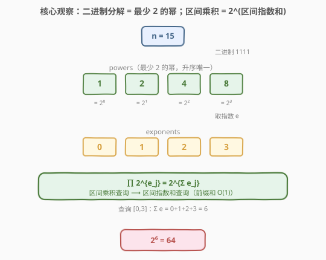
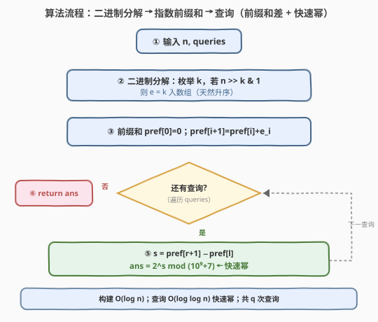
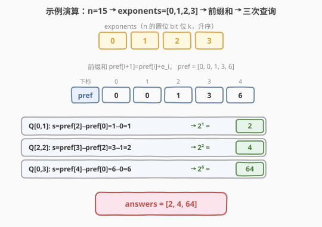

# 二的幂数组中查询范围内的乘积

- **题目名称**：二的幂数组中查询范围内的乘积
- **链接**：[2438. 二的幂数组中查询范围内的乘积](https://leetcode.cn/problems/range-product-queries-of-powers/)
- **难度**：中等
- **标签**：位运算、数组、前缀和、数学、快速幂

## 1. 题目概述

给你一个正整数 `n`，需要找到一个下标从 **0** 开始的数组 `powers`，它包含**最少**数目的 `2` 的幂，且它们的和为 `n`。`powers` 数组是**非递减**顺序的，且构造方法是唯一的。

再给你一个二维整数数组 `queries`，其中 `queries[i] = [left_i, right_i]`，表示求 `powers[left_i..right_i]` 中所有元素的**乘积**。返回数组 `answers`，每个答案对 $10^9 + 7$ 取余。

**示例 1**：

```text
输入：n = 15, queries = [[0,1],[2,2],[0,3]]
输出：[2,4,64]
解释：n = 15 → powers = [1,2,4,8]。
  [0,1]: 1*2 = 2
  [2,2]: 4
  [0,3]: 1*2*4*8 = 64
```

**示例 2**：

```text
输入：n = 2, queries = [[0,0]]
输出：[2]
解释：n = 2 → powers = [2]。答案为 powers[0] = 2。
```

**约束条件**：

- $1 \le n \le 10^9$
- $1 \le \text{queries.length} \le 10^5$
- $0 \le \text{left}_i \le \text{right}_i < \text{powers.length}$

> 💡 题眼有二：①「最少 2 的幂」「唯一构造」直接指向 **$n$ 的二进制表示**——每个置位 bit $k$ 贡献一个 $2^k$，这就是唯一的最少表示；②所有 `powers` 元素都是 $2$ 的幂，于是「区间乘积」可折叠为「区间指数和」$\prod 2^{e_j} = 2^{\sum e_j}$，把乘法查询降为前缀和差。

---

## 2. 解题思路

### 2.1 暴力思路：构造后逐项相乘

最直白：先把 `powers` 构造出来，再对每个查询 `[l, r]` 把 `powers[l..r]` 逐项相乘取余。

构造 `powers` 有两种等价写法：①取 $n$ 二进制的每个置位 bit $k$，按 $k$ 升序收集 $2^k$；②贪心——每次取 $\le$ 剩余值的最大 $2$ 的幂（即最高有效位），反复相减。两者都得到唯一的最少幂数组。

由于 $n \le 10^9 < 2^{30}$，`powers` 长度至多 $30$（即 popcount 上界）。逐项相乘每个查询至多 $30$ 次乘法，共 $q \le 10^5$ 个查询，总操作 $\approx 3 \times 10^6$，**完全能 AC**。

> ⚠️ 暴力虽够用，却浪费了「所有因子都是 $2$ 的幂」这层结构：把 $q$ 个查询的乘法各算各，没共享任何预处理。下文的核心观察正是把这层结构榨干——把「区间乘积」整体化为「区间指数和」，预处理一次前缀和后每查询 $O(1)$（加一次快速幂）。

### 2.2 核心观察：二进制分解 + 乘积转指数和



**观察一：最少 2 的幂 = 二进制表示（唯一）。** 任何「$2$ 的幂之和」表示里，若有两个相同的 $2^k$，可合并为 $2^{k+1}$（项数 $-1$）。反复合并直到没有相同幂，得到「各幂至多出现一次」的形式——这正是 $n$ 的二进制展开，项数 $=$ popcount$(n)$，且唯一。所以 `powers` 就是 $n$ 的二进制中每个置位 bit $k$ 对应的 $2^k$，按 $k$ 升序排列即满足非递减。

**观察二：区间乘积 = 2^(区间指数和)。** 设 `powers[j] = 2^{e_j}`，其中 $e_j$ 是该元素的指数（即对应 bit 位 $k$）。则

$$
\prod_{j=l}^{r} \text{powers}[j] = \prod_{j=l}^{r} 2^{e_j} = 2^{\,\sum_{j=l}^{r} e_j}
$$

于是「区间乘积查询」折叠为「区间指数和查询」：对指数数组 $e$ 预处理前缀和 `pref`，区间指数和 $= \text{pref}[r+1] - \text{pref}[l]$，再做一次 $2^{\text{sum}} \bmod p$ 即可。

> 💡 **这是「同底数幂相乘 → 指数相加」的小学律在算法里的应用**：底数恒为 $2$，把乘法（易溢出、需取余）降为加法（前缀和 $O(1)$ 差）。乘积可能天文数字，但指数和 $\le \sum_{k=0}^{29} k = 435$（$n < 2^{30}$ 时最坏），轻松放进整数。这正是该化简安全且高效的根因。

### 2.3 算法流程图



三阶段：

1. **二进制分解**：枚举 bit 位 $k = 0, 1, \dots$，若 $n \gg k \,\&\, 1$ 为真（第 $k$ 位是置位），把 $e = k$ 追加进指数数组。因 $k$ 递增，天然升序。
2. **前缀和**：`pref[0] = 0`，`pref[i+1] = pref[i] + e[i]`。
3. **查询**：对每个 `[l, r]`，`sum = pref[r+1] - pref[l]`，`ans = 2^sum mod p`（快速幂）。

### 2.4 示例演算



以 $n = 15$（二进制 $1111_2$）走一遍：

- **分解**：置位 bit 为 $k \in \{0,1,2,3\}$ → `exponents = [0,1,2,3]`，`powers = [2⁰,2¹,2²,2³] = [1,2,4,8]`。
- **前缀和**：`pref = [0, 0, 1, 3, 6]`（`pref[1]=0+0=0`，`pref[2]=0+1=1`，`pref[3]=1+2=3`，`pref[4]=3+3=6`）。

| 查询 `[l,r]` | `sum = pref[r+1] − pref[l]` | `2^sum` | 答案 |
|--------------|------------------------------|---------|------|
| `[0,1]` | `pref[2] − pref[0] = 1 − 0 = 1` | $2^1$ | 2 |
| `[2,2]` | `pref[3] − pref[2] = 3 − 1 = 2` | $2^2$ | 4 |
| `[0,3]` | `pref[4] − pref[0] = 6 − 0 = 6` | $2^6$ | 64 |

返回 `[2, 4, 64]` ✓

> 💡 注意 `pref[1] = 0` 这一行：$e_0 = 0$（因为 $2^0 = 1$），指数为 $0$ 不影响乘积（$2^0 = 1$）。前缀和能正确处理指数 $0$，无需特判。

---

## 3. 参考代码

### C++

```cpp
class Solution {
    static constexpr long long MOD = 1000000007;
public:
    vector<int> productQueries(int n, vector<vector<int>>& queries) {
        // 1. 二进制分解：提取每个置位 bit 的指数 k（升序）
        vector<long long> pref{0};          // 指数前缀和，pref[0]=0
        for (int k = 0; k < 31; ++k) {
            if (n >> k & 1) {
                pref.push_back(pref.back() + k);
            }
        }
        // 2. 每个查询：区间指数和 -> 2^sum mod MOD（快速幂）
        vector<int> ans;
        ans.reserve(queries.size());
        for (auto& q : queries) {
            long long sum = pref[q[1] + 1] - pref[q[0]];
            ans.push_back((int)powmod(2, sum));
        }
        return ans;
    }
private:
    long long powmod(long long base, long long e) {
        long long r = 1 % MOD;
        base %= MOD;
        while (e > 0) {
            if (e & 1) r = r * base % MOD;
            base = base * base % MOD;
            e >>= 1;
        }
        return r;
    }
};
```

> 💡 `n ≤ 10^9 < 2^30`，故 `k` 枚举到 `31` 已覆盖所有可能的置位 bit。`pref` 用 `long long` 存放（指数和上界 $\approx 435$，虽 `int` 也够，但留余量防疏忽）。快速幂里 `r = 1 % MOD` 保证 $e = 0$ 时返回 $1$（应对指数 $0$ 的查询）。

### Python

```python
class Solution:
    def productQueries(self, n: int, queries: List[List[int]]) -> List[int]:
        MOD = 10 ** 9 + 7
        # 1. 二进制分解：置位 bit k -> 指数 k（升序）
        pref = [0]
        k = 0
        m = n
        while m:
            if m & 1:
                pref.append(pref[-1] + k)
            m >>= 1
            k += 1
        # 2. 区间指数和 -> pow(2, sum, MOD)
        ans = []
        for l, r in queries:
            s = pref[r + 1] - pref[l]
            ans.append(pow(2, s, MOD))
        return ans
```

> 💡 Python 内置 `pow(base, exp, mod)` 即三参数快速幂，C 实现、极快，直接省去手写。`while m` 逐位移位：每轮看最低位是否置位，置位则记 $k$，再 `m >>= 1; k += 1`，自然按 $k$ 升序收集。

---

## 4. 复杂度分析

| 维度 | 复杂度 | 说明 |
|------|--------|------|
| **时间复杂度** | $O(\log n + q \log(\log n))$ | 二进制分解 $O(\log n)$（$\le 30$ 位）；每查询前缀和差 $O(1)$ + 快速幂 $O(\log \text{sum})$，$\text{sum} \le 435$ 故幂次 $\le 9$ |
| **空间复杂度** | $O(\log n)$ | 前缀和数组长度 $=$ popcount$(n) + 1 \le 31$ |
| 对照：逐项相乘 | $O(\log n + q \cdot \text{len})$ | 每查询循环乘 $\le 30$ 次，$q = 10^5$ 时 $\approx 3 \times 10^6$，亦能 AC |
| 对照：朴素前缀积 | $O(\log n + q)$ | 直接存「前缀积 mod p」差除——但模意义下除法需逆元，不如指数和干净 |

> 💡 本题 $q$ 与 $\text{len}$ 都不大，三做法皆过。优化价值在「方法论」：识别「同底数幂乘积 → 指数和」能把 $O(\text{len})$ 的逐项乘压成 $O(1)$ 前缀和差，当 `powers` 变长或 $q$ 变大时差距才显现。

---

## 5. 扩展：最少 2 的幂表示的唯一性

为什么二进制展开是「最少 2 的幂之和」且唯一？给出两条等价论证：

**论证一（合并视角）**：任意表示中若出现两个相同 $2^k$，合并为 $2^{k+1}$ 使项数 $-1$ 且和不变。反复合并直到无相同幂——此时必为二进制展开（每位至多一次）。合并严格不增项数，故最终态项数最少；而合并结果由和唯一决定（二进制表示唯一），故最少表示唯一。

**论证二（贪心视角）**：每次取 $\le$ 剩余值的最大 $2$ 的幂（最高有效位 $2^{\lfloor \log_2 r \rfloor}$）能保证项数最少。理由：跳过它，剩余位全填满也凑不到它（$\sum_{i=0}^{k-1} 2^i = 2^k - 1 < 2^k$），所以最高位必须取。归纳即得贪心最优，且每步唯一 → 全程唯一，结果即二进制展开。

> 💡 这也是为何题目敢说「构造方法唯一」——「最少 2 的幂之和」的最优解被二进制表示钉死，不存在第二种。若把条件放宽为「2 的幂之和（不限最少）」，则表示不唯一（如 $4 = 4 = 2+2 = 2+1+1 = \dots$）；「最少」这根弦正是唯一性的来源。

---

## 6. 面试要点

1. **为什么 `powers` 恰是 $n$ 的二进制展开？**

   > 「最少 2 的幂」要求任意两个相同幂必须合并（$2^k+2^k=2^{k+1}$，项数减一），合并到底得到每位至多一次的形式即二进制展开。它项数 $=$ popcount$(n)$ 最少，且由 $n$ 唯一决定。

2. **如何把「区间乘积」化为 $O(1)$ 查询？**

   > 所有 `powers[j] = 2^{e_j}`，故 $\prod 2^{e_j} = 2^{\sum e_j}$。对指数数组建前缀和，区间指数和 $= \text{pref}[r+1]-\text{pref}[l]$ 为 $O(1)$，再 $O(\log \text{sum})$ 快速幂。乘法降为加法是关键。

3. **指数和最大多大？会溢出吗？**

   > $n < 2^{30}$，置位 bit 至多 $30$ 个，指数和 $\le 0+1+\cdots+29 = 435$，`int` / `long long` 都轻松容纳。乘积本身虽巨大，但只通过「指数和 + 快速幂」间接计算，全程不存大数。

4. **为什么用快速幂而不是预计算 $2$ 的幂表？**

   > 两种皆可。预计算 $2^0 \bmod p$ 到 $2^{435} \bmod p$ 共 $436$ 项 $O(\log n)$，查询 $O(1)$ 查表，更快但上限要算准。快速幂通用、无需预算上界，$O(\log \text{sum}) \le 9$ 步也极快。本题两者皆过，快速幂更省心、更可迁移。

5. **暴力的逐项相乘能否通过？为什么还要优化？**

   > $q \le 10^5$、`powers` 长 $\le 30$，逐项乘 $\approx 3 \times 10^6$ 次能 AC。优化非为过题，而在展示「同底数幂乘积 → 指数和」的降维思路：把乘法序列预处理成加法前缀和，是处理「区间积」类问题的通用范式（如乘积模质数、几何均值等）。

> 💡 **一句话总结**：`powers` 是 $n$ 的二进制展开（最少且唯一）；区间乘积 $= 2^{区间指数和}$，前缀和 $O(1)$ 取指数和 + 快速幂出答案，$O(\log n + q \log \log n)$ / $O(\log n)$。

---

## 7. 同类练习题

- [1352. 最后 K 个数的乘积](https://leetcode.cn/problems/product-of-the-last-k-numbers/)（[题解](../1301-1400/1352_最后K个数的乘积.md)）：前缀积回答区间乘积，与本题「区间乘积查询」最直接的兄弟，对照「乘积需取逆元」与「同底数幂转指数和」两条路线
- [303. 区域和检索 - 数组不可变](https://leetcode.cn/problems/range-sum-query-immutable/)（[题解](../0301-0400/303_区域和检索%20-%20数组不可变.md)）：一维前缀和回答区间和的模板，本题「前缀和差」的直接母题
- [50. Pow(x, n)](https://leetcode.cn/problems/powx-n/)（[题解](../0001-0100/50_Powx_n.md)）：快速幂模板，本题查询阶段的核心构件，承接其位运算迭代写法
- [1780. 判断一个数字是否可以表示成三的幂的和](https://leetcode.cn/problems/check-if-number-is-a-sum-of-powers-of-three/)（[题解](../1701-1800/1780_判断一个数字是否可以表示成三的幂的和.md)）：把「2 的幂」换成「3 的幂」的唯一性判定，同属「进制展开 / 贪心取幂」家族，对照「2 进制唯一」与「3 进制判定」
- [1894. 找到需要补充粉笔的学生](https://leetcode.cn/problems/find-the-student-that-will-replace-the-chalk/)（[题解](../1801-1900/1894_找到需要补充粉笔的学生.md)）：前缀和 + 取余 + 二分定位，前缀和在取余场景下的另一应用，对照本题的取余查询
