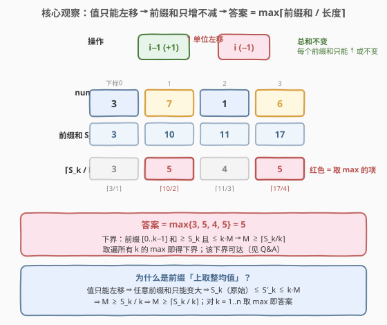
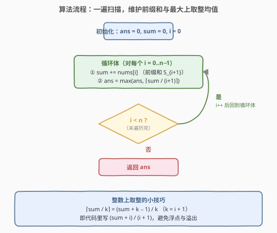
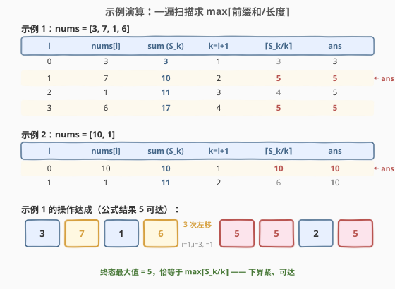

# LeetCode 最小化数组中的最大值 题解

## 1. 题目概述

- **标题 / 题号**：最小化数组中的最大值（#2439，medium）
- **链接**：https://leetcode.cn/problems/minimize-maximum-of-array/
- **难度**：中等
- **标签**：贪心、前缀和、数学

**题意**：给定一个下标从 $0$ 开始、含 $n$ 个非负整数的数组 `nums`。每步操作：

- 选一个满足 $1 \le i < n$ 且 $\text{nums}[i] > 0$ 的下标 $i$；
- 将 $\text{nums}[i]$ 减 $1$，$\text{nums}[i-1]$ 加 $1$。

可执行**任意**次操作，返回所能得到的数组中**最大值最小**为多少。

**示例 1**：

```text
输入：nums = [3,7,1,6]
输出：5
解释：一串最优操作：
  1. i=1 → [4,6,1,6]
  2. i=3 → [4,6,2,5]
  3. i=1 → [5,5,2,5]
  最大值为 5，无法更小。
```

**示例 2**：

```text
输入：nums = [10,1]
输出：10
解释：最优解是不改动 nums，最大值 10。
```

**约束**：

- $n = \text{nums.length}$
- $2 \le n \le 10^5$
- $0 \le \text{nums}[i] \le 10^9$

> 💡 **题眼**：操作的本质是「把 $1$ 单位从 $i$ **左移**到 $i-1$」。左移不改变总和，却改变了「前缀和」的行为——这是推导答案的钥匙。

## 2. 解题思路

### 2.1 暴力思路：模拟 / 二分搜索可行解

最直白的想法是二分答案 $M$，再贪心判定「能否把所有元素压到 $\le M$」。判定本身可行（见第 5 节），但要写对贪心摊还逻辑并不直观，且需要 $O(n \log S)$（$S$ 为值域）。

> 💡 转机：如果抓住「左移」对**前缀和**的影响，答案可以被一条**一维公式**直接给出，连二分都不必。

### 2.2 核心观察：前缀和只增不减 → 答案 = max⌈前缀和 / 长度⌉



记 $S_k = \sum_{j=0}^{k-1} \text{nums}[j]$ 为**原始**前缀和（前 $k$ 个元素之和），最终数组记为 $b$，其前缀和记为 $S'_k$。

**两个不变量**：

1. **总和不变**：每次操作「$-1$ 在 $i$、$+1$ 在 $i-1$」，一加一减相抵，$S'_n = S_n$。
2. **前缀和只能变大或不变**（关键）：考察前 $k$ 个元素的前缀和 $S'_k$。操作的下标 $i$：
   - $i \le k-1$：$i$ 与 $i-1$ 都落在前缀内，前缀和**不变**；
   - $i \ge k+1$：都在前缀外，**不变**；
   - $i = k$：$i$ 在前缀外被减、$i-1=k-1$ 在前缀内被加，前缀和**$+1$**。

   故 $S'_k \ge S_k$ 恒成立——**原始前缀和是最终前缀和的下界**。

> ⚠️ **决定性事实**：若最终最大值为 $M$，则前 $k$ 个元素每个 $\le M$，于是 $S'_k \le k \cdot M$。结合 $S_k \le S'_k \le k \cdot M$，得
> $$M \ge \frac{S_k}{k} \quad\Longrightarrow\quad M \ge \left\lceil \frac{S_k}{k} \right\rceil.$$
> 对所有 $k = 1, \dots, n$ 取 max，即得**下界**：
> $$\boxed{\,\text{ans} \;\ge\; \max_{1 \le k \le n}\left\lceil \frac{S_k}{k} \right\rceil\,}$$

**下界可达**（直觉，严格构造见 Q&A）：令 $M = \max_k \lceil S_k/k \rceil$，则 $S_k \le k \cdot M$ 对所有 $k$ 成立（含 $k=n$ 即 $S_n \le n \cdot M$，总量守恒无矛盾）。从左到右贪心摊还：每个位置至多放 $M$，多出的量继续向左累积；因为每个前缀的「原始预算」$S_k$ 都没击穿 $k \cdot M$，累积量永远不会撑破上界，故可构造出最大值恰为 $M$ 的数组（示例 1 的 $[5,5,2,5]$ 即一例）。

> 💡 **统一直觉**：值只能左移 = 只能把右侧的「富余」往左侧的「空缺」里填，**填不到比前缀均值更高的位置**。所以最紧的瓶颈就是「前缀上取整均值」的最大值。

### 2.3 算法流程图



一遍扫描即可，只维护两个量：

1. **初始化**：$\text{ans} = 0$，$\text{sum} = 0$。
2. **遍历** $i = 0 \to n-1$：累加 $\text{sum} \mathrel{+}= \text{nums}[i]$（此时 $\text{sum} = S_{i+1}$），计算上取整均值 $\lceil \text{sum} / (i+1) \rceil$，更新 $\text{ans} = \max(\text{ans}, \cdots)$。
3. **返回** $\text{ans}$。

> 💡 **整数上取整技巧**：$\lceil a / b \rceil = \lfloor (a + b - 1) / b \rfloor$。这里 $b = i+1$，故写 `(sum + i) / (i + 1)`，全程整数运算，避免浮点误差与转换。注意 `sum` 要用 64 位：$n \cdot \max(\text{nums}) = 10^5 \times 10^9 = 10^{14}$，超出 32 位。

### 2.4 示例演算



- **示例 1** `[3,7,1,6]`：前缀和 $3, 10, 11, 17$；上取整均值 $3, 5, 4, 5$；$\max = 5$。在 $i=1$（$k=2$）处 `ans` 就定到 $5$，其后不再升高。原数组经 $i=1 \to i=3 \to i=1$ 三次左移变为 $[5,5,2,5]$，最大值 $5$ 恰等于公式结果。
- **示例 2** `[10,1]`：前缀和 $10, 11$；上取整均值 $10, 6$；$\max = 10$。在 $i=0$（$k=1$）处即取到 $10$（首个元素本身就是上界，且值无法右移只能左移，故无法压低），其后 $k=2$ 的均值 $6$ 更小不抬升 `ans`。

> ⚠️ 注意示例 2：单个大值在最左端时**无法**被摊低——操作只能左移，左端没有更左的位置可接收，故答案退化为该值本身。这正是「$\max$ 在 $k=1$ 处取到」的体现。

## 3. 参考代码

### C++

```cpp
class Solution {
  public:
    int minimizeArrayValue(vector<int>& nums) {
        long long ans = 0, sum = 0;
        int n = nums.size();
        for (int i = 0; i < n; ++i) {
            sum += nums[i];
            long long ceil_avg = (sum + i) / (i + 1); // ⌈sum/(i+1)⌉
            ans = max(ans, ceil_avg);
        }
        return ans;
    }
};
```

### Python

```python
class Solution:
    def minimizeArrayValue(self, nums: List[int]) -> int:
        ans = 0
        s = 0
        for i, x in enumerate(nums):
            s += x
            ans = max(ans, (s + i) // (i + 1))  # ⌈s/(i+1)⌉
        return ans
```

> 💡 Python 整数天然无限精度，无需担心溢出；C++ 中 `sum`、`ans` 必须用 `long long`。返回值 `int` 安全：$\text{ans} \le \max(\text{nums}) \le 10^9 < 2^{31}$（见第 4 节）。

## 4. 复杂度分析

| 维度 | 复杂度 | 说明 |
|------|--------|------|
| **时间复杂度** | $O(n)$ | 一遍扫描，每个元素 $O(1)$ 处理（累加 + 一次整数除法 + 一次 max） |
| **空间复杂度** | $O(1)$ | 仅常数个变量 `ans`、`sum`、`i` |

> ⚠️ 关于 $\text{ans} \le \max(\text{nums})$：对任意 $k$，$S_k / k$ 是前 $k$ 个元素的**均值**，必 $\le$ 其中最大值 $\le \max(\text{nums})$；$k=1$ 时 $\lceil S_1/1 \rceil = \text{nums}[0]$。故 $\text{ans} \le \max(\text{nums}) \le 10^9$，`int` 返回安全，`long long` 计算已覆盖求和溢出。

## 5. 扩展：二分答案 + 前缀均值可行性判定

换个视角，本题也可纳入「二分答案」家族（与 [410](../0401-0500/410_分割数组的最大值.md)/[1011](../1001-1100/1011_在D天内送达包裹的能力.md)/[875](../0801-0900/875_爱吃香蕉的珂珂.md) 同构）：

- **二分**：在 $[\,\max(\text{nums}[0],\, \lceil S_n/n \rceil)\,,\; \max(\text{nums})\,]$ 上二分答案 $M$。
- **判定** $M$ 可行：由第 2.2 节，$M$ 可行 $\iff$ 对所有 $k$ 有 $S_k \le k \cdot M$ $\iff$ $\max_k \lceil S_k/k \rceil \le M$。即「所有前缀的上取整均值都不超过 $M$」。

这给了另一种 $O(n \log S)$ 解。但既然判定式本身就是答案，**直接一遍扫描求 $\max_k \lceil S_k/k \rceil$** 即 $O(n)$ 终，比二分更优。二分的价值在于：当可行性判据不能写成闭式时（如 [410](../0401-0500/410_分割数组的最大值.md) 的「划分段数 $\le$ 限定」），它才是通用武器。

> 💡 **对比**：[410](../0401-0500/410_分割数组的最大值.md) 是「把数组切成若干段、最小化段和最大值」，元素**不可跨段流动**，只能靠二分 + 贪心划分；本题元素**可向左流动**，前缀和单调不减这一结构性更强的事实直接给出闭式——流动的自由度反而让答案更易算。

## 6. 面试要点

1. **为什么前缀和只能变大或不变？**

   - 操作把 $1$ 从 $i$ 左移到 $i-1$。对前 $k$ 个元素的前缀和：$i \le k-1$ 时两端都在前缀内，不变；$i \ge k+1$ 时都在外，不变；$i = k$ 时 $i$ 在外被减、$k-1$ 在内被加，前缀和 $+1$。
   - 故 $S'_k \ge S_k$——**原始前缀和是最终前缀和的下界**，这是推导全部结论的基石。

2. **下界 $\max_k \lceil S_k/k \rceil$ 为什么可达？**

   - 取 $M = \max_k \lceil S_k/k \rceil$，则 $S_k \le k \cdot M$（$k=n$ 给出 $S_n \le n \cdot M$，总量守恒无矛盾）。
   - **严格构造**：令最终前缀和 $S'_k = \min(k \cdot M,\; S_n)$。验证三点：
     - $S'_k \ge S_k$：因 $k \cdot M \ge S_k$ 且 $S_n \ge S_k$，两者 $\min$ 仍 $\ge S_k$；
     - $S'_n = \min(n \cdot M, S_n) = S_n$，总量守恒；
     - 增量 $b[k] = S'_{k+1} - S'_k \in [0, M]$：当 $k \cdot M$ 与 $(k+1) \cdot M$ 都 $< S_n$ 时增量为 $M$；跨越 $S_n$ 时增量为 $S_n - k\cdot M \le M$；都 $\ge S_n$ 时增量为 $0$。
   - 又 $S'_k \ge S_k$ 且 $S'_n = S_n$ 恰是「左移操作」可达性的充要条件（前缀和支配 + 总量相等），故 $b$ 可达，且每元素 $\le M$。下界紧。

3. **为什么不能用「直接取 $\max(\text{nums})$」？反例？**

   - `[3,7,1,6]` 的 $\max(\text{nums})=7$，但答案 $5$。大值在**非最左**位置时，可把它的富余左移去填补左侧空缺，从而摊低整体最大值。
   - 只有当大值落在最左端（$k=1$）时它无法被左移摊低，答案才退化到该值本身（如 `[10,1]`）。这正是「$\max$ 可能在 $k=1$ 取到」的来源。

4. **为什么 $k=1$ 的项 $\lceil S_1/1 \rceil = \text{nums}[0]$ 必须纳入取 $\max$？**

   - 最左元素无法接收任何左移（没有 $i=0$ 的操作源），它的值只能不变或被左移来的量**增大**，绝不会被减小。故答案 $\ge \text{nums}[0]$。
   - 这正是 $k=1$ 项的语义，不可遗漏；否则会在 `[10,1]` 这类样例上出错。

5. **本题与二分答案家族（[410](../0401-0500/410_分割数组的最大值.md)/[1011](../1001-1100/1011_在D天内送达包裹的能力.md)/[875](../0801-0900/875_爱吃香蕉的珂珂.md)）的关系？**

   - 都是「极小化最大值」类。但 [410](../0401-0500/410_分割数组的最大值.md) 等元素**不可流动**（只能切段），可行性判据是贪心划分段数，写不成闭式，须二分。
   - 本题元素**可向左流动**，结构更强：前缀和单调不减直接给出 $\max_k \lceil S_k/k \rceil$ 闭式，$O(n)$ 即解。**流动自由度更高 → 答案更易算**，是个反直觉但漂亮的对比。

> 💡 **一句话总结**：操作即「值左移」，使每个前缀和只增不减；于是 $\text{ans} = \max_{k} \lceil S_k / k \rceil$，一遍扫描 $O(n)$ 终。抓住「前缀和下界」这条不变量，比二分答案更短、更快、更本质。

## 同类练习题

| # | 题目 | 与本题的关联 |
|---|------|-------------|
| 410 | [分割数组的最大值](https://leetcode.cn/problems/split-array-largest-sum/)（[题解](../0401-0500/410_分割数组的最大值.md)） | 极小化最大值的二分答案母题；元素不可流动只能切段，对比本题「可流动→闭式」的结构差异 |
| 1011 | [在 D 天内送达包裹的能力](https://leetcode.cn/problems/capacity-to-ship-packages-within-d-days/)（[题解](../1001-1100/1011_在D天内送达包裹的能力.md)） | 二分答案 + 贪心验证家族；本题的判定可写成 $\max\lceil S_k/k\rceil \le M$ 的闭式，是其退化特例 |
| 875 | [爱吃香蕉的珂珂](https://leetcode.cn/problems/koko-eating-bananas/)（[题解](../0801-0900/875_爱吃香蕉的珂珂.md)） | 二分答案 + $O(n)$ 验证；与本题共享「极小化最大值」骨架 |
| 2389 | [和有限的最长子序列](https://leetcode.cn/problems/longest-subsequence-with-limited-sum/)（[题解](../2301-2400/2389_和有限的最长子序列.md)） | 前缀和 + 二分查找的典型应用，复用前缀和单调性 |
| 2270 | [分割数组的方案数](https://leetcode.cn/problems/number-of-ways-to-split-array/)（[题解](../2201-2300/2270_分割数组的方案数.md)） | 前缀和拆分计数，前缀和作为判定与计数的基础工具 |
