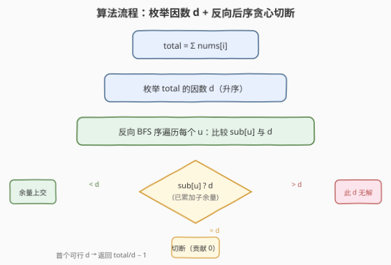
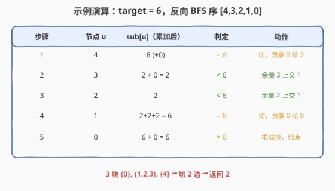

# LeetCode 创建价值相同的连通块 题解

## 1. 题目概述

- **标题 / 题号**：创建价值相同的连通块（#2440，hard）
- **链接**：https://leetcode.cn/problems/create-components-with-same-value/
- **难度**：困难
- **标签**：树、深度优先搜索、数学、枚举

**题意**：有一棵 $n$ 个节点（编号 $0 \dots n-1$）的**无向树**（$n-1$ 条边），每个节点 $i$ 有权值 $\text{nums}[i]$。你可以**删除若干边**，把树切成若干连通块；一个连通块的**价值** = 块内所有节点权值之和。要求删除后**各连通块价值都相等**，求最多能删多少条边（等价于求最多能切出多少块）。

**示例 1**：

```text
输入：nums = [6,2,2,2,6], edges = [[0,1],[1,2],[1,3],[3,4]]
输出：2
解释：删边 (0,1) 与 (3,4)，得到 {0}、{1,2,3}、{4} 三块，每块价值都为 6。
```

**示例 2**：

```text
输入：nums = [2], edges = []
输出：0
解释：无任何边可删。
```

**约束**：

- $1 \le n \le 2 \times 10^4$
- $\text{nums.length} = n$，$1 \le \text{nums}[i] \le 50$
- `edges` 表示一棵合法的树

> 💡 **关键观察**：若切成 $k$ 块、每块价值 $d$，则 $\text{total} = k \cdot d$，即 $d$ 必是 $\text{total}=\sum\text{nums}$ 的**因数**。删边数 $= k - 1 = \text{total}/d - 1$，于是**最大化删边数 $\Leftrightarrow$ 最小化可行的 $d$**。判定某 $d$ 是否可行的钥匙是「后序贪心切断」：子树余量恰好等于 $d$ 就断开。

## 2. 解题思路

### 2.1 暴力思路：枚举删边集合

最直白的做法：枚举边子集（$2^{n-1}$ 种），对每种切法验证各块价值相等。$n=2\times10^4$ 下指数爆炸，完全不可行。浪费在于：**没有利用「总价值固定」这一约束**——既然各块价值相等，块价值必是 $\text{total}$ 的因数，候选 $d$ 的数量极少（$\text{total}\le 10^6$，因数个数最多约 $240$ 个）。

### 2.2 核心观察：因数枚举 + 后序贪心切断

设目标块价值为 $d$（$d \mid \text{total}$）。把树**任意定根**（取 $0$），做一次后序遍历，对每个节点 $u$ 维护「子树中尚未成块的余量」$\text{sub}[u]$（= $\text{nums}[u]$ 加上各子节点上交的余量）。处理完 $u$ 的所有子节点后按 $\text{sub}[u]$ 与 $d$ 的关系决策：

![核心概念：sub[u]==d 即切断，<d 上交父亲，>d 则此 d 无解](../images/2440_concept.svg)

| 关系 | 动作 | 上交父亲的量 |
|------|------|--------------|
| $\text{sub}[u] = d$ | $u$ 这棵子树恰好成一块，**切断**边 $(u,\text{parent}[u])$ | $0$ |
| $\text{sub}[u] < d$ | $u$ 这块还差一点，余量上交父亲继续凑 | $\text{sub}[u]$ |
| $\text{sub}[u] > d$ | 凑过头且无法再分 → 此 $d$ **无解** | — |

遍历到根时，根的余量必须恰好 $= d$（构成最后一块）；若 $<d$ 说明顶层块凑不齐，无解。

> 💡 **贪心为何正确？** 若 $\text{sub}[u]=d$，则这棵子树权值之和恰为 $d$。在**任意**合法切法里，这棵子树内的节点必须被完整地放进某个块——而子树权和恰为 $d$，只能整体就是一块（任何进一步细分都会让某块权和 $<d$，因 $\text{nums}[i]\ge 1$ 无法补足）。所以「$\text{sub}[u]=d$ 必切断」是**强制**的，贪心不会切错。反之若 $\text{sub}[u]>d$，意味着 $u$ 把所有 $<d$ 的子余量吞下后仍超出，而这些子余量只能经 $u$ 上行（$u$ 把它们连在一起），无法绕开 $u$ 拆开，故此 $d$ 确实无解。

> ⚠️ **块价值不整除 total 一定无解**：$k$ 块各值 $d \Rightarrow \text{total}=kd$，故只枚举因数即可，跳过大量无效候选。

### 2.3 算法流程图



要点：

1. 计算 $\text{total}=\sum\text{nums}$，收集其全部因数并**升序**排列。
2. 对每个因数 $d$ 调用 `can(d)` 判定可行性；因删边数 $=\text{total}/d-1$ 随 $d$ 递增**单调递减**，**首个可行 $d$ 即给出最大删边数**，直接返回。
3. `can(d)` 用**反向 BFS 序**遍历（孩子先于父亲，等价于迭代后序），无需递归，规避 $n=2\times10^4$ 退化成链时的栈溢出。

### 2.4 示例演算

以示例 1 `nums = [6,2,2,2,6]`，$\text{total}=18$，因数升序 $1,2,3,6,9,18$。$d=1,2,3$ 时单节点权值 $6$ 已 $>d$，逐一判否。验 $d=6$：以 $0$ 为根，BFS 序 $[0,1,2,3,4]$，反向遍历 $[4,3,2,1,0]$。



三块 $\{0\},\{1,2,3\},\{4\}$，删边数 $=18/6-1=2$。

> 💡 **$d=18$ 总可行**：整棵树作为一块、删 $0$ 边，故答案必 $\ge 0$。若所有更小因数都不可行，答案即 $0$（如示例 2：$\text{total}=2$，$d=1$ 时节点值 $2>1$ 判否，只剩 $d=2$ → $0$ 边）。

## 3. 参考代码

### C++

```cpp
class Solution {
public:
    int componentValue(vector<int>& nums, vector<vector<int>>& edges) {
        int n = nums.size();
        long long total = accumulate(nums.begin(), nums.end(), 0LL);
        vector<vector<int>> g(n);
        for (auto& e : edges) {
            g[e[0]].push_back(e[1]);
            g[e[1]].push_back(e[0]);
        }
        // BFS 定根 0，建立 parent[] 与 BFS 序（反向即孩子先于父亲）
        vector<int> parent(n, -1), order;
        vector<char> vis(n, 0);
        queue<int> q;
        q.push(0); vis[0] = 1;
        while (!q.empty()) {
            int u = q.front(); q.pop();
            order.push_back(u);
            for (int v : g[u]) if (!vis[v]) {
                vis[v] = 1; parent[v] = u; q.push(v);
            }
        }
        auto can = [&](int target) -> bool {
            vector<long long> sub(nums.begin(), nums.end());
            for (int idx = n - 1; idx >= 0; --idx) {     // 反向 BFS 序
                int u = order[idx];
                long long s = sub[u];
                if (s > target) return false;           // 凑过头 → 无解
                if (s < target) {                       // 不够一块，余量上交父亲
                    int p = parent[u];
                    if (p == -1) return false;          // 根仍凑不齐 → 无解
                    sub[p] += s;
                }
                // s == target：正好一块，切断（贡献 0 给父亲）
            }
            return true;
        };
        // 收集 total 的全部因数并升序
        vector<int> divs;
        for (int i = 1; (long long)i * i <= total; ++i)
            if (total % i == 0) {
                divs.push_back(i);
                if (i != total / i) divs.push_back(total / i);
            }
        sort(divs.begin(), divs.end());
        for (int d : divs)                               // 升序：首个可行即最小 d
            if (can(d)) return total / d - 1;
        return 0;
    }
};
```

### Python

```python
from collections import deque
from typing import List


class Solution:
    def componentValue(self, nums: List[int], edges: List[List[int]]) -> int:
        n = len(nums)
        total = sum(nums)
        adj = [[] for _ in range(n)]
        for a, b in edges:
            adj[a].append(b)
            adj[b].append(a)

        # BFS 定根 0，建立 parent[] 与 BFS 序
        parent = [-1] * n
        order = []
        visited = [False] * n
        visited[0] = True
        q = deque([0])
        while q:
            u = q.popleft()
            order.append(u)
            for v in adj[u]:
                if not visited[v]:
                    visited[v] = True
                    parent[v] = u
                    q.append(v)

        def can(target: int) -> bool:
            sub = nums[:]                               # sub[u] = 子树尚未成块的余量
            for u in reversed(order):                   # 反向 BFS 序：孩子先于父亲
                s = sub[u]
                if s > target:                           # 凑过头 → 无解
                    return False
                if s < target:                           # 不够一块，余量上交父亲
                    p = parent[u]
                    if p == -1:                          # 根仍凑不齐 → 无解
                        return False
                    sub[p] += s
                # s == target：正好一块，切断（贡献 0 给父亲）
            return True

        # 收集 total 的全部因数并升序
        divs = []
        d = 1
        while d * d <= total:
            if total % d == 0:
                divs.append(d)
                if d != total // d:
                    divs.append(total // d)
            d += 1
        divs.sort()
        for d in divs:                                   # 升序：首个可行即最小 d
            if can(d):
                return total // d - 1
        return 0
```

> 💡 **实现细节**：① 用 BFS 序的反向代替递归后序——BFS 保证父亲先入队，故反向序列里孩子必在父亲之前，等价于「孩子向父亲上交余量」的拓扑序，且 $O(n)$、无栈溢出风险；② `sub` 初始化为 `nums` 的拷贝，子节点上交时直接累加进 `sub[parent]`，无需显式建子节点列表；③ 因数枚举只需到 $\sqrt{\text{total}}$，配对取商，去重后排序——$\text{total}\le 10^6$ 时因数个数极少，外层循环开销可忽略。

## 4. 复杂度分析

| 维度 | 复杂度 | 说明 |
|------|--------|------|
| **时间复杂度** | $O(n \cdot \tau(\text{total}))$ | BFS 建序 $O(n)$；对每个因数 $d$ 调用 `can(d)` 做 $O(n)$ 反向遍历；$\tau$ 为 $\text{total}$ 的因数个数，$\text{total}\le 10^6$ 时 $\tau\le 240$（实际远小于此），总计约 $4.8\times10^6$ 量级 |
| **空间复杂度** | $O(n)$ | 邻接表 `g`、`parent`、`order`、`vis`、`sub` 各 $O(n)$；迭代无递归栈 |

> 💡 暴力 $2^{n-1}$ 与本解 $O(n\,\tau)$ 之间差了指数到近线性的鸿沟，关键在于**用「总价值固定 ⇒ 块价值必为因数」把指数级删边集合压缩成极少候选 $d$**，再以「后序贪心切断」线性判定单候选。

## 5. 扩展：递归写法与下界估计

**递归版 `can(d)`**：从根起后序 DFS，返回「该子树尚未成块的余量」（$=d$ 时返回 $0$ 表示切断，$<d$ 时返回余量，$>d$ 或根余量非 $0$ 则无解）。逻辑等价，但 $n=2\times10^4$ 退化成链时递归深达 $2\times10^4$，Python 需 `sys.setrecursionlimit(30000)` 且仍有栈开销，故本题首选**迭代反向 BFS 序**。

**为何从最小因数试？** 删边数 $=\text{total}/d-1$ 是 $d$ 的严格递减函数，最小可行 $d$ 给最大删边数。由于 $d=\text{total}$ 恒可行（整树一块、$0$ 边），答案下界为 $0$，循环必有解退出。若想进一步剪枝：可先按「单节点最大权值」筛掉一批过小因数（$\max\text{nums}>d$ 必无解），但 `can(d)` 内首步即会判否，收益有限。

## 6. 面试要点

1. **为什么块价值必是 total 的因数？为何枚举因数而非枚举删边？**

    - $k$ 块各价值 $d$，$\text{total}=k\cdot d$，故 $d\mid\text{total}$。枚举删边集合是 $2^{n-1}$ 指数级；而 $\text{total}\le 10^6$ 的因数个数极少（$\le 240$），把指数问题压成「对每个候选 $d$ 线性判定」。这是「用全局和约束裁剪候选空间」的典型思路。

2. **后序贪心切断为什么正确？sub[u]>d 为何一定无解？**

    - $\text{sub}[u]=d$ 时该子树权和恰为 $d$，合法切法里它只能整体作一块（细分会让某块权和 $<d$ 且无法补足，因 $\text{nums}[i]\ge1$），故切断是**强制**的，贪心不会错切。$\text{sub}[u]>d$ 时，所有 $<d$ 的子余量只能经 $u$ 上行连成一体，无法绕开 $u$ 拆分，凑过头即真无解。

3. **如何用迭代代替递归做后序？为何要反向 BFS 序？**

    - BFS 从根起入队，父亲必在孩子之前入队；反向 BFS 序里孩子必在父亲之前，正是「子节点先向父亲上交余量」的拓扑序。逐节点比较 `sub[u]` 与 $d$ 并按规则上交/切断，$O(n)$ 完成，且无递归栈溢出风险——$n=2\times10^4$ 链式树时这点尤为重要。

4. **为什么按因数升序取首个可行？答案会不会取错？**

    - 删边数 $=\text{total}/d-1$ 随 $d$ 递增单调递减，故最小可行 $d$ 给最大删边数。升序枚举，首个 `can(d)=True` 即最小可行 $d$，直接返回 $\text{total}/d-1$。由于 $d=\text{total}$ 恒可行，循环必终止，下界 $0$ 有保障。

5. **`sub[u]==d` 切断后为何给父亲贡献 0 而非 sub[u]？**

    - 切断意味着这棵子树已自成一独立块，与父亲不再连通，其权值不再参与父亲块的求和，故上交量为 $0$（等价于「这棵子树对父亲的余量贡献为空」）。这正是「删边 = 摘下一块」的代数体现。

> 💡 **一句话总结**：2440 是「因数枚举 + 后序贪心切断」——块价值必整除总价值，把候选压到极少；对每个候选 $d$ 用反向 BFS 序线性判定（$\text{sub}=d$ 切断、$<d$ 上交、$>d$ 无解），升序取首个可行 $d$，返回 $\text{total}/d-1$，整体 $O(n\,\tau(\text{total}))$。

## 同类练习题

| # | 题目 | 与本题的关联 |
|---|------|-------------|
| 2322 | [从树中删除边的最小分数](../2301-2400/2322_从树中删除边的最小分数.md) | 同主题「树删边」，用子树异或 + 时间戳判祖先；对照本题「子树权和 + 因数候选」的求和型切分 |
| 2049 | [统计最高分的节点数目](../2001-2100/2049_统计最高分的节点数目.md) | 删一个节点后用各子树 size 与剩余部分算分数；同样是后序 DFS 统计子树聚合量（size vs 权值和） |
| 834 | [树中距离之和](../0801-0900/834_树中距离之和.md) | 换根 DP，子树 size 父子双向传递；对照本题「子树权和只向上单向合并」的单向后序 |
| 2421 | [好路径的数目](2421_好路径的数目.md) | 同区间，树上按权值排序 + 并查集合并；可对比「树 + 节点权值」的另一类经典套路 |
