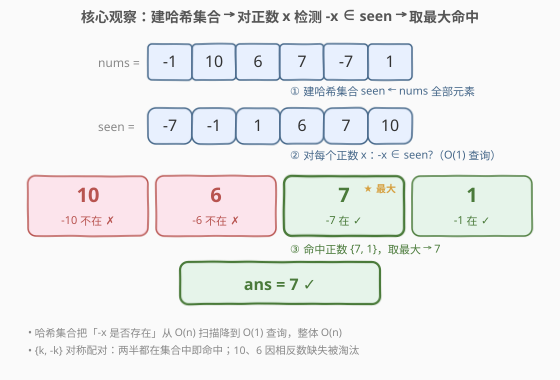
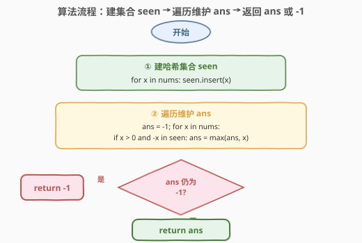

# 与对应负数同时存在的最大正整数

- **题目名称**：与对应负数同时存在的最大正整数
- **链接**：[2441. 与对应负数同时存在的最大正整数](https://leetcode.cn/problems/largest-positive-integer-that-exists-with-its-negative/)
- **难度**：简单
- **标签**：数组、哈希表、集合、一次遍历

## 1. 题目概述

给你一个 **不包含** 任何零的整数数组 `nums`，找出自身与对应的负数都在数组中存在的最大正整数 $k$。

返回正整数 $k$；如果不存在这样的整数，返回 $-1$。

**示例 1**：

```text
输入：nums = [-1,2,-3,3]
输出：3
解释：3 与 -3 同时存在，是唯一满足条件的 k。
```

**示例 2**：

```text
输入：nums = [-1,10,6,7,-7,1]
输出：7
解释：1 和 7 的相反数都在数组中，7 更大。
```

**示例 3**：

```text
输入：nums = [-10,8,6,7,-2,-3]
输出：-1
解释：没有任何正整数与其相反数同时存在。
```

**约束条件**：

- $1 \le \text{nums.length} \le 1000$
- $-1000 \le \text{nums}[i] \le 1000$
- $\text{nums}[i] \ne 0$

> 💡 **关键不变式**：判定条件「$k$ 与 $-k$ 同时存在」是一组**对称配对**——只需在「正半边 $k$」上发起查询，问「负半边 $-k$ 是否在场」即可。于是问题化为：对每个正数 $x$ 做一次 $-x$ 的**成员查询**，命中者取最大。查询的代价决定整体复杂度。

---

## 2. 解题思路

### 2.1 暴力思路：逐正数线性扫描

最直白的做法是**对每个正数重新扫一遍数组**找它的相反数：

```text
ans = -1
for x in nums:
    if x <= 0: continue
    found = false
    for y in nums:           # O(n) 重扫一遍找 -x
        if y == -x: found = true; break
    if found: ans = max(ans, x)
return ans
```

正确性没问题，但每个正数都要 $O(n)$ 重扫一遍，最坏 $O(n^2)$。对 $n \le 1000$ 能 AC，却把「同一数组反复扫描」的重复劳动背在身上，且未揭示「成员查询本可 $O(1)$」。

> ⚠️ 暴力把「$-x$ 是否在场」当作必须现扫的问题，但全部元素的结构在一次预处理后就能任意查询——关键观察：**用哈希集合把成员查询降到 $O(1)$**。

### 2.2 核心观察：哈希集合 + 对称配对取最大



题目可拆成**三步流水线**：

1. **建集合**：把 `nums` 全部元素塞进哈希集合 `seen`，预处理 $O(n)$；
2. **配对查询**：遍历数组，对每个正数 $x$，用 $O(1)$ 查 $-x \in \text{seen}$ 是否成立——命中说明 $\{x, -x\}$ 这对都存在；
3. **取最大**：在命中的正数里维护 $\max$，作为答案。

为何只需在正半边发起查询？因为配对 $\{k, -k\}$ **对称**：若 $k$ 命中（$k>0$ 且 $-k \in \text{seen}$），这对就被发现；不必再从 $-k$ 那侧重复查一次。而非正数不可能是答案（$k>0$），直接跳过。

更新规则极简——遍历到正数 $x$ 且 $-x \in \text{seen}$ 时：

$$
\text{ans} \leftarrow \max(\text{ans},\; x)
$$

若全程无命中，`ans` 保持初值 $-1$ 兜底返回，天然满足「不存在返回 $-1$」。

> 💡 **为什么是 $O(n)$？** 建集合 $O(n)$ + 一次遍历每元素 $O(1)$ 查询，共 $O(n)$。把暴力里「每元素 $O(n)$ 重扫」换成「预处理一次 + 每元素 $O(1)$ 查」，正是「**空间换时间**」的经典范式：用 $O(n)$ 额外空间存一个集合，把 $n$ 次 $O(n)$ 查询压成 $n$ 次 $O(1)$。

### 2.3 算法流程图



两阶段即可：先 `seen ← nums` 建集合；再令 `ans = -1`，遍历数组对正数 $x$ 做 $-x \in \text{seen}$ 判定并取最大。无命中则 `ans` 留 $-1$，零分支特判全靠初值兜底。

### 2.4 示例演算

![示例演算：nums=[-1,10,6,7,-7,1] → 建集合 → 逐正数查 -x → 得 7](../images/2441_example_walkthrough.svg)

以示例 2 `nums = [-1,10,6,7,-7,1]` 演算：

**第一步——建集合**：$\text{seen} = \{-7, -1, 1, 6, 7, 10\}$。

**第二步——只扫描正数**（非正数 $-1, -7$ 跳过）：

| 遍历 $x$ | $-x \in \text{seen}?$ | 命中 | 更新后 $\text{ans}$ |
|----------|------------------------|------|----------------------|
| $10$ | $-10$ 否 | ✗ | $-1$ |
| $6$ | $-6$ 否 | ✗ | $-1$ |
| $7$ | $-7$ 是 ✓ | ✓ | $7$（$-1 \to 7$） |
| $1$ | $-1$ 是 ✓ | ✓ | $\max(7,1)=7$ |

最终 $\text{ans} = 7$ ✓。$7$ 与 $1$ 都命中，但 $\max(7,1)=7$ 故保留更大的 $7$；$10$、$6$ 因相反数缺失被淘汰。

> 💡 **遍历顺序无关性**：无论 $1$ 先于 $7$ 还是后于，$\max$ 维护总会收敛到「命中正数集合的最大值」。示例 3 中全部正数（$8,6,7$）均无相反数在场，循环结束 `ans` 仍 $-1$，返回 $-1$。

---

## 3. 参考代码

### C++

```cpp
class Solution {
public:
    int findMaxK(vector<int>& nums) {
        unordered_set<int> seen(nums.begin(), nums.end());
        int ans = -1;
        for (int x : nums) {
            if (x > 0 && seen.count(-x)) {
                ans = max(ans, x);
            }
        }
        return ans;
    }
};
```

> 💡 `seen` 用区间构造一次建好，避免循环里反复插入。`x > 0` 短路在前：非正数直接跳过，连集合查询都省了。`ans` 初值 $-1$ 兜底「无命中」情形，循环结束原样返回，无需额外分支。

### Python

```python
class Solution:
    def findMaxK(self, nums: List[int]) -> int:
        seen = set(nums)
        ans = -1
        for x in nums:
            if x > 0 and -x in seen:
                ans = max(ans, x)
        return ans
```

> 💡 也可一行流：`return max((x for x in nums if x > 0 and -x in seen), default=-1)`。`max` 的 `default` 直接处理空命中情形，省去显式 `ans`。但拆开写更易读、面试更易讲清「对称配对 + 取最大」的结构。

---

## 4. 复杂度分析

| 维度 | 复杂度 | 说明 |
|------|--------|------|
| **时间复杂度** | $O(n)$ | 建哈希集合 $O(n)$ + 一次遍历每元素 $O(1)$ 查询，共 $O(n)$ |
| **空间复杂度** | $O(n)$ | 哈希集合存全部元素，最坏 $n$ 个 |
| 对照：逐正数重扫 | $O(n^2)$ / $O(1)$ | 每个正数 $O(n)$ 找相反数，正确但慢；省空间 |
| 对照：排序 + 双指针 | $O(n\log n)$ / $O(1)$ | 排序后对撞指针找 $\{k,-k\}$；折中方案 |

> 💡 本题 $n \le 1000$，三种做法皆 AC。哈希集合法胜在 $O(n)$ 且语义直白、与值域解耦；排序法把空间压到 $O(1)$，是「不允许额外空间」时的备选。

---

## 5. 扩展：值域受限时的两种优化

本题值域 $[-1000, 1000]$ 极小，可借助这一结构进一步优化：

**优化一：反向扫值直接得最大（哈希集合版）**。既然要的是「最大的 $k$」，且 $k \in [1, 1000]$，不妨从 $k=1000$ **向小**枚举，第一个「$k$ 与 $-k$ 都在 `seen`」的即为答案——无需 `max` 维护，第一个命中即最大：

```cpp
int findMaxK(vector<int>& nums) {
    unordered_set<int> seen(nums.begin(), nums.end());
    for (int k = 1000; k >= 1; --k)
        if (seen.count(k) && seen.count(-k)) return k;
    return -1;
}
```

> 💡 反向枚举把「取最大」从「遍历维护」变成「首个命中即停」，最坏枚举 $1000$ 次，仍 $O(n + V)$（$V=1000$），但命中即提前返回。

**优化二：布尔数组当哈希（$O(1)$ 空间）**。值域宽 $2001$，用定长数组 `seen[2001]`，下标 $v + 1000$ 映射 $[-1000,1000] \to [0,2000]$，再反向扫 $k$：

```cpp
int findMaxK(vector<int>& nums) {
    bool seen[2001] = {};
    for (int x : nums) seen[x + 1000] = true;
    for (int k = 1000; k >= 1; --k)
        if (seen[k + 1000] && seen[-k + 1000]) return k;
    return -1;
}
```

> 💡 布尔数组把哈希集合的 $O(n)$ 空间压成 $O(V)=O(1)$（$V$ 为常数 $2001$），且缓存友好。代价是**与值域耦合**——若 $|\text{nums}[i]|$ 放大到 $10^9$，定长数组不可行，须退回哈希集合。这就是「值域小时用数组、值域大时用哈希」的取舍。

---

## 6. 面试要点

1. **为什么只需在正半边发起配对查询？**

   > 条件 $\{k, -k\}$ 同时存在是**对称**的：从 $k>0$ 这一侧查 $-k \in \text{seen}$，命中即整对被发现。若再从 $-k$ 那侧重复查 $k$，是同一事实的二次确认，徒增一倍工作。此外非正数不可能是答案（$k>0$），直接 `continue`，连查询都省。

2. **`ans` 初值为何取 $-1$？**

   > 题目要求「不存在返回 $-1$」，而 $k>0$ 恒为正。无命中时循环不修改 `ans`，初值 $-1$ 原样返回，天然满足语义，免去专门判空分支。若初值取 $0$ 则与「合法答案恒正」不冲突，但 $-1$ 更贴合「哨兵」语义——任何合法 $k \ge 1$ 都大于它。

3. **哈希集合相比暴力线扫的优势何在？**

   > 把「$-x$ 是否在场」的单次代价从 $O(n)$ 降到 $O(1)$。整体由 $O(n^2)$ 降到 $O(n)$，代价是 $O(n)$ 额外空间。这是「空间换时间」的经典范式：预处理一次结构，把后续 $n$ 次昂贵查询各压成 $O(1)$，当查询次数 $\omega(1)$ 时空间开销摊销划算。

4. **如何利用值域 $[-1000, 1000]$ 进一步优化？**

   > 两条路：(1) 反向扫值——从 $k=1000$ 向小枚举，首个 $\{k,-k\}$ 都在 `seen` 的即最大，免去 `max` 维护，命中即停；(2) 布尔数组——用 `seen[v+1000]` 当哈希，空间 $O(V)=O(1)$，缓存友好。两者都依赖值域小；值域大时须退回哈希集合 + 正向遍历取最大。

5. **反向扫值时第一个命中为何一定是答案？**

   > 从大到小枚举 $k$，先考察的 $k$ 更大。若 $k$ 与 $-k$ 都在集合中，它就是「存在满足条件的正整数里最大的」——因为任何比它大的 $k'$ 都已被考察过且未命中（否则早就返回了）。故首个命中即全局最大，无需继续。这正是「**有序枚举 + 首个满足**」直接得最值的思想。

> 💡 **一句话总结**：建哈希集合 → 对正数 $x$ 查 $-x \in \text{seen}$ → 取命中最大 ⟹ $O(n)$。`ans` 初值 $-1$ 兜底无命中；值域小时可反向扫值首个命中即最大、或用布尔数组压到 $O(1)$ 空间。

---

## 7. 同类练习题

- [1. 两数之和](https://leetcode.cn/problems/two-sum/)（[题解](../0001-0100/1_两数之和.md)）：同样「对每个元素查它的补数是否在场」，哈希表 $O(1)$ 查询，对照「补数配对」与「相反数配对」
- [219. 存在重复元素 II](https://leetcode.cn/problems/contains-duplicate-ii/)（[题解](../0201-0300/219_存在重复元素II.md)）：哈希表记录上次出现下标做存在性判定，同「集合/哈希做成员查询」范式
- [349. 两个数组的交集](https://leetcode.cn/problems/intersection-of-two-arrays/)（[题解](../0301-0400/349_两个数组的交集.md)）：把一数组建成集合再查另一数组，同「预处理集合 + 成员查询」骨架
- [2006. 差的绝对值为 K 的数对数目](https://leetcode.cn/problems/count-number-of-pairs-with-absolute-difference-k/)：对每个元素查「伙伴值」是否在场并计数，同「哈希集合/频次表做配对查询」
- [2341. 数组能形成多少数对](https://leetcode.cn/problems/maximum-number-of-pairs-in-array/)：频次表配对计数，对照本题「配对取最大」与「配对计数求和」
