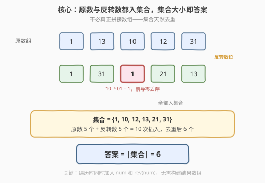
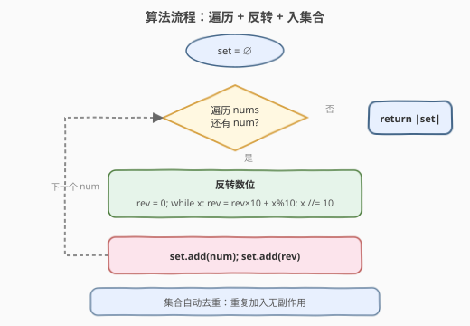

# LeetCode 反转之后不同整数的数目 题解

## 1. 题目概述

- **标题 / 题号**：反转之后不同整数的数目（#2442，medium）
- **链接**：https://leetcode.cn/problems/count-number-of-distinct-integers-after-reverse-operations/
- **难度**：中等
- **标签**：数组、哈希表、数学

**题意**：给你一个由**正**整数组成的数组 `nums`。你必须取出数组中的每个整数，**反转其中每个数位**，并将反转后得到的数字添加到数组的末尾。这一操作只针对 `nums` 中原有的整数执行。返回结果数组中**不同**整数的数目。

**示例 1**：

```text
输入：nums = [1,13,10,12,31]
输出：6
解释：反转每个数字后，结果数组是 [1,13,10,12,31,1,31,1,21,13]。
      注意对于整数 10，反转之后会变成 01，即 1。
      数组中不同整数的数目为 6（数字 1、10、12、13、21 和 31）。
```

**示例 2**：

```text
输入：nums = [2,2,2]
输出：1
解释：反转每个数字后，结果数组是 [2,2,2,2,2,2]。
      数组中不同整数的数目为 1（数字 2）。
```

**约束**：

- $1 \le \text{nums.length} \le 10^5$
- $1 \le \text{nums}[i] \le 10^6$

> 💡 **题眼**：「反转后添加到末尾」只是描述方式，本质上要求的是**原数与反转数的并集大小**。反转时前导零会被自然丢弃（$10 \to 01 = 1$）。

## 2. 解题思路

### 2.1 暴力思路：真正拼接数组再统计

最直白的做法是按题意字面执行：遍历 `nums`，对每个元素反转数位得到 `rev`，将 `rev` 追加到数组末尾，最后统计整个数组的不同元素个数。

```text
result = nums + [reverse(x) for x in nums]
return |set(result)|
```

这能通过，但拼接数组这一步是**多余的**——题目只问「不同整数的数目」，根本不需要构造结果数组。拼接消耗 $O(n)$ 额外空间却没带来任何信息增益。

### 2.2 核心观察：不必拼接，集合天然去重



关键直觉：题目要求的「结果数组中不同整数的数目」，等价于**所有原数与所有反转数的并集大小**。而**集合**这一数据结构天然做并集去重——只需遍历 `nums`，对每个 `num` 把 `num` 本身和 `rev(num)` 都丢进集合，最终集合大小就是答案。

两个要点：

1. **不必拼接数组**：集合的 `add` 操作天然幂等（重复加入无副作用），所以「先拼再统计」与「边遍历边加入」等价，后者省掉了 $O(n)$ 的数组空间。
2. **反转丢弃前导零**：`10` 反转得 `01`，作为整数即 `1`。数值反转（循环取模）天然处理了这一点——`rev = rev * 10 + x % 10` 的过程中，前导零不会产生任何贡献。

> 💡 **为什么数值反转天然丢弃前导零？** 以 `x = 1200` 为例：循环依次取出 `0, 0, 2, 1`，构建 `rev = 0 → 0 → 2 → 21`。开头的两个 `0` 只是在 `rev = 0 * 10 + 0 = 0` 处原地踏步，不会变成 `0021`，最终结果就是 `21`。这正是数值反转相比字符串反转的优势——无需额外 `strip` 前导零。

### 2.3 算法流程图



一遍扫描即可，对每个 `num` 做两件事：

1. **反转数位**：`rev = 0; while x > 0: rev = rev * 10 + x % 10; x //= 10`。循环次数 = `num` 的位数 $d$，由于 $\text{nums}[i] \le 10^6$，$d \le 7$。
2. **入集合**：`set.add(num)` 和 `set.add(rev)`，集合自动去重。

遍历结束后返回 `len(set)`。

### 2.4 示例演算

![示例演算：nums = [1, 13, 10, 12, 31]](../images/revdistinct_example_walkthrough.svg)

以 `nums = [1, 13, 10, 12, 31]` 为例：

| 步骤 | `num` | `rev(num)` | 加入后集合 | 集合大小 |
|------|-------|-----------|-----------|---------|
| 0 | 1 | 1 | {1} | 1 |
| 1 | 13 | 31 | {1, 13, 31} | 3 |
| 2 | 10 | **1**（前导零丢弃） | {1, 10, 13, 31} | 4 |
| 3 | 12 | 21 | {1, 10, 12, 13, 21, 31} | 6 |
| 4 | 31 | 13（均已存在） | {1, 10, 12, 13, 21, 31} | 6 |

> ⚠️ 注意第 2 步：`rev(10) = 01 = 1`，而 `1` 已在第 0 步加入集合，所以集合只增长了 `10` 这一个新元素。第 4 步中 `31` 和 `rev(31) = 13` 都已在集合中，集合完全不变。最终答案为 $6$。

## 3. 参考代码

### C++（数值反转 + 哈希集合）

```cpp
class Solution {
  public:
    int countDistinctIntegers(vector<int>& nums) {
        unordered_set<int> s;
        for (int x : nums) {
            s.insert(x);
            int rev = 0, t = x;
            while (t > 0) {
                rev = rev * 10 + t % 10;
                t /= 10;
            }
            s.insert(rev);
        }
        return s.size();
    }
};
```

### Python（字符串反转 + 集合）

```python
class Solution:
    def countDistinctIntegers(self, nums: List[int]) -> int:
        s = set()
        for x in nums:
            s.add(x)
            s.add(int(str(x)[::-1]))
        return len(s)
```

> 💡 **两种反转写法对比**：C++ 用数值循环取模（`rev = rev * 10 + t % 10`），Python 用字符串切片翻转 `str(x)[::-1]` 再 `int()` 转回。两者等价，字符串写法更简洁但多一次类型转换；数值写法无额外字符串分配，在 C++ 中更高效。Python 的 `int("001")` 也会自然丢弃前导零，与数值反转行为一致。

## 4. 复杂度分析

| 维度 | 复杂度 | 说明 |
|------|--------|------|
| **时间复杂度** | $O(n \cdot d)$ | 遍历 $n$ 个元素，每个反转耗时 $O(d)$，$d$ 为数位个数；$d \le 7$（因 $\text{nums}[i] \le 10^6$），故可视为 $O(n)$ |
| **空间复杂度** | $O(n)$ | 最坏情况所有 $2n$ 个元素互不相同，集合存 $2n$ 项 |

> ⚠️ 时间复杂度严格说是 $O(nd)$，但由于 $d \le 7$ 为常数，实际等价于 $O(n)$。集合的 `insert`/`add` 平均 $O(1)$，故总时间 $O(n)$。

## 5. 扩展：反转数位的两种实现

数位反转有两种经典写法，各有适用场景：

### 5.1 数值循环取模

```cpp
int reverse(int x) {
    int rev = 0;
    while (x > 0) {
        rev = rev * 10 + x % 10;
        x /= 10;
    }
    return rev;
}
```

- **优点**：无额外内存分配，纯整数运算，C++ 中最高效。
- **前导零**：天然丢弃（`0 * 10 + 0 = 0`，不贡献）。
- **注意**：[7. 整数反转](https://leetcode.cn/problems/reverse-integer/) 中 $x$ 可能为负且可能溢出 32 位，需额外处理符号与溢出判断；本题 $x \ge 1$ 且 $\le 10^6$，反转后不超过 $10^6$，无溢出风险。

### 5.2 字符串切片翻转

```python
rev = int(str(x)[::-1])
```

- **优点**：Python 一行搞定，可读性极高。
- **前导零**：`int("001")` 自动丢弃，与数值法行为一致。
- **缺点**：需一次 `int→str` 和一次 `str→int` 转换，有额外开销，但对 $n \le 10^5$ 完全可接受。

> 💡 **选型建议**：面试中两种写法都可接受。若面试官关注性能或用 C++/Java，用数值法；若用 Python 且追求简洁，用字符串法。关键是能说清前导零的处理逻辑。

## 6. 面试要点

1. **为什么不必真正拼接数组？**

   - 题目只问「不同整数的数目」，等价于原数与反转数的并集大小。集合的 `add` 天然幂等，遍历时边算边加即可，拼接数组是多余的 $O(n)$ 空间浪费。

2. **反转时前导零怎么处理？**

   - 数值反转中 `rev = rev * 10 + x % 10`，前导零对应 `x % 10 = 0`，此时 `rev = rev * 10 + 0 = rev * 10`，仅在 `rev = 0` 时原地踏步（$0 \times 10 = 0$），不会产生前导零。字符串法中 `int("01")` 也自动丢弃。两种写法行为一致。

3. **数值反转和字符串反转各有什么优劣？**

   - 数值法：无额外内存，纯整数运算，C++ 中最高效；需手写循环。字符串法：Python 一行搞定，可读性高；多两次类型转换。面试中两者均可，关键是说清前导零处理。

4. **时间复杂度是 $O(n)$ 还是 $O(nd)$？**

   - 严格说是 $O(nd)$，$d$ 为数位个数。但 $\text{nums}[i] \le 10^6$，$d \le 7$ 为常数，故等价于 $O(n)$。集合操作均摊 $O(1)$，总时间 $O(n)$。

5. **如果题目改为返回结果数组本身（而非不同整数的数目），需要改什么？**

   - 那就必须真正拼接：遍历 `nums`，对每个 `num` 计算反转并追加到数组末尾，返回拼接后的数组。空间从 $O(n)$（集合）变为 $O(2n)$（数组），但时间不变。本题只问数目，集合足够。

> 💡 **一句话总结**：遍历 `nums`，对每个 `num` 把 `num` 和 `rev(num)` 都加入集合，返回集合大小。核心是「集合去重」+「数值反转丢弃前导零」，$O(n)$ 一遍扫描即可。

## 同类练习题

| # | 题目 | 与本题的关联 |
|---|------|-------------|
| 7 | [整数反转](https://leetcode.cn/problems/reverse-integer/)（[题解](../0001-0100/7_整数反转.md)） | 数位反转的母题，本题反转操作的核心组件；需额外处理负数与 32 位溢出 |
| 9 | [回文数](https://leetcode.cn/problems/palindrome-number/)（[题解](../0001-0100/9_回文数.md)） | 反转一半数位判定回文，与本题共享数位反转技巧 |
| 217 | [存在重复元素](https://leetcode.cn/problems/contains-duplicate/)（[题解](../0201-0300/217_存在重复元素.md)） | 哈希集合去重判定，本题集合用法的直接基础 |
| 202 | [快乐数](https://leetcode.cn/problems/happy-number/)（[题解](../0201-0300/202_快乐数.md)） | 数位拆解平方求和 + 集合判环，数位操作与集合的组合应用 |
