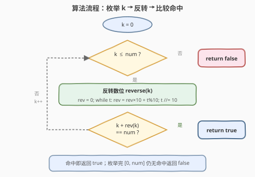
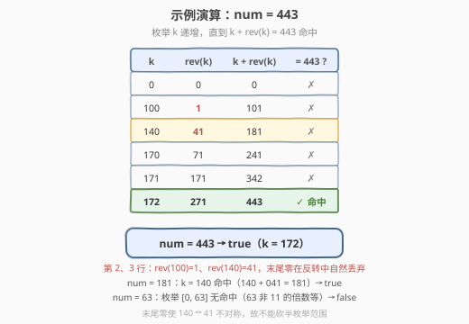

# 反转之后的数字和

- **题目名称**：反转之后的数字和
- **链接**：[2443. 反转之后的数字和](https://leetcode.cn/problems/sum-of-number-and-its-reverse/)
- **难度**：中等
- **标签**：数学、枚举、数位反转

## 1. 题目概述

给你一个**非负**整数 `num`。如果存在某个**非负**整数 `k` 满足 $k + \text{reverse}(k) = \text{num}$，则返回 `true`；否则返回 `false`。

其中 $\text{reverse}(k)$ 表示将 $k$ 的每个数位反转后得到的数字。**反转后可能包含前导零**（如 $\text{reverse}(140) = 041 = 41$），前导零在数值意义下自然丢弃。

**示例 1**：

```text
输入：num = 443
输出：true
解释：172 + 271 = 443，所以返回 true。
```

**示例 2**：

```text
输入：num = 63
输出：false
解释：63 不能表示为非负整数及其反转后数字之和，返回 false。
```

**示例 3**：

```text
输入：num = 181
输出：true
解释：140 + 041 = 181，所以返回 true。注意，反转后的数字可能包含前导零。
```

**约束条件**：

- $0 \le \text{num} \le 10^5$

> 💡 **题眼**：判断「存在性」而非「构造」——只要枚举到一个 $k$ 使 $k + \text{reverse}(k) = \text{num}$ 即可立即返回 `true`。关键是确定**枚举上界**与正确处理**前导零**。

---

## 2. 解题思路

### 2.1 暴力思路：枚举 k 并检验

最直白的做法：枚举每一个非负整数 $k$，计算 $\text{reverse}(k)$，检验 $k + \text{reverse}(k)$ 是否等于 `num`。一旦命中就返回 `true`；全部枚举完仍未命中则返回 `false`。

这里唯一的疑问是「枚举到哪为止」。由于 $\text{reverse}(k) \ge 0$，由 $k + \text{reverse}(k) = \text{num}$ 可得 $k = \text{num} - \text{reverse}(k) \le \text{num}$。所以**只需枚举 $k \in [0, \text{num}]$**。

```text
for k in 0 .. num:
    if k + reverse(k) == num:
        return true
return false
```

考虑到 $\text{num} \le 10^5$，候选 $k$ 至多 $10^5 + 1$ 个，每个反转耗时 $O(d)$（$d$ 为 $k$ 的位数，$d \le 6$），总运算量约 $6 \times 10^5$，完全可以接受。**这一暴力枚举就是本题的最优解**，无需更精巧的数学。

### 2.2 核心观察：搜索上界与前导零

![核心观察：枚举 k∈[0,num]，检验 k+rev(k)=num](../images/sumnum_concept.svg)

两个关键点让暴力枚举既正确又高效：

1. **搜索空间天然有上界**：$\text{reverse}(k) \ge 0 \Rightarrow k \le \text{num}$。因此枚举范围就是 $[0, \text{num}]$，无需也无法把上界定得更小（除非引入数位构造）。$O(\text{num})$ 的扫描对 $\text{num} \le 10^5$ 足够。

2. **反转自然丢弃前导零**：$\text{reverse}(140) = 041 = 41$，恰好对应示例 3 的 $140 + 041 = 181$。数值反转 `rev = rev*10 + x%10` 在循环中遇到末尾的 `0` 时只做 `rev = rev*10 + 0`，在 `rev = 0` 阶段原地踏步（$0 \times 10 = 0$），不会产生前导零；字符串反转后 `int("041")` 也自动丢弃。两种写法行为一致，无需特判。

> 💡 **为什么 k 的上界是 num 而不是 num/2？** 直觉上 $k$ 与 $\text{reverse}(k)$ 「地位对等」，似乎只枚举 $k \le \text{num}/2$ 即可。但**末尾零会打破对称性**：$\text{reverse}(140) = 41$，而 $\text{reverse}(\text{reverse}(140)) = \text{reverse}(41) = 14 \ne 140$。于是 $k=140$ 满足 $140+41=181$，但其「对称伙伴」$41$ 却满足 $41+14=55 \ne 181$。因此不能简单砍半枚举范围，必须老老实实扫到 $\text{num}$。

### 2.3 算法流程图



流程是一个标准的「枚举-检验」循环：

1. 从 $k = 0$ 开始；
2. 若 $k > \text{num}$，已枚举完，返回 `false`；
3. 计算 $\text{reverse}(k)$（逐位取模反转）；
4. 若 $k + \text{reverse}(k) = \text{num}$，命中，返回 `true`；
5. 否则 $k \gets k + 1$，回到步骤 2。

### 2.4 示例演算



以 `num = 443` 为例，枚举 $k$ 从 $0$ 递增（下表只列若干关键值）：

| $k$ | $\text{reverse}(k)$ | $k + \text{reverse}(k)$ | $=443$? |
|-----|---------------------|------------------------|---------|
| 0 | 0 | 0 | ✗ |
| 100 | 1（001，前导零丢弃）| 101 | ✗ |
| 140 | 41（041）| 181 | ✗（恰好是示例 3 的答案）|
| 170 | 71 | 241 | ✗ |
| 171 | 171 | 342 | ✗ |
| **172** | **271** | **443** | ✅ 命中 |

$k = 172$ 时 $172 + 271 = 443$，命中，返回 `true`。

> ⚠️ 对照另两个示例：`num = 181` 时枚举到 $k = 140$ 命中（$140 + 041 = 181$）→ `true`；`num = 63` 时枚举完 $k \in [0, 63]$ 无任何命中（两位数 $k=10a+b$ 的和为 $11(a+b)$，而 $63$ 不是 $11$ 的倍数；含末尾零的 $k=10a$ 和为 $11a$ 也凑不出 $63$；一位数和为偶数更不行）→ `false`。

---

## 3. 参考代码

### C++（数值反转枚举）

```cpp
class Solution {
public:
    bool sumOfNumberAndReverse(int num) {
        for (int k = 0; k <= num; ++k) {
            int rev = 0, t = k;
            while (t > 0) {
                rev = rev * 10 + t % 10;
                t /= 10;
            }
            if (k + rev == num) return true;
        }
        return false;
    }
};
```

### Python（字符串反转枚举）

```python
class Solution:
    def sumOfNumberAndReverse(self, num: int) -> bool:
        for k in range(num + 1):
            if k + int(str(k)[::-1]) == num:
                return True
        return False
```

> 💡 **两种反转写法**：C++ 用数值取模循环 `rev = rev*10 + t%10`，无额外内存分配，最高效；Python 用 `int(str(k)[::-1])` 一行搞定，可读性极高，`int("041")` 自动丢弃前导零。$k=0$ 时数值循环不进入 `while`，`rev` 保持 $0$；字符串法 `str(0)[::-1]` 得 `"0"`，`int` 得 $0$，两者一致。

---

## 4. 复杂度分析

| 维度 | 复杂度 | 说明 |
|------|--------|------|
| **时间复杂度** | $O(\text{num} \cdot d)$ | 枚举 $\text{num}+1$ 个 $k$，每个反转耗时 $O(d)$，$d$ 为 $k$ 的位数；因 $\text{num} \le 10^5$，$d \le 6$ 为常数，故等价于 $O(\text{num})$ |
| **空间复杂度** | $O(1)$ | 只用常数个整型变量，原地反转 |

> ⚠️ 严格时间复杂度为 $O(\text{num} \cdot d)$，但 $d \le 6$ 为常数，实际即 $O(\text{num})$。对 $\text{num} = 10^5$ 约 $6 \times 10^5$ 次基本运算，远低于时限。

---

## 5. 扩展：更大的 num 与对称剪枝

### 5.1 若 num 更大怎么办？

若约束改为 $\text{num} \le 10^{18}$，$O(\text{num})$ 枚举失效，需改为**按数位构造**：固定 $k$ 的位数 $L$，从两端向中间逐位确定 $k$ 的数字，使 $k + \text{reverse}(k)$ 在带进位的逐位加法下匹配 $\text{num}$ 的各位。复杂度降至 $O(d^2)$ 量级，但实现远比枚举复杂——本题 $\text{num} \le 10^5$ 没有必要。

### 5.2 能否只枚举一半？

直觉上 $k$ 与 $\text{reverse}(k)$ 对 $k + \text{reverse}(k)$ 的贡献「地位对等」，似乎可只枚举 $k \le \text{reverse}(k)$。但当 $k$ 含末尾零时对称性失效：$k=140$ 命中但 $\text{reverse}(k)=41$ 不命中（$41+14=55$）。所以**含末尾零的 $k$ 是「非对称」特例**，朴素砍半会漏解。若要剪枝，只能跳过「无末尾零且 $k > \text{reverse}(k)$」的对称冗余，收益有限且增加分支复杂度，不如直接全扫。

> 💡 **一句话总结**：$\text{reverse}(k) \ge 0$ 给出上界 $k \le \text{num}$，于是枚举 $k \in [0, \text{num}]$ 逐一检验 $k + \text{reverse}(k) = \text{num}$ 即可；反转用数值取模或字符串切片，前导零自然丢弃。

---

## 6. 面试要点

1. **枚举的上界为什么是 num？**

   - 由 $k + \text{reverse}(k) = \text{num}$ 且 $\text{reverse}(k) \ge 0$，得 $k = \text{num} - \text{reverse}(k) \le \text{num}$。又 $k \ge 0$，故 $k \in [0, \text{num}]$。$\text{num} \le 10^5$ 使该范围可暴力枚举。

2. **前导零怎么处理？**

   - 数值反转 `rev = rev*10 + t%10` 中，末尾零对应 $t\%10=0$，在 $rev=0$ 阶段做 $0\times10+0=0$ 原地踏步，不产生前导零。字符串法 `int("041")` 也自动丢弃。两者一致，无需特判。$k=0$ 时两者都得 $0$。

3. **能否只枚举到 num/2 加速？**

   - 不能朴素砍半。含末尾零的 $k$（如 $140$）不满足 $\text{reverse}(\text{reverse}(k))=k$，其「对称伙伴」$41$ 并不命中。只有「无末尾零」的 $k$ 才有对称性可跳过冗余，收益有限、分支增多，不划算。

4. **时间复杂度是多少？**

   - $O(\text{num}\cdot d)$，$d$ 为 $k$ 位数。$\text{num}\le10^5 \Rightarrow d\le6$ 为常数，即 $O(\text{num})$。空间 $O(1)$。

5. **如果 num 可达 $10^{18}$ 怎么解？**

   - 改为按数位构造：固定 $k$ 位数 $L$，从首尾向中间逐位定数字，用带进位的逐位加法匹配 $\text{num}$ 各位，复杂度 $O(d^2)$。枚举法在大数据下失效。

> 💡 **一句话总结**：抓住「$\text{reverse}(k)\ge0 \Rightarrow k\le\text{num}$」这一上界，暴力枚举 $[0,\text{num}]$ 即为最优；前导零由数值/字符串反转天然处理，末尾零的存在使对称剪枝不可行。

---

## 7. 同类练习题

- [7. 整数反转](https://leetcode.cn/problems/reverse-integer/)（[题解](../0001-0100/7_整数反转.md)）：数位反转的母题，本题反转操作的核心组件；需额外处理负数与 32 位溢出
- [9. 回文数](https://leetcode.cn/problems/palindrome-number/)（[题解](../0001-0100/9_回文数.md)）：反转一半数位判定回文，与本题共享数位反转技巧与「反转丢前导零」的处理
- [2119. 反转两次的数字](https://leetcode.cn/problems/a-number-after-a-double-reversal/)（[题解](../2101-2200/2119_反转两次的数字.md)）：双重反转是否改变数值，直击「末尾零打破对称性」这一本题核心陷阱
- [2442. 反转之后不同整数的数目](https://leetcode.cn/problems/count-number-of-distinct-integers-after-reverse-operations/)（[题解](../2401-2500/2442_反转之后不同整数的数目.md)）：同一反转操作的去重计数应用，承接数位反转与前导零丢弃
- [2447. 最大公因数等于 K 的子数组数目](https://leetcode.cn/problems/number-of-subarrays-with-gcd-equal-to-k/)（[题解](../2401-2500/2447_最大公因数等于K的子数组数目.md)）：同为 24xx 区间的枚举型题目，对照「枚举-检验」范式的不同落脚点
