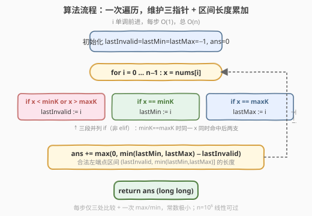

# 统计定界子数组的数目

- **题目名称**：统计定界子数组的数目
- **链接**：[2444. 统计定界子数组的数目](https://leetcode.cn/problems/count-subarrays-with-fixed-bounds/)
- **难度**：困难
- **标签**：数组、队列、滑动窗口

## 1. 题目概述

给你一个整数数组 `nums` 和两个整数 `minK` 与 `maxK`。`nums` 的**定界子数组**是满足下面两个条件的子数组：

- 子数组中的**最小值**等于 `minK`；
- 子数组中的**最大值**等于 `maxK`。

返回定界子数组的数目。子数组是数组中的一个**连续**部分。

**示例 1**：

```text
输入：nums = [1,3,5,2,7,5], minK = 1, maxK = 5
输出：2
解释：定界子数组是 [1,3,5] 与 [1,3,5,2]。
```

**示例 2**：

```text
输入：nums = [1,1,1,1], minK = 1, maxK = 1
输出：10
解释：nums 的每个子数组都是定界子数组，共 10 个。
```

**约束条件**：

- $2 \le \text{nums.length} \le 10^5$
- $1 \le \text{nums}[i], \text{minK}, \text{maxK} \le 10^6$

> 💡 关键观察：定界子数组同时受**三个端点约束**——下界 `minK`、上界 `maxK`、以及「不允许越界元素」。只要固定**右端点** $i$，左端点 $l$ 的合法取值是一个**连续区间**，可由三个「最近位置」指针在 $O(1)$ 内算出区间长度。于是 $O(n^2)$ 枚举可降为**一趟 $O(n)$ 扫描**，与 [795. 区间子数组个数](../0701-0800/795_区间子数组个数.md) 同属「按右端点枚举 + 维护左端点合法区间」的家族。

---

## 2. 解题思路

### 2.1 暴力思路：枚举所有子数组

最直接的做法是双重循环枚举每个子数组 $[l, r]$，逐个求出其最小值与最大值再判定：

```text
ans = 0
for l in 0..n-1:
    mn = +inf, mx = -inf
    for r in l..n-1:
        mn = min(mn, nums[r])
        mx = max(mx, nums[r])
        if mn == minK and mx == maxK:
            ans += 1
```

子数组总数 $\binom{n}{2} \approx n^2/2$，$n = 10^5$ 时约 $5 \times 10^9$ 次判定，远超 $10^8$ 阈值，必然 TLE。

> ⚠️ 瓶颈在于「逐子数组重算极值」：每个 $r$ 都从 $l$ 起重新累算 `mn/mx`，没有任何跨子数组的复用。突破口是**固定右端点**——对每个 $i$，问「以 $i$ 结尾的合法子数组有多少个」。这一问题把「配对枚举」变成「单点计数」，而左端点的合法集合恰好是个区间，可由最近位置指针即时给出。

### 2.2 核心观察：固定右端点 + 三指针维护左端点合法区间

![核心观察：固定右端点 i，左端点 l 必须落在 (lastInvalid, min(lastMin,lastMax)] 内](../images/bounded_subarray_concept.svg)

**第一步：把「越界元素」当作硬左界。** 若某元素 $\text{nums}[k] < \text{minK}$ 或 $\text{nums}[k] > \text{maxK}$，则任何**包含**它的子数组要么最小值 $< \text{minK}$、要么最大值 $> \text{maxK}$，绝不可能是定界子数组。因此对右端点 $i$，左端点 $l$ 必须 $>$「最近的越界位置」$\text{lastInvalid}$。

> 令 $\text{lastInvalid}$ = 下标 $\le i$ 范围内最后一个越界元素的位置（无则 $-1$）。合法子数组必须满足 $l > \text{lastInvalid}$。

**第二步：用「最近 minK / 最近 maxK」保证极值命中。** 要使 $[l, i]$ 的最小值恰为 $\text{minK}$，则 $[l, i]$ 内必须至少含一个等于 $\text{minK}$ 的元素；最大值同理需含 $\text{maxK}$。设 $\text{lastMin}$ = $\le i$ 范围内最后一个等于 $\text{minK}$ 的位置、$\text{lastMax}$ = 最后一个等于 $\text{maxK}$ 的位置。则

$$
l \le \text{lastMin} \quad \text{且} \quad l \le \text{lastMax}
\;\;\Longleftrightarrow\;\;
l \le \min(\text{lastMin}, \text{lastMax}).
$$

**第三步：合并成一段连续区间。** 综合两条约束，左端点 $l$ 必须满足

$$
\text{lastInvalid} \;<\; l \;\le\; \min(\text{lastMin}, \text{lastMax}).
$$

这是一段**连续整数区间**，其中元素个数恰为

$$
\text{count}(i) \;=\; \max\bigl(0,\; \min(\text{lastMin}, \text{lastMax}) - \text{lastInvalid}\bigr).
$$

> 💡 **正确性关键**：$\min(\text{lastMin}, \text{lastMax})$ 之后到 $i$ 的这段里**既有 $\text{minK}$ 又有 $\text{maxK}$**（最近出现位置都在 $l$ 之前），且没有越界元素（越界位置被 $l > \text{lastInvalid}$ 排除在子数组之外）。区间内**任取** $l$ 都合法，区间外都不合法，故合法左端点恰成该区间。当 $\text{minK} = \text{maxK}$（示例 2）时 $\text{lastMin} = \text{lastMax}$ 同位，公式退化为 $\text{lastMin} - \text{lastInvalid}$，仍正确。

### 2.3 算法流程图



一趟扫描，骨架四步：

1. **初始化**：$\text{lastInvalid} = \text{lastMin} = \text{lastMax} = -1$，$\text{ans} = 0$；
2. **更新指针**：对每个 $i$，依 $\text{nums}[i]$ 与 $\text{minK}/\text{maxK}$ 的关系更新——越界则 $\text{lastInvalid} := i$，等于 $\text{minK}$ 则 $\text{lastMin} := i$，等于 $\text{maxK}$ 则 $\text{lastMax} := i$；
3. **区间计数**：$\text{ans} \mathrel{+}= \max(0, \min(\text{lastMin}, \text{lastMax}) - \text{lastInvalid})$；
4. **返回**：扫描结束即答案。

$i$ 全程单调前进，每步 $O(1)$，总 $O(n)$。

> ⚠️ **三指针为何只需「最近」而不需单调队列？** 因为约束只问「子数组内**是否**含 minK/maxK/无越界」，只取决于最近一次出现位置，而非一个滑动窗口内的极值。若题目改为「窗口内极值」才需要单调队列（如 [239. 滑动窗口最大值](../0201-0300/239_滑动窗口最大值.md)）；本题是「存在性」约束，最近位置即可，故更简单。

### 2.4 示例演算

以示例 1 `nums = [1,3,5,2,7,5]`，`minK = 1, maxK = 5` 为例：

![示例演算：nums=[1,3,5,2,7,5]，逐步维护三指针与区间计数](../images/bounded_subarray_walkthrough.svg)

| 步 | $i$ | `nums[i]` | lastInvalid | lastMin | lastMax | $\min(\cdot)$ | $-\text{lastInvalid}$ | 贡献 | ans |
|----|-----|-----------|-------------|---------|---------|----------------|----------------------|------|-----|
| 0 | 0 | 1 | -1 | **0** | -1 | -1 | 0 | 0 | 0 |
| 1 | 1 | 3 | -1 | 0 | -1 | -1 | 0 | 0 | 0 |
| 2 | 2 | 5 | -1 | 0 | **2** | 0 | 1 | **1** | 1 |
| 3 | 3 | 2 | -1 | 0 | 2 | 0 | 1 | **1** | 2 |
| 4 | 4 | 7（越界）| **4** | 0 | 2 | 0 | $-4$ | 0 | 2 |
| 5 | 5 | 5 | 4 | 0 | **5** | 0 | $-4$ | 0 | 2 |

- $i=2$：左端点 $l \in (-1, 0] = \{0\}$，对应子数组 $[1,3,5]$；
- $i=3$：左端点 $l \in (-1, 0] = \{0\}$，对应子数组 $[1,3,5,2]$；
- $i=4$ 起：`7` 越界把 `lastInvalid` 推到 4，合法左端点区间左界被顶到 4 之后，而 $\min(\text{lastMin},\text{lastMax}) = 0 < 4$，区间为空，贡献 0。

总计 $\text{ans} = 2$ ✓。

> 💡 示例 2 `nums = [1,1,1,1]`，`minK = maxK = 1`：每个 $i$ 都令 `lastMin = lastMax = i`、`lastInvalid = -1`，贡献 $i - (-1) = i+1$，总和 $1+2+3+4 = 10$ ✓。这正是「右端点固定、左端点区间累加」退化为「等差求和」的特例。

---

## 3. 参考代码

### C++

```cpp
class Solution {
public:
    long long countSubarrays(vector<int>& nums, int minK, int maxK) {
        long long ans = 0;
        int lastInvalid = -1, lastMin = -1, lastMax = -1;
        for (int i = 0; i < (int)nums.size(); ++i) {
            if (nums[i] < minK || nums[i] > maxK) lastInvalid = i;   // 越界：更新硬左界
            if (nums[i] == minK) lastMin = i;                        // 最近 minK
            if (nums[i] == maxK) lastMax = i;                        // 最近 maxK
            ans += max(0LL, min(lastMin, lastMax) - lastInvalid);   // 合法左端点区间长度
        }
        return ans;
    }
};
```

> ⚠️ **溢出陷阱**：最坏情况（全数组元素 $= \text{minK} = \text{maxK}$）下子数组数为 $\binom{n}{2} \approx 5\times10^9$，超过 32 位有符号整数上界（$\approx 2.1\times10^9$）。故累加与返回须用 `long long`；`max` 的首参写 `0LL` 确保整型提升，避免与 `int` 比较时截断。

### Python

```python
class Solution:
    def countSubarrays(self, nums: List[int], minK: int, maxK: int) -> int:
        ans = 0
        last_invalid = last_min = last_max = -1
        for i, x in enumerate(nums):
            if not minK <= x <= maxK:
                last_invalid = i            # 越界：更新硬左界
            if x == minK:
                last_min = i               # 最近 minK
            if x == maxK:
                last_max = i               # 最近 maxK
            ans += max(0, min(last_min, last_max) - last_invalid)
        return ans
```

> 💡 **三处分支为何互不排斥？** 当 $\text{minK} = \text{maxK}$ 时，同一个 $x$ 会同时命中「等于 minK」和「等于 maxK」两个分支，于是 `lastMin`、`lastMax` 同步更新为 $i$——这正是示例 2 所需的行为。若误把三段写成 `if/elif/elif`，会漏掉 `lastMax` 的更新，导致结果偏小。三条件须用**并列 `if`**。

---

## 4. 复杂度分析

| 维度 | 三指针一次遍历 | 暴力枚举子数组 |
|------|---------------|----------------|
| **时间复杂度** | $O(n)$（单趟扫描，每步 $O(1)$） | $O(n^2)$（枚举 $\binom{n}{2}$ 个子数组） |
| **空间复杂度** | $O(1)$（仅三个下标变量） | $O(1)$（增量维护极值，无需存子数组） |
| **是否真算极值** | 否，用最近位置间接判定 | 是，逐子数组累算 min/max |

> 💡 从 $O(n^2)$ 降到 $O(n)$ 的关键，是把「每个子数组各算一次极值」改为「按右端点分桶，左端点合法集合是一个可即时算长的区间」。这正是「按端点贡献计数」的范式——把配对枚举消解为单点扫描。对比 [907. 子数组的最小值之和](../0901-1000/907_子数组的最小值之和) 用单调栈找「以 $i$ 为最小值的子数组范围」、[828. 统计子串中的唯一字符](../0801-0900/828_统计子串中的唯一字符.md) 用左右最近同字符位置算「贡献区间」，三者同源。

---

## 5. 扩展：与单调栈解法的对照

本题的三个约束中，「无越界元素」与「含 minK/maxK」都是**存在性/最近位置**约束，因此三指针足够。若把题面改为「子数组的**最大值**等于 `maxK` 且**最小值**等于 `minK`」中**只要求**其中一个由位置约束控制、另一个需窗口极值，则需要单调栈/单调队列维护窗口极值——这正是 [907. 子数组的最小值之和](../0901-1000/907_子数组的最小值之和.md) 与 [2104. 子数组的范围和](../2101-2200/2104_子数组范围和.md) 的做法：用单调栈找到「当前元素作为最小/最大值的左右边界」，从而计算以它为极值代表的子数组数量。

| 题面形态 | 极值判定方式 | 代表解法 |
|----------|-------------|----------|
| 子数组极值 ∈ 固定集合且**含等值**（本题） | 最近出现位置（存在性） | 三指针 $O(n)$ |
| 子数组极值 ∈ 固定集合（区间上界） | 滑动窗口（窗口内 $\le$ 上界） | [795. 区间子数组个数](../0701-0800/795_区间子数组个数.md) $O(n)$ |
| 统计所有子数组的极值之和 | 单调栈定「极值作用域」 | [907](../0901-1000/907_子数组的最小值之和.md) / [2104](../2101-2200/2104_子数组范围和.md) $O(n)$ |

> ⚠️ 切勿对**固定集合判定**（本题）上单调栈——会多此一举且常数更差；单调栈只在「极值作用域计数」时才有优势。按约束类型选对工具是这类子数组题的核心判别力。

---

## 6. 面试要点

1. **怎样把 $O(n^2)$ 枚举降到 $O(n)$？**

   > 固定右端点 $i$，问「以 $i$ 结尾的合法子数组数」。左端点 $l$ 的合法集合由三个最近位置决定：$l > \text{lastInvalid}$（避开越界元素）、$l \le \text{lastMin}$（含 minK）、$l \le \text{lastMax}$（含 maxK）。三者合成一段连续区间 $l \in (\text{lastInvalid},\, \min(\text{lastMin}, \text{lastMax})]$，长度即本步贡献。三个指针随 $i$ 滚动更新，每步 $O(1)$，合计 $O(n)$。

2. **为什么只需「最近出现位置」而不需要单调队列？**

   > 约束是「子数组内**是否**含 minK/maxK/无越界」，只取决于最近一次出现，是存在性约束而非窗口极值。存在性用「最近位置」即可即时判定；窗口极值（窗口内最大/最小）才需单调队列。混淆二者会引入不必要的栈结构。

3. **三段更新为何用并列 `if` 而非 `if/elif`？**

   > 当 `minK == maxK` 时同一元素同时满足「等于 minK」与「等于 maxK」，须同时更新 `lastMin`、`lastMax`。若用 `elif`，第二个分支会被跳过，`lastMax` 不更新导致漏计。三条条件在语义上互相独立（一个元素可同时越界判定外的两等值），故并列 `if`。

4. **答案为何必须用 64 位整数？**

   > 全数组元素 $= \text{minK} = \text{maxK}$ 时，子数组数 $= \binom{n}{2} + n = \frac{n(n+1)}{2}$，$n = 10^5$ 时约 $5\times10^9$，超过 32 位 `int` 上界 $2.1\times10^9$。C++ 须 `long long` 且 `max(0LL, ...)` 保证整型提升；Python 整数无界天然安全。

5. **`max(0, ...)` 的零边界什么时候触发？**

   > 当 `lastInvalid` 把硬左界顶到 $\min(\text{lastMin}, \text{lastMax})$ 之右时，区间为空、贡献 0。典型如示例 1 中 `7` 越界后，`lastInvalid = 4` 而 $\min = 0$，相减为负取 0。它表示「以 $i$ 结尾但左侧越界元素挡断了所有含 minK/maxK 的合法左界」——此后须等新的 `lastMin`/`lastMax` 越过 `lastInvalid` 才会恢复正贡献。

> 💡 **一句话总结**：固定右端点 $i$，维护「最近越界位置 `lastInvalid`」「最近 minK 位置 `lastMin`」「最近 maxK 位置 `lastMax`」三指针；合法左端点成区间 $(\text{lastInvalid},\, \min(\text{lastMin},\text{lastMax})]$，其长度 $\max(0, \min - \text{lastInvalid})$ 即本步贡献，累加得答案。$O(n)$ / $O(1)$。

---

## 7. 同类练习题

- [795. 区间子数组个数](https://leetcode.cn/problems/number-of-subarrays-with-bounded-maximum/)（[题解](../0701-0800/795_区间子数组个数.md)）：**同骨架母题**，统计最大值落在 $[\text{left}, \text{right}]$ 的子数组数，同样「固定右端点 + 维护左界」一趟 $O(n)$，先做此题可一眼看穿 2444 的区间计数
- [907. 子数组的最小值之和](https://leetcode.cn/problems/sum-of-subarray-minimums/)（[题解](../0901-1000/907_子数组的最小值之和.md)）：同属子数组极值计数，改用单调栈定「极值作用域」，对照「最近位置（存在性）」与「单调栈（极值代表）」两种计数范式
- [2104. 子数组的范围和](https://leetcode.cn/problems/sum-of-subarray-ranges/)（[题解](../2101-2200/2104_子数组范围和.md)）：统计所有子数组「最大值 − 最小值」之和，单调栈一次扫出每个元素作为 min/max 的作用域，对照本题对 min/max 位置的另一种用法
- [828. 统计子串中的唯一字符](https://leetcode.cn/problems/count-unique-characters-of-all-substrings-of-a-given-string/)（[题解](../0801-0900/828_统计子串中的唯一字符.md)）：用「左右最近同字符位置」算每个字符的贡献区间，「按端点贡献计数」范式的经典应用，与本题三指针区间计数同源
- [53. 最大子数组和](https://leetcode.cn/problems/maximum-subarray/)（[题解](../0001-0100/53_最大子数组和.md)）：子数组问题的母题，对照「固定右端点、左端点合法状态滚动更新」这一通用思维框架（Kadane 是其最简形态）
