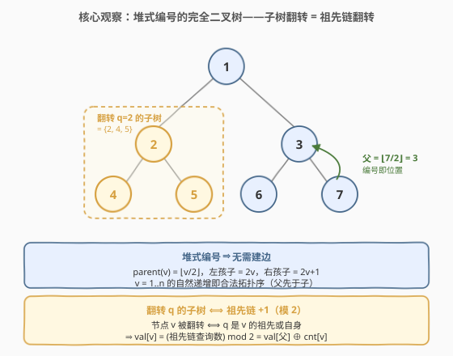
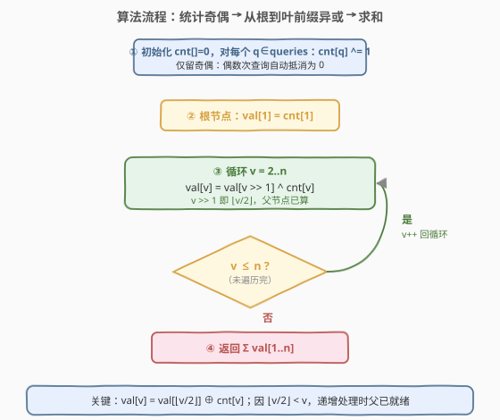

# 值为 1 的节点数

- **题目名称**：值为 1 的节点数
- **链接**：[2445. 值为 1 的节点数](https://leetcode.cn/problems/number-of-nodes-with-value-one/)
- **难度**：中等
- **标签**：树、位运算、数组、深度优先搜索

## 1. 题目概述

有一棵 **无向** 树，含 $n$ 个节点，编号 $1$ 到 $n$，共 $n-1$ 条边。**节点 $v$ 的父节点编号为 $\lfloor v/2 \rfloor$**，根节点为 $1$。

> 💡 这其实是一棵**按堆下标编号的完全二叉树**：节点 $v$ 的左孩子是 $2v$、右孩子是 $2v+1$，父节点是 $\lfloor v/2 \rfloor$。树的形态完全由编号决定，**无需建边**。

给定整数数组 `queries`。初始每个节点的值都是 $0$。对每个查询 `queries[i]`，**翻转** `queries[i]` **子树内所有节点的值**（$0 \to 1$，$1 \to 0$）。处理完所有查询后，返回值为 $1$ 的节点总数。

**示例 1**：

```text
输入：n = 5, queries = [1,2,5]
输出：3
解释：树：1 的孩子 2、3；2 的孩子 4、5。
  查询 1 → 翻转 {1,2,3,4,5}，全部变 1
  查询 2 → 翻转 {2,4,5}，2、4、5 变 0
  查询 5 → 翻转 {5}，5 变 1
  最终：1=1, 2=0, 3=1, 4=0, 5=1 → 三个 1。
```

**示例 2**：

```text
输入：n = 3, queries = [2,3,3]
输出：1
解释：树：1 的孩子 2、3。
  查询 2 → 翻转 {2}，2 变 1
  查询 3 → 翻转 {3}，3 变 1
  查询 3 → 翻转 {3}，3 变 0（翻转两次抵消）
  最终：1=0, 2=1, 3=0 → 一个 1。
```

**约束条件**：

- $1 \le n \le 10^5$
- $1 \le \text{queries.length} \le 10^5$
- $1 \le \text{queries}[i] \le n$

> 💡 **题眼**：翻转是「模 2」操作——同一子树翻转两次等于没翻。而一个节点是否被翻转，取决于**从根到它的祖先链上有多少次查询**。这两点合起来，把「逐次翻子树」压缩成「沿祖先链做一次前缀异或」。

---

## 2. 解题思路

### 2.1 暴力思路：逐次 DFS 翻转子树

最直白的做法：对每个查询，DFS/BFS 遍历该节点的整棵子树逐个翻转，最坏 $O(q \cdot n)$。

一个常见优化：**只关心翻转次数的奇偶**。把 `queries` 按节点计数，仅对「被查询奇数次」的节点各做一次子树翻转。完全二叉树形态下，总工作量 $\sum|\text{子树}| = O(n \log n)$。

> 💡 转机：若再想一步——「节点 $v$ 被翻转的总次数」就是「从根到 $v$ 路径上、被查询过的节点数」。于是不必真去翻任何子树，沿祖先链做一次前缀异或即可，$O(n)$ 终。

### 2.2 核心观察：祖先链前缀异或 → val[v] = val[父] ⊕ cnt[v]



**三个关键事实**：

1. **树是堆式编号的完全二叉树**：父节点 $\text{par}(v) = \lfloor v/2 \rfloor$，左孩子 $2v$、右孩子 $2v+1$。形态由编号给出，无需建边。
2. **翻转是模 2 运算**：翻同一子树偶数次相互抵消，只留奇偶。记 $\text{cnt}[v]$ 为「节点 $v$ 作为查询目标的次数」的奇偶（$0/1$）。
3. **节点 $v$ 被翻转的总次数 = 根到 $v$ 路径上被查询的节点数**（含 $v$）。因为「翻转 $q$ 的子树」波及 $v$，当且仅当 $q$ 是 $v$ 的祖先（或 $v$ 自己）。

由 2、3 得，节点 $v$ 的最终值
$$\text{val}[v] = \bigoplus_{u \in \text{anc}(v)} \text{cnt}[u] \pmod 2,$$
其中 $\text{anc}(v)$ 是从根到 $v$ 的祖先链（含两端），$\oplus$ 为异或（即 GF(2) 加法）。

> ⚠️ **决定性递推**：把「整条祖先链的异或」拆成「父亲链的异或」与「自己」两部分：
> $$\text{val}[v] = \text{val}[\text{par}(v)] \oplus \text{cnt}[v].$$
> 由堆式编号 $\text{par}(v) = \lfloor v/2 \rfloor < v$，故**按 $v = 1, 2, \dots, n$ 递增处理时，父节点的 val 必已算出**——一次线性扫描即可，无需建图、无需 DFS。

### 2.3 算法流程图



只需一遍扫描，维护两个数组 `cnt`、`val`：

1. **统计奇偶**：`cnt[v]` 初始为 $0$；对每个 `q = queries[i]` 执行 `cnt[q] ^= 1`（异或自带「奇偶翻转」语义，偶数次自动归零）。
2. **根节点**：`val[1] = cnt[1]`（根无祖先，链异或就是它自己）。
3. **递推** $v = 2 \to n$：`val[v] = val[v >> 1] ^ cnt[v]`（`v >> 1` 即 $\lfloor v/2 \rfloor$，已算）。
4. **返回** $\sum_{v=1}^{n} \text{val}[v]$（`val` 全是 $0/1$，求和即 1 的个数）。

> 💡 **为什么用异或而不是加法取模？** 翻转天然在 $\mathbb{F}_2$ 上运算：$0\oplus 0=0$、$0\oplus 1=1$、$1\oplus 1=0$，正好刻画「翻偶数次抵消、奇数次有效」。用 `^` 既省去 `% 2`，又自动保证结果为 $0/1$，是最贴合题意的写法。

### 2.4 示例演算

![示例演算：n=5, queries=[1,2,5] 的祖先链前缀异或](../images/valone_example_walkthrough.svg)

- **示例 1** $n=5,\ \text{queries}=[1,2,5]$：`cnt` 中仅 $1,2,5$ 为 $1$，其余为 $0$。

| $v$ | $\text{par}(v)$ | $\text{cnt}[v]$ | $\text{val}[v]=\text{val}[\text{par}]\oplus\text{cnt}[v]$ |
|-----|-----------------|------------------|----------------------------------------------------------|
| 1   | —（根）          | 1                | $1$                                                       |
| 2   | 1               | 1                | $1\oplus 1=0$                                             |
| 3   | 1               | 0                | $1\oplus 0=1$                                             |
| 4   | 2               | 0                | $0\oplus 0=0$                                             |
| 5   | 2               | 1                | $0\oplus 1=1$                                             |

  求和 $1+0+1+0+1=3$，与「逐次翻子树」结果一致。

- **示例 2** $n=3,\ \text{queries}=[2,3,3]$：`cnt` 中 $2$ 为 $1$，$3$ 因被查两次为 $0$。
  - $\text{val}[1]=0$；$\text{val}[2]=\text{val}[1]\oplus 1=1$；$\text{val}[3]=\text{val}[1]\oplus 0=0$。
  - 求和 $=1$。节点 $3$ 被「查询 3」翻两次正好抵消——这正是「模 2」语义的体现。

> ⚠️ **反直觉点**：查询 $3$ 出现两次，看似要「翻再翻回」，但 `cnt[3]` 异或两次直接归零，**根本不会进入递推**——这比「先翻再翻回」省下整趟子树遍历。

---

## 3. 参考代码

### C++

```cpp
class Solution {
public:
    int numberOfNodes(int n, vector<int>& queries) {
        vector<int> cnt(n + 1, 0), val(n + 1, 0);
        for (int q : queries) cnt[q] ^= 1;            // 只留奇偶：偶数次自动抵消
        val[1] = cnt[1];                                // 根节点链异或 = 自己
        for (int v = 2; v <= n; ++v)
            val[v] = val[v >> 1] ^ cnt[v];              // par = ⌊v/2⌋，已算
        return accumulate(val.begin() + 1, val.end(), 0);
    }
};
```

### Python

```python
class Solution:
    def numberOfNodes(self, n: int, queries: List[int]) -> int:
        cnt = [0] * (n + 1)
        for q in queries:
            cnt[q] ^= 1                                # 只留奇偶
        val = [0] * (n + 1)
        val[1] = cnt[1]
        for v in range(2, n + 1):
            val[v] = val[v >> 1] ^ cnt[v]               # par = v//2，已算
        return sum(val[1:])
```

> 💡 C++ 中 `cnt`、`val` 用 `vector<int>` 即可（元素仅 $0/1$，无溢出风险）；`accumulate` 对 `[1, n]` 求和得 1 的个数。Python 整数天然任意精度，`^` 与列表切片同样直观。

---

## 4. 复杂度分析

| 维度 | 复杂度 | 说明 |
|------|--------|------|
| **时间复杂度** | $O(n + q)$ | 统计 `cnt` 遍历 `queries` 一次 $O(q)$；递推 `val` 遍历 $v=2..n$ 一次 $O(n)$；求和 $O(n)$ |
| **空间复杂度** | $O(n)$ | 两个长度 $n+1$ 的数组 `cnt`、`val` |

> ⚠️ 对比暴力：逐次翻子树 $O(q\cdot n)$；「按奇偶去重 + 逐子树 DFS」$O(n\log n)$（完全二叉树各子树大小之和）。前缀异或把整棵树的翻转压缩成一次线性扫描，是渐近最优。

---

## 5. 扩展：任意树形与「子树更新 → 路径前缀」的对偶

**推广到任意树**：若父节点不再是 $\lfloor v/2\rfloor$（一般树形，给定 `parents` 数组），做法不变——只需先把树变成「可按拓扑序处理」的形式：从根做一次 BFS/DFS，得到每个节点的父亲与一个「父先于子」的处理顺序，然后照样
$$\text{val}[v] = \text{val}[\text{par}(v)] \oplus \text{cnt}[v].$$
堆式编号的妙处只是**把这次 BFS 省了**：$v=1..n$ 的自然递增就是合法拓扑序。

**对偶视角**：「翻转 $q$ 的子树」从子树看是「子树批量加 $1$」，从节点 $v$ 看是「祖先链批量加 $1$」——这正是树上差分的经典对偶。本题里「子树加」被转成「路径前缀」，再用 $\mathbb{F}_2$ 折叠成异或，于是 $O(n)$ 终。若把翻转改成不可折叠的运算（如「子树求和查询」），则需 Euler 序（DFS 入/出时间）把子树映成连续区间，再用树状数组维护。

> 💡 **一句话**：堆式编号给了「免建图的拓扑序」，模 2 翻转给了「前缀异或」的折叠性——两者叠加，得到 $O(n)$ 的优雅解。

---

## 6. 面试要点

1. **为什么翻转只看奇偶？**

   - 翻转 $0\leftrightarrow 1$ 是 $\mathbb{F}_2$ 上的加 $1$：翻两次 $=0$、翻偶数次 $=0$、翻奇数次 $=1$。所以 `cnt[v]` 只需存奇偶位，`cnt[q] ^= 1` 即「再来一次」。

2. **为什么 $\text{val}[v]=\text{val}[\text{par}(v)]\oplus\text{cnt}[v]$？**

   - 节点 $v$ 被翻转的总次数 = 祖先链 $\text{anc}(v)$ 上的查询数之和（含 $v$）。把链拆成「$\text{anc}(\text{par}(v))$ 的查询异或」与「$v$ 自己的 $\text{cnt}[v]$」，前者恰为 $\text{val}[\text{par}(v)]$，故得递推。模 2 下「和」即「异或」。

3. **为什么按 $v=1..n$ 递增处理一定合法？**

   - 堆式编号下 $\text{par}(v)=\lfloor v/2\rfloor < v$（$v\ge 2$），故遍历到 $v$ 时 $\text{val}[\text{par}(v)]$ 必已就绪。这就是「免建图、免 DFS」的根源——编号天然给出拓扑序。

4. **同一节点被查询多次会不会出错？**

   - 不会。`cnt[q] ^= 1` 把偶数次查询自动折成 $0$，递推时该项不贡献。示例 2 中查询 $3$ 出现两次，`cnt[3]=0`，$\text{val}[3]=\text{val}[1]\oplus 0=0$，与「先翻再翻回」一致。

5. **若树不是堆式编号（给 `parents`），算法怎么改？**

   - 先从根 BFS/DFS 得到「父先于子」的顺序与父亲数组，再按该顺序执行同样的递推。复杂度仍 $O(n+q)$。堆式编号只是把这个预处理省掉了。

> 💡 **一句话总结**：翻转是模 2、子树翻转等价祖先链翻转，于是 $\text{val}[v]=\text{val}[\lfloor v/2\rfloor]\oplus\text{cnt}[v]$，沿 $1..n$ 一遍扫描 $O(n)$ 终。

---

## 7. 同类练习题

- [2433. 找出前缀异或的原始数组](https://leetcode.cn/problems/find-the-original-array-of-prefix-xor/)（[题解](2433_找出前缀异或的原始数组.md)）：`a[i]=pref[i]⊕pref[i−1]`，与本题 `val[v]=val[父]⊕cnt[v]` 同为「子项=父项⊕增量」的前缀异或重建（⊕ 即模 2 加法）
- [662. 二叉树最大宽度](https://leetcode.cn/problems/maximum-width-of-binary-tree/)（[题解](../0601-0700/662_二叉树最大宽度.md)）：BFS 用「左子=2i、右子=2i+1」的堆式编号；与本题 `parent=⌊v/2⌋` 同源，编号即位置
- [222. 完全二叉树的节点个数](https://leetcode.cn/problems/count-complete-tree-nodes/)（[题解](../0201-0300/222_完全二叉树的节点个数.md)）：利用完全二叉树的结构性质，判断子树是否满即可二分计数
- [958. 二叉树的完全性检验](https://leetcode.cn/problems/check-completeness-of-a-binary-tree/)（[题解](../0901-1000/958_二叉树的完全性检验.md)）：层序判定完全二叉树，帮助理解堆式编号的边界
- [1720. 解码异或后的数组](https://leetcode.cn/problems/decode-xored-array/)：入门版前缀异或重建 `first[i]=first[i−1]⊕encoded[i−1]`，本题是其从「链」到「完全二叉树」的树形推广
