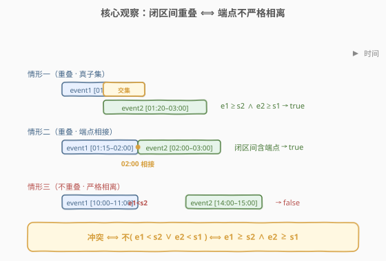
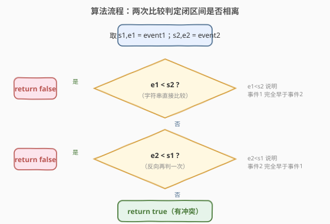
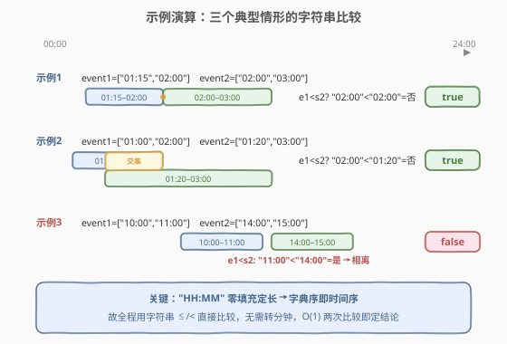

# LeetCode 判断两个事件是否存在冲突 题解

## 1. 题目概述

- **标题 / 题号**：判断两个事件是否存在冲突（#2446，easy）
- **链接**：https://leetcode.cn/problems/determine-if-two-events-have-conflict/
- **难度**：简单
- **标签**：数组、字符串、区间调度

**题意**：给定两个长度均为 $2$ 的字符串数组 `event1` 与 `event2`，表示同一天发生的两个**闭区间**时间段事件：

- `event1 = [startTime1, endTime1]`
- `event2 = [startTime2, endTime2]`

时间均为有效的 24 小时制，按 `HH:MM` 格式给出。当两个事件存在某个**非空的交集**（即某些时刻同时被两个事件包含）时，认为出现**冲突**。返回 `true` 表示有冲突，否则 `false`。

**示例 1**：

```text
输入：event1 = ["01:15","02:00"], event2 = ["02:00","03:00"]
输出：true
解释：两个事件在 02:00 出现交集。
```

**示例 2**：

```text
输入：event1 = ["01:00","02:00"], event2 = ["01:20","03:00"]
输出：true
解释：两个事件的交集从 01:20 开始，到 02:00 结束。
```

**示例 3**：

```text
输入：event1 = ["10:00","11:00"], event2 = ["14:00","15:00"]
输出：false
解释：两个事件不存在交集。
```

**约束**：

- $\text{event1.length} == \text{event2.length} == 2$
- $\text{event1}[i].length == \text{event2}[i].length == 5$
- $\text{startTime1} \le \text{endTime1}$，$\text{startTime2} \le \text{endTime2}$
- 所有时间均为合法 `HH:MM` 格式

> 💡 **题眼**：两个事件都是**闭区间** $[s_1,e_1]$、$[s_2,e_2]$，"有冲突"就是"闭区间相交"——这是一个只问"是/否"、不问交多久的**区间相交判定**。闭区间相交的充要条件是一条**端点不等式**，且 `HH:MM` 是零填充定长串，字典序即时间序，于是连转分钟都可省去。

## 2. 解题思路

### 2.1 暴力思路：转分钟逐刻扫描

最直白的做法：把 `HH:MM` 解析成"自 00:00 起的分钟数"，得到四个整数 $S_1,E_1,S_2,E_2$。然后判定闭区间是否相交。

甚至可以更"笨"：枚举一天 $1440$ 分钟，看是否存在某分钟同时落在两个闭区间内——$O(1440)$ 能 AC，但把"一个不等式能解决的事"拆成了逐刻扫描。

> ⚠️ 暴力把"区间相交"当成"逐点求交"，掩盖了"端点比较即可定结论"的结构。其实只需**两次端点比较**，无需任何遍历、无需转分钟。

### 2.2 核心观察：闭区间相离 ⟺ 一方端点严格在前



记两区间为 $[s_1,e_1]$ 与 $[s_2,e_2]$。关键事实：**两个闭区间不相交，当且仅当其中一个整个在另一个的左侧**——即

$$
\text{不相交} \iff e_1 < s_2 \;\;\vee\;\; e_2 < s_1.
$$

对它取反（德摩根）即得**冲突的充要条件**：

$$
\boxed{\text{冲突} \iff e_1 \ge s_2 \;\;\wedge\;\; e_2 \ge s_1.}
$$

> 💡 **为什么闭区间端点相等也算冲突？** 闭区间含端点：$[s_1,e_1]$ 与 $[s_2,e_2]$ 在 $e_1 = s_2$ 这一刻同时取到，故该时刻非空，算冲突。示例 1 正是 $e_1 = s_2 = $`02:00` 的相接情形。若题改成开区间（端点不算），则需用严格 $>$、$<$ 判相离。

**第二个关键观察——字符串可直接比较**：`HH:MM` 是**定长 5 位、零填充**的格式（如 `09:05`），其字典序与时间先后**完全一致**：先比"时"两位、再比"分"两位，逐位都是数值比较。故 `"01:15" < "02:00"`、`"11:00" < "14:00"` 等直接用字符串 `<`/`<=` 即可，**无需解析成分钟数**。

> ⚠️ 这是"定长零填充表示 ⟹ 字典序 = 数值序"的常用结论。若时间是 `"9:5"` 这种非零填充写法，字典序就失效（`"9:5" > "10:00"` 字典序更大但时间更早），必须先归一化。本题已保证 `HH:MM` 恰 5 位，故安全。

### 2.3 算法流程图



只需两步端点比较：

1. **先看事件1是否整个早于事件2**：若 $e_1 < s_2$，则事件1结束于事件2开始之前，**严格相离**，返回 `false`。
2. **否则反向再看**：若 $e_2 < s_1$，则事件2整个早于事件1，**严格相离**，返回 `false`。
3. **两条件都不成立**：即 $e_1 \ge s_2 \wedge e_2 \ge s_1$，闭区间相交，返回 `true`。

> 💡 也可写成**正向合并形式** `return !(e1 < s2 || e2 < s1)`，或等价的 `return e1 >= s2 && e2 >= s1`。两者互为德摩根对偶，语义一致。面试中正向形式（"两个不等式同时成立"）更直观、不易在边界写错符号。

### 2.4 示例演算



- **示例 1** $e_1=$`"02:00"`, $s_2=$`"02:00"`：`e1 < s2` ⟹ `"02:00" < "02:00"` 为**假**；`e2 < s1` ⟹ `"03:00" < "01:15"` 为假。两条件都不相离 ⟹ **冲突**，返回 `true`。两事件恰在 `02:00` 相接。
- **示例 2** $e_1=$`"02:00"`, $s_2=$`"01:20"`：`"02:00" < "01:20"` 为假（时位 `02 > 01`）；`e2 < s1` ⟹ `"03:00" < "01:00"` 为假。**冲突**，返回 `true`。交集为 `[01:20, 02:00]`。
- **示例 3** $e_1=$`"11:00"`, $s_2=$`"14:00"`：`"11:00" < "14:00"` 为**真**（时位 `11 < 14`）⟹ 事件1整个早于事件2，**相离**，立即返回 `false`，无需再判第二个条件。

> ⚠️ 注意示例 3 的短路：一旦 `e1 < s2` 成立即可早退返回 `false`，第二个比较 `e2 < s1` 根本不执行。最坏情形（实际有冲突）才需两次比较，仍是 $O(1)$。

## 3. 参考代码

### C++

```cpp
class Solution {
public:
    bool haveConflict(vector<string>& event1, vector<string>& event2) {
        // 闭区间 [s1,e1] 与 [s2,e2] 相交 ⟺ e1 >= s2 && e2 >= s1
        return event1[0] <= event2[1] && event2[0] <= event1[1];
    }
};
```

> 💡 `event1[0]`/`event1[1]` 即 $s_1$/$e_1$。字符串 `<=` 直接比较，因 `HH:MM` 零填充定长，字典序即时间序。也可写成取反形式 `return !(event1[1] < event2[0] || event2[1] < event1[0]);`，与正向形式等价。

### Python

```python
class Solution:
    def haveConflict(self, event1: List[str], event2: List[str]) -> bool:
        # 字符串直接比较：HH:MM 零填充 ⇒ 字典序即时间序
        return event1[0] <= event2[1] and event2[0] <= event1[1]
```

> 💡 Python 字符串 `<`/`<=` 同样基于字典序，零填充 `HH:MM` 下与时间序一致，无需 `int(t[:2])*60 + int(t[3:])` 转分钟。若题目放宽时间格式（非零填充），则须先归一化或转分钟再比较。

## 4. 复杂度分析

| 维度 | 复杂度 | 说明 |
|------|--------|------|
| **时间复杂度** | $O(1)$ | 至多两次定长（5 字符）字符串比较，每比较 $O(5)=O(1)$，整体常数时间 |
| **空间复杂度** | $O(1)$ | 仅用下标访问，无额外数据结构 |

> 💡 对比：转分钟逐刻扫描法把判定拆成 $O(1440)$ 遍历，常数大且掩盖结构；转分钟 + 不等式法虽也是 $O(1)$，但多一次解析。字符串直比法把"解析"也省了，是渐近与常数双最优。

## 5. 扩展：区间相交 vs 区间重叠面积

本题只问"是否相交"（布尔判定），故端点不等式足够。若问题升级为：

1. **求交集时长**：需把端点转成可减的数值（分钟），$\text{len} = \min(e_1,e_2) - \max(s_1,s_2)$，当 $\min \ge \max$ 时为正即为交集长度。
2. **半开区间 $[s,e)$ 相交**：端点相等**不算**重叠（右端点不含），相离条件改为 $e_1 \le s_2 \vee e_2 \le s_1$，把"严格 $<$"换成"$\le$"即可——这正是排程/资源预约系统常用的"右端点可被下一事件复用"语义。
3. **多个区间求最大重叠数**：差分扫描线——把所有端点按时刻排序、开始 +1 结束 -1，扫一遍取前缀和最大值，$O(n\log n)$。本题是其 $n=2$ 的退化特例。

> 💡 闭区间与半开区间的区别只在端点处：闭区间相交用 $e_1 \ge s_2 \wedge e_2 \ge s_1$（含等号），半开用 $e_1 > s_2 \wedge e_2 > s_1$（严格）。写代码时务必看清题目对端点"相接"是否算冲突的约定。

## 6. 面试要点

1. **为什么闭区间相交用 $e_1 \ge s_2 \wedge e_2 \ge s_1$，端点要带等号？**

   > 闭区间含端点。若 $e_1 = s_2$，则该时刻同时属于两区间，交集非空，算冲突。故"不相离"条件须含等号；只有"严格相离"$e_1 < s_2$ 才算不交。示例 1 即 $e_1=s_2$ 的相接冲突。

2. **为什么字符串可以直接比较，不用转分钟？**

   > `HH:MM` 是定长 5 位且零填充（如 `09:05`）。字典序逐位比较字符 ASCII，而 `0`–`9` 的 ASCII 序与数值序一致，故先比时位再比分位的结果与时间先后完全吻合。前提是"定长 + 零填充"；若存在 `"9:5"` 这类变长写法则失效，必须先归一化为 `HH:MM` 或转分钟。

3. **正向形式 `e1 >= s2 && e2 >= s1` 和取反形式 `!(e1 < s2 || e2 < s1)` 哪个更好？**

   > 二者等价（德摩根对偶）。正向形式直接表达"两区间都跨过对方起点"，语义直观、不易写反不等号；取反形式从"相离"出发再取反，思路是"排除不交"。面试建议用正向形式，边界符号更不易出错，且天然短路（`&&` 有一假即停）。

4. **能否只比一次就定结论？**

   > 不能。需两个方向各判一次：$e_1 < s_2$ 只能排除"事件1整个早于事件2"，排除不了"事件2整个早于事件1"（即 $e_2 < s_1$）。两次比较覆盖两种相离方向，缺一不可。但单次比较即可短路返回 `false`，最坏（真冲突）才需两次。

5. **若改成多个区间求是否有任意两两冲突，怎么做？**

   > 把"是否有任两区间相交"等价于"是否有区间在排起点后仍与前一个重叠"。先按起点排序，再线性扫描维护"已扫区间的最大终点" $r$：若当前区间 $s_i < r$（闭区间用 $<$ 仍相交，因 $s_i \le r$ 即可，注意含等号），则与前段冲突。$O(n\log n)$。本题是 $n=2$ 的退化，排序退化为单次比较。

> 💡 **一句话总结**：两闭区间冲突 $\iff e_1 \ge s_2 \wedge e_2 \ge s_1$；`HH:MM` 零填充使字符串字典序即时间序，直接比较端点 $O(1)$ 搞定，端点相接算冲突。

## 同类练习题

| # | 题目 | 与本题的关联 |
|---|------|-------------|
| 56 | [合并区间](https://leetcode.cn/problems/merge-intervals/)（[题解](../0001-0100/56_合并区间.md)） | 区间相交判定的进阶应用，按起点排序后用"上一终点 ≥ 当前起点"判重叠并合并，与本题端点不等式同源 |
| 986 | [区间列表的交集](https://leetcode.cn/problems/interval-list-intersections/)（[题解](../0901-1000/986_区间列表的交集.md)） | 双指针求两个有序区间列表的全部交集，本题是其"只判定一次相交、不求交集内容"的 $n=1$ 退化 |
| 435 | [无重叠区间](https://leetcode.cn/problems/non-overlapping-intervals/)（[题解](../0301-0400/435_无重叠区间.md)） | 贪心区间调度，"按右端点排序 + 与前一终点比较判重叠"，与本题的相交判定符号方向一致 |
| 57 | [插入区间](https://leetcode.cn/problems/insert-interval/)（[题解](../0001-0100/57_插入区间.md)） | 在有序无交区间序列中插入新区间并合并，需反复判定"新区间与下一区间是否相交"，沿用本题端点不等式 |
| 1854 | [人口最多的年份](https://leetcode.cn/problems/maximum-population-year/)（[题解](../1801-1900/1854_人口最多的年份.md)） | 把各人生存区间贡献到年份轴上求最大重叠数，是"区间相交判定"从布尔升级到计数/最大重叠数的扩展 |
