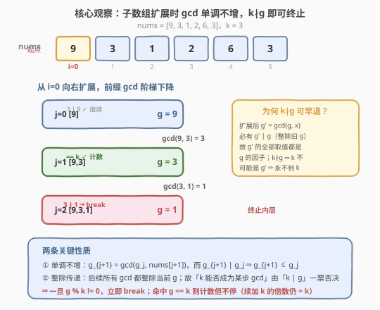
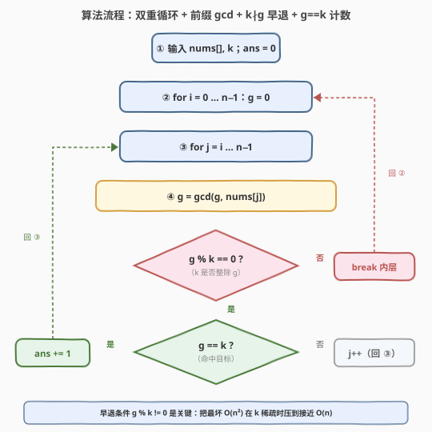
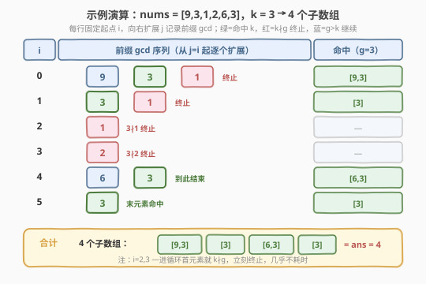

# 最大公因数等于 K 的子数组数目

- **题目名称**：最大公因数等于 K 的子数组数目
- **链接**：[2447. 最大公因数等于 K 的子数组数目](https://leetcode.cn/problems/number-of-subarrays-with-gcd-equal-to-k/)
- **难度**：中等
- **标签**：数组、数学、数论

## 1. 题目概述

给你一个整数数组 `nums` 和一个整数 `k`，统计并返回 `nums` 的**子数组**中元素的最大公因数（GCD）等于 `k` 的子数组数目。

子数组是数组中一个**连续非空**的序列；数组的最大公因数是能整除数组中所有元素的最大整数。

**示例 1**：

```text
输入：nums = [9,3,1,2,6,3], k = 3
输出：4
解释：gcd 等于 3 的子数组有 [9,3]、[3]（下标 1）、[6,3]、[3]（下标 5），共 4 个。
```

**示例 2**：

```text
输入：nums = [4], k = 7
输出：0
解释：不存在 gcd 等于 7 的子数组。
```

**约束条件**：

- $1 \le \texttt{nums.length} \le 1000$
- $1 \le \texttt{nums[i]},\ \texttt{k} \le 10^9$

> 💡 表面是「枚举子数组 + 求 gcd」，但 gcd 随子数组扩展**单调不增**，且后续 gcd 必整除当前 gcd——于是「$k$ 能否成为某步 gcd」可由 $g \bmod k = 0$ 一票否决，得以提前终止内层循环，把朴素 $O(n^2)$ 在 $k$ 稀疏时压到接近 $O(n)$。

---

## 2. 解题思路

### 2.1 暴力思路：枚举所有子数组 + 复用前缀 gcd

朴素做法：枚举每个子数组 $[i, j]$，用辗转相除累出 $\gcd(\text{nums}[i], \dots, \text{nums}[j])$，等于 $k$ 则计数。若每次独立求 gcd 要扫一遍区间，共 $O(n^2)$ 个子数组、每个 $O(n)$，总计 $O(n^3)$，$n \le 1000$ 时 $10^9$ 级，超时。

第一个改进是**复用前缀 gcd**：固定起点 $i$，向右扩展 $j$ 时维护 $g = \gcd(g,\ \text{nums}[j])$，每步 $O(\log V)$（$V = \max \text{nums}$），总 $O(n^2 \log V) \approx 10^6 \times 30$，可 AC。但若就此打住，仍未利用「单调性 + 整除传递」做**早退剪枝**。

> ⚠️ 关键差距：朴素版对每个起点都老老实实扫到底，哪怕 $g$ 早已跌到不可能再等于 $k$ 的位置。下文用两条性质把这种「明知无望仍硬扫」的步数砍掉。

### 2.2 核心观察：gcd 单调不增 + k∤g 即可终止



两条关键性质让内层循环得以提前终止：

- **单调不增**：扩展时 $g_{j+1} = \gcd(g_j,\ \text{nums}[j+1])$，而 $g_{j+1} \mid g_j$（gcd 必整除其操作数），故 $g_{j+1} \le g_j$。gcd 只减不增。
- **整除传递**：后续每一步的 gcd 都整除**当前** $g$（因 $g_{j+1} \mid g_j \mid \cdots \mid g$）。于是「$k$ 能否成为未来某步的 gcd」等价于「$k \mid g$」：
  - 若 $k \mid g$（即 $g \bmod k = 0$），仍有可能在某步收敛到 $k$，继续扩展；
  - 若 $k \nmid g$（$g \bmod k \ne 0$），则 $k$ 不是 $g$ 的因子，而未来所有 gcd 都是 $g$ 的因子，**永远到不了** $k$，立刻 `break`。

**计数但不停止**：当 $g = k$ 时计数 $+1$，但**不能 break**——后续若加入 $k$ 的倍数，gcd 仍维持 $k$，这些更长的子数组同样合法。例如 $\text{nums}=[6,3,9],\ k=3$：$g_0=6$（$3\mid6$ 继续），$g_1=\gcd(6,3)=3$（命中），$g_2=\gcd(3,9)=3$ 仍命中，$[6,3,9]$ 也算一个。

> 💡 **为什么早退如此有效？** 只要遇到不被 $k$ 整除的元素（如示例中 $i=2$ 处的 $1$、$i=3$ 处的 $2$），该起点内层循环第一步就 break。极端情形 $k=1$ 时一切都被 $1$ 整除、永不 break，此时答案可达 $\Theta(n^2)$（输出本身就那么大），$O(n^2)$ 即该情形下界，本算法此时最优。

### 2.3 算法流程图



伪代码骨架：

```text
ans = 0
for i in 0..n-1:
    g = 0
    for j in i..n-1:
        g = gcd(g, nums[j])
        if g % k != 0: break     # k 不整除 g，后续永不可能等于 k
        if g == k: ans += 1      # 命中；勿 break，续加 k 的倍数仍 = k
return ans
```

> ⚠️ 两个易错点：① `g` 初值取 $0$，利用 $\gcd(0, x) = x$ 让首个元素直接进位；② `break` 判据用 `g % k != 0` 而非 `g < k`——当 $g > k$ 但 $k \nmid g$（如 $g=8,\ k=3$）时 `g < k` 不成立却仍应早退，只有 `g % k` 能正确捕获。

### 2.4 示例演算



以 $\text{nums}=[9,3,1,2,6,3],\ k=3$ 为例，逐起点展开（$g$ 初值 $0$）：

| $i$ | $j$ 扩展路径 | 前缀 gcd 序列 | 命中子数组 |
|-----|-------------|--------------|-----------|
| 0 | $0 \to 1 \to 2$ | $9,\ 3,\ 1$ | $[9,3]$（$g=3$ ✓） |
| 1 | $1 \to 2$ | $3,\ 1$ | $[3]$（$g=3$ ✓） |
| 2 | $2$ | $1$ | —（$3 \nmid 1$，break） |
| 3 | $3$ | $2$ | —（$3 \nmid 2$，break） |
| 4 | $4 \to 5$ | $6,\ 3$ | $[6,3]$（$g=3$ ✓） |
| 5 | $5$ | $3$ | $[3]$（$g=3$ ✓） |

合计 **4 个**：$[9,3],\ [3]_{i=1},\ [6,3],\ [3]_{i=5}$ ✓。

> 💡 注意 $i=0$ 处 $g=9>3$ 但 $3\mid9$ 故继续，下一步入 $g=3$ 命中——这正是「$g>k$ 不一定 break，要看 $k\mid g$」的体现；而 $i=2,3$ 首元素就 $k\nmid g$，内层只跑一步即终止。

---

## 3. 参考代码

### C++

```cpp
class Solution {
public:
    int subarrayGCD(vector<int>& nums, int k) {
        int n = nums.size(), ans = 0;
        for (int i = 0; i < n; ++i) {
            int g = 0;
            for (int j = i; j < n; ++j) {
                g = gcd(g, nums[j]);
                if (g % k != 0) break;   // k 不整除 g，后续永不可能等于 k
                if (g == k) ++ans;       // 命中；勿 break，续加 k 的倍数仍 = k
            }
        }
        return ans;
    }
};
```

> 💡 `gcd` 来自 `<numeric>`（C++17），$\gcd(0, x) = x$。`g % k` 用 `int` 安全：$g \le \max(\text{nums}) \le 10^9$，结果 $< k \le 10^9$，而 `int` 上界 $\approx 2.1 \times 10^9$，无溢出。若平台 `nums[i]` 接近 $2 \times 10^9$，可把 `g` 与取余都改 `long long` 自保。

### Python

```python
import math
from typing import List

class Solution:
    def subarrayGCD(self, nums: List[int], k: int) -> int:
        n = len(nums)
        ans = 0
        for i in range(n):
            g = 0
            for j in range(i, n):
                g = math.gcd(g, nums[j])
                if g % k != 0:      # k 不整除 g，后续永不可能等于 k
                    break
                if g == k:          # 命中；勿 break，续加 k 的倍数仍 = k
                    ans += 1
        return ans
```

> 💡 Python 的 `math.gcd(0, x) = abs(x)`，正整数场景即 `x`。整除判定 `g % k != 0` 与 C++ 同义。$n \le 1000$，双层循环 + 早退在 Python 也轻松 AC。

---

## 4. 复杂度分析

| 维度 | 复杂度 | 说明 |
|------|--------|------|
| **时间复杂度** | $O(n^2 \log V)$ 最坏；实际接近 $O(n \log V)$ | $V = \max \text{nums}$。单步 gcd 为 $O(\log V)$；最坏（如 $k=1$）需枚举全部 $O(n^2)$ 子数组；$k$ 稀疏时多数起点一步即 break |
| **空间复杂度** | $O(1)$ | 仅常数变量 $g,\ i,\ j,\ \text{ans}$ |
| 对照：朴素 $O(n^3)$ | $O(n^3)$ | 每个子数组独立求 gcd，不复用前缀 |
| 对照：去重 gcd 段表 | $O(n \log V)$ | 见第 5 节，理论更优但 $n \le 1000$ 无必要 |

> 💡 关键在**早退条件 $g \bmod k \ne 0$** 的剪枝：每个起点一旦遇到「非 $k$ 倍数链」即停。最坏情形 $k=1$（恒被整除、永不 break）答案本身可达 $\Theta(n^2)$ 个，故 $O(n^2)$ 已是该情形下界，本算法此时最优。

---

## 5. 扩展：去重 gcd 段——把 $O(n^2)$ 压到 $O(n \log V)$

当 $n$ 放大到 $10^5$，$O(n^2)$ 不可行，可改用**「以结尾位置聚合的 gcd 段」**技巧。核心事实：以 $j$ 结尾的所有子数组，其 gcd 取值至多 $O(\log V)$ 种——因 gcd 每变一次至少折半（$g' \mid g$ 且 $g' < g \Rightarrow g' \le g/2$）。

**状态**：维护以**上一位置**结尾的子数组 gcd 去重表 `prev = [(g, cnt), ...]`（按 $g$ 降序，长度 $O(\log V)$）。处理 `nums[j]` 时把每段 $g$ 与 `nums[j]` 再求 gcd、合并相同值，并补上 `[nums[j]]` 这个长度为 1 的新段：

```text
cur = []
for (g, cnt) in prev:
    ng = gcd(g, nums[j])
    if cur and cur[-1].g == ng: cur[-1].cnt += cnt   # 合并相同 gcd
    else: cur.append((ng, cnt))
if cur and cur[-1].g == nums[j]: cur[-1].cnt += 1    # 长度为 1 的子数组
else: cur.append((nums[j], 1))
ans += sum(cnt for g, cnt in cur if g == k)          # 累加命中段
prev = cur
```

相邻 gcd 要么相等（合并）要么严格变小（折半），`cur` 长度 $O(\log V)$，全程 $O(n \log V)$。本题 $n \le 1000$ 用不上，但这是「子数组 gcd 计数」的标准最优解，迁移到 $n = 10^5$ 的变体（如「不同子数组 gcd 的数目」）即派上用场。

> 💡 该技巧与 **713 乘积小于 K 的子数组**的滑窗、**53 最大子数组和**的 Kadane 同属「子数组 + 单调聚合量」家族，只是聚合算子不同（gcd 不增 / 正数乘积单调增 / 求和可正可负），剪枝手段各异。

---

## 6. 面试要点

1. **为什么 gcd 随子数组扩展单调不增？**

   > $g_{j+1} = \gcd(g_j,\ \text{nums}[j+1])$。由 gcd 定义 $g_{j+1} \mid g_j$（gcd 必整除每个操作数），故 $g_{j+1} \le g_j$。直观上：候选公因子集合随元素增多只会**收缩**（每加一个数，对公因子提出更多约束），最大者自然不增。

2. **早退条件为什么是 `g % k != 0` 而不是 `g < k`？**

   > `g < k` 只覆盖「gcd 已跌到 $k$ 以下」这一支；漏掉「$g > k$ 但 $k \nmid g$」（如 $g=8,\ k=3$）——此时 $g$ 不含因子 $k$，后续 gcd 整除 $g$ 故也都不含 $k$，应早退。正确判据是「$k$ 是否还能成为未来 gcd」，即 $k \mid g$，对应 `g % k == 0`。

3. **命中 $g == k$ 时为什么不 break？**

   > gcd 命中 $k$ 后，若续加 $k$ 的倍数，新 $g' = \gcd(k,\ \text{$k$ 的倍数}) = k$ 不变，仍是合法子数组。break 会漏数这些更长子数组。如 $[6,3,9],\ k=3$：$[6,3]$ 与 $[6,3,9]$ 都应计。只有 `g % k != 0`（$k \nmid g$）才 break。

4. **`g` 初值为何取 0？`gcd(0, x)` 是多少？**

   > 数论约定 $\gcd(0, x) = |x|$（0 被任何非零整数整除）。取 $g = 0$ 让首步 $g = \gcd(0,\ \text{nums}[i]) = \text{nums}[i]$ 自然进位，无需特判 $j = i$。C++17 `std::gcd` 与 Python `math.gcd` 都遵循此约定。

5. **数据规模 $n \le 1000$ 为何选 $O(n^2)$ 而非 $O(n \log V)$ 段表？**

   > $n^2 = 10^6$，配 gcd 的 $O(\log V) \approx 30$，约 $3 \times 10^7$ 次运算，毫秒级 AC，代码极简、不易错。段表虽理论 $O(n \log V)$，但常数大、实现复杂、合并逻辑易出 bug，在 $n \le 1000$ 属过度优化。选型应匹配数据规模，面试中先给 $O(n^2)$ 再口述段表优化即可。

> 💡 **一句话总结**：固定起点维护前缀 gcd，`g % k != 0` 即 break、`g == k` 则计数但勿停——利用「gcd 单调不增 + 整除传递」把朴素 $O(n^2)$ 在 $k$ 稀疏时剪到接近 $O(n)$，$O(1)$ 空间。

---

## 7. 同类练习题

- [713. 乘积小于 K 的子数组](https://leetcode.cn/problems/subarray-product-less-than-k/)（[题解](../0701-0800/713_乘积小于K的子数组.md)）：同为「子数组计数 + 单调聚合量」，正数乘积单调增用滑窗，对照 gcd 单调不增的早退剪枝
- [2427. 公因子的数目](https://leetcode.cn/problems/number-of-common-factors/)（[题解](../2401-2500/2427_公因子的数目.md)）：gcd 与约数计数基础，承接本题的 $\gcd$ 运算与整除性质
- [1979. 找出数组的最大公约数](https://leetcode.cn/problems/find-greatest-common-divisor-of-array/)（[题解](../1901-2000/1979_找出数组的最大公约数.md)）：数组 $\gcd$ 的直接练习，承接本题对 $\gcd$ 的基本调用
- [914. 卡牌分组](https://leetcode.cn/problems/x-of-a-kind-in-a-deck-of-cards/)（[题解](../0901-1000/914_卡牌分组.md)）：多频率 $\gcd$ 聚合是否 $\ge 2$，对照「两数 gcd」与「多频 gcd 聚合」
- [1071. 字符串的最大公因子](https://leetcode.cn/problems/greatest-common-divisor-of-strings/)（[题解](../1001-1100/1071_字符串的最大公因子.md)）：把 $\gcd$ 从整数推广到字符串（公共前后缀），同为辗转相除思想
