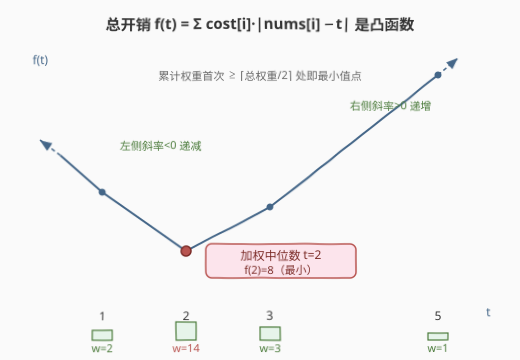
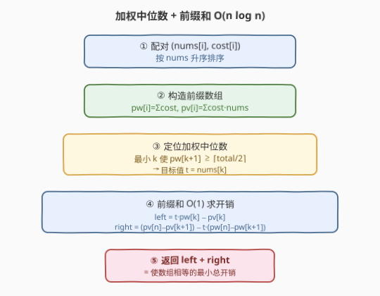
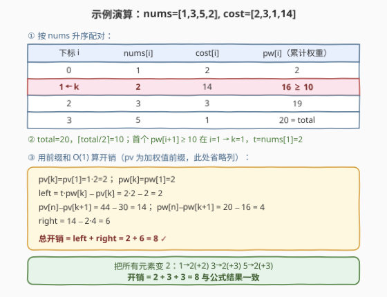

# 使数组相等的最小开销

- **题目名称**：使数组相等的最小开销
- **链接**：[2448. 使数组相等的最小开销](https://leetcode.cn/problems/minimum-cost-to-make-array-equal/)
- **难度**：困难
- **标签**：数组、排序、前缀和、中位数、加权中位数、凸优化

## 1. 题目概述

给你两个下标从 $0$ 开始、长度均为 $n$ 的正整数数组 `nums` 和 `cost`。每次操作可将 `nums` 中任意一个元素 `+1` 或 `-1`，对第 $i$ 个元素执行一次操作的开销是 `cost[i]`。可操作任意次，求使 `nums` 中所有元素**相等**的**最少总开销**。

**示例 1**：

```text
输入：nums = [1,3,5,2], cost = [2,3,1,14]
输出：8
解释：把所有元素变成 2：
  - 第 0 个元素 1→2，操作 1 次，开销 2
  - 第 1 个元素 3→2，操作 1 次，开销 3
  - 第 2 个元素 5→2，操作 3 次，开销 1×3 = 3
  总开销 2 + 3 + 3 = 8。
```

**示例 2**：

```text
输入：nums = [2,2,2,2,2], cost = [4,2,8,1,3]
输出：0
解释：所有元素已相等，无需操作。
```

**约束条件**：

- $n = \text{nums.length} = \text{cost.length}$
- $1 \le n \le 10^5$
- $1 \le \text{nums}[i],\; \text{cost}[i] \le 10^6$
- 答案保证不超过 $2^{53}-1$

> 💡 **关键不变式**：把目标值记为 $t$，总开销函数 $f(t) = \sum_i \text{cost}[i]\cdot|\text{nums}[i]-t|$ 是关于 $t$ 的**分段线性凸函数**。凸函数的极小值出现在「斜率变号」处——即累计权重首次越过总量一半的位置，这正是**加权中位数**。用前缀和把每次求 $f(t)$ 从 $O(n)$ 压到 $O(1)$，整体 $O(n\log n)$。

---

## 2. 解题思路

### 2.1 暴力思路：枚举每个候选目标值

最直白的做法是：目标值 $t$ 一定取某个 $\text{nums}[i]$（凸函数的极小点必落在某个数据点上），于是枚举 $t \in \{\text{nums}[0],\dots,\text{nums}[n-1]\}$，对每个候选 $O(n)$ 求一次 $f(t)$，取最小：

```text
ans = +∞
for t in 去重后的 nums:
    s = Σ cost[i] * |nums[i] - t|   # O(n)
    ans = min(ans, s)
return ans
```

正确性没问题——凸函数的极小点确实在某个断点（即某个 $\text{nums}[i]$）取得。但 $n$ 个候选各 $O(n)$ 求值，总计 $O(n^2)$，对 $n = 10^5$ 必然 TLE。

> ⚠️ 暴力把「每个候选都重新累加一遍」当作必然，却没利用 $f(t)$ 的凸性与单调结构——只需一次定位、$O(1)$ 求值即可。

### 2.2 核心观察：加权中位数 + 前缀和



#### 观察 1：$f(t)$ 是凸函数，极小值在加权中位数

将数对 $(\text{nums}[i], \text{cost}[i])$ 按 $\text{nums}$ 升序排序后，记排序后的值为 $v_1 \le v_2 \le \dots \le v_n$，权重为 $w_1,\dots,w_n$，总权重 $W = \sum w_i$。当 $t$ 从小到大扫过时：

- $t < v_1$：每一项都贡献 $w_i(v_i - t)$，斜率 $f'(t) = -\sum w_i = -W$；
- 每跨过一个 $v_j$：第 $j$ 项从「右移贡献 $+w_j t$」翻转为「左移贡献 $-w_j t$」，斜率**跳增** $2w_j$；
- 故 $f$ 的斜率从 $-W$ 单调不减地走到 $+W$，**分段线性凸**，极小值出现在斜率由负转正的瞬间。

斜率变号点满足「左侧累计权重 $\le W/2$ 且右侧累计权重 $\le W/2$」，即**加权中位数**：最小的下标 $k$，使 $\sum_{i\le k} w_i \ge \lceil W/2 \rceil$。目标值即 $t = v_k$。

> 💡 直觉：让总权重的一半「压」在 $t$ 左侧、一半「压」在右侧时，左右互相抵消，移动 $t$ 不再带来净收益——这就是中位数最优的本质（无权版见 462「最少移动次数使数组相等 II」）。

#### 观察 2：前缀和把求值压到 $O(1)$

定位到 $t = v_k$ 后，$f(t)$ 可拆成左右两段：

$$
f(t) = \underbrace{\sum_{i<k} w_i(v_k - v_i)}_{\text{left}} + \underbrace{\sum_{i>k} w_i(v_i - v_k)}_{\text{right}}
$$

引入两个前缀数组（下标从 $0$ 计，`pw[i]`、`pv[i]` 表示前 $i$ 项的累计）：

$$
\text{pw}[i] = \sum_{j<i} w_j, \qquad \text{pv}[i] = \sum_{j<i} w_j v_j
$$

则两段开销用前缀和 $O(1)$ 表示：

$$
\text{left} = v_k\cdot \text{pw}[k] - \text{pv}[k]
$$

$$
\text{right} = (\text{pv}[n] - \text{pv}[k+1]) - v_k\cdot(\text{pw}[n] - \text{pw}[k+1])
$$

> 💡 **等值项为何不出错？** 若存在 $j \ne k$ 但 $v_j = v_k$，代入公式得 $v_k w_j - w_j v_k = 0$，天然贡献 $0$，与「相同值无需移动」一致。故按下标 $k$ 严格切分即可，无需对等值做特殊处理。

### 2.3 算法流程图



四步流水线：① 数对按 `nums` 排序；② 构造 `pw`/`pv` 前缀数组；③ 找最小 $k$ 使 `pw[k+1]` ≥ `⌈total/2⌉`，目标 $t = v_k$；④ 用前缀和公式 $O(1)$ 算 `left + right` 返回。

### 2.4 示例演算



以示例 1 `nums = [1,3,5,2], cost = [2,3,1,14]` 演算：

**第一步——按 `nums` 升序配对**：

| 下标 $i$ | 0 | 1 | 2 | 3 |
|----------|---|---|---|---|
| $v_i$ | 1 | 2 | 3 | 5 |
| $w_i$ | 2 | 14 | 3 | 1 |
| $\text{pw}[i+1]$ | 2 | **16** | 19 | 20 |

**第二步——定位加权中位数**：$W = 20$，$\lceil W/2 \rceil = 10$。`pw[1]=2 < 10`，`pw[2]=16 ≥ 10`，故 $k = 1$，$t = v_1 = 2$。

**第三步——前缀和求开销**（`pv` 为 $w\cdot v$ 的前缀）：

| 量 | 值 |
|----|----|
| $\text{pv}[1]$ | $1\cdot 2 = 2$ |
| $\text{pv}[4] - \text{pv}[2]$ | $44 - 30 = 14$ |
| $\text{pw}[4] - \text{pw}[2]$ | $20 - 16 = 4$ |

$$
\text{left} = 2\cdot 2 - 2 = 2,\qquad
\text{right} = 14 - 2\cdot 4 = 6
$$

$$
f(2) = 2 + 6 = 8 \;\checkmark
$$

与「把元素变成 2」的手算开销 $2+3+3=8$ 完全一致。

> 💡 **奇偶无关**：$\lceil W/2\rceil$ 对奇偶总权重都给出唯一目标点；若 $W$ 为偶且正中跨在两相邻 $v$ 之间，整个区间内 $f$ 取相同最小值，取任一端点结果一致——故「首个跨过半」的下标定义稳妥。

---

## 3. 参考代码

### C++

```cpp
class Solution {
public:
    long long minCost(vector<int>& nums, vector<int>& cost) {
        int n = nums.size();
        vector<pair<int, int>> v(n);
        for (int i = 0; i < n; ++i) v[i] = {nums[i], cost[i]};
        sort(v.begin(), v.end());                 // 按 nums 升序

        vector<long long> pw(n + 1, 0), pv(n + 1, 0);
        for (int i = 0; i < n; ++i) {
            pw[i + 1] = pw[i] + v[i].second;
            pv[i + 1] = pv[i] + (long long)v[i].second * v[i].first;
        }

        long long total = pw[n];
        int k = 0;
        while (k < n && pw[k + 1] < (total + 1) / 2) ++k;   // 加权中位数
        long long t = v[k].first;

        long long left  = t * pw[k] - pv[k];
        long long right = (pv[n] - pv[k + 1]) - t * (pw[n] - pw[k + 1]);
        return left + right;
    }
};
```

> 💡 `(total + 1) / 2` 即 $\lceil W/2 \rceil$，整数除法自动向下取整再加 1 等价于上取整。`pw[k+1] < ...` 用严格小于推进，首个不满足者即 $k$，保证取到「跨过半」的最近点。乘法务必用 `long long`（`v[i].second * v[i].first` 显式强转），否则 `int × int` 在 $10^6 \times 10^6$ 时溢出。

### Python

```python
class Solution:
    def minCost(self, nums: List[int], cost: List[int]) -> int:
        v = sorted(zip(nums, cost))               # 按 nums 升序
        n = len(v)
        pw = [0] * (n + 1)
        pv = [0] * (n + 1)
        for i in range(n):
            pw[i + 1] = pw[i] + v[i][1]
            pv[i + 1] = pv[i] + v[i][1] * v[i][0]

        total = pw[n]
        k = 0
        while pw[k + 1] < (total + 1) // 2:        # 加权中位数
            k += 1
        t = v[k][0]

        left = t * pw[k] - pv[k]
        right = (pv[n] - pv[k + 1]) - t * (pw[n] - pw[k + 1])
        return left + right
```

> 💡 Python 大整数无溢出之忧，逻辑与 C++ 完全对齐。`zip + sorted` 自动按元组首键（`nums`）排序，等值时按 `cost` 次序——对结果无影响。

---

## 4. 复杂度分析

| 维度 | 复杂度 | 说明 |
|------|--------|------|
| **时间复杂度** | $O(n\log n)$ | 排序主导；前缀和构造、定位中位数、$O(1)$ 求值均为 $O(n)$ |
| **空间复杂度** | $O(n)$ | 存储数对与两个长度 $n+1$ 的前缀数组 |
| 对照：暴力枚举 | $O(n^2)$ / $O(1)$ | 每个候选 $O(n)$ 求值，$n=10^5$ 必 TLE |
| 对照：三分查找 | $O(n\log C)$ / $O(n)$ | 利用凸性三分，但每次求值 $O(n)$，且浮点收敛需小心边界 |

> 💡 排序是唯一非线性的部分；若 `nums` 值域有限可用计数排序做到 $O(n + C)$，但值域 $10^6$ 时计数数组开销大，$O(n\log n)$ 已足够。

---

## 5. 扩展：凸优化视角与三分法

$f(t)$ 的凸性不止给出加权中位数这一闭式解，还意味着可用**三分搜索**求极小：在 $[\min v,\, \max v]$ 上取 $m_1 < m_2$，比较 $f(m_1)$ 与 $f(m_2)$ 即可缩掉一侧区间。但本题每次求值 $O(n)$，三分收敛需 $O(\log C)$ 轮（$C$ 为值域），总 $O(n\log C)$，且整数三分对「平台段」（连续等值最小段）需用 `while r - l > 2` 配合枚举余下点，边界易错。

加权中位数法把凸性**一次性**转化为定位问题，省去反复求值，是更优且更稳的解。其本质是：凸分段线性函数的极小点 = 斜率变号点 = 累计权重跨半点。

> 💡 **推广**：若把绝对值换成平方（$L_2$），则 $f(t) = \sum w_i(v_i - t)^2$ 仍凸，极小点为**加权平均数** $t^* = \frac{\sum w_i v_i}{\sum w_i}$，求导令其为零即得。$L_1$ 对应中位数（鲁棒）、$L_2$ 对应均值（最小二乘），同一优化框架下不同范数给出不同统计量。

---

## 6. 面试要点

1. **为什么目标值 $t$ 一定取某个 $\text{nums}[i]$？**

   > $f(t) = \sum w_i|v_i - t|$ 分段线性，斜率只在 $t = v_j$ 处跳变，两断点之间是斜率恒定的线段，极小值不可能落在开线段内部（否则该线段斜率为 0，意味着两端点同处最小平台，取端点即可）。故极小点必在断点 $\{v_j\}$ 中取得，枚举候选只需考虑 `nums` 中的值。

2. **加权中位数的「累计权重过半」为何就是最优？**

   > $t$ 处的（次）梯度为「右侧权重 − 左侧权重」。当左侧累计 $< W/2$ 时梯度为负，增大 $t$ 还能降；当左侧累计 $> W/2$ 时梯度为正，减小 $t$ 才能降。恰在「左侧首次 $\ge W/2$」处斜率由负转正，达到极小。$\lceil W/2\rceil$ 处理奇偶，保证取到唯一确定点。

3. **前缀和公式中如果有重复的 $v_j = t$ 会不会算错？**

   > 不会。按下标 $k$ 严格切分，凡 $v_j = t$ 的项代入得 $t\cdot w_j - w_j\cdot t = 0$，与「相同值无需移动、开销为 0」一致。故不必为等值做特殊处理，$k$ 取任一即可。

4. **为何不用三分搜索？它和加权中位数哪个更好？**

   > 三分利用凸性也可求极小，但每次求值 $O(n)$、共 $O(\log C)$ 轮，总 $O(n\log C)$，且整数三分对最小平台段边界敏感、易写错。加权中位数把凸性**直接转化为一次定位**，求值 $O(1)$，总 $O(n\log n)$（排序主导），更优更稳。面试中能用闭式就别用搜索。

5. **与 462「最少移动次数使数组相等 II」的关系？**

   > 462 是本题的**无权版**（所有 $\text{cost}[i] = 1$），答案就是普通中位数。本题把「每个元素的移动代价」加权后，中位数升级为「加权中位数」——同一套「$L_1$ 极小 = 中位数」的骨架，权重的引入只是把累计**计数**换成累计**权重**。先讲 462 再加权重过渡到 2448，是面试中常见的递进路径。

> 💡 **一句话总结**：$f(t)$ 是凸分段线性函数，极小点 = 斜率变号点 = 累计权重首次过半的**加权中位数**；排序 + 前缀和把「定位 + 求值」做到 $O(n\log n)$ / $O(n)$。

---

## 7. 同类练习题

- [462. 最少移动次数使数组元素相等 II](https://leetcode.cn/problems/minimum-moves-to-equal-array-elements-ii/)：本题无权版——答案即普通中位数，对照理解「$L_1$ 极小 = 中位数」
- [453. 最少移动次数使数组元素相等](https://leetcode.cn/problems/minimum-moves-to-equal-array-elements/)：操作定义不同（只能让 $n-1$ 个元素 +1），等价于「全减到最小值」，与 2448 的「加权平移」对照区分题意
- [2968. 执行操作使数组元素相等](https://leetcode.cn/problems/apply-operations-to-make-array-elements-equal/)：限定操作次数 $k$ 求可达最小最大值——滑动窗口 + 中位数，2448 的窗口化变体
- [1685. 有序数组中差和之和](https://leetcode.cn/problems/sum-of-absolute-differences-in-a-sorted-array/)：对每个位置求「到所有元素的距离和」，同前缀和 + 中位数思想，把 $O(n^2)$ 压成 $O(n)$
- [2602. 使数组相等的最小操作数](https://leetcode.cn/problems/minimum-operations-to-make-all-array-elements-equal/)：操作只允许 +1 且限次数，滑动窗口中位数求每个窗口开销——2448 加权版的滑动窗口延伸
