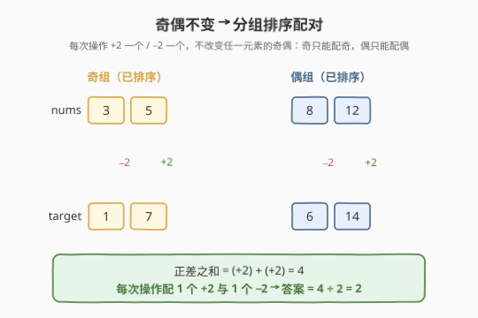
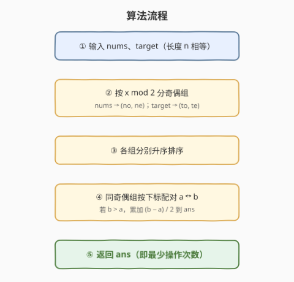
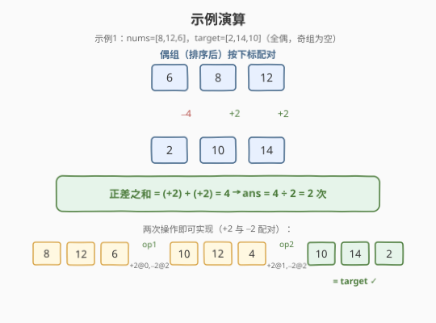

# LeetCode 使数组相似的最少操作次数 题解

## 1. 题目概述

- **标题 / 题号**：使数组相似的最少操作次数（#2449，hard）
- **链接**：https://leetcode.cn/problems/minimum-number-of-operations-to-make-arrays-similar/
- **难度**：困难
- **标签**：贪心、排序、数组

**题意**：给定两个长度相等的正整数数组 `nums` 和 `target`。每次操作可以选两个**不同**下标 $i, j$，执行：

- $\text{nums}[i] \mathrel{+}= 2$；
- $\text{nums}[j] \mathrel{-}= 2$。

若两个数组中每个值出现的频率相同（即互为多重集），称它们**相似**。求把 `nums` 变得与 `target` 相似的**最少操作次数**。数据保证一定可行。

**示例 1**：

```text
输入：nums = [8,12,6], target = [2,14,10]
输出：2
解释：
- 选 i=0, j=2 → nums=[10,12,4]
- 选 i=1, j=2 → nums=[10,14,2]   与 target 相似
```

**示例 2**：

```text
输入：nums = [1,2,5], target = [4,1,3]
输出：1
解释：选 i=1, j=2 → nums=[1,4,3]
```

**示例 3**：

```text
输入：nums = [1,1,1,1,1], target = [1,1,1,1,1]
输出：0
```

**约束**：

- $n = \text{nums.length} = \text{target.length}$
- $1 \le n \le 10^5$
- $1 \le \text{nums}[i], \text{target}[i] \le 10^6$
- `nums` 一定能变得与 `target` 相似。

> 💡 **题眼**：每次操作是「一处 $+2$、一处 $-2$」的**成对**移动。它有两个不变量：**总和守恒**、**每个位置的奇偶性不变**。抓住这两条，问题就从「搜索配对方案」塌缩成「分组排序计数」。

## 2. 解题思路

### 2.1 暴力思路：搜索配对方案

要相似，最终 `nums` 必须是 `target` 的某个**排列**。于是需要决定：每个 `nums[k]` 最终变成哪个 `target` 值（一个置换 $\pi$），再算出实现该置换的最少操作数。朴素地枚举所有置换是 $O(n!)$，且 $n$ 高达 $10^5$，**完全不可行**。

> 💡 转机在于认清「操作」的本质：它不关心谁加谁减的具体下标，只关心**全局需要多少 $+2$、多少 $-2$**，而二者天然相等、可以两两配对成操作。于是只要找到「总位移」最小的配对方案，操作数就被**直接算出**，无需模拟每一步。

### 2.2 核心观察：奇偶不变 → 分组排序配对



**两条不变量**是突破口：

1. **总和守恒**：每次操作 $+2$ 与 $-2$ 抵消，$\sum \text{nums}$ 始终不变。而「保证可行」即意味着 $\sum \text{nums} = \sum \text{target}$（必要前提）。
2. **奇偶不变**：每个元素只被 $\pm 2$ 改动，**任一下标位置的奇偶性永远不变**。因此 `nums` 里的奇数只能变成 `target` 里的奇数，偶数只能变偶数——**配对被奇偶性天然分桶**。

> ⚠️ 注意不变的是「下标位置的奇偶」，但因为相似只比多重集（与下标无关），等价于：**奇数桶的元素只能与奇数桶配对、偶数桶只能与偶数桶配对**。保证可行 ⟹ 两数组奇偶桶**大小分别相等**。

**配对代价 = 操作数的桥梁**：对任一配对方案，记 $d_k = \text{target}_{\pi(k)} - \text{nums}[k]$（必为偶数）。令

$$P = \sum_{d_k > 0} d_k \quad(\text{所有「需增大」的位移之和})$$

每次操作恰好提供**一个** $+2$（和**一个** $-2$），所以需要的 $+2$ 次数 $= P/2$；又由总和守恒，$+2$ 总量 $=$ $-2$ 总量，$-2$ 次数也是 $P/2$，二者正好两两配对成操作。故

$$\text{最少操作数} = \min_{\pi} \frac{P(\pi)}{2} = \frac{1}{2}\min_{\pi}\!\Big(\sum_{d_k>0} d_k\Big).$$

由于 $\sum d_k = \sum \text{target} - \sum \text{nums} = 0$，正差之和 $P$ 恰等于负差绝对值之和，故 $\sum |d_k| = 2P$，上式也写作 $\frac{1}{4}\sum|d_k|$。**最小化操作数 ⟺ 最小化 $\sum|d_k|$**。

**排序即最优**：在「奇/偶」每个桶内，把 `nums` 和 `target` **分别升序排序后按下标配对**，可使 $\sum|d_k|$ 取到最小——这是经典的「排序配对最小化绝对差之和」结论（由交换论证保证，见 6 节 Q2）。于是无需枚举置换，**排个序就出答案**。

> 💡 **统一直觉**：奇偶性负责「**谁和谁配**」（分桶），排序负责「**桶内怎么配**」（最小代价）。两者叠加，把指数级搜索压成 $O(n \log n)$。

### 2.3 算法流程图



算法是一条**线性流水线**：

1. 遍历 `nums`、`target`，按 $x \bmod 2$ 分入奇桶 `no`/`to` 与偶桶 `ne`/`te`；
2. 四个桶各自升序排序；
3. 在每个桶内按下标配对，累加所有 $b > a$ 的 $(b-a)/2$ 到 `ans`；
4. 返回 `ans`。

> 💡 第 3 步**只累加正差**即可：负差是「需要 $-2$」的供给方，由总和守恒保证与正差等量，自动配对，不必显式计数。

### 2.4 示例演算



以示例 1 `nums=[8,12,6], target=[2,14,10]` 演算（全偶，奇桶为空）：

- 偶桶排序：`nums` 偶 $=[6,8,12]$，`target` 偶 $=[2,10,14]$；
- 按位配对：$(6\to2):d=-4$，$(8\to10):d=+2$，$(12\to14):d=+2$；
- 正差之和 $P=(+2)+(+2)=4$，答案 $=4/2=2$。

该计数与题面给出的两步操作完全吻合：位 0 的 $+2$（$8\to10$）和位 1 的 $+2$（$12\to14$）各自配一个 $-2$（都落在原位 2，$6\to4\to2$）。

> ⚠️ 示例 2 `nums=[1,2,5], target=[4,1,3]`：奇桶配对 $(1\to1),(5\to3)$ 差 $0,-2$；偶桶 $(2\to4)$ 差 $+2$。正差和 $P=2$，答案 $1$。注意这里奇桶净支出 $-2$、偶桶净收入 $+2$——**跨桶**的 $+2/-2$ 也能配对（操作的下标 $i,j$ 可分属不同奇偶），印证了 2.2 节「配对是全局的」。

## 3. 参考代码

### C++

```cpp
class Solution {
  public:
    long long makeSimilar(vector<int>& nums, vector<int>& target) {
        vector<int> no, ne, to, te;
        for (int x : nums)  (x & 1 ? no : ne).push_back(x);
        for (int x : target)(x & 1 ? to : te).push_back(x);
        sort(no.begin(), no.end());
        sort(ne.begin(), ne.end());
        sort(to.begin(), to.end());
        sort(te.begin(), te.end());

        long long ans = 0;
        auto acc = [&](vector<int>& a, vector<int>& b) {
            for (int i = 0; i < (int)a.size(); ++i)
                if (b[i] > a[i]) ans += (b[i] - a[i]) / 2;
        };
        acc(no, to);
        acc(ne, te);
        return ans;
    }
};
```

### Python

```python
class Solution:
    def makeSimilar(self, nums: List[int], target: List[int]) -> int:
        no = sorted(x for x in nums   if x & 1)
        ne = sorted(x for x in nums   if not (x & 1))
        to = sorted(x for x in target if x & 1)
        te = sorted(x for x in target if not (x & 1))

        ans = 0
        for a, b in zip(no, to):
            if b > a:
                ans += (b - a) // 2
        for a, b in zip(ne, te):
            if b > a:
                ans += (b - a) // 2
        return ans
```

> 💡 用 `x & 1` 判奇偶比 `x % 2` 更稳（对负数也无歧义，本题虽为正数仍是好习惯）。两桶大小由「保证可行」保证分别相等，`zip` 不会错位。`ans` 用 `long long`：极端下 $n=10^5$、单次位移 $\approx 10^6$，正差和可达 $\sim 10^{11}$，会溢出 `int`。

## 4. 复杂度分析

| 维度 | 复杂度 | 说明 |
|------|--------|------|
| **时间复杂度** | $O(n \log n)$ | 四个桶各排序，主导项；遍历配对为 $O(n)$ |
| **空间复杂度** | $O(n)$ | 四个桶共存放 $n$ 个元素；原地排序不再额外扩增 |

> ⚠️ 关于「能否做到 $O(n)$」：桶内排序理论上可用值域计数排序（值域 $\le 10^6$）降到 $O(n + V)$，但 $O(n\log n)$ 对 $n=10^5$ 已绰绰有余，不必过度优化。

## 5. 扩展：奇偶不变量是「mod 不变量」的特例

本题的「$\pm 2$ 不改奇偶」其实是更普适模式的一个实例——**操作改步长 $x$，则 $v \bmod x$ 是不变量**。把 $x$ 换成任意正整数、把「目标多重集」换成「单一目标值」，就得到 [2033. 使网格单值的最少操作次数](../2001-2100/2033_使网格单值的最少操作次数.md)：

| 维度 | 2449（本题） | 2033（单值网格） |
|------|--------------|-------------------|
| 操作 | 选两处，一 $+x$ 一 $-x$（$x=2$） | 选一处，$+x$ 或 $-x$（$x$ 任给） |
| 不变量 | $v \bmod 2$（奇偶桶） | $v \bmod x$（余数桶） |
| 目标 | 给定多重集 `target` | 单一目标值 $t$（使全部相等） |
| 桶内最优化 | 排序配对最小化 $\sum|d|$ | 取**中位数**最小化 $\sum|v-t|$ |
| 答案 | $P/2 = \frac14\sum|d|$ | $\frac{1}{x}\sum|v-\text{median}|$ |

> 💡 当「目标」从单一值升级为任意多重集时，中位数不再适用，退而用**排序配对**——这正是 462（中位数）与本题（排序配对）的分水岭：**目标是一个值取中位数，目标是另一组数取排序配对**。

## 6. 面试要点

1. **为什么奇偶性是不变量？跨桶配对为何也合法？**

   - 每次操作 $\text{nums}[i]\pm 2$，故下标 $i$ 的值奇偶永远不变 → `nums` 的奇数只能匹配 `target` 的奇数。
   - 但操作的两端 $i,j$ **可分属不同奇偶桶**：一次操作可以「给奇桶 $+2$、从偶桶 $-2$」。所以 $+2$ 和 $-2$ 的配对是**全局**的，不必同桶——这正是 2.4 节示例 2 奇桶净支出、偶桶净收入仍能平衡的原因。

2. **为什么「排序后按下标配对」能使 $\sum|d_k|$ 最小？**

   - **交换论证**：设某配对里 $a_i \le a_j$ 却配了 $b_p \ge b_q$（即「交叉」配对）。改成 $a_i \leftrightarrow b_q$、$a_j \leftrightarrow b_p$（解除交叉）后，绝对差之和**不增**（对凸函数 $|\cdot|$ 成立；直觉上「小的配小的、大的配大的」总不亏）。
   - 反复解除交叉，最终必收敛到「两序列都升序」的配对，即全局最优。

3. **答案为什么是「正差之和 / 2」，负差去哪了？**

   - $\sum d_k = \sum \text{target} - \sum \text{nums} = 0$，故正差之和 $P$ $=$ 负差绝对值之和。
   - 需要 $P/2$ 个 $+2$、$P/2$ 个 $-2$；每次操作**恰好一加一减**，二者两两配成 $P/2$ 次操作。代码只累加正差即得 $P/2$，负差是「免费」的供给方。

4. **如果直接对 `nums`、`target` 全体排序配对（不分桶）会怎样？**

   - 可能出现奇偶错配：例如 `nums=[3]`、`target=[4]`，全体配对得到 $d=+1$（奇数），但这**不可能实现**（$+2$ 跳不出奇偶）。
   - 分桶正是为了把「奇偶硬约束」编码进配对，保证每个 $d$ 都是偶数、可行。保证可行也隐含两数组奇偶桶大小分别相等。

5. **为何 `ans` 必须开 `long long`？**

   - $n \le 10^5$，每个 $|d_k| \le 10^6$，$\sum|d_k| \le 10^{11}$，正差和 $P$ 同量级，$P/2$ 可达 $5\times10^{10}$，远超 `int`（约 $2.1\times10^9$）。

> 💡 **一句话总结**：操作 $\pm2$ 不改奇偶，故按奇偶分桶；桶内排序配对使绝对差之和最小；每个 $+2$ 配一个 $-2$ 成一次操作，答案 $=$ 正差之和 $/2$。$O(n\log n)$ 终。

## 同类练习题

| # | 题目 | 与本题的关联 |
|---|------|-------------|
| 2033 | [使网格单值的最少操作次数](https://leetcode.cn/problems/minimum-operations-to-make-a-univalue-grid/)（[题解](../2001-2100/2033_使网格单值的最少操作次数.md)） | 操作步长 $x$、不变量 $v\bmod x$ 的直接推广；目标是单一值取中位数，是「不变量分桶 + 中位数」的姊妹篇 |
| 462 | [最小操作次数使数组元素相等 II](https://leetcode.cn/problems/minimum-moves-to-equal-array-elements-ii/)（[题解](../0401-0500/462_最小操作次数使数组元素相等II.md)） | 目标为单一值时，$\sum\|v-t\|$ 在中位数处取最小——本题「排序配对最小化绝对差之和」的 1D 特例 |
| 453 | [最小操作次数使数组元素相等](https://leetcode.cn/problems/minimum-moves-to-equal-array-elements/)（[题解](../0401-0500/453_最小操作次数使数组元素相等.md)） | 「$n-1$ 个 $+1$」等价于「1 个 $-1$」，总和守恒视角的逆向转化；与本题同属「用不变量把操作计数直接算出」一族 |
| 1558 | [得到目标数组的最少函数调用次数](https://leetcode.cn/problems/minimum-numbers-of-function-calls-to-make-target-array/)（[题解](../1501-1600/1558_得到目标数组的最少函数调用次数.md)） | 另一种「$+1$ 与 $\times2$」的操作计最小化，靠位表示拆解；同为「最少操作次数」但用位运算而非不变量 |
