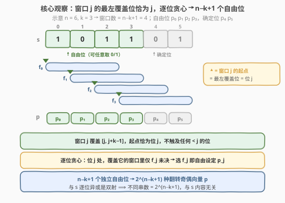
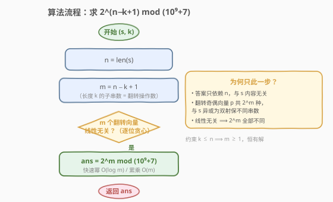
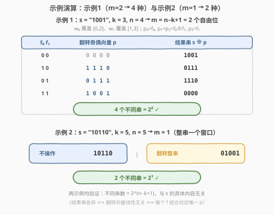

# 应用操作后不同二进制字符串的数量

- **题目名称**：应用操作后不同二进制字符串的数量
- **链接**：[2450. 应用操作后不同二进制字符串的数量](https://leetcode.cn/problems/number-of-distinct-binary-strings-after-applying-operations/)
- **难度**：中等
- **标签**：数学、字符串、异或、线性代数（GF(2)）

## 1. 题目概述

给定一个**二进制**字符串 `s` 和一个正整数 `k`。你可以对字符串应用以下操作**任意**次数：

- 从 `s` 中选择任何**大小为 `k`** 的子字符串，将其所有字符**翻转**——即所有 `1` 都变成 `0`，所有 `0` 都变成 `1`。

返回你可以获得的**不同**字符串的数量。因为答案可能太大，所以对 $10^9 + 7$ **取模**后返回。

> **注意**：二进制字符串是仅由 `0` 和 `1` 组成的字符串；子字符串是字符串的连续部分。

**示例 1**：

```text
输入：s = "1001", k = 3
输出：4
解释：可获得以下字符串：
- 不应用任何操作 → s = "1001"。
- 对从下标 0 开始的子串应用一个操作 → s = "0111"。
- 对从下标 1 开始的子串应用一个操作 → s = "1110"。
- 对从下标 0 和 1 开始的两个子串都应用一个操作 → s = "0000"。
```

**示例 2**：

```text
输入：s = "10110", k = 5
输出：2
解释：可获得以下字符串：
- 不执行任何操作 → s = "10110"。
- 对整个字符串应用一个操作 → s = "01001"。
```

**约束条件**：

- $1 \le k \le \text{len}(s) \le 10^5$
- $s[i]$ 是 `0` 或 `1`。

> 💡 **关键不变式**：翻转同一窗口两次会相互抵消（$1 \oplus 1 = 0$），所以每个窗口只有「翻转奇数次 / 偶数次」两种等效状态。设串长为 $n$，长度为 $k$ 的子串共有 $n-k+1$ 个，于是整个操作过程等价于选一个二进制向量 $\mathbf{f} \in \{0,1\}^{n-k+1}$。问题随之归约为「不同的 $\mathbf{f}$ 是否一定产生不同的结果串」——若线性无关，答案就是 $2^{n-k+1}$；这正是本题的全部核心。

---

## 2. 解题思路

### 2.1 暴力思路：枚举翻转组合 + 去重

最直白的做法是把每个窗口「翻 / 不翻」当成一个开关，枚举全部 $2^{n-k+1}$ 种组合，对每组算出结果串塞进哈希集合，最后返回集合大小。正确性无懈可击——把「不同组合是否撞结果」这件事**完全交给集合去判**。

但 $n \le 10^5$ 时 $n-k+1$ 可达 $10^5$，$2^{10^5}$ 是个天文数字，连**枚举本身都不可行**，更别说物化进集合。暴力把「不同组合 ⟺ 不同结果」当作未知、用集合去验证，方向就错了——必须先从代数上判定「是否一一对应」，能一一对应就直接数组合数 $2^{n-k+1}$，无需枚举。

> ⚠️ 不可枚举的规模逼迫我们寻找闭式：只要证明「$n-k+1$ 个翻转向量线性无关」，那么不同 $\mathbf{f}$ 必给不同结果，答案即为 $2^{n-k+1} \bmod (10^9+7)$。下文用「逐位贪心」给出最直观的无关性证明。

### 2.2 核心观察：逐位贪心证线性无关 → $2^{n-k+1}$



记 $n = \text{len}(s)$。长度为 $k$ 的子串共有 $n-k+1$ 个，起点分别为 $0, 1, \dots, n-k$。把「翻转起点为 $i$ 的窗口」记为操作 $f_i \in \{0,1\}$（翻 / 不翻）。定义**翻转奇偶向量** $\mathbf{p} = (p_0, \dots, p_{n-1})$：

$$
p_j = \bigoplus_{i:\, i \le j \le i+k-1} f_i \qquad (\text{即覆盖位置 } j \text{ 的所有窗口的 } f_i \text{ 之异或})
$$

最终串 $= s \oplus \mathbf{p}$（逐位异或）。由于「与固定串 $s$ 异或」是 $\{0,1\}^n \to \{0,1\}^n$ 的**双射**，故「不同结果串数 $=$ 不同可达 $\mathbf{p}$ 数」。而 $\mathbf{f} \mapsto \mathbf{p}$ 是 $\text{GF}(2)$ 上的线性映射，可达 $\mathbf{p}$ 的数目 $= 2^{\text{rank}}$。下面证明 $\text{rank} = n-k+1$（满列秩）。

**逐位贪心证明（同时给出构造）**：从左到右逐位决定 $f_0, f_1, \dots, f_{n-k}$，并连带把 $p_0, p_1, \dots$ 任意设定：

- **窗口 $f_j$ 覆盖 $[j,\ j+k-1]$，其最左覆盖位恰为 $j$**。于是它**不触及任何 $< j$ 的位置**——一旦固定 $p_0, \dots, p_{j-1}$，后续选 $f_j$ 不会回头扰动它们。
- 在位置 $j$（$j \le n-k$），覆盖它的窗口集合是 $\{f_i : \max(0,j-k+1) \le i \le j\}$，其中下标 $< j$ 者均已被前序步骤选定，**唯有 $f_j$ 尚未决**。
- 故 $p_j = \big(\bigoplus_{i<j} f_i \cdot \mathbb{1}[i \le j \le i+k-1]\big) \oplus f_j$，前半已定、$f_j$ 自由 ⟹ **选 $f_j$ 可把 $p_j$ 设成任意 0/1**。

如此 $p_0, p_1, \dots, p_{n-k}$ 这 $n-k+1$ 位可独立任意取值，而 $p_{n-k+1}, \dots, p_{n-1}$ 因无对应窗口（$j > n-k$ 时不存在 $f_j$）而被前面已选的 $f$ 完全决定。**$n-k+1$ 个独立自由位 ⟹ $2^{n-k+1}$ 种可达 $\mathbf{p}$**。

> 💡 **等价的代数视角**：把每个窗口写成 $\{0,1\}^n$ 上的列向量 $\mathbf{v}_i$（在 $[i, i+k-1]$ 处为 1）。上面的逐位论证其实是在证明 $\mathbf{v}_0, \dots, \mathbf{v}_{n-k}$ 线性无关——若 $\bigoplus_i c_i \mathbf{v}_i = \mathbf{0}$，看位置 0（仅 $\mathbf{v}_0$ 覆盖）得 $c_0=0$；看位置 1 得 $c_1=0$；…… 归纳到位置 $n-k$ 得全部 $c_i=0$。「逐位贪心」与「列向量无关」是同一件事的两个说法。

> 💡 **答案与 $s$ 的内容无关**：可达 $\mathbf{p}$ 集合大小恒为 $2^{n-k+1}$，与 $s$ 长什么样无关；异或双射保数目，故不同结果串数始终 $= 2^{n-k+1}$。$s$ 只决定「具体是哪 $2^{n-k+1}$ 个串」，不决定「有几个」。

### 2.3 算法流程图



骨架极简——本质就是一次模幂：

1. **算** $n = \text{len}(s)$；
2. **算** $m = n - k + 1$（约束 $k \le n$ 保证 $m \ge 1$）；
3. **算** $\text{ans} = 2^m \bmod (10^9+7)$（快速幂 $O(\log m)$ 或累乘 $O(m)$ 均可，$m \le 10^5$ 两者都飞快）；
4. **返回** ans。

> ⚠️ 勿被「线性无关」的证明吓到——它只用来**论证答案就是 $2^m$**，代码里无需任何矩阵、无需访问 $s$ 的字符，甚至 $\text{len}(s)$ 之外对 $s$ 一无所知。

### 2.4 示例演算



**示例 1** $s = \texttt{"1001"},\ k = 3,\ n = 4$（$m = 4-3+1 = 2$，两窗口 $f_0 \in [0,2],\ f_1 \in [1,3]$）：

| $f_0\ f_1$ | 翻转奇偶向量 $\mathbf{p}=(p_0,p_1,p_2,p_3)$ | 结果串 $s \oplus \mathbf{p}$ |
|------------|----------------------------------------------|------------------------------|
| 0 0 | 0 0 0 0 | **1001** |
| 1 0 | 1 1 1 0 | **0111** |
| 0 1 | 0 1 1 1 | **1110** |
| 1 1 | 1 0 0 1 | **0000** |

其中 $p_0 = f_0,\ p_1 = p_2 = f_0 \oplus f_1,\ p_3 = f_1$。四种 $\mathbf{p}$ 两两不同 ⟹ 四个结果串两两不同，$2^2 = 4$ ✓。注意 $p_0, p_1$ 是两个自由位（由 $f_0, f_1$ 独立设定），$p_2, p_3$ 被它们决定。

**示例 2** $s = \texttt{"10110"},\ k = 5,\ n = 5$（$m = 5-5+1 = 1$，仅「翻转整串」一个窗口）：

| 操作 | 结果串 |
|------|--------|
| 不翻转 | **10110** |
| 翻转整串 | **01001** |

$2^1 = 2$ ✓。仅一个自由位 $p_0 = f_0$，全串 5 位同进退，故只两种结果。

> 💡 两示例各覆盖一条规模：示例 1 的两个自由位分散在串中（$p_0, p_1$ 决定 $p_2, p_3$），示例 2 的单一自由位统辖整串。两者都印证「自由位数 $= n-k+1$」且「不同 $\mathbf{f}$ 必给不同结果」。

---

## 3. 参考代码

### C++

```cpp
using int64 = long long;

class Solution {
public:
    int countDistinctStrings(string s, int k) {
        const int64 MOD = 1000000007;
        int m = (int)s.size() - k + 1;   // 长度 k 的子串数 = 翻转操作数
        // 求 2^m mod MOD，快速幂
        int64 ans = 1, base = 2 % MOD;
        for (int e = m; e > 0; e >>= 1) {
            if (e & 1) ans = ans * base % MOD;
            base = base * base % MOD;
        }
        return (int)ans;
    }
};
```

> 💡 $m$ 可达 $10^5$，用 $O(\log m)$ 快速幂最稳；嫌长可换成 `ans = 1; for (int i = 0; i < m; ++i) ans = ans * 2 % MOD;` 的 $O(m)$ 累乘，$10^5$ 次乘法也是毫秒级。注意 `base = 2 % MOD` 防 $m=0$ 的边界——虽然约束 $k \le n$ 保证 $m \ge 1$，写上更稳。全程只读 `s.size()`，不碰任何字符。

### Python

```python
class Solution:
    def countDistinctStrings(self, s: str, k: int) -> int:
        MOD = 10**9 + 7
        return pow(2, len(s) - k + 1, MOD)
```

> 💡 Python 内置 `pow(base, exp, mod)` 即三参数快速幂，一行收尾。`len(s) - k + 1` 在 $k \le \text{len}(s)$ 下 $\ge 1$，无越界。若想强调「不依赖 $s$ 内容」，可写 `pow(2, len(s) - k + 1, 10**9 + 7)`，连 `s[i]` 都不读——印证答案只看长度。

---

## 4. 复杂度分析

| 维度 | 复杂度 | 说明 |
|------|--------|------|
| **时间复杂度** | $O(\log m)$ 快速幂 / $O(m)$ 累乘 | $m = n-k+1 \le 10^5$；仅一次模幂，与 $s$ 内容无关 |
| **空间复杂度** | $O(1)$ | 仅常数变量 $m,\ \text{ans},\ \text{base}$ |
| 对照：枚举去重 | $O(2^m \cdot n)$ 时间 / $O(2^m \cdot n)$ 空间 | 物化全部 $2^m$ 种结果入集合，$m=10^5$ 时宇宙级不可行 |
| 对照：BFS 状态空间搜索 | $O(2^m \cdot n)$ | 同上，状态爆炸，方向性错误 |

> 💡 全题的「难度」不在写代码（一行模幂），而在**论证答案就是 $2^m$**——即证 $n-k+1$ 个翻转向量线性无关。一旦证出，复杂度天然 $O(\log n)$ 时间 / $O(1)$ 空间。反过来说，若没证线性无关就敢写 $2^m$，是赌博——万一某些 $\mathbf{f}$ 组合撞结果，真实答案会小于 $2^m$。

---

## 5. 扩展：翻转操作的 GF(2) 代数与差分数组视角

「翻转长度 $k$ 的窗口」是一类标准的 $\text{GF}(2)$ 线性操作，可从两个互补视角理解「为何恰有 $n-k+1$ 个自由度」。

### 5.1 列向量无关视角（本题主证）

把操作 $f_i$ 视作 $\{0,1\}^n$ 上的列向量 $\mathbf{v}_i$（区间 $[i, i+k-1]$ 为 1）。$\{\mathbf{v}_i\}_{i=0}^{n-k}$ 线性无关 ⟺ 任一线性组合 $\bigoplus c_i \mathbf{v}_i = \mathbf{0}$ 强制所有 $c_i = 0$。证明只需**自左向右看首位置**：

$$
\text{位置 } 0 \text{ 只被 } \mathbf{v}_0 \text{ 覆盖} \Rightarrow c_0 = 0;\quad
\text{位置 } 1 \text{ 在 } c_0=0 \text{ 后只剩 } \mathbf{v}_1 \Rightarrow c_1 = 0;\quad \dots \Rightarrow c_{n-k}=0.
$$

这正是「逐位贪心」的代数表述——每个 $\mathbf{v}_j$ 是位置 $j$ 的**唯一首次覆盖者**，故它独立。秩 $= n-k+1$，像空间大小 $= 2^{n-k+1}$。

### 5.2 差分数组（边界）视角

记 $\mathbf{p}$ 的差分 $d_0 = p_0,\ d_i = p_{i-1} \oplus p_i\ (1 \le i \le n-1)$，外加哨兵 $d_n = p_{n-1}$（$\mathbf{p}$ 的总异或）。翻转窗口 $[l, r]$（$r = l+k-1$）只**翻转两个边界** $d_l$ 与 $d_{r+1}$：

$$
\text{翻转 } [l, l+k-1] \ \Longleftrightarrow\ \text{翻转 } d_l \text{ 与 } d_{l+k}.
$$

于是 $n-k+1$ 个操作对应 $n-k+1$ 条边 $(0,k), (1,k+1), \dots, (n-k, n)$，连在 $n+1$ 个节点 $d_0 \dots d_n$ 上。这些边把节点按「模 $k$ 同余」分成 $k$ 条链，每条链是一棵树（边数 $=$ 节点数 $- 1$），总边数 $= (n+1) - k = n-k+1$。**森林的边彼此独立**（每条边自由控制其两端的相对翻转），故自由度恰为边数 $n-k+1$——与列向量视角殊途同归。

> 💡 差分视角把「翻转区间」化归为「翻两个边界点」，是 **995 K 连续位的最小翻转次数**里贪心 + 差分数组 / 滑动窗口维护的核心。差别在于：995 要把 $\mathbf{p}$ 凑到某个**目标**（全 1），故需最小化操作数；而本题只数**所有可达**状态，由线性无关直接给出 $2^{n-k+1}$。

### 5.3 与「凑目标型」翻转题的对照

| 维度 | 本题 2450 | 995 K 连续位最小翻转 |
|------|-----------|----------------------|
| 目标 | 数**所有**可达串 | 把数组凑成**全 1**，求**最少**操作数 |
| 关键 | $n-k+1$ 个翻转向量**线性无关** ⟹ $2^{n-k+1}$ | 自左向右贪心：位 $j$ 不符就翻窗口 $[j, j+k-1]$，差分数组维护翻转奇偶 |
| 复杂度 | $O(\log n)$ 时间 / $O(1)$ 空间 | $O(n)$ 时间 / $O(1)$ 空间（差分数组滚动） |
| 可解性 | 恒可（$2^{n-k+1} \ge 1$） | 末尾 $k-1$ 位须恰好全 1，否则返回 $-1$ |

二者共享「翻转窗口 $k$」与「自左向右逐位决定」的骨架，差别只在「数全部 vs 凑特定」。

---

## 6. 面试要点

1. **为什么不同 $\mathbf{f}$ 一定产生不同结果串？**

   > 因为 $n-k+1$ 个窗口翻转向量 $\mathbf{v}_0, \dots, \mathbf{v}_{n-k}$ 在 $\text{GF}(2)$ 上线性无关。证：若 $\bigoplus c_i \mathbf{v}_i = \mathbf{0}$，看位置 0（仅 $\mathbf{v}_0$ 覆盖）得 $c_0 = 0$；归纳地，位置 $j$ 在 $c_0 = \dots = c_{j-1} = 0$ 后仅剩 $\mathbf{v}_j$ 贡献，得 $c_j = 0$。全部为 $0$ ⟹ 无关 ⟹ $\mathbf{f} \mapsto \mathbf{p}$ 单射 ⟹ 不同 $\mathbf{f}$ 给不同 $\mathbf{p}$，再异或固定 $s$ 仍单射 ⟹ 不同结果串。

2. **「逐位贪心」和「线性无关」是什么关系？**

   > 同一件事的两个说法。逐位贪心从「构造」角度说：自左向右选 $f_j$，因窗口 $j$ 不触及 $< j$ 的位，故 $p_j$ 可任意设定而不扰动已固定位——给出 $n-k+1$ 个独立自由位。线性无关从「判定」角度说：列向量组秩 $= n-k+1$，像空间大小 $= 2^{n-k+1}$。前者是后者的构造化证明，后者是前者的代数抽象。

3. **为什么答案与 $s$ 的具体内容无关？**

   > 可达 $\mathbf{p}$ 的集合大小由 $\mathbf{f} \mapsto \mathbf{p}$ 这个线性映射的秩决定，秩只依赖窗口结构（$n, k$），与 $s$ 无关，恒为 $2^{n-k+1}$。而「与固定 $s$ 异或」是双射，保数目不变。$s$ 只决定「具体哪 $2^{n-k+1}$ 个串」，不决定「有几个」——所以代码甚至不读 $s$ 的任何字符。

4. **若把操作改成「翻转长度至多为 $k$ 的子串」会怎样？**

   > 可选长度变为 $1, 2, \dots, k$，窗口数大增。但关键是「长度为 1 的窗口」就是单点翻转，$n$ 个单点翻转向量 $\mathbf{e}_0, \dots, \mathbf{e}_{n-1}$ 本身就构成 $\{0,1\}^n$ 的一组基——任何串都能凑出。此时答案 $= 2^n$（全集），与 $k$ 无关（只要 $k \ge 1$）。这反衬出本题答案 $2^{n-k+1}$ 严格依赖「**恰好**长度 $k$」这一约束带来的列向量结构。

5. **$k = 1$ 和 $k = n$ 两个极端分别对应什么？**

   > $k=1$：每个位置独立翻转，$n$ 个单点窗口线性无关，答案 $2^n$——即任意二进制串可达，全集。$k=n$：仅一个窗口（整串），答案 $2^1 = 2$——原串或全翻转。两者都符合 $2^{n-k+1}$：$2^{n-1+1}=2^n$ 与 $2^{n-n+1}=2$。极端情形是公式正确性的快速 sanity check。

> 💡 **一句话总结**：翻转长度恰为 $k$ 的窗口在 $\text{GF}(2)$ 下线性无关（窗口 $j$ 的最左覆盖位恰为 $j$，逐位贪心可独立设定 $p_0 \dots p_{n-k}$）⟹ 不同组合给不同串 ⟹ 答案 $= 2^{n-k+1} \bmod (10^9+7)$，与 $s$ 内容无关，$O(\log n)$ 时间 / $O(1)$ 空间。

---

## 7. 同类练习题

- [995. K 连续位的最小翻转次数](https://leetcode.cn/problems/minimum-number-of-k-consecutive-bit-flips/)（[题解](../0901-1000/995_K连续位的最小翻转次数.md)）：同一「翻转长度 $k$ 窗口」模型，但目标是凑成全 1、求**最少**操作数——自左向右贪心 + 差分数组维护翻转奇偶，对照本题「数全部可达」与 995「凑特定目标」
- [1310. 子数组异或查询](https://leetcode.cn/problems/xor-queries-of-a-subarray/)（[题解](../1301-1400/1310_子数组异或查询.md)）：异或前缀和基础，承接本题「翻转即异或、区间异或 $=$ 两端点异或」的差分视角
- [1863. 所有子集的异或总和](https://leetcode.cn/problems/sum-of-all-subset-xor-totals/)（[题解](../1801-1900/1863_所有子集的异或总和.md)）：在 $\text{GF}(2)$ 上数异或组合的总量，对照本题「数线性像空间大小」的代数计数思想
- [1734. 解码异或后的排列](https://leetcode.cn/problems/decode-xored-permutation/)（[题解](../1701-1800/1734_解码异或后的排列.md)）：异或的可逆性与逐位推导，承接本题对「异或为双射、保数目」的依赖
- [136. 只出现一次的数字](https://leetcode.cn/problems/single-number/)（[题解](../0101-0200/136_只出现一次的数字.md)）：异或自相消的入门题，对照本题用 $\text{GF}(2)$ 线性结构判定「不同组合是否撞结果」
