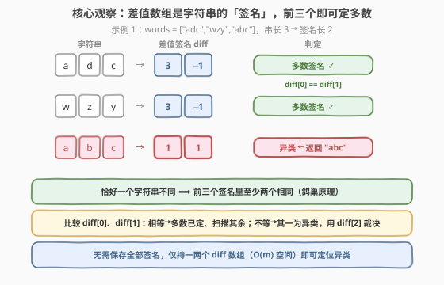

# 差值数组不同的字符串

- **题目名称**：差值数组不同的字符串
- **链接**：[2451. 差值数组不同的字符串](https://leetcode.cn/problems/odd-string-difference/)
- **难度**：简单
- **标签**：数组、哈希表、字符串、找异类

## 1. 题目概述

给定字符串数组 `words`，所有字符串长度相同（记长度为 $n$）。对每个字符串 `words[i]`，构造长度为 $n-1$ 的**差值整数数组** `difference[i]`：

$$
\text{difference}[i][j] = \text{words}[i][j+1] - \text{words}[i][j],\qquad 0 \le j \le n-2
$$

其中字母的位置为 $a=0,\ b=1,\ \dots,\ z=25$。例如 `"acb"` 的差值数组为 $[c-a,\ b-c] = [2-0,\ 1-2] = [2,\ -1]$。

`words` 中**除了一个字符串以外**，其余字符串的差值数组都相同。返回那个**不同的**字符串。

**示例 1**：

```text
输入：words = ["adc","wzy","abc"]
输出："abc"
解释："adc"→[3,-1]，"wzy"→[3,-1]，"abc"→[1,1]。不同者为 "abc"。
```

**示例 2**：

```text
输入：words = ["aaa","bob","ccc","ddd"]
输出："bob"
解释：除 "bob"→[13,-13] 外，其余差值数组均为 [0,0]。
```

**约束条件**：

- $3 \le \text{words.length} \le 100$
- $n == \text{words}[i].\text{length}$
- $2 \le n \le 20$
- `words[i]` 只含小写英文字母

> 💡 **关键不变式**：差值数组是字符串的**签名**——它刻画「相邻字母的相对起伏」，与首字母本身无关（`"adc"` 与 `"wzy"` 字母完全不同但签名同为 `[3,-1]`）。题目保证**恰好一个**签名与众不同，于是问题退化为「在 $m$ 个签名里找出唯一异类」——这是一个**近一致（near-unanimous）**序列上的异类检测，存在无需统计全部签名的低空间解法。

---

## 2. 解题思路

### 2.1 暴力思路：哈希计数找频次为 1 的签名

最直白的做法是把每个字符串的差值数组转成**可哈希的元组**，用频次表统计后取出频次为 1 的那个：

```text
cnt = Counter(diff_tuple(w) for w in words)
for w in words:
    if cnt[diff_tuple(w)] == 1:
        return w
```

正确性没问题——「恰好一个不同」⟹ 异类的签名频次恰为 1，其余频次为 $m-1$。但代价是要**物化（materialize）全部 $m$ 个签名**进哈希表，空间 $O(m\cdot n)$；且把「近一致」这一强约束完全闲置——即便 $m-1$ 个签名全同，也要把它们一一存进表里再数。

> ⚠️ 暴力把「恰好一个异类」当作未知，先全量统计再筛选；但「$m-1$ 同 + 1 异」是一个极强的结构——**只需看前三个签名即可确定多数签名**，剩下的扫描只是确认异类位置，根本不需要哈希表。

### 2.2 核心观察：前三个定多数 + 单遍扫描



把「恰好一个异类」翻译成两条可推演的事实：

**① 鸽巢定多数**。$m$ 个签名里 $m-1$ 个相同、仅 1 个不同。那么**任取前三个签名，至少有两个相同**（至多 1 个异类，前三个里不可能同时出现两个不同者）。于是多数签名一定在前三个中现身至少两次。

**② 比较前两个即可分流**。计算 $d_0=\text{diff}(\text{words}[0])$ 与 $d_1=\text{diff}(\text{words}[1])$：

- **若 $d_0 = d_1$**：则两者都不是异类（反证见下方），所以**多数签名已定为 $d_0$**，异类必在 $\text{words}[2..m-1]$ 中——从 $i=2$ 起扫描，首个 $\text{diff}(\text{words}[i]) \ne d_0$ 者即答案。
- **若 $d_0 \ne d_1$**：则异类必为 $\text{words}[0]$ 或 $\text{words}[1]$ 之一（二者签名不同 ⟹ 至少其一为异类；又因只有一个异类 ⟹ 恰一）。此时 $\text{words}[2]$ 一定是多数（异类已在前两个里）。再算 $d_2=\text{diff}(\text{words}[2])$ 裁决：$d_0 = d_2$ ⟹ 异类是 $\text{words}[1]$；否则异类是 $\text{words}[0]$。

> 💡 **为什么 $d_0 = d_1$ 时两者都「安全」？** 反证：若 $\text{words}[0]$ 是异类，则 $\text{words}[1]$ 必为多数；但 $d_0=d_1$ 意味着 $\text{words}[0]$ 的签名也是多数签名——与「$\text{words}[0]$ 是异类」矛盾。故二者皆多数，多数签名即 $d_0$。这条推理是「分流」成立的关键，把全量统计压成「两次比较」。

### 2.3 算法流程图

![算法流程：前两个 diff 比较 → 相等则扫描找异类，不等则用 diff[2] 裁决](../images/osd_algorithm_flow.svg)

骨架无特判、无哈希表：

1. **算** $d_0$、$d_1$；
2. **判** $d_0 = d_1$：
   - 是 ⟹ 多数签名 $= d_0$，遍历 $i=2..m-1$ 返回首个 $\text{diff}(\text{words}[i])\ne d_0$ 者；
   - 否 ⟹ 算 $d_2$，$d_0=d_2$ 返回 $\text{words}[1]$，否则返回 $\text{words}[0]$。

约束 $m \ge 3$ 保证 $d_2$ 总可取；「恰好一个异类」保证「是」分支的扫描必在到达末尾前命中，不会越界。

### 2.4 示例演算

![示例演算：示例1（前两相等→扫描命中 abc）与示例2（前两不等→diff[2] 裁决得 bob）](../images/osd_example_walkthrough.svg)

**示例 1** $\text{words}=["\text{adc}","\text{wzy}","\text{abc}"]$（走「相等」分支）：

| 步骤 | 计算 | 结论 |
|------|------|------|
| 算 $d_0,d_1$ | $d_0=[3,-1]$（adc），$d_1=[3,-1]$（wzy） | $d_0=d_1$ ✓ |
| 定多数 | majority $= [3,-1]$ | 异类在 $\text{words}[2..]$ |
| 扫描 $i=2$ | $d_2=[1,1]$（abc）$\ne [3,-1]$ | 命中 → 返回 "abc" |

返回 **"abc"** ✓。

**示例 2** $\text{words}=["\text{aaa}","\text{bob}","\text{ccc}","\text{ddd}"]$（走「不等」分支）：

| 步骤 | 计算 | 结论 |
|------|------|------|
| 算 $d_0,d_1$ | $d_0=[0,0]$（aaa），$d_1=[13,-13]$（bob） | $d_0\ne d_1$ |
| 裁决 | $d_2=[0,0]$（ccc）；$d_0=d_2$ ✓ | 异类是 $\text{words}[1]$ |
| 返回 | $\text{words}[1]$ | "bob" |

返回 **"bob"** ✓。注意此例异类 `bob` 出现在**前两个里**，靠 $d_2$ 一次裁决即定位，无需扫描后续。

> 💡 两示例各覆盖一条分支：示例 1 异类在尾部（「相等」分支扫描命中），示例 2 异类在头部（「不等」分支靠 $d_2$ 裁决）——验证两条路径的完整性。

---

## 3. 参考代码

### C++

```cpp
class Solution {
public:
    string oddString(vector<string>& words) {
        int m = words.size(), n = words[0].size();
        auto diff = [&](const string& s) {
            vector<int> d(n - 1);
            for (int j = 0; j + 1 < n; ++j)
                d[j] = s[j + 1] - s[j];
            return d;
        };
        vector<int> d0 = diff(words[0]);
        vector<int> d1 = diff(words[1]);
        if (d0 == d1) {
            for (int i = 2; i < m; ++i)
                if (diff(words[i]) != d0)
                    return words[i];
        } else {
            vector<int> d2 = diff(words[2]);
            return d0 == d2 ? words[1] : words[0];
        }
        return ""; // 不可达：约束保证恰有一异类
    }
};
```

> 💡 `diff` 返回 `vector<int>`，可直接用 `==` / `!=` 逐元素比较，无需手写循环。`d0==d1` 用值语义判等。`words[2]` 在 $m\ge 3$ 下安全。末行 `return ""` 仅为满足编译器「所有路径有返回值」，题意保证不会执行。

### Python

```python
class Solution:
    def oddString(self, words: List[str]) -> str:
        def diff(s: str):
            return [ord(s[j + 1]) - ord(s[j]) for j in range(len(s) - 1)]
        d0 = diff(words[0])
        d1 = diff(words[1])
        if d0 == d1:
            for i in range(2, len(words)):
                if diff(words[i]) != d0:
                    return words[i]
        else:
            d2 = diff(words[2])
            return words[1] if d0 == d2 else words[0]
```

> 💡 列表可直接用 `==`/`!=` 逐元素比较，无需转元组。若偏爱声明式，暴力版一行流：`from collections import Counter; c = Counter(tuple(diff(w)) for w in words); return next(w for w in words if c[diff(w)] == 1)`——直白但 $O(mn)$ 空间，对照可见「前三个定多数」版只持有一两个 `diff`、空间 $O(n)$。

---

## 4. 复杂度分析

| 维度 | 复杂度 | 说明 |
|------|--------|------|
| **时间复杂度** | $O(m\cdot n)$ | 最坏「相等」分支扫描 $m-2$ 个串各算 $O(n)$ diff；「不等」分支仅算 3 个 diff 即裁决 |
| **空间复杂度** | $O(n)$ | 仅持有 1~2 个长 $n-1$ 的 diff 数组；$m$ 不进入空间 |
| 对照：哈希计数 | $O(m\cdot n)$ / $O(m\cdot n)$ | 物化全部 $m$ 个签名入表，同阶时间但空间多一个 $m$ 因子 |
| 对照：逐串两两比对 | $O(m^2\cdot n)$ | 不利用「近一致」结构，每串与其余逐一比，正确但慢 |

> 💡 $m\le 100,\ n\le 20$ 时三种做法皆秒过；选「前三个定多数」版的理由是**它利用了「恰好一个异类」这一最强约束**，把空间从 $O(mn)$ 压到 $O(n)$、把比较次数从「全量统计」压到「至多 $m+1$ 次 diff 比较」——是渐近与常数双双占优且语义最贴题意的选择。

---

## 5. 扩展：「近一致」序列上的异类检测

「$m-1$ 个相同 + 1 个不同」是一类**近一致（near-unanimous）**序列：多数元素占比 $\frac{m-1}{m} \to 1$，远强于 Boyer-Moore 多数投票所需的「$> n/2$」。这衍生出三种递进的「找异类」范式：

| 范式 | 适用结构 | 关键操作 | 代表 |
|------|----------|----------|------|
| **前 $k$ 个定多数** | 恰好 1 个异类（本题） | 比较前 2/3 个即定多数签名 | **本题 2451** |
| **Boyer-Moore 投票** | 多数 $> n/2$ | 候选 + 票数抵消，$O(1)$ 空间 | 169 多数元素 |
| **频次表 / XOR** | 元素成对出现、单者落单 | XOR 自相消，或哈希计数 | 136 只出现一次的数字 |

本题不能用 XOR：差值签名不是「成对重复」的标量，异类签名与多数签名无「自相消」的代数关系，故走「前三个定多数 + 扫描确认」的路径。它的精神是**用结构约束换空间**——约束越强（恰 1 异类），所需记忆越少（$O(n)$ 而非 $O(mn)$）。

> 💡 经验：见到「除一个外其余相同」类题，先问「相同的占比有多强？」——恰 1 异类用前三个定多数；多数过半用 Boyer-Moore；成对落单用 XOR。结构决定最优范式。

---

## 6. 面试要点

1. **为什么 $d_0 = d_1$ 时就能断定两者都不是异类？**

   > 反证：若 $\text{words}[0]$ 是异类，则 $\text{words}[1]$ 是多数，二者签名应不等；但 $d_0=d_1$ 表明 $\text{words}[0]$ 的签名也是多数签名，矛盾。由于全局只有一个异类，二者相等 ⟹ 二者皆多数 ⟹ 多数签名即 $d_0$，异类只能在 $\text{words}[2..]$。这是把「全量统计」压成「两次比较」的关键推理。

2. **$d_0 \ne d_1$ 时为什么 $\text{words}[2]$ 一定是多数？**

   > 二者签名不等 ⟹ 异类在 $\text{words}[0]$、$\text{words}[1]$ 之中（至少其一为异类；又只有一个异类 ⟹ 恰一）。既然异类已在前两个里，从 $\text{words}[2]$ 起的全体都是多数。故 $d_2$ 是可靠的多数签名，拿来裁决前两个谁是异类即可，无需扫描后续。

3. **为什么不直接用哈希表统计？**

   > 能，且 $m\le 100$ 时完全可行。但哈希表把「恰好一个异类」这一强约束**闲置**了——即便 $m-1$ 个签名全同，也要把它们一一存进表。前三个定多数版把空间从 $O(mn)$ 压到 $O(n)$，且语义直接贴合题意「除一个外相同」。面试中能讲清「用结构换空间」是加分项。

4. **「相等」分支的扫描会不会扫到末尾仍没命中？**

   > 不会。约束保证恰好一个字符串不同，且 $d_0=d_1$ 已确认该异类不在前两个里，故它必在 $\text{words}[2..m-1]$ 中某处。扫描至多到 $i=m-1$ 必命中，不会越界、不会「未找到」。末行 `return ""` 永不执行。

5. **差值数组为什么是「签名」？和字符串相等有什么区别？**

   > 差值数组只保留相邻字母的**相对起伏**，丢失了首字母的绝对位置。故 `"adc"` 与 `"wzy"` 字母全异却同签名 `[3,-1]`——它们在「起伏模式」上同构。题目用差值数组而非字符串本身判同，正是要考察这一抽象：把对象映射到判同用的签名，再在签名空间里找异类。

> 💡 **一句话总结**：差值数组是签名、恰一异类 ⟹ 前三个定多数：$d_0=d_1$ 则扫描 $\text{words}[2..]$ 找异类，否则用 $d_2$ 裁决 $\text{words}[0]$/$\text{words}[1]$ ⟹ $O(mn)$ 时间 / $O(n)$ 空间，无需哈希表。

---

## 7. 同类练习题

- [136. 只出现一次的数字](https://leetcode.cn/problems/single-number/)（[题解](../0101-0200/136_只出现一次的数字.md)）：同为「找异类」家族，但元素成对重复、单一落单，用 XOR 自相消 $O(1)$ 空间；对照本题签名非标量、不成对，改走「前三个定多数」
- [169. 多数元素](https://leetcode.cn/problems/majority-element/)（[题解](../0101-0200/169_多数元素.md)）：Boyer-Moore 多数投票，多数 $>n/2$ 即可 $O(1)$ 空间定位；对照本题「恰一异类」是更强的近一致约束，前三个即可定多数
- [389. 找不同](https://leetcode.cn/problems/find-the-difference/)（[题解](../0301-0400/389_找不同.md)）：在两串中找多出的那一个字符，同属「找异类」骨架，用计数/XOR 定位落单元素
- [268. 丢失的数字](https://leetcode.cn/problems/missing-number/)（[题解](../0201-0300/268_丢失的数字.md)）：$[0,n]$ 中缺一个，用求和/XOR 还原缺失者——同「近一致序列上找缺口」思想
- [229. 多数元素 II](https://leetcode.cn/problems/majority-element-ii/)（[题解](../0201-0300/229_多数元素II.md)）：Boyer-Moore 升级到「$>n/3$」找至多两个多数，对照本题「$>n/2$」与「近一致」的强度梯度
