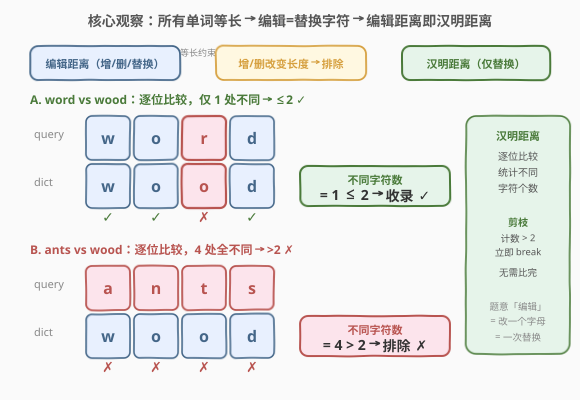
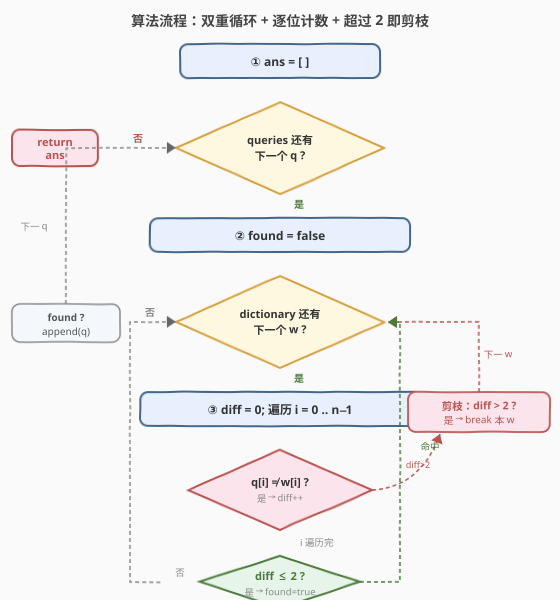
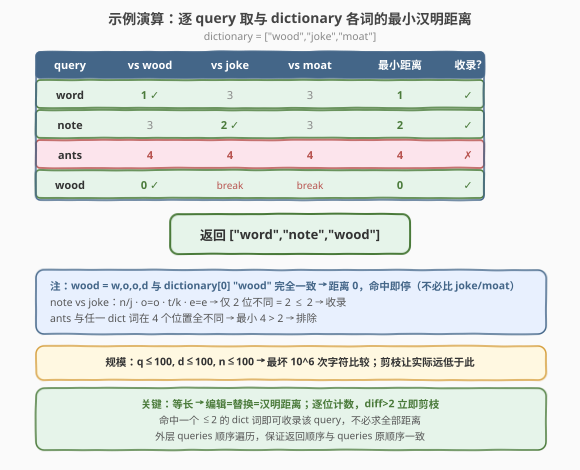

# 距离字典两次编辑以内的单词

- **题目名称**：距离字典两次编辑以内的单词
- **链接**：[2452. 距离字典两次编辑以内的单词](https://leetcode.cn/problems/words-within-two-edits-of-dictionary/)
- **难度**：中等
- **标签**：数组、字符串、暴力枚举

## 1. 题目概述

给你两个字符串数组 `queries` 和 `dictionary`，数组中所有单词都只包含小写英文字母，且**长度都相同**。一次**编辑**指从 `queries` 中选一个单词，将**任意一个字母修改成任何其他字母**。返回 `queries` 中所有「不超过两次编辑即可变成 `dictionary` 中某个单词」的字符串，顺序与 `queries` 原顺序相同。

**示例 1**：

```text
输入：queries = ["word","note","ants","wood"], dictionary = ["wood","joke","moat"]
输出：["word","note","wood"]
解释：
- "word" 把 'r' 换成 'o' 即 "wood"（1 次）；
- "note" 把 'n'→'j' 且 't'→'k' 即 "joke"（2 次）；
- "ants" 需超过 2 次编辑才能变成任一字典词；
- "wood" 本身就在字典里（0 次）。
```

**示例 2**：

```text
输入：queries = ["yes"], dictionary = ["not"]
输出：[]
解释："yes" 与 "not" 三个位置全不同，需 3 次编辑 > 2，故排除。
```

**约束条件**：

- $1 \le \text{queries.length}, \text{dictionary.length} \le 100$
- $n = \text{queries}[i].\text{length} = \text{dictionary}[j].\text{length}$，$1 \le n \le 100$
- 所有单词只含小写英文字母。

> 💡 **题眼**：题目定义的「编辑」只允许**替换一个字母**；而所有单词又**等长**，意味着插入/删除会改变长度从而永远无法匹配——因此「编辑距离」在此退化为**逐位比较、统计不同字符个数**的**汉明距离**（Hamming distance）。这是把一般「编辑距离」问题折叠成最简形式的钥匙。

---

## 2. 解题思路

### 2.1 暴力思路：对每个 query 配每个 dict 词全程比较

最直白的做法是三重循环：对每个 `q`，遍历每个字典词 `w`，逐位比较统计不同字符数 `diff`，若某个 `w` 的 `diff ≤ 2` 则收录 `q`。规模上 $q \le 100$、$d \le 100$、$n \le 100$，最坏 $10^6$ 次字符比较，能 AC。

但这版若不加优化，会**对每个 query 配每个 dict 词都比满 $n$ 位**，即使前几位就已超过 2 也继续白比。结合「只需判断是否 $\le 2$」的特性，可以引入**剪枝**：计数一旦超过 2 立即 `break`，跳过当前 `w`。

### 2.2 核心观察：等长 → 编辑=替换 → 汉明距离 + 命中即停



两个关键观察把问题降到最简：

1. **等长 ⇒ 仅替换 ⇒ 汉明距离**。`queries[i]` 与 `dictionary[j]` 等长，且「编辑」只允许改字母。要把 `q` 变成 `w`，每个位置要么字母相同（0 次）、要么换一次（1 次），不同位置的修改**互相独立**。于是「最少编辑次数」$=$ 两个串在对应位置上**不同字符的个数**，即汉明距离：
   $$
   \mathrm{dist}(q, w) = \sum_{i=0}^{n-1} \mathbb{1}[\,q_i \ne w_i\,]
   $$
   不需要 DP，不需要 Levenshtein 的增删分支——$O(n)$ 一趟扫描即可算出。

2. **只判 $\le 2$，命中即停**。题目只问「是否存在一个字典词使距离 $\le 2$」，不求精确距离。所以：
   - **位置内剪枝**：统计 `diff` 时，一旦 `diff > 2` 立刻 `break` 本 `w`，剩下的位不用比；
   - **字典层剪枝**：一旦某个 `w` 满足 `diff ≤ 2`，`q` 即被收录，后续字典词不必再看。

> 💡 **为什么「不同位置的修改互相独立」是关键？** 一般编辑距离（[72. 编辑距离](https://leetcode.cn/problems/edit-distance/)）允许插入/删除，一次操作会让后续字符**整体错位**，所以必须用 DP 同步对齐前缀。而本题只替换、不改长度，每个位置的修改**不影响其他位置的对齐**——第 $i$ 位是否相同与第 $i+1$ 位无关，因此逐位独立计数即可，无需记忆化前缀状态。

### 2.3 算法流程图



1. `ans = []`；
2. 遍历 `queries` 中每个 `q`，置 `found = false`；
3. 遍历 `dictionary` 中每个 `w`（命中即 `break`）：
   - `diff = 0`，遍历 `i = 0 \dots n-1`（`diff > 2` 即 `break`）：
     - 若 `q[i] != w[i]`，`diff++`；
   - 若循环结束时 `diff ≤ 2`，置 `found = true`，跳出字典循环；
4. 若 `found`，把 `q` 追加到 `ans`；
5. 返回 `ans`。外层按 `queries` 顺序遍历，天然保证返回顺序。

### 2.4 示例演算



以示例 1 `queries = ["word","note","ants","wood"]`，`dictionary = ["wood","joke","moat"]` 为例：

| query | vs wood | vs joke | vs moat | 最小距离 | 收录? |
|-------|---------|---------|---------|----------|-------|
| word | $1$（r/o） | $3$ | $3$ | $1 \le 2$ | ✓ |
| note | $3$ | $2$（n/j, t/k） | $3$ | $2 \le 2$ | ✓ |
| ants | $4$ | $4$ | $4$ | $4 > 2$ | ✗ |
| wood | $0$ | （break） | （break） | $0 \le 2$ | ✓ |

- **word**：`w-o-r-d` vs `w-o-o-d`，仅第 3 位 `r`/`o` 不同 → 距离 1，命中即收录；
- **note**：`n-o-t-e` vs `j-o-k-e`，第 1 位 `n`/`j`、第 3 位 `t`/`k` 不同（第 2 位 `o`、第 4 位 `e` 相同）→ 距离 2，收录；
- **ants**：与三个字典词在全部 4 位都不同 → 最小距离 4 > 2，排除；
- **wood**：与 `dictionary[0]` 完全相同 → 距离 0，第一个字典词即命中，`joke`/`moat` 无需比较（字典层剪枝）。

最终返回 `["word","note","wood"]`。

---

## 3. 参考代码

### C++

```cpp
class Solution {
public:
    vector<string> twoEditWords(vector<string>& queries, vector<string>& dictionary) {
        vector<string> ans;
        for (string& q : queries) {
            bool found = false;
            for (const string& w : dictionary) {
                int diff = 0;
                for (int i = 0; i < (int)q.size(); ++i) {
                    if (q[i] != w[i] && ++diff > 2) break;
                }
                if (diff <= 2) { found = true; break; }
            }
            if (found) ans.push_back(q);
        }
        return ans;
    }
};
```

> 💡 把判不等与自增合并写 `if (q[i] != w[i] && ++diff > 2) break;`：`&&` 短路保证只有真的不同才自增 `diff`，且自增后立刻判 `> 2`，一旦超过就 `break` 本 `w`，剩下的位不比。`diff <= 2` 的判定在循环正常结束（未剪枝退出）或正好 $=3$ 之外的 $\le 2$ 时成立，逻辑等价于「遍历完所有位且差异不超 2」。

### Python

```python
class Solution:
    def twoEditWords(self, queries: List[str], dictionary: List[str]) -> List[str]:
        ans = []
        for q in queries:
            found = False
            for w in dictionary:
                diff = 0
                for a, b in zip(q, w):
                    if a != b:
                        diff += 1
                        if diff > 2:
                            break
                if diff <= 2:
                    found = True
                    break
            if found:
                ans.append(q)
        return ans
```

> 💡 Python 用 `zip(q, w)` 逐位配对最简洁（两串等长，无需下标）。也可一行表达距离判定 `if sum(a != b for a, b in zip(q, w)) <= 2:`，但显式 `break` 提前剪枝能在 `diff > 2` 时立即停止，避免比完所有位——对 $n=100$ 而言平均省下一半比较。

---

## 4. 复杂度分析

| 维度 | 复杂度 | 说明 |
|------|--------|------|
| **时间复杂度** | $O(q \cdot d \cdot n)$ | 三重循环：$q$ 个 query、$d$ 个字典词、每位最多比到 `diff>2`；最坏 $100\times100\times100=10^6$ |
| **空间复杂度** | $O(1)$ 额外 | 仅常数变量 `diff`/`found`；结果数组不计入 |
| 对照：无剪枝全程比较 | $O(q \cdot d \cdot n)$ | 同阶但常数更大：每个 `w` 必比满 $n$ 位，剪枝版平均远小于此 |
| 对照：DP 编辑距离 | $O(q \cdot d \cdot n)$ | 同阶但常数/实现更繁；本题等长无需 DP，是过度设计 |

> ⚠️ 剪枝不改变最坏渐近阶（最坏情形所有词都几乎相同，`diff` 长期 $\le 2$ 一直比到底），但**平均**让内层循环常数大幅下降——当单词差异普遍较大时，前几位即触发 `diff>2` 而 `break`，实际比较次数远低于 $10^6$。本题 $n \le 100$，即便最坏 $10^6$ 也瞬 AC，故无需更优算法。

---

## 5. 扩展：当 $n$ 与 $d$ 很大时的优化思路

本题数据规模小（$q, d \le 100$，$n \le 100$），双重循环 + 剪枝已是最优解。但若把规模放大（如 $d, n \le 10^5$），暴力 $O(qdn)$ 不可行，需要更聪明的做法。一个经典思路是**掩码/删除哈希**：

- **观察**：若两串汉明距离 $\le 2$，则它们在 $n-2$ 个位置上字符相同。等价地，存在一对位置 $\{i,j\}$，把这两位「挖空」后剩余的 $n-2$ 长子串完全一致。
- **做法**：对每个字典词 $w$，枚举所有 $\binom{n}{2}$ 对位置 $\{i,j\}$，把挖空两位后的「签名」存入哈希表；对每个 query $q$ 同样枚举 $\binom{n}{2}$ 个签名查表，命中则可能距离 $\le 2$，再做一次精确校验去伪。
- **复杂度**：$O(d \cdot n^2)$ 预处理 + $O(q \cdot n^2)$ 查询，当 $n \le 100$ 时 $\binom{100}{2}=4950$，反而比暴力更慢；只有当 $n$ 远小于 $d$ 且 $d$ 极大时才划算。

> 💡 这类「允许 $k$ 处不同」的近邻匹配问题，本质是把「逐位比较」转成「构造可哈希的容错签名」。当 $k$ 很小、$n$ 适中时，删除 $k$ 位签名是通用套路；本题 $k=2$ 且 $n \le 100$，签名数 $\binom{n}{k}$ 与 $d \cdot n$ 同阶，暴力反而更简单。学会在「暴力已够」时不过度设计，也是工程判断的一部分。

---

## 6. 面试要点

1. **为什么本题的「编辑距离」不用 DP，而能直接逐位计数？**

   > 因为所有单词**等长**且编辑只允许**替换字母**。插入/删除会改变长度，无法把等长的 `q` 变成等长的 `w`，故被排除；剩下只有替换，而替换**不改变字符对齐**——第 $i$ 位是否相同只取决于 `q[i]` 与 `w[i]`，与其他位置无关。于是距离 $=$ 不同字符个数，逐位计数即可，无需 DP 同步前缀。对比 [72. 编辑距离](https://leetcode.cn/problems/edit-distance/) 允许增删，一次操作让后续错位，必须用 DP。

2. **剪枝在哪个层面起作用？分别剪什么？**

   > 两层剪枝：**位置层**——统计 `diff` 时一旦 $>2$ 立即 `break` 内层位循环，剩下字符不必比较（针对单个 $w$）；**字典层**——一旦某个 $w$ 满足 `diff ≤ 2`，`q` 即被收录，后续字典词不再遍历。剪枝不改最坏渐近阶，但平均常数大幅下降。

3. **返回顺序如何保证与 `queries` 一致？**

   > 外层按 `queries` 的原始顺序遍历，命中即追加到 `ans`，故 `ans` 中元素相对顺序天然与 `queries` 一致，无需额外排序。

4. **为什么不用 72 题的 Levenshtein DP？**

   > DP 编辑距离 $O(n^2)$ 预处理 + $O(n^2)$ 比较一个对，对每对 query/dict 都跑一次 $O(n^2)$，总 $O(qdn^2)$，远慢于逐位 $O(qdn)$，且实现更繁。关键是它没利用「等长只替换」这一约束——本题是 Levenshtein 的**退化特例**，用 DP 是过度设计。

5. **若 `dictionary` 可预处理、`queries` 在线到达，如何优化每次查询？**

   > 可建字典树（Trie）存 `dictionary`，对每个 query 在 Trie 上做「允许 $\le 2$ 位不匹配」的 DFS：沿匹配位正常下走，遇到不匹配则消耗 1 次编辑额度继续递归。剪枝条件为「已用编辑数 $>2$ 即回溯」。这把单次查询压到接近 $O(n)$ 量级（实际依赖分支因子与容错预算），适合 $d$ 极大、$q$ 也大的在线场景。本题规模小，Trie 是杀鸡用牛刀。

> 💡 **一句话总结**：等长只替换 → 编辑距离即汉明距离；双重循环逐位计数，`diff>2` 立即剪枝、命中即停，$O(qdn)$ 最坏 $10^6$ 瞬 AC。

---

## 7. 同类练习题

- [461. 汉明距离](https://leetcode.cn/problems/hamming-distance/)（[题解](../0401-0500/461_汉明距离.md)）：位级汉明距离（数 XOR 中 1 的个数），本题是字符级汉明的直接对应，对照「位」与「字符」两种载体
- [72. 编辑距离](https://leetcode.cn/problems/edit-distance/)（[题解](../0001-0100/72_编辑距离.md)）：允许增删替换的 Levenshtein DP 母题，对照「等长只替换→逐位计数」与「可增删→DP 对齐前缀」
- [2352. 相等行列对](https://leetcode.cn/problems/equal-row-and-column-pairs/)（[题解](../2301-2400/2352_相等行列对.md)）：逐位比较判定完全相等（$k=0$ 特例），对照「零容错」与「容许 2 处不同」
- [1347. 制造字母异位词的最小步数](https://leetcode.cn/problems/minimum-number-of-steps-to-make-two-strings-anagram/)（[题解](../1301-1400/1347_制造字母异位词的最小步骤数.md)）：位置无关、只看频率差的最小步数，对照「位置对齐逐位差」与「位置无关频率差」两种相似度量
