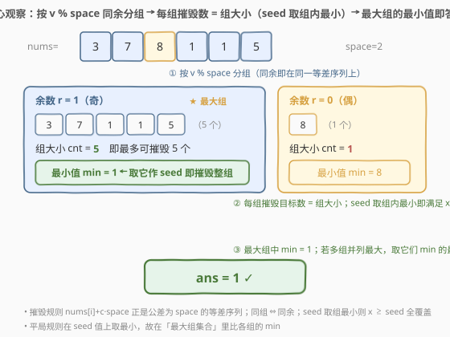
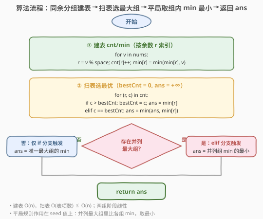

# 摧毁一系列目标

- **题目名称**：摧毁一系列目标
- **链接**：[2453. 摧毁一系列目标](https://leetcode.cn/problems/destroy-sequential-targets/)
- **难度**：中等
- **标签**：数组、哈希表、计数、同余分组

## 1. 题目概述

给你一个下标从 **0** 开始的数组 `nums`，它包含若干正整数，表示数轴上你需要摧毁的目标所在的位置。同时给你一个整数 `space`。

你有一台机器可以摧毁目标。给机器**输入** `nums[i]`，这台机器会摧毁所有位置在 $nums[i] + c \cdot space$ 的目标，其中 $c$ 是任意非负整数。你想摧毁 `nums` 中**尽可能多**的目标。

请你返回在摧毁数目最多的前提下，`nums[i]` 的**最小值**。

**示例 1**：

```text
输入：nums = [3,7,8,1,1,5], space = 2
输出：1
解释：输入 nums[3]=1，可摧毁位于 1,3,5,7,9,... 的目标，共 5 个（除 nums[2]=8）。
      没有办法摧毁多于 5 个目标，故返回 1。
```

**示例 2**：

```text
输入：nums = [1,3,5,2,4,6], space = 2
输出：1
解释：输入 nums[0]=1 或 nums[3]=2 都会摧毁 3 个目标。
      1 是最小的能摧毁 3 个目标的数，故返回 1。
```

**示例 3**：

```text
输入：nums = [6,2,5], space = 100
输出：2
解释：无论输入哪个数都只能摧毁 1 个目标，最小整数是 nums[1]=2。
```

**约束条件**：

- $1 \le \text{nums.length} \le 10^5$
- $1 \le \text{nums}[i] \le 10^9$
- $1 \le \text{space} \le 10^9$

> 💡 **关键不变式**：机器摧毁的位置 $nums[i] + c \cdot space$ 恰是一条**公差为 `space` 的等差数列**。于是「目标 $x$ 被摧毁」等价于两个条件——$x$ 与 seed **同余**（$x \bmod space = nums[i] \bmod space$）且 $x \ge nums[i]$。前者把目标**按余数聚成同余组**，后者决定组内「seed 越小，覆盖越多」。把这两点叠起来，就得到 $O(n)$ 的解法。

---

## 2. 解题思路

### 2.1 暴力思路：逐 seed 模拟计数

最直白的做法是**对每个候选 seed 暴力数一遍**它能摧毁多少目标：

```text
bestCnt = 0, ans = +∞
for s in nums:                         # 枚举每个 seed
    cnt = 0
    for x in nums:                     # 数能摧毁的目标
        if x % space == s % space and x >= s:
            cnt += 1
    if cnt > bestCnt or (cnt == bestCnt and s < ans):
        bestCnt = cnt; ans = s
return ans
```

正确性没问题，但每个 seed 都要 $O(n)$ 重扫一遍，整体 $O(n^2)$，对 $n \le 10^5$ 必然超时。更糟的是它**把同余信息重复计算了 $n$ 次**——其实每个目标属于哪个同余组，一遍扫描就能全部确定。

> ⚠️ 暴力把「seed 能摧毁谁」当成逐次现扫的问题，但全部目标的结构在**一次预处理**后就能任意查询——关键观察：**按余数分组，组内取最小作 seed 即摧毁整组**。

### 2.2 核心观察：同余分组 + 组内取最小即摧毁全组



把摧毁规则拆成两条等价的判定：

1. **同余条件**：$x$ 被 seed $s$ 摧毁 $\Rightarrow x \equiv s \pmod{\text{space}}$。即 $x$ 与 $s$ 落在**同一条等差数列**上。于是目标按 $r = v \bmod \text{space}$ 天然分到若干**同余组**。
2. **下界条件**：$c \ge 0$ 要求 $x = s + c\cdot\text{space} \ge s$。即组内只有「不小于 seed」的目标会被摧毁。

两条合起来：固定一组同余目标 $V_r$，选 seed $s \in V_r$ 时摧毁数 $=|\{x \in V_r : x \ge s\}|$。这个量**随 $s$ 单调不增**——$s$ 越小，覆盖的组内目标越多。所以组内能摧毁的上界就是**整组大小** $|V_r|$，且**当且仅当 $s = \min(V_r)$ 时取到**（取到组最小，则组内所有 $x \ge s$ 全部命中）。

于是问题化为**三步流水线**：

1. **建组表**：遍历 `nums`，对每个 $v$ 计算 $r = v \bmod \text{space}$，维护该组的计数 $\text{cnt}[r]$ 与组内最小 $\text{min}[r]$；
2. **找最大组**：组大小 $\text{cnt}[r]$ 的最大值 $\text{bestCnt}$，就是「最多能摧毁多少」；
3. **平局取最小 seed**：在所有 $\text{cnt}[r] = \text{bestCnt}$ 的组里，比较各自的 $\text{min}[r]$，取最小——这就是答案。

> 💡 **为什么只需考察每组的「最小值」作 seed？** 因为任何非最小的 seed $s' > \min(V_r)$ 都会漏掉 $\min(V_r)$ 这个目标，摧毁数严格小于 $|V_r|$，**绝不可能**优于组最小（后者摧毁整组）。所以全局最优 seed 必是某个「最大组的组最小」——候选集从 $n$ 个 seed 直接收缩到「最大组个数」个，且每个候选就是该组的 $\text{min}$。平局规则恰作用在这些 $\text{min}$ 上：取它们的最小值。

更新规则可写成两条分支（扫表时逐项执行）：

$$
\text{对每个 } (r,\,c) \in \text{cnt}:\quad
\begin{cases}
c > \text{bestCnt} \;\Rightarrow\; \text{bestCnt} \leftarrow c,\;\text{ans} \leftarrow \text{min}[r]\\
c = \text{bestCnt} \;\Rightarrow\; \text{ans} \leftarrow \min(\text{ans},\,\text{min}[r])
\end{cases}
$$

> 💡 **为什么是 $O(n)$？** 建表一遍 $O(n)$（每元素 $O(1)$ 哈希操作），扫表一遍 $O(\text{表项数}) \le O(n)$（不同余数至多 $\min(n,\text{space})$ 个）。两阶段线性，无需排序、无需对每个 seed 重扫——这正是「**一次预处理 + 派生键分组**」把 $O(n^2)$ 压成 $O(n)$ 的经典范式。

### 2.3 算法流程图



两阶段：① 建表——遍历 `nums`，按 $r=v\bmod\text{space}$ 累加 $\text{cnt}[r]$ 并维护 $\text{min}[r]$；② 扫表——用上述两分支规则选出 $\text{bestCnt}$ 与对应的最小 $\text{min}$。平局时 `elif` 分支负责在并列最大组间取 $\min$，最终 `ans` 即所求。

### 2.4 示例演算

![示例演算：nums=[3,7,8,1,1,5] 逐元素建表 → 选最大组 r=1 → ans=1](../images/2453_example_walkthrough.svg)

以示例 1 `nums = [3,7,8,1,1,5]`，`space = 2` 演算：

**第一步——逐元素建表**（$r = v \bmod 2$）：

| 遍历 $v$ | $r=v\bmod 2$ | $\text{cnt}[r]$ 更新后 | $\text{min}[r]$ 更新后 |
|----------|--------------|------------------------|------------------------|
| $3$ | $1$ | $\text{cnt}[1]=1$ | $\text{min}[1]=3$ |
| $7$ | $1$ | $\text{cnt}[1]=2$ | $\text{min}[1]=3$ |
| $8$ | $0$ | $\text{cnt}[0]=1$ | $\text{min}[0]=8$ |
| $1$ | $1$ | $\text{cnt}[1]=3$ | $\text{min}[1]=1\;\downarrow$ |
| $1$ | $1$ | $\text{cnt}[1]=4$ | $\text{min}[1]=1$ |
| $5$ | $1$ | $\text{cnt}[1]=5$ | $\text{min}[1]=1$ |

**第二步——扫表选最大**：

| 组 | $\text{cnt}$ | $\text{min}$ | 决策 |
|----|--------------|--------------|------|
| $r=1$ | $5$ | $1$ | $5>0$ → $\text{bestCnt}=5$，$\text{ans}=1$ |
| $r=0$ | $1$ | $8$ | $1<5$ → 跳过 |

最终 $\text{bestCnt}=5$，$\text{ans}=1$ ✓。组 $r=1$ 最小值恰为 $1$，以它作 seed 摧毁 $\{1,1,3,5,7\}$ 共 5 个；$r=0$ 组仅 $\{8\}$，不可并列。

> 💡 **示例 2 的平局**：`nums=[1,3,5,2,4,6]`，`space=2` 得两组 $r=1\!:\{1,3,5\}$ 与 $r=0\!:\{2,4,6\}$，$\text{cnt}$ 均 $3$ 并列最大，于是比 $\min$：$\min(1,2)=1$，返回 $1$。这正是 `elif` 分支的作用——在并列最大组里取组 $\min$ 的最小。

---

## 3. 参考代码

### C++

```cpp
class Solution {
public:
    int destroyTargets(vector<int>& nums, int space) {
        unordered_map<int,int> cnt, mn;
        for (int v : nums) {
            int r = v % space;
            cnt[r]++;
            auto it = mn.find(r);
            if (it == mn.end()) mn[r] = v;
            else if (v < it->second) it->second = v;
        }
        int bestCnt = 0, ans = INT_MAX;
        for (auto& [r, c] : cnt) {
            if (c > bestCnt) {
                bestCnt = c;
                ans = mn[r];
            } else if (c == bestCnt) {
                ans = min(ans, mn[r]);
            }
        }
        return ans;
    }
};
```

> 💡 两张哈希表 `cnt`/`mn` 同步按余数 $r$ 索引：建表时 `cnt[r]++` 并就地维护 `mn[r]` 的最小。扫表时用结构化绑定 `auto& [r, c]` 拆出键值；`c > bestCnt` 必须先判、用 `else if` 串接，避免同一项既「更大」又「相等」被重复处理。`ans` 初值 `INT_MAX` 兜底——首次遇项 $c\ge1>0$ 必触发 `if` 分支赋值，循环结束必有合法答案。

### Python

```python
class Solution:
    def destroyTargets(self, nums: List[int], space: int) -> int:
        cnt = Counter(v % space for v in nums)
        mn = {}
        for v in nums:
            r = v % space
            if r not in mn or v < mn[r]:
                mn[r] = v
        best = 0
        ans = float('inf')
        for r, c in cnt.items():
            if c > best:
                best = c
                ans = mn[r]
            elif c == best and mn[r] < ans:
                ans = mn[r]
        return ans
```

> 💡 `Counter` 一行生成各余数频次；`mn` 单独再扫一遍维护组内最小（也可在建 `cnt` 时同循环维护，省一次遍历但可读性略降）。`best=0` 保证首个非零项必触发 `if`；`elif` 串 `and mn[r] < ans` 在并列时收紧答案。注意平局分支不可写成 `c >= best`——会把「更大」情形误并入「相等」逻辑，导致 `best` 不更新。

---

## 4. 复杂度分析

| 维度 | 复杂度 | 说明 |
|------|--------|------|
| **时间复杂度** | $O(n)$ | 建表遍历 $O(n)$ + 扫表 $O(\text{表项数}) \le O(n)$，两阶段线性 |
| **空间复杂度** | $O(\min(n,\text{space}))$ | 不同余数至多 $\min(n,\text{space})$ 个；`space` 可达 $10^9$ 但被 $n$ 上界钳制 |
| 对照：逐 seed 暴力 | $O(n^2)$ / $O(1)$ | 每 seed 重扫一遍数同余目标，正确但必超时 |
| 对照：排序后分组 | $O(n\log n)$ / $O(1)$ | 排序使同余相邻，扫描统计组大小与组最小；省空间但多一个 $\log$ |

> 💡 本题 $n \le 10^5$，哈希法 $O(n)$ 最稳。排序法把空间压到 $O(1)$ 且避免哈希常数，是「禁用额外空间 / 哈希常数敏感」时的备选；但需注意排序后「同余相邻」需先按 $v\bmod\text{space}$、再按 $v$ 排序，才能在一段连续区间内取到组最小（即该段首元素）。

---

## 5. 扩展：摧毁规则的代数刻画与「取最小」为何充分

**摧毁数的代数式**。给定 seed $s$，被摧毁的目标集合可精确写成：

$$
D(s) = \{\, x \in \text{nums} : x \equiv s \pmod{\text{space}},\; x \ge s \,\}
$$

两项约束分别对应「同余」（落在同一等差序列）与「下界」（$c\ge0$）。把同余目标按 $r$ 分组后，$D(s)$ 就是 $s$ 所在组 $V_r$ 中不小于 $s$ 的前缀。于是 $|D(s)|$ 随 $s$ **单调不增**——组内 seed 越靠后，截掉的目标越多。

**为何只需考察组最小**。设组 $V_r$ 排序为 $v_1 < v_2 < \dots < v_k$（$v_1=\min(V_r)$）。选 $s=v_j$ 时 $|D(s)|=k-j+1$，在 $j=1$ 处取最大值 $k=|V_r|$。任何 $j>1$ 的 seed 都严格劣于 $v_1$，故**组内唯一最优 seed 就是组最小**。全局最优 seed 必落在「最大组的组最小」集合 $\{\,\min(V_r) : |V_r|=\text{bestCnt}\,\}$ 中，平局取该集合的最小值即答案。这一论证把「枚举全部 $n$ 个 seed」收缩为「枚举最大组的组最小」，是本题 $O(n^2)\to O(n)$ 的根本。

**与 $c\ge0$ 的关系**。下界条件 $x\ge s$ 是唯一的「方向性」来源——若规则改成 $c\in\mathbb{Z}$（双向等差序列），则同余组内任意 seed 都摧毁整组，答案退化为「最大组中任意元素的最小」即 $\min(V_{r^*})$，结论一致但论证更弱。本题因 $c\ge0$ 才必须取组最小，理解这一点可避免误把「同余即摧毁」当成充分条件。

> 💡 一句话：**同余决定分组，下界决定组内取最小**。两件事叠起来，最优 seed =「最大组的组最小」；多组并列时取这些组最小的最小。

---

## 6. 面试要点

1. **为什么「组内取最小」就能摧毁整组？**

   > 摧毁需满足同余且 $x\ge s$。组内所有 $x$ 同余，只要再满足 $x\ge s$ 即被摧毁。取 $s=\min(V_r)$，组内所有 $x\ge s$ 自然成立，于是整组全中，摧毁数恰为组大小 $|V_r|$——这是该组能取到的上界。

2. **同余分组的直觉从何而来？**

   > 机器摧毁位置 $s+c\cdot\text{space}$ 是公差为 `space` 的等差序列。等差序列上的元素恰是「与 seed 模 `space` 同余」者。所以「能否被某个 seed 摧毁」的第一道筛子就是余数——同余目标共享同一条可能的摧毁序列，自然聚成一组。

3. **平局时为什么是比「组最小」而不是比余数？**

   > 题目要求「摧毁数目最多的前提下，seed 值最小」，平局作用在 **seed 值** 上。能取到最大摧毁数的 seed 只有各最大组的组最小（其余 seed 严格更少）。所以候选就是这些组最小，比它们的大小取最小即可——与余数数值无关，余数只是分组键。

4. **能否不显式存 `min` 表，直接在 `cnt` 表上做？**

   > 不行。组大小决定「能不能并列最大」，组最小决定「并列时谁更小」——这是两个独立维度，必须同表维护。若只存 `cnt`，平局时无从得知各组的最小 seed，仍需回查 `nums`，反而更慢。`cnt` 与 `min` 同按 $r$ 索引、同循环维护，是最紧凑的表示。

5. **空间复杂度为何是 $O(\min(n,\text{space}))$ 而非 $O(\text{space})$？**

   > 不同余数个数 $\le\min(n,\text{space})$：每个元素至多贡献一个新余数（受 $n$ 钳制），而余数取值范围 $[0,\text{space})$ 受 `space` 钳制。`space` 可达 $10^9$，但 $n\le10^5$ 时实际表项远小于 `space`，故以 $n$ 为上界，不能开 `space` 大小的定长数组。

> 💡 **一句话总结**：按 $v\bmod\text{space}$ 同余分组 → 维护每组 `cnt` 与 `min` → 最大组的 `min` 即最优 seed，多组并列取 `min` 最小 ⟹ $O(n)$。下界条件 $x\ge s$ 是「组内取最小」的根因；平局规则作用在 seed 值而非余数上。

---

## 7. 同类练习题

- [974. 和可被K整除的子数组](https://leetcode.cn/problems/subarray-sums-divisible-by-k/)（[题解](../0901-1000/974_和可被K整除的子数组.md)）：同余定理做分组计数，同「模 space 分组」思想，对照「按余数聚簇」与「前缀和同余」
- [128. 最长连续序列](https://leetcode.cn/problems/longest-consecutive-sequence/)（[题解](../0101-0200/128_最长连续序列.md)）：哈希集合分组再统计最长链，同「按衍生键分组 + 一次扫描选最值」骨架
- [454. 四数相加 II](https://leetcode.cn/problems/4sum-ii/)（[题解](../0401-0500/454_四数相加II.md)）：分组哈希计数再查补数，同「哈希按键聚簇 + 计数」范式
- [525. 连续数组](https://leetcode.cn/problems/contiguous-array/)（[题解](../0501-0600/525_连续数组.md)）：前缀和 + 哈希按衍生键分组，同「派生键分组」思想（0 当 −1 转换）
- [2006. 差的绝对值为 K 的数对数目](https://leetcode.cn/problems/count-number-of-pairs-with-absolute-difference-k/)：对每个元素查「伙伴值」是否在场并计数，同「哈希计数 + 配对查询」骨架
