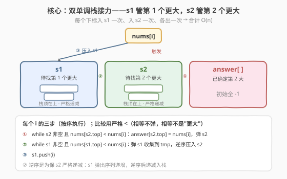
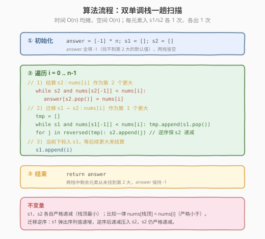

# 下一个更大元素 IV

- **题目名称**：下一个更大元素 IV
- **链接**：[2454. 下一个更大元素 IV](https://leetcode.cn/problems/next-greater-element-iv/)
- **难度**：困难
- **标签**：栈、数组、单调栈、堆（优先队列）、排序、二分查找

## 1. 题目概述

给你一个下标从 `0` 开始的非负整数数组 `nums`。对每个 `nums[i]`，找到它右侧的**第二大**整数 `nums[j]`：

- $j > i$；
- $\text{nums}[j] > \text{nums}[i]$；
- 在 $i, j$ 之间**恰好存在一个** $k$ 满足 $\text{nums}[k] > \text{nums}[i]$（即 `nums[j]` 是右侧第 **2** 个严格大于 `nums[i]` 的元素）。

若不存在这样的 `nums[j]`，则第二大整数为 $-1$。返回数组 `answer`。

**示例 1**：

```text
输入：nums = [2,4,0,9,6]
输出：[9,6,6,-1,-1]
解释：
  i=0 (2)：右侧大于 2 的依次是 4、9、6 → 第 2 个是 9
  i=1 (4)：右侧大于 4 的依次是 9、6 → 第 2 个是 6
  i=2 (0)：右侧大于 0 的依次是 9、6 → 第 2 个是 6
  i=3 (9)、i=4 (6)：右侧没有更大的数 → -1
```

**示例 2**：

```text
输入：nums = [3,3]
输出：[-1,-1]
解释：每个数右边都没有更大的数。
```

**约束条件**：

- $1 \le \text{nums.length} \le 10^5$
- $0 \le \text{nums}[i] \le 10^9$

> 💡 关键观察：这是「下一个更大元素」家族的困难版——[496](../0401-0500/496_下一个更大元素 I.md)/[503](../0501-0600/503_下一个更大元素 II.md) 找**第 1 个**更大，本题要找**第 2 个**更大。单调栈天然擅长「暂存尚未结算的元素，遇到触发值批量结算」；既然要结算两次，就用**两个串联的单调栈接力**：`s1` 管第 1 个更大、`s2` 管第 2 个更大，元素从 `s1` 流向 `s2` 再流向答案，每个下标各进出栈一次，整体仍 $O(n)$。

---

## 2. 解题思路

### 2.1 暴力思路：每个元素向后扫两遍

对每个 $i$，从 $i+1$ 起向右扫描，数出严格大于 $\text{nums}[i]$ 的元素，取第 2 个：

```text
for i in 0..n-1:
    cnt = 0
    for j in i+1..n-1:
        if nums[j] > nums[i]:
            cnt += 1
            if cnt == 2:
                answer[i] = nums[j]
                break
```

最坏情况（数组严格递增）每个 $i$ 要扫到末尾，总比较次数 $\binom{n}{2} \approx n^2/2$，$n = 10^5$ 时约 $5 \times 10^9$ 次，必然 TLE。

> ⚠️ 瓶颈仍是「每个 $i$ 独立向后重扫」——大量比较在多个 $i$ 间重复。突破口和 [739. 每日温度](../0701-0800/739_每日温度.md) 一样：让**后来的大值一次性结算多个待答案元素**。只不过这里每个元素要被结算**两次**，所以用两个栈接力。

### 2.2 核心观察：双单调栈接力



维护两个**严格递减**（栈顶最小）的单调栈，都存**下标**：

- **`s1`**：还没找到**第 1 个**更大值的下标集合；
- **`s2`**：已找到第 1 个、还在等**第 2 个**更大值的下标集合。

对新来的 $\text{nums}[i]$，按以下三步处理（比较一律用严格 $<$，因为「相等不是更大」）：

1. **结算 `s2`**：`nums[i]` 是 `s2` 栈顶的第 2 个更大 → `while s2 非空 且 nums[s2.top] < nums[i]`：`answer[s2.pop()] = nums[i]`；
2. **迁移 `s1 → s2`**：`nums[i]` 是 `s1` 栈顶的第 1 个更大 → `while s1 非空 且 nums[s1.top] < nums[i]`：弹出收入 `tmp`，然后**逆序**压入 `s2`（此时它们转去等第 2 个更大）；
3. **入 `s1`**：`s1.push(i)`，等后续更大的值来结算它的第 1 个更大。

> 💡 **为何两栈都严格递减？** 栈里存的是「尚未结算、等待更大值」的元素。栈顶是最小、最迫切等更大值的那个。新值一来先和栈顶（最小者）比，能弹就连续弹——这正是「一次结算多个」的来源，与单栈版 [739](../0701-0800/739_每日温度.md) 完全同构。递增栈会让小元素被压在底下永远等不到结算，破坏机制。口诀：**找更大用递减栈**。

> ⚠️ **迁移为何要「逆序」压入 `s2`？** `s1` 严格递减（底大顶小），从栈顶弹出得到的序列值是**递增**的（先弹小的、后弹大的）。若原序压入 `s2`，会把递增序列叠在 `s2` 顶部，破坏其严格递减性。**逆序后变递减**，压入 `s2` 顶部恰保递减。这一步是把「一个栈的弹出序列」搬运到「另一个同向单调栈」的通用技巧。

### 2.3 算法流程图



骨架四步：

1. **初始化**：`answer = [-1] * n`，`s1 = s2 = []`；
2. **遍历** $i = 0 \dots n-1$，依次执行 2.2 的三步（结算 `s2` → 迁移 `s1`→`s2` → `s1.push(i)`）；
3. **结束**：`s1`、`s2` 中剩余下标从未找到第 2 大，`answer` 保持 $-1$，直接返回。

$i$ 全程单调前进，每个下标最多入 `s1` 一次、入 `s2` 一次、各出一次，总计 $O(n)$。

### 2.4 示例演算

以示例 1 `nums = [2,4,0,9,6]` 为例（下标与值并列，栈顶在右）：

![示例演算：nums=[2,4,0,9,6] 的双栈状态演化](../images/nge_iv_example_walkthrough.svg)

- **步 1**（$i=1$，值 4）：`nums[0]=2 < 4`，从 `s1` 弹出下标 0 迁入 `s2`（值 2 找到第 1 个更大 = 4），再压入下标 1；
- **步 3**（$i=3$，值 9）：先结算 `s2`——`nums[0]=2 < 9` → `answer[0]=9`（值 2 的第 2 大是 9）；再把 `s1` 里的下标 2、1（值 0、4）逆序压入 `s2`，最后压入下标 3；
- **步 4**（$i=4$，值 6）：结算 `s2`——`nums[2]=0 < 6` → `answer[2]=6`，`nums[1]=4 < 6` → `answer[1]=6`（值 0、4 的第 2 大都是 6）；`s1` 栈顶 `nums[3]=9` 不小于 6，不迁移，压入下标 4。

最终 `answer = [9,6,6,-1,-1]` ✓。下标 3（值 9）、4（值 6）留在 `s1` 未被结算，`answer` 为 $-1$ ✓。

> 💡 注意步 3 的「逆序迁移」：`s1` 弹出序列是 `[2(0), 1(4)]`（值 0、4 递增），逆序为 `[1(4), 2(0)]`（值 4、0 递减）压入 `s2`，使 `s2` 仍严格递减 `[1(4), 2(0)]`。若忘了逆序，`s2` 会变成 `[2(0), 1(4)]` 即栈顶值更大，步 4 时 6 会先误弹「不该弹」的元素——单调性被破坏，答案出错。

---

## 3. 参考代码

### C++

```cpp
class Solution {
public:
    vector<int> secondGreaterElement(vector<int>& nums) {
        int n = nums.size();
        vector<int> ans(n, -1);
        vector<int> s1, s2;                 // 两单调栈，存下标，严格递减
        for (int i = 0; i < n; ++i) {
            // 1) 结算 s2：nums[i] 作为第 2 个更大
            while (!s2.empty() && nums[s2.back()] < nums[i]) {
                ans[s2.back()] = nums[i];
                s2.pop_back();
            }
            // 2) 迁移 s1 -> s2：nums[i] 作为第 1 个更大，逆序压入 s2
            vector<int> tmp;
            while (!s1.empty() && nums[s1.back()] < nums[i]) {
                tmp.push_back(s1.back());
                s1.pop_back();
            }
            for (int k = (int)tmp.size() - 1; k >= 0; --k) // 逆序保 s2 递减
                s2.push_back(tmp[k]);
            // 3) 当前下标入 s1
            s1.push_back(i);
        }
        return ans;
    }
};
```

> 💡 用 `vector` 的 `back()/pop_back()/push_back()` 当栈，比 `std::stack` 更灵活（迁移时需先收 `tmp` 再逆序压入，`vector` 可按下标逆序遍历）。

### Python

```python
class Solution:
    def secondGreaterElement(self, nums: List[int]) -> List[int]:
        n = len(nums)
        ans = [-1] * n
        s1, s2 = [], []          # 两单调栈，存下标，严格递减
        for i, x in enumerate(nums):
            # 1) 结算 s2：x 作为第 2 个更大
            while s2 and nums[s2[-1]] < x:
                ans[s2.pop()] = x
            # 2) 迁移 s1 -> s2：x 作为第 1 个更大，逆序压入 s2
            tmp = []
            while s1 and nums[s1[-1]] < x:
                tmp.append(s1.pop())
            for j in reversed(tmp):   # 逆序保 s2 递减
                s2.append(j)
            # 3) 当前下标入 s1
            s1.append(i)
        return ans
```

> ⚠️ 比较是严格 `<`（不是 `<=`）。若写成 `<=`，会把「等于 `nums[i]` 的栈顶」误当作更大值结算——但题面要求严格大于，相等并不算「更大」。如 `[3,3]` 中第二个 3 不该结算第一个 3。

---

## 4. 复杂度分析

| 维度 | 双单调栈接力 | 暴力双重循环 |
|------|-------------|-------------|
| **时间复杂度** | $O(n)$（每个下标入 `s1`/`s2` 各 1 次、各出 1 次，均摊） | $O(n^2)$（每个 $i$ 向后重扫） |
| **空间复杂度** | $O(n)$（两栈最多各存 $n$ 个下标） | $O(1)$（除答案数组外仅用计数器） |

> 💡 虽有嵌套 `while`，但**均摊分析**：每个下标进入 `s1` 一次、被搬到 `s2` 一次、从 `s2` 弹出一次，三个 `while` 的总弹出/搬迁次数各 $\le n$，故总操作 $O(n)$。这是单调栈「每个元素均摊 $O(1)$」特性在双栈场景的延续。

---

## 5. 扩展：迁移为何能省掉 `tmp`？以及其他解法

### 5.1 用 `s2` 直接当「暂存」省去 `tmp` 的等价写法

上述代码把 `s1` 弹出元素先收进 `tmp` 再逆序压入 `s2`。其实可省 `tmp`：先把要从 `s1` 弹出的元素**直接压入 `s2`**（此时会暂时破坏 `s2` 单调性，得到的是递增序列），最后把 `s2` 这段「刚压入的递增段」整体反转即可。但由于反转一段 `vector` 的实现不如收集 `tmp` 直观，且常数相当，本文采用更易读的 `tmp` 版本。

> 💡 两版等价、复杂度相同。面试时选你能在白板上一次写对的版本；`tmp` 版逻辑分层清晰（结算、迁移、入栈三步互不交叉），不易写错。

### 5.2 单栈 + 小根堆解法

另一种常见思路：用一个单调栈 `s` 存「待找第 1 个更大」的下标，`nums[i]` 弹栈结算第 1 个更大后，把这些下标丢进一个**按 `nums` 值排序的小根堆**；之后每来一个 `nums[i]`，先把堆顶值 $<$ `nums[i]` 的弹出（它们找到第 2 大 = `nums[i]`）。

| 解法 | 数据结构 | 时间 | 空间 | 适用 |
|------|---------|------|------|------|
| **双单调栈**（本文） | 两个 `vector` 当栈 | $O(n)$ | $O(n)$ | 纯线性、常数最小，首选 |
| 单栈 + 小根堆 | 单调栈 + 优先队列 | $O(n \log n)$ | $O(n)$ | 思路直观，但多一个 $\log$ 因子 |
| 离线 + 有序集合 | 按值降序处理 + 平衡树 | $O(n \log n)$ | $O(n)$ | 用 `std::set` 查后继，但更重 |

> ⚠️ 题目标签里的「堆（优先队列）/排序/二分查找」对应 5.2 的堆解法与离线解法；本文的双单调栈是其中**唯一 $O(n)$** 的最优解，且只用到「栈、数组、单调栈」三个标签，最贴合本题本质。

---

## 6. 面试要点

1. **怎么从「找第 1 个更大」升级到「找第 2 个更大」？**

   > 单栈只结算一次。要结算两次，就串联两个同向单调栈：`s1` 管第 1 个更大，`s2` 管第 2 个更大。元素在 `s1` 里被第 1 个更大值「弹」出后不直接进答案，而是搬到 `s2` 继续等第 2 个更大，最后才进答案。这是「$k$ 个更大」用 $k$ 个串联栈的范式（$k=2$ 的特例）。

2. **三步的顺序能否调换？**

   > 不能。必须**先结算 `s2`、再迁移 `s1→s2`、最后入 `s1`**。若先迁移再结算 `s2`，刚从 `s1` 搬进 `s2` 的元素会被当前的 `nums[i]` 立刻结算——但 `nums[i]` 对它们只是第 1 个更大（它们本应等第 2 个），会多算。先结算旧的 `s2`，再装入新成员，语义才正确。入 `s1` 放最后，避免当前 `i` 被自己立刻结算。

3. **迁移时为何要逆序压入 `s2`？**

   > `s1` 严格递减，从栈顶弹出的是**递增**序列（小→大）。若原序压入 `s2`，会在 `s2` 顶部叠出递增段，破坏 `s2` 的严格递减性，后续结算会出错。逆序后变递减，压入 `s2` 顶部恰保递减。本质是把「一个单调栈的弹出序列」搬运到「另一个同向单调栈」必须反序。

4. **比较为什么用严格 `<` 而非 `<=`？**

   > 题面要求严格大于（`nums[j] > nums[i]`），相等不算「更大」。若用 `<=`，遇到相等值会误结算——例如 `[3,3]` 的第二个 3 不该给第一个 3 当更大值。严格 `<` 同时也是两栈「严格递减」（无重复值）的保证：相等者保留在栈中，等真正更大的值来才一起结算。

5. **时间复杂度为什么是 $O(n)$ 而非 $O(n^2)$？**

   > 均摊分析：每个下标最多进 `s1` 一次、被搬到 `s2` 一次、从 `s2` 弹出一次。三个 `while` 的总操作次数各自 $\le n$（每个元素每条 `while` 至多触发一次），所以总操作 $\le 3n$，即 $O(n)$。嵌套 `while` 只在形式上像 $O(n^2)$，实际是「均摊 $O(1)$」。

> 💡 **一句话总结**：用两个严格递减单调栈 `s1`、`s2` 接力——每个 `nums[i]` 先结算 `s2`（作第 2 大）、再把 `s1` 栈顶逆序迁入 `s2`（作第 1 大）、最后入 `s1`；每个下标各进出栈一次，合计 $O(n)$ / $O(n)$。这是 [739](../0701-0800/739_每日温度.md) 单调栈模板在「结算两次」场景的自然升级。

---

## 7. 同类练习题

- [739. 每日温度](https://leetcode.cn/problems/daily-temperatures/)（[题解](../0701-0800/739_每日温度.md)）：**单调栈母题**，单栈结算「下一个更大」，先做此题吃透递减栈与「批量弹栈结算」机制，再看 2454 的双栈接力
- [496. 下一个更大元素 I](https://leetcode.cn/problems/next-greater-element-i/)（[题解](../0401-0500/496_下一个更大元素 I.md)）：单栈 + 哈希的入门变体，对照本题「只结算一次」的最简形态
- [503. 下一个更大元素 II](https://leetcode.cn/problems/next-greater-element-ii/)（[题解](../0501-0600/503_下一个更大元素 II.md)）：环形数组单栈，对照「拼接/取模」与「双栈接力」两种对单调栈的扩展方向
- [901. 股票价格跨度](https://leetcode.cn/problems/online-stock-span/)（[题解](../0901-1000/901_股票价格跨度.md)）：单调递减栈 + 跨度合并，同样「暂存未结算元素」，对照「结算时累加」与「结算两次」的不同用法
