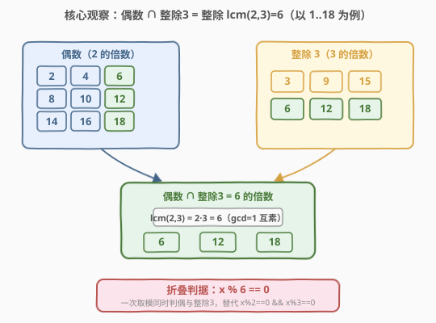
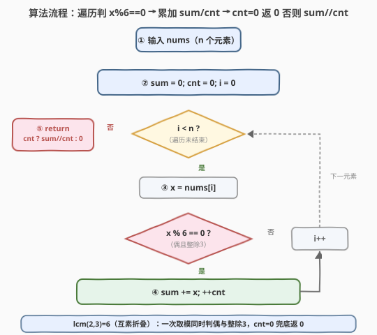

# 可被三整除的偶数的平均值

- **题目名称**：可被三整除的偶数的平均值
- **链接**：[2455. 可被三整除的偶数的平均值](https://leetcode.cn/problems/average-value-of-even-numbers-that-are-divisible-by-three/)
- **难度**：简单
- **标签**：数组、数学、数论、一次遍历

## 1. 题目概述

给你一个由**正整数**组成的整数数组 `nums`，返回其中**可被 $3$ 整除的所有偶数**的平均值。

> 注意：$n$ 个元素的平均值等于 $n$ 个元素**求和**再除以 $n$，结果**向下取整**到最接近的整数。

**示例 1**：

```text
输入：nums = [1,3,6,10,12,15]
输出：9
解释：6 和 12 是可以被 3 整除的偶数。(6 + 12) / 2 = 9。
```

**示例 2**：

```text
输入：nums = [1,2,4,7,10]
输出：0
解释：不存在满足题目要求的整数，所以返回 0。
```

**约束条件**：

- $1 \le \text{nums.length} \le 1000$
- $1 \le \text{nums}[i] \le 1000$

> 💡 表面是「偶数」+「整除 $3$」两道独立判定，但因 $2$ 与 $3$ **互素**，「既是偶数又整除 $3$」精确等价于「整除 $\text{lcm}(2,3) = 6$」。两道判定折叠成一道 `x % 6 == 0`，再配一次遍历累加求和与计数即可。

---

## 2. 解题思路

### 2.1 暴力思路：双条件逐一筛选

最直白的做法是遍历 `nums`，对每个 $x$ 检查「是偶数」**且**「被 $3$ 整除」两个条件是否同时成立，命中则累入 `sum` 与 `cnt`，最后 $\text{sum} / \text{cnt}$（或无命中返回 $0$）：

```text
sum, cnt = 0, 0
for x in nums:
    if x % 2 == 0 and x % 3 == 0:
        sum += x; cnt += 1
return 0 if cnt == 0 else sum // cnt
```

正确性没问题，时间 $O(n)$。但两次取模判定**未利用 $2$、$3$ 互素的结构**——可折叠为一次。

> ⚠️ 暴力把「偶数」「整除 $3$」当成两件独立的事，但整除有传递性：$x$ 同时被 $2$、$3$ 整除 $\iff$ $x$ 被 $\text{lcm}(2, 3)$ 整除。这引出下文的折叠观察。

### 2.2 核心观察：互素整除折叠为 lcm = 6



**关键洞察**：$x$ 是偶数且整除 $3$ $\iff$ $x$ 整除 $6$。

证明分两向：

- **正向**：$x$ 整除 $2$ 且 $x$ 整除 $3$。因 $\gcd(2, 3) = 1$（互素），由整除的性质 $x$ 整除 $2 \cdot 3 = 6$；
- **反向**：$x$ 整除 $6$，而 $6$ 整除 $2$ 且 $6$ 整除 $3$，由整除的传递性 $x$ 整除 $2$、$3$。

于是「偶数 $\cap$ 整除 $3$」折叠为**单条件** `x % 6 == 0`，一次取模替代两次。

> 💡 **推广**：若题改为「整除 $a$ 且整除 $b$」，则候选条件为整除 $\text{lcm}(a, b) = ab / \gcd(a, b)$。当 $a, b$ 互素时 $\text{lcm} = ab$。本题 $a = 2,\, b = 3$ 互素故 $\text{lcm} = 6$。这正是 [2413](../2401-2500/2413_最小偶倍数.md)「$\text{lcm}(2, n)$ 退化为奇偶判定」与 [2427](../2401-2500/2427_公因子的数目.md)「公因子 $= \gcd$ 的约数」的同一族思想：用 $\gcd/\text{lcm}$ 把多条件折叠成单条件。

### 2.3 算法流程图



两阶段流水：

1. **过滤累加**：一次遍历，对每个 $x$ 判 `x % 6 == 0`，命中则 `sum += x; ++cnt`；
2. **取整兜底**：遍历结束判 `cnt`：为 $0$ 返回 $0$，否则返回 `sum / cnt`（向下取整）。

整个过程单趟、无序、$O(n)$，无任何边界排序或哈希。

### 2.4 示例演算

![示例演算：示例1 [1,3,6,10,12,15] 命中6,12 → 18//2=9；示例2 全未命中 → 0](../images/2455_example_walkthrough.svg)

**示例 1** `nums = [1,3,6,10,12,15]`：

| $x$ | $x \bmod 6$ | 命中 | `sum` | `cnt` |
|-----|-------------|------|-------|-------|
| 1 | 1 | ✗ | 0 | 0 |
| 3 | 3 | ✗ | 0 | 0 |
| 6 | 0 | ✓ | 6 | 1 |
| 10 | 4 | ✗ | 6 | 1 |
| 12 | 0 | ✓ | 18 | 2 |
| 15 | 3 | ✗ | 18 | 2 |

遍历结束 `cnt = 2 ≠ 0`，$\text{ans} = 18 / 2 = 9$ ✓。

**示例 2** `nums = [1,2,4,7,10]`：$x \bmod 6$ 依次为 $1,2,4,1,4$，**无 $0$**，`cnt = 0`，返回 $0$ ✓。

> 💡 两个示例恰好对应「有命中」与「无命中」两种分支：有命中走 `sum // cnt` 取整；无命中靠 `cnt == 0` 兜底返回 $0$，避免除零。

---

## 3. 参考代码

### C++

```cpp
class Solution {
public:
    int averageValue(vector<int>& nums) {
        int sum = 0, cnt = 0;
        for (int x : nums) {
            if (x % 6 == 0) {
                sum += x;
                ++cnt;
            }
        }
        return cnt ? sum / cnt : 0;
    }
};
```

> 💡 `x % 6 == 0` 一次取模同时判定「偶数」与「整除 $3$」。正整数域下 C++ 整除天然向下取整（截断向零等价于向下）。`cnt ? sum / cnt : 0` 用三元运算兜底空集，返回 $0$，对应题意。

### Python

```python
class Solution:
    def averageValue(self, nums: List[int]) -> int:
        s = sum(x for x in nums if x % 6 == 0)
        c = sum(1 for x in nums if x % 6 == 0)
        return s // c if c else 0
```

> 💡 双生成器写法更声明式但扫两遍；追求单趟可改用显式循环累加 `sum`/`cnt`。Python `//` 对正数即向下取整。空集用 `s // c if c else 0` 兜底。

---

## 4. 复杂度分析

| 维度 | 复杂度 | 说明 |
|------|--------|------|
| **时间复杂度** | $O(n)$ | 单趟遍历，每元素一次取模 + $O(1)$ 累加 |
| **空间复杂度** | $O(1)$ | 仅常数变量 `sum`、`cnt` |
| 对照：双判定暴力 | $O(n)$ / $O(1)$ | `x%2==0 && x%3==0` 两次取模，同阶但常数翻倍 |
| 对照：Python 双趟生成器 | $O(n)$ / $O(1)$ | 两趟扫描，仍 $O(n)$ 但常数略高 |

> 💡 本题 $n \le 1000$，任何 $O(n)$ 写法都能瞬 AC。折叠 `x % 6 == 0` 的价值在「方法论」：识别互素条件可折叠，把每元素的判定常数减半——当 `nums` 放大到 $10^8$、条件更密集时，常数项优化变得实质。

---

## 5. 扩展：互素整除折叠与不互素情形

折叠条件「$x$ 整除 $a$ 且 $x$ 整除 $b$」$\iff$ 「$x$ 整除 $\text{lcm}(a, b)$」。这里要的是**公共倍数**（不是 2427 的公约数）：

> 精确陈述：$x$ 是 $a$ 的倍数又是 $b$ 的倍数 $\iff$ $x$ 是 $\text{lcm}(a, b)$ 的倍数。因 $\text{lcm}$ 是「最小的公共倍数」，所有公共倍数都是 $\text{lcm}$ 的倍数（倍数的倍数仍是倍数）。

| 情形 | $\gcd(a, b)$ | $\text{lcm}(a, b) = ab/\gcd$ | 折叠判据 |
|------|--------------|------------------------------|----------|
| 本题 $a=2, b=3$ | $1$（互素） | $6$ | `x % 6 == 0` |
| $a=4, b=6$ | $2$ | $12$ | `x % 12 == 0` |
| $a=6, b=9$ | $3$ | $18$ | `x % 18 == 0` |

> ⚠️ **不互素时不能直接乘**：如「整除 $4$ 且整除 $6$」$\text{lcm} = 12$（非 $24$）。若误用 `x % 24 == 0` 会漏掉 $12, 36, 60$ 等公共倍数。推广公式必带 $\gcd$ 项；本题恰因 $\gcd(2, 3) = 1$ 而退化为乘积 $6$。

> 💡 与 2413 的呼应：2413 求 $\text{lcm}(2, n)$ 的值，因 $a=2$ 固定而 $\gcd$ 退化为奇偶判定；本题用 $\text{lcm}(2, 3) = 6$ 作**判定阈值**，是同一 $\text{lcm}$ 工具的「求值」与「判定」两种用法。

---

## 6. 面试要点

1. **为什么偶数且整除 $3$ 等价于整除 $6$？**

   > 因 $2$、$3$ 互素（$\gcd = 1$），$\text{lcm}(2, 3) = 2 \cdot 3 = 6$。$x$ 是 $2$ 的倍数又是 $3$ 的倍数 $\iff$ $x$ 是 $6$ 的倍数。正向用整除的传递性 + 互素时 $\text{lcm}$ 等于乘积；反向由 $6$ 整除 $2$、$3$ 与传递性。

2. **若 $a$、$b$ 不互素（如改为整除 $4$ 且整除 $6$）会怎样？**

   > 不能直接相乘。$\text{lcm}(4, 6) = ab/\gcd = 24/2 = 12$，故应判 `x % 12 == 0`。误用 `x % 24 == 0` 会漏掉 $12$、$36$ 等公共倍数。推广时必带 $\gcd$ 项，互素仅是 $\gcd = 1$ 的特例。

3. **向下取整如何保证？**

   > 题目值域为正整数，C++ 整数除法对正数截断向零，等价于向下取整；Python `//` 对正数直接向下。若值域含负数需注意语言差异（C++ 截断向零、Python 向下负无穷），本题无此风险。

4. **`cnt == 0` 兜底为何必要？**

   > 无命中时 `sum = 0`、`cnt = 0`，直接 `sum / cnt` 会除零。`cnt ? sum / cnt : 0` 或 `s // c if c else 0` 兜底返回 $0$，对应题意「无满足条件返回 $0$」。

5. **能否进一步优化到 $O(1)$？**

   > 不能。聚合 `sum`、`cnt` 需遍历全部元素，下界 $\Omega(n)$。折叠只优化了「每元素的判定常数」（两次取模 $\to$ 一次），不改变线性扫描的本质——这与 2427「把 $O(\min)$ 压到 $O(\sqrt{})$」的优化不同，本题的折叠是常数级。

> 💡 **一句话总结**：偶数 $\cap$ 整除 $3$ $=$ 整除 $\text{lcm}(2, 3) = 6$（互素折叠），单趟遍历 + `x % 6 == 0` 累加 `sum`/`cnt`，`cnt == 0` 返回 $0$，否则 `sum // cnt` 向下取整。

---

## 7. 同类练习题

- [2413. 最小偶倍数](https://leetcode.cn/problems/smallest-even-multiple/)（[题解](../2401-2500/2413_最小偶倍数.md)）：$\text{lcm}(2, n)$ 退化为奇偶判定，同属 $\text{lcm}$ 家族，对照「求值」与「判定阈值」两种用法
- [2427. 公因子的数目](https://leetcode.cn/problems/number-of-common-factors/)（[题解](../2401-2500/2427_公因子的数目.md)）：公因子 $= \gcd$ 的约数，同「用 $\gcd/\text{lcm}$ 折叠多条件」思想
- [1979. 找出数组的最大公约数](https://leetcode.cn/problems/find-greatest-common-divisor-of-array/)（[题解](../1901-2000/1979_找出数组的最大公约数.md)）：数组最大最小元素的 $\gcd$，$\gcd$ 的直接练习，承接 $\gcd/\text{lcm}$ 基础
- [728. 自除数](https://leetcode.cn/problems/self-dividing-numbers/)（[题解](../0701-0800/728_自除数.md)）：按整除性逐元素过滤数组，同「判定 + 收集」骨架，对照「整除 6」与「整除自身各位」
- [1952. 三除数](https://leetcode.cn/problems/three-divisors/)（[题解](../1901-2000/1952_三除数.md)）：整除性 + 约数计数，对照「整除判定」的多种用法
