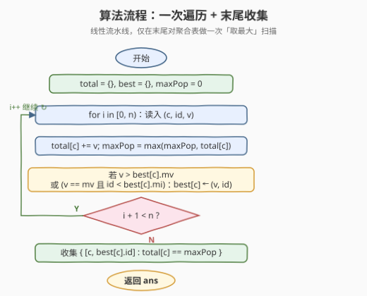
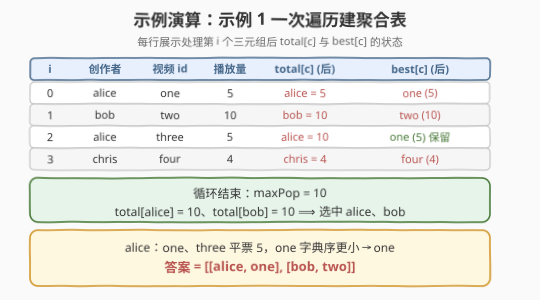

# 最流行的视频创作者

- **题目名称**：最流行的视频创作者
- **链接**：[2456. 最流行的视频创作者](https://leetcode.cn/problems/most-popular-video-creator/)
- **难度**：中等
- **标签**：数组、哈希表、字符串、排序、堆（优先队列）

## 1. 题目概述

给定三个长度均为 $n$ 的数组 `creators`、`ids`、`views`：平台上第 $i$ 个视频的创作者是 `creators[i]`，分配的视频 id 是 `ids[i]`，播放量为 `views[i]`。

一个创作者的**流行度** = 该创作者**所有**视频的播放量**总和**。请找出流行度**最高**的创作者，以及该创作者播放量**最大**的视频 id：

- 若有多个创作者流行度并列最高，需要**全部**返回；
- 若某创作者存在多个播放量并列最高的视频，只需返回其中**字典序最小**的 `id`。

返回二维字符串数组 `answer`，其中 `answer[i] = [creator_i, id_i]`，顺序任意。

**示例 1**：

```text
输入：creators = ["alice","bob","alice","chris"], ids = ["one","two","three","four"], views = [5,10,5,4]
输出：[["alice","one"],["bob","two"]]
解释：
alice 流行度 = 5 + 5 = 10；bob = 10；chris = 4。
alice、bob 并列最高。bob 播放量最高的视频 id = "two"。
alice 播放量最高的是 "one"(5) 与 "three"(5)，"one" 字典序更小 → 取 "one"。
```

**示例 2**：

```text
输入：creators = ["alice","alice","alice"], ids = ["a","b","c"], views = [1,2,2]
输出：[["alice","b"]]
解释：alice 流行度 = 5。"b"(2) 与 "c"(2) 并列最高，"b" 字典序更小 → 取 "b"。
```

**约束条件**：

- $n = \text{creators.length} = \text{ids.length} = \text{views.length}$
- $1 \le n \le 10^5$
- $1 \le \text{creators}[i].\text{length},\ \text{ids}[i].\text{length} \le 5$
- `creators[i]`、`ids[i]` 仅由小写英文字母组成
- $0 \le \text{views}[i] \le 10^5$

> 💡 **题眼**：要的是「按创作者分组后取两个最值」——组内播放量**求和**（流行度），再在组内取**播放量最大**的视频（平票取字典序最小 id）。两个量都只随新数据**单调更新**，故可在一趟遍历里同步维护；末尾再做一次「取最大流行度」扫描即可，无需排序、无需堆。

---

## 2. 解题思路

### 2.1 暴力思路：每个创作者独立扫描两遍

最直白的做法：先收集所有**不同**创作者，再对每个创作者 $c$：

1. 扫一遍数组累加它所有视频的播放量 → 得流行度；
2. 再扫一遍找它播放量最大的视频（平票比字典序）。

```text
ans = []
for c in distinct(creators):
    pop = sum(views[i] for i if creators[i]==c)      # O(n)
    best_id, best_v = None, -1
    for i in range(n):                                # O(n)
        if creators[i]==c and (views[i]>best_v or (views[i]==best_v and ids[i]<best_id)):
            best_id, best_v = ids[i], views[i]
    ans.append([c, pop, best_id])
取 pop 最大的所有 [c, best_id]
```

设不同创作者数为 $m \le n$，共 $O(m \cdot n)$，最坏 $O(n^2)$。对 $n = 10^5$ 必然超时。问题出在**同一份输入被反复线性扫描**，且「分组」信息本可一次预处理。

> ⚠️ 暴力把「该创作者的视频有哪些」当成每次现搜的问题；但全部分组关系在一次遍历后即可建立——关键观察：**用哈希表把「按创作者聚合」压到一趟遍历**，且聚合所需的两个量（总和、最热）都支持 $O(1)$ 增量更新。

### 2.2 核心观察：哈希表一次遍历「双聚合」


把题目拆成**两阶段流水线**：

1. **一趟遍历建聚合表**：维护 `total: creator → 总播放量` 与 `best: creator → (最大播放量 mv, 最热 id mi)`。对每个三元组 $(c, \text{id}, v)$：
   - $\text{total}[c] \mathrel{+}= v$（流行度累加）；
   - 更新最热视频：若 $v > \text{mv}$，或 $v = \text{mv}$ 且 $\text{id} < \text{mi}$，则 $\text{best}[c] \leftarrow (v, \text{id})$。
2. **末尾取最大流行度**：扫一遍 `total` 取 $\max$，再收集所有 $\text{total}[c] = \text{maxPop}$ 的创作者，各带上 `best[c]` 的最热 id。

> 💡 两个聚合量都是**单调可增量更新**的：总和天然支持累加；最热视频的比较规则「`views` 取大、平票取字典序小」构成一个**全序**，新数据只会把它推向「更优」或保持不变，与到达顺序无关。故无需保留每个创作者的全部视频列表，只留两个标量即可。

**平票判定别写漏**：最热视频的更新条件是「`v > mv` **或**（`v == mv` **且** `id < mi`）」。两步缺一不可——只有播放量**相等**时才比字典序；播放量更大则直接覆盖，无需再看 id。`id` 全是小写字母，直接用字符串 `<` 即为字典序。

> ⚠️ **流行度要用 64 位**：$n \le 10^5$、$\text{views}[i] \le 10^5$，单创作者流行度可达 $10^{10}$，超过 32 位 `int`（约 $2.1 \times 10^9$）。`maxPop` 与 `total` 都须开 `long long`。

### 2.3 算法流程图



整体是一条线性流水线：先初始化 `total`、`best`、`maxPop`；进入循环，每步先累加流行度并刷新 `maxPop`，再用「播放量 + 字典序」双关键字判定是否更新最热视频；循环结束后对聚合表做一次 $O(m)$ 扫描，收集 $\text{total}[c] = \text{maxPop}$ 的 $(c, \text{best}[c].\text{id})$ 即得答案。

> 💡 注意 `maxPop` 在循环里就同步维护好，末尾只需一次「等于」过滤，**不必再 $O(m)$ 求一次最大**。两阶段都 $O(n)$，常数极小。

### 2.4 示例演算



以示例 1 `creators = ["alice","bob","alice","chris"]`、`ids = ["one","two","three","four"]`、`views = [5,10,5,4]` 演算：

| $i$ | 创作者 | 视频 id | 播放量 $v$ | `total[c]`（后） | `best[c]`（后） |
|-----|--------|---------|-----------|------------------|------------------|
| 0 | alice | one   | 5  | alice = 5  | one (5) |
| 1 | bob   | two   | 10 | bob = 10   | two (10) |
| 2 | alice | three | 5  | alice = 10 | one (5)（$5=5$，"three" > "one"，不换）|
| 3 | chris | four  | 4  | chris = 4  | four (4) |

循环结束：`maxPop = 10`。`total[alice] = total[bob] = 10` → 选中 alice、bob；各自带上最热 id：alice = "one"、bob = "two"。答案 `[[alice, one], [bob, two]]` ✓。

> ⚠️ 第 $i=2$ 行是关键：alice 新增 "three"(5)，播放量与历史最热 "one"(5) **平票**，但 "three" 字典序**大于** "one"（首字母 't' > 'o'），故 `best[alice]` 保持 "one"。这正是「平票取字典序小」的增量判定——无需回看 alice 的全部视频，只拿当前 `best` 两个标量参与比较即可。

---

## 3. 参考代码

### C++

```cpp
class Solution {
public:
    vector<vector<string>> mostPopularCreator(vector<string>& creators,
                                              vector<string>& ids,
                                              vector<int>& views) {
        int n = creators.size();
        unordered_map<string, long long> total;        // creator -> 总播放量
        unordered_map<string, pair<int, string>> best; // creator -> {最大播放量, 最热 id}
        long long maxPop = 0;

        for (int i = 0; i < n; ++i) {
            const string& c = creators[i];
            int v = views[i];
            total[c] += v;
            if (total[c] > maxPop) maxPop = total[c];

            auto it = best.find(c);
            if (it == best.end()) {
                best[c] = {v, ids[i]};
            } else {
                auto& [mv, mi] = it->second;
                if (v > mv || (v == mv && ids[i] < mi)) {
                    mv = v;
                    mi = ids[i];
                }
            }
        }

        vector<vector<string>> ans;
        for (auto& [c, t] : total)
            if (t == maxPop) ans.push_back({c, best[c].second});
        return ans;
    }
};
```

> 💡 `total` 与 `maxPop` 用 `long long` 防溢出；`best` 里播放量仍是 `int`（单个视频 $\le 10^5$）。`ids[i] < mi` 是字符串字典序比较，因仅小写字母且长度 $\le 5$，视为 $O(1)$。`creators[i]` 用 `const string&` 避免拷贝。

### Python

```python
class Solution:
    def mostPopularCreator(self, creators: List[str], ids: List[str], views: List[int]) -> List[List[str]]:
        total = {}   # creator -> 总播放量
        best  = {}   # creator -> [最大播放量, 最热 id]
        maxPop = 0
        for c, vid, v in zip(creators, ids, views):
            total[c] = total.get(c, 0) + v
            if total[c] > maxPop:
                maxPop = total[c]
            cur = best.get(c)
            if cur is None or v > cur[0] or (v == cur[0] and vid < cur[1]):
                best[c] = [v, vid]
        return [[c, best[c][1]] for c, t in total.items() if t == maxPop]
```

> 💡 Python 整数自动大数，无需类型顾虑；`best[c] = [v, vid]` 直接整条替换，避免可变列表的就地修改歧义。末尾列表推导一次完成「过滤 + 取最热 id」，等价于 C++ 的两段循环。

---

## 4. 复杂度分析

| 维度 | 复杂度 | 说明 |
|------|--------|------|
| **时间复杂度** | $O(n)$ | 一趟遍历：每步哈希查询/插入 $O(1)$ 均摊 + 字符串比较 $O(1)$（长度 $\le 5$）；末尾扫聚合表 $O(m) \le O(n)$ |
| **空间复杂度** | $O(n)$ | `total`、`best` 各存至多 $m \le n$ 个创作者的聚合标量 |
| 对照：独立两遍扫描 | $O(n^2)$ / $O(n)$ | 每个创作者各扫两遍数组，正确但超时；省下了聚合表 |
| 对照：排序 + 分组 | $O(n \log n)$ / $O(n)$ | 按创作者排序后同组连片聚合；可行但排序非必要 |

> 💡 本题 $n \le 10^5$，$O(n)$ 哈希解法常数小、最契合。若把「求和」与「取最热」拆成两趟独立遍历仍 $O(n)$，但合并成一趟更省缓存、更易讲清「双聚合」结构。字符串长度 $L \le 5$ 视为 $O(1)$；若推广到任意长度，时间为 $O(n \cdot L)$。

---

## 5. 扩展：从「取最大」到「取前 K」

本题只问流行度**最高**的创作者——这是「取最值」而非「排序」，故一趟遍历 + 一次「等于」过滤即可，无需堆或排序。但若把需求升级为「流行度前 $K$ 高的创作者及其最热视频」，结构就要调整：

- **聚合阶段不变**：仍是一趟遍历维护 `total` / `best`，$O(n)$；
- **选阶升级**：从「$O(m)$ 扫一遍取 $\max$」变为「$O(m \log k)$ 小顶堆」或「$O(m \log m)$ 排序」选前 $K$。

这正是 [347. 前 K 个高频元素](https://leetcode.cn/problems/top-k-frequent-elements/) 与 [692. 前 K 个高频单词](https://leetcode.cn/problems/top-k-frequent-words/) 的骨架——「哈希计数 + Top-K」，平票规则（字典序）也同源。本题可视为它们的 $K = m$（全取最大并列者）退化特例：$K$ 退到「最大值」时，堆退化成「一个标量 `maxPop`」加一次过滤，从 $O(n \log k)$ 降到 $O(n)$。

> 💡 **一句话**：Top-K 用堆/排序，Top-1（含并列）用一次扫描——认清「只取最大」是 Top-K 的 $K\!=\!1$ 退化，就能在写代码前先排除「是否真需要排序」的过度设计。

---

## 6. 面试要点

1. **`total` 与 `maxPop` 为什么必须开 64 位？**

   - 单创作者流行度 = 其全部视频播放量之和。极端下 $n = 10^5$ 个视频同属一人、每个 $10^5$，总和达 $10^{10}$，远超 32 位 `int` 上限 $\approx 2.1 \times 10^9$。`maxPop` 由 `total` 派生，同样须 64 位。Python 整数无界可忽略。

2. **最热视频的平票判定如何写得正确？**

   - 条件是「$v > \text{mv}$ **或**（$v = \text{mv}$ **且** $\text{id} < \text{mi}$）」。播放量更大直接覆盖；只有播放量**相等**时才比字典序。`id` 全小写字母，字符串 `<` 即字典序。常见错误：漏写前半段（只比字典序）或漏写后半段（播放量相等时直接保留先到者，而非取更小 id）。

3. **为什么不需要排序或堆？**

   - 题目要的是流行度**最大值**及所有达到该值的创作者，不关心创作者之间的排名顺序。一趟遍历可边聚合边维护 `maxPop`，末尾对聚合表做一次「$\text{total}[c] = \text{maxPop}$」过滤即得全部并列者——这正是「Top-1 退化」无需堆的原因。若改为「前 $K$ 高」才需堆/排序。

4. **一趟遍历同时维护「总和」与「最热」会有顺序相关问题吗？**

   - 无。对同一创作者的多个三元组按到达顺序处理，每步用当前 $v$ 与历史 `best` 比较。求和与取最热都满足**可交换、可结合**：总和与求和顺序无关；「max 播放量、平票取最小 id」的全序比较也单调收敛到同一结果，与数据到达次序无关。故无需缓存全部视频。

5. **最坏情况下输出有多大？聚合表多大？**

   - 最坏 $n$ 个创作者各一个视频 → 聚合表 $m = n$ 项。若所有流行度相同（如全部 `views = 0`），则 $\text{maxPop} = 0$ 且每个创作者都达标，答案含 $n$ 项——输出本身 $O(n)$，仍是 $O(n)$ 时间，没有退化。

> 💡 **一句话总结**：一趟遍历，在哈希表里同步维护「总播放量」与「最热视频（max 播放量，平票取字典序小 id）」，循环里顺手记 `maxPop`，末尾扫一遍取等于 `maxPop` 的创作者 ⟹ $O(n)$。流行度开 64 位防溢出；只取最大故免排序免堆。

---

## 7. 同类练习题

- [692. 前 K 个高频单词](https://leetcode.cn/problems/top-k-frequent-words/)（[题解](../0601-0700/692_前K个高频单词.md)）：同为「哈希计数 + 字典序平票」，本题取最大并列者、692 取前 K，平票规则同源
- [347. 前 K 个高频元素](https://leetcode.cn/problems/top-k-frequent-elements/)（[题解](../0301-0400/347_前K个高频元素.md)）：哈希频次 + 堆选 Top-K；本题「只取最大」退化为 $O(n)$ 一次扫描，无需堆
- [1636. 按照频率将数组升序排序](https://leetcode.cn/problems/sort-array-by-increasing-frequency/)（[题解](../1601-1700/1636_按照频率将数组升序排序.md)）：频次表 + 按频次/值排序，对照本题「分组聚合 + 取最值」无需全局排序
- [1481. 不同整数的最少数目](https://leetcode.cn/problems/least-number-of-unique-integers-after-k-removals/)（[题解](../1401-1500/1481_不同整数的最少数目.md)）：频次表 + 按频次排序删除，同属「哈希分组聚合」骨架
