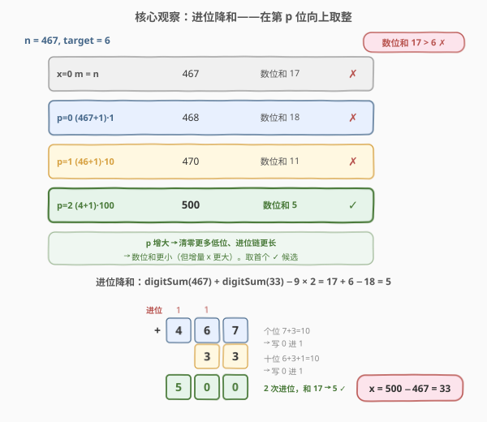
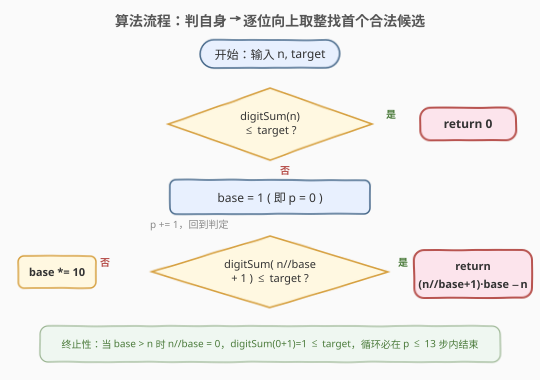
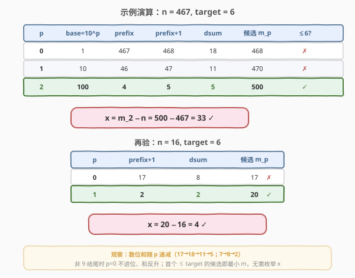

# 美丽整数的最小增量

- **题目名称**：美丽整数的最小增量
- **链接**：[2457. 美丽整数的最小增量](https://leetcode.cn/problems/minimum-addition-to-make-integer-beautiful/)
- **难度**：中等
- **标签**：数学、贪心、枚举

## 1. 题目概述

给定两个正整数 `n` 和 `target`。若某个整数**每一位数字之和**小于等于 `target`，则称其为**美丽整数**。求最小的非负整数 `x`，使得 `n + x` 是美丽整数。

等价地，令 $m = n + x$，找最小的 $m \ge n$ 且 $\text{digitSum}(m) \le \text{target}$，答案即为 $x = m - n$。题目保证总存在解。

**示例 1**：

```text
输入：n = 16, target = 6
输出：4
解释：16 的数位和 1+6=7 > 6；加 4 得 20，数位和 2+0=2 ≤ 6。
```

**示例 2**：

```text
输入：n = 467, target = 6
输出：33
解释：467 的数位和 4+6+7=17 > 6；加 33 得 500，数位和 5 ≤ 6。
```

**示例 3**：

```text
输入：n = 1, target = 1
输出：0
解释：1 的数位和 1 ≤ 1，已是美丽整数。
```

**约束条件**：

- $1 \le n \le 10^{12}$
- $1 \le \text{target} \le 150$
- 输入保证一定有解

> ⚠️ $n$ 可达 $10^{12}$，答案 $x$ 也可能达到 $10^{12}$ 量级（如 $n = 999\,999\,999\,999$ 需进到 $10^{12}$）。任何"从 $x=0$ 逐个累加检查"的暴力都会超时——必须直接构造目标 $m$，而非枚举 $x$。

---

## 2. 解题思路

### 2.1 暴力思路：逐个累加试探

从 $x = 0$ 起，依次检查 $\text{digitSum}(n + x) \le \text{target}$ 是否成立，返回首个满足的 $x$。

```text
x = 0
while digitSum(n + x) > target:
    x += 1
return x
```

问题：$x$ 可达 $10^{12}$ 量级，循环次数天文级，且每次 `digitSum` 还要 $O(\log n)$，必超时。

> 💡 暴力法的浪费在于：它把 $x$ 当成"无结构的游标"一格一格挪。换视角：我们真正要找的是**最小的 $m \ge n$**（满足数位和约束），然后 $x = m - n$。而"让数位和变小"靠的是**进位**——只有触发进位，低位才会归零、数位和才会大幅下降。于是问题变成：**在哪个位置"向上取整"触发进位，能用最小的增量把数位和压到 $\le \text{target}$？**

### 2.2 核心观察：进位降和 + 向上取整候选



**关键事实**：数位和只在**发生进位**时大幅下降。一个数 $m$ 若末尾有若干个 $0$（即 $m$ 是 $10^p$ 的倍数），则其低位对数位和贡献为 $0$，数位和仅由高位决定。

由此自然得到一族"进位候选"——在第 $p$ 位向上取整（把低 $p$ 位清零、高位 $+1$，可能引发进位链）：

$$m_p = \left(\left\lfloor \frac{n}{10^p} \right\rfloor + 1\right) \cdot 10^p, \quad p = 0, 1, 2, \ldots$$

- $p=0$：$m_0 = n + 1$（最低位 $+1$，仅当末位为 $9$ 时才进位）。
- $p=1$：清零个位、十位以上 $+1$，如 $467 \to (46+1)\cdot 10 = 470$。
- $p=2$：清零末两位、百位以上 $+1$，如 $467 \to (4+1)\cdot 100 = 500$。
- 以此类推，直到 $10^p > n$ 时 $\lfloor n/10^p \rfloor = 0$，$m_p = 10^p$，数位和 $= 1 \le \text{target}$，**必终止**。

**数位和捷径**：因为 $m_p$ 末尾恰好 $p$ 个 $0$，

$$\text{digitSum}(m_p) = \text{digitSum}\!\left(\left\lfloor \frac{n}{10^p} \right\rfloor + 1\right)$$

只算"高位 $+1$"部分即可，末尾的 $0$ 不必参与求和。

**候选单调性**：可证 $m_{p+1} \ge m_p$（差值 $(9 - d_p)\cdot 10^p \ge 0$，其中 $d_p$ 为 $n$ 第 $p$ 位数字）。所以候选随 $p$ **单调不减**——**从 $p=0$ 起向上找，首个数位和 $\le \text{target}$ 的候选就是最小的 $m$**，对应的 $x = m_p - n$ 即答案。再加上 $n$ 自身（$x=0$）这一"零候选"先判一次，覆盖已美丽的情况。

> 💡 **为何向上取整候选足够（完备性）**：设最优 $m^\* > n$，考察 $m^\*$ 与 $n$ **最高不同位** $k$（此处 $m^\*$ 的数字更大）。把 $m^\*$ 在 $k$ 位以下的数字全部改成 $0$，得到的正是向上取整候选 $m_k$——它**值更小**（低位清零）且**数位和更小**（低位归零贡献 $0$）。故若 $m^\*$ 合法，则 $m_k$ 也合法且更优，最优解必落在候选族 $\{n\} \cup \{m_p\}$ 中。详见第 5 节。

### 2.3 算法流程图



迭代流程：

1. 若 $\text{digitSum}(n) \le \text{target}$，返回 $0$（$n$ 自身已美丽）。
2. 令 $p = 0$，$\text{base} = 10^p = 1$。
3. 计算 $\text{prefix} = \lfloor n / \text{base} \rfloor$；若 $\text{digitSum}(\text{prefix} + 1) \le \text{target}$，返回 $(\text{prefix}+1) \cdot \text{base} - n$。
4. 否则 $\text{base} \mathrel{\times}= 10$（即 $p \mathrel{+}= 1$），回到第 3 步。

> ⚠️ **终止性**：当 $10^p > n$ 时 $\text{prefix} = 0$，$\text{digitSum}(0+1) = 1 \le \text{target}$（因 $\text{target} \ge 1$），循环必在 $p \le \lceil \log_{10} n \rceil + 1 \le 13$ 步内结束。

### 2.4 示例演算



以 $n = 467,\ \text{target} = 6$ 为例，$\text{digitSum}(467) = 17 > 6$，进入循环：

| $p$ | base $=10^p$ | prefix $=\lfloor n/\text{base}\rfloor$ | prefix$+1$ | 数位和(prefix$+1$) | 候选 $m_p$ | $\le 6$? |
|-----|--------------|----------------------------------------|------------|--------------------|------------|----------|
| 0 | 1   | 467 | 468 | 18 | 468 | ✗ |
| 1 | 10  | 46  | 47  | 11 | 470 | ✗ |
| 2 | 100 | 4   | 5   | 5  | 500 | ✓ |

首个合法候选 $m_2 = 500$，答案 $x = 500 - 467 = \mathbf{33}$ ✓。

再验 $n = 16,\ \text{target} = 6$：$\text{digitSum}(16)=7>6$；$p=0$：$\text{digitSum}(17)=8>6$；$p=1$：$\text{prefix}=1$，$\text{digitSum}(2)=2\le 6$ ✓，$m_1 = 2\cdot 10 = 20$，$x = 20 - 16 = \mathbf{4}$ ✓。

---

## 3. 参考代码

### C++

```cpp
class Solution {
  public:
    long long makeIntegerBeautiful(long long n, int target) {
        auto dsum = [](long long x) {
            int s = 0;
            while (x) { s += x % 10; x /= 10; }
            return s;
        };
        if (dsum(n) <= target) return 0;
        long long base = 1;
        while (dsum(n / base + 1) > target) base *= 10;
        return (n / base + 1) * base - n;
    }
};
```

### Python

```python
class Solution:
    def makeIntegerBeautiful(self, n: int, target: int) -> int:
        def dsum(x: int) -> int:
            s = 0
            while x:
                s += x % 10
                x //= 10
            return s
        if dsum(n) <= target:
            return 0
        base = 1
        while dsum(n // base + 1) > target:
            base *= 10
        return (n // base + 1) * base - n
```

> 💡 两版逻辑一致。关键技巧：直接判断 $\text{dsum}(\text{prefix}+1)$ 而非重新算 $m_p$ 的数位和——因为末尾 $p$ 个 $0$ 不贡献数位和。C++ 中 `n` 与 `base` 均为 `long long`，`(n/base+1)*base` 约 $10^{13}$ 量级，远低于 `long long` 上界 $\approx 9.2 \times 10^{18}$，安全不溢出。

---

## 4. 复杂度分析

| 维度 | 复杂度 | 说明 |
|------|--------|------|
| 时间复杂度 | $O(\log^2 n)$ | 循环至多 $\lceil \log_{10} n \rceil + 1 \le 13$ 轮；每轮 `dsum` 为 $O(\log n)$。$n \le 10^{12}$ 时约 $13 \times 13 \approx 169$ 次基本运算，常数级 |
| 空间复杂度 | $O(1)$ | 只用常数个整型变量，无递归、无额外数据结构 |

> 💡 若把 `dsum` 改为**随 $p$ 增量维护**（每轮去掉最低位、并按进位更新数位和），可降到 $O(\log n)$。但本题 $\log n \le 13$，常数级优化收益可忽略，朴素写法更清晰不易错。

---

## 5. 扩展：候选完备性证明与进位降和公式

### 5.1 进位降和公式

设 $a, b$ 为非负整数，$a + b$ 的竖式加法共发生 $c$ 次进位，则：

$$\text{digitSum}(a + b) = \text{digitSum}(a) + \text{digitSum}(b) - 9c$$

直觉：每次进位把某一位的 $10$ 换成下一位的 $1$，数位和净减 $9$。这说明**要压低 $m = n + x$ 的数位和，就要制造进位**；而"在第 $p$ 位向上取整"正是用最小的增量制造一条进位链、把低 $p$ 位清零。

> 💡 以 $467 + 33 = 500$ 验证：$\text{digitSum}(467)+\text{digitSum}(33)-9\times 2 = 17+6-18 = 5$，与 $500$ 的数位和 $5$ 吻合。

### 5.2 候选族 $\{n\} \cup \{m_p\}$ 的完备性

设 $m^\*$ 是最优解（最小且 $\ge n$、数位和 $\le \text{target}$）。若 $m^\* = n$ 已被"零候选"覆盖。下设 $m^\* > n$。记 $k$ 为 $m^\*$ 与 $n$ **最高不同位**（从低向高编号，个位为 $0$）：

- 在 $> k$ 的位上 $m^\*$ 与 $n$ 完全相同；
- 在第 $k$ 位上 $m^\*$ 的数字严格大于 $n$ 的数字（因为 $m^\* > n$ 且高位相同）。

把 $m^\*$ 第 $k$ 位以下（$0 \ldots k-1$ 位）全部清零，得到 $\hat m$。则：

1. **值更小**：$\hat m \le m^\*$（清零只减不增），且 $\hat m \ge n$（高位与 $n$ 同，第 $k$ 位仍 $> n$ 的第 $k$ 位）。
2. **数位和更小**：$\text{digitSum}(\hat m) \le \text{digitSum}(m^\*) \le \text{target}$（低位归零贡献 $0$，其余位不变或减小）。

而 $\hat m$ 正是向上取整候选 $m_k = (\lfloor n/10^k \rfloor + 1)\cdot 10^k$。因此 **$m_k$ 合法且 $\le m^\*$**，与 $m^\*$ 最小性矛盾——除非 $m^\*$ 本身就是某个 $m_k$。故最优解必在候选族中，从 $p=0$ 起取首个合法者即为全局最优。$\blacksquare$

### 5.3 候选单调性的代数验证

记 $a_p = \lfloor n / 10^p \rfloor$，第 $p$ 位数字 $d_p = a_p \bmod 10$，则 $a_p = 10 a_{p+1} + d_p$：

$$m_{p+1} - m_p = (a_{p+1}+1)\cdot 10^{p+1} - (a_p+1)\cdot 10^p = (9 - d_p)\cdot 10^p \ge 0$$

故 $m_p$ 随 $p$ 单调不减（$d_p = 9$ 时相邻候选相等，如 $n$ 含连续 $9$ 时进位会"合并"），从低到高首个合法者即最小者。

---

## 6. 面试要点

1. **为什么不能逐个累加 $x$ 试探？**

   > $x$ 可达 $10^{12}$ 量级（如 $n = 999\,999\,999\,999$），循环 $10^{12}$ 次必超时。要直接构造最小目标 $m$，而非枚举增量 $x$。

2. **候选 $m_p$ 是怎么构造出来的？**

   > 在第 $p$ 位向上取整：$m_p = (\lfloor n/10^p \rfloor + 1)\cdot 10^p$，即清零低 $p$ 位、高位 $+1$。它用最小的增量制造一条进位链，把低位归零以降低数位和。

3. **为什么只检查 $\text{digitSum}(\lfloor n/10^p \rfloor + 1)$ 而不算整个 $m_p$？**

   > $m_p$ 末尾恰好 $p$ 个 $0$，对数位和贡献为 $0$，所以 $\text{digitSum}(m_p) = \text{digitSum}(\text{prefix}+1)$，省掉一次乘 $10^p$ 再逐位求和。

4. **为什么从 $p=0$ 往上找首个合法候选就是答案？**

   > 候选 $m_p$ 关于 $p$ 单调不减（差值 $(9-d_p)\cdot 10^p \ge 0$），故从小到大首个合法者即最小 $m$。再先判 $n$ 自身（$x=0$）覆盖已美丽的情况。

5. **循环一定会终止吗？**

   > 一定。当 $10^p > n$ 时 $\lfloor n/10^p \rfloor = 0$，$m_p = 10^p$，数位和 $= 1 \le \text{target}$（题目保证 $\text{target} \ge 1$）。故最多 $\lceil \log_{10} n \rceil + 1 \le 13$ 轮。

6. **C++ 里数据类型要注意什么？**

   > $n$ 与答案均可达 $10^{12}$，超过 `int` 上界 $\approx 2.1\times 10^9$。`n`、`base`、返回值都用 `long long`；中间 `(n/base+1)*base` 约 $10^{13}$ 量级，远低于 `long long` 上界 $9.2\times 10^{18}$，安全。

> 💡 **一句话总结**：2457 的本质是"用进位降数位和"——把目标 $m$ 限定为在第 $p$ 位向上取整的候选 $m_p = (\lfloor n/10^p\rfloor+1)\cdot 10^p$，利用候选单调性与数位和捷径 $O(\log^2 n)$ 找到最小合法者。与 [2417. 最近的公平整数](../2401-2500/2417_最近的公平整数.md) 同属"构造最近满足数位性质整数"一族。

---

## 7. 同类练习题

- [2417. 最近的公平整数](https://leetcode.cn/problems/closest-fair-integer/)（[站内题解](../2401-2500/2417_最近的公平整数.md)）：求 $\ge n$ 的最小"偶数位=奇数位"整数，同为"构造最近满足数位性质整数"，按位数构造候选
- [258. 各位相加](https://leetcode.cn/problems/add-digits/)（[站内题解](../0201-0300/258_各位相加.md)）：反复求数位和直到一位数，掌握数位和与同余（digital root）的基础题
- [1323. 6 和 9 组成的最大数字](https://leetcode.cn/problems/maximum-69-number/)（[站内题解](../1301-1400/1323_6和9组成的最大数字.md)）：翻转一位数字使数值最大，最朴素的"按位构造"数位贪心
- [168. Excel 表列名称](https://leetcode.cn/problems/excel-sheet-column-title/)（[站内题解](../0001-0100/168_Excel表列名称.md)）：1-indexed 进制转换，处理"进位/借位"的同类思维
- [202. 快乐数](https://leetcode.cn/problems/happy-number/)（[站内题解](../0201-0300/202_快乐数.md)）：数位平方和序列，数位和计算的另一种变体
