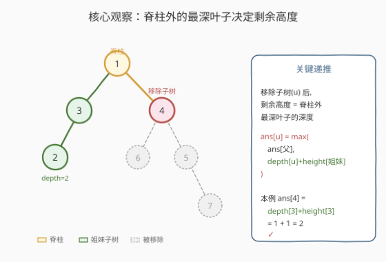
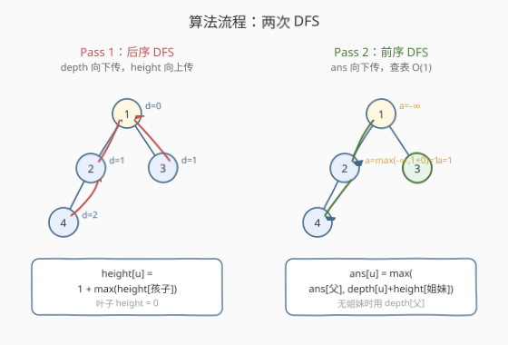
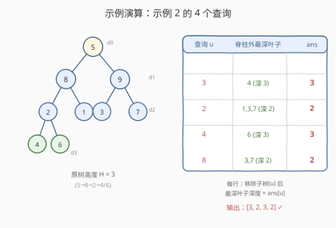

# 移除子树后的二叉树高度

- **题目名称**：移除子树后的二叉树高度
- **链接**：[2458. 移除子树后的二叉树高度](https://leetcode.cn/problems/height-of-binary-tree-after-subtree-removal-queries/)
- **难度**：困难
- **标签**：树、二叉树、深度优先搜索、两次 DFS

## 1. 题目概述

给你一棵含 `n` 个节点的二叉树根节点 `root`，节点值互不相同且取值 `1..n`。再给一个查询数组 `queries`。**每个查询独立**：移除以 `queries[i]` 为根的整棵子树后，求剩余树的高度。返回长度为 `m` 的答案数组。

> **高度**：从根到某节点的最长简单路径的**边数**。
> **独立性**：每次查询后树恢复初始状态，查询间互不影响。
> **保证**：`queries[i] != root.val`（根永不被移除）。

**示例 1**：

```text
输入：root = [1,3,4,2,null,6,5,null,null,null,null,null,7], queries = [4]
输出：[2]

        1
       / \
      3   4      ← 移除子树(4)
     /   / \
    2   6   5
             \
              7
```

移除 `4` 的子树后，剩余路径 `1 → 3 → 2`，高度为 `2`。

**示例 2**：

```text
输入：root = [5,8,9,2,1,3,7,4,6], queries = [3,2,4,8]
输出：[3,2,3,2]

            5
          /   \
         8     9
        / \   / \
       2   1 3   7
      / \
     4   6
```

四个查询依次得 `3`（最长 `5→8→2→4`）、`2`（最长 `5→8→1`）、`3`（最长 `5→8→2→6`）、`2`（最长 `5→9→3`）。

**约束条件**：

- $2 \le n \le 10^5$
- $1 \le \text{Node.val} \le n$，值互不相同
- $1 \le m \le \min(n,\, 10^4)$
- `queries[i] != root.val`

> ⚠️ 核心矛盾：$n$ 与 $m$ 都很大（$n m$ 可达 $10^9$），**逐查询重算高度必超时**。必须把「移除 $u$ 后的高度」**预处理**成每个节点的属性，做到 $O(1)$ 回答。

---

## 2. 解题思路

### 2.1 暴力思路：逐查询重算

对每个查询 $q$：实际跳过子树 $q$（标记或在递归中判 `node.val == q` 时返回），再从根 BFS/DFS 求剩余树高度。每次 $O(n)$，总计 $O(nm)$，$10^5 \times 10^4 = 10^9$，必超时。

> 💡 暴力法的浪费在于：每个查询独立扫描整棵树，**没有把「移除某节点后，谁是最深叶子」这个结构信息预存下来**。一旦预处理好，查询只需 $O(1)$ 查表。

### 2.2 核心观察：脊柱 + 姐妹子树



先定义两个基本量（一次 DFS 即可算出）：

- **`depth[u]`**：根到 $u$ 的边数（根的 `depth = 0`）。**自顶向下**传递。
- **`height[u]`**：子树 $u$ 的高度（$u$ 到子树内最深叶子的边数；叶子 `height = 0`）。**自底向上**汇总。

**关键洞察**：移除子树 $u$ 后，剩余树的高度 $=$ **不在子树 $u$ 内的最深叶子的深度**。

把根到 $u$ 的路径称为 **脊柱**：$\text{root} = a_0 \to a_1 \to \dots \to a_k = u$。剩余的叶子全来自脊柱「分叉出去」的地方：

1. **姐妹子树**：对脊柱上每个 $a_i\ (i<k)$，它的脊柱孩子是 $a_{i+1}$，**另一个孩子**（若存在）的整棵子树都不在子树 $u$ 内。该姐妹子树最深叶子的深度 $=$ `depth[姐妹] + height[姐妹]` $=$ `depth[u] + height[姐妹]`（姐妹与 $u$ 同层）。
2. **祖先变叶**：若某 $a_i$ 的脊柱孩子是它**唯一**的孩子，移除 $u$ 后 $a_i$ 失去所有孩子，自身变为叶子，深度 $=$ `depth[a_i]`。实际上只有直接父节点 $p=a_{k-1}$ 可能出现这种情况。

> 💡 **本质**：脊柱把树切成两半——脊柱本身（含 $u$）被移除或保留为「骨架」，而所有「最长候选」都从脊柱两侧的姐妹子树里冒出来。把每个分叉点的最深叶子深度取 $\max$，就是剩余高度。

### 2.3 递推与算法流程



把上面两条写成**自顶向下**的递推（设 $\text{ans}[u]$ 为移除子树 $u$ 后的剩余高度）：

$$
\text{ans}[u] = \max\Big(\text{ans}[p],\ \text{alt}\Big),\quad p=\text{parent}(u)
$$

其中 $\text{alt}$（本层分叉点的最深候选）按 $u$ 的姐妹情况二选一：

| $u$ 的姐妹 $s$ | $\text{alt}$ | 含义 |
|----------------|--------------|------|
| 存在 | `depth[u] + height[s]` | 姐妹子树的最深叶子 |
| 不存在 | `depth[p]` | $p$ 失去唯一孩子，自身变叶 |

> ⚠️ 两种情况**互斥**：有姐妹时 $p$ 仍有孩子（非叶），用姐妹子树的最深叶子；无姐妹时 $p$ 变叶，用 $p$ 的深度。$\text{ans}[p]$ 这一项把脊柱更高处的所有候选**累积**带下来，无需逐层重算。

**根的哨兵**：$\text{ans}[\text{root}] = -\infty$（根不被查询，值任意；用 $-1$ 即可，因为合法答案恒 $\ge 0$）。

**两遍 DFS**：

1. **Pass 1（后序，自底向上）**：递归时把 `depth` 往下传，回程时用 $1+\max(\text{height}[\text{孩子}])$ 算出 `height`（叶子 `height = 0`，空子树按 $-1$ 处理）。
2. **Pass 2（前序，自顶向下）**：递归时把 `ans` 往下传；到达节点 $u$ 时，用 `depth[u] + height[姐妹]`（或 `depth[父]`）与父传下来的 `ans` 取 $\max$，得到 $u$ 自己的 `ans`，再传给 $u$ 的孩子。

### 2.4 示例演算



以示例 2 为例，原树高度 $H=3$（最长 `5→8→2→4`）。预处理出 `depth` 与 `height`（关键值：`height[8]=2, height[9]=1, height[2]=1, height[3]=height[7]=0`），再跑 Pass 2：

| 查询 $u$ | 脊柱 | 脊柱外最深叶子 | $\text{ans}[u]$ |
|----------|------|----------------|-----------------|
| `3` | `5→9` | 姐妹 `8` 的子树最深处：叶 `4`/`6`，深 `3` | `3` |
| `2` | `5→8→2` | 姐妹 `9`（叶 `3`/`7`，深 `2`）或姐妹 `1`（深 `2`） | `2` |
| `4` | `5→8→2→4` | 姐妹 `6`（深 `3`） | `3` |
| `8` | `5→8` | 姐妹 `9`（叶 `3`/`7`，深 `2`） | `2` |

以 `ans[4]` 的递推链为例：$\text{ans}[5]=-1 \to \text{ans}[8]=\max(-1, \text{depth}[8]+\text{height}[9]=1{+}1=2)=2 \to \text{ans}[2]=\max(2, \text{depth}[2]+\text{height}[1]=2{+}0=2)=2 \to \text{ans}[4]=\max(2, \text{depth}[4]+\text{height}[6]=3{+}0=3)=3$ ✓。

> 💡 **观察**：查询 `2` 与 `4` 都在脊柱 `5→8→2→...` 上。`ans[2]=2` 已把「姐妹 `9` 的深 `2`」累积进来；`ans[4]` 只需再与「姐妹 `6` 的深 `3`」比较取 $\max$——这是 `ans` 自顶向下**累积传递**的体现，无需重算上层。

---

## 3. 参考代码

### C++

```cpp
class Solution {
    unordered_map<int, int> depth, height, ans;

    // Pass 1：后序。depth 向下传，height 向上算
    void dfs1(TreeNode* node, int d) {
        if (!node) return;
        depth[node->val] = d;
        dfs1(node->left,  d + 1);
        dfs1(node->right, d + 1);
        int h = -1;                                  // 空子树按 -1，叶子得到 0
        if (node->left)  h = max(h, height[node->left->val]);
        if (node->right) h = max(h, height[node->right->val]);
        height[node->val] = h + 1;
    }

    // Pass 2：前序。parentAns 是「移除 node 子树后的高度」
    void dfs2(TreeNode* node, int parentAns) {
        if (!node) return;
        ans[node->val] = parentAns;
        TreeNode* l = node->left;
        TreeNode* r = node->right;
        if (l && r) {                                // 两孩子：互为姐妹
            dfs2(l, max(parentAns, depth[l->val] + height[r->val]));
            dfs2(r, max(parentAns, depth[r->val] + height[l->val]));
        } else if (l) {                              // 仅左孩子：node 失去唯一孩子后变叶
            dfs2(l, max(parentAns, depth[node->val]));
        } else if (r) {                              // 仅右孩子：同上
            dfs2(r, max(parentAns, depth[node->val]));
        }
    }

  public:
    vector<int> treeQueries(TreeNode* root, vector<int>& queries) {
        dfs1(root, 0);
        dfs2(root, -1);                              // 根的 ans 哨兵 = -1（根不被查询）
        vector<int> res;
        res.reserve(queries.size());
        for (int q : queries) res.push_back(ans[q]);
        return res;
    }
};
```

### Python

```python
class Solution:
    def treeQueries(self, root: Optional[TreeNode], queries: List[int]) -> List[int]:
        depth, height, ans = {}, {}, {}

        def dfs1(node: Optional[TreeNode], d: int) -> None:
            if not node:
                return
            depth[node.val] = d
            dfs1(node.left,  d + 1)
            dfs1(node.right, d + 1)
            h = -1                                # 空子树按 -1，叶子得到 0
            if node.left:
                h = max(h, height[node.left.val])
            if node.right:
                h = max(h, height[node.right.val])
            height[node.val] = h + 1

        def dfs2(node: Optional[TreeNode], parent_ans: int) -> None:
            if not node:
                return
            ans[node.val] = parent_ans
            l, r = node.left, node.right
            if l and r:                           # 两孩子：互为姐妹
                dfs2(l, max(parent_ans, depth[l.val] + height[r.val]))
                dfs2(r, max(parent_ans, depth[r.val] + height[l.val]))
            elif l:                               # 仅左孩子：node 变叶
                dfs2(l, max(parent_ans, depth[node.val]))
            elif r:                               # 仅右孩子：同上
                dfs2(r, max(parent_ans, depth[node.val]))

        dfs1(root, 0)
        dfs2(root, -1)                           # 根的 ans 哨兵 = -1
        return [ans[q] for q in queries]
```

> 💡 两版逻辑一致。要点：① `height` 的「空子树 $-1$」让叶子自动得到 `0`，无需特判；② 根的 `ans` 哨兵用 $-1$，因为合法答案恒 $\ge 0$（根始终在剩余树中，至少深度 $0$）；③ 值互不相同且取值 $1..n$，故用 `val` 作哈希键 $O(1)$ 取 `depth`/`height`/`ans`。

---

## 4. 复杂度分析

| 维度 | 复杂度 | 说明 |
|------|--------|------|
| 时间复杂度 | $O(n + m)$ | 两次 DFS 各 $O(n)$；每个查询 $O(1)$ 哈希查表 |
| 空间复杂度 | $O(n)$ | `depth`/`height`/`ans` 三张哈希表各存 $n$ 项；递归栈 $O(h)$，$h \le n$ |
| 退化情况 | $O(n)$ 空间 | 树退化为单侧链时递归深度达 $n$；若怕爆栈可改迭代（见第 5 节） |

> 💡 哈希表常数较大，$n = 10^5$ 仍轻松通过。若追求极致常数，可用值域数组（`vector<int> depth(n+1)`）替代哈希表——值恰为 $1..n$，下标天然对应。

---

## 5. 扩展：值域数组与迭代版

### 5.1 值域数组替代哈希表

节点值恰为 $1..n$ 且互不相同，可用定长数组替代 `unordered_map`，常数更优：

```cpp
class Solution {
    vector<int> dep, hgt, an;          // 下标 = 节点值
public:
    vector<int> treeQueries(TreeNode* root, vector<int>& queries) {
        dep.assign(100005, 0); hgt.assign(100005, 0); an.assign(100005, 0);
        function<void(TreeNode*, int)> dfs1 = [&](TreeNode* x, int d) {
            if (!x) return;
            dep[x->val] = d;
            dfs1(x->left, d + 1); dfs1(x->right, d + 1);
            int h = -1;
            if (x->left)  h = max(h, hgt[x->left->val]);
            if (x->right) h = max(h, hgt[x->right->val]);
            hgt[x->val] = h + 1;
        };
        function<void(TreeNode*, int)> dfs2 = [&](TreeNode* x, int pa) {
            if (!x) return;
            an[x->val] = pa;
            auto *l = x->left, *r = x->right;
            if (l && r) { dfs2(l, max(pa, dep[l->val] + hgt[r->val]));
                           dfs2(r, max(pa, dep[r->val] + hgt[l->val])); }
            else if (l) { dfs2(l, max(pa, dep[x->val])); }
            else if (r) { dfs2(r, max(pa, dep[x->val])); }
        };
        dfs1(root, 0); dfs2(root, -1);
        vector<int> res;
        for (int q : queries) res.push_back(an[q]);
        return res;
    }
};
```

> 💡 数组下标与值一一对应，免去哈希开销。这是「**值即下标**」技巧——当题目保证值域 $[1,n]$ 且互异时，常可用定长数组把 $O(\log n)$ 或哈希 $O(1)_{\text{均摊}}$ 优化为真 $O(1)$。

### 5.2 迭代后序 + 前序

树极深（退化链）时递归可能爆栈。用显式栈把两次 DFS 改为迭代：Pass 1 用「左右根」后序栈，Pass 2 用前序栈即可。逻辑不变，仅把递归调用换成栈 push/pop，空间仍 $O(n)$。本题 $n \le 10^5$ 递归深度最坏 $10^5$，多数判题环境栈空间足够；仅在确有栈溢出风险时才考虑迭代。

---

## 6. 面试要点

1. **为什么不能每个查询都重算高度？**

   > $n, m$ 均可达 $10^5$/$10^4$，$O(nm)$ 约 $10^9$ 必超时。要把「移除某节点后的高度」预处理成节点属性，查询 $O(1)$ 查表。

2. **`depth` 和 `height` 各是哪个方向算出来的？**

   > `depth` 自顶向下（DFS 时作参数往下传）；`height` 自底向上（后序回程用 $1+\max(\text{孩子 height})$ 汇总）。两者在一次后序 DFS 内同时得到——下传 `depth`、回算 `height`。

3. **`ans[u] = max(ans[p], alt)` 里的 `ans[p]` 起什么作用？**

   > `ans[p]` 把脊柱更高处所有姐妹子树的「最深叶子深度」**累积**带下来，避免在 $u$ 处逐层重算。每到一个分叉点只新增比较本层姐妹的最深叶子，取 $\max$ 后继续下传，整条脊柱只需一遍前序 DFS。

4. **「无姐妹时用 `depth[p]`」这一项是怎么来的？**

   > 若 $u$ 是父 $p$ 的唯一孩子，移除子树 $u$ 后 $p$ 失去所有孩子，自身变成叶子，深度 $=$ `depth[p]`。这与「有姐妹时用姐妹子树最深叶子」二选一——有姐妹则 $p$ 仍有孩子（非叶），无姐妹则 $p$ 变叶。

5. **为什么根的 `ans` 哨兵取 $-1$？**

   > 合法答案恒 $\ge 0$（根始终留在剩余树中，至少是深度 $0$ 的叶子）。哨兵取 $-1$ 保证 $\max(-1, \text{任何合法项}) = \text{合法项}$，不会污染结果。根本身不被查询，哨兵值任意，取 $-1$ 只为递推统一。

6. **题目保证值 $1..n$ 互异，怎么利用？**

   > 值即下标。可用定长数组 `vector<int>(n+1)` 替代哈希表，$O(1)$ 真常数访问，比 `unordered_map` 更快。这是「值域连续且互异」题目的通用常数优化。

> 💡 **一句话总结**：2458 的灵魂是「**脊柱 + 姐妹子树**」——把根到查询点的路径当脊柱，剩余高度 $=$ 脊柱各分叉点姐妹子树最深叶子深度的最大值。用 `depth`（自顶）+ `height`（自底）+ `ans`（自顶累积）三量两次 DFS 预处理，查询 $O(1)$ 回答，总计 $O(n+m)$。

---

## 7. 同类练习题

- [2385. 感染二叉树需要的总时间](https://leetcode.cn/problems/amount-of-time-for-binary-tree-to-be-infected/)：同样给「值」查节点，需从指定节点出发算最远距离；都要「按值定位 + 树形最远路径」，可复用 `depth/height` 双向 DFS 骨架
- [104. 二叉树的最大深度](https://leetcode.cn/problems/maximum-tree-depth/)（[题解](../0101-0200/104_二叉树的最大深度.md)）：`height` 的母题，后序 $1+\max(\text{孩子})$ 模板即本题 Pass 1
- [543. 二叉树的直径](https://leetcode.cn/problems/diameter-of-binary-tree/)：后序传递子树高度、在节点处聚合「跨节点路径」——同套「后序 + 返回值 + 副作用记录最值」模板
- [1740. 找到树中距离目标节点最近的 K 个节点](https://leetcode.cn/problems/find-distance-in-a-binary-tree/)：按值定位节点 + 树上距离，需把父指针/深度信息预存，与本题「按值定位 + 预处理 depth/height」思路相通
- [2096. 从二叉树一个节点到另一个节点每一步的方向](https://leetcode.cn/problems/step-by-step-directions-from-a-binary-tree-node-to-another/)：按值定位两端 + 找最近公共祖先重构路径，同属「按值定位 + 树上路径」家族
