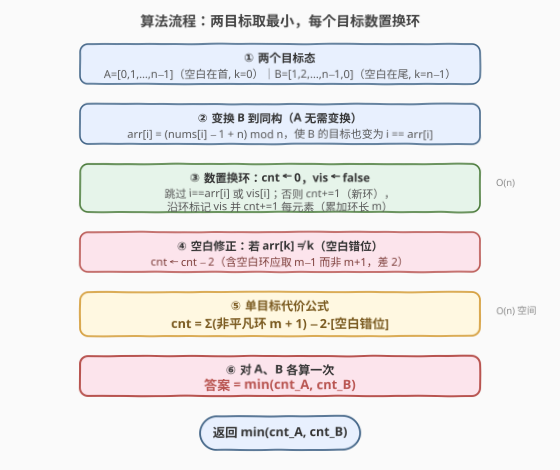

# LeetCode 通过移动项目到空白区域来排序数组 题解

## 1. 题目概述

- **标题 / 题号**：通过移动项目到空白区域来排序数组（#2459，hard）
- **链接**：https://leetcode.cn/problems/sort-array-by-moving-items-to-empty-space/
- **难度**：困难
- **标签**：数组、哈希表、排序、置换环（cycle decomposition）

**题意**：给定大小为 $n$ 的整数数组 `nums`，它包含从 $0$ 到 $n-1$（含边界）的**每一个**元素各一次，即 `[0, n-1]` 的一个排列。其中元素 $1\sim n-1$ 每个都代表一项目，元素 $0$ 代表一个**空白区域**（blank）。

一次操作：你可以把**任意**一个项目移动到空白区域。等价地说，就是把「值 $0$」与「你选中的某个项目（值 $x\in[1,n-1]$）」的位置**交换**——空白于是跑到了 $x$ 原来所在的位置，$x$ 则落到空白原来所在的位置。

若所有项目编号**升序**排列、且空白在数组**开头或结尾**，则认为 `nums` 已排序。例如 $n=4$ 时：

- `nums = [0,1,2,3]`（空白在首），或
- `nums = [1,2,3,0]`（空白在尾）

……否则视为无序。返回**排序 `nums` 所需的最小操作数**。

**示例 1**：

```text
输入：nums = [4,2,0,3,1]
输出：3
解释：
- 把项目 2 移到空白处。现在 nums = [4,0,2,3,1]。
- 把项目 1 移到空白处。现在 nums = [4,1,2,3,0]。
- 把项目 4 移到空白处。现在 nums = [0,1,2,3,4]。
```

**示例 2**：

```text
输入：nums = [1,2,3,4,0]
输出：0
解释：空白已在尾部，项目已升序，无需操作。
```

**示例 3**：

```text
输入：nums = [1,0,2,4,3]
输出：2
解释：
- 把项目 2 移到空白处。nums = [1,2,0,4,3]。
- 把项目 3 移到空白处。nums = [1,2,3,4,0]。
```

**约束**：

- $n = \text{nums.length}$
- $2 \le n \le 10^5$
- $0 \le \text{nums}[i] < n$
- `nums` 的所有值**唯一**。

> 💡 **题眼**：每次操作 = 「交换空白 $0$ 与某项目」= 只能与空白做交换。这是经典的「**受限交换排序**」：把目标态视作恒等置换，当前数组视作一个置换，问题归约为「只能与值 $0$ 交换时，最少几步把置换归位」。解这类问题的招牌工具是**置换的循环分解（cycle decomposition）**，且「含空白的环」与「不含空白的环」代价不同。

## 2. 解题思路

### 2.1 暴力思路：状态空间 BFS

最直白的做法是把整个数组当成一个**状态**（长度 $n$ 的元组），把「交换值 $0$ 与某个项目」视作转移，对状态空间做 BFS，首次到达任一目标态（`[0,1,...,n-1]` 或 `[1,2,...,n-1,0]`）即得最少步数。

```text
queue = deque([(tuple(nums), 0)])
seen = {tuple(nums)}
while queue:
    state, d = queue.popleft()
    if sorted(state) in (A, B): return d
    z = state.index(0)
    for x in 1..n-1:
        swap(state[z], state[pos_of(x)])   # 交换 0 与 x
        if new not in seen: seen.add(new); queue.append((new, d+1))
```

> ⚠️ 状态数是 $n!$ 量级——$n=10^5$ 时连「枚举一个状态」都做不到，BFS 只对极小的 $n$（如 $n\le 8$）可行。问题出在「把整个数组当状态、只看一步转移」，忽略了置换的**代数结构**：交换 $0$ 与 $x$，等价于让 $0$ 沿「$x$ 所属的环」走一步。

### 2.2 核心观察：置换环 + 与空白交换的代价

![置换环视角：i→nums[i] 成环，空白归宿落在某个环里；含空白环 m−1 次，不含则 m+1 次](../images/moveblank_concept.svg)

把目标态 $A=[0,1,\dots,n-1]$（空白在首）视作恒等置换「位置 $i$ 应放值 $i$」。当前 `nums` 是 $[0,n-1]$ 的一个置换，画出函数图 $i \mapsto \text{nums}[i]$：因为每个值唯一、每个位置也只被一个值占，每个节点**出度 = 入度 = 1**，故函数图是若干**不相交的环**（含长度为 $1$ 的自环 = 已归位）的并集——这就是置换的循环分解。

> 💡 这与 [565. 数组嵌套](https://leetcode.cn/problems/array-nesting/)、[287. 寻找重复数](https://leetcode.cn/problems/find-the-duplicate-number/) 是**同一个结构**：$i \mapsto \text{nums}[i]$ 的函数图天然成环。差别只在本题要在环上「走空白」把元素归位。

**关键定理**（与空白交换排序的最少次数）：

- 设一个非平凡环（长度 $m \ge 2$，即含 $m$ 个错位元素）。
- **若该环含空白**（即「空白的归宿位置 $k$」落在环上，等价于 $\text{nums}[k] \neq k$、空白错位）：
  - 代价 $= m - 1$。空白沿环走，每换入一个错位元素就让它归位一个，走 $m-1$ 步后剩 $0$ 自动归位。
- **若该环不含空白**：
  - 代价 $= m + 1$。先用 $1$ 步把空白换进环（合并成一个长 $m+1$ 的环且含空白），再走 $(m+1)-1=m$ 步归位，合计 $1+m=m+1$。归位后空白也回到自己的归宿。

> ⚠️ 「含空白」指**含空白的归宿位置** $k$。对目标 $A$，空白是值 $0$、归宿 $k=0$；对目标 $B$（空白在尾），归宿 $k=n-1$。判断方式统一为 `nums[k] != k`：空白不在归宿 → 它必然落在某个非平凡环里，那个环就「含空白」。

把所有非平凡环的代价求和，注意：**至多只有一个环含空白**（空白只在一个位置）。若用「都按 $m+1$ 算」再修正，只需在空白错位时**整体减 $2$**（把那一个环从 $m+1$ 改回 $m-1$，差正好 $2$）。于是单目标代价：

$$\text{cnt} = \sum_{\text{非平凡环}} (m + 1) \;-\; 2 \cdot [\,\text{nums}[k] \neq k\,]$$

> 💡 **为什么减 $2$ 而不是逐环判**：所有非平凡环按 $m+1$ 求和，再一次性判断「空白是否错位」减 $2$。因为含空白的环**唯一**，减一次即可；若空白已归位（自环，被跳过、贡献 $0$），则无需减。这正是参考代码里 `cnt - 2*(nums[k]!=k)` 的来历。

### 2.3 算法流程图



整体是一条流水线：先确定两个目标态 $A$（空白在首，$k=0$）与 $B$（空白在尾，$k=n-1$）；对 $B$ 做一次值域平移 $\text{arr}[i]=(\text{nums}[i]-1+n)\bmod n$ 使其目标也变成恒等置换；随后对每个目标跑同一函数：数环求 $\sum(m+1)$，若 `arr[k]≠k` 再减 $2$；最后取两目标代价的最小值。

> 💡 **$B$ 的平移变换怎么来的**：目标 $B=[1,2,\dots,n-1,0]$ 在位置 $i$ 应放值 $i+1$（$i<n-1$）、位置 $n-1$ 放值 $0$。定义 $T(v)=(v-1+n)\bmod n$，则 $T(B[i])=i$（$T(i+1)=i$、$T(0)=n-1$）。于是令 $\text{arr}=T(\text{nums})$，对 $\text{arr}$ 求的恒等置换代价就是对原数组求 $B$ 态代价，空白归宿变 $k=n-1$。一行变换把两个目标**复用同一函数**。

### 2.4 示例演算

![示例演算：nums=[4,2,0,3,1] 对两个目标各算一次，取最小](../images/moveblank_example_walkthrough.svg)

以示例 1 `nums = [4,2,0,3,1]`（$n=5$）演算：

**目标 $A=[0,1,2,3,4]$，$k=0$**：函数图 $i\mapsto\text{nums}[i]$：

| 环 | 节点 | 长度 $m$ | 含空白归宿($k=0$)？ | 计入 |
|------|------|---------|----------------------|------|
| 环 1 | $0\to4\to1\to2\to0$ | $4$ | 是（位置 $0$ 在环上，`nums[0]=4≠0`） | $m+1=5$，因错位再 $-2$ |
| 环 2 | $3\to3$（自环） | $1$ | — | 跳过（$0$） |

$\text{cnt}_A = 5 - 2 = 3$。

**目标 $B=[1,2,3,4,0]$，$k=4$**：$\text{arr}[i]=(\text{nums}[i]-1+5)\bmod 5 = [3,1,4,2,0]$，函数图 $i\mapsto\text{arr}[i]$：

| 环 | 节点 | 长度 $m$ | 含空白归宿($k=4$)？ | 计入 |
|------|------|---------|----------------------|------|
| 环 1 | $0\to3\to2\to4\to0$ | $4$ | 是（位置 $4$ 在环上，`arr[4]=0≠4`） | $m+1=5$，因错位再 $-2$ |
| 环 2 | $1\to1$（自环） | $1$ | — | 跳过（$0$） |

$\text{cnt}_B = 5 - 2 = 3$。

> ⚠️ 两个目标结构同构（都是单个长 $4$ 环含空白），故代价相同。$\text{答案}=\min(3,3)=3$ ✓，与示例一致。空白实际沿环走的轨迹正是题面解释里的：换 $2\to$ 换 $1\to$ 换 $4$，三步归位。

## 3. 参考代码

### C++

```cpp
class Solution {
public:
    int sortArray(vector<int>& nums) {
        int n = nums.size();
        auto f = [&](vector<int>& a, int k) {
            vector<bool> vis(n, false);
            int cnt = 0;
            for (int i = 0; i < n; ++i) {
                if (i == a[i] || vis[i]) continue;
                ++cnt;                     // 又一个非平凡环：贡献 +1
                int j = i;
                while (!vis[j]) {
                    vis[j] = true;
                    ++cnt;                 // 累加环长 m
                    j = a[j];
                }
            }
            if (a[k] != k) cnt -= 2;        // 含空白环应取 m-1 而非 m+1，整体差 2
            return cnt;
        };

        int cntA = f(nums, 0);             // 目标 A：空白在首
        vector<int> arr(n);
        for (int i = 0; i < n; ++i)
            arr[i] = (nums[i] - 1 + n) % n; // 目标 B：值域左移一位
        int cntB = f(arr, n - 1);
        return min(cntA, cntB);
    }
};
```

> 💡 `f` 内层 `while` 用下标 `j = a[j]` 沿环走，每个元素只访问一次，总代价 $O(n)$。`vis` 必须开，否则同一环会被多个起点重复计数。`a[k] != k` 判空白错位——空白在归宿时它是自环、已被 `i==a[i]` 跳过、贡献 $0$，正好不需要修正。

### Python

```python
class Solution:
    def sortArray(self, nums: List[int]) -> int:
        def f(a: List[int], k: int) -> int:
            n = len(a)
            vis = [False] * n
            cnt = 0
            for i in range(n):
                if i == a[i] or vis[i]:
                    continue
                cnt += 1                  # 新非平凡环：+1
                j = i
                while not vis[j]:
                    vis[j] = True
                    cnt += 1              # 累加环长 m
                    j = a[j]
            if a[k] != k:                 # 空白错位：含空白环取 m-1
                cnt -= 2
            return cnt

        n = len(nums)
        cntA = f(nums, 0)                                   # 目标 A：空白在首
        arr = [(v - 1 + n) % n for v in nums]               # 目标 B：值域左移一位
        cntB = f(arr, n - 1)
        return min(cntA, cntB)
```

> 💡 Python 语义与 C++ 一一对应：`a[k] != k` 即「空白不在归宿」。两目标各调一次 `f`，复杂度仍 $O(n)$。无需排序、无需哈希（下标即键），`vis` 用布尔数组比哈希集更快。

## 4. 复杂度分析

| 维度 | 复杂度 | 说明 |
|------|--------|------|
| **时间复杂度** | $O(n)$ | 每个 `f`：外层 `for` + 内层 `while` 合计访问每下标 $\le 1$ 次，总 $O(n)$；调用两次仍 $O(n)$ |
| **空间复杂度** | $O(n)$ | `vis` 布尔数组（$n$）+ 目标 $B$ 的 `arr`（$n$）；可用原地修改把 `arr` 省到 $O(1)$ 额外 |
| 对照：状态 BFS | $O(n!)$ / $O(n!)$ | 状态空间爆炸，仅极小 $n$ 可行；正确但不可用 |
| 对照：贪心模拟实际交换 | $O(n)$ / $O(n)$ | 真把空白沿环走一遍、逐次归位也能 $O(n)$，但本题只要**计数**，环分解更直接、常数更小 |

> 💡 $n \le 10^5$，$O(n)$ 必过。`vis` 可用 `vector<char>` 替代 `vector<bool>` 以加速（`vector<bool>` 按位压缩、访问有代理开销），但本题规模下差别可忽略。

## 5. 扩展：与「任意交换排序」的关系

如果把限制从「只能与空白交换」放宽为「任意两元素交换」，最少交换次数就是经典结论 $\;n - c\;$（$c$ 为置换的环数，含长度 $1$ 的自环），这正是 [765. 情侣牵手](https://leetcode.cn/problems/couples-holding-hands/) 的骨架。对照可见「只能与空白交换」是一种**受限变体**：

| 模型 | 单环代价 | 合计 |
|------|----------|------|
| 任意交换 | $m - 1$ | $\sum(m-1) = n - c$ |
| 只与空白交换 | 含空白 $m-1$；不含 $m+1$ | $\sum(m+1) - 2\cdot[\text{空白错位}]$ |

> 💡 直觉：任意交换能一步同时改两个环（各取一元素互换），效率上限更高；受限交换里空白是唯一的「搬运工」，对不含它的环要多花 $2$ 步（进 $1$ 步 + 出 $1$ 步）。两者都以「置换的环分解」为底，差别只在环代价的取值——这是「同一结构、不同代价函数」的典型对照。

> ⚠️ 题面允许空白停在**首或尾**两种目标态，所以必须对 $A$、$B$ 各算一次取 $\min$。若只算其中之一会漏掉另一种「更省」的归位方式（如示例 2 的 `[1,2,3,4,0]` 只满足 $B$）。

## 6. 面试要点

1. **为什么是置换环？「含/不含空白」环代价为何差 $2$？**

   - 目标态是恒等置换，当前数组是一个置换，其函数图 $i\mapsto\text{nums}[i]$ 必为不相交环之并。与空白交换 = 让空白沿环走。含空白的环（长 $m$）：空白走 $m-1$ 步即可让其余 $m-1$ 个元素全归位、剩 $0$ 自动到位，代价 $m-1$。不含空白的环：需先 $1$ 步把空白换入（合并成长 $m+1$ 的含空白环），再走 $(m+1)-1=m$ 步，合计 $1+m=m+1$。两者差正好 $2$，故「都按 $m+1$ 算、空白错位时整体减 $2$」。

2. **`-2` 的判断条件 `nums[k] != k` 准确含义？会不会多减？**

   - $k$ 是空白归宿（目标 $A$ 时 $k=0$，$B$ 时 $k=n-1$）。`nums[k]!=k` ⟺ 空白不在归宿 ⟺ 空白落在某个非平凡环里 ⟺ 存在「含空白环」。因为空白唯一，这样的环至多一个，减一次 $2$ 不会多减。若空白已归位，它是长度 $1$ 的自环，被 `i==a[i]` 跳过、贡献 $0$，此时不减，结果正确。

3. **为什么要算两个目标再取 min？只算空白在首不行吗？**

   - 题面定义「已排序」允许空白在首 `[0,1,…,n-1]` **或**在尾 `[1,2,…,n-1,0]`。两种归位方式的置换结构不同（值域差一个左移），代价可能不同，必须各算取小。示例 2 `[1,2,3,4,0]` 只满足尾部目标：算 $A$ 要 $4$ 步、算 $B$ 要 $0$ 步，取 $\min=0$。

4. **目标 $B$ 的变换 `arr[i]=(nums[i]-1+n)%n` 为什么能复用同一函数？**

   - 目标 $B$ 要求「位置 $i$ 放值 $i+1$（$i<n-1$）、位置 $n-1$ 放值 $0$」。对值做 $T(v)=(v-1+n)\bmod n$ 后，$T(B[i])=i$，即 $B$ 态被映成恒等置换。于是对 $\text{arr}=T(\text{nums})$ 求「到恒等置换的受限交换代价」就等于对原数组求「到 $B$ 态的代价」，空白归宿同步变为 $k=n-1$。一行变换把两目标统一成同一子问题。

5. **$n=10^5$ 时 BFS 为什么彻底不可行？环分解为什么是 $O(n)$？**

   - 状态是长度 $n$ 的排列，状态空间 $n!$；$n=10^5$ 时连一个状态的哈希都存不下、转移分支 $n-1$ 也太宽。环分解不枚举状态：它只沿函数图走，每个下标在整个算法里只被访问一次（`vis` 标记保证），故两次 `f` 合计 $O(n)$ 时间、$O(n)$ 空间。

> 💡 **一句话总结**：把数组看成置换、画 $i\mapsto\text{nums}[i]$ 的不相交环；只能与空白交换时，含空白环代价 $m-1$、不含的 $m+1$，合计 $\sum(m+1)-2\cdot[\text{空白错位}]$；空白可停在首或尾，对两个目标各算一次取 $\min$，全程序 $O(n)$。

## 同类练习题

| # | 题目 | 与本题的关联 |
|---|------|-------------|
| 765 | [情侣牵手](https://leetcode.cn/problems/couples-holding-hands/)（[题解](../0701-0800/765_情侣牵手.md)） | 「最小交换使置换归位」的招牌题，任意交换下代价 $n-c$；本题是「只能与空白交换」的受限变体，对照理解环代价 $m-1$ vs $m+1$ 的差异 |
| 565 | [数组嵌套](https://leetcode.cn/problems/array-nesting/)（[题解](../0501-0600/565_数组嵌套.md)） | 同一结构 $i\mapsto\text{nums}[i]$ 成不相交环，求最长环；理解「置换的函数图必成环」这一底层不变量 |
| 287 | [寻找重复数](https://leetcode.cn/problems/find-the-duplicate-number/)（[题解](../0201-0300/287_寻找重复数.md)） | 在 $i\mapsto\text{nums}[i]$ 的函数图上用 Floyd 快慢指针判环，与本题共享「数组即隐式函数图」的视角 |
| 2360 | [图中的最长环](https://leetcode.cn/problems/longest-cycle-in-a-graph/)（[题解](../2301-2400/2360_图中的最长环.md)） | 泛化到出度为 $1$ 的有向函数图上找最长环，同样是「沿后继指针走、标记访问」的 $O(n)$ 环遍历模板 |
