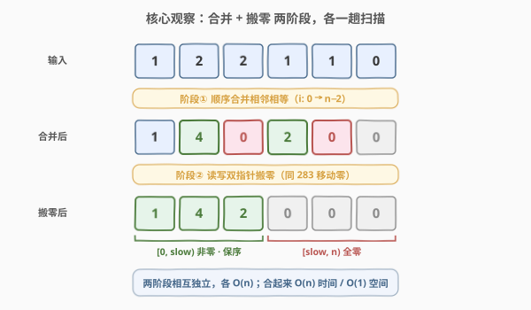
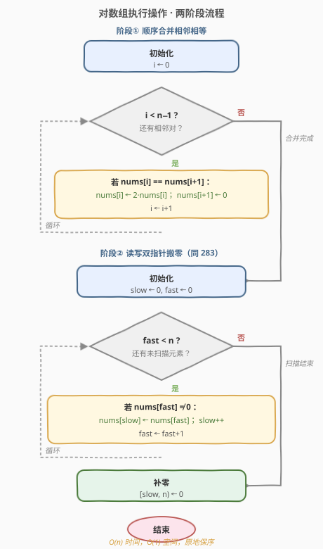

# 对数组执行操作

- **题目名称**：对数组执行操作
- **链接**：[2460. 对数组执行操作](https://leetcode.cn/problems/apply-operations-to-an-array/)
- **难度**：简单
- **标签**：数组、双指针、模拟

## 1. 题目概述

给定下标从 0 开始、长度为 $n$ 的非负整数数组 `nums`。需依次执行 $n-1$ 步操作（第 $i$ 步，$i$ 从 0 计数）：

- 若 `nums[i] == nums[i+1]`，则 `nums[i]` 变为原来的 $2$ 倍，`nums[i+1]` 变为 $0$；
- 否则跳过本步。

**全部操作执行完后**，再将所有 $0$ 移动到数组**末尾**。返回结果数组。注意操作必须**依次有序**执行，而非一次性并行。

**示例 1**：

```text
输入：nums = [1,2,2,1,1,0]
输出：[1,4,2,0,0,0]
解释：
  i=0: 1≠2，跳过
  i=1: 2==2 → nums[1]=4, nums[2]=0   → [1,4,0,1,1,0]
  i=2: 0≠1，跳过
  i=3: 1==1 → nums[3]=2, nums[4]=0   → [1,4,0,2,0,0]
  i=4: 0==0 → 无变化
  搬零后 → [1,4,2,0,0,0]
```

**示例 2**：

```text
输入：nums = [0,1]
输出：[1,0]
解释：无法执行合并操作，仅搬零。
```

**约束条件**：

- $2 \le \text{nums.length} \le 2000$
- $0 \le \text{nums[i]} \le 1000$

> ⚠️ 「依次执行」是关键：第 $i$ 步修改 `nums[i+1]` 后，第 $i+1$ 步读到的正是修改后的值。但经分析（见 2.2），这一依赖在合并后置零的语义下可被「跳过零」等价替代，从而允许把「合并」与「搬零」解耦成两个独立阶段。

---

## 2. 解题思路

### 2.1 暴力思路

最朴素的写法分两步，但都写得「重」：

- **合并**：原地顺序扫一遍执行相邻合并，$O(n)$。
- **搬零**：每遇到一个 $0$ 就逐个往后交换（冒泡），把 $0$ 推到末尾，$O(n^2)$；或开一个新数组收集非零再拷回，$O(n)$ 额外空间。

> 💡 暴力法的浪费在「搬零」阶段：把零「一个个挪」既慢又易错，或要额外空间。其实「把零移到末尾、非零保序前置」是一个有标准模板的**读写双指针**问题——这正是 [283. 移动零](../0201-0300/283_移动零.md) 的原题。把搬零换成这套模板，两阶段就都是 $O(n)$ 且 $O(1)$ 空间。

### 2.2 核心观察：两阶段拆分 + 读写双指针搬零



**观察 1（合并与搬零可解耦）**：合并阶段只产生两类结果——「保留/翻倍的值」与「被置零的位」。置零后的元素在后续步骤中参与比较时，由于 $0$ 与任何非零数都不相等、$0$ 与 $0$ 合并仍是 $0$（no-op），所以「依次执行」对最终非零序列**没有额外影响**。于是可以先一趟完成所有合并，再一趟搬零。

**观察 2（搬零 = 读写双指针，同 283）**：用**写指针** `slow` 与**读指针** `fast` 把数组划成三段：

- $[0,\text{slow})$：已落位的非零元素（**相对顺序正确**）；
- $[\text{slow},\text{fast})$：被越过、待回收为 $0$ 的空位；
- $[\text{fast},n)$：尚未扫描的元素。

`fast` 一路扫，遇非零就「搬到」`slow` 处并推进 `slow`，遇 $0$ 就跳过；扫完后 $[\text{slow},n)$ 全部填 $0$。

> 💡 **关键转化**：题目 = 「相邻相等合并」+「移动零」两个**独立**子任务的串联。前者是一次简单模拟，后者直接复用 283 的读写双指针模板，判据就是 `nums[fast] != 0`。两阶段各 $O(n)$，合起来 $O(n)$ 时间、$O(1)$ 空间，原地保序。

### 2.3 算法流程图



1. **阶段①**：`i` 从 $0$ 到 $n-2$，若 `nums[i]==nums[i+1]` 则 `nums[i]*=2; nums[i+1]=0`。
2. **阶段②**：`slow=0`；`fast` 从 $0$ 到 $n-1$，若 `nums[fast]!=0` 则 `nums[slow++]=nums[fast]`；最后 $[\text{slow},n)$ 填 $0$。

### 2.4 示例演算

![示例演算：nums = [1,2,2,1,1,0]](../images/2460_example_walkthrough.svg)

以 `nums = [1,2,2,1,1,0]` 为例，逐步执行：

| 步骤 | 比较对 | 动作 | 数组状态 |
|------|--------|------|----------|
| i=0 | 1,2 | 不等，跳过 | `[1,2,2,1,1,0]` |
| i=1 | 2,2 | 相等 → 4,0 | `[1,4,0,1,1,0]` |
| i=2 | 0,1 | 不等，跳过 | `[1,4,0,1,1,0]` |
| i=3 | 1,1 | 相等 → 2,0 | `[1,4,0,2,0,0]` |
| i=4 | 0,0 | 相等 → 无变化 | `[1,4,0,2,0,0]` |
| 搬零 | — | 非零 1,4,2 前置，末尾补零 | **`[1,4,2,0,0,0]`** ✓ |

---

## 3. 参考代码

### C++

```cpp
class Solution {
  public:
    vector<int> applyOperations(vector<int>& nums) {
        int n = nums.size();
        // 阶段① 顺序合并相邻相等
        for (int i = 0; i + 1 < n; ++i) {
            if (nums[i] == nums[i + 1]) {
                nums[i] *= 2;
                nums[i + 1] = 0;
            }
        }
        // 阶段② 读写双指针搬零（同 283）
        int slow = 0;
        for (int fast = 0; fast < n; ++fast) {
            if (nums[fast] != 0) {
                nums[slow++] = nums[fast];
            }
        }
        for (int i = slow; i < n; ++i) nums[i] = 0;
        return nums;
    }
};
```

### Python

```python
class Solution:
    def applyOperations(self, nums: List[int]) -> List[int]:
        n = len(nums)
        # 阶段① 顺序合并相邻相等
        for i in range(n - 1):
            if nums[i] == nums[i + 1]:
                nums[i] *= 2
                nums[i + 1] = 0
        # 阶段② 读写双指针搬零（同 283）
        slow = 0
        for fast in range(n):
            if nums[fast] != 0:
                nums[slow] = nums[fast]
                slow += 1
        for i in range(slow, n):
            nums[i] = 0
        return nums
```

> 💡 两版逻辑一致。合并阶段写成 `i + 1 < n` 作循环条件，可省去对 $i=n-2$ 边界的额外判断；搬零阶段完全复用 283 的「覆盖 + 末尾补零」写法，注意补零不可省——覆盖只搬非零，原 $0$ 位置可能残留旧值。

---

## 4. 复杂度分析

| 维度 | 复杂度 | 说明 |
|------|--------|------|
| 时间复杂度 | $O(n)$ | 合并一趟 $n-1$ 次比较 + 搬零一趟 $n$ 次扫描 + 至多 $n$ 次补零，共至多 $3n$ 次操作 |
| 空间复杂度 | $O(1)$ | 仅用 `i`/`slow`/`fast` 等常数个指针，原地修改并返回原数组 |

---

## 5. 扩展：合并为一趟扫描

两阶段可融合成**单趟**：让写指针 `slow` 同时承担「合并落位」与「搬零」——遇到 $0$（含被合并置零者）直接跳过，遇非零则按是否与后位相等决定写原值还是 $2$ 倍值，并把后位标记为 $0$：

```cpp
class Solution {
  public:
    vector<int> applyOperations(vector<int>& nums) {
        int n = nums.size(), slow = 0;
        for (int i = 0; i < n; ++i) {
            if (nums[i] == 0) continue;                 // 跳过零（含被置零者）
            if (i + 1 < n && nums[i] == nums[i + 1]) {
                nums[slow++] = nums[i] * 2;            // 合并值直接落位
                nums[i + 1] = 0;                       // 后位标记为零
            } else {
                nums[slow++] = nums[i];                // 原值落位
            }
        }
        while (slow < n) nums[slow++] = 0;
        return nums;
    }
};
```

**正确性要点**：

- **跳过零为何等价于「依次合并」**：第 $i$ 步若 `nums[i]==0`（被前一步置零，或本就是 $0$），则它与 `nums[i+1]` 的比较无论相等与否都是 no-op（$0==0$ 合并仍为 $0$；$0\neq x$ 跳过）。故跳过零不改变最终结果。
- **写不破坏读**：循环不变量 `slow ≤ i`，故每次写入位置 `slow` 恒在当前读位 $i$ 之前或同位，而合并判断已先读完 `nums[i+1]` 才写 `slow`，绝不会覆盖尚未读取的 `nums[i+1]`（因 `slow ≤ i < i+1`）。

> 💡 单趟写法更紧凑、写入次数更少（零元素一概不写），但不变量论证稍绕；面试时两阶段写法更易讲清、不易写错，二者复杂度相同，按场景取舍即可。

---

## 6. 面试要点

1. **为什么合并可以和搬零分开做？「依次执行」不会出问题吗？**

   > 合并只会把某些位置变成 $0$。被置零的位置在后续步骤里参与比较时：$0$ 与非零数不等→跳过；$0$ 与 $0$ 相等→合并仍为 $0$（no-op）。所以「依次」对最终保留下来的非零序列没有额外影响，合并阶段可整体先做完，再统一搬零。

2. **搬零阶段为什么用读写双指针而非冒泡？**

   > 冒泡把每个 $0$ 逐个交换到末尾是 $O(n^2)$；读写双指针一遍扫完非零前置、末尾补零，$O(n)$ 且 $O(1)$ 空间。它正是 [283. 移动零](../0201-0300/283_移动零.md) 的标准解法，判据为 `nums[fast] != 0`。

3. **末尾补零能否省略？**

   > 覆盖法不能省。搬运只写非零，原 $0$ 位置可能残留旧值（如示例中 `nums[3]` 仍为旧值）。若改用「交换写法」（`swap(nums[slow], nums[fast])`）则零被换到后段、无需补零，但每次交换是 3 次赋值，常数略大。

4. **单趟融合写法的写指针为什么不会覆盖未读数据？**

   > 不变量 `slow ≤ i` 保证写入位 `slow` 始终 ≤ 当前读位 $i$；而合并判断在读 `nums[i+1]` 之后才写，且 `slow ≤ i < i+1`，故 `nums[i+1]` 永不被本次写入破坏。对比 [1089. 复写零](../1001-1100/1089_复写零.md) 必须反向写以避覆盖——本题因 `slow ≤ i` 天然正向安全。

5. **若题目改为「相邻相等合并但不搬零」，或「合并可传递（4,4 → 8,0 后 8 又遇 8 再合并）」呢？**

   > 不搬零则去掉阶段②即可；但「可传递合并」会改变依赖关系——合并产出的新值可能与更后位相等而需再次合并，此时「跳过零」的等价性被破坏，必须严格依次模拟，不能简单解耦。本题保证不传递，故解耦成立。

> 💡 **一句话总结**：2460 = 「相邻相等合并」模拟 + 「移动零」读写双指针，两阶段各 $O(n)$、$O(1)$ 空间；搬零阶段直接复用 [283](../0201-0300/283_移动零.md) 模板，判据 `nums[fast] != 0`。

---

## 7. 同类练习题

- [283. 移动零](https://leetcode.cn/problems/move-zeroes/)（[站内题解](../0201-0300/283_移动零.md)）：本题阶段②的原型，读写双指针搬零，判据 `!= 0`
- [27. 移除元素](https://leetcode.cn/problems/remove-element/)（[站内题解](../0001-0100/27_移除元素.md)）：同款读写双指针原地删除，判据换成 `!= val`
- [1089. 复写零](https://leetcode.cn/problems/duplicate-zeros/)（[站内题解](../1001-1100/1089_复写零.md)）：同样「原地写指针」但必须**反向**写以避覆盖，与本题 `slow ≤ i` 正向安全形成对照
- [905. 按奇偶排序数组](https://leetcode.cn/problems/sort-array-by-parity/)（[站内题解](../0901-1000/905_按奇偶排序数组.md)）：双指针分区（偶前奇后），不要求稳定时的对向交换变体
